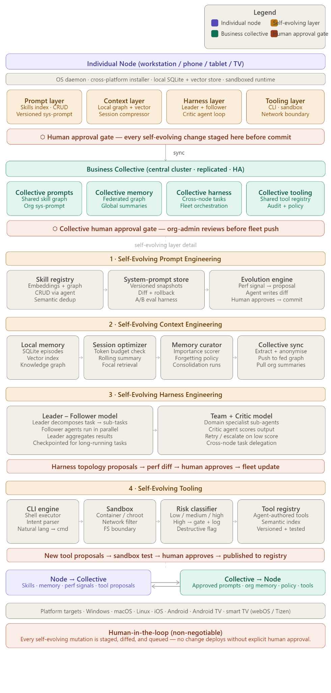

# Agent framework architecture

本文档由 `This is a meaty architecture.docx` 转换而来，是本仓库中 **agent 框架设计与行为的权威说明**；实现与配置应与此保持一致，若有冲突以本文档为准。

## North star: how people actually use the agent

The agent is **not** “an approval-queue product.” It is an **operating-system-level** assistant meant to sit **beside real work** in the same posture as **Claude Code**, **Codex**, and similar systems: embedded in the **IDE**, **terminal**, and **internal tools** that admins and employees already use. **Everyone** drives tasks through that runtime—software, creative pipelines, ops, commerce workflows—while the agent **accumulates** reusable **skills**, **memory**, and **tools** from those sessions.

**Self-evolution** means the stack **changes over time** (new skills, prompts, tool registrations, harness topology). Those **durable mutations** must pass a **governance spine** (proposal → human/org review → commit) so the system gets smarter **without silent drift**. That spine is **infrastructure**, not the main face of the product.

**Collective** (federated org layer) is where **vetted** evolved artifacts and high-signal memory are **merged and redistributed** so the whole organization benefits from what each node learned. Node ↔ collective is **bidirectional** by design.

## Implementation note (this repository)

The **`agentd`** codebase implements a **subset** of this architecture: folder-first skills/tools/memory, HTTP control plane, **`heros-cli`** (terminal LLM + tools against agentd), optional MCP (**`heros-mcp`**), optional Qdrant/Neo4j/NATS, proposal/approve flows, and collective **stubs**. It does **not** yet ship OS installers, streaming TUI polish, or end-to-end **org-wide sync** of skills and memory. Treat the sections below as **target behavior**; for an honest gap list see [`TODO.md`](TODO.md).

## **Core design principles**

The framework has two parallel instances of itself --- one running
locally on each device, one running as a federated cluster for the whole
organization. Every piece of intelligence flows both ways: nodes push
signals up, the collective pushes vetted knowledge back down.

## **OS-level installation**

The agent runs as a privileged background daemon (systemd on Linux,
launchd on macOS, Windows Service, a managed background service on
iOS/Android). The installer packages a small runtime (likely a compiled
Go binary + embedded model endpoint config) so it starts on boot,
survives reboots, and can execute shell commands with controlled
privilege. For phones and TVs, the agent runs in a restricted mode ---
read-heavy, no high-risk commands --- but contributes memory and
receives collective knowledge.

## **Layer 1 --- Self-Evolving Prompt Engineering**

The system prompt and every skill are stored in a versioned, indexed
store (think Git-like snapshots). An agent continuously monitors
performance signals (task completion rate, user corrections, session
length anomalies) and generates candidate mutations --- a new skill, a
revised system prompt section, a reordering of instructions. These
proposals are always expressed as a human-readable diff. Nothing commits
until a human approves. Once approved, the change propagates to the
collective and is indexed both semantically (vector embeddings) and
structurally (a directed graph of skill dependencies).

At the collective level, this becomes an org-wide skill graph --- when
employee A\'s workstation discovers a better way to handle SQL queries,
that skill can be proposed for the whole fleet.

## **Layer 2 --- Self-Evolving Context Engineering**

Each node keeps a local three-layer memory: episodic (raw conversation
logs in SQLite), semantic (vector embeddings for fast retrieval), and
structural (a knowledge graph linking entities, facts, and
relationships). An importance scorer runs continuously --- modeled
loosely on memory consolidation during sleep --- promoting high-signal
memories and letting low-signal ones decay.

For long-running sessions, a session optimizer watches the token budget.
When context approaches the limit it doesn\'t truncate blindly --- it
runs a focal retrieval pass to pull the most task-relevant fragments,
then generates a rolling summary that replaces the oldest turns. The
agent always knows what it\'s doing, even across a multi-hour task.

Sync to the collective extracts and optionally anonymizes memories
before pushing them to the federated graph, where they become available
(with access controls) across the organization.

**Optional vault path:** an **Obsidian-style Markdown vault** on disk can be indexed via **`knowledge_vaults`** into the same semantic retrieval path (Qdrant/SQLite), with **wikilinks** mirrored to **`graph_edges`** / Neo4j and optional **append-to-vault** for `role: note` episodic writes. See [`MEMORY-VAULT.md`](MEMORY-VAULT.md).

## **Layer 3 --- Self-Evolving Harness Engineering**

This is a hybrid of two proven patterns. The **Leader--Follower** model
handles task decomposition: a leader agent breaks a goal into sub-tasks,
dispatches them to follower agents, and aggregates results. Followers
run in parallel and checkpoint their state so long-running tasks survive
interruptions. The **Team + Critic** model runs alongside it: specialist
sub-agents (researcher, coder, writer, analyst) each produce output, and
a separate critic agent scores it against the goal criteria ---
triggering a retry loop or escalation if the score is too low.

Self-evolution here means the agent can propose changes to its own
topology: \"we should add a domain-specialist for legal review\" or
\"the critic retry threshold should be 0.7, not 0.5.\" These topology
proposals are diffed against the current config and queued for human
approval before any structural change takes effect.

## **Layer 4 --- Self-Evolving Tooling**

The CLI engine translates natural language intent into shell commands,
with every command passing through a three-tier risk classifier before
execution. Low-risk commands (read-only, reversible) execute
immediately. Medium-risk commands (writes, network calls) log and
notify. High-risk commands (destructive operations, privileged access,
cross-system mutations) are blocked behind an explicit human
confirmation step.

The sandbox uses OS-level isolation (containers, namespaces, chroot, or
the platform equivalent) with a network egress filter --- the agent
cannot phone home to unexpected endpoints. New tools are authored by the
agent itself, tested in the sandbox, semantically indexed, then proposed
for publishing --- never deployed without human sign-off.

## **Human approval flow (governance spine for durable mutations)**

This pipeline applies when the **agent stack itself** is about to change (Layer 1–4 mutations). It does **not** define day-to-day interaction: users primarily **work through** IDE/MCP/API clients; approval is a **safety and policy** layer, optionally surfaced as a small web panel or an org dashboard—not “the app” in the Claude Code sense.

Every self-evolving mutation follows the same pipeline regardless of
layer:

1.  Agent generates a proposal with a rationale and a diff

2.  Proposal enters a review queue (local UI or collective dashboard)

3.  Human reviews, can edit, approves or rejects

4.  On approval: change commits, hash is recorded, rollback pointer is
    set

5.  Metrics are collected post-deploy to feed the next evolution cycle

This ensures the system gets smarter over time without ever going rogue.

## **Recommended tech stack sketch**

The daemon and sync layer in **Go** for cross-platform native
performance. The agent runtime talking to a hosted or local LLM via a
standard API. Memory layer using **SQLite + pgvector or Qdrant**.
Knowledge graph in **Neo4j or a lightweight embedded graph DB**.
Collective cluster on **Kubernetes** with a message broker (Kafka or
NATS) for node-to-collective sync. **Primary clients**: **`heros-cli`** (terminal agent), internal apps calling the daemon HTTP API, and optionally IDE MCP hosts via **`heros-mcp`**. **Optional**:
lightweight web panel on the daemon for **proposal review** only, when
no other review surface exists.

Want me to dive deeper into any specific layer --- the data schemas, the
sync protocol, the harness orchestration logic, or the installer
packaging strategy?
