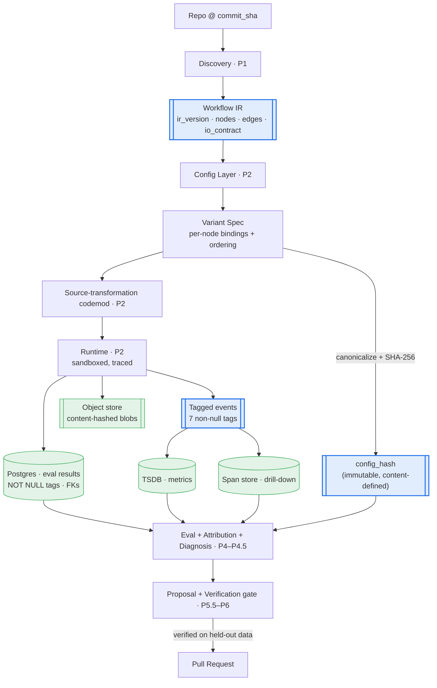
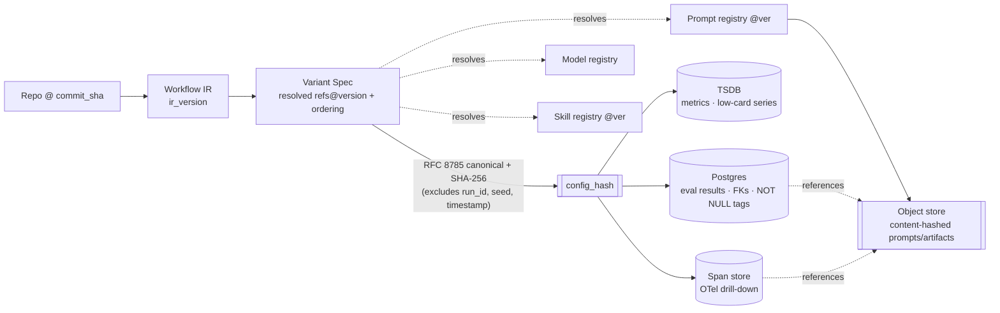
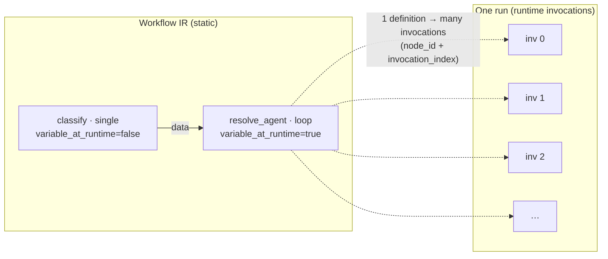

# End-to-End Architecture & Lineage (P0)

| Field | Value |
|---|---|
| Phase / Milestone | P0 / M0 |
| Owner | System Designer (lead) |
| Status | Draft — freeze at M0 |
| Tasks | 1.8 (this diagram set) |
| Cross-refs | `docs/prd/P0-foundations.md` §8.4–§8.5; `docs/decisions/storage-decision-record.md`; `docs/decisions/config-hash-spec.md` |

The canonical Mermaid diagrams for P0. They are the single source the PRD references for the
end-to-end flow and the lineage of a `config_hash`. Nothing here runs in P0 — the diagrams show the
contracts and the shape everything downstream builds toward.

---

## 1. End-to-end architecture (repo → verified PR)

How a repo becomes a verified optimization, and where the P0 contracts (IR, `config_hash`, the
seven-tag event, the three stores) sit. Phase labels show where each stage is *built*; P0 freezes the
**bold** contracts they all depend on.

**Reading it:** the four bold/blue nodes are P0's deliverables — every downstream phase reads or writes
them. *Diagnosis proposes, verification decides*: no edge reaches **Pull Request** without passing the
verification gate on held-out data.

## 2. Lineage of a config_hash (reproducibility unit)

How a configuration becomes an immutable hash, what the hash keys, and how it resolves back to exact
bytes. This is the picture behind `config-hash-spec.md`.

**Reading it:** `config_hash = SHA-256(canonical(resolved_config))`, **excluding** `run_id`, `seed`,
`timestamp` — so the same config under seeds 1..5 shares one hash and multi-seed results roll up. The
hash resolves through the versioned registries and content-hashed blobs, so any result is replayable
from lineage alone. Reproducibility unit = **`config_hash + seed`**.

## 3. Static definition vs. runtime invocation (why node count is stable)

The IR distinguishes one *static definition* from its *many runtime invocations* (Decision 1). Node
count is per-definition; a loop is one node flagged `variable_at_runtime`, not N nodes.

**Reading it:** a repo with 20 call sites — one an agent loop — reports **20** nodes. The loop fires a
runtime-variable number of times; each firing is a `runtime-invocation` record referencing the one
definition's `node_id`, so metrics attribute a variable count of invocations back to a stable node,
and the graph stays diffable across runs.
