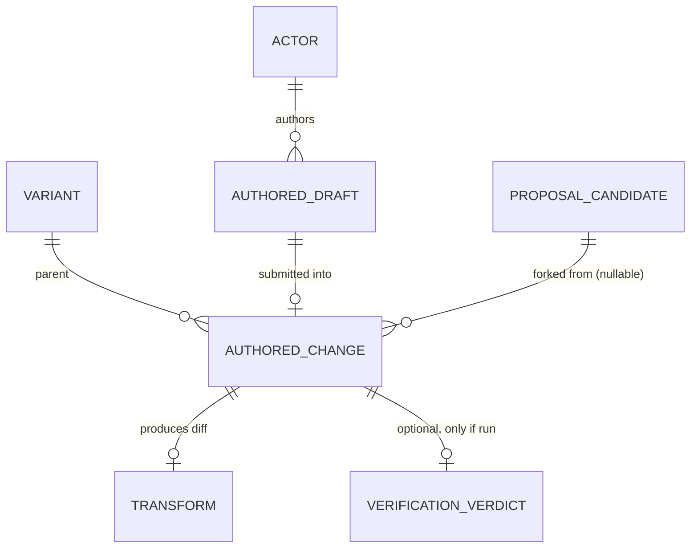
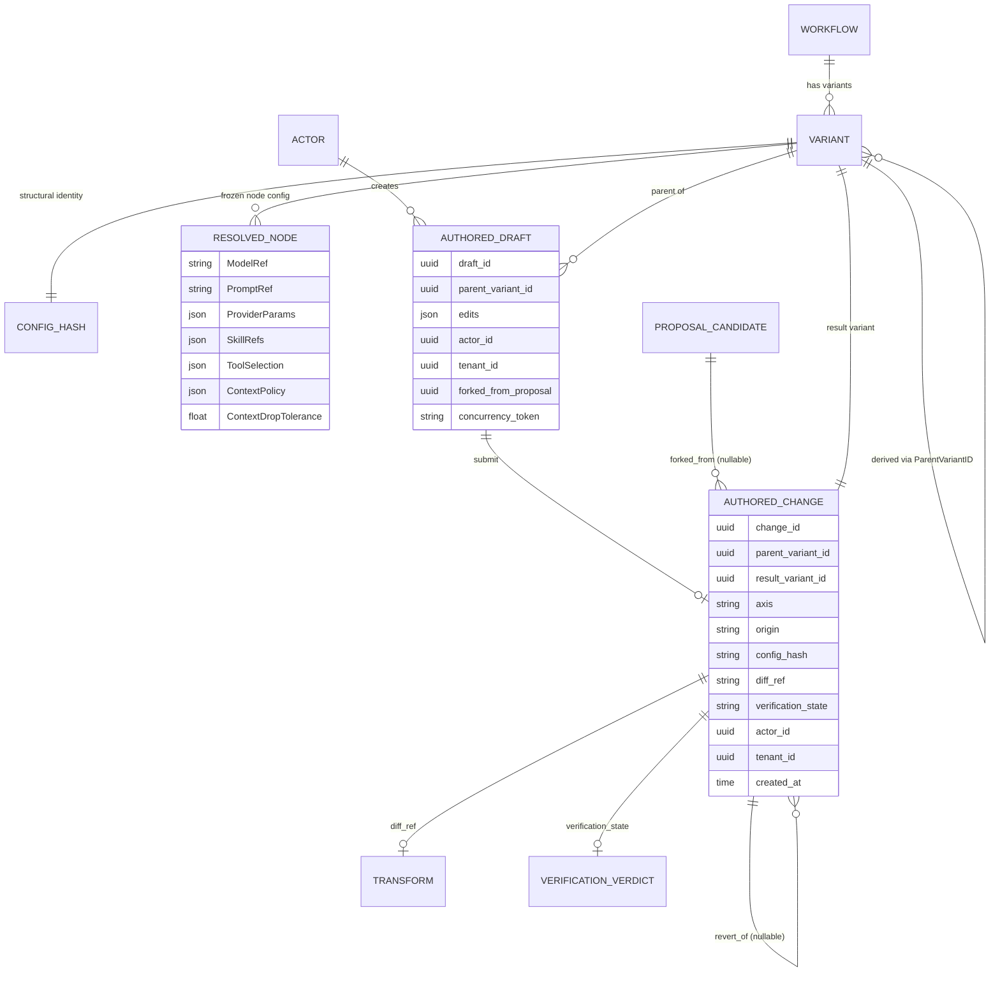
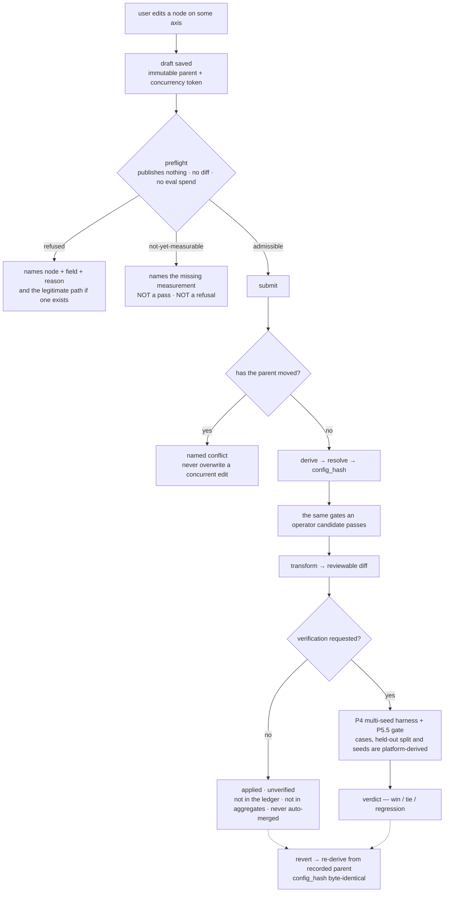
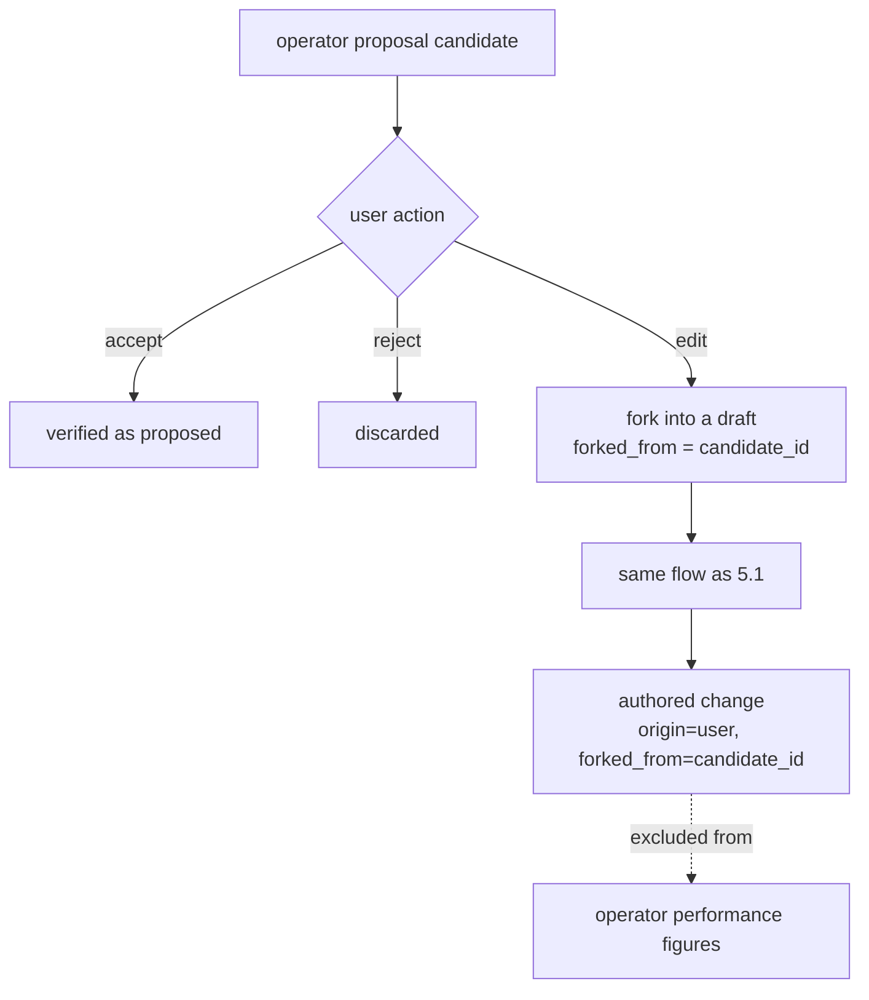
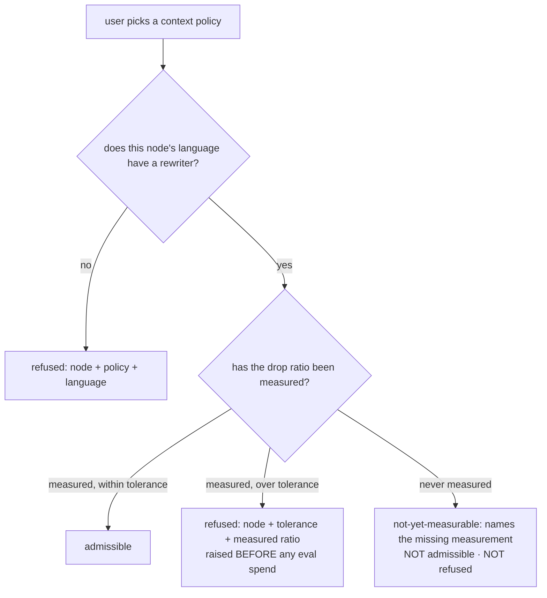

# Authored Change — Data Model & Business Flows

| Field | Value |
|---|---|
| Status | Draft (reviewed alongside P13 13c / P14 14c / P15 15d / P16 16c) |
| Created | 2026-07-28 |
| Updated | 2026-07-28 |
| Related | PRDs [P13](../prd/P13-prompt-model-optimization.md) · [P14](../prd/P14-skills-tools-optimization.md) · [P15](../prd/P15-workflow-wiring-optimization.md) · [P16](../prd/P16-context-strategy-optimization.md); OpenSpec `changes/p13-prompt-model-optimization/specs/authored-change/spec.md` and the three per-axis authoring capabilities; [ADR-002](../adr/ADR-002-provider-gateway-serves-platform-callers.md), [ADR-004](../adr/ADR-004-runtime-config-binding.md) |

---

## 0. Summary — the decision in one sentence

> **A user may author the change. A user may not author the evidence.**

The four optimization axes (prompt/model, skills/tools, wiring, context) have had exactly **one origin**:
a diagnosis fires, an operator nominates, verification decides. This adds a **second origin — the user**
— without adding a second pipeline. An authored change travels the same
derive → resolve → hash → gate → transform → (optional) eval path an operator candidate does.

Three things that do not bend:

1. **Refusals are origin-blind.** No plan, role, or flag has an override.
2. **Refusals arrive early.** Preflight names the cause, the node, and the field before submission — and
   where the platform has not measured something, it says so rather than guessing in either direction.
3. **An unverified change is never a claim.** It applies, it is labeled `unverified`, and it stays out of
   the verified-delta ledger, every aggregate figure, and auto-merge.

---

## 1. Original requirement (plain language)

The ask: **"let users make active changes on these four items."**

Translated into the two concrete gaps:

- The engineer who owns the workflow **already knows** which model this node should use, which skill it
  needs, which context policy fits. The platform gives them nowhere to say it — they can only wait for a
  diagnosis to fire an operator that may not even exist for their intent.
- An operator proposes something **nearly right**. The reviewer can see the one line to change, but the
  only available actions are accept and reject. The candidate is discarded whole, and next cycle the same
  operator proposes the same near-miss.

The important observation: *verification decides* governs **what the platform may claim**, not **what a
customer may do with their own repository**. Those two have been conflated.

---

## 2. Data model (ER)

### 2.1 Legend

```
[existing]  entity already in the system, unchanged here
[new]       entity introduced by this change
──▶         direct foreign key
┄▶          indirect reference (id only, no FK)
```

### 2.2 Highlight view — only what is new



### 2.3 Full ER



**Note what is absent from `RESOLVED_NODE`: `origin` and `actor_id`.** That omission is the most
load-bearing restraint in the design; the reasoning is in §5.1.

---

## 3. New and extended elements

| Element | Type | In `config_hash`? | What it is |
|---|---|---|---|
| `AUTHORED_DRAFT` | new table | no | A pre-submission draft. Carries a concurrency token against an immutable parent. A draft is not a variant. |
| `AUTHORED_CHANGE` | new table (append-only) | no | The post-submission audit record: who, which tenant, when, from which parent, which axis, the resolved hash, the diff reference, the verification state. |
| `origin` | field (`operator` \| `user`) | **no, deliberately** | Who initiated the change. |
| `verification_state` | field (`unverified` \| `verified{verdict}`) | no | A filter condition for the ledger and every aggregate — not a UI badge. |
| `forked_from_proposal` | field (nullable) | no | Set when a user edited an operator proposal. The operator is **not** credited with the outcome. |
| `ContextDropTolerance` | optional field on `NodeOverride` / `ResolvedNode` | yes (additive, omitted when absent) | Already defined by P16; this change lets a user declare and clear it. |

### What user problem each one solves

- **`AUTHORED_DRAFT` answers "what if two people edit at once?"** — a draft hangs off an **immutable**
  parent and carries a concurrency token, so two people editing from one parent produce **two variants**,
  not one person's work silently overwritten.
- **`AUTHORED_CHANGE` answers "who changed this, and can we go back?"** — append-only, and a revert
  **derives a new variant** whose `config_hash` is byte-identical to the pre-edit one. Never an in-place
  restore.
- **`verification_state` answers "can I trust this number?"** — a change the harness never ran does not
  exist in the ledger, so it cannot leak into any "here is what we saved you" figure.

---

## 4. Relationships (direct FK vs indirect reference)

- `AUTHORED_CHANGE.parent_variant_id` / `result_variant_id` → **direct FK to VARIANT.** Variants are
  immutable and never deleted, so the key is safe.
- `AUTHORED_CHANGE.forked_from_proposal` → **indirect: id only, no FK.** A proposal candidate is an
  in-memory artifact with a much shorter life than the record; an FK would turn "the proposal expired"
  into "the audit record cannot be stored."
- `AUTHORED_CHANGE.diff_ref` → **indirect** reference to the content-addressed transform output. A
  transform is produced once and never changes; an authored change has a lifecycle. This is the same
  boundary P12 draws for delivery records.
- `AUTHORED_DRAFT.parent_variant_id` → direct FK. But a draft has **no** `config_hash`, because it has
  not been resolved, and identity comes from resolution.

---

## 5. Business flows

### 5.1 Flow one — a user changes a node directly

#### 1) User interaction

1. The user opens the page for one axis (studio / configure / wiring / context), selects a node, and
   changes something: swap the model, bind a skill, drag a node, pick a context policy.
2. **Before they submit, the surface already has an answer:**
   - *admissible* — show the diff this change would produce;
   - *refused* — say **which node, which field, and why** (e.g. "this node is in inline mode and cannot
     carry a temperature override"; "this node is Python and the skill materializer has not landed");
   - *not-yet-measurable* — "we have not measured how much this policy would discard on this node."
3. The user submits. A new variant and a reviewable diff are produced, stamped **`unverified`**.
4. They may request a verification run — or just merge it. It is their repository.
5. If they change their mind, they revert to exactly the configuration they had.

#### 2) Flow diagram



#### 3) Design key points

**Which original requirement this satisfies**

- §1's first gap: the owner already knows what to change but has nowhere to say it. Now they can — and
  they learn whether it is possible before doing the work.

**Why it is designed this way**

- **One spine, two origins — rather than a direct "edit and apply" shortcut**
  - *Problem:* should a user's edit traverse the full operator resolve/gate/transform path?
  - *Design:* yes, all of it, with no gate skipped.
  - *Why it fits:* every safety property the platform has — un-apply refusal at resolve, cross-provider
    refusal at transform, `GateReorder` before codemod, drop-tolerance before eval spend — is a property
    of **that one pipeline**, not a global property.
  - *Alternative:* a shortcut is far less code, but it does not **inherit** those properties; it
    re-implements or omits them, and an omission is invisible until a user hits it.
  - *Effect:* every future gate is added once. With two pipelines it is added twice, forever.

- **`origin` lives on the record, not in `config_hash`**
  - *Problem:* should authorship participate in configuration identity?
  - *Design:* no. `config_hash` stays purely structural.
  - *Why it fits:* a configuration a human authored and an identical one an operator proposed **are the
    same measurement** and should be scored once.
  - *Alternative:* hashing origin forks identity by authorship, breaks P0's golden vectors for every
    pre-existing configuration, and makes "have we already measured this?" unanswerable.
  - *Effect:* full audit detail on the record, zero contamination of identity.

- **Refusal moves left, into preflight**
  - *Problem:* at which layer should a refusal be raised?
  - *Design:* before submission — publishing nothing, writing no diff, spending no eval budget.
  - *Why it fits:* an operator is a program and pays nothing to learn late; a human will have written a
    prompt, picked a model, and formed an expectation. Worse, the two most common authoring refusals are
    **structural properties of the node** (apply mode, language), which the system knows *before the user
    types anything*.
  - *Alternative:* reuse the downstream refusal points — no new code, but it withholds a fact the system
    already holds until the last possible moment.
  - *Effect:* the interface never offers an action that is guaranteed to fail.

**Key business decisions**

- **Who may author?** The plan must carry the feature and the identity must carry the permission; a
  read-only identity is refused at submission.
- **Does an authored change count?** It counts as *changed*, not as *verified*. Merging into their own
  repository is the customer's right; saying "this is better" is the platform's claim and needs a verdict.
- **Can it be forced through?** No. No plan or role has an override. A refusal exists because the artifact
  would be wrong in a way the author cannot see at the moment of choosing, and a human asking for it does
  not make the SDK match.
- **Two concurrent edits?** Two variants. If the parent moved, submission is a **named conflict** — never
  a silent overwrite.
- **Who chooses the evidence?** The platform. A user may request a verification run; they cannot choose
  the cases, the held-out split, or the seeds.

**Key technical decisions**

- **Drafts are their own table, not variants** — a draft has not been resolved and so has no identity;
  storing it as a variant would put rows with no computable hash into the variant space.
- **`AUTHORED_CHANGE` is append-only** — following P12's delivery-record posture: a transform is produced
  once, an authored change has a lifecycle. A revert **adds** a row; it never edits the old one.
- **Revert re-derives from the recorded parent** — the acceptance criterion is a **byte-identical**
  `config_hash`, not "an equivalent configuration," which is the classic path by which an undo quietly
  becomes a third configuration.
- **Optimistic token, not a lock** — long-held locks are an operational burden in private deployments;
  a token plus a named conflict is sufficient and its failure mode is readable.

---

### 5.2 Flow two — a user forks an operator proposal

#### 1) User interaction

1. The user sees a proposal card that is nearly right.
2. They choose "edit this proposal" and fix the one wrong line.
3. On submit, the result is a **user-origin** change that also records the **originating proposal's id**.
4. Whatever that change later scores, it does **not** count toward the originating operator's record.

#### 2) Flow diagram



#### 3) Design key points

**Which original requirement this satisfies**

- §1's second gap: a nearly-right candidate can only be discarded whole.

**Why it is designed this way**

- **Two lineages recorded, one origin credited**
  - *Problem:* whose change is a human-corrected proposal?
  - *Design:* the user's (`origin=user`), with the originating proposal's id retained.
  - *Why it fits:* review needs to see what a change evolved from; statistics need to stay uncontaminated
    by human correction.
  - *Alternative:* crediting the operator turns its win rate into "how often humans fix it," which
    destroys the figure's usefulness for ordering operators.
  - *Effect:* lineage is traceable and the statistics stay meaningful.

**Key business decisions**

- Credit and responsibility for a corrected proposal belong to the user; the operator's prior is not
  inflated by it.
- The proposal's grounding (the failing cases it addressed) is retained but marked **inherited, not
  re-derived** — see P13 §14 open question 9.

**Key technical decisions**

- `forked_from_proposal` stores an id with no FK, because a candidate does not outlive the record.
- After the fork it is an ordinary draft; there is no second submission path.

---

### 5.3 Flow three — preflight's third answer: "not measured yet"

#### 1) User interaction

1. The user selects a different context policy for a node on the context page.
2. The system needs to decide whether that policy's drop ratio on that node exceeds the node's tolerance.
3. That (policy, node) pair has **never been measured**.
4. The surface says neither "yes" nor "no", but: **"we have not measured how much this policy discards
   here"** — naming the missing measurement.

#### 2) Flow diagram



#### 3) Design key points

**Which original requirement this satisfies**

- The part of "active change" most easily got wrong: letting users pick context strategies, on the one
  axis where a change **silently destroys information**.

**Why it is designed this way**

- **The gate never refuses on ignorance — and never passes on ignorance**
  - *Problem:* what should preflight answer when the drop ratio has not been measured?
  - *Design:* a third verdict, `not-yet-measurable`, naming what is missing.
  - *Why it fits:* the other two answers are lies with opposite signs. Answering *admissible* asserts that
    a safety check succeeded when it never ran — on the axis whose failure mode is exactly "no error
    anywhere, the answer just gets worse." Answering *refused* reports **our incomplete measurement
    coverage** as **a problem with the user's change**, and makes the axis unusable on every workflow that
    has not been evaluated yet, which is every new one.
  - *Alternative:* fail-closed is correct for **membership** questions (a tool outside the discovered set,
    a skill outside the registry) because there the missing fact is about the **user's input**. Here the
    missing fact is about **us**. Same reflex, wrong direction.
  - *Effect:* the user gets an honest statement about the platform plus a path to making it measurable,
    instead of a greyed-out control.

- **Drop ratio is always rendered as loss, never as saving**
  - *Problem:* a lossier policy shows fewer tokens — should that be drawn as a cost win?
  - *Design:* no. An `unverified` change is attributed nothing.
  - *Why it fits:* making that number honest is the entire point of the axis.
  - *Alternative:* a green arrow next to a falling token count is the easiest chart in the product to
    draw, and the most misleading.
  - *Effect:* a smaller context is "applied", not "cheaper", until the harness rules.

**Key business decisions**

- The drop gate is a **measurement**, not a guarantee, and external messaging must say so.
- A user may set the policy but **not the classifier label** — they cannot mark a node as retrieval to
  unlock retrieval parameters.
- A user declares the tolerance and the platform then holds them to it; if the node's current policy
  already exceeds a newly declared tolerance, that is **reported**, not silently accepted.

**Key technical decisions**

- Three verdicts are three **protocol-level** values, not a boolean plus a nullable reason; the surface
  renders three states.
- Preflight and the proposal path call the **same** gate function. Two implementations of the predicate
  eventually let the editor bless what the engine rejects.
- The tolerance field is additive and omitted when absent: declaring re-hashes the node, and clearing it
  must return **byte-identically** to the pre-declaration hash.

---

## 6. Key invariants (each one testable)

| # | Invariant | How it is proven |
|---|---|---|
| I1 | One apply path; an authored change bypasses no gate an operator must pass | structural test enumerating transform entry points |
| I2 | `origin` is not in `config_hash`; identical configurations from either origin share one hash | golden vectors reproduce |
| I3 | No plan, role, entitlement, flag, or parameter suppresses any refusal | asserted over the **enumerated** refusal set, not a sample |
| I4 | Preflight publishes nothing, writes no diff, enqueues no eval run | zero-side-effect assertion |
| I5 | An unmeasured input returns the third verdict — neither `admissible` nor `refused` | **both directions asserted separately** |
| I6 | `unverified` contributes exactly zero to every aggregate and is absent from the ledger | aggregate assertion |
| I7 | `unverified` never auto-merges, at any automation level | attempted at the highest level and refused |
| I8 | Revert reproduces the pre-edit `config_hash` **byte-for-byte** | byte comparison, not equivalence |
| I9 | A stale submit is a named conflict; two edits from one parent yield two variants | concurrency test |
| I10 | The CLI reaches the same verdict offline with the same typed **cause text** | cause strings compared across both paths |
| I11 | Preflight/submit payloads carry no prompt text, source, diff, env value, or credential | allowlist assertion, diagnostics included |
| I12 | Cases, held-out splits and seeds are platform-derived; classifier labels are not user-settable | assertion over the enumerated authoring surface |
| I13 | An unmaterializable wiring draft is not a scoreable variant — no eval run, no hash submitted | structural assertion (P15-specific) |

---

## 7. Delta against the baseline

**Added** — `AUTHORED_DRAFT` and `AUTHORED_CHANGE` tables; `origin` and `verification_state` fields; the
preflight endpoint; per-axis authoring controls; CLI authoring verbs.

**Changed** — nothing. Existing operators, admissibility rules, the hash contract, eval, and scoring are
all untouched.

**Removed** — nothing.

---

## 8. Upgrade & compatibility

- **New fields do not touch the hash** — `origin` lives on the record, not the configuration, so every
  historical `config_hash` and golden vector reproduces unchanged.
- **Migration** — two new tables, idempotent, guarded by semantics rather than by object name; schema,
  migration, and code land in the same change.
- **Rollback** — with authoring disabled the system behaves byte-identically to before this change, with
  no migration rollback required. That is what makes each authoring wave independently revertible.
- **Surfaces** — hosted console and offline CLI both, and the offline path must produce the same verdict
  and the same cause text as the hosted one (I10).

---

## 9. Design boundaries (what is deliberately not built)

- **No override.** No "I know what I'm doing" switch at any tier.
- **No user-selected evaluation evidence.** Cases, held-out splits, seeds, and repetition counts are
  platform-derived.
- **No user-settable classifier label**, including as a way to unlock retrieval parameters.
- **No cross-provider routing at call sites** — ADR-002's boundary does not dissolve because a human asked.
- **No score for an unmaterializable wiring change** — that would score the base configuration under a
  variant's hash, which is a false result.
- **No automatic application of a recorded intent** once its shape becomes materializable — notify, do not
  act.
- **No silent revert of a customer's merged change**, even if a later run shows it regressed — report, do
  not act.

---

## 10. Risks & exceptions

| Risk | Response |
|---|---|
| A future contributor adds a "fast path" apply and the gates drift apart | I1 structural assertion; called out in review |
| A future contributor adds an override switch | I3 asserts over the whole refusal set — a whitelist-style check would not hold the invariant |
| `unverified` gets quoted as "probably fine" inside an aggregate | I6 — it is a **ledger filter**, not a UI badge |
| The front end flattens three verdicts into two | I5 plus a three-state UI test; "cannot" and "not measured" lead to opposite user actions |
| The graph editor implies anything can be rearranged | P15 15d — every gesture gets a verdict as it is made, refused shapes are named, and they never enter the variant list |
| Drop ratio is drawn as a cost saving | I6 plus a console assertion; a smaller context is "applied", not "cheaper" |

**Exceptions:** none. Any exception must be recorded here with its authorization.

---

## 11. Relationship to other documents

- **PRD P13** — defines the cross-axis `authored-change` contract (FR21–FR33) and the prompt/model
  authoring surface.
- **PRDs P14 / P15 / P16** — each carries only its **axis-specific** rules and references P13 for the
  shared ones rather than restating them.
- **OpenSpec `specs/authored-change/spec.md`** — the testable SHALL requirements and scenarios; the source
  of acceptance criteria.
- **`openspec/project.md`** — the standing version of these conventions, loaded at the start of a session.
- **ADR-002 / ADR-004** — the cross-provider and apply-mode boundaries. Authoring does not change them; it
  surfaces them earlier, at preflight.

---

## 12. When this document must be updated

Any of the following:

1. The semantics or trigger conditions of the `not-yet-measurable` verdict change.
2. A member is added to or removed from the refusal set — especially a new gate.
3. `AUTHORED_CHANGE`'s fields change, or it stops being append-only.
4. The revert criterion loosens from byte-identical.
5. Authoring permission moves from workflow scope to node scope (P13 §14 open question 7).
6. Any axis decides to let users participate in choosing evaluation evidence — that would overturn §0's
   one-sentence decision and requires a fresh review.
