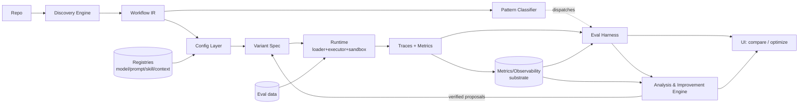
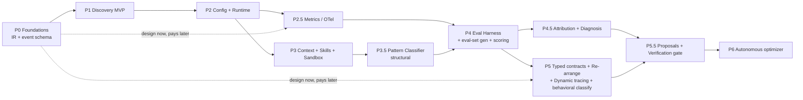

# LLM Agentic Workflow Evaluation & Configuration System — Implementation Timeline

> **Project pivot.** This repository is being repurposed from the *Heros OS-level agent*
> into a platform that ingests a codebase, discovers its LLM call graph, exposes every
> call site as a configurable node, and lets users remix models/prompts/skills/context,
> re-order nodes, then **execute, score, diagnose, and optimize** variants.
>
> This document set is the comprehensive implementation timeline. It is written by
> applying eight senior-role operating playbooks (see [`roles-and-ownership.md`](roles-and-ownership.md))
> to the [source plan](source-plan.md) so that every
> phase ships with the right questions already answered — architecture quantified,
> contracts designed, evals built before optimization, infra observable, UX validated.

## Document map

| File | What it covers |
|------|----------------|
| [`README.md`](README.md) | This file — system overview, critical path, role matrix, Gantt, milestones, cross-cutting risks |
| [`roles-and-ownership.md`](roles-and-ownership.md) | The eight senior workflows, what each owns, and how their internal phases apply here |
| [`phases-platform.md`](phases-platform.md) | **Phases 0 → 3.5** — build the platform: IR/schema, Discovery, Config+Runtime, Metrics, Context/Skills, Pattern Classification |
| [`phases-intelligence.md`](phases-intelligence.md) | **Phases 4 → 6** — measure & optimize: Eval harness, Attribution/Diagnosis, Re-arrangement/Tracing, Proposals/Verification, Autonomous loop |
| [`source-plan.md`](source-plan.md) | The verbatim source specification this timeline implements |

## 1. System overview

Four core subsystems, three cross-cutting subsystems, and three surface/commercial subsystems:

| Subsystem | Responsibility |
|-----------|----------------|
| **Discovery Engine** | Static + dynamic analysis to extract LLM nodes and their DAG into a canonical **Workflow IR** |
| **Configuration Layer** | Per-node overrides (model / prompt / skill / context) resolved from registries and applied by a **source-transformation engine (codemod)** that rewrites the call sites via a deterministic AST transformation, delivered as a reviewable diff; a **Variant Spec** is a full config |
| **Runtime** | Dynamic executor that runs a Variant Spec against live providers, sandboxed, fully traced |
| **Evaluation Harness** | Runs variants over eval sets, collects traces/metrics, compares with statistical rigor |
| **Metrics & Observability** *(cross-cutting)* | Shared OTel-based telemetry substrate every other subsystem reads from |
| **Analysis & Improvement Engine** *(cross-cutting)* | Attribution → diagnosis → verified proposals → closed-loop optimization |
| **Pattern Classifier** *(cross-cutting)* | Labels each subgraph's agentic pattern; dispatches which metrics / failure modes / operators apply |
| **Billing, Metering & Entitlements** *(cross-cutting)* | Meters LLM **spend under management** off the P2.5 telemetry substrate; enforces per-plan + per-automation-level entitlements; subscription and verified-savings billing |
| **Admin & Operations Console** *(cross-cutting, internal)* | The **internal operator / back-office** surface the platform team runs the system from — manage tenants, plans/entitlements, billing operations, optimization jobs/fleet, model registries, cross-tenant observability, audit/compliance, and global safety controls (incl. the autonomous-optimizer kill switch). A privileged **read-model + command surface** over P2.5 (metrics/cost), P4/P6 (jobs/queue), P6 (autonomous audit + kill switch) and P7 (tenants/billing/entitlements) — **not** a new pipeline, and **not** the customer Web dashboard |
| **Web Console** *(customer surface)* | The **customer-facing** dashboard, scoped to **one tenant** — graph, configure/diff, live run, eval board, diagnosis, proposal review, plus budget and automation-level governance. A Next.js application fronted by its own **BFF**, which holds the platform credential server-side so **no API key ever reaches the browser**. Like the operator console it adds **no new pipeline and no new statistics**: it renders read models P2/P2.5/P3.5/P4 already compute, and derives nothing client-side |

### Delivery surfaces

The platform reaches **customers** through three surfaces, not a desktop app. Each maps to a plan
tier and to the roles that own it:

| Surface | What it is | Tiers | Owners |
|---------|-----------|:-----:|--------|
| **CLI + CI integration** — **P11**, see [PRD](../prd/P11-cli-ci-integration.md) | Primary developer entry point. Runs discovery / codemod / eval **in the customer's own build environment** using the customer's own provider keys. Offline-first with no account; **opt-in run linking** is what gives SUM metering its input and makes results legible in the dashboard. | All tiers (incl. **Free**) | Backend, DevOps |
| **Git App / bot** (GitHub / GitLab / Bitbucket) — **P12**, see [PRD](../prd/P12-forge-delivery.md) | Delivery surface that opens the optimization **PRs** (the ADR-001 reviewable-diff output). **CI-mediated by default** — the customer's own CI opens the PR, so the platform holds no forge credential; a hosted Git App is opt-in ([ADR-005](../adr/ADR-005-forge-delivery-and-credential-posture.md)). Merged PRs are the **only** input to gainshare billing. | **Team+** | Backend, DevOps |
| **Web dashboard** (hosted SaaS) — **P9**, see [PRD](../prd/P9-web-console.md) | Graph / leaderboard / diagnosis / trend views + budget & automation-level governance + **billing / usage**. Scoped to **one tenant**. Next.js + a BFF that holds the platform credential server-side, so no API key reaches the browser. Seats & retention scale by tier. | **Team+** | Frontend, Product |

#### Internal operator surface (distinct from the customer Web dashboard)

There is a **fourth surface, but it is internal/operator-facing**, not a customer tier — the
platform team's own back-office. It has its **own admin identity + RBAC** (not a customer login,
not a plan), so it is listed separately to keep it from ever being confused with surface #3, the
customer Web dashboard. The customer dashboard governs *one tenant's* graphs, budgets, and
billing; the operator console governs *the whole platform across all tenants*.

| Surface | What it is | Audience | Owners |
|---------|-----------|:--------:|--------|
| **Admin & Operations Console** (P8) — [PRD](../prd/P8-admin-console.md) | Highest-blast-radius, **internal** operator console — a **separate Next.js app on its own origin with its own BFF**, sharing no origin, session, or bundle with the customer console: tenants, plans/entitlements, billing operations, optimization jobs/fleet, model registries, cross-tenant observability, audit/compliance, and global safety controls (incl. the autonomous-optimizer kill switch). Security-first — SSO+MFA, RBAC, least privilege, append-only audit, impersonation-with-audit. | **Platform operators only** (own admin RBAC — **not** a customer plan) | Backend, Frontend, DevOps |

**Commercial model (non-sensitive).** The value metric is **LLM spend under management (SUM)**,
aggregated from the P2.5 cost metrics. Plans are referenced by **name** — **Free / Team / Business /
Enterprise** — as named entitlement bundles that gate features by plan **and** automation level
(Autonomous auto-merge is Enterprise). Prices and plan definitions are **configuration, not in
git**; customers always use their **own provider keys** (the platform never resells tokens).

## 2. Critical path

The single hardest scheduling truth from the plan: **the IR and the event schema (Phase 0)
gate everything**, and the two most commonly *underestimated* items — the **Metrics/tagging
substrate** and the **typed per-node I/O contracts** — must be front-loaded in design even
though they pay off later.

**Two items to get right at design time in Phase 0, not when they block you:**
1. The **event tagging contract** `{variant_id, run_id, node_id, case_id, seed, timestamp, config_hash}`. Under-tagged metrics you can't slice later is the top failure mode.
2. The **typed per-node I/O contract** (input schema, output schema). It is the precondition for *safe* re-arrangement — the biggest gap in the naïve design.

## 3. Role-ownership matrix

Which of the eight senior roles leads (**L**) or supports (**S**) each phase. Full mapping in [`roles-and-ownership.md`](roles-and-ownership.md).

| Phase | System Designer | Backend Dev | AI Engineer | DevOps | Frontend Dev | Product Designer | QA Engineer | Sales Ops |
|-------|:---:|:---:|:---:|:---:|:---:|:---:|:---:|:---:|
| **P0** Foundations | **L** | S | S | S | – | S | S | – |
| **P1** Discovery MVP | S | **L** | S | S | – | S | S | – |
| **P2** Config + Runtime | S | **L** | S | S | S | S | S | – |
| **P2.5** Metrics/OTel | S | S | S | **L** | S | – | S | – |
| **P3** Context + Skills + Sandbox | S | **L** | S | **L** | – | – | S | – |
| **P3.5** Pattern Classifier | S | S | **L** | – | S | – | S | – |
| **P4** Eval Harness + gen + scoring | S | S | **L** | S | **L** | S | S | – |
| **P4.5** Attribution + Diagnosis | S | S | **L** | S | S | S | S | – |
| **P5** Contracts + Re-arrange + Tracing | **L** | **L** | S | S | **L** | **L** | S | – |
| **P5.5** Proposals + Verification | S | S | **L** | S | S | S | S | – |
| **P6** Autonomous optimizer | S | S | **L** | **L** | S | **L** | S | S |
| **P7** Billing, Metering & Entitlements | S | **L** | S | **L** | S | S | S | S |
| **P8** Admin & Operations Console | S | **L** | S | **L** | **L** | S | S | – |
| **P9** Web Console *(customer-facing)* | S | S | S | S | **L** | **L** | S | S |
| **P10** Prompt & Model Studio | S | **L** | S | S | S | **L** | S | S |
| **P11** CLI & CI Integration | S | **L** | S | **L** | S | S | S | S |
| **P12** Forge Delivery | S | **L** | S | **L** | S | S | S | S |

**QA** supports every phase rather than leading one: it owns the *acceptance gate*, so its
contribution is the definition of what would count as proof for that phase — and the honest statement
of what was not covered. **Sales Ops** appears only where a customer-facing claim is created (P6
automation levels, P7 plans, P9 console surfaces), because that is where "only promise what has
shipped" has something to govern.

## 4. Timeline (Gantt)

Assumes a team of six build-role seniors (System Designer, Backend, AI, DevOps, Frontend, Product) plus shared review, with QA and Sales Ops applied as gates rather than as additional parallel capacity, working in two-week sprints.
Durations are estimates for a first production-quality build; adjacent phases overlap where the
critical path allows. **~40 weeks (~10 months)** end to end; the read-only platform + eval harness
(through P4) is usable at **~week 22**.

```mermaid
gantt
  title Implementation Timeline (weeks)
  dateFormat X
  axisFormat %s
  section Platform
  P0 Foundations (IR + event schema)      :p0, 0, 3w
  P1 Discovery MVP (multi-language static) :p1, 3, 6w
  P2 Config + Runtime                     :p2, 6, 5w
  P2.5 Metrics / OTel                     :p25, 9, 4w
  P3 Context + Skills + Sandbox           :p3, 12, 4w
  P3.5 Pattern Classifier (structural)    :p35, 15, 2w
  section Intelligence
  P4 Eval Harness + gen + scoring         :p4, 16, 6w
  P4.5 Attribution + Diagnosis            :p45, 21, 4w
  P5 Contracts + Re-arrange + Tracing     :p5, 24, 6w
  P5.5 Proposals + Verification gate      :p55, 29, 5w
  P6 Autonomous optimizer                 :p6, 33, 7w
  section Commercial
  P7a Metering + entitlements + billing   :p7a, 22, 12w
  P7b Verified-savings / gainshare billing:p7b, 34, 6w
  section Operator
  P8a Admin RBAC + tenant/billing admin + audit :p8a, 24, 10w
  P8b Fleet ops + global autonomous controls + compliance :p8b, 34, 8w
  section Customer surface
  P9a Console BFF + shell + design system + page parity :p9a, 24, 12w
  P9b Entitlement gating + diagnosis + proposal review + cutover :p9b, 36, 8w
  P10a Prompt authoring + bindings + studio :p10a, 30, 10w
  P10b Runtime config binding + reconciliation :p10b, 40, 6w
  section Distribution
  P11a CLI core + egress boundary :p11a, 22, 10w
  P11b CI integration :p11b, 32, 6w
  P12a CI-mediated forge delivery :p12a, 36, 8w
  P12b Hosted Git App :p12b, 44, 4w
```

P7 is a cross-cutting commercialization phase that runs alongside the Intelligence track.
**Wave 7a** (metering + entitlements + subscription billing) reuses the P2.5 telemetry substrate
and is sellable once **P4** exists — the first paying tier does not wait for the autonomous loop.
**Wave 7b** (verified-savings / gainshare billing) depends on the **P5.5** verified-delta ledger;
**unverified savings are never billed**.

P8 is the **internal operator console** — the back-office the platform team runs the system from,
distinct from the customer Web dashboard. It ships in two waves and adds **no new pipeline**: it is
a privileged read-model + command surface over data P2.5/P4/P6/P7 already produce. **Wave 8a**
(admin RBAC + tenant / billing / entitlement administration + append-only audit) runs alongside
**P7** and is usable as soon as there are tenants and billing to administer. **Wave 8b** (fleet ops,
global autonomous controls incl. the cross-tenant kill switch, cross-tenant observability, and
compliance) follows once the **P6** autonomous loop and its audit trail exist to be governed
fleet-wide. Because it is the highest-blast-radius surface, it is **security-first**: SSO+MFA,
RBAC, least privilege, append-only audit, and impersonation-with-audit throughout. Its console is a
**separate Next.js application on its own origin with its own BFF** — not a role-gated section of the
customer console — so the boundary between a tenant session and a cross-tenant capability is enforced by
the browser rather than by our own routing being correct.

P9 is the **customer-facing Web dashboard** — delivery surface #3 — and is the one surface that
shipped for years without a specification. Through P4 it exists as **demo pages**: five hand-written
HTML files served from unlinked routes via `go:embed`. Those were the right call for proving P2–P4,
but they cannot be the product, because the page routes are public while every `/api/*` call they make
requires an API key — **a browser cannot authenticate to this platform at all**. P9 delivers the
console as a Next.js application fronted by its own **BFF**, so the platform credential stays
server-side and the browser only ever holds a session. **Wave 9a** is the boundary and the port
(session + credential custody, one app shell, one reconciled token set, and parity ports of the four
live surfaces against a written no-feature-loss inventory). **Wave 9b** is the product layer
(entitlement gating wired to P7, diagnosis views, the proposal-review surface once P5.5's API exists,
and the cutover that removes the legacy pages). P9 adds **no new pipeline and no new statistics** —
scores, intervals, ties and ranks stay computed in Go, and the console renders them as received.

P10 makes the platform's best-built primitive reachable. The prompt registry is already
content-addressed and structurally immutable, `{{name}}` templating already renders deterministically
and fails loudly, and per-node `model_ref`/`prompt_ref` already exist — but **nothing outside tests
ever calls the write API**, a slot can only bind to a call-site expression *spelled identically*, and
every configuration change costs a pull request. P10 adds the write path with version lineage, diff and
pre-publish impact analysis; an explicit **bindings** map (`literal` / `expr` / `env` / `input`) with
all validation at spec-resolve time; and — per [ADR-004](../adr/ADR-004-runtime-config-binding.md) — an
opt-in `bound` apply mode that makes the model and prompt **data** while wiring and call-site
expressions stay **code**, because they name things in the program's lexical scope. **Wave 10a**
(authoring + bindings + studio) carries no runtime-path risk and stands alone; **wave 10b** (the
runtime binding layer) is sequenced second so its stability surface is isolated and cuttable.

P11 and P12 are the two surfaces the README always listed and no phase ever owned — and they are where
the commercial model lives or dies. **Both revenue paths currently measure nothing.** SUM derives from
P2.5 cost events, but the CLI runs eval in the customer's environment with the customer's keys, so
those events reach no substrate; and billable savings are computed *only* from **merged-PR deltas**,
but there is no code that opens a pull request. **P11** makes the CLI complete and offline-first — free
on every plan, no account, provider keys never leaving the customer's machine — and adds an explicit,
allowlist-constructed **linking** boundary that is the conversion moment and the meter's only input.
**P12** delivers the pull request, and per [ADR-005](../adr/ADR-005-forge-delivery-and-credential-posture.md)
it does so **without the platform acquiring write access to any customer repository**: the customer's
own CI opens the PR with the ephemeral token it already holds, with a per-repo, revocable hosted Git App
as the opt-in alternative. Each ships in two waves, with the credential-bearing half (**12b**) last.

## 5. Milestones & exit criteria

| Milestone | ~Week | Definition of done |
|-----------|:----:|--------------------|
| **M0 — Foundations frozen** | 3 | Workflow IR JSON schema + metric event schema versioned; config-hash scheme; repo scaffolded; CI green |
| **M1 — Node extraction proven** | 7 | Discovery MVP extracts static LLM nodes from a Go repo via signature + user-declared entrypoints; IR emitted and diffable |
| **M2 — First variant executes** | 11 | Runtime applies per-node model/prompt overrides to a hardcoded graph as a source transformation (reviewable diff) and runs the transformed working copy in a sandbox |
| **M3 — Everything is measured** | 13 | Every provider-gateway call emits tagged OTel spans + operational metrics into trace/metric stores |
| **M4 — Patterns dispatch metrics** | 17 | Structural classifier labels subgraphs; metric-set selection keys off pattern label |
| **M5 — Variants are comparable** | 22 | Eval harness runs variants over generated + user eval sets, multi-seed, CI-bounded composite scores, leaderboard |
| **M6 — Failures are localized & explained** | 25 | Per-node attribution + rule-based diagnosis + read-only scorecard |
| **M7 — Safe re-arrangement** | 30 | Typed I/O contracts validate proposed orderings; dynamic tracing reconciles static graph; behavioral classification live |
| **M8 — Verified advice** | 34 | Change operators emit proposals; verification gate re-runs on held-out data with statistical significance before surfacing |
| **M9 — Closed loop** | 40 | Autonomous analyze→propose→verify→apply under hard constraints (budget, allowlist, min-improvement, max-iterations), full audit trail + rollback |
| **M10 — Self-serve billing live (first dollar)** | 34 | Metering aggregates SUM off the P2.5 substrate; plan entitlements gate features by plan + automation level; self-serve subscription checkout live for a named tier (7a). Verified-savings/gainshare billing (7b) follows once the P5.5 verified-delta ledger lands |
| **M11 — Operator console live (platform manageable end-to-end)** | 42 | Internal Admin & Operations Console live behind SSO+MFA + admin RBAC: operators administer tenants, plans/entitlements, and billing ops with append-only audit + impersonation-with-audit (8a); fleet ops, cross-tenant observability, compliance, and global autonomous controls incl. the platform-wide kill switch operational (8b). The whole system is manageable from one privileged surface, distinct from the customer Web dashboard |
| **M12 — Customer console live (no key in the browser)** | 44 | A Team+ tenant signs in and drives graph → configure → run → compare → diagnose from a browser, with **no platform API key in any client artifact** and an unauthenticated route redirecting rather than rendering. One shell, one token set, WCAG 2.1 AA on every page, all four legacy surfaces at inventory parity, entitlement gating naming the plan that unlocks each capability, and readiness reporting not-ready when the console is unreachable. Every user-visible behavior accepted on **rendered-browser evidence**, not a green build |

| **M13 — The configuration loop closes in the browser** | 46 | A user edits a prompt, publishes it **as a new version**, sees what changed (text **and** slot set), learns before publishing which nodes an added variable would block, binds slots to a literal / in-scope expression / env var / typed input with every failure caught at **spec-resolve** time, previews the byte-exact string, test-runs it against a model, and selects model + prompt per node — without writing Go. In `bound` mode (opt-in; `inline` stays default) model and prompt version become **data** changeable without a new PR, with the resolved values shipping in the same diff, per-invocation `config_hash` reconciled by the harness, measurement runs **pinned**, and unverified configurations **marked**. No studio result displays a score, rank, winner or interval |

| **M14 — The free tier is adoptable and the meter can see** | 38 | The CLI does discovery, apply and eval **offline with no account**, on every plan including Free. Provider keys never leave the customer environment. `link` is explicit, authenticated, shows the exact payload before sending, and is **built from an allowlist** — metrics and IR structure cross; prompts, source, diffs and keys never do. Linked events enter the existing P2.5 substrate, so **SUM has an input at all**; metering counts only linked runs and **never extrapolates**, with link coverage shown wherever a derived figure is. A published CI action posts checks and uploads artifacts, fails the build on a **customer-configured gate** and **never** on our unavailability |
| **M15 — The loop closes: verified optimizations reach repositories** | 48 | A Team+ customer receives verified optimizations as **pull requests on their own repository**, with the platform holding **no forge credential** in the default CI-mediated mode ([ADR-005](../adr/ADR-005-forge-delivery-and-credential-posture.md)); a hosted Git App is the opt-in alternative, per-repo, least-privilege and customer-revocable. Every PR carries its evidence and links back to the dashboard. Delivery is idempotent, bounded, superseding-aware, halt-respecting, and **never merges below Autonomous**. Merges are **observed and recorded** in an append-only delivery record — so **gainshare billing has its input** and `transform` immutability is untouched |

## 6. Cross-cutting risks (front-loaded on purpose)

| Risk | Owner | Mitigation | Phase surfaced |
|------|-------|-----------|----------------|
| Under-tagged metrics can't be sliced later | DevOps + System Designer | Freeze the event tagging contract in P0; every emitter conforms | P0 → P2.5 |
| "Drag to reorder" silently breaks workflows | System Designer + Backend | Typed per-node I/O contracts + adapter auto-insertion **before** shipping reorder | P0 (design) → P5 (build) |
| Executing discovered repo code with ambient creds | DevOps + Backend | Sandbox (subprocess/container), no ambient credentials, least privilege | P3 |
| LLM-as-judge / analyst is noisy and biased | AI Engineer | Calibrate against human-labeled subset, report judge agreement, never let one unverified opinion drive an automated change | P4, P4.5, P5.5 |
| Single-run variant comparison ranks noise | AI Engineer + System Designer | Multi-seed runs, confidence intervals, significance gates; ties when CIs overlap | P4 onward |
| Synthetic eval sets inherit generator blind spots / are trivially easy | AI Engineer | Calibrate against real-trace subset, dedupe, track eval-set difficulty/diversity as a metric | P4 |
| "Fixed accuracy, tripled cost" regressions | AI Engineer + DevOps | Regression detection + hard budget/latency gates that separate constraints from weighted preferences | P4.5, P6 |
| Static analysis misses runtime dynamic dispatch | Backend + AI Engineer | Dynamic tracing to validate/repair the static graph (not optional) | P5 |
| Autonomous loop runs away | DevOps + AI Engineer | Hard constraints, min-improvement threshold, max iterations, kill switch, audit trail, rollback | P6 |

## 7. Recommended stack (from the plan, with owners)

- **Discovery** — tree-sitter + language ASTs (Go `go/ast` first) — *Backend*
- **Backend** — Go + Gin — *Backend*
- **Storage** — Postgres (variant specs, registries, eval results) + object store (content-hashed blobs) — *Backend / System Designer*
- **Provider gateway** — LiteLLM-style unified abstraction — *AI Engineer / Backend*
- **Tracing/metrics** — OpenTelemetry (GenAI semantic conventions) → span store (Tempo/Jaeger) + TSDB (Prometheus/ClickHouse) — *DevOps*
- **Execution** — a queue for run fan-out; sandbox via subprocess/container — *DevOps / Backend*
- **Operator console (P8)** — a **second** Next.js + TypeScript application with its own BFF, on its
  **own origin**, deployed independently of the customer console. Isolation is browser-enforced
  (separate cookie jars, separate bundles) rather than a routing property, because one action on this
  surface crosses tenant boundaries. Shares the token system; carries **distinct operator chrome** so the
  two consoles are never confused. — *Frontend / Backend / DevOps*
- **Web console (P9)** — Next.js (App Router) + TypeScript running as a **BFF** (node editor, leaderboard, dashboards, diff views). The Node server holds the platform credential and issues the browser an `HttpOnly` session, so **no API key reaches the browser**; the graph is a deterministic hand-rolled SVG layout rather than a graph library, because the current renderer's behaviors (back-edge routing, region rectangles, edge-kind styling) are deliberate and a library would have to re-earn each of them. TypeScript types are **generated from the Go view structs with a CI drift gate**. — *Frontend / Product Designer*
  - *Until P9 lands, the shipped UI is five hand-written HTML files under `internal/api/static/` served via `go:embed` — no build step, no JS toolchain in the repo.*
