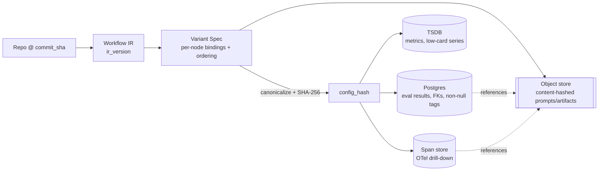
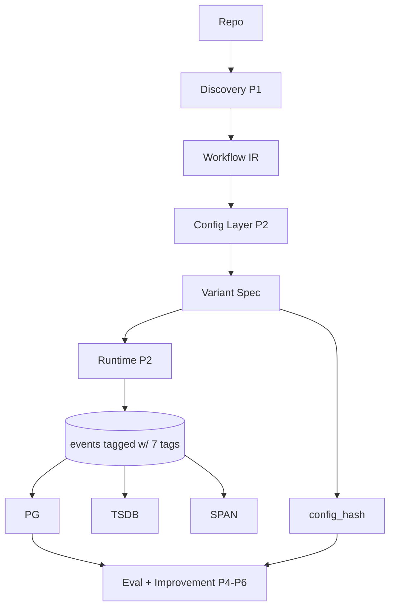

# PRD — P0: Foundations (Workflow IR + Metric Event Schema)

| Field | Value |
|---|---|
| Phase / Milestone | P0 / M0 |
| Target window | ~Weeks 1–3 |
| Lead role(s) | System Designer |
| Supporting role(s) | Backend, AI Engineer, DevOps, Product |
| Status | Draft |
| OpenSpec change | `p0-foundations` |

## 1. Summary

P0 freezes the two schemas every later phase reads from and writes to — the **Workflow IR**
(the canonical graph of discovered LLM call sites) and the **metric event schema** (the tagging
contract `{variant_id, run_id, node_id, case_id, seed, timestamp, config_hash}` on every telemetry
event) — plus the **config_hash / lineage** scheme that makes any result reproducible, a **storage
decision record** (three stores by data shape + content-hashed blobs), and the **repo scaffold + CI**.
Nothing is discovered, executed, scored, or optimized yet; this phase exists so that P1–P6 *add*
capability against stable contracts instead of re-litigating the foundations. The two items the
source plan flags as most-underestimated — the metric tagging contract and the typed per-node I/O
contract — are designed here in full, even though they are not exercised until P2.5 and P5.

## 2. Problem & context

Every downstream subsystem depends on two artifacts that do not yet exist:

- **Discovery (P1)** must emit *something* — that something is the Workflow IR. Without a frozen IR
  schema, Discovery, the Config Layer, the Pattern Classifier, and the graph UI each invent their
  own node representation and never reconcile.
- **Metrics (P2.5), Eval (P4), and the Improvement Engine (P4.5–P6)** are all *consumers* of a
  tagged event stream. The source plan states the failure mode plainly: "the most common failure
  mode is emitting under-tagged metrics you can't later slice." A metric written in P2.5 without a
  `config_hash` or `seed` can never be attributed to a configuration or reproduced — and by then it
  is far too late and far too expensive to retrofit the tag onto historical data.

Two properties are cheap to design now and ruinous to retrofit later, so they are pulled into P0:

1. The **tagging contract** — the exact tag set, its non-null guarantees, and its enforcement point.
2. The **typed per-node I/O contract** — `input_schema` + `output_schema` per node. Re-arrangement
   (drag-to-reorder) does not ship until P5, but the contract field must exist in the IR from day
   one or every IR emitted before P5 is missing the data the reorder validator needs.

This phase assumes **no upstream state** — it is the root of the critical path. It produces contracts,
not running services.

## 3. Goals & non-goals

### Goals
- **G1** — Publish a versioned `workflow-ir.schema.json`: a graph of nodes with call-site, model,
  prompt, tools/skills, and context-assembly metadata; STATIC node definitions distinguished from
  RUNTIME invocations; node count reported per-definition.
- **G2** — Make the typed per-node **I/O contract** (`input_schema` + `output_schema`) a first-class,
  required field of every IR node.
- **G3** — Publish a versioned `metric-event.schema.json` where every event carries the full tag set
  `{variant_id, run_id, node_id, case_id, seed, timestamp, config_hash}`, all non-null.
- **G4** — Specify the **config_hash / lineage** scheme: deterministic canonicalization, what is
  and is not hashed, and how a hash resolves back to exact registry versions and content-hashed blobs.
- **G5** — Produce the **storage decision record**: three stores by shape (spans→OTel span store,
  metrics→TSDB, eval results→Postgres) with blobs content-hashed in object storage, justified by
  back-of-envelope volume estimates.
- **G6** — Scaffold the repo and a green CI pipeline (build/test/lint), a secrets-management baseline,
  and the OTel GenAI-semantic-conventions doc the whole team emits against.
- **G7** — Prove the IR schema with at least one hand-written IR sample that validates.

### Non-goals (deferred, with owning phase)
- Actual node extraction / AST parsing — **P1 (Discovery MVP)**.
- Registries, the source-transformation engine (codemod), the Variant Spec type, and the loader/executor — **P2**.
- Live OTel instrumentation and standing up the three stores as running services — **P2.5** (the
  *schema and storage decision* are P0; the *wiring* is P2.5).
- Drag-to-reorder, contract-mismatch validation, adapter insertion — **P5** (P0 only defines the
  contract field they consume).
- Pattern-label field population and classifier — **P3.5** (P0 reserves the field).
- Evaluators, eval-set generation, composite scoring — **P4**.

## 4. Users & personas

P0's "users" are overwhelmingly **downstream subsystems** and the **engineers building them**, not
end users. Human end users appear only through the north-star journey Product drafts here.

| Persona | Relationship to P0 |
|---|---|
| **Discovery Engine (P1)** | *Writes* the IR. Needs an unambiguous schema and a per-definition node-count rule. |
| **Config Layer / Runtime (P2)** | *Reads* the IR to know what is overridable; keys everything by `config_hash`. |
| **Metrics substrate (P2.5)** | *Emits* against the metric event schema and the OTel conventions doc; writes to the three stores. |
| **Eval + Improvement Engine (P4–P6)** | *Slices* the tagged event stream by every tag; reproduces runs from `config_hash + seed`. |
| **Reorder validator (P5)** | *Reads* each node's typed I/O contract to decide whether a proposed ordering is coherent. |
| **Platform engineers** | Build against the frozen schemas; the DB enforces the tagging contract their app code will forget. |
| **End user (via Product north-star)** | Imports a repo → inspects the graph → configures → runs → compares → diagnoses → applies. |

## 5. User stories / jobs-to-be-done

**Downstream subsystem (Discovery)**
- As the Discovery Engine, I want a frozen IR schema with a per-definition node-count rule, so that I
  can emit a diffable graph and correctly report "N static nodes" even when agents loop at runtime.
- As the Discovery Engine, I want STATIC definitions modeled separately from RUNTIME invocations, so
  that a loop or conditional agent is represented as one definition, not an unbounded node explosion.

**Downstream subsystem (Metrics / Eval)**
- As the Metrics substrate, I want a schema that makes all seven tags non-null at write time, so that
  no event can ever be emitted that later cannot be sliced by variant, node, case, seed, or config.
- As the Eval Harness, I want every result keyed by `config_hash`, so that "did variant B beat A" is a
  question about two exact, replayable configurations, not two fuzzy labels.
- As the Improvement Engine, I want `config_hash + seed` to deterministically identify a run, so that
  I can re-execute a proposal and prove a delta rather than assert one.

**Downstream subsystem (Reorder validator, P5)**
- As the reorder validator, I want each node to carry a typed `input_schema` and `output_schema` in
  the IR from the first version, so that when re-arrangement ships I have the contract data to flag
  incoherent orderings — not a migration backfill of every historical IR.

**Platform engineer**
- As a platform engineer, I want the DB to enforce non-null tags and `config_hash` uniqueness, so that
  the tagging contract holds even when application code forgets it.
- As a platform engineer, I want an expand-migrate-contract migration story for the IR and registry
  schemas, so that schemas can evolve while older variants still resolve.

**End user (north-star, Product)**
- As a workflow owner, I want to import a repo, inspect its LLM graph, configure nodes, run variants,
  compare them, see a diagnosis, and apply a fix at a chosen automation level, so that I can improve
  an agentic workflow with evidence rather than guesswork.

## 6. Functional requirements

These map 1:1 to OpenSpec requirements in `openspec/changes/p0-foundations/specs/`.

**Workflow IR (capability `workflow-ir`)**
- **FR1** — The IR SHALL be a versioned JSON document (`ir_version`, semver) describing a workflow as
  a graph of nodes and edges.
- **FR2** — Each node SHALL carry precise call-site source-span metadata (file, symbol, line range,
  AST path) sufficient for a later phase to rewrite the call site, the current/observed
  model (provider, model id, inference params), the prompt (template reference or inline + variable
  slots), the tools/skills bound, and the context-assembly description.
- **FR3** — The IR SHALL distinguish **static node definitions** from **runtime invocations**: a node
  is a definition; invocations are execution instances referencing a definition's `node_id`.
- **FR4** — Node count SHALL be reported **per static definition**; nodes with variable runtime fan-out
  (loops, conditional agents) SHALL be flagged `variable_at_runtime` rather than counted as many nodes.
- **FR5** — Each node SHALL carry a first-class typed **I/O contract**: `input_schema` and
  `output_schema`, each a JSON Schema, present from IR v1 even though re-arrangement ships in P5.
- **FR6** — Edges SHALL be typed as `data` or `control` flow and reference nodes by `node_id`.
- **FR7** — The IR SHALL reserve an optional `pattern_labels` field on nodes/subgraphs for P3.5.

**Metric event schema (capability `metric-event-schema`)**
- **FR8** — Every metric/trace event SHALL carry the full tag set `{variant_id, run_id, node_id,
  case_id, seed, timestamp, config_hash}`.
- **FR9** — All seven tags SHALL be non-null; an event missing any tag SHALL be rejected at the emission
  boundary and SHALL NOT be persisted.
- **FR10** — The schema SHALL carry a typed payload (`metric_name`, `value`, `unit`) and be extensible
  with optional dimensions (e.g. `node_kind`, `invocation_id`) without breaking existing consumers.
- **FR11** — The schema SHALL align with OpenTelemetry GenAI semantic conventions so events map onto
  OTel spans/metrics without a bespoke logging layer.

**Config hash & lineage (capability `storage-and-lineage`)**
- **FR12** — `config_hash` SHALL be a deterministic hash over the canonical serialization of a fully
  resolved configuration (IR version, per-node model/prompt/skill/context bindings *with registry
  versions*, node ordering, provider params).
- **FR13** — `config_hash` SHALL exclude run-time-only values (timestamp, `run_id`, `seed`) so that the
  same configuration under different seeds shares one `config_hash`.
- **FR14** — A `config_hash` SHALL resolve to the exact registry versions and content-hashed blobs used,
  so any result is reproducible from lineage alone.
- **FR15** — Large prompt/artifact blobs SHALL be stored in object storage keyed by content hash
  (SHA-256 of bytes), and referenced (never inlined) from events and eval results.

**Storage decision (capability `storage-and-lineage`)**
- **FR16** — The system SHALL route data to three stores by shape: spans → an OTel-compatible span
  store; metrics → a TSDB; eval results → Postgres — all keyed by `config_hash`.
- **FR17** — Postgres SHALL enforce the tagging/lineage invariants structurally: non-null tag columns,
  `config_hash` uniqueness where applicable, and foreign keys from eval results to variant/node/case.

## 7. Non-functional requirements

These are first-class requirements with their own scenarios in the spec deltas, not footnotes.

- **NFR1 — Schema versioning & evolution.** Both schemas SHALL carry an explicit version and SHALL
  evolve additively (expand-migrate-contract). A consumer written against `ir_version` MAJOR *n* SHALL
  keep validating documents with added optional fields at the same MAJOR. Breaking changes SHALL bump
  the MAJOR version. Target: **zero** breaking changes to either schema after M0 within a MAJOR line.
- **NFR2 — Reproducibility.** Given a `config_hash` + `seed`, the lineage SHALL be sufficient to
  reconstruct the exact configuration (models, prompt versions, skills, context policy, ordering).
  Two runs with identical `config_hash + seed` are the reproducibility unit the whole platform tests
  against.
- **NFR3 — Tag completeness (the highest-leverage NFR).** 100% of persisted events carry all seven
  non-null tags. The enforcement point is the DB and the emission boundary, not documentation. Target:
  **0** untagged events reach any store.
- **NFR4 — Cardinality budget.** The tag set SHALL keep active TSDB series within a sane budget at
  target scale (see §8: ~3×10⁴ active series per optimization run) — i.e. tags are low-to-moderate
  cardinality dimensions (variant, node, seed, metric_name), while high-cardinality identifiers
  (`case_id`, `run_id`, blob hashes) are exemplar/label-on-write for spans and eval rows, **not**
  TSDB series labels. This is the decision that keeps metrics in a TSDB rather than Postgres.
- **NFR5 — Scale (design target).** The storage decision SHALL hold for the back-of-envelope target in
  §8: up to ~50 repos/day onboarded, ~20 static nodes/repo median, optimization runs of 20 variants ×
  200 cases × 5 seeds. See §8 for derived event/span/blob volumes.
- **NFR6 — Security baseline.** Provider secrets SHALL be sourced from a secrets manager, never
  committed or logged; the OTel conventions doc SHALL forbid prompts-with-secrets/PII in span
  attributes. No live provider calls happen in P0, but the baseline is set here.
- **NFR7 — Cost sensitivity.** Storage choices SHALL be justified against volume: high-volume/low-value
  metrics compress in a TSDB; high-volume drill-down spans are sampled/retention-bounded; blobs dedup
  by content hash. No store is chosen "by reflex."
- **NFR8 — Validation as a gate.** A hand-written IR sample and a hand-written metric event sample
  SHALL validate against their schemas in CI; an invalid sample SHALL fail the build.

## 8. System design summary

**(System Designer lens — numbers before boxes.)**

### 8.1 Explicit assumptions & scope boundaries
- Onboarding: ~5 repos/day early → **~50 repos/day** design target.
- Static LLM nodes per repo: 10–50, **median ~20**.
- A representative **optimization run**: **N = 20** variants × **K = 200** eval cases × **S = 5** seeds.
- Runtime invocations per case: agents loop, so ~2–3× the static node count → **~50 invocations/case**.
- ~10 optimization runs/day across all users at target scale.
- Reproducibility is exact-config replay (`config_hash + seed`), not bit-identical provider output
  (providers are non-deterministic; the seed pins *our* inputs, not the model's sampling hardware).

### 8.2 Back-of-envelope estimate (this is what picks the stores)

Per optimization run:

| Quantity | Derivation | Result |
|---|---|---|
| Runtime invocations | 20 × 200 × 5 × 50 | **1.0×10⁶** |
| Metric events | ~10 metrics/invocation (latency total/TTFT/TPS, cost in/out/cache, tokens prompt/completion/thinking, retries) | **1.0×10⁷** |
| Spans | 1/invocation + tool-call children (~2×) + 1 run span | **~3×10⁶** |
| Eval-result rows | per (variant, case, seed) scored | 20×200×5 = **2.0×10⁵** |
| Blob writes (pre-dedup) | prompt+completion per invocation | 1.0×10⁶ |

Sizing and the store each implies:

| Data | Per-run raw | Store & why |
|---|---|---|
| Metrics | 10⁷ events × ~2 B compressed ≈ **~20 MB** | **TSDB** — aggregation/trend queries over huge counts of tiny numeric points; columnar/compressed. |
| Spans | 3×10⁶ × ~1–2 KB ≈ **3–6 GB** (sampled + retention-bounded) | **OTel span store** (Tempo/Jaeger) — per-run drill-down, trace-native. |
| Eval results | 2×10⁵ × ~1 KB ≈ **~200 MB** | **Postgres** — low volume, rich relational joins across variant/node/case, constraints enforce tags. |
| Blobs | 10⁶ × ~6 KB ≈ 6 GB, **content-hash dedup ~5–10×** → ~**0.6–1 GB** | **Object store**, content-addressed; identical prompts/templates collapse to one object. |

At ~10 runs/day: ~10⁸ metric events/day (TSDB comfortable), ~3×10⁷ spans/day (sampled), ~2×10⁶ eval
rows/day (Postgres comfortable), ~10 GB blobs/day (object store).

**Cardinality check (why metrics ≠ Postgres).** Active TSDB series ≈ variant(20) × node(20) ×
metric_name(~15) × seed(5) ≈ **3×10⁴ series/run** — well within TSDB comfort. Crucially, `case_id`
(200) and `run_id`/`invocation_id` (10⁶) are **NOT** TSDB series labels — they would blow cardinality
to 10⁸. They live as span attributes and Postgres columns (exemplars / joinable keys), which is the
whole reason the shapes are split three ways. This single decision is the highest-leverage output of
§8.

### 8.3 Interface contracts (the deliverables)

The two schemas *are* the interface every subsystem satisfies.

- `workflow-ir.schema.json` — root: `{ ir_version, workflow: {id, repo: {url, commit_sha}, language},
  nodes: [Node], edges: [Edge] }`.
  - `Node = { node_id, kind:"static_definition", call_site:{file,symbol,line_start,line_end,ast_path},
    model:{provider,model_id,params}, prompt:{template_ref|inline, variables[]}, tools_skills[],
    context_assembly:{policy, description}, io_contract:{input_schema, output_schema},
    invocation_semantics:{type: "single"|"loop"|"conditional", variable_at_runtime: bool},
    pattern_labels?[] }`.
  - `Edge = { from_node_id, to_node_id, kind:"data"|"control" }`.
  - `RuntimeInvocation` (separate schema/concept) `= { invocation_id, node_id, run_id, invocation_index }`.
- `metric-event.schema.json` — `{ variant_id, run_id, node_id, case_id, seed, timestamp, config_hash,
  metric_name, value, unit, node_kind?, invocation_id? }`; all seven tags required & non-null.

### 8.4 Data model & lineage

`config_hash = SHA-256(canonical_json(resolved_config))` where `resolved_config` includes `ir_version`,
each node's `{model_ref@ver, prompt_ref@ver, skill_refs[]@ver, context_policy+params}`, the node
ordering/graph, and provider params — and **excludes** `run_id`, `seed`, and `timestamp`. Canonical =
sorted keys, normalized numbers, UTF-8. `variant_id` is a stable *logical* label that may map to many
`config_hash` values over its edit history; a `config_hash` is immutable and content-defined.

### 8.5 High-level architecture (end-to-end, for context)

### 8.6 Trade-offs stated explicitly
- **Three stores vs. one.** Cost: operational surface of three systems. Benefit: each query shape
  (aggregate trends / trace drill-down / relational comparison) hits the store built for it; forcing
  10⁷ metric events/run into Postgres would make trend queries and cardinality unmanageable. Chosen.
- **Content-hash blobs vs. inline.** Cost: an indirection and a GC story for orphaned blobs. Benefit:
  ~5–10× dedup and reproducibility by reference. Chosen.
- **Typed I/O contract now vs. at P5.** Cost: Discovery must populate two schemas per node it can only
  partially infer statically (allowed to be permissive/`any` early). Benefit: no backfill migration of
  every historical IR when reorder ships. Chosen — the field is cheap now, ruinous later.
- **Seed pins inputs, not model hardware.** Cost: "reproducible" is exact-config, not bit-identical
  output. Benefit: an honest, achievable reproducibility contract; statistical treatment (multi-seed +
  CIs) absorbs the residual provider non-determinism. Stated openly.

## 9. Design by role lens

### 9.1 System Designer (lead) — *numbers before boxes*
Owns the whole of §8. Applies the workflow's phases directly: **(1) clarify** functional ("discover
static nodes, override, execute, score") vs non-functional (repos/day, nodes/repo, runs×seeds,
cardinality, reproducibility, cost — §8.1); **(2) estimate** the volumes that decide storage (§8.2);
**(3) define the interface contract** — the IR and metric schemas *are* the contracts (§8.3); **(4)
data model + storage** — three stores by shape keyed by `config_hash` + content-hashed blobs (§8.4,
§8.2 table); **(8) state trade-offs** (§8.6). Its two highest-leverage outputs, per the ownership
matrix, are the **event tagging contract** and the **typed I/O contract** — both frozen here because
both are cheap to design early and ruinous to retrofit.

### 9.2 Backend (support) — *model the invariants into the schema; migrations as rollouts*
- **Contracts outlive code.** The IR and (future) Variant Spec are public contracts; they are designed
  additively — added fields are optional, MAJOR bumps for breaks (NFR1). Registry references are
  versioned so a `config_hash` always resolves the exact bytes.
- **DB enforces what app code forgets.** Postgres carries non-null constraints on all seven tag
  columns, a uniqueness constraint on `config_hash` where a row represents a configuration, and FKs
  from eval results → variant / node / case. The tagging contract is a *constraint that runs on every
  write, forever*, not a code review comment (FR9, FR17).
- **Idempotency & reproducibility.** The `config_hash + seed` key is designed so a re-run neither
  double-writes eval rows nor loses attribution (groundwork for P2's idempotent executor).
- **Migration strategy = expand-migrate-contract.** IR/registry evolution: add the new column/field as
  nullable/optional (expand), dual-write/backfill (migrate), then drop the old (contract) — so older
  variants keep resolving throughout. Documented as the standing schema-change procedure (NFR1).

### 9.3 AI Engineer (support) — *what downstream eval/metrics need from the tags*
- Confirms the tag set is **sufficient for every slice** P4/P4.5 will need: per-variant (`variant_id`,
  `config_hash`), per-node attribution (`node_id`), per-case and per-failure-cluster (`case_id`),
  and statistical treatment across seeds (`seed`). A missing tag here is an un-answerable question
  later — e.g. without `seed`, no confidence intervals; without `config_hash`, no honest "B beat A."
- Ensures the **typed I/O contract** is rich enough to later drive **schema-driven eval-set synthesis**
  (P4) — generating valid/boundary/invalid inputs from `input_schema` — and **output-contract
  adherence** metrics (did a node emit downstream-valid output per `output_schema`).
- Enforces the platform rule at the schema level: because *diagnosis proposes, verification decides*,
  every result must be replayable — which is exactly what `config_hash + seed` reproducibility (NFR2)
  guarantees. Reserves the `pattern_labels` field so the P3.5 classifier's dispatch (pattern →
  metric-set) has somewhere to write.

### 9.4 DevOps (support) — *observable, least-privilege, automate the second time*
- **OTel GenAI conventions doc.** Authors the single instrumentation standard the whole team emits
  against: which GenAI semantic-convention attributes map to which metric-event fields, and the rule
  that prompts/PII/secrets never land in span attributes (NFR6). "If it isn't observable, it isn't
  done" is why this is designed in P0, not P2.5.
- **Secrets baseline.** Establishes secrets-manager sourcing for provider keys (never in repo, logs,
  CI echo, or traces) before any provider call exists — least privilege by default.
- **Repo scaffold + CI.** Frame → Plan → Execute → Verify → Close: a green pipeline (build, test,
  lint) with a **schema-validation CI job** that validates the sample IR and sample metric event and
  fails the build on an invalid sample (NFR8, G7). Blast radius here is small (dev), but the CI gate
  is the mechanism that keeps M0's "schemas frozen" true as later PRs touch them.

### 9.5 Product (support) — *anchor to the outcome; design the unhappy path*
- Drafts the **north-star user journey** as the through-line every UI phase builds toward:
  **import repo → inspect graph → configure node → run variants → compare → diagnose → apply**.
- Defines the **automation-level model** as a north star: **Advisory** (engine reports; human applies)
  → **Assisted** (one-click apply a verified proposal) → **Autonomous** (bounded closed loop with
  audit trail + kill switch). Each level is a different *trust contract*; naming them now shapes what
  the IR and lineage must expose (e.g. `config_hash` lineage is what makes an autonomous change
  auditable and reversible).
- Names the risky assumption for the product: users will trust an automated change *only if it is
  verified and reversible* — which is why the lineage/reproducibility scheme designed in P0 is a
  product requirement, not just an engineering one.

## 10. Dependencies

- **Upstream:** none. P0 is the root of the critical path.
- **Unblocks:**
  - **P1 (Discovery)** — cannot emit without `workflow-ir.schema.json` (FR1–FR7).
  - **P2 (Config/Runtime)** — Variant Spec and `config_hash` build on FR12–FR15.
  - **P2.5 (Metrics)** — emits against `metric-event.schema.json` and the OTel doc (FR8–FR11, NFR6).
  - **P3.5 (Pattern Classifier)** — writes to the reserved `pattern_labels` field (FR7).
  - **P4 (Eval)** — schema-driven eval-set gen and output-contract metrics read the typed I/O contract
    (FR5); results persist under FR16–FR17.
  - **P5 (Re-arrangement)** — the reorder validator reads every node's I/O contract (FR5).
  - **P6 (Autonomous optimizer)** — auditability/rollback rests on `config_hash` lineage (FR12–FR14).

## 11. Risks & mitigations

| Risk | Owner | Mitigation |
|---|---|---|
| Tag set proves insufficient for a future slice, forcing a retrofit onto historical events | System Designer / AI | Review the tag set against every P4/P4.5 slice *now* (§9.3); make the schema additively extensible (FR10) so new *optional* dimensions never break consumers. |
| Under-tagged events slip through in P2.5 | Backend / DevOps | Enforce non-null tags in the DB and at the emission boundary (FR9, FR17), not by convention. |
| Typed I/O contract can't be inferred statically in P1 | AI / Backend | Allow permissive schemas (`any`/partial) early; the *field* is mandatory, its *precision* improves with dynamic tracing (P5). No backfill needed. |
| `config_hash` accidentally includes a run-time value (timestamp/seed) → identical configs get different hashes | System Designer / Backend | Canonicalization spec explicitly excludes `run_id`, `seed`, `timestamp` (FR13); a golden-vector test asserts hash stability across seeds. |
| Metric cardinality explodes (case_id/run_id used as TSDB labels) | DevOps / System Designer | NFR4 fixes which tags are TSDB series labels vs. span/Postgres attributes; the storage decision record states it. |
| Schema churn after M0 breaks downstream phases | System Designer | Versioning + expand-migrate-contract (NFR1); breaking change ⇒ MAJOR bump; CI sample-validation gate catches drift. |
| Secrets leak into traces/logs once instrumentation lands | DevOps | Secrets-manager baseline + "no prompts/PII/secrets in span attributes" rule in the OTel doc (NFR6). |

## 12. Rollout & test strategy

**(DevOps + Backend lens.)**
- **Ship shape.** P0 ships *documents and scaffolding*, so "rollout" is: schemas + decision record
  reviewed and frozen (M0 gate), repo scaffold merged, CI green. No runtime, so blast radius is
  confined to the repo.
- **Proving correctness:**
  - **Schema validation in CI (NFR8).** A hand-written IR sample and a hand-written metric-event sample
    live in the repo; a CI job validates them against the JSON schemas. An intentionally-invalid
    fixture (missing a tag / missing `io_contract`) MUST fail the build — proving the schema actually
    rejects.
  - **Golden config_hash vectors.** Fixture `resolved_config` inputs with pre-computed expected hashes;
    a test asserts (a) determinism, (b) seed-invariance (same hash across seeds), and (c) that changing
    any bound registry version changes the hash.
  - **Migration dry-run.** A documented expand-migrate-contract example for adding an optional IR field,
    proving older samples still validate at the same MAJOR.
- **Reversibility.** Everything is versioned text; rollback is a git revert. The one thing that is
  *not* cheaply reversible is a schema already emitted-against in production — which is exactly why the
  M0 freeze gate and additive-only evolution exist.

## 13. Success metrics & acceptance criteria (M0 exit checklist)

- [ ] `workflow-ir.schema.json` exists, is versioned, and models: nodes with call-site/model/prompt/
      tools/context metadata, static-definition vs runtime-invocation, per-definition node count,
      typed I/O contract per node, typed edges, reserved `pattern_labels`.
- [ ] `metric-event.schema.json` exists, is versioned, and requires all seven non-null tags plus a
      typed payload; aligns with OTel GenAI conventions.
- [ ] `config_hash` / lineage spec exists: canonicalization defined, run-time values excluded,
      resolution-to-registry-versions-and-blobs defined; golden vectors pass (deterministic,
      seed-invariant, version-sensitive).
- [ ] Storage decision record exists: three stores by shape + content-hashed blobs, each justified by
      the §8 back-of-envelope; cardinality budget (NFR4) stated.
- [ ] A hand-written IR sample **validates**; an invalid sample **fails** CI.
- [ ] A hand-written metric-event sample **validates**; a missing-tag sample **fails** CI.
- [ ] Repo scaffold merged; CI (build/test/lint) **green**; OTel conventions doc + secrets baseline
      documented.
- [ ] Both schemas **reviewed and frozen** by the System Designer + Backend + AI + DevOps reviewers.

## 14. Open questions

- **OQ1** — Which concrete span store and TSDB (Tempo vs. Jaeger; Prometheus vs. ClickHouse)? P0 fixes
  the *shape* decision; the product choice can be deferred to P2.5 provided the OTel-compatibility
  constraint holds.
- **OQ2** — Hash function & length: SHA-256 full vs. truncated hex for `config_hash` readability vs.
  collision margin. Leaning full SHA-256, display-truncated.
- **OQ3** — JSON Schema dialect/version to pin for `io_contract` (draft 2020-12 assumed) and how strict
  Discovery must be when it can only partially infer a node's schema statically.
- **OQ4** — Does `variant_id` live in the IR at all, or only in the P2 Variant Spec? Current lean: IR is
  variant-agnostic; `variant_id` enters with the Variant Spec, but the metric event schema (which
  carries `variant_id`) is defined here — so the tag is specified now, its producer arrives in P2.
- **OQ5** — Blob garbage collection: how are orphaned content-hashed blobs reclaimed once no
  `config_hash` references them? Deferred, but flagged so lineage design doesn't preclude a GC.
- **OQ6** — Retention/sampling policy per store (spans especially) — set the *mechanism* expectation in
  the decision record; tune the numbers in P2.5 against real volume.
