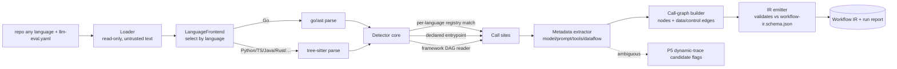

# PRD — P1: Discovery MVP (multi-language, static)

| Field | Value |
|---|---|
| Phase / Milestone | P1 / M1 |
| Target window | ~Weeks 3–9 (widened for multi-language scope) |
| Lead role(s) | Backend |
| Supporting role(s) | AI Engineer, DevOps, System Designer |
| Status | Draft (rescoped to language-agnostic — see §15) |
| OpenSpec change | `p1-discovery-mvp` |

## 1. Summary

The Discovery Engine reads a repository **in any language** as **untrusted text**, finds every
static LLM call site in it, and emits a valid **Workflow IR** (the graph contract frozen in P0,
which is language-neutral by design — its own P0 sample is Python). Discovery is built as a
**language-agnostic core** (signature-registry model, node-ID scheme, metadata-extraction
concepts, IR emission, run report, invariants) behind which sit pluggable **`LanguageFrontend`s** —
the only language-specific layer. The first frontend parses **Go** via `go/ast`; **all other
languages** (Python, TypeScript/JavaScript, Java/Kotlin, Rust, …) are parsed via a **tree-sitter**
substrate, so adding a language is *adding a frontend + registry rows + fixtures*, never rewriting
Discovery. Detection is driven by a **per-language signature registry** of known SDK entrypoints
*and* by **mandatory user-declared entrypoints** in an `llm-eval.yaml` file, because real codebases
in every language wrap the SDK behind in-house functions and signature matching alone misses those
nodes. This phase proves node extraction is **language-agnostic**, static-only; it is the gate that
turns "a pile of source" into the configurable node graph every downstream subsystem (Config,
Runtime, Metrics, Eval, Analysis) consumes. Dynamic tracing that would confirm the candidate graph
at runtime is explicitly P5.

## 2. Problem & context

Nothing downstream can exist until a codebase becomes a graph of addressable **nodes**. The
Config Layer overrides nodes, the Runtime executes them, Metrics tag events by `node_id`, and the
Eval/Analysis engines attribute failure to a node. Without discovery there is no `node_id` to key
any of it on.

Two facts make naïve discovery wrong:

1. **Wrappers defeat signature matching — in every language.** The SDK leaf call
   (`anthropic.Messages.New(...)` in Go, `client.messages.create(...)` in Python,
   `openai.chat.completions.create(...)` in TS) is rarely at the leaf; it sits behind an in-house
   `complete(prompt)` / `Complete(ctx, prompt)` / `generateSummary(...)` helper. A registry of SDK
   signatures alone under-counts nodes wherever the SDK is wrapped — which is almost everywhere, in
   every language. User-declared entrypoints are therefore **not optional**; they are a first-class
   detection source co-equal with the signature registry, and their design is language-neutral.
2. **"How many nodes make LLM requests" is only well-defined for static definitions.** An agent
   loop or a router makes a *variable* number of calls at runtime. The IR must count nodes
   **per static definition** and flag loop/agent nodes as `variable-at-runtime`, deferring the
   actual invocation count to dynamic tracing (P5).

3. **Most real agents are hand-rolled, not graphs.** A large fraction of production agents are bespoke
   loops (a `run_agent.py`, a CLI, an SDK wrapper), not LangGraph/CrewAI graphs. For these, discovery
   legitimately finds the LLM **call sites** (via the signature registry + declared entrypoints) but
   **no connected workflow graph** — no framework subgraph, and often **zero edges** between nodes
   (observed on a real repo: 40 call sites, 0 edges, no framework detections). This is an **honest,
   expected** output, not a discovery failure: the graph simply isn't statically present. Downstream
   phases must not require a graph — P3.5 marks such nodes "not yet classified", and **P4.5 localizes
   from traces, treating edges/labels as optional enrichment** (see P4.5 FR13/FR14). P1's obligation
   is only that each `call_site` anchor is precise enough for P2/P2.5 to instrument it as a node.

**Upstream state assumed (from P0/M0):** `workflow-ir.schema.json` and the typed per-node I/O
contract fields are frozen; `config_hash`/content-hash conventions exist; the static-node vs.
runtime-invocation distinction is a first-class field in the IR; CI is green and can validate a
hand-written IR sample against the schema.

## 3. Goals & non-goals

### Goals
- G0. **Language-agnostic architecture.** Separate a language-neutral core from a pluggable
  **`LanguageFrontend`** (parse + call-site resolution). Adding a language SHALL be adding a frontend
  + registry rows + fixtures, **not** modifying the core, the IR, the registry model, the node-ID
  scheme, extraction, emission, the run report, or the invariants.
- G1. Parse a repo in **any supported language without ever executing it**, treating source as
  untrusted text: **Go** via `go/ast` (frontend #1), and **Python, TypeScript/JavaScript,
  Java/Kotlin, Rust** (and further languages) via a **tree-sitter** substrate.
- G2. Detect LLM call sites via a **per-language signature registry** covering, per language, the
  major SDKs — e.g. Anthropic Messages, OpenAI Chat Completions, LangChain/LangGraph invoke, Bedrock
  Converse in Go; the `anthropic`/`openai`/`langchain`/`langgraph`/`crewai`/`boto3` families in
  Python; `@anthropic-ai/sdk`/`openai`/`langchain.js`/Vercel AI SDK in TS/JS; langchain4j/Spring
  AI/Bedrock in Java; `async-openai`/`anthropic` crates in Rust. The registry is data, extensible
  without code change.
- G3. Detect LLM call sites via **user-declared entrypoints** from `llm-eval.yaml` (wrapper case),
  with a **language-neutral** declaration format.
- G4. For each call site extract per-node metadata: model arg, messages/prompt construction,
  tools/skills passed, and the upstream data flow feeding the prompt.
- G5. Build a **call graph**: node = LLM-invoking function/agent step; edges = data/control flow.
- G5a. **Recover the effective topology of hand-rolled agents** (no framework), by inferring edges
  between discovered call sites from three static signals, each emitted with **provenance
  `inferred_static` + a confidence** so a consumer (P4.5) never mistakes an inference for a framework
  fact: **(i) call-graph** — the function holding call A transitively calls the function holding call
  B, or a wrapper forwards to a primitive; **(ii) data-flow** — call A's response is threaded into
  call B's prompt (e.g. appended to a `messages` list that B reads); **(iii) shared-state** — two call
  sites read/write the same conversation/memory object. This is the load-bearing fix for the observed
  gap: on a real hand-rolled repo, framework detection returned **0 edges** while the code plainly
  links its 40 LLM calls (a `dispatch → chat.completions.create` call graph, a `messages.append`
  data-flow chain, and a shared `_session_messages` object). Framework edges (G6) are provenance
  `framework`; the minimum-viable subset (shared-state + call-graph) ships before full data-flow
  analysis (staged, cost-escalation-path).
- G6. **Special-case framework DAGs** (LangGraph/CrewAI in Python; LangGraphGo/langchaingo in Go;
  equivalents elsewhere) by reading their declarative graph definition instead of inferring topology
  from call order — via per-language framework readers behind one interface.
- G7. Emit a **valid Workflow IR** that validates against the P0 schema and is stable/diffable
  across runs, **regardless of source language** (the IR records `workflow.language`).
- G8. Report node count **per static definition** and flag loop/agent nodes as variable-at-runtime.
- G9. Flag call sites whose static data flow is ambiguous as **P5 dynamic-tracing candidates**.

### Non-goals (deferred, with owning phase)
- Dynamic tracing / runtime confirmation of the candidate graph → **P5**.
- Making nodes configurable / the source-transformation engine / registries → **P2**. (Note: the P2
  source-transformation codemod is itself per-language; P1 only guarantees the `call_site` anchor is
  precise enough to support it.)
- Executing any discovered code or repo tools → sandbox is **P3**; discovery never executes.
- Pattern classification (Routing/Reflection/RAG labels) → **P3.5** (structural), **P5** (behavioral).
- Resolving runtime-dynamic dispatch (which loop branch actually ran) → **P5**.
- **Trace acquisition for hand-rolled agents** (turning discovered call sites into emitting run/node/
  tool spans so P4.5 has something to attribute) → **P2.5**. P1 emits the precise `call_site` anchors;
  P2.5 owns instrumenting them (auto-wrap at the provider-SDK boundary, or a user-declared
  node-boundary adapter). Called out here so the framework-agnostic gap is owned, not discovered when
  a hand-rolled repo yields an edge-less IR (resolves P4.5 Q8).
- **Full type-inference fidelity for tree-sitter languages** — tree-sitter is syntactic (no type
  resolution), so non-Go frontends lean harder on import-presence + selector + declared entrypoints,
  and mark more fields `unresolved` (honestly) rather than guessing. Deep type resolution per language
  (LSP/compiler-frontend integration) is a **post-M1 fidelity uplift**, not a P1 gate.

## 4. Users & personas

- **Platform engineer / repo owner (human).** Runs Discovery on their Go service, authors
  `llm-eval.yaml` to declare in-house wrappers, and inspects the emitted node graph on first import.
- **Downstream subsystems (machine consumers).** The Config Layer (P2) reads the IR to build
  override targets; Metrics (P2.5) keys events on `node_id`; the Pattern Classifier (P3.5) reads
  IR topology; the Eval/Analysis engines (P4+) attribute results per node.
- **AI Engineer (internal).** Audits whether extracted prompt/context metadata is faithful enough
  to later drive overrides, and triages ambiguous-data-flow flags.

## 5. User stories / jobs-to-be-done

**Repo owner**
- As a repo owner, I want to point Discovery at my Go repo and get a list of discovered LLM nodes,
  so that I can see my workflow as an addressable graph on first import.
- As a repo owner whose SDK is wrapped in `internal/llm`, I want to declare that wrapper in
  `llm-eval.yaml`, so that Discovery finds nodes that pure signature matching would miss.
- As a repo owner, I want the node count reported per static definition with loops flagged
  variable-at-runtime, so that I am not misled into thinking an agent loop is a single call.

**Downstream subsystems**
- As the Config Layer, I want each node to carry a precise call-site source span (file, line, AST
  path) and typed I/O contract fields, so that I can rewrite its parameters at the call site via a
  deterministic AST transformation, delivered as a reviewable diff.
- As the Pattern Classifier, I want edges to encode data/control flow and framework DAGs read
  declaratively, so that topology-based detection is reliable rather than inferred from call order.

**AI Engineer**
- As an AI engineer, I want call sites with ambiguous static data flow flagged, so that I can mark
  them as P5 dynamic-tracing candidates rather than trusting a guessed prompt construction.

## 6. Functional requirements

These map 1:1 to the OpenSpec `discovery-engine` requirements.

- **FR0 — Language-frontend abstraction.** Discovery SHALL route parsing and call-site resolution
  through a `LanguageFrontend` selected by source language, and the language-neutral core (registry
  model, node-ID scheme, extraction, IR emission, run report, invariants) SHALL be identical across
  languages. Adding a language SHALL require no change to the core. The IR SHALL record
  `workflow.language`.
- **FR1 — Signature-registry detection (per language).** Discovery SHALL detect a call site when a
  call expression resolves (via the language frontend's import/module + selector resolution — Go
  `go/ast` types; tree-sitter syntactic import + selector for other languages) to an entry in the
  **per-language** signature registry. Seed registries cover the major SDKs **per language**
  (see G2). The registry is data, extensible without code change; each row is language-tagged.
- **FR2 — User-declared entrypoints (mandatory, language-neutral).** Discovery SHALL load
  `llm-eval.yaml`, treat every declared entrypoint (a language-qualified function/method symbol) as
  an LLM call site of equal standing to registry hits, and map declared argument positions/names/
  field-paths/option-constructors to node metadata fields. The declaration format is language-neutral;
  the symbol syntax is per-language (e.g. Go `pkg.(*T).M`, Python `module.Class.method`, TS
  `module#export`).
- **FR3 — Per-call-site metadata extraction.** For each detected call site Discovery SHALL extract
  a precise source span (file, line, AST path) sufficient for a later phase to rewrite the call
  site, the model arg, messages/prompt construction, tools/skills passed, and the upstream data
  flow feeding the prompt — resolving each statically where possible and marking it `unresolved`
  (not omitting it) where not.
- **FR4 — Call-graph construction.** Discovery SHALL build a directed call graph whose nodes are
  LLM-invoking functions/agent steps and whose edges represent data or control flow (output of A
  feeding input of B), and emit it as the Workflow IR node/edge set.
- **FR4a — Non-framework topology recovery (edge provenance).** For an agent with **no recognized
  framework** (a hand-rolled loop), Discovery SHALL still recover node edges from three static
  signals — **call-graph** (fn holding call A transitively calls fn holding call B, or a wrapper
  forwards to a primitive), **data-flow** (call A's response threaded into call B's prompt, e.g. via
  a shared `messages` list), and **shared-state** (two call sites read/write the same
  conversation/memory object) — and SHALL emit each such edge tagged `provenance = inferred_static`
  with a confidence, distinct from framework edges (`provenance = framework`, FR5). An inferred edge
  is a **hypothesis**, never asserted as certain: it carries its confidence and its signal, so a
  downstream consumer (P4.5 first-divergence / ablation scoping) can prefer higher-provenance edges
  and surface the provenance. This closes the observed gap where framework detection returned **0
  edges** on a repo whose LLM calls were plainly linked. The minimum-viable subset (shared-state +
  call-graph) is required; full inter-procedural data-flow across very large files MAY be staged as a
  later fidelity uplift, with the un-recovered links flagged rather than silently dropped.
- **FR5 — Framework DAG special-casing (per language, behind one interface).** When a recognized
  framework declares its graph — LangGraph/CrewAI (Python), LangGraphGo/langchaingo (Go), and
  equivalents in other languages — Discovery SHALL derive nodes and edges from that declarative
  definition rather than inferring topology from call order, and SHALL record the framework source on
  the subgraph. Framework readers are per-language implementations of one `FrameworkReader` interface.
- **FR6 — Static-vs-runtime node counting.** Discovery SHALL report node count **per static
  definition** and SHALL flag any node reachable through a loop or agent control structure as
  `variable-at-runtime`, never emitting a fixed runtime invocation count.
- **FR7 — Valid, diffable IR emission.** Discovery SHALL emit IR that validates against the P0
  `workflow-ir.schema.json` and is deterministic (stable node IDs and ordering) so two runs on
  unchanged source produce byte-stable, diffable output.
- **FR8 — Ambiguity flags for P5.** Discovery SHALL flag any call site whose prompt-construction or
  data-flow could not be statically resolved as a dynamic-tracing candidate for P5, with the reason.

## 7. Non-functional requirements

- **NFR1 — No-execution safety invariant (hard gate).** Discovery SHALL NOT execute, evaluate, run
  an interpreter/compiler on, load as a plugin, `go run`, `python`, `node`, or otherwise run any
  target-repo code, at any point, **in any language**. Analysis is over the AST/parse-tree and text
  only. This is a security invariant, not a preference: discovered source is untrusted. (Tree-sitter
  is a pure parser — it does not execute source — which is part of why it is the multi-language
  substrate.)
- **NFR2 — Determinism / reproducibility.** Identical repo state (same content hashes) yields
  byte-identical IR. Node IDs are derived from stable, content-addressable inputs (module/package
  path + enclosing symbol + call-site structural position + a content hash), never from wall-clock or
  map iteration order — a scheme that is language-neutral.
- **NFR3 — Throughput / scale.** Target: a ~200k-LOC repo discovered in **under 60 s** on a single
  worker, per language frontend; memory bounded by streaming/one-file-or-package-at-a-time parsing,
  not by loading the whole repo parse-tree into memory at once. (Back-of-envelope: nodes/repo in the
  tens to a few hundred; this sizes the IR emitter and downstream stores, not a distributed system.)
- **NFR4 — Faithfulness.** Extracted prompt/context metadata must be faithful enough to later drive
  overrides (P2). Where fidelity cannot be guaranteed statically, the field is marked `unresolved`
  and flagged (NFR tie-in to FR8) rather than silently guessed — a wrong-but-confident value is worse
  than an honest `unresolved`.
- **NFR5 — Robustness to hostile/broken input.** Malformed, syntactically invalid, or adversarial
  source (deeply nested expressions, huge literals, symlink cycles) SHALL be handled by
  skip-and-report, never by crash or unbounded resource use. Parse errors degrade to a per-file
  diagnostic; discovery of other files continues.
- **NFR6 — Observability.** Discovery emits a structured run report: files scanned, call sites
  detected by source (registry vs. declared vs. framework), nodes emitted, ambiguity flags, and
  per-file parse diagnostics — enough to diff a discovery run and explain a missing node.
- **NFR7 — Least privilege.** The Discovery worker runs with read-only filesystem access to the
  target repo, no network egress, and no ambient provider credentials.

## 8. System design summary

**Pipeline (language-agnostic core, per-language frontend, static):**

**The `LanguageFrontend` boundary is the whole point of the rescope.** It exposes: parse a
file/unit to a normalized parse-tree; enumerate call sites with `{root, selector-chain, enclosing
symbol, import map, structural position}`. Everything to the right of the frontend — detection,
extraction, node-ID, graph, emission, report — is **language-neutral and shared**. Go's frontend is
`go/ast`-backed (with real import resolution); every other language's frontend is tree-sitter-backed
(syntactic: import-presence + selector, no type resolution). The detector consumes the frontend's
normalized call-site shape, so it never knows which language produced it.

**Detection sources are co-equal and merged** (a call site found by both registry and declaration
is one node, deduplicated by call-site identity). Three sources feed one node set:
1. **Per-language signature registry** — data-driven table of language-tagged, module/import-qualified
   SDK entrypoints + argument maps.
2. **User-declared entrypoints** — `llm-eval.yaml`, resolved the same way, mandatory, language-neutral.
3. **Framework DAG readers** — per-language framework plugins behind one interface.

**Node metadata (into the P0 IR node — language-neutral):** `node_id`, `call_site {file, symbol,
line_start, line_end, ast_path}`, `model`, `prompt`, `tools_skills[]`, `context_assembly`, typed
I/O-contract stubs, `invocation_semantics {type, variable_at_runtime}`. Discovery-internal provenance
(`detected_by`, `ambiguity_flags`, `framework_source`, dataflow evidence) lives in the run report, not
on the frozen node.
**Edges:** `{from_node_id, to_node_id, kind: data|control}`.

**Static resolution strategy.** Constant/literal args resolve directly; locally-constructed values
resolve by intra-procedural data-flow up to a bounded budget. Anything requiring inter-procedural or
runtime-value resolution is marked `unresolved` and flagged (FR8). For tree-sitter frontends, more
falls to `unresolved` (no types) — honestly, never guessed. No symbolic execution; no running code.

**Interfaces.**
- CLI/service entry: `discover --repo <path> --config llm-eval.yaml --out ir.json` (auto-detects
  language(s); a repo may mix languages, producing one IR per workflow with per-node `call_site.file`).
- `LanguageFrontend` — interface per language (`Parse`, `CallSites`); add a language by adding a
  frontend, not by touching the core.
- `SignatureRegistry` — pluggable, language-tagged table; add an SDK by adding a row, not code.
- `FrameworkReader` — interface per framework/language (`Detect`, `ReadDAG`).
- Output: Workflow IR JSON + a `discovery-report.json` (NFR6).

## 9. Design by role lens

### Backend (Lead) — explore → design → implement → test → harden → review
- **Understand.** The real requirement is not "grep for `messages.create`"; it is "produce a
  faithful, diffable node graph from untrusted source, honestly marking what static analysis
  cannot know." Invariants to preserve (Phase-1 discipline): *never execute the repo*; *never emit
  a fixed runtime count for a variable node*; *node IDs are stable*; *a missing node is explainable
  from the run report*. These become the test assertions and the review checklist.
- **Explore.** Study how real Go repos wrap LLM SDKs (in-house `Complete()`/`Generate()` helpers,
  interface-typed clients, options structs) and catalog the real call shapes before designing the
  detector — the wrapper reality is the whole reason user-declared entrypoints exist.
- **Design — the contract.** The IR is a public contract that **outlives this code**; populate P0
  fields additively and never invent node-shape fields here. Detection sources are co-equal and
  merged by a stable call-site identity so the same node is never double-counted.
- **Design — the data model / invariants.** Model correctness into the emitter: unique stable
  `node_id`; every node carries `detected_by` and `variable_at_runtime`; every unresolved field is
  explicitly `unresolved`, never absent. Determinism is enforced by sorting and content-addressed
  IDs, not by accident of traversal order.
- **Design — failure behavior.** Enumerate what fails: unparseable file, unknown framework version,
  `llm-eval.yaml` pointing at a nonexistent symbol, cyclic imports, a call site whose model arg is
  a runtime variable. Each has a decided outcome (skip-and-report, mark-unresolved-and-flag,
  degrade the subgraph), never a crash and never a silent drop.
- **Implement, defensively.** Validate `llm-eval.yaml` at the boundary; treat every AST value as
  untrusted; bound recursion depth on expression walking; stream packages to bound memory.
- **Test.** Fixture repos with **known node counts**; assert extracted IR matches exactly. The two
  load-bearing fixtures: (a) **the wrapper case** — the SDK hidden behind an in-house function,
  proving user-declared entrypoints find the node the registry misses; (b) **the framework-DAG
  case** — a LangGraph/CrewAI graph whose nodes/edges must come from the declarative definition.
  Plus a loop/agent fixture asserting `variable_at_runtime`, and a golden-IR diff test for determinism.
- **Harden / Review.** The no-execution invariant is enforced structurally (no `exec`, no plugin
  loading in the discovery path) and asserted in test. Review the diff as an adversary hunting the
  classic failure: a node silently dropped, a variable node given a fixed count, non-deterministic
  IDs, an unhandled parse panic.

### AI Engineer (Support) — fidelity of extracted metadata; ambiguity → P5
- Owns the judgment on whether extracted `prompt_construction` / `tools_skills` / `upstream_dataflow`
  is **faithful enough to later drive overrides** (P2). Where static data flow is ambiguous
  (inter-procedural prompt assembly, runtime-selected model, conditionally-built message lists), the
  call site is flagged a **P5 dynamic-tracing candidate** with a reason — the same "never trust an
  unverified inference" discipline the Analysis engine uses later. An honest `unresolved` + flag
  beats a confident guess.

### DevOps (Support) — CI validation, least privilege
- Owns the **CI job** that runs Discovery on the fixture repos and validates every emitted IR
  against `workflow-ir.schema.json`, failing the build on any schema violation, non-deterministic
  output (golden-IR drift), or a fixture whose node count regresses. Enforces least privilege for
  the discovery worker (read-only repo mount, no network, no provider creds) — the observable proof
  of the no-execution invariant.

### System Designer (Support) — IR-as-contract, throughput
- Confirms the emitted IR satisfies the P0 contract and that Discovery's node/edge shape supports
  every downstream slice (Config override targets, Metrics `node_id` keying, Classifier topology).
  Owns the back-of-envelope throughput estimate (NFR3) that sizes the emitter and the run queue,
  and re-states the static-vs-runtime distinction as an IR invariant.

## 10. Dependencies

- **Upstream (required):** P0/M0 — frozen `workflow-ir.schema.json`, typed I/O contract fields,
  static-node vs. runtime-invocation distinction, content-hash conventions, green CI.
- **Downstream (this unblocks):** P2 (Config Layer rewrites discovered call sites via source transformation), P2.5 (Metrics key on
  `node_id`), P3.5 (Pattern Classifier reads IR topology), P4+ (Eval/Analysis attribute per node),
  P5 (dynamic tracing consumes the ambiguity flags and confirms the candidate graph).

## 11. Risks & mitigations

| Risk | Owner | Mitigation |
|---|---|---|
| Wrappers hide the SDK; pure signature matching under-counts nodes | Backend | User-declared entrypoints in `llm-eval.yaml` as a mandatory, co-equal detection source; wrapper fixture in CI |
| Static analysis can't resolve prompt built inter-procedurally / at runtime | AI Eng | Mark field `unresolved` + flag as P5 dynamic-trace candidate; never guess |
| Loop/agent nodes misreported as single fixed calls | Backend / Sys Designer | `variable_at_runtime` flag; per-static-definition counting; loop fixture asserts it |
| Accidentally executing untrusted repo code | DevOps / Backend | No-execution invariant enforced structurally + in test; read-only, no-network, no-creds worker |
| Non-deterministic IR breaks diffing/reproducibility | Backend | Content-addressed stable node IDs, sorted output, golden-IR diff test in CI |
| Framework DAG version drift breaks the reader | Backend | Per-framework reader is versioned and isolated; unknown version degrades to flagged subgraph, not a crash |
| Malformed/hostile source crashes the parser | Backend | Skip-and-report per file, bounded recursion/resource use, continue on the rest |
| **Multi-language scope explodes effort / delays M1** | Backend / Sys Designer | Language-neutral core reused across all frontends; per-language work bounded to *frontend + registry rows + fixtures*; languages shipped in priority order (Go done → Python → TS/JS → Java/Kotlin → Rust → the rest) so M1 lands incrementally, not big-bang |
| **Tree-sitter has no type resolution → lower fidelity for non-Go** | AI Eng / Backend | Lean on import-presence + selector + mandatory declared entrypoints; mark more fields `unresolved` honestly (never guess); record match basis in the report; deep per-language type resolution is a post-M1 uplift, not a P1 gate |
| **Per-language SDK registries drift as SDKs evolve** | Backend | Registry is data (rows), language-tagged; a drifted SDK is a row edit, surfaced by detections-by-source deltas; no core change |
| **One frontend's bug corrupts a multi-language run** | Backend | Frontends isolated behind the interface; a per-package/per-frontend panic recovers to a diagnostic (I7), the rest of the run continues |

## 12. Rollout & test strategy

- **Fixture-driven correctness, per language.** A suite of small fixture repos **per language**, each
  with a documented expected node count and expected IR; tests assert exact match. Mandatory fixtures
  **per frontend**: wrapper (SDK behind in-house function), framework DAG (declarative graph), loop/
  agent (`variable_at_runtime`), malformed-file (skip-and-report), and a multi-source dedup case —
  plus a **mixed-language repo** fixture proving one run handles multiple frontends.
- **Schema-validation gate (DevOps).** CI runs Discovery on every fixture and validates emitted IR
  against `workflow-ir.schema.json`; build fails on any violation.
- **Golden-IR diff.** Emitted IR is committed as golden output; CI fails on non-deterministic drift.
- **No-execution assertion.** A test proves the discovery path performs no process execution / plugin
  load (e.g. sandboxed with process-spawn denied; a fixture containing an `init()` side effect must
  never fire).
- **Safe rollout.** Discovery is read-only and side-effect-free on the target; it can run on any repo
  without risk, so rollout is simply enabling the CI job and the CLI. No data migration.

## 13. Success metrics & acceptance criteria (closes M1)

- [ ] The **`LanguageFrontend` abstraction** exists and the language-neutral core is unchanged across
  frontends (adding a language touches no core file).
- [ ] On a **real repo in each shipped language**, static LLM nodes are extracted and IR is emitted;
  the IR records `workflow.language`.
- [ ] **Go frontend** (via `go/ast`) is complete and green (delivered).
- [ ] At least **Python and TypeScript/JavaScript frontends** (via tree-sitter) extract nodes on real
  repos; remaining priority languages (Java/Kotlin, Rust, …) follow incrementally behind the same
  interface.
- [ ] A **mixed-language repo** produces one coherent IR spanning frontends.
- [ ] Emitted IR **validates against `workflow-ir.schema.json`** in CI, for every language.
- [ ] IR is **diffable / deterministic** — re-running on unchanged source produces byte-identical output.
- [ ] **Wrapper nodes are found via user-declared entrypoints** — the wrapper fixture's hidden node
  appears in the IR and is absent when the declaration is removed (proving the mechanism), per language.
- [ ] **Framework-DAG fixture** yields nodes/edges read from the declarative graph, tagged with the
  framework source (Go and Python framework readers).
- [ ] Node count is reported **per static definition**; loop/agent nodes are flagged
  `variable_at_runtime` with **no fixed runtime count** emitted.
- [ ] Ambiguous-data-flow call sites are **flagged as P5 dynamic-tracing candidates** with a reason.
- [ ] The **no-execution invariant** holds under test (no target code runs during discovery, any language).

## 14. Open questions

- Q1. **(Resolved — docs/discovery/05.)** `llm-eval.yaml` maps arguments by index / name / field-path /
  option-constructor (all four), language-neutral.
- Q2. **(Resolved — docs/discovery/07.)** Framework readers are versioned + isolated; unknown version
  degrades-to-flag. Open sub-question: the per-language framework catalog (LangGraph/CrewAI for Python,
  LangGraphGo/langchaingo for Go, …) and which versions each reader targets first.
- Q3. **(Framed — docs/discovery/08.)** Bounded intra-procedural budget; concrete depth/node caps per
  frontend still to tune.
- Q4. **(Resolved — docs/discovery/06.)** Content-addressed tuple (module/pkg path · enclosing symbol ·
  selector · occurrence index); language-neutral.
- Q5. **(Resolved — docs/discovery/05.)** `llm-eval.yaml` is optional-but-recommended; absence surfaced
  in the report.
- **Q6 (new). Language auto-detection + mixed-repo semantics.** How does Discovery pick frontends per
  file (extension? shebang? tree-sitter language guess?), and does a mixed-language repo emit one IR or
  one-per-language? (Sys Designer + Backend to freeze.)
- **Q7 (new). Tree-sitter symbol resolution without types.** For non-Go frontends, how are
  module/import + selector resolved to a registry row without type info (Python dynamic imports, TS
  re-exports, Java classpath)? What is the honest floor before `unresolved`? (AI Eng + Backend.)
- **Q8 (new). Per-language node-ID stability.** The tuple is language-neutral, but "package path" and
  "enclosing symbol" have per-language spellings; each frontend must define its stable spelling. (Sys
  Designer per frontend.)

## 15. Rescope note — Go-only → multi-language (this revision)

This PRD was **rescoped from "Go, static" to "multi-language, static"** on the product owner's
direction ("it must work with any repo of any language"). The decision, recorded per the R&D
process's written-alignment rule (a product-form + tech-approach 双色点):

- **What changed:** language-agnosticism moved from a *post-M1 non-goal* to a **first-class P1 goal**
  (G0/G1/FR0). M1 now requires the `LanguageFrontend` abstraction plus multiple shipped frontends, not
  a single Go pass. The target window widened accordingly.
- **What did NOT change (and why the rescope is affordable):** the P0 IR is already language-neutral
  (its sample is Python), and the P1 core built for Go — signature-registry *model*, node-ID scheme,
  metadata-extraction concepts, IR emitter, run report, and all eight invariants — is language-neutral
  already. The Go work is **frontend #1**, not throwaway.
- **Delivery:** languages ship in priority order behind one interface (Go ✅ → Python → TS/JS →
  Java/Kotlin → Rust → further), so M1 lands incrementally. This honors the cost law (evolvable,
  no core rewrite per language) rather than a big-bang rewrite.
- **Cost surfaced honestly:** tree-sitter frontends have no type resolution, so non-Go detection is
  lower-fidelity (more honest `unresolved`), and per-language registries + fixtures are real ongoing
  work. Deep per-language type resolution is a post-M1 uplift.
