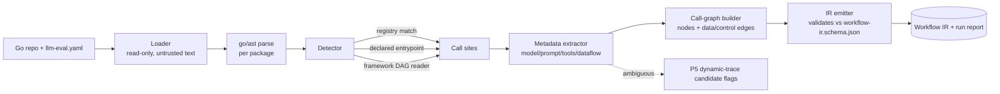

# PRD — P1: Discovery MVP (Go, static)

| Field | Value |
|---|---|
| Phase / Milestone | P1 / M1 |
| Target window | ~Weeks 3–7 |
| Lead role(s) | Backend |
| Supporting role(s) | AI Engineer, DevOps, System Designer |
| Status | Draft |
| OpenSpec change | `p1-discovery-mvp` |

## 1. Summary

The Discovery Engine reads a Go repository as **untrusted text**, finds every static LLM call
site in it, and emits a valid **Workflow IR** (the graph contract frozen in P0). Detection is
driven by a **signature registry** of known SDK entrypoints *and* by **mandatory user-declared
entrypoints** in an `llm-eval.yaml` file, because real codebases wrap the SDK behind in-house
functions and signature matching alone misses those nodes. This phase proves node extraction on
a single language, static-only; it is the gate that turns "a pile of source" into the
configurable node graph every downstream subsystem (Config, Runtime, Metrics, Eval, Analysis)
consumes. Dynamic tracing that would confirm the candidate graph at runtime is explicitly P5.

## 2. Problem & context

Nothing downstream can exist until a codebase becomes a graph of addressable **nodes**. The
Config Layer overrides nodes, the Runtime executes them, Metrics tag events by `node_id`, and the
Eval/Analysis engines attribute failure to a node. Without discovery there is no `node_id` to key
any of it on.

Two facts make naïve discovery wrong:

1. **Wrappers defeat signature matching.** In production Go, `anthropic.Messages.New(...)` is
   rarely called at the leaf; it sits behind `internal/llm.Complete(ctx, prompt)` or a
   `GenerateSummary(...)` helper. A registry of SDK signatures alone under-counts nodes wherever
   the SDK is wrapped — which is almost everywhere. User-declared entrypoints are therefore **not
   optional**; they are a first-class detection source co-equal with the signature registry.
2. **"How many nodes make LLM requests" is only well-defined for static definitions.** An agent
   loop or a router makes a *variable* number of calls at runtime. The IR must count nodes
   **per static definition** and flag loop/agent nodes as `variable-at-runtime`, deferring the
   actual invocation count to dynamic tracing (P5).

**Upstream state assumed (from P0/M0):** `workflow-ir.schema.json` and the typed per-node I/O
contract fields are frozen; `config_hash`/content-hash conventions exist; the static-node vs.
runtime-invocation distinction is a first-class field in the IR; CI is green and can validate a
hand-written IR sample against the schema.

## 3. Goals & non-goals

### Goals
- G1. Parse a Go repo with `go/ast` **without ever executing it**, treating source as untrusted text.
- G2. Detect LLM call sites via a **signature registry** covering `anthropic.messages.create`,
  `openai.chat.completions.create`, LangChain/LangGraph `invoke`, and Bedrock `converse`.
- G3. Detect LLM call sites via **user-declared entrypoints** from `llm-eval.yaml` (wrapper case).
- G4. For each call site extract per-node metadata: model arg, messages/prompt construction,
  tools/skills passed, and the upstream data flow feeding the prompt.
- G5. Build a **call graph**: node = LLM-invoking function/agent step; edges = data/control flow.
- G6. **Special-case framework DAGs** (LangGraph/CrewAI) by reading their declarative graph
  definition instead of inferring topology from call order.
- G7. Emit a **valid Workflow IR** that validates against the P0 schema and is stable/diffable
  across runs.
- G8. Report node count **per static definition** and flag loop/agent nodes as variable-at-runtime.
- G9. Flag call sites whose static data flow is ambiguous as **P5 dynamic-tracing candidates**.

### Non-goals (deferred, with owning phase)
- Dynamic tracing / runtime confirmation of the candidate graph → **P5**.
- Languages other than Go (tree-sitter language-agnostic path) → post-M1, tracked separately.
- Making nodes configurable / the source-transformation engine / registries → **P2**.
- Executing any discovered code or repo tools → sandbox is **P3**; discovery never executes.
- Pattern classification (Routing/Reflection/RAG labels) → **P3.5** (structural), **P5** (behavioral).
- Resolving runtime-dynamic dispatch (which loop branch actually ran) → **P5**.

## 4. Users & personas

- **Platform engineer / repo owner (human).** Runs Discovery on their Go service, authors
  `llm-eval.yaml` to declare in-house wrappers, and inspects the emitted node graph on first import.
- **Downstream subsystems (machine consumers).** The Config Layer (P2) reads the IR to build
  override targets; Metrics (P2.5) keys events on `node_id`; the Pattern Classifier (P3.5) reads
  IR topology; the Eval/Analysis engines (P4+) attribute results per node.
- **AI Engineer (internal).** Audits whether extracted prompt/context metadata is faithful enough
  to later drive overrides, and triages ambiguous-data-flow flags.

## 5. User stories / jobs-to-be-done

**Repo owner**
- As a repo owner, I want to point Discovery at my Go repo and get a list of discovered LLM nodes,
  so that I can see my workflow as an addressable graph on first import.
- As a repo owner whose SDK is wrapped in `internal/llm`, I want to declare that wrapper in
  `llm-eval.yaml`, so that Discovery finds nodes that pure signature matching would miss.
- As a repo owner, I want the node count reported per static definition with loops flagged
  variable-at-runtime, so that I am not misled into thinking an agent loop is a single call.

**Downstream subsystems**
- As the Config Layer, I want each node to carry a precise call-site source span (file, line, AST
  path) and typed I/O contract fields, so that I can rewrite its parameters at the call site via a
  deterministic AST transformation, delivered as a reviewable diff.
- As the Pattern Classifier, I want edges to encode data/control flow and framework DAGs read
  declaratively, so that topology-based detection is reliable rather than inferred from call order.

**AI Engineer**
- As an AI engineer, I want call sites with ambiguous static data flow flagged, so that I can mark
  them as P5 dynamic-tracing candidates rather than trusting a guessed prompt construction.

## 6. Functional requirements

These map 1:1 to the OpenSpec `discovery-engine` requirements.

- **FR1 — Signature-registry detection.** Discovery SHALL detect a call site when a call
  expression resolves (via `go/ast` + type/import info) to an entry in the signature registry.
  The seed registry covers Anthropic Messages, OpenAI Chat Completions, LangChain/LangGraph
  invoke, and Bedrock Converse. The registry is data, extensible without code change.
- **FR2 — User-declared entrypoints (mandatory).** Discovery SHALL load `llm-eval.yaml`, treat
  every declared entrypoint (package-qualified function/method) as an LLM call site of equal
  standing to registry hits, and map declared argument positions/names to node metadata fields.
- **FR3 — Per-call-site metadata extraction.** For each detected call site Discovery SHALL extract
  a precise source span (file, line, AST path) sufficient for a later phase to rewrite the call
  site, the model arg, messages/prompt construction, tools/skills passed, and the upstream data
  flow feeding the prompt — resolving each statically where possible and marking it `unresolved`
  (not omitting it) where not.
- **FR4 — Call-graph construction.** Discovery SHALL build a directed call graph whose nodes are
  LLM-invoking functions/agent steps and whose edges represent data or control flow (output of A
  feeding input of B), and emit it as the Workflow IR node/edge set.
- **FR5 — Framework DAG special-casing.** When a recognized framework (LangGraph/CrewAI) declares
  its graph, Discovery SHALL derive nodes and edges from that declarative definition rather than
  inferring topology from call order, and SHALL record the framework source on the subgraph.
- **FR6 — Static-vs-runtime node counting.** Discovery SHALL report node count **per static
  definition** and SHALL flag any node reachable through a loop or agent control structure as
  `variable-at-runtime`, never emitting a fixed runtime invocation count.
- **FR7 — Valid, diffable IR emission.** Discovery SHALL emit IR that validates against the P0
  `workflow-ir.schema.json` and is deterministic (stable node IDs and ordering) so two runs on
  unchanged source produce byte-stable, diffable output.
- **FR8 — Ambiguity flags for P5.** Discovery SHALL flag any call site whose prompt-construction or
  data-flow could not be statically resolved as a dynamic-tracing candidate for P5, with the reason.

## 7. Non-functional requirements

- **NFR1 — No-execution safety invariant (hard gate).** Discovery SHALL NOT execute, evaluate,
  `go run`, `go build`-with-plugins, import as a plugin, or otherwise run any target-repo code, at
  any point. Analysis is over the AST and text only. This is a security invariant, not a
  preference: discovered source is untrusted.
- **NFR2 — Determinism / reproducibility.** Identical repo state (same content hashes) yields
  byte-identical IR. Node IDs are derived from stable, content-addressable inputs (e.g. package
  path + function + call-site position + a content hash), never from wall-clock or map iteration order.
- **NFR3 — Throughput / scale.** Target: a ~200k-LOC Go repo (~2–3k Go files) discovered in
  **under 60 s** on a single worker; memory bounded by streaming/one-package-at-a-time parsing, not
  by loading the whole repo AST into memory at once. (Back-of-envelope: nodes/repo in the tens to a
  few hundred; this sizes the IR emitter and downstream stores, not a distributed system.)
- **NFR4 — Faithfulness.** Extracted prompt/context metadata must be faithful enough to later drive
  overrides (P2). Where fidelity cannot be guaranteed statically, the field is marked `unresolved`
  and flagged (NFR tie-in to FR8) rather than silently guessed — a wrong-but-confident value is worse
  than an honest `unresolved`.
- **NFR5 — Robustness to hostile/broken input.** Malformed, syntactically invalid, or adversarial
  source (deeply nested expressions, huge literals, symlink cycles) SHALL be handled by
  skip-and-report, never by crash or unbounded resource use. Parse errors degrade to a per-file
  diagnostic; discovery of other files continues.
- **NFR6 — Observability.** Discovery emits a structured run report: files scanned, call sites
  detected by source (registry vs. declared vs. framework), nodes emitted, ambiguity flags, and
  per-file parse diagnostics — enough to diff a discovery run and explain a missing node.
- **NFR7 — Least privilege.** The Discovery worker runs with read-only filesystem access to the
  target repo, no network egress, and no ambient provider credentials.

## 8. System design summary

**Pipeline (single-language, static):**

**Detection sources are co-equal and merged** (a call site found by both registry and declaration
is one node, deduplicated by call-site identity). Three sources feed one node set:
1. **Signature registry** — data-driven table of package-qualified SDK entrypoints + argument maps.
2. **User-declared entrypoints** — `llm-eval.yaml`, resolved the same way, mandatory.
3. **Framework DAG readers** — per-framework plugins that read the declarative graph.

**Node metadata (fields populated into the P0 IR node):** `id`, `call_site {file, line, func,
package}`, `detected_by [registry|declared|framework]`, `model`, `prompt_construction`,
`tools_skills[]`, `upstream_dataflow[]`, typed I/O contract stubs (`input_schema`/`output_schema`,
best-effort static), `variable_at_runtime: bool`, `ambiguity_flags[]`, `framework_source?`.
**Edges:** `{from_node, to_node, kind: data|control, evidence}`.

**Static resolution strategy.** Constant/literal args resolve directly; locally-constructed values
resolve by intra-procedural data-flow (assignment chains, string builders, struct literals for
messages). Anything requiring inter-procedural or runtime-value resolution is marked `unresolved`
and flagged (FR8). No symbolic execution; no running code.

**Interfaces.**
- CLI/service entry: `discover --repo <path> --config llm-eval.yaml --out ir.json`.
- `SignatureRegistry` — pluggable table; add an SDK by adding a row, not code.
- `FrameworkReader` — interface per framework (`Detect(pkg) bool`, `ReadDAG(pkg) (nodes, edges)`).
- Output: Workflow IR JSON + a `discovery-report.json` (NFR6).

## 9. Design by role lens

### Backend (Lead) — explore → design → implement → test → harden → review
- **Understand.** The real requirement is not "grep for `messages.create`"; it is "produce a
  faithful, diffable node graph from untrusted source, honestly marking what static analysis
  cannot know." Invariants to preserve (Phase-1 discipline): *never execute the repo*; *never emit
  a fixed runtime count for a variable node*; *node IDs are stable*; *a missing node is explainable
  from the run report*. These become the test assertions and the review checklist.
- **Explore.** Study how real Go repos wrap LLM SDKs (in-house `Complete()`/`Generate()` helpers,
  interface-typed clients, options structs) and catalog the real call shapes before designing the
  detector — the wrapper reality is the whole reason user-declared entrypoints exist.
- **Design — the contract.** The IR is a public contract that **outlives this code**; populate P0
  fields additively and never invent node-shape fields here. Detection sources are co-equal and
  merged by a stable call-site identity so the same node is never double-counted.
- **Design — the data model / invariants.** Model correctness into the emitter: unique stable
  `node_id`; every node carries `detected_by` and `variable_at_runtime`; every unresolved field is
  explicitly `unresolved`, never absent. Determinism is enforced by sorting and content-addressed
  IDs, not by accident of traversal order.
- **Design — failure behavior.** Enumerate what fails: unparseable file, unknown framework version,
  `llm-eval.yaml` pointing at a nonexistent symbol, cyclic imports, a call site whose model arg is
  a runtime variable. Each has a decided outcome (skip-and-report, mark-unresolved-and-flag,
  degrade the subgraph), never a crash and never a silent drop.
- **Implement, defensively.** Validate `llm-eval.yaml` at the boundary; treat every AST value as
  untrusted; bound recursion depth on expression walking; stream packages to bound memory.
- **Test.** Fixture repos with **known node counts**; assert extracted IR matches exactly. The two
  load-bearing fixtures: (a) **the wrapper case** — the SDK hidden behind an in-house function,
  proving user-declared entrypoints find the node the registry misses; (b) **the framework-DAG
  case** — a LangGraph/CrewAI graph whose nodes/edges must come from the declarative definition.
  Plus a loop/agent fixture asserting `variable_at_runtime`, and a golden-IR diff test for determinism.
- **Harden / Review.** The no-execution invariant is enforced structurally (no `exec`, no plugin
  loading in the discovery path) and asserted in test. Review the diff as an adversary hunting the
  classic failure: a node silently dropped, a variable node given a fixed count, non-deterministic
  IDs, an unhandled parse panic.

### AI Engineer (Support) — fidelity of extracted metadata; ambiguity → P5
- Owns the judgment on whether extracted `prompt_construction` / `tools_skills` / `upstream_dataflow`
  is **faithful enough to later drive overrides** (P2). Where static data flow is ambiguous
  (inter-procedural prompt assembly, runtime-selected model, conditionally-built message lists), the
  call site is flagged a **P5 dynamic-tracing candidate** with a reason — the same "never trust an
  unverified inference" discipline the Analysis engine uses later. An honest `unresolved` + flag
  beats a confident guess.

### DevOps (Support) — CI validation, least privilege
- Owns the **CI job** that runs Discovery on the fixture repos and validates every emitted IR
  against `workflow-ir.schema.json`, failing the build on any schema violation, non-deterministic
  output (golden-IR drift), or a fixture whose node count regresses. Enforces least privilege for
  the discovery worker (read-only repo mount, no network, no provider creds) — the observable proof
  of the no-execution invariant.

### System Designer (Support) — IR-as-contract, throughput
- Confirms the emitted IR satisfies the P0 contract and that Discovery's node/edge shape supports
  every downstream slice (Config override targets, Metrics `node_id` keying, Classifier topology).
  Owns the back-of-envelope throughput estimate (NFR3) that sizes the emitter and the run queue,
  and re-states the static-vs-runtime distinction as an IR invariant.

## 10. Dependencies

- **Upstream (required):** P0/M0 — frozen `workflow-ir.schema.json`, typed I/O contract fields,
  static-node vs. runtime-invocation distinction, content-hash conventions, green CI.
- **Downstream (this unblocks):** P2 (Config Layer rewrites discovered call sites via source transformation), P2.5 (Metrics key on
  `node_id`), P3.5 (Pattern Classifier reads IR topology), P4+ (Eval/Analysis attribute per node),
  P5 (dynamic tracing consumes the ambiguity flags and confirms the candidate graph).

## 11. Risks & mitigations

| Risk | Owner | Mitigation |
|---|---|---|
| Wrappers hide the SDK; pure signature matching under-counts nodes | Backend | User-declared entrypoints in `llm-eval.yaml` as a mandatory, co-equal detection source; wrapper fixture in CI |
| Static analysis can't resolve prompt built inter-procedurally / at runtime | AI Eng | Mark field `unresolved` + flag as P5 dynamic-trace candidate; never guess |
| Loop/agent nodes misreported as single fixed calls | Backend / Sys Designer | `variable_at_runtime` flag; per-static-definition counting; loop fixture asserts it |
| Accidentally executing untrusted repo code | DevOps / Backend | No-execution invariant enforced structurally + in test; read-only, no-network, no-creds worker |
| Non-deterministic IR breaks diffing/reproducibility | Backend | Content-addressed stable node IDs, sorted output, golden-IR diff test in CI |
| Framework DAG version drift breaks the reader | Backend | Per-framework reader is versioned and isolated; unknown version degrades to flagged subgraph, not a crash |
| Malformed/hostile source crashes the parser | Backend | Skip-and-report per file, bounded recursion/resource use, continue on the rest |

## 12. Rollout & test strategy

- **Fixture-driven correctness.** A suite of small Go fixture repos, each with a documented
  expected node count and expected IR; tests assert exact match. Mandatory fixtures: wrapper (SDK
  behind in-house function), framework DAG (LangGraph/CrewAI declarative graph), loop/agent
  (`variable_at_runtime`), malformed-file (skip-and-report), and a multi-source dedup case.
- **Schema-validation gate (DevOps).** CI runs Discovery on every fixture and validates emitted IR
  against `workflow-ir.schema.json`; build fails on any violation.
- **Golden-IR diff.** Emitted IR is committed as golden output; CI fails on non-deterministic drift.
- **No-execution assertion.** A test proves the discovery path performs no process execution / plugin
  load (e.g. sandboxed with process-spawn denied; a fixture containing an `init()` side effect must
  never fire).
- **Safe rollout.** Discovery is read-only and side-effect-free on the target; it can run on any repo
  without risk, so rollout is simply enabling the CI job and the CLI. No data migration.

## 13. Success metrics & acceptance criteria (closes M1)

- [ ] On a **real Go repo**, static LLM nodes are extracted and IR is emitted.
- [ ] Emitted IR **validates against `workflow-ir.schema.json`** in CI.
- [ ] IR is **diffable / deterministic** — re-running on unchanged source produces byte-identical output.
- [ ] **Wrapper nodes are found via user-declared entrypoints** — the wrapper fixture's hidden node
  appears in the IR and is absent when the declaration is removed (proving the mechanism).
- [ ] **Framework-DAG fixture** yields nodes/edges read from the declarative graph, tagged with the
  framework source.
- [ ] Node count is reported **per static definition**; loop/agent nodes are flagged
  `variable_at_runtime` with **no fixed runtime count** emitted.
- [ ] Ambiguous-data-flow call sites are **flagged as P5 dynamic-tracing candidates** with a reason.
- [ ] The **no-execution invariant** holds under test (no target code runs during discovery).

## 14. Open questions

- Q1. Exact `llm-eval.yaml` schema — how are argument positions/names mapped to IR metadata fields
  for a declared wrapper (positional index, param name, or both)? (Backend + Sys Designer to freeze.)
- Q2. Which LangGraph/CrewAI versions does the first framework reader target, and how is version
  drift surfaced (degrade-to-flag vs. hard error)?
- Q3. How deep does intra-procedural data-flow resolution go before a value is declared `unresolved`
  — is there a bounded cost budget per call site? (AI Eng + Backend.)
- Q4. Node-ID scheme: what exact tuple is content-addressed so IDs stay stable across benign
  refactors (line shifts) yet unique per call site? (Sys Designer to specify with P0.)
- Q5. Is `llm-eval.yaml` required to be present (hard fail if absent) or optional-but-recommended,
  given wrappers are the common case?
