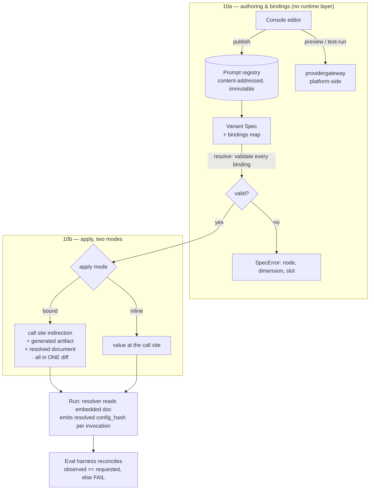

# PRD — P10: Prompt & Model Studio (authoring, bindings, runtime config)

| Field | Value |
|---|---|
| Phase / Milestone | P10 / M13 |
| Target window | ~Weeks 30–46 (two waves: 10a authoring + bindings + studio, then 10b the runtime binding layer) |
| Lead role(s) | Backend + Product Designer (co-leads) |
| Supporting role(s) | System Designer, Frontend, AI Engineer, DevOps, QA Engineer, Sales Operations |
| Status | Draft |
| OpenSpec change | `p10-prompt-model-studio` |
| Architecture decision | [ADR-004](../adr/ADR-004-runtime-config-binding.md) — two-layer apply (amends [ADR-001](../adr/ADR-001-source-transformation-apply-model.md)) |

> **What is already built, and therefore not in scope to build again.** The prompt registry is
> content-addressed and immutable — `version_id = sha256(canonical_json(envelope))`, no `Update*` API
> exists, and the Postgres migration adds a `BEFORE UPDATE OR DELETE` trigger plus a `CHECK` that the
> id equals the hash ([`internal/registry/`](../../internal/registry/)). `{{name}}` templating with
> deterministic rendering and **fail-loud missing *and* unknown bindings** is implemented
> ([`internal/registry/prompt.go`](../../internal/registry/prompt.go)) and specified as P2 FR7.
> Per-node `model_ref` / `prompt_ref` selection exists in the Variant Spec
> ([`internal/variantspec/spec.go`](../../internal/variantspec/spec.go)). **P10 does not re-specify
> any of that.** It adds the three things that are genuinely absent: a way for a human to *write* a
> prompt version, a way to bind a slot to something other than a call-site expression spelled
> identically, and a way to change a model or prompt selection without a new pull request.

## 1. Summary

P10 makes prompts and models **editable, bindable, and operable** — the three verbs the platform
currently cannot perform on its own best-built primitive. Today a prompt version can only be created
by Go code that nothing outside tests calls: there is no HTTP route, no CLI subcommand, and no UI that
reaches `RegisterPrompt`. A prompt's `{{slot}}` can only bind to a call-site expression **spelled
identically** ([`internal/transform/rewrite.go:277`](../../internal/transform/rewrite.go)), so a prompt
edited to introduce a new variable is structurally un-appliable. And because the codemod writes every
configured value *inline* at the call site, changing which model a node uses — or moving it to a newer
version of the same prompt — costs a codemod, a build, and a pull request.

P10 delivers three capabilities against those three gaps. **Prompt authoring**: a write path with
version lineage, a diff between any two versions of a prompt, and a slot-set change analysis that says
in advance which call sites a proposed edit would break. **Variable bindings**: `NodeOverride` gains a
`bindings` map with four validated source kinds — `literal`, `expr`, `env`, `input` — so a slot can be
fed by something the call site does not already spell, with every binding validated **before any
transformation is generated**. **Runtime config binding**: per ADR-004, an opt-in `bound` apply mode in
which the codemod writes an indirection plus a generated binding document *in the same diff*, after
which the model, the prompt version, and `literal`/`env` bindings are **data** that can change without
a new codemod — while wiring, skills, context policy, and `expr`/`input` bindings remain code, because
they name things in the program's lexical scope and cannot honestly be moved into a data file.

All three are driven from the **web console** (P9): browse prompts, edit and publish a version, diff
two versions, bind variables against the call sites Discovery found, pick a model and its inference
params, then **preview** the exact rendered string and **test-run** it against a real model with the
cost and latency recorded. Milestone **M13 — the configuration loop closes in the browser** means a
user can go from "this prompt is wrong" to "this prompt version is live on this node" without leaving
the console — and cannot, at any point in that path, mistake an exploratory test for evidence.

## 2. Problem & context

Everything needed to configure an LLM node exists and is well built. None of it is reachable by a
human, and the parts that are reachable are shaped for a machine that already knows the answer. Six
problems block the configuration loop, and each maps to a design commitment:

- **A prompt cannot be written by a person.** `RegisterPrompt(ctx, name, body)` is a correct,
  content-addressed, immutability-enforced write API — and its only callers outside the package are
  two test files. `internal/api/p2.go` exposes run, transform, spec-resolve and spec-submit; there is
  **no registry endpoint of any kind**, no CLI subcommand, and no UI. So the product's story is "remix
  your prompts," and the only way to author one is to write Go. This is the gap that makes the other
  five matter.
- **There is no history, only a set.** Versions are content-addressed with no parent link, so "the
  history of prompt X" is inferred from entries sharing a name, and nothing anywhere can answer *what
  changed between these two versions* — which is the first question anyone asks before adopting a new
  one. Immutability gives us perfect provenance and no narrative.
- **Editing a prompt can silently un-apply it.** The codemod requires every slot to match exactly one
  call-site operand **by identical source text**, and refuses otherwise. The refusals are correct — an
  unclaimed operand is a runtime value the rewrite would silently drop, and guessing which value
  belongs in which slot is exactly the kind of plausible-but-wrong behavior this codebase refuses
  elsewhere. But the consequence is a trap: a user edits a prompt in a dashboard, adds
  `{{customer_tier}}`, publishes it, points a node at it — and discovers at transform time that it
  cannot be applied anywhere. The failure is late, and it arrives after the work.
- **A slot can only be fed by something the code already spells.** There is no way to say "bind
  `{{tone}}` to the constant `formal`", or "to `$SUPPORT_TIER`", or "to this node's typed input." The
  only expressible binding is an expression that already exists at the call site under exactly that
  name. That is a safe rule and far too narrow a one — it makes prompt editing a strictly
  text-rearranging activity over a fixed variable set.
- **Every configuration change is a pull request.** Because values are written inline, swapping a node
  from one model to another, or from prompt version A to version B, requires a fresh codemod, build,
  and review — the same cost as a structural change. That is proportionate for wiring and
  disproportionate for data, and it turns the "try a model, try a prompt" loop into a build loop.
  ADR-004 resolves this, and its reasoning is that the real question was never *when* a value resolves
  but **which facts are data and which are program structure**.
- **There is nowhere to try something before committing to it.** The platform can run a full
  multi-seed evaluation, which is the right instrument for deciding — and far too heavy for the
  question "does this prompt even produce sensible output?" Without a lightweight loop, users will
  either skip the check or, worse, run a two-sample comparison and treat the result as a finding.

**Upstream state assumed.** **P0** (the IR and `config_hash`; the IR node already records
`prompt.variables`, and this phase requires an **additive** extension for in-scope symbols). **P2**
(the registries, the Variant Spec, the codemod, the worktree/build path — P10 extends all four and
rewrites none of them). **P2.5** (the telemetry substrate the resolved-config reconciliation and the
studio's cost accounting ride on). **P4** (the eval harness — the only thing that produces a rankable
result, and therefore the boundary the studio must not pretend to cross). **P5** (typed I/O contracts
— an `input` binding must satisfy one). **P5.5** (the verified-delta record ADR-004's H3 reads).
**P9** (the console the whole surface lives in).

## 3. Goals & non-goals

### Goals

- **G1. A prompt version can be created by a person, through the product.** The platform SHALL expose
  an authenticated write path that publishes a new prompt version, reusing the existing
  content-addressed registry semantics. Publishing identical content SHALL be idempotent.
- **G2. Editing never mutates.** A published version SHALL never change. An edit SHALL produce a new
  version with the prior one intact and still resolvable, and the interface SHALL say so — the action
  is **"Save as new version"**, never "Save".
- **G3. A prompt has a legible history.** The platform SHALL present the version timeline for a prompt
  name and SHALL produce a **diff between any two versions** covering both the body text and the
  **slot set**, because a slot-set change is the part that alters where the prompt can be applied.
- **G4. A breaking edit is knowable before it is published, not after.** For a proposed prompt edit,
  the platform SHALL report which nodes currently pinning that prompt would **fail to transform**
  under the new slot set, and why. A user SHALL NOT discover un-appliability only at transform time.
- **G5. A slot can be bound to something the call site does not already spell.** The Variant Spec
  SHALL support an explicit `bindings` map with four source kinds — `literal`, `expr`, `env`, `input`
  — resolved per node per slot.
- **G6. Every binding is validated before any transformation is generated.** An unbound slot, an
  `expr` that is not in scope at that call site, an undeclared `env`, or an `input` that violates the
  node's typed contract SHALL be rejected at spec-resolve time with the offending node, dimension and
  slot named. Nothing SHALL be discovered at codemod time that could have been caught at resolve time.
- **G7. Existing specs keep working, and the protective refusals stay.** A slot with no explicit
  binding SHALL continue to bind by today's exact-source-text rule. The **unclaimed-operand refusal
  SHALL remain** — a call-site value that no slot claims is still a refusal, because rewriting past it
  would silently drop a runtime value.
- **G8. Model and prompt selection can change without a new pull request — in `bound` mode, opt in per
  node.** Per ADR-004, the codemod MAY write an indirection plus a generated binding document in the
  same diff; thereafter the model, its inference params, the prompt version, and `literal`/`env`
  bindings SHALL be changeable as data. **`inline` SHALL remain the default.**
- **G9. What is *not* runtime-changeable is stated, not implied.** Node wiring, skills, context
  policy, and `expr`/`input` bindings SHALL require a new diff, because they name things in the
  program's lexical scope. The product SHALL say this plainly rather than implying general runtime
  reconfiguration.
- **G10. An indirection never hides a value from review.** A transformation that introduces a binding
  indirection **without the resolved values in the same change** SHALL be **rejected**, on the same
  footing as one that fails to build. The pull request SHALL render the **effective resolved values**.
- **G11. What ran is reconciled against what was requested.** The resolver SHALL emit the
  `config_hash` of the document it actually resolved on **every invocation**, and the eval harness
  SHALL **fail the run** when observed ≠ requested rather than scoring it.
- **G12. Measurement runs are pinned.** During eval and verification runs the resolver SHALL read only
  the embedded document; override sources SHALL be disabled. A measurement run reads the shipped
  configuration or it does not run.
- **G13. Resolution is fail-static and never a startup dependency.** An unreachable, unparseable or
  invalid override source SHALL leave the last known-good document in force and SHALL report
  **degraded**. It SHALL NOT fail open to an arbitrary or empty configuration, and SHALL NOT block
  process startup. Remote resolution SHALL be opt-in.
- **G14. Running an unverified configuration is visible, not impossible.** Resolving to a
  `config_hash` with no verified-delta record SHALL be permitted, SHALL be **marked unverified in
  telemetry at every invocation** and surfaced as unverified in the console, and SHALL be **refusable
  by automation level**.
- **G15. The studio can try a prompt without pretending to measure it.** The console SHALL support
  **preview** (render a version with sample bindings and show the exact string that would be sent) and
  **test-run** (execute it against a chosen model, recording cost, latency and tokens).
- **G16. An exploratory test is never presentable as evidence.** A studio test or side-by-side
  comparison SHALL be labelled **unranked / exploratory**, SHALL NOT display a winner, a rank, or a
  confidence-bearing claim, and SHALL NOT be a path to promoting a configuration. Only a P4 multi-seed
  CI-bounded run produces a rankable result; only a P5.5 verified delta is a claim.
- **G17. Studio spend is metered separately.** Test-run traffic SHALL be recorded under its own spend
  kind so it never contaminates eval cost metrics.

### Non-goals (explicitly deferred or owned elsewhere)

- **Not a general-purpose prompt IDE.** No prompt chaining, no macro language, no conditionals, no
  partials, no includes. The template language stays exactly what it is — `{{name}}` slots — because
  every feature added to it becomes a feature the codemod must be able to reason about at a call site.
- **Not cross-provider swapping.** ADR-002 stands: swapping a node's *provider* means rewriting the
  SDK call itself, and the transform refuses it with a typed error. P10 changes the model **within** a
  provider.
- **Not a second statistics engine.** The studio measures cost, latency and tokens for a single test
  execution. Scores, intervals, ties, ranks and verified deltas remain P4/P5.5 exclusively (G16).
- **Not general runtime reconfiguration of the user's program.** ADR-004 draws the data/structure line
  deliberately; P10 does not blur it (G9).
- **Not a superseding of ADR-001.** The apply mechanism is still a deterministic AST transformation
  delivered as a reviewable diff. ADR-004 amends *what the transformation may write*, nothing else.
- **Not registry administration.** Deprecating models, repointing price references, and cross-tenant
  registry operations are **P8** (operator console).
- **Not skill or context-policy authoring.** Those registries get the same write-path shape eventually;
  P10 scopes to prompts and models because that is what the configuration loop needs first.
- **Not prompt-content evaluation.** Whether a prompt is *good* is P4's question. P10 makes it
  writable, bindable, and runnable.

## 4. Users & personas

| Persona | What P10 is for them | What would go wrong without it |
|---|---|---|
| **AI / prompt engineer** (primary) | Edit a prompt, see exactly what changed from the last version, bind its variables, preview the rendered string, try it against two models, publish. | Today: writes Go to publish a prompt, and cannot see what changed between versions. |
| **Platform engineer** (primary) | Choose the apply mode per node, review the diff that introduces a binding, and later flip a model without opening a pull request per attempt. | Every configuration change costs a build and a review, so nobody iterates. |
| **Reviewer of a configuration PR** | Read a diff that shows the **effective values**, not an indirection, and see whether the configuration carries a verified delta. | An indirection-only diff makes review theatre — approving a pointer. |
| **Operator on call** | Know that a degraded config resolution is *reported* and that the last known-good configuration is still in force. | A silent fallback to stale or empty configuration is worse than the outage it avoids. |
| **Engineering manager / budget owner** | See studio spend separately from eval spend, so exploration is legible and does not distort the cost picture. | Exploratory traffic silently inflates the eval cost metrics decisions are made on. |

Non-personas: **platform operators** administering the registry across tenants (P8), and **end users
of the customer's LLM product**, who never see this surface.

## 5. User stories / jobs-to-be-done

**AI / prompt engineer**
- As a prompt engineer, I want to edit a prompt and publish it **as a new version**, so that the
  version currently running is never disturbed by my draft.
- As a prompt engineer, I want to see **what changed** between two versions — text *and* slots — so
  that I can tell a wording tweak from a structural change.
- As a prompt engineer, I want to be told **before I publish** which nodes an added variable would
  break, so that I find out from the product rather than from a transform failure a day later.
- As a prompt engineer, I want to bind a slot to a **constant, an environment variable, or a typed
  input**, so that I am not limited to variables my colleagues already happened to name at the call
  site.
- As a prompt engineer, I want to **preview the exact string** that would be sent, so that I am
  reviewing the real prompt and not my mental model of the template.
- As a prompt engineer, I want to **try a version against a model** and see cost and latency, so that
  I can discard the obviously-bad before spending an evaluation on it.
- As a prompt engineer, I want the product to **stop me from calling a two-sample comparison a
  result**, so that I do not accidentally ship a belief.

**Platform engineer**
- As a platform engineer, I want `inline` to stay the default, so that nothing acquires an indirection
  I did not ask for.
- As a platform engineer, I want the diff that introduces a binding to contain the **values**, so that
  the one review I do is a real review.
- As a platform engineer, I want to change a model on a `bound` node **without opening a pull
  request**, so that trying an alternative costs minutes rather than a review cycle.
- As a platform engineer, I want to know **exactly which facts** are runtime-changeable, so that I do
  not plan around a flexibility that does not exist.

**Reviewer / operator**
- As a reviewer, I want to see whether a configuration carries a **verified delta**, so that "this was
  proven better" and "someone selected this" are visibly different states.
- As an operator, I want config-resolution failures to be **fail-static and reported**, so that a
  platform problem cannot change which model my production nodes use, or stop them starting.

**Budget owner**
- As a budget owner, I want studio spend under its **own kind**, so that exploration is visible and
  does not contaminate the numbers I make decisions on.

## 6. Functional requirements

Numbered FRs; each maps 1:1 to an OpenSpec requirement under
`openspec/changes/archive/2026-08-01-p10-prompt-model-studio/specs/`.

### Prompt authoring (capability `prompt-authoring`)

- **FR1.** The platform SHALL expose an authenticated write path that publishes a prompt version,
  reusing the existing content-addressed registry semantics; publishing identical content SHALL return
  the existing `version_id` rather than creating a duplicate.
- **FR2.** A published version SHALL never be mutated or deleted through any interface. An edit SHALL
  produce a new version, and the prior version SHALL remain resolvable by every Variant Spec pinning it.
- **FR3.** A malformed template SHALL be rejected **at publish time**, with the failure identifying the
  offending position — never accepted and deferred to render time.
- **FR4.** The platform SHALL return the **version timeline** for a prompt name, ordered, with each
  entry's `version_id`, slot set, and creation metadata.
- **FR5.** The platform SHALL produce a **diff between any two versions** of a prompt covering the
  body text **and** the slot set, with slot additions and removals identified explicitly rather than
  left to be inferred from the text diff.
- **FR6.** For a proposed prompt body, the platform SHALL report an **impact analysis**: which nodes
  currently pinning that prompt would fail to transform under the proposed slot set, and the reason
  per node.

### Variable bindings (capability `variable-bindings`)

- **FR7.** `NodeOverride` SHALL support a `bindings` map from slot name to a binding source of kind
  `literal`, `expr`, `env`, or `input`.
- **FR8.** Every slot of a node's pinned prompt version SHALL be satisfied by exactly one of: an
  explicit binding, or today's exact-source-text call-site match. An unsatisfied slot SHALL be a
  **resolve-time** rejection naming node, dimension and slot.
- **FR9.** An `expr` binding SHALL be validated against the **in-scope symbols the IR records for that
  call site**; an expression not in scope SHALL be rejected at resolve time, not at codemod time.
- **FR10.** An `env` binding SHALL name a declared environment variable. An absent value at run time
  SHALL be a **typed failure**, never an empty string substituted into the prompt.
- **FR11.** An `input` binding SHALL satisfy the node's P5 typed I/O contract; a violation SHALL be
  rejected at resolve time.
- **FR12.** The **unclaimed-operand refusal SHALL be preserved**: a call-site expression feeding the
  prompt that no slot binds SHALL remain a refusal.
- **FR13.** `bindings` SHALL be part of the resolved configuration, so `config_hash` changes if and
  only if a binding changes. This SHALL be an **additive** extension of the P0 frozen shape.
- **FR14.** A Variant Spec with no `bindings` SHALL resolve exactly as it does today — the extension
  SHALL be backward compatible.

### Runtime config binding (capability `runtime-config-binding`)

- **FR15.** Apply mode SHALL be selectable **per node** as `inline` or `bound`, and SHALL default to
  **`inline`**.
- **FR16.** In `bound` mode the transformation SHALL emit, **in the same diff**, the rewritten call
  site, the generated binding artifact, and the **resolved binding document containing the actual
  values**.
- **FR17.** A transformation that introduces a binding indirection **without** the resolved values in
  the same change SHALL be **rejected** before it is proposed or run.
- **FR18.** The pull request SHALL render the **effective resolved values** for every bound node, not
  only the indirection.
- **FR19.** At run time the resolver SHALL read, in order: the **embedded** document, then a **local
  override** if configured, then a **remote** document only if explicitly enabled.
- **FR20.** Resolution SHALL be **fail-static**: an unreachable, unparseable or invalid override source
  SHALL leave the last known-good document in force and SHALL report **degraded**. It SHALL NOT fail
  open, and SHALL NOT block process startup.
- **FR21.** The resolver SHALL emit the **`config_hash` of the resolved document on every invocation**
  as part of the P2.5 tag set.
- **FR22.** The eval harness SHALL **fail a run** whose observed resolved `config_hash` differs from
  the requested one, rather than recording it under the requested hash.
- **FR23.** During eval and verification runs the resolver SHALL be **pinned** — override sources
  disabled, embedded document only.
- **FR24.** The binding document SHALL record the `config_hash` carrying a **verified delta**.
  Resolving to a configuration with no verified-delta record SHALL be permitted, SHALL be **marked
  unverified** at every invocation and in the console, and SHALL be **refusable by automation level**.
- **FR25.** The generated binding artifact SHALL be dependency-free, readable, deterministic, and
  regenerable; regenerating it from the same configuration SHALL produce a byte-identical result.
- **FR26.** A `bound` change SHALL be revertible by a **single `git revert`** covering the call site,
  the artifact, and the document together.

### Studio (capability `prompt-studio`)

- **FR27.** The console SHALL **preview** a prompt version with supplied sample bindings, showing the
  exact string that would be sent, and SHALL surface a render failure with the offending slot named.
- **FR28.** The console SHALL **test-run** a prompt version against a selected model version,
  recording cost, latency and tokens.
- **FR29.** The console SHALL support **side-by-side comparison** of two prompt versions, or of one
  version across two models, over the same sample bindings.
- **FR30.** Every studio test and comparison SHALL be labelled **unranked / exploratory**, SHALL NOT
  display a winner, rank, score, or confidence interval, and SHALL NOT offer a path to promote a
  configuration from its result.
- **FR31.** Studio traffic SHALL be metered under its **own spend kind**, distinct from eval spend.
- **FR32.** The console SHALL let a user select a **model version and its inference params** and a
  **prompt version** per node, and construct the resulting Variant Spec, showing the resulting
  `config_hash` before submission.
- **FR33.** The console SHALL present, for each node, **which facts are runtime-changeable and which
  require a new diff**, so the product never implies a flexibility it does not have.

### Studio matrix surface — the primary studio view (M-series redesign, 2026-07-25)

The studio's landing surface is a **node × model matrix**: **agent nodes on the horizontal axis
(columns)**, **models on the vertical axis (rows)**. Each intersection is a cell where the user selects
a prompt to **edit, preview, test, save, and inject into runtime**. This replaces the deep single-scroll
studio page with a scannable grid, and matches the established prompt-playground pattern (LangSmith
Playground side-by-side; promptfoo's prompt×model matrix; Opik's model-swapping playground) — with one
deliberate divergence stated in §8.2 D9: **the matrix ranks nothing.** It is a *configuration surface*,
not a leaderboard; ranking stays with P4 (multi-seed eval) and P5.5 (verified delta).

- **FR34.** The studio SHALL present a **matrix** with agent nodes as columns and models as rows, sourced
  from the workflow's discovered nodes and the model registry. It SHALL be reachable as a **primary
  console surface** (a top-level destination), not a page nested several clicks deep.
- **FR35.** A prompt is **node-scoped**: it belongs to a node (a column). Editing a prompt from any cell
  in a column SHALL produce a **new immutable version** of that node's prompt; the model (the row) is
  what the cell previews and tests against. This preserves content-addressed immutability (FR3–FR6).
- **FR36.** Each cell SHALL support, over the node's prompt and the cell's model: **variable injection**
  (supply sample bindings), **edit** (author a new version), **preview** (FR27, byte-identical),
  **test-run** (FR28, output + cost + latency + tokens), and **save-and-bind** (FR37).
- **FR37.** "Save and inject into runtime" SHALL bind the node to the cell's **(model, prompt version)**
  via `bound` apply mode (FR15–FR21): it writes the node's binding-document entry and is **marked
  unverified** (FR23) — a studio selection is "someone chose this," never "proven better" — and is
  **refusable by automation level** (FR24). It offers **no promotion path** and asserts **no ranking**
  (FR30).
- **FR38.** At most **one cell per column** SHALL be the node's bound (runtime) configuration; the rest
  are exploratory. The bound cell SHALL be visibly marked as *in force*, distinct from *verified*
  (FR23) — "in force" is not "proven better."
- **FR39.** A cell's variable bindings SHALL be authored per the four binding kinds (FR7): `literal`,
  `expr`, `env`, `input`, validated at resolve (FR9) with the node/dimension/slot named on failure.
- **FR40.** The matrix SHALL display **no aggregate score, no per-cell rank, no winner, and no
  best-cell highlight**. Cost/latency/token figures on a tested cell are the raw figures of that
  execution (FR28), never a comparative judgement.

## 7. Non-functional requirements

| # | Requirement | Target |
|---|---|---|
| **NFR1** | **Immutability is enforced, not observed** | No interface — HTTP, CLI, UI or Go — expresses mutation of a published version. The existing DB trigger remains the last line, not the first. |
| **NFR2** | **Resolve-time validation is complete** | Every binding failure class is caught at spec-resolve, before a transformation is generated. A failure that first appears at codemod time is a defect. |
| **NFR3** | **Preview fidelity** | The previewed string is byte-identical to what a run with those bindings would send. A preview that approximates is worse than no preview. |
| **NFR4** | **Determinism** | Same configuration → byte-identical binding artifact and document (FR25); same template + bindings → identical render. |
| **NFR5** | **Resolution latency** | Config resolution SHALL NOT add measurable latency to a node invocation — the document is parsed once and held, not read per call. |
| **NFR6** | **Startup independence** | The process starts with the embedded document even with every override source unreachable (FR20). |
| **NFR7** | **Reconciliation coverage** | Every invocation carries its resolved `config_hash`; a run with any unreconciled invocation is failed, not partially scored. |
| **NFR8** | **Repository footprint** | The generated artifact is small, dependency-free, and readable by a human reviewing the PR — it is code the customer now owns. |
| **NFR9** | **Privacy** | Prompt bodies are customer content: never logged, never in telemetry attributes, never in an error message. Blob storage is content-addressed as today. |
| **NFR10** | **Tenant isolation** | A prompt version, binding document and studio run are scoped to one tenant server-side; a client-supplied identifier cannot widen scope (P9 NFR12). |
| **NFR11** | **Studio cost bounding** | Test-runs are subject to a bounded per-user and per-tenant spend cap; exhausting it stops the test rather than overspending. |
| **NFR12** | **Impact analysis honesty** | FR6 reports what it can determine and **names what it could not analyze**; silence is not a clean bill of health. |

## 8. System design summary

### 8.1 The two layers, and the line between them



**The data/structure line** (ADR-004) is the design's core claim and must be stated the same way
everywhere:

| Fact | `bound` mode location | Runtime-changeable |
|---|---|---|
| Model id + inference params | binding document | **yes** |
| Prompt template body / version | binding document | **yes** |
| `literal` binding | binding document | **yes** |
| `env` binding (the variable *name*) | binding document | **yes** |
| `expr` binding — a call-site expression | rewritten call site | **no** |
| `input` binding — a typed graph input | rewritten call site | **no** |
| Wiring, skills, context policy | the source | **no** |

An `expr` names a variable in the user's **lexical scope**. Moving it into a data file would need
either reflection Go does not offer or a string the program evaluates — so it is structure, and it
stays structure. This is why P10 promises "model and prompt become data" rather than "runtime
configuration," and the console states it per node (FR33).

### 8.2 Decisions, with what was rejected

| # | Decision | Rejected alternative | Why (八级法则 arbitration) |
|---|---|---|---|
| **D1** | **Two-layer apply, `bound` opt-in per node, `inline` default** | Inline-only (status quo); or making `bound` the default | Inline-only makes P10's loop a build loop — an **L3 UX** cost paid to avoid a containable hazard set. But defaulting to `bound` would move every existing user onto a new indirection and a new failure mode they did not ask for — an **L2 稳定** change bought with L3 convenience, which the ordering forbids. Opt-in is the only shape that pays neither price. |
| **D2** | **`bindings` map with four validated source kinds** | Infer bindings; or restrict editing to the existing slot set | Inference is precisely the "guess which value belongs in a slot" this codebase already refuses in `promptExprFor`. Restricting to existing slots leaves the central use case — add a variable — impossible. Explicit + validated is the only option that is both safe and useful. |
| **D3** | **All binding validation at spec-resolve, none deferred to codemod** | Validate during transformation, where the AST is available | **L3 UX**: a failure at codemod time arrives after the user has published a version and built a spec. Resolve-time failure names node, dimension and slot while the user is still in the editor. Reuses the existing `variantspec.SpecError` shape rather than inventing a second error channel. |
| **D4** | **Resolved values ship in the same diff; an indirection without them is rejected** | Let the indirection ship and keep values platform-side | **L1/L5**: review is ADR-001's central property, and a diff that shows a pointer is review theatre. Rejecting is on the same footing as rejecting a transform that fails to build — a hard gate, not a lint. |
| **D5** | **Resolved `config_hash` emitted per invocation and reconciled by the harness** | Trust that the resolver read what it was told to read | **L2 稳定 / event-write-reconcile-read**: an invariant that depends on ordering rather than on an idempotent reconcile point on the data's necessary path is not enforced. This also *adds* a guarantee inline mode never had. |
| **D6** | **Fail-static resolution; remote opt-in; never a startup dependency** | Fetch at startup and fail if unavailable (simple, always fresh) | **L2 稳定 over L3/L4**: a platform outage must not become a customer outage, and a silent fallback to stale config would be worse than the outage. Degraded is a **reported state**, not a quiet substitution. |
| **D7** | **Unverified resolution is visible and refusable, not forbidden** | Hard-forbid resolving to an unverified config | **L3 UX + honesty**: an operator sometimes must. Forbidding pushes people to work around the mechanism, which loses the telemetry that made the risk visible. Marked-at-every-invocation plus automation-level refusal keeps both the capability and the signal. |
| **D8** | **The studio is explicitly not an evaluator** | Let a side-by-side show a winner | **L1-adjacent product honesty**: a two-sample comparison presented as a result is precisely the amateur loop (*change → eyeball → ship*) P4 exists to replace. The studio's value is discarding the obviously-bad cheaply; the moment it ranks, it competes with the instrument that is actually honest. |
| **D9** | **The studio's primary surface is a node × model matrix that ranks nothing** (M-series) | A plain leaderboard grid that scores/ranks cells (the obvious "which model is best" table every eval tool ships) | **Extends D8 to the matrix's own layout.** Nodes-as-columns matches how a user configures a workflow — per node — and the grid is scannable where the deep single-scroll page was not (**L3 UX**). But a grid *invites* a best-cell highlight, and that highlight would be D8's forbidden ranking wearing a new shape (**L1 product honesty**). So the matrix is a **configuration surface**: each cell previews/tests and can be *bound* (selected into runtime, `bound` mode, marked **unverified**), but no cell is scored, ranked, or marked "best." "In force" ≠ "proven better." A prompt is **node-scoped** (a column), so an edit is a new immutable version of that node's prompt (preserves FR3–FR6) — rejected the cell-scoped-prompt alternative, which would fragment one node's prompt across models and multiply versions with no analytical gain (**L6 扩展性**). |

### 8.3 Data model additions (all additive)

```
NodeOverride                 += Bindings map[string]BindingSource   // FR7, FR13
                             += ApplyMode  "inline" | "bound"       // FR15, default inline
BindingSource                =  {Kind: literal|expr|env|input, Value string}
IR node.call_site            += in_scope[]  // symbols bindable by `expr`; ADDITIVE to an
                                            // x-frozen: additive-only object
BindingDocument              =  {config_hash, verified_config_hash?, nodes: {node_id ->
                                {model, params, prompt_template, literal_bindings, env_bindings}}}
prompt version timeline      =  read model over existing registry rows (no new table)  // FR4
```

No new pipeline, no new statistics, and no new registry table — the timeline and the diff are **read
models over rows that already exist**, which is the same discipline P8 and P9 follow.

### 8.4 What P10 explicitly reuses

`registry.RegisterPrompt` / `ResolvePrompt` (write and read, already content-addressed),
`registry.ParseTemplate` / `Template.Render` / `Template.Segments` (parsing, rendering, and the
codemod's segment order), `variantspec.SpecError{NodeID, Dim, Ref}` (the resolve-time error channel),
`providergateway.Complete` (platform-side model calls — the studio is a platform caller, so ADR-002
routes it through the gateway), `SpendReport.by_kind` (P4's existing per-kind spend accounting, which
FR31's separate studio kind slots into), and P9's console rules (tokens, English strings,
render-as-received, no credential in the browser, browser-rendered acceptance).

## 9. Design by role lens

**Backend (co-lead) — *the write path is small; the validation path is the product.***
`RegisterPrompt` already does the hard part correctly — content addressing, canonical JSON, envelope
sealing, re-hash-on-read corruption detection, and a DB trigger that makes mutation inexpressible.
Exposing it is a thin authenticated route, and the discipline is to keep it thin: **no `Update`, no
`Delete`, no soft-delete**, because the moment an interface expresses mutation, the immutability that
`config_hash` reproducibility rests on becomes a convention rather than a property. The substantive
backend work is validation. Every binding failure class is resolved **at spec-resolve time** (D3),
which means the resolver needs the IR's in-scope symbols and the node's typed contract in hand before
any AST work happens — and it reports through the existing `SpecError{NodeID, Dim, Ref}` channel
rather than a second one, so one error shape reaches the console. Two protective behaviors are kept
deliberately: the **unclaimed-operand refusal** (FR12), because rewriting past a call-site value the
prompt does not consume would silently drop it, and **fail-loud rendering** on missing or unknown
bindings, because a partially-rendered prompt still returns a plausible completion that still gets
scored. Backward compatibility is a requirement, not an aspiration: a spec with no `bindings` resolves
exactly as today (FR14).

**Product Designer (co-lead) — *name what the system actually does, and fail early enough to matter.***
Three copy-and-flow decisions carry most of this phase's usability. First, the editor's action is
**"Save as new version"** — publishing is immutable and content-addressed, so a "Save" button would be
a verb describing something the system does not do, and a verb that lies is a bug rather than a
wording preference. Second, the *impact analysis* (FR6) exists because the natural failure here is
late: a user edits a prompt, adds a variable, publishes, points a node at it, and learns at transform
time that it cannot be applied. Moving that discovery **before publish** is worth more than any amount
of error-message polish afterwards. Third, FR33 — showing per node which facts are runtime-changeable
and which need a diff — exists because the honest version of this feature is narrower than the phrase
"runtime configuration" suggests, and a product that implies flexibility it lacks generates a support
ticket at exactly the moment the user is most committed. The unhappy paths are designed first
throughout: an unbound slot names the slot, a broken template names the position, a degraded resolver
says which source failed and that the last known-good config is still in force.

**System Designer (support) — *the decision was never "when does it resolve".***
The productive reframing behind ADR-004 is that the tension was not between compile-time and run-time
but between **data and program structure**, and those are separable with a defensible line: a fact
that names something in the user's lexical scope is structure; a fact that is a value is data. That
line is not a preference — an `expr` binding cannot move into a document without reflection Go does
not offer or an `eval` nothing should have. Drawing it explicitly is what lets the product make a
precise promise (§8.1) instead of a vague one, and it is why `bound` mode does not gradually become a
general runtime-reconfiguration surface: there is a principled place where it stops. Two one-way doors
are decided here rather than discovered later: `bindings` entering `config_hash` (additive to a frozen
P0 shape — the version that omits it must keep hashing as it does today), and the binding document's
format, which is a public contract the moment it ships in a customer's repository.

**AI Engineer (support) — *the studio's job is to be cheap, not to be right.***
A lightweight try-it loop is genuinely valuable: most bad prompts are obviously bad, and spending a
multi-seed evaluation to discover that is waste. But the same loop is one design decision away from
becoming the amateur loop the whole platform exists to replace — *change → eyeball → ship*. So the
boundary is drawn hard (D8, FR30): a studio test shows **cost, latency, tokens and the output**, and
never a score, a rank, a winner, or an interval. A side-by-side displays two outputs; it does not
declare one better, because two samples cannot support that claim and a UI that implies it is
manufacturing false confidence. Nothing promotes a configuration from a studio result — promotion runs
through P4's multi-seed CI-bounded comparison and, for a claim, P5.5's verified delta. The same
discipline governs FR24's unverified marking: "someone selected this" and "this was proven better" are
different states and must never render the same. And FR31's separate spend kind matters for the same
reason — exploration folded into eval cost would corrupt the numbers optimization decisions are made
on.

**Frontend (support) — *the studio inherits P9's rules; it does not restate them.***
Every P9 rule applies unchanged: one token set, English strings with `en-US` formatting through the
single swap point, render-as-received, no credential in the browser, loading/empty/error as three
renderings, the `p4board` accessibility level as the floor, and browser-rendered acceptance rather
than a green build. Three surfaces are new and each has a specific hazard. The **version timeline**
must make the *current* version unmistakable — a list of hashes where the live one is not obvious is
an invitation to point a node at the wrong one. The **diff view** must show the **slot-set change
separately from the text change** (FR5), because a slot change is the part that alters where the
prompt can be applied and it is nearly invisible inside a body diff. The **binding editor** offers
in-scope expressions from the IR rather than a free-text box wherever it can, because a validated pick
list turns a resolve-time rejection into a choice that cannot be made wrong. Prompt bodies are
customer content, so they are rendered as text and never as markup (P9 R7), and never logged.

**DevOps (support) — *a config path into the customer's production process is a blast-radius change.***
This phase puts a generated artifact and a resolved document **inside the customer's repository and
build**, which is a footprint they now own and operate. Three requirements do the containment.
**Fail-static** (FR20): an unreachable or invalid override leaves the last known-good document in
force and reports **degraded** — never fail-open to an arbitrary config, never fail-closed at startup,
because a platform problem must not be able to change which model a production node uses *or* stop the
process booting. **Remote is opt-in** (FR19), so the default posture has no runtime dependency on us
at all. **Degraded is a reported state**, not a silent fallback — a resolver quietly serving stale
configuration is worse than the outage it avoided, and health belongs on a readable endpoint rather
than inferred from a screen. The generated artifact is held to the same bar as anything else shipped
into a customer environment: dependency-free, deterministic, regenerable byte-identically (FR25),
small enough to review, and revertible in one `git revert` together with the change that introduced it
(FR26).

**QA Engineer (support) — *this phase's invariants are exactly the kind that pass while being false.***
Three assertions carry the phase, and each targets a failure that is green by default. **Immutability
is asserted through the read path, not the write return**: publish, then re-resolve, then verify the
prior version still renders identically — a test that stops at the write call cannot see a corrupted
or shadowed entry. **The reconciliation must be able to go red**: deliberately resolve a document
whose `config_hash` differs from the requested one and assert the run **fails** rather than being
recorded — if that test cannot be made to fail, FR22 is decoration. **Preview fidelity is a
byte-comparison**, not an eyeball: the previewed string must equal the string an actual run sends,
because a preview that approximates is a confident lie. Beyond those: every binding failure class has
a resolve-time case naming node/dimension/slot; the `env`-absent path asserts a **typed failure**, not
an empty substitution; the fail-static path is exercised with the override source unreachable,
malformed, and valid-but-stale in turn; and the backward-compatibility case asserts a spec with no
`bindings` produces a `config_hash` identical to today's. Studio behavior gets a test that no ranking,
score or winner appears anywhere in a comparison result — G16 is a product guarantee, so it is a
failing test rather than a review note.

**Sales Operations (support) — *this is the most demo-able capability in the product, which is the risk.***
Editing a prompt, switching a model, and seeing output change in seconds is the single most compelling
thing this platform does in a room. That is exactly why the commitment discipline binds hardest here.
Two claims must never be made. First, **"runtime configuration" must be stated with its boundary** —
model and prompt version are data; wiring, skills, context policy and call-site-expression bindings
require a code change (G9, FR33). A customer who plans around general runtime reconfiguration
discovers the truth during delivery, and that is a broken commitment, not a misunderstanding. Second,
**a studio comparison is not a result** — showing two outputs side by side and saying "as you can see,
the new prompt is better" sells the amateur loop under the banner of a platform built to replace it,
and it is contradicted by the product's own screen (FR30). The honest pitch is stronger anyway: *try
it in seconds, then prove it with a multi-seed evaluation and ship it as a verified pull request.*
Maturity labelling applies as usual — 10b's runtime layer is not promisable until it is delivered, and
until then the loop is real but each change is still a reviewed diff.

## 10. Dependencies

**Requires**
- **P0** — `config_hash` (which `bindings` extends **additively**) and the IR, which needs an
  **additive** `in_scope` extension per call site for FR9.
- **P2** — the registries (extended, not replaced), the Variant Spec, the codemod, and the
  worktree/build path.
- **P2.5** — the telemetry substrate FR21's per-invocation `config_hash` and FR31's spend kind ride on.
- **P4** — the eval harness that performs FR22's reconciliation, and the boundary the studio must not
  claim to cross.
- **P5** — typed I/O contracts, which an `input` binding must satisfy (FR11).
- **P5.5** — the verified-delta record FR24 reads.
- **P9** — the console the entire surface lives in.

**Unblocks**
- The configuration loop closes in the browser: edit → bind → preview → test → select → apply.
- P6's autonomous optimizer gains a cheaper apply path for the dimensions that are data — a prompt or
  model change on a `bound` node no longer requires a codemod per candidate.
- Skill and context-policy authoring later reuse this write-path and impact-analysis shape.

## 11. Risks & mitigations

| Risk | Owner | Mitigation |
|---|---|---|
| The indirection hollows out review — reviewers approve a pointer | System Designer + Backend | FR17 **rejects** an indirection without resolved values in the same change; FR18 renders effective values in the PR. A hard gate, not a guideline. |
| A run is scored against a configuration it did not execute | AI Engineer + Backend | FR21/FR22 — per-invocation resolved `config_hash` reconciled by the harness, run **failed** on mismatch; FR23 pins the resolver during measurement. QA asserts the check can go red. |
| A platform outage changes or halts customer production | DevOps | FR19/FR20 — embedded-first, remote opt-in, fail-static, never a startup dependency, degraded **reported**. |
| Production silently moves to an unverified configuration | AI Engineer + Product | FR24 — marked unverified at every invocation and in the console, refusable by automation level. Visible rather than forbidden, so nobody routes around it. |
| A prompt edit un-applies nodes and the user finds out late | Product + Backend | FR6 impact analysis **before publish**; FR8 rejects at resolve time with node/dimension/slot named. NFR12 requires naming what could not be analyzed. |
| Binding inference creeps back in under delivery pressure | Backend | D2 is a spec requirement: bindings are explicit and validated. The existing `promptExprFor` refusal text is the precedent — this codebase already declined to guess. |
| A studio comparison is read as a result | AI Engineer + Product + Sales | FR30 is a failing test, not a review note: no score, rank, winner or interval in any studio surface, and no promotion path from one. |
| `bound` becomes the default by drift | Product + System Designer | FR15 fixes `inline` as the default; mode is visible in the diff and the console. |
| The generated artifact rots inside customer repositories | DevOps | FR25 — deterministic and regenerable byte-identically; NFR8 — small, dependency-free, reviewable. |
| `bindings` entering `config_hash` breaks existing specs | System Designer + QA | FR13/FR14 additive; QA asserts a spec without `bindings` hashes identically to today. |
| Prompt bodies leak into logs or telemetry | DevOps + Backend | NFR9 — customer content is never logged, never a span attribute, never in an error message. |

## 12. Rollout & test strategy

**Wave 10a — authoring, bindings, studio.** Entirely ADR-001-compatible; no runtime layer, no new
production-path risk. Delivers the write path, version timeline and diff, impact analysis, the
`bindings` map with full resolve-time validation, and the console studio (preview, test-run, compare).
Ends when a user can author a prompt, bind its variables, try it, and apply it — with every apply
still `inline`.

**Wave 10b — the runtime binding layer.** The contested half: `bound` apply mode, the generated
artifact and document, resolution order and fail-static behavior, the per-invocation reconciliation,
pinned measurement runs, and the unverified marking. Sequenced second **deliberately** so its L2
stability surface is isolated and the wave is independently cuttable — if it is dropped, 10a is still
a complete, coherent phase.

**How correctness is proven.**
1. **Immutability through the read path** — publish, re-resolve, assert the prior version still
   renders identically; assert no interface expresses mutation.
2. **Resolve-time completeness** — one case per binding failure class, each asserting the error names
   node, dimension and slot, and asserting the failure occurs **before** any transformation is
   generated.
3. **Backward compatibility** — a spec with no `bindings` produces today's `config_hash` byte-for-byte.
4. **Reconciliation can go red** — deliberately resolve a mismatched document and assert the run
   **fails**; a check that cannot fail is decoration.
5. **Preview fidelity** — byte-compare the previewed string against what a real run sends.
6. **Fail-static** — exercise the override source unreachable, malformed, and stale-but-valid; assert
   last known-good stays in force and degraded is **reported**.
7. **Determinism** — regenerate the artifact and document from the same configuration; assert
   byte-identical (FR25).
8. **Review gate** — assert a transformation introducing an indirection without resolved values is
   rejected (FR17).
9. **Studio honesty** — assert no score, rank, winner or interval appears in any studio result, and
   that no promotion path exists from one (FR30).
10. **Browser-rendered acceptance** — per P9, every user-visible behavior verified in a real browser
    against a real API response, with the error path walked. A green build is not acceptance.

## 13. Success metrics & acceptance criteria (M13 exit checklist)

- [ ] **A1.** A user publishes a prompt version from the console; re-publishing identical content
      returns the same `version_id` (G1, FR1).
- [ ] **A2.** No interface — HTTP, CLI, UI or Go — expresses mutation or deletion of a published
      version, and the prior version still resolves after an edit (G2, FR2, NFR1).
- [ ] **A3.** The editor's action reads **"Save as new version"**; no control implies in-place editing
      (G2).
- [ ] **A4.** A malformed template is rejected at publish with the offending position named (FR3).
- [ ] **A5.** The version timeline renders with the **live** version unmistakable, and a two-version
      diff shows the **slot-set change separately** from the text change (G3, FR4, FR5).
- [ ] **A6.** Proposing a prompt edit that adds a slot reports **which nodes would fail to transform,
      and why**, before publish — and names anything it could not analyze (G4, FR6, NFR12).
- [ ] **A7.** A slot is bound to a `literal`, an `env`, an `expr`, and an `input` in turn, and each
      applies correctly (G5, FR7).
- [ ] **A8.** Every binding failure class is rejected at **spec-resolve time**, naming node, dimension
      and slot — none first appears at codemod time (G6, FR8–FR11, NFR2).
- [ ] **A9.** An absent `env` value at run time is a **typed failure**, never an empty string in the
      prompt (FR10).
- [ ] **A10.** The unclaimed-operand refusal still fires (G7, FR12).
- [ ] **A11.** A Variant Spec with no `bindings` produces today's `config_hash` byte-for-byte (G7,
      FR13, FR14).
- [ ] **A12.** Apply mode defaults to `inline`; `bound` is opt-in per node and visible in the diff and
      the console (G8, FR15).
- [ ] **A13.** A `bound` transformation emits call site, artifact and **resolved values** in one diff;
      one that omits the values is **rejected** (G10, FR16, FR17).
- [ ] **A14.** The pull request renders the **effective resolved values** for every bound node (G10,
      FR18).
- [ ] **A15.** Resolution order is embedded → local override → remote-if-enabled, and the process
      starts with every override source unreachable (FR19, NFR6).
- [ ] **A16.** An unreachable, malformed, or invalid override leaves last known-good in force and
      **reports degraded** — never fail-open, never blocking startup (G13, FR20).
- [ ] **A17.** Every invocation carries its resolved `config_hash`, and a mismatched run **fails**
      rather than being scored — demonstrated by deliberately mismatching it (G11, FR21, FR22, NFR7).
- [ ] **A18.** Eval and verification runs are **pinned**; override sources are disabled in the sandbox
      (G12, FR23).
- [ ] **A19.** Resolving to a configuration with no verified delta is permitted, **marked unverified**
      at every invocation and in the console, and refused under Autonomous (G14, FR24).
- [ ] **A20.** The artifact regenerates byte-identically, and a `bound` change reverts in a **single
      `git revert`** (FR25, FR26).
- [ ] **A21.** Preview output is **byte-identical** to what a run with those bindings sends (G15,
      FR27, NFR3).
- [ ] **A22.** A test-run records cost, latency and tokens under a **studio-specific spend kind**,
      distinct from eval spend (G17, FR28, FR31).
- [ ] **A23.** No studio surface displays a score, rank, winner or interval, and no promotion path
      exists from a studio result (G16, FR29, FR30).
- [ ] **A24.** Each node shows **which facts are runtime-changeable and which need a diff** (G9, FR33).
- [ ] **A25.** A prompt body appears in no log line, span attribute, or error message (NFR9).

## 14. Open questions

1. **Binding document format and location.** It becomes a **public contract** the moment it ships in a
   customer repository, so the format (JSON vs. a generated source constant), the path, and the
   evolution rule need an explicit decision. Preference: a JSON document plus a generated accessor, so
   the values are diffable as data and the accessor is type-checked by the customer's own build.
2. **`in_scope` extraction cost.** FR9 needs the IR to record bindable symbols per call site.
   Determining full lexical scope is more expensive than what Discovery does today, and the schema is
   `additive-only`. Open: whether to record full scope, or only the symbols already reaching the call
   (cheaper, narrower, and possibly sufficient for the real use case).
3. **Prompt version lineage.** Content addressing gives provenance but no parent link, so "history" is
   currently inferred by name. Open: whether to record an explicit `derived_from` at publish (better
   narrative, and it makes a rename-vs-fork distinction expressible) or keep the name-grouped read
   model and avoid a new stored fact.
4. **Studio sample sets.** Where do preview/test sample bindings come from — hand-entered, saved per
   prompt, or drawn from P4 eval cases? Drawing from eval cases is the most useful and the closest to
   the line P10 must not cross (D8); the labelling would have to be unambiguous.
5. **`bound` mode for non-Go languages.** The generated-accessor shape is straightforward in Go. For
   the tree-sitter-backed languages (ADR-003) the verification strength is weaker, and whether `bound`
   is offered there at all — or offered with a recorded lower strength — needs a decision.
6. **Interaction with P6.** A `bound` node makes a candidate cheaper to try, which changes the
   optimizer's search economics. Whether P6 should prefer `bound` nodes, or whether that would bias
   the search toward whatever happens to be bound, is a real question and is deliberately out of scope
   here.
