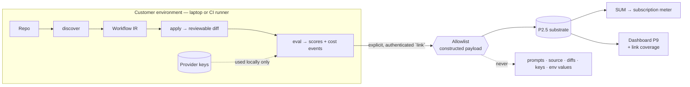

# PRD — P11: CLI & CI Integration (the acquisition surface and the metering path)

| Field | Value |
|---|---|
| Phase / Milestone | P11 / M14 |
| Target window | ~Weeks 22–38 (two waves: 11a CLI core + linking, then 11b CI integration) |
| Lead role(s) | Backend + DevOps (co-leads) |
| Supporting role(s) | Product Designer, System Designer, AI Engineer, Frontend, QA Engineer, Sales Operations |
| Status | Draft |
| OpenSpec change | `p11-cli-ci-integration` |
| Related | [P12 — Forge Delivery](P12-forge-delivery.md) · [ADR-005](../adr/ADR-005-forge-delivery-and-credential-posture.md) · [P9 — Web Console](P9-web-console.md) |

> **Commercial position.** This is **delivery surface #1** and the only one available on **every plan,
> including Free**. Apache-2.0 was chosen so "the discovery/CLI layer can be adopted freely and become
> the ecosystem's ingestion standard" ([root README](../../README.md)) — so the CLI's job is adoption,
> not extraction. It runs **fully offline with no account**. Linking a run to the platform is an
> explicit, authenticated, opt-in act, and it is the moment a user's local results become legible in
> the dashboard. That is the conversion, and it has to be earned rather than forced.

> **Money-in-git rule.** No dollar amounts, percentages, or price bands appear in this document. Plans
> are referred to by **name only** — Free / Team / Business / Enterprise.

## 1. Summary

P11 turns a 163-line discovery binary into the product's front door and its metering path. Today
[`cmd/discover`](../../cmd/discover/main.go) extracts a Workflow IR and writes two JSON files. That is
the entire CLI, and it is specified in exactly two lines across the whole repository. Meanwhile the
README promises the CLI "runs discovery / **codemod** / **eval** in your own build environment with
**your own provider keys**" — of which only discovery exists, and there is no CI integration at all.

The commercial consequence is sharper than the feature gap. P7 derives the billable value metric —
**LLM spend under management** — from the P2.5 cost events. But the CLI is supposed to run eval **in
the customer's environment with the customer's keys**, so those cost events are emitted *there*. They
reach no substrate, so **SUM is zero and the subscription meter has nothing to bill**.

P11 delivers three things. A **complete CLI** — `discover`, `apply`, `eval`, `link`, `login`, `status`
— that works with no account and no network, because the free tier has to be genuinely free to be an
ingestion standard. An **egress boundary** (`link`) that is opt-in, authenticated, shows exactly what
it will send *before* sending it, and is built from an **allowlist** of permitted fields — cost,
latency, token counts, IR structure, config hashes — that **never** includes prompt text, source, diffs,
or provider keys. And a **CI integration** that posts checks, uploads artifacts, distinguishes *"your
gate failed"* from *"our tool broke"* in its exit code, and **never fails a customer's build because our
service was unavailable**. Milestone **M14 — the free tier is adoptable and the meter can see** means a
developer can use the whole product locally without an account, and a customer who chooses to link gets
a dashboard that reflects reality and a meter that bills only what it actually observed.

## 2. Problem & context

Everything the CLI is supposed to do exists as a library and is reachable only from a server. Six
problems block the acquisition surface, and each maps to a design commitment:

- **The CLI does one of the three things it advertises.** `cmd/discover` takes `--repo --config --out
  --report --repo-url --commit --workflow-id` and emits an IR plus a discovery report. The codemod
  ([`internal/transform`](../../internal/transform/)) and the eval harness
  ([`internal/evalharness`](../../internal/evalharness/)) have no command-line entry point at all. A
  user who reads the README and installs the CLI can discover their graph and then stop.
- **There is no metering path, so the business model has no input.** SUM is *"derived from the P2.5
  cost events, not collected by a second pipeline."* Correct — but a run executed on a developer's
  laptop or in the customer's CI emits its cost events into that environment. Without a deliberate,
  consented path from there to the platform, the meter measures nothing, and the dashboard has nothing
  to show either. **The same missing link breaks both the product surface and the revenue model.**
- **Sending anything at all is a trust decision, and the default matters more than the mechanism.**
  This tool runs over proprietary source with the customer's own provider keys. A developer tool that
  phones home by default while reading a private repository is a trust event, and for a product whose
  strategy is *become the ecosystem's ingestion standard*, trust is the strategy. The boundary has to
  be opt-in, legible before it is crossed, and conservative by construction rather than by review.
- **Redaction built as a denylist eventually leaks.** Stripping known-sensitive fields out of a rich
  object fails silently the first time someone adds a field and forgets the stripper — and the failure
  mode is customer source in our logs. The payload must be **constructed** from an allowlist, so a new
  field is absent by default rather than present by default.
- **CI needs to tell three failures apart and today could not.** *"A quality gate you configured
  failed," "the tool crashed,"* and *"your config is invalid"* have three different remedies. A single
  non-zero exit collapses them, and a CI job that fails for an unclear reason gets disabled.
- **Our availability must not be able to break a customer's build.** If a CI step fails because our
  service blinked, we have taken their pipeline down for a reason unrelated to their code. That is a
  stability degradation we impose on them to serve our convenience, and the priority ordering does not
  permit it.

**Upstream state assumed.** **P1** (discovery and the IR — the CLI already ships this).
**P2** (the codemod, worktree/build path, and Variant Spec resolution the `apply` command exposes).
**P2.5** (the cost/latency/token event shapes `link` transports, and the substrate they land in).
**P4** (the eval harness and scoring the `eval` command exposes). **P7** (tenant identity for `login`,
and the metering that consumes linked events). **P9** (the dashboard where linked results become
legible). **P12** (the delivery surface the CI integration feeds — see ADR-005's CI-mediated mode).

## 3. Goals & non-goals

### Goals

- **G1. The CLI is fully usable with no account and no network.** Discovery, apply, and eval SHALL
  work offline and unauthenticated. No command SHALL require a platform account to produce its primary
  output, and no command SHALL fail because the platform is unreachable unless it is a command whose
  purpose is to talk to the platform.
- **G2. Provider keys never leave the customer environment.** Provider credentials SHALL be read from
  the customer's environment and used only for calls the customer's own machine makes. They SHALL NOT
  be transmitted to the platform under any configuration, including when a run is linked.
- **G3. The CLI covers the workflow the product advertises.** `discover`, `apply` (Variant Spec →
  reviewable diff), and `eval` (multi-seed run + score) SHALL all be available from the command line,
  so the README's promise matches the binary.
- **G4. Linking is explicit, authenticated, and disclosed before it happens.** Sending anything to the
  platform SHALL require an explicit action and an authenticated identity, and the CLI SHALL be able to
  show **exactly what would be sent** without sending it.
- **G5. The egress payload is an allowlist.** The linked payload SHALL be constructed from an explicit
  list of permitted fields. It SHALL NOT be produced by removing sensitive fields from a larger object,
  so a field added later is **absent by default**.
- **G6. Prompt text, source, and diffs never cross the boundary.** Prompt bodies, source code, file
  contents, generated diffs, environment values, and provider credentials SHALL NOT be transmitted by
  any command.
- **G7. Metering counts only what it observed.** SUM SHALL be derived only from **linked** runs. The
  platform SHALL NOT infer, extrapolate, or estimate unlinked spend, and the dashboard SHALL show
  **link coverage** so a customer can see how much of their activity the figure reflects.
- **G8. Exit codes are a contract.** The CLI SHALL distinguish, by exit code, a **configured gate
  failing**, an **operational error**, and an **invalid configuration** — three conditions with three
  different remedies.
- **G9. Output is machine-readable without parsing prose.** Machine-consumable output SHALL go to
  stdout in a stable, versioned format; human-facing narration SHALL go to stderr, so a CI job can
  consume one while a developer reads the other.
- **G10. Platform unavailability SHALL NOT fail a customer's build.** A CI step SHALL NOT fail because
  the platform is unreachable, degraded, or slow. A **customer-configured quality gate** SHALL fail the
  build — that is what it is for.
- **G11. Version compatibility is explicit.** A CLI too old for the platform contract SHALL be told to
  upgrade and SHALL refuse to produce results under mismatched semantics; it SHALL NOT silently
  compute something different.
- **G12. CI integration is a supported artifact, not a snippet.** A published, versioned action /
  reusable workflow SHALL exist, posting a check with the run's outcome and uploading the IR and report
  as artifacts.
- **G13. The CLI and the dashboard are one product.** A linked run SHALL be reachable in the dashboard
  from a link the CLI prints, and the dashboard SHALL show which runs are linked and which are not.
- **G14. Free means free.** Every capability in this document SHALL be available on the **Free** plan,
  consistent with P7's entitlement rule that CLI and discovery work on every plan.

### Non-goals (explicitly deferred or owned elsewhere)

- **Opening pull requests** — **[P12](P12-forge-delivery.md).** The CI integration *carries* the
  delivery step in ADR-005's CI-mediated mode, but the delivery contract, PR content, idempotency and
  record are P12's.
- **A second telemetry pipeline.** Linking transports events into the **existing** P2.5 substrate. P11
  adds no parallel collection path, no second cost model, and no separate store.
- **Client-side scoring or statistics.** The CLI runs the P4 harness; it does not implement its own
  metrics, and it does not compute a ranking the platform would compute differently.
- **A TUI, an IDE plugin, or an interactive editor.** The CLI is scriptable and non-interactive by
  default; prompt authoring is [P10](P10-prompt-model-studio.md)'s studio in the console.
- **Running the customer's production workload.** `eval` runs eval sets against the transformed copy,
  sandboxed. It is not a production runner.
- **Telemetry on by default, and usage analytics.** No opt-out model, no background reporting, no
  "anonymous usage statistics" channel. If it is not linked, nothing is sent.
- **Storing customer source or prompts on the platform** — never, in any tier, through this surface.

## 4. Users & personas

| Persona | What P11 is for them | What breaks without it |
|---|---|---|
| **Individual developer evaluating the tool** (primary, Free) | Install a binary, point it at a repo, see the LLM call graph, try a variant, get a score — with **no signup**. | The evaluation requires an account and a hosted service, so the tool never becomes the thing people reach for by default. |
| **Platform engineer wiring CI** (primary) | A supported action that runs discovery/eval on every PR, posts a check, and uploads artifacts — that will not break the pipeline when our service has a bad day. | Everyone writes their own brittle shell wrapper, and the first outage that fails their builds gets the step deleted. |
| **Security reviewer at a prospective customer** | A precise, checkable answer to "what leaves our network?" — an allowlist they can read and a dry-run they can execute. | The deal stalls at security review, which is where a tool that reads source and holds keys always ends up. |
| **Engineering manager / budget owner** | Link coverage: which activity the SUM figure reflects and which it does not. | They are billed against a number whose completeness they cannot assess. |
| **AI engineer** | Local `eval` for the fast loop, linked runs when a result is worth keeping and comparing in the dashboard. | The only way to get a comparable result is to send everything to a server. |

Non-personas: **platform operators** (P8), and consumers of the customer's own LLM product.

## 5. User stories / jobs-to-be-done

**Individual developer (Free)**
- As a developer, I want to run the CLI against my repo **without creating an account**, so that
  evaluating the tool costs me nothing and commits me to nothing.
- As a developer, I want it to work **with no network**, so that I can use it on an air-gapped machine
  and so that I know it is not doing anything I did not ask for.
- As a developer, I want `apply` to give me a **diff I can read**, so that I can judge the change
  before anything touches my branch.

**Platform engineer**
- As a platform engineer, I want a **supported CI action** rather than a shell snippet, so that I am
  not maintaining glue.
- As a platform engineer, I want the step to **fail my build when my quality gate fails, and never when
  the vendor is down**, so that the check stays trustworthy and stays enabled.
- As a platform engineer, I want machine-readable output, so that I can wire the result into my own
  reporting without scraping text.

**Security reviewer**
- As a security reviewer, I want to run a **dry-run that prints the exact payload**, so that I can
  approve the boundary from evidence rather than from a policy document.
- As a security reviewer, I want a written guarantee that **provider keys and source never leave**, so
  that the answer does not depend on which flags an engineer chose.

**Budget owner**
- As a budget owner, I want to see **how much of my activity is linked**, so that I can tell whether
  the spend figure I am billed against is complete.
- As a budget owner, I want to know that the platform **does not estimate** what it did not see.

**AI engineer**
- As an AI engineer, I want to run `eval` locally on my own keys for the fast loop, and **link only the
  runs worth keeping**, so that exploration stays cheap and private.

## 6. Functional requirements

Numbered FRs; each maps 1:1 to an OpenSpec requirement under
`openspec/changes/p11-cli-ci-integration/specs/`.

### The CLI (capability `cli`)

- **FR1.** The CLI SHALL provide `discover`, `apply`, and `eval`, producing the Workflow IR, a
  reviewable diff, and a scored eval run respectively.
- **FR2.** `discover`, `apply`, and `eval` SHALL complete successfully with **no platform account and
  no network access**.
- **FR3.** Provider credentials SHALL be read from the customer's environment and used only for calls
  originating on the customer's machine. The CLI SHALL NOT transmit a provider credential to the
  platform under any configuration.
- **FR4.** Machine-consumable output SHALL be written to **stdout** in a stable, **versioned** format;
  human-facing narration and progress SHALL be written to **stderr**.
- **FR5.** The CLI SHALL exit with distinct, documented codes for **success**, a **configured gate
  failing**, an **operational error**, and an **invalid configuration**. These SHALL NOT be collapsed.
- **FR6.** The CLI SHALL declare a platform-contract version. On a mismatch it SHALL report the
  required version and refuse to produce results under mismatched semantics.
- **FR7.** Configuration SHALL resolve in a documented order (flags → environment → project config
  file → defaults), and `status` SHALL report the effective configuration and its source per value.
- **FR8.** Every command SHALL be non-interactive by default and SHALL NOT require a TTY.

### The egress boundary (capability `run-linking`)

- **FR9.** Transmitting run data to the platform SHALL require an **explicit** command and an
  **authenticated** identity. No other command SHALL transmit run data.
- **FR10.** The CLI SHALL provide a **dry-run** that renders the exact payload that would be sent,
  without sending it.
- **FR11.** The payload SHALL be **constructed from an explicit allowlist** of fields. It SHALL NOT be
  derived by removing fields from a larger object.
- **FR12.** The allowlist SHALL be limited to: cost, latency and token metrics; IR **structure** (node
  identifiers, edges, model references, pattern labels); `config_hash` and `source_revision`; eval
  scores and their intervals; and run metadata (timestamps, seeds, tool version).
- **FR13.** Prompt text, source code, file contents, generated diffs, environment variable values, and
  provider credentials SHALL NOT be transmitted. This SHALL hold on every path, including error and
  diagnostic reporting.
- **FR14.** Linking SHALL be **idempotent**: re-linking the same run SHALL NOT double-count its
  metrics.
- **FR15.** Linked events SHALL enter the **existing P2.5 substrate** with the standard tag set; P11
  SHALL NOT introduce a second collection pipeline or a second cost model.
- **FR16.** SUM SHALL be derived only from linked runs, and the platform SHALL NOT infer, extrapolate,
  or estimate unlinked spend.
- **FR17.** The platform SHALL expose **link coverage** — how many of a customer's runs are linked —
  and the dashboard SHALL display it wherever a spend figure derived from linked runs is shown.
- **FR18.** On a successful link the CLI SHALL print a URL that opens that run in the dashboard.
- **FR19.** A failure to link SHALL NOT fail the underlying command; the local result SHALL remain
  valid and the failure SHALL be reported distinctly.

### CI integration (capability `ci-integration`)

- **FR20.** A **published, versioned** CI action / reusable workflow SHALL exist for at least one
  major forge, with the invocation documented for others.
- **FR21.** The CI integration SHALL post a **check** reporting the run's outcome, and SHALL upload the
  IR and the run report as **artifacts**.
- **FR22.** A CI step SHALL **NOT fail the build** because the platform is unreachable, degraded, or
  slow; it SHALL report the condition and continue.
- **FR23.** A CI step SHALL **fail the build** when a **customer-configured quality gate** fails.
- **FR24.** Credentials supplied to the CI integration SHALL be consumed from the CI secret mechanism
  and SHALL NOT be echoed to logs, the check output, or the uploaded artifacts.
- **FR25.** The CI integration SHALL be usable without linking; a customer MAY run it entirely locally
  and publish nothing.
- **FR26.** The CI integration SHALL expose the hook that [P12](P12-forge-delivery.md)'s CI-mediated
  delivery uses, without itself defining the delivery contract.

## 7. Non-functional requirements

| # | Requirement | Target |
|---|---|---|
| **NFR1** | **Egress containment** | A build-time and test-time assertion that no allowlist-external field can appear in a linked payload. Machine-enforced, not review-enforced. |
| **NFR2** | **Offline correctness** | The full local workflow completes with networking disabled — asserted in a network-denied test environment, not by inspection. |
| **NFR3** | **Credential isolation** | No provider credential appears in any transmitted payload, log line, artifact, or check output, on success or failure. |
| **NFR4** | **Startup and footprint** | A single self-contained binary with no runtime dependency to install; `discover` on a mid-sized repository completes within a CI step's normal budget. |
| **NFR5** | **Determinism** | The same repository at the same revision with the same config produces an identical IR and an identical `config_hash`. |
| **NFR6** | **Idempotency** | Re-linking a run, or re-running a CI step on the same commit, does not double-count any meter. |
| **NFR7** | **Build-safety** | Platform unavailability produces a reported, non-failing outcome in CI, with a bounded timeout so a hung platform cannot stall a pipeline. |
| **NFR8** | **Supply chain** | Released binaries are checksummed and signed, with reproducible builds and a documented verification step — this binary runs inside customer CI with repository access. |
| **NFR9** | **Compatibility** | A documented support window for CLI versions against the platform contract; a version outside it fails loudly with the required version named. |
| **NFR10** | **Privacy of diagnostics** | Crash reports and verbose diagnostics obey the same allowlist; a debug flag SHALL NOT widen what may be transmitted. |
| **NFR11** | **Tenant isolation** | A linked run is attributed server-side to the authenticated identity's tenant; a client-supplied tenant identifier cannot widen scope. |

## 8. System design summary

### 8.1 The boundary, and what crosses it



**Allowed across:** cost / latency / token metrics · IR structure (node ids, edges, model refs, pattern
labels) · `config_hash` and `source_revision` · eval scores and intervals · run metadata.
**Never across:** prompt text · source code · file contents · generated diffs · environment values ·
provider credentials.

The asymmetry is deliberate: **structure is shareable, content is not.** The dashboard needs to know a
node exists, what it cost, and how it scored. It does not need to know what the prompt said, and the
moment it does, every security review becomes harder and every breach becomes worse.

### 8.2 The commercial loop, and where P11 sits in it

```
CLI (Free, offline)  →  local results  →  [link]  →  P2.5  →  SUM  →  subscription meter
                                            │
                                            └────→  Dashboard (Team+)  ←── the upgrade moment
                                                        │
                                            P5.5 verified proposal
                                                        │
                                                   P12 delivery (PR)
                                                        │
                                            merge  →  verified-delta  →  gainshare
```

P11 owns the first arrow and the `link` boundary. Without them the loop has no input and both revenue
models measure nothing — which is why this phase is commercial infrastructure, not developer ergonomics.

### 8.3 Decisions, with what was rejected

| # | Decision | Rejected alternative | Why (八级法则) |
|---|---|---|---|
| **D1** | **Offline-first; no account required** | Require an account to run the CLI, so every run is attributable and SUM coverage is complete from day one | **L3 UX + strategy.** A tool that demands a login before reading a repository does not become an ecosystem standard, and the license was chosen for exactly that outcome. Complete metering of a product nobody adopts measures nothing. |
| **D2** | **Opt-in linking, explicit and disclosed** | Telemetry on by default with an opt-out | **L1 安全 / trust.** This runs over proprietary source with the customer's keys. Default-on egress is a trust event whose blast radius, if the redaction is ever wrong, is the company. |
| **D3** | **Allowlist-constructed payload** | Build the full object and strip sensitive fields | **L1/L5.** A denylist fails **silently** the first time a field is added and the stripper is not updated. An allowlist fails **safe** — the new field is simply absent. The failure direction is the whole argument. |
| **D4** | **Metrics and structure only; never content** | Send prompts so the dashboard can show them | **L1.** Prompt bodies are the customer's most sensitive artifact after their source. The dashboard's job is comparison, which structure and metrics satisfy. Content buys presentation and costs the security review. |
| **D5** | **Platform unavailability never fails the build** | Fail closed on link failure so no run goes unmetered | **L2 稳定.** Their pipeline outranks our meter. Taking a customer's build down for a reason unrelated to their code is a stability cost we impose to serve our own convenience, which the ordering forbids. |
| **D6** | **Metering counts only linked runs; no extrapolation** | Estimate unlinked spend from linked samples | **L1 honesty.** A bill computed from an estimate of what we could not see is not defensible in a dispute, and "we inferred the rest" is not a sentence to put in an invoice. Reporting coverage is the honest alternative. |
| **D7** | **Distinct exit codes; stdout machine, stderr human** | One non-zero code and human-readable output | **L3/L6.** Three conditions with three remedies collapsed into one is zero information, and a CI step that fails unclearly gets disabled. |
| **D8** | **Linking transports into the existing P2.5 substrate** | A dedicated ingestion service and store for CLI runs | **L5 不可演进.** A second cost pipeline is a second source of truth for the billable metric, and P7 already forbids that — SUM derives from P2.5 events, not from a parallel counter. |

### 8.4 Data model additions

```
LinkedRun        = { run_id, tenant_id (server-side, from the session), config_hash,
                     source_revision, workflow_id, tool_version, linked_at }
LinkedPayload    = allowlist-constructed: { metrics[], ir_structure, scores[], run_metadata }
LinkCoverage     = read model: { runs_total_reported, runs_linked, period }   // FR17
```

No new store: linked events land in P2.5, and `LinkCoverage` is a read model over them.

## 9. Design by role lens

**Backend (co-lead) — *the boundary is the product; everything else is plumbing.***
The commands are thin wrappers over libraries that already exist — `internal/discovery`,
`internal/transform`, `internal/evalharness` — and the discipline is to keep them thin so the CLI and
the server cannot compute different answers from the same inputs. The substantive work is the egress
boundary, and it has one rule that decides its design: **the payload is constructed, never filtered**
(FR11). A denylist is a list of the things someone remembered; its failure mode is a field added six
months later that nobody thought about, and the consequence is customer source in our logs. An
allowlist fails in the safe direction — a new field is simply not sent — and that asymmetry is worth
more than the convenience of serializing an existing struct. Linking is **idempotent** (FR14) because a
retried CI step must not double-count a meter that becomes an invoice, and it enters the **existing**
P2.5 substrate (FR15) because a second cost pipeline would be a second source of truth for the billable
metric — the thing P7 explicitly forbids. Finally, a link failure never invalidates the local result
(FR19): the run happened, the numbers are real, and our inability to receive them is our problem.

**DevOps (co-lead) — *this binary runs inside the customer's pipeline with access to their repo.***
That single sentence sets the bar. **Supply chain first**: released binaries are checksummed, signed,
reproducibly built, and verifiable in a documented step (NFR8) — a tool that runs in CI with repository
access is a distribution target, and a compromised release is a compromise of every customer's build.
**Build-safety is a hard rule, not a default**: our unavailability must never fail their build (FR22),
with a bounded timeout so a hung platform cannot stall a pipeline either — a slow dependency is an
outage with extra steps. But a **customer-configured gate must bite** (FR23); a check that never fails
is decoration. Credentials come from the CI secret mechanism and are never echoed into logs, check
output, or uploaded artifacts (FR24) — artifacts are the easy one to forget, and they persist. And the
CI integration is a **published, versioned artifact** (FR20) rather than a snippet in a README, because
a snippet copied into two hundred pipelines cannot be fixed.

**Product Designer (support) — *the free tier has to be genuinely free, and the boundary has to be
readable by a person.***
Two design decisions carry this phase. First, **no account, no network** (FR2): if evaluating the tool
requires signing up, the ingestion-standard strategy is over before it starts, and the license this
project chose stops making sense. Linking is then a *reward* — your results become legible, comparable,
shareable — rather than a toll. Second, the **dry-run** (FR10). "We only send metrics" is a claim; a
command that prints the exact bytes is evidence, and the person who needs it is a security reviewer who
has been lied to before. Designing that surface for *them* is what gets the deal through review. The
unhappy paths get named too: a link failure says the run is fine and the upload is not (FR19); a
version mismatch names the required version rather than failing obscurely (FR6); and `status` answers
"why is it behaving this way" by reporting each effective setting **and where it came from** (FR7),
because a config that resolves from four places and explains nothing is a support ticket generator.

**System Designer (support) — *one substrate, one cost model, one truth.***
The load-bearing architectural choice is that linked events land in the **existing** P2.5 substrate
with the standard tag set (FR15). The tempting alternative — a dedicated ingestion service shaped for
CLI runs — would be easier to build and would immediately create a second definition of what a cost
event is, at which point SUM has two possible values and P7's "not a second pipeline" rule is violated
in spirit while being satisfied in letter. The second choice is **coverage as a first-class read model**
(FR17): once metering is partial by design, the completeness of the figure becomes part of the figure,
and hiding it would make every spend number quietly unfalsifiable. The one-way doors are named early:
the **allowlist** and the **output format** both become public contracts the moment a customer's
pipeline parses them.

**AI Engineer (support) — *the local loop must produce the same numbers as the hosted one.***
`eval` runs the P4 harness — multi-seed, confidence intervals, the tie rule, disqualifying gates —
rather than a lightweight local approximation, because a CLI that computes scores a slightly different
way would give a user two numbers for one question and no way to tell which is right. Statistical
honesty travels with the command: a local run reports intervals and ties exactly as the dashboard does,
and a single-seed run is labelled as what it is rather than presented as a result. Linking sends
**scores and intervals**, not raw traces, which is sufficient for the dashboard's comparisons and keeps
prompt and completion text on the customer's side. And the local loop is the cheap one deliberately —
it is where a user discards the obviously-bad before spending a full comparison, which is the same
division of labour the P10 studio makes inside the console.

**Frontend (support) — *the dashboard has to tell the truth about what it can see.***
Linked runs appear in the console exactly as hosted runs do — same read models, same rendering, no
second-class treatment — because a user who links should get the product, not a preview of it. The one
addition is **link coverage** (FR17), which must appear wherever a spend figure derived from linked
runs is shown. It is not a footnote: a number that reflects 30% of activity, shown without saying so,
is a number that will be argued about in a billing dispute. The CLI-printed deep link (FR18) resolves
to a canonical console route per P9's rules, so a URL pasted from a terminal into a PR opens exactly
that run.

**QA Engineer (support) — *the two claims that matter cannot be verified by reading the code.***
The offline guarantee is tested with **networking actually denied**, not by inspecting call sites — a
library that quietly resolves DNS on init passes every code review and fails the promise. The egress
guarantee is tested by **asserting the payload against the allowlist**, and by a test that adds a
sensitive-looking field to the source struct and asserts it does **not** appear in a linked payload —
that test is what makes FR11's construction-not-filtering real, and if it cannot be made to fail, the
guarantee is decoration. Beyond those: exit codes get a case each, because their whole purpose is
discrimination; the CI step is exercised with the platform unreachable, slow, and returning errors, and
each must produce a **non-failing** build with a reported condition; a configured gate failing must fail
it; a re-run of the same CI step on the same commit must not double-count; and diagnostics are checked
under a debug flag, since "verbose mode sends more" is exactly the shape of an accidental leak.

**Sales Operations (support) — *the free tier is the funnel, and the boundary is the sales collateral.***
The commercial claim is precise and must stay that way: the CLI is **free on every plan**, works
**offline with no account**, and **never transmits source, prompts, or provider keys**. Each clause is
a commitment, and each is verifiable by a customer with the dry-run — which makes them unusually strong
things to say. The upgrade conversation is not "unlock the CLI," it is "link your runs and the results
become a dashboard your team can act on, with pull requests that arrive verified" — Team+ per P7. Two
things must never be promised: that the platform sees spend it was not sent (SUM reflects **linked**
runs, and coverage is visible — 🚫 do not sell a figure as total), and any capability of 11b before it
ships. The security-review path is a first-class part of the funnel here rather than an obstacle: this
product asks to run inside CI with repository access, so the dry-run, the signed release, and the
written allowlist should be offered early and unprompted.

## 10. Dependencies

**Requires**
- **P1** — discovery and the Workflow IR (already shipped in `cmd/discover`).
- **P2** — the codemod, Variant Spec resolution, and the worktree/build path behind `apply`.
- **P2.5** — the cost/latency/token event shapes and the substrate linked events land in.
- **P4** — the eval harness and scoring behind `eval`.
- **P7** — tenant identity for `login`, and the metering that consumes linked events.
- **P9** — the console where linked runs and link coverage are displayed.

**Unblocks**
- **SUM metering has an input at all** — the subscription revenue model becomes computable.
- **[P12](P12-forge-delivery.md)'s CI-mediated delivery**, which runs inside this CI integration and is
  the default delivery mode under [ADR-005](../adr/ADR-005-forge-delivery-and-credential-posture.md).
- The **free-adoption strategy** the Apache-2.0 license was chosen for.

## 11. Risks & mitigations

| Risk | Owner | Mitigation |
|---|---|---|
| Customer source or prompts leak through the egress boundary | Backend + QA | Allowlist **construction**, not filtering (FR11); a test that adds a field to the source struct and asserts it is absent from the payload; diagnostics bound by the same allowlist (NFR10). |
| A provider credential is transmitted or logged | Backend + DevOps | FR3/FR13 plus assertions over payloads, logs, check output, **and uploaded artifacts** — artifacts persist and are the easy one to forget. |
| Our outage breaks customer pipelines | DevOps | FR22 + a bounded timeout (NFR7): unreachable, degraded, or slow all produce a reported, non-failing outcome. |
| SUM is quietly incomplete and a customer is billed on a partial figure | Product + Backend | Metering counts only linked runs (FR16), and coverage is displayed wherever the figure is (FR17). No extrapolation, ever. |
| The CLI computes different numbers than the platform | AI Engineer | The CLI runs the **P4 harness**, not a local approximation; determinism asserted on IR and `config_hash` (NFR5). |
| A compromised release runs in every customer's CI | DevOps | Signed, checksummed, reproducible builds with a documented verification step (NFR8). |
| Offline mode quietly depends on the network | QA | Tested with networking **denied**, not by code inspection (NFR2). |
| The output format becomes an unversioned de-facto contract | System Designer | FR4 versions it explicitly, and FR6 makes a mismatch loud. |
| A retried CI step double-counts a meter | Backend | Idempotent linking keyed by run identity (FR14, NFR6). |
| "Free" quietly erodes into "free trial" | Sales Ops + Product | G14 is a requirement: every capability here is available on Free, matching P7's entitlement spec. |

## 12. Rollout & test strategy

**Wave 11a — the CLI and the boundary.** `discover` / `apply` / `eval` / `login` / `link` / `status`,
offline-first, the allowlist payload, the dry-run, idempotent linking into P2.5, coverage as a read
model, exit codes and the versioned output contract. Ends when a developer can do the whole local
workflow with no account, and a customer who links gets a dashboard that reflects reality.

**Wave 11b — CI integration.** The published action / reusable workflow, checks, artifacts, gate-vs-
error semantics, build-safety on platform unavailability, and the hook P12's CI-mediated delivery uses.

**How correctness is proven.**
1. **Offline** — the full local workflow in a **network-denied** environment.
2. **Egress** — payload asserted against the allowlist; a new field added to the source struct is
   asserted **absent** from a linked payload; diagnostics and debug mode covered.
3. **Credentials** — no provider credential in any payload, log, check output, or artifact, on success
   and on failure.
4. **Exit codes** — one case per code; gate-failure, operational error, and invalid config each
   distinguishable.
5. **Build-safety** — CI step exercised with the platform unreachable, slow, and erroring: each a
   reported, **non-failing** outcome; a configured gate failing **does** fail the build.
6. **Idempotency** — re-link and CI re-run on the same commit double-count nothing.
7. **Determinism** — same repo + revision + config → identical IR and `config_hash`.
8. **Parity** — a local `eval` and a hosted run over the same inputs produce the same scores and
   intervals.
9. **Supply chain** — the documented verification step succeeds against a released artifact.

## 13. Success metrics & acceptance criteria (M14 exit checklist)

- [ ] **A1.** `discover`, `apply`, and `eval` all complete with **no account and no network**, in a
      network-denied environment (G1, FR1, FR2, NFR2).
- [ ] **A2.** No provider credential appears in any transmitted payload, log line, check output, or
      uploaded artifact — asserted, not reviewed (G2, FR3, FR13, NFR3).
- [ ] **A3.** `link` requires an explicit command and an authenticated identity; no other command
      transmits run data (G4, FR9).
- [ ] **A4.** A dry-run prints the **exact** payload without sending it (G4, FR10).
- [ ] **A5.** The payload is **constructed from the allowlist** — demonstrated by adding a field to the
      source struct and asserting it does not appear (G5, FR11, NFR1).
- [ ] **A6.** Prompt text, source, file contents, diffs, and environment values appear in **no**
      payload, on any path including diagnostics and debug mode (G6, FR12, FR13, NFR10).
- [ ] **A7.** Re-linking a run double-counts nothing (FR14, NFR6).
- [ ] **A8.** Linked events land in the **existing** P2.5 substrate with the standard tag set; no second
      pipeline exists (FR15).
- [ ] **A9.** SUM reflects **only linked runs**, and no code path infers or extrapolates unlinked spend
      (G7, FR16).
- [ ] **A10.** **Link coverage** is displayed wherever a spend figure derived from linked runs is shown
      (G7, FR17).
- [ ] **A11.** A successful link prints a URL that opens that run in the dashboard (G13, FR18).
- [ ] **A12.** A link failure leaves the local result valid and is reported distinctly (FR19).
- [ ] **A13.** Exit codes distinguish success / gate-failed / operational error / invalid config
      (G8, FR5).
- [ ] **A14.** Machine output on stdout is stable and versioned; human narration is on stderr
      (G9, FR4).
- [ ] **A15.** A CI step with the platform unreachable, slow, or erroring **does not fail the build**
      and reports the condition (G10, FR22, NFR7).
- [ ] **A16.** A customer-configured quality gate failing **does** fail the build (G10, FR23).
- [ ] **A17.** A published, versioned CI action posts a check and uploads the IR and report as
      artifacts (G12, FR20, FR21).
- [ ] **A18.** The CI integration runs with no linking configured and publishes nothing (FR25).
- [ ] **A19.** A CLI outside the supported version window names the required version and refuses to
      produce results (G11, FR6, NFR9).
- [ ] **A20.** Released binaries are signed and checksummed, and the documented verification step
      succeeds (NFR8).
- [ ] **A21.** Every capability in this document is available on the **Free** plan (G14).

## 14. Open questions

1. **Which forge gets the first-class CI action.** GitHub has the largest reach and the best-defined
   ephemeral token; GitLab and Bitbucket would follow as documented invocations. Confirm the order, and
   whether "documented invocation" is sufficient for the others at M14 or whether one more is required
   for the commercial claim.
2. **Where the local eval's cost events live before linking.** A local file the `link` command reads
   later, or in-memory only so an unlinked run leaves no artifact? A file makes linking-after-the-fact
   possible and CI retries cheap; it also means cost data sits on disk in the customer's environment,
   which some customers will ask about.
3. **Whether `apply` may write to the working tree at all.** ADR-001 requires transformations to be
   worktree-isolated. The CLI could honour that strictly (always a branch/worktree) or offer an
   explicit opt-in for in-place application. Strict is safer; developers will ask for the other.
4. **Authentication mechanism for `login`.** Device-code flow versus a pasted API token. Device-code is
   better UX and avoids a long-lived secret on disk; a token is simpler and works in headless CI. CI
   likely needs the token path regardless, so the question is whether both ship at M14.
5. **Link coverage denominator.** "Runs the platform knows about" is circular; the CLI would have to
   report a run count separately from run data for the denominator to mean anything — which is itself a
   (small) egress decision that needs the same allowlist scrutiny.
6. **Whether unlinked runs may be linked retroactively**, and for how long. Useful (a user decides
   after the fact that a result is worth keeping) but it interacts with billing periods: a run linked
   after its period closed must not reopen a closed meter.
