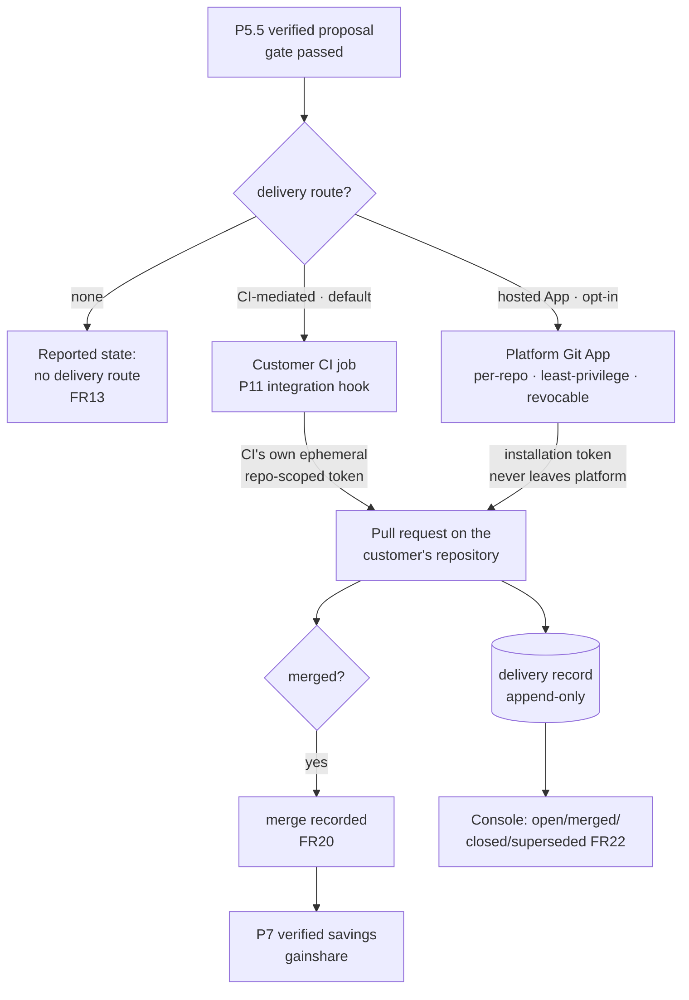

# PRD — P12: Forge Delivery (the pull request, and the gainshare input)

| Field | Value |
|---|---|
| Phase / Milestone | P12 / M15 |
| Target window | ~Weeks 36–48 (two waves: 12a CI-mediated delivery, then 12b hosted Git App) |
| Lead role(s) | Backend + DevOps (co-leads) |
| Supporting role(s) | Product Designer, System Designer, AI Engineer, Frontend, QA Engineer, Sales Operations |
| Status | Draft |
| OpenSpec change | `p12-forge-delivery` |
| Architecture decision | [ADR-005](../adr/ADR-005-forge-delivery-and-credential-posture.md) — CI-mediated by default, hosted Git App opt-in |
| Related | [P11 — CLI & CI Integration](P11-cli-ci-integration.md) · [P5.5 — Proposals & Verification](P5.5-proposals-verification.md) · [P9 — Web Console](P9-web-console.md) |

> **This is the product's output channel.** [ADR-001](../adr/ADR-001-source-transformation-apply-model.md)
> made the pull request the delivery mechanism — *"git is the audit trail and `git revert` is
> rollback."* P5.5's automation levels are specified in PR verbs; P6's Autonomous level is auto-merge.
> Until P12, none of it can happen.

> **Money-in-git rule.** No dollar amounts, percentages, or price bands appear here. Plans are referred
> to by **name only** — Free / Team / Business / Enterprise. Delivery is a **Team+** capability;
> Autonomous auto-merge is **Enterprise**, per P7's entitlements.

## 1. Summary

P12 builds the only thing standing between a verified optimization and a customer's repository. Today
there is no path: no forge client, no push route (`worktree.NewPool` clones `--bare --local`, so a
variant branch exists only in a local mirror), no forge credential kind (`Secrets` is provider-scoped),
and nowhere to record a result — `transform` is immutable by DB trigger and the PR would be opened
*after* insert, so the write is rejected by design. The P2 exit analysis inventoried all of this and
parked it at *"defer; seam only,"* because two of the gaps are one-way doors.

The commercial consequence is direct: P7 computes billable savings **only from merged-PR deltas in the
P5.5 verified-delta ledger**. **No PRs means no merges means gainshare revenue is exactly zero**,
regardless of how much value the platform demonstrably produces.

Per [ADR-005](../adr/ADR-005-forge-delivery-and-credential-posture.md), delivery has **two modes
producing identical pull requests**. The default is **CI-mediated**: the customer's own CI opens the PR
using the ephemeral, repo-scoped forge token it already holds, so **the platform never acquires standing
write access to any customer repository** — the credential the P2 analysis called *"the highest
blast-radius action in the system"* is never created on our side. A **hosted Git App** is the opt-in
upgrade for customers who cannot run it in CI: per-repo, least-privilege, customer-revocable, and
honest about being real standing write access. Both modes deliver the same evidence-bearing PR — the
diff, the verified delta with its interval, the eval evidence, `config_hash` lineage, and **a link back
to the dashboard**, which is what makes a Team+ subscription visible from inside the customer's own
review flow. Delivery is recorded in an **append-only `delivery` record** rather than by mutating
`transform`, because a delivery has a lifecycle and a transform does not. Milestone **M15 — the loop
closes** means a verified optimization reaches a customer's repository, its merge is observable, and
gainshare becomes computable.

## 2. Problem & context

Six problems block delivery, and each maps to a design commitment:

- **There is no way to write to a customer's repository, and the obvious way is the one we refused.**
  The straightforward implementation is a platform-held, write-scoped forge token. The P2 analysis named
  it the highest-blast-radius action in the system, and ADR-002 spent its entire argument refusing the
  same class of reach in the runtime dimension. A single compromise of an aggregated write-key store is
  a supply-chain event across every customer at once. ADR-005 resolves this by noticing the credential
  **already exists on the customer's side, correctly scoped**: every CI system issues a repo-scoped,
  short-lived, automatically-rotated token to its own jobs.
- **Recording the outcome is structurally blocked.** `transform` is immutable by trigger
  (`0004:transform_immutable`) and the PR opens after insert, because the build must pass first. The
  `UPDATE` is rejected **by design** — the immutability is what makes `config_hash` reproducibility
  checkable, so relaxing it to store a URL would trade an invariant for a field that is not part of the
  transform's identity.
- **Gainshare revenue has no input.** Billable savings are computed *only* from merged-PR deltas. Every
  other part of that chain exists — P4 measures, P5.5 verifies, P7 bills — and it terminates at a step
  that cannot happen.
- **A bot that opens duplicate PRs gets uninstalled.** Re-running verification on the same
  `config_hash` and `source_revision` must update the existing pull request, not open a second one. A
  PR storm is the fastest way to lose repository access permanently, and the recovery is a
  conversation, not a patch.
- **Silence looks identical to having nothing to say.** A customer with verified proposals and no
  configured delivery route sees no pull requests — which is indistinguishable from a product that
  found no improvements. The failure is invisible precisely when it is most damaging: during
  evaluation.
- **A PR without evidence is a PR nobody merges.** The diff alone asks a reviewer to trust an automated
  change to their prompts or models. What earns the merge is the verified delta with its interval, the
  eval evidence, and the lineage — and that evidence is also where the dashboard's value becomes
  visible to people who never open it.

**Upstream state assumed.** **P2** (the codemod, worktree, and the immutable `transform` record this
phase deliberately does not touch). **P4** (the eval evidence carried in the PR). **P5.5** (the
verification gate and verified-delta ledger — **nothing unverified is delivered**, and the gate is
upstream of delivery, not replaced by it). **P6** (Autonomous auto-merge, Enterprise only, and the kill
switch that halts delivery fleet-wide). **P7** (Team+ entitlement for delivery; gainshare consumes the
merges this phase produces). **P9** (the dashboard the PR links back to and where delivery state is
shown). **P11** (the CI integration that CI-mediated delivery runs inside).

## 3. Goals & non-goals

### Goals

- **G1. Delivery has two modes producing identical pull requests.** CI-mediated and hosted Git App
  SHALL produce the **same PR content**. The mode is a credential decision, not a product difference.
- **G2. CI-mediated is the default and requires no platform-held forge credential.** In the default
  mode the platform SHALL NOT receive, store, or request a forge credential. The customer's CI opens
  the PR with the ephemeral, repo-scoped token it already holds.
- **G3. The hosted Git App is contained and honest.** Where the platform does hold a credential it
  SHALL be a **per-repository** installation (never org-wide by default), with a **least-privilege**
  permission set no broader than opening and updating pull requests on the selected repositories,
  **revocable by the customer from their side at any time**, never logged, and never leaving the
  platform.
- **G4. Nothing unverified is delivered.** A pull request SHALL be opened only for a change that passed
  the P5.5 verification gate. Delivery SHALL NOT be a path around the gate.
- **G5. Every pull request carries its evidence.** A PR SHALL contain the diff, the **verified delta
  with its confidence interval**, the eval evidence, `config_hash` lineage, and a reference that opens
  the full evidence in the console.
- **G6. Delivery is idempotent.** Re-delivering the same `(config_hash, source_revision)` to the same
  target SHALL **update** the existing pull request rather than opening another.
- **G7. Superseded proposals are closed with a reason.** When a newer verified proposal replaces an
  open one, the superseded pull request SHALL be closed with the reason stated, not left open.
- **G8. Delivery volume is bounded.** The number of simultaneously open platform-authored pull requests
  per repository SHALL be bounded, and reaching the bound SHALL be reported rather than silently
  dropping deliveries.
- **G9. The platform never merges below Autonomous.** Below the Autonomous automation level the
  platform SHALL open and update pull requests and SHALL NOT merge them. Under Autonomous (Enterprise)
  it SHALL merge only a gate-passed, verified change.
- **G10. Delivery is recorded in an append-only record, and `transform` is not modified.** Every
  delivery and every subsequent state change SHALL append to a `delivery` record keyed by
  `(config_hash, source_revision, forge_ref)`. `transform`'s immutability SHALL remain untouched.
- **G11. Merge is observable, because gainshare depends on it.** A merge into the customer's target
  branch SHALL be recorded against the delivery, so P7's verified-savings computation has its input.
- **G12. Having no delivery route is a reported state, not silence.** A repository with verified
  proposals and no configured delivery route SHALL surface that condition. Proposals SHALL NOT
  accumulate invisibly.
- **G13. Revocation degrades visibly.** Removal of the App installation, or expiry/rotation of CI
  credentials, SHALL produce a reported, degraded state — never a silent cessation of delivery.
- **G14. The console shows delivery state.** Open / merged / closed / superseded SHALL be visible in
  the dashboard for every delivery, closing the loop from proposal to outcome.
- **G15. Entitlement is enforced server-side.** Delivery SHALL be gated to **Team and above**, and
  Autonomous auto-merge to **Enterprise**, enforced by the platform rather than by the client.

### Non-goals (explicitly deferred or owned elsewhere)

- **Verification** — **[P5.5](P5.5-proposals-verification.md).** P12 delivers what the gate passed; it
  does not decide what is good.
- **The autonomous loop and its kill switch** — **P6.** P12 respects the automation level and honours
  the halt; it does not implement the loop.
- **The CLI and the CI action themselves** — **[P11](P11-cli-ci-integration.md).** CI-mediated delivery
  *runs inside* P11's integration through the hook P11 exposes.
- **Billing computation** — **P7.** P12 makes merges observable; P7 turns them into a figure.
- **A code-review product.** The PR is a delivery artifact reviewed in the customer's own tooling with
  their own branch protections. P12 does not build review UI, comment threads, or approvals.
- **Repository hosting, mirroring, or a fork we own** — rejected in ADR-005 on review quality, fork
  drift, and the fact that gainshare depends on observing a merge into the customer's default branch,
  which a fork cannot see.
- **Writing anything other than a pull request.** No direct pushes to protected branches, no tag
  creation, no release management, no issue filing.
- **Merging below Autonomous** — never, in any mode, under any configuration.

## 4. Users & personas

| Persona | What P12 is for them | What breaks without it |
|---|---|---|
| **Reviewing engineer** (primary) | A pull request on **their** repository, running **their** checks and branch protections, carrying the evidence needed to merge it. | The optimization exists as a diff in a dashboard nobody opens, so it is never applied. |
| **Platform engineer configuring delivery** | Choosing CI-mediated (nothing to grant) or the hosted App (a per-repo, revocable installation), and seeing which repositories have a route. | Delivery either does not happen or requires granting an unbounded write credential. |
| **Security reviewer at a prospective customer** | The answer *"in the default mode you grant us nothing; your CI opens the PR with its own token."* | The deal stalls where every deal involving repository write access stalls. |
| **Engineering manager / budget owner** | Delivery state and merge outcomes — what was proposed, what was merged, what the verified saving was. | Gainshare invoices reference deltas whose merges cannot be seen. |
| **Platform operator** (P8) | A fleet-wide halt that actually stops delivery. | The kill switch stops the loop but not its output. |

Non-personas: end users of the customer's LLM product, and anyone expecting P12 to be a review tool.

## 5. User stories / jobs-to-be-done

**Reviewing engineer**
- As a reviewer, I want the change as a **pull request on my own repository**, so that my checks, my
  branch protections and my merge process all apply normally.
- As a reviewer, I want the **verified delta and its interval** in the PR, so that I can tell a real
  improvement from noise without leaving the review.
- As a reviewer, I want a **link to the full evidence**, so that I can go deeper when the change looks
  significant.
- As a reviewer, I do **not** want three pull requests for the same proposal.

**Platform engineer**
- As a platform engineer, I want to enable delivery **without granting a write credential**, so that
  adopting it does not require a security exception.
- As a platform engineer, if I do install the App, I want it **scoped to the repositories I pick** and
  **revocable by me** without contacting anyone.
- As a platform engineer, I want to see which repositories have **no delivery route**, so that I find
  out before a quarter of proposals have piled up unseen.

**Security reviewer**
- As a security reviewer, I want to confirm the platform **holds no write credential** in the default
  configuration, so that the blast radius of a vendor breach excludes my source code.

**Budget owner**
- As a budget owner, I want **merges recorded against deliveries**, so that a gainshare invoice traces
  to specific merged pull requests.

**Operator (P8)**
- As an operator, I want the fleet kill switch to **stop delivery**, so that halting the loop halts what
  it emits.

## 6. Functional requirements

Numbered FRs; each maps 1:1 to an OpenSpec requirement under
`openspec/changes/p12-forge-delivery/specs/`.

### Delivery (capability `forge-delivery`)

- **FR1.** Delivery SHALL support a **CI-mediated** mode and a **hosted Git App** mode, and both SHALL
  produce **identical pull-request content** for the same proposal.
- **FR2.** CI-mediated SHALL be the **default** mode. In it the platform SHALL NOT receive, store, or
  request a forge credential; the pull request SHALL be opened by the customer's CI using a credential
  that CI already holds.
- **FR3.** A hosted Git App installation SHALL be **per-repository** (never org-wide by default), SHALL
  hold a **least-privilege** permission set no broader than opening and updating pull requests on the
  selected repositories, and SHALL be **revocable by the customer without contacting the platform**.
- **FR4.** A forge credential held by the platform SHALL NOT appear in any log, telemetry attribute,
  pull-request body, or artifact, and SHALL NOT leave the platform.
- **FR5.** A pull request SHALL be opened only for a change that **passed the P5.5 verification gate**.
- **FR6.** A pull request SHALL contain the **diff**, the **verified delta with its confidence
  interval**, the **eval evidence**, the **`config_hash` lineage**, and a **reference that opens the
  full evidence in the console**.
- **FR7.** Re-delivering the same `(config_hash, source_revision)` to the same target SHALL **update**
  the existing pull request rather than opening a second.
- **FR8.** When a newer verified proposal supersedes an open delivery, the superseded pull request
  SHALL be **closed with the reason stated**.
- **FR9.** The number of simultaneously open platform-authored pull requests per repository SHALL be
  **bounded**; reaching the bound SHALL be **reported**, and deliveries SHALL NOT be silently dropped.
- **FR10.** Below the **Autonomous** automation level the platform SHALL NOT merge a pull request.
  Under Autonomous it SHALL merge only a gate-passed, verified change.
- **FR11.** Delivery SHALL be entitlement-gated **server-side** to **Team and above**; Autonomous
  auto-merge SHALL be gated to **Enterprise**.
- **FR12.** An active **fleet or per-tenant halt** (P6/P8 kill switch) SHALL stop delivery for its
  scope, and the halt SHALL take effect without a deploy.
- **FR13.** A repository with verified proposals and **no configured delivery route** SHALL surface
  that condition as a reported state.
- **FR14.** Loss of delivery capability — App installation removed, CI credential expired or rotated —
  SHALL produce a **reported, degraded** state and SHALL NOT be a silent cessation.
- **FR15.** The platform SHALL write **only** pull requests and their branches. It SHALL NOT push to a
  protected branch directly, create tags or releases, or file issues.

### The delivery record (capability `delivery-record`)

- **FR16.** Every delivery and every subsequent state change SHALL **append** to a `delivery` record
  keyed by `(config_hash, source_revision, forge_ref)`.
- **FR17.** The record SHALL be **append-only**; a state change SHALL append rather than mutate, so the
  delivery history is reconstructable.
- **FR18.** `transform` SHALL NOT be modified by delivery; its immutability SHALL remain intact.
- **FR19.** The record SHALL capture the **mode** used (CI-mediated or hosted App), so a later audit can
  answer which credential opened a given pull request.
- **FR20.** A **merge into the customer's target branch** SHALL be recorded against its delivery, so
  P7's verified-savings computation has an observable input.
- **FR21.** A merge that is later reverted SHALL be visible as a **sequence of states**, not as an
  overwritten field.
- **FR22.** The console SHALL show each delivery's state — **open / merged / closed / superseded** —
  and its link to the proposal that produced it.

## 7. Non-functional requirements

| # | Requirement | Target |
|---|---|---|
| **NFR1** | **Credential posture (load-bearing)** | In the default mode, **zero** platform-held forge credentials. Asserted structurally: the platform has no store for one. |
| **NFR2** | **Least privilege where a credential exists** | The hosted App's permission set is documented, minimal, per-repository, and customer-revocable; a broader grant is a spec violation, not a configuration choice. |
| **NFR3** | **Idempotency** | Re-delivery of the same `(config_hash, source_revision)` produces exactly one pull request, under retries, restarts, and concurrent attempts. |
| **NFR4** | **Volume safety** | A repository cannot receive more than its bound of simultaneously open platform-authored pull requests, under any burst. |
| **NFR5** | **Auditability** | Every delivery, state change, and merge is reconstructable from the append-only record, including which mode and which principal acted. |
| **NFR6** | **Halt latency** | An active kill switch stops delivery promptly and without a deploy; a halt read failure fails **closed** (do not deliver). |
| **NFR7** | **Content parity** | The pull request produced by the two modes is identical for the same proposal — verified by comparison, not by review. |
| **NFR8** | **Forge neutrality** | The platform-side contract is forge-agnostic; per-forge specifics live in delivery recipes rather than in the delivery model. |
| **NFR9** | **Privacy** | A pull-request body carries the diff and evidence the customer already owns; it SHALL NOT carry another tenant's data, credentials, or platform-internal identifiers beyond the documented lineage. |
| **NFR10** | **Failure isolation** | A delivery failure for one repository SHALL NOT block delivery for another, and SHALL NOT lose the proposal. |

## 8. System design summary

### 8.1 The two modes



**The key property**: in the default path, no arrow carries a platform-held write credential. The
platform hands out a verified diff plus evidence; the customer's own infrastructure does the writing.

### 8.2 Why the delivery record is separate from `transform`

`transform` is immutable by design, and that immutability is what makes `config_hash` reproducibility
checkable. A delivery is a different kind of fact: a transform is produced **once**, whereas a delivery
has a **lifecycle** — opened, updated, superseded, closed, merged, possibly reverted — and the same
transform may legitimately be delivered to more than one target. Forcing a lifecycle-bearing fact into
an immutable row was always the wrong shape; ADR-005 records the alternatives considered
(relaxing immutability; deriving state from the telemetry stream) and why each loses.

Append-only rather than mutable-state means a merge that is later reverted reads as a **sequence**
rather than as a field someone overwrote — which matters when a gainshare invoice is disputed.

### 8.3 Decisions, with what was rejected

| # | Decision | Rejected alternative | Why (八级法则) |
|---|---|---|---|
| **D1** | **CI-mediated default; platform holds no forge credential** | Platform-held write token as the only mode | **L1 安全.** The credential is never created, so there is no aggregated write-key store to compromise — and a compromise of one would be a supply-chain event across every customer. Consistent with ADR-002, which refused the same class of reach in the runtime dimension. |
| **D2** | **Hosted App retained as an opt-in mode** | Refuse platform-held credentials entirely | **L3 UX + commercial reach.** A Team+ surface requiring CI excludes every customer without it. Contained per-repo, least-privilege and revocable, and described honestly as standing write access rather than sold as equivalent to the default. |
| **D3** | **Identical PR content across modes** | Let each mode render what is convenient for it | **L5/L7.** Two renderings would drift, and the evidence in the PR is the thing that earns the merge. One content contract, two credential paths. |
| **D4** | **Append-only `delivery` record; `transform` untouched** | Relax `transform` immutability to store the PR URL | **L2/L5.** Immutability is what makes `config_hash` reproducibility checkable; trading it for a field that is not part of the transform's identity is a bad exchange. It is also simply the wrong model — see §8.2. |
| **D5** | **Idempotent by `(config_hash, source_revision, target)`** | Open a PR per delivery attempt | **L2/L3.** A duplicate-PR storm is the fastest route to losing repository access permanently, and the recovery is a conversation rather than a patch. |
| **D6** | **No delivery route is a reported state** | Let proposals accumulate until someone configures delivery | **L3.** Silence is indistinguishable from "the product found nothing," and the confusion lands hardest during evaluation, when the customer is deciding whether it works. |
| **D7** | **Halt reads fail closed** | Deliver when the kill-switch state is unreadable | **L1/L2.** The kill switch exists for the case where delivery is causing harm. Failing open in exactly the circumstance it was built for defeats it. |
| **D8** | **Write only pull requests and their branches** | Also push tags, releases, or issues as useful | **L1.** Every additional write scope widens the permission set the hosted App must request, and the narrowest credible ask is what gets an installation approved. |

### 8.4 Data model additions

```
delivery = append-only, keyed (config_hash, source_revision, forge_ref)
  { delivery_id, config_hash, source_revision, forge_ref, mode: ci|app,
    state: opened|updated|superseded|closed|merged|reverted,
    pr_ref, actor, reason?, at }

delivery_route = per repository: { mode, configured_at } | absent → FR13 reported state
```

No change to `transform`. `delivery` is the one new table, decided in ADR-005 against two alternatives
per 🔴 `careful-table-creation`.

## 9. Design by role lens

**Backend (co-lead) — *the credential we do not hold is the design.***
The default mode's whole engineering content is a negative: the platform issues a verified diff plus
evidence, and **nothing in the system stores, requests, or transports a forge credential** (FR2, NFR1).
That is asserted structurally — there is no store for one — rather than by policy, because a policy
about a credential that exists is weaker than the absence of the credential. Where one does exist (the
hosted App), it is per-repository, least-privilege, revocable from the customer's side, never logged,
and never leaves the platform (FR3, FR4). **Idempotency is keyed by `(config_hash, source_revision,
target)`** and must hold under retries, restarts, and concurrent attempts (NFR3) — a duplicate-PR storm
is not a cosmetic defect, it is how a bot loses repository access permanently. The **delivery record is
append-only** (FR16–FR18) and `transform` is not touched: its immutability is what makes `config_hash`
reproducibility checkable, and it is also simply the wrong home for a lifecycle. Halt reads **fail
closed** (D7): the kill switch exists for the case where delivery is causing harm, and failing open in
exactly that circumstance defeats it.

**DevOps (co-lead) — *the blast radius is another company's source code.***
This is the phase where a mistake reaches outside our boundary, so the containment is the deliverable.
The default posture is the strongest possible answer in a security review — *"you grant us nothing"* —
and it should be treated as a feature to preserve rather than a limitation to grow out of. The hosted
App is the exception and is operated accordingly: a documented, minimal permission set (NFR2); no
org-wide default; installation and revocation both driven from the customer's side; the token in a
secret manager, never in code, git, a log line, a telemetry attribute, or a PR body (FR4). Delivery
failures are **isolated per repository** (NFR10) — one customer's forge outage must not stall the
queue for everyone, and a failed delivery must not lose the proposal. **Volume is bounded** (FR9) and
reaching the bound is *reported*, because silently dropping deliveries would look identical to having
none. And revocation is a **reported degraded state** (FR14): an App uninstalled or a CI credential
rotated must not read as "no suggestions this week."

**Product Designer (support) — *silence is the failure mode nobody reports.***
The defect most likely to cost a customer is invisible by construction: verified proposals piling up
against a repository with no delivery route, producing exactly the same experience as a product with
nothing to say. FR13 makes it a **stated condition**, and FR14 does the same for revocation, because
both failures otherwise present as absence. The pull request itself is a product surface with one job —
**earn the merge** — which is why it carries the verified delta with its interval, the eval evidence,
and lineage rather than just a diff (FR6): a reviewer asked to accept an automated change to their
prompts needs the evidence in front of them, not a link they may not follow. That said, the link is
what makes the dashboard's value visible to people who never open it, which is exactly the population
worth converting. Superseded PRs are **closed with a reason** (FR8) rather than left to rot, because an
open PR nobody will merge is a small ongoing tax on the reviewer's attention.

**System Designer (support) — *two credential paths, one content contract.***
The architecture's discipline is that the mode is a **credential decision, not a product difference**
(FR1, D3). If each mode rendered what was convenient, the two would drift and the divergence would
surface as "why does the PR look different in CI?" — so content parity is verified by comparison rather
than by review (NFR7). The platform-side contract is deliberately **forge-agnostic** (NFR8): GitHub,
GitLab and Bitbucket differ in their CI syntax, not in our API, so per-forge specifics live in delivery
recipes that are small, inspectable, and contributable. The one-way doors are named: the **PR body
format** becomes a de-facto contract the moment customers build tooling on it, and the `delivery`
record's key is the join P7's gainshare computation depends on.

**AI Engineer (support) — *delivery must not become a path around the gate.***
The single rule that matters here is that **nothing unverified is delivered** (FR5). P5.5's gate is
upstream of delivery and is not replaced, weakened, or bypassed by it — a delivery mechanism that could
open a PR for an unverified change would quietly dissolve *"diagnosis proposes, verification decides,"*
which is the platform's central claim. The evidence in the PR is rendered **as computed**: the verified
delta with its confidence interval, the held-out status, and the eval evidence, not a rounded or
softened summary. A delta whose interval overlaps the baseline is a tie and must read as one — a PR
that presents a tie as an improvement is worse than no PR, because it spends a reviewer's trust once
and does not get it back. And the merge signal (FR20) is what P7 bills on, so it must be a real
observation of a merge into the target branch rather than an inference from the PR being closed.

**Frontend (support) — *the loop is only closed if the outcome is visible.***
Delivery state — open / merged / closed / superseded — appears in the console for every delivery,
linked to the proposal that produced it (FR22), which is what turns a one-way "we sent a PR" into a
loop the customer can see. Two states need designing rather than defaulting: **no delivery route**
(FR13) and **degraded/revoked** (FR14), both of which must read as *conditions with a next action*
rather than as empty lists — an empty list is the rendering that makes an invisible failure look
normal. Per P9's rules these inherit the console's token system, English strings, render-as-received
discipline, and browser-rendered acceptance; nothing here is restated.

**QA Engineer (support) — *the assertions that matter are about things not happening.***
Three of this phase's guarantees are negative, which makes them the ones most likely to pass while
being false. **No platform-held forge credential in the default mode** is asserted structurally — the
absence of a store — plus a test that no code path reads one. **Idempotency** is tested under
concurrent and retried delivery of the same `(config_hash, source_revision)`, asserting exactly one
pull request survives; a sequential-only test would miss the race that produces the duplicate. **Halt
fails closed** is tested by making the kill-switch state unreadable and asserting delivery **does not
happen** — and if that test cannot be made to fail, FR12 is decoration. Beyond those: content parity
between modes is a byte-comparison, not an eyeball; the volume bound is exercised with a burst; a
delivery failure for one repository is shown not to block another or lose the proposal; revocation and
route-absence are asserted to produce **reported** states rather than silence; and an unverified change
is asserted to be undeliverable through every entry point.

**Sales Operations (support) — *"you grant us nothing" is the strongest sentence in the deck.***
Repository write access is where deals involving source-code tooling stall, and the default mode
answers it before it is asked: the platform holds **no** forge credential, and the customer's own CI
opens the pull request with a token it already has. That should lead the conversation, and the hosted
App should be presented **honestly** as what it is — real standing write access, contained per-repo,
least-privilege and revocable — rather than as equivalent. Two claims must not be made: that delivery
works below **Team** (it is entitlement-gated), and that the platform merges anything below
**Autonomous** (Enterprise) — the product's whole positioning is *a human merges*, and overselling
autonomy here would contradict the screen and the spec at once. Gainshare is sellable only on **merged**
PRs, so the pipeline conversation should be framed on merges rather than on proposals opened.

## 10. Dependencies

**Requires**
- **P2** — the codemod, worktree, and the immutable `transform` record this phase does not touch.
- **P4** — the eval evidence carried in the pull request.
- **P5.5** — the verification gate and the verified-delta ledger; nothing unverified is delivered.
- **P6** — the automation levels and the kill switch delivery must honour.
- **P7** — Team+ entitlement for delivery, Enterprise for auto-merge, and the gainshare computation
  that consumes recorded merges.
- **P9** — the console showing delivery state and the evidence the PR links to.
- **P11** — the CI integration whose hook CI-mediated delivery runs inside.
- **[ADR-005](../adr/ADR-005-forge-delivery-and-credential-posture.md)** — the credential posture and
  the delivery-record decision.

**Unblocks**
- **Gainshare revenue becomes computable** — merged-PR deltas finally have merges to observe.
- **P5.5's Advisory and Assisted levels become real** — both are specified in PR verbs and neither can
  happen today.
- **P6's Autonomous auto-merge** gains the mechanism it merges through.

## 11. Risks & mitigations

| Risk | Owner | Mitigation |
|---|---|---|
| A platform-held write credential is compromised | DevOps + Backend | Default mode **holds none** (FR2, NFR1); the hosted App is per-repo, least-privilege, revocable, never logged, never leaves the platform (FR3, FR4). |
| A duplicate-PR storm loses repository access | Backend | Idempotency keyed by `(config_hash, source_revision, target)`, tested under **concurrency and retry**, not just sequentially (FR7, NFR3); volume bounded and bound-reached reported (FR9). |
| Proposals accumulate against a repo with no route, unseen | Product + Frontend | FR13 makes it a reported state; the console renders it as a condition with a next action, not an empty list. |
| An unverified change is delivered | AI Engineer + Backend | FR5 — delivery is downstream of the P5.5 gate and is not a path around it; asserted from every entry point. |
| The kill switch halts the loop but not its output | Backend + DevOps | FR12 scopes the halt to delivery too, and halt reads **fail closed** (D7, NFR6). |
| A tie is presented as an improvement | AI Engineer | Evidence rendered as computed — delta with interval and held-out status; a tie reads as a tie. Trust is spent once. |
| The two modes' pull requests drift apart | System Designer + QA | FR1 content parity, verified by **comparison** (NFR7), not by review. |
| Gainshare is billed on a merge that did not happen | Backend + AI | FR20 records an observed merge into the target branch; a closed PR is not inferred to be a merge; FR21 keeps a later revert visible as a sequence. |
| Relaxing `transform` immutability to store a PR URL | System Designer | FR18 forbids it; ADR-005 records the alternatives and why they lose. |
| One customer's forge outage stalls everyone | DevOps | Per-repository failure isolation; a failed delivery does not lose the proposal (NFR10). |
| The App's permission set grows quietly | DevOps + Sales Ops | NFR2 makes the permission set a spec item; broadening it is a spec change, not a configuration choice. |

## 12. Rollout & test strategy

**Wave 12a — CI-mediated delivery.** The default mode end to end: the delivery contract, PR content and
evidence, idempotency, supersede/close, volume bounds, the append-only record, merge observation,
route-absence reporting, and entitlement gating. Ends when a Team+ customer with the P11 CI integration
receives verified optimizations as pull requests **without granting the platform any credential**.

**Wave 12b — hosted Git App.** The opt-in mode: installation and revocation flows, least-privilege
permission set, token custody, and content parity with 12a. Sequenced second **deliberately** — it is
the mode that carries standing write access, and 12a is a complete phase without it.

**How correctness is proven.**
1. **Credential posture** — assert structurally that the default mode has no forge-credential store and
   no code path that reads one.
2. **Idempotency under concurrency** — concurrent and retried delivery of the same
   `(config_hash, source_revision)` yields exactly one pull request.
3. **Content parity** — byte-comparison of the pull request produced by both modes for one proposal.
4. **Gate integrity** — an unverified change is undeliverable through every entry point.
5. **Halt fails closed** — with kill-switch state unreadable, delivery does **not** occur; the test
   must be able to go red.
6. **Volume bound** — a burst cannot exceed the per-repository bound, and reaching it is reported.
7. **Visibility** — route-absence and revocation each produce a reported state, asserted as a
   *rendering*, not just a log line.
8. **Merge observation** — a merge into the target branch is recorded against its delivery; a closed-
   without-merge PR is not recorded as merged; a subsequent revert appears as a further state.
9. **Isolation** — a forge failure for one repository blocks no other and loses no proposal.
10. **Entitlement** — delivery below Team is refused server-side; auto-merge below Enterprise is refused.

## 13. Success metrics & acceptance criteria (M15 exit checklist)

- [ ] **A1.** A Team+ customer receives a verified optimization as a pull request **on their own
      repository** with the platform holding **no forge credential** (G1, G2, FR1, FR2, NFR1).
- [ ] **A2.** The hosted App installs **per-repository**, holds a documented least-privilege permission
      set, and is **revocable by the customer without contacting the platform** (G3, FR3, NFR2).
- [ ] **A3.** No forge credential appears in any log, telemetry attribute, PR body, or artifact, and
      none leaves the platform (FR4).
- [ ] **A4.** An unverified change is **undeliverable** through every entry point (G4, FR5).
- [ ] **A5.** Every pull request carries the diff, the **verified delta with its interval**, the eval
      evidence, `config_hash` lineage, and a working reference to the console evidence (G5, FR6).
- [ ] **A6.** Re-delivering the same `(config_hash, source_revision)` — including concurrently and after
      a retry — produces **exactly one** pull request (G6, FR7, NFR3).
- [ ] **A7.** A superseded delivery's pull request is **closed with the reason stated** (G7, FR8).
- [ ] **A8.** A burst cannot exceed the per-repository open-PR bound, and reaching it is **reported**,
      not silently dropped (G8, FR9, NFR4).
- [ ] **A9.** The platform **does not merge** below Autonomous; under Autonomous it merges only a
      gate-passed, verified change (G9, FR10).
- [ ] **A10.** Delivery is refused server-side below **Team**; auto-merge is refused below
      **Enterprise** (G15, FR11).
- [ ] **A11.** An active fleet or per-tenant halt **stops delivery**, without a deploy, and an unreadable
      halt state **fails closed** (FR12, NFR6).
- [ ] **A12.** A repository with verified proposals and no delivery route surfaces a **reported state**,
      rendered as a condition with a next action (G12, FR13).
- [ ] **A13.** App removal or CI-credential loss produces a **reported degraded state**, never silence
      (G13, FR14).
- [ ] **A14.** The platform writes **only** pull requests and their branches — no direct pushes to
      protected branches, no tags, releases, or issues (FR15).
- [ ] **A15.** Every delivery and state change **appends** to the `delivery` record; `transform` is
      unmodified and its immutability tests still pass (G10, FR16, FR17, FR18).
- [ ] **A16.** The record captures the **mode** used, so an audit can answer which credential opened a
      given pull request (FR19).
- [ ] **A17.** A **merge into the target branch** is recorded against its delivery; a closed-without-
      merge PR is not recorded as merged (G11, FR20).
- [ ] **A18.** A later revert is visible as a **further state**, not an overwritten field (FR21).
- [ ] **A19.** The console shows **open / merged / closed / superseded** for every delivery, linked to
      its proposal (G14, FR22).
- [ ] **A20.** The pull request produced by both modes for one proposal is **identical**, verified by
      comparison (FR1, NFR7).

## 14. Open questions

1. **Which forge is first-class for delivery**, and whether it must match P11's first-class CI target.
   Aligning them is simpler; diverging may be right if the customer bases differ.
2. **Branch naming and cleanup.** A predictable scheme aids idempotency and review, but a stale-branch
   policy must not delete something a customer built on. Who owns deletion, and after how long?
3. **The PR body format becomes a de-facto contract** the moment customers build automation on it. Does
   it get an explicit version, as P11's CLI output does?
4. **Merge observation mechanism.** Webhook (immediate, needs an endpoint and delivery guarantees) vs.
   polling (simpler, lags) vs. CI-reported (no platform endpoint, but depends on the customer's CI
   running on merge). Gainshare timeliness depends on this choice.
5. **Whether CI-mediated delivery can work without linking.** Delivery needs a verified proposal, which
   today implies platform-side evaluation and therefore linking. Whether a fully-local customer can ever
   receive PRs is a real product question with commercial consequences.
6. **Monorepo and multi-target repositories.** One repository may host several workflows with different
   delivery routes and different reviewers. Does `delivery_route` key on repository, or on
   `(repository, workflow)`?
