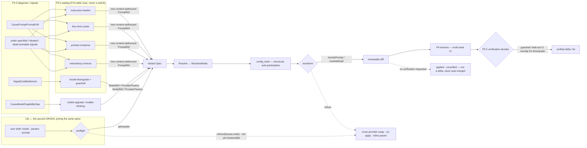

# PRD — P13: Prompt & Model Optimization (deepening the one axis that already ships)

| Field | Value |
|---|---|
| Phase / Milestone | P13 / M16 — *Optimization Axis Expansion* program |
| Target window | ~Weeks 40–60 (four waves: 13a prompt-rewrite operators, 13b model-selection under guardrail, 13c user-initiated change, 13d the cross-axis language-coverage contract) |
| Lead role(s) | AI Engineer + System Designer (co-leads) |
| Supporting role(s) | Backend, Frontend, DevOps, QA Engineer, Product Designer, Sales Operations |
| Status | Draft |
| OpenSpec change | `p13-prompt-model-optimization` |
| Related | [P5.5 — Proposals + Verification](P5.5-proposals-verification.md) · [P10 — Prompt & Model Studio](P10-prompt-model-studio.md) · [P4 — Eval Harness](P4-eval-harness.md) · [ADR-002](../adr/ADR-002-provider-gateway-serves-platform-callers.md) · [ADR-004](../adr/ADR-004-runtime-config-binding.md) |

> **Commercial position.** Prompt and model are the **only** optimization dimensions the platform can
> both model *and* apply end-to-end today — the codemod actually emits edits for them
> ([`internal/transform/rewrite.go:55-56`](../../internal/transform/rewrite.go)), where skills and
> context still refuse at the call site. That makes this axis the one whose improvements are already
> *shippable* rather than *modelable-but-deferred*, and P13 spends its budget deepening the axis that
> converts, not widening the one that does not. Every capability here is a proposal-engine and
> verification improvement; **no new dimension, no new registry `Kind`, no new database table, no eval
> or scoring change.**

> **Money-in-git rule.** No dollar amounts, percentages, or price bands appear in this document. Plans
> are referred to by **name only** — Free / Team / Business / Enterprise. Cost appears only as the
> observed telemetry metric `eval_cost_usd`, never as a price.

## 1. Summary

The prompt+model axis is the one place where the platform's promise is fully wired: a variant's model
or prompt override is modeled as a `Dimension` ([`spec.go:42-47`](../../internal/variantspec/spec.go)),
resolved and hashed into `config_hash`, and **materialized as real byte edits** by `rewriteModel` and
`rewritePrompt` ([`rewrite.go:55-56`](../../internal/transform/rewrite.go)) — while `refuseSkills` and
`refuseContext` still return `unsafeRewrite`. The proposal engine already carries four operators on
this axis — `OpModelUpgrade`, `OpEnableThinking`, `OpModelDowngrade`, `OpPromptRewrite`
([`operator.go:35-38`](../../internal/proposal/operator.go), [`catalog.go`](../../internal/proposal/catalog.go)) —
and a single coarse prior for each ([`gain.go:8`](../../internal/proposal/gain.go)).

P13 does not add an axis. It **deepens the one that ships**, in two capabilities. **`prompt-rewrite`**
turns the single grounded-rewrite operator into a family — instruction hardening, few-shot exemplar
curation, prompt compression / token-reduction, and redundancy removal — each of which produces a **new
content-addressed prompt version** through P10's immutable registry and flows through the *existing*
`rewritePrompt` codemod. **`model-selection`** adds an explicit **downgrade quality guardrail** (a
cheaper model is admissible only when it holds `task_success` within confidence-interval overlap on
**held-out** data), and specifies model-parameter tuning (temperature / max-tokens) and the honest
boundary on provider routing. Both capabilities obey the same law the platform is built on: **diagnosis
proposes, verification decides.** A new operator only *nominates* a candidate; the multi-seed P4 harness
and the P5.5 verification gate are the only things that can turn it into a claim.

P13 then adds the axis's missing **second origin**. Until now every change on every axis has been
proposed by a catalog operator; the engineer who owns the workflow has no way to say *"use this model
here"*, *"bind this prompt version"*, or *"that proposal is nearly right — here is the corrected
version"*. The answer is not a second pipeline but a second origin on the same one. **`authored-change`**
is the cross-axis contract — defined once here and referenced by P14/P15/P16 rather than restated —
under which a user-originated change is derived, resolved, hashed, gated, transformed and (on request)
scored by exactly the machinery that processes an operator candidate. `Origin` is recorded and **never
hashed**; **every refusal that binds an operator binds a user identically, with no override on any plan
or role**; refusals move **left** into a **preflight** that names the cause before the user submits; and
an authored change may be applied **without** a verdict but is stamped **`unverified`** — outside the
verified-delta ledger, outside every aggregate figure, and never auto-merged. **`prompt-model-authoring`**
is the axis-specific surface for `ModelRef` / `ProviderParams` / `PromptRef`. The governing line is
**a user may author the change; a user may not author the evidence** — case selection, held-out splits
and seeds stay platform-derived, so authoring changes *who picks the candidate* and nothing about *who
judges it*.

Finally, P13 fixes the shape of the platform's **capability claim** before the other axes grow theirs.
Discovery registers seven languages and the transform engine has a row for all seven, but what each can
*apply* differs per axis and is discoverable only by reading five tables in three packages — and some
cells have no row at all, which every surface renders as "not applicable" when it means "not built."
**`language-coverage`** is the second cross-axis contract defined here: coverage is a **total function**
over (axis × registered language × the form the axis binds against), a refusal names **which of three
different things** is missing (*no language can carry this change* / *this call site cannot carry it* /
*this language has no materializer yet*), and the **language question is asked last**, so a Python author
whose call site unpacks its arguments is told about the unpacking rather than about Python.
**`prompt-model-language-coverage`** then closes this axis's own cells, and the way it does so is the
design's point: Kotlin, Java and Rust do not each need a rewriter — they need the engine to point at a
**binding site** (a named argument, a **builder-chain call**, or a **request-value field**) instead of
assuming a named argument. Kotlin becomes a registry row; Java and Rust become a frontend extraction plus
rows.

Milestone **M16 — the shippable axis gets deeper, gains a second origin, states its coverage honestly in
every language, and the platform does not get wider** closes when the proposal engine emits a richer,
verification-gated candidate set on prompt and model, a user can originate a change on that axis through
the same gates, and every registered language carries a coverage entry that is either a materialization or
a named missing artifact — with **zero** change to the eval, scoring, transform, or registry contracts
that already exist.

## 2. Problem & context

The axis that already applies is also the axis that is thinnest in *what it proposes*. The gap is not in
plumbing — it is in the operator catalog and its admissibility rules.

- **Prompt optimization is one operator wearing one hat.** `OpPromptRewrite` handles exactly one
  diagnosis code — `CausePromptFormatDrift` — and asks a wired `PromptOptimizer` for a single grounded
  rewrite ([`catalog.go:108-149`](../../internal/proposal/catalog.go)). A prompt that is *correct but
  bloated*, *correct but under-specified*, or *carrying dead few-shot examples* produces **no
  candidate**, because none of those is format drift. The transform can apply a better prompt; the
  engine simply never proposes one.

- **"Rewrite the prompt" with no discipline is exactly the move the platform exists to forbid.** An LLM
  asked to "improve this prompt" will happily return a longer, differently-worded prompt that scores the
  same or worse, and a naive tool would ship it. The repo's answer is already encoded: `OpPromptRewrite`
  **declines** an ungrounded rewrite (`ErrUngrounded` → no candidate,
  [`catalog.go:132-137`](../../internal/proposal/catalog.go)). P13 must extend that discipline to every
  new prompt operator: **an unverified rewrite is never shipped**, and a rewrite that cannot point at the
  failing cases it addresses is not even proposed.

- **Compression is where the immutability rule earns its keep.** Token-reduction and redundancy removal
  are the operators most likely to quietly change behavior — a dropped instruction, a removed slot, a
  collapsed exemplar. P10 fixed the storage contract for exactly this: **edits publish a new
  content-addressed version; the prior stays resolvable** ([`project.md`](../../openspec/project.md) P10
  rules), and **an indirection never hides a value from review — resolved values ship in the same diff,
  or the transformation is rejected.** A compression operator that removed a `{{slot}}` a call site still
  supplies would *un-apply* that node; P10's impact analysis already refuses that at resolve time, and
  P13 must route every new operator through it rather than around it.

- **Model downgrade has an incentive it must not be allowed to act on.** `OpModelDowngrade` fires on a
  `SignalCostBottleneck` and proposes cheaper models ([`catalog.go:85-104`](../../internal/proposal/catalog.go)).
  Cheaper is the operator's *goal*, which makes "ship the cheaper model" the tempting failure. The only
  defensible rule is a **guardrail**: a downgrade is admissible **only** when the cheaper model's
  `task_success` confidence interval **overlaps** the incumbent's on **held-out** cases — i.e. the
  platform cannot statistically tell them apart on data the operator did not select. That predicate is
  the same CI-overlap tie rule scoring already computes
  ([`scoring/rank.go`](../../internal/scoring/rank.go), `evalstats.Compare`); it has simply never been
  wired as an *admissibility* condition on a cost-driven operator. Today there is **no held-out split and
  no guardrail** — that is the P13 deepening.

- **Provider routing is claimed loosely and refused precisely.** `rewriteModel` **refuses a
  cross-provider swap at a user call site** — an Anthropic SDK call does not become an OpenAI call by
  changing a string ([`rewrite.go:81-86`](../../internal/transform/rewrite.go), ADR-002). Any
  "model-selection" capability that implied free provider routing would be selling a diff that compiles
  and then talks to the wrong provider. P13 states the boundary as a first-class requirement:
  **intra-provider model swap and parameter tuning are real; cross-provider routing at a user call site
  is refused, loudly, at transform** — modeled and hashable, but not materialized.

- **The axis has one origin, and it is not the user.** Every change on every axis today is nominated by
  a catalog operator. The single user-authoring surface that exists is P10's studio — prompt-only, and
  deliberately *not an evaluator*. Two consequences follow, and neither is a nicety. First, an intent the
  catalog has **no operator for** is inexpressible: a team that has standardized on one model, or that
  knows a specific prompt version is the right one, cannot say so; they can only wait for a diagnosis to
  fire. Second, a proposal that is **nearly** right can only be accepted or rejected — the reviewer who
  can see the one-line correction has nowhere to put it, so the candidate is discarded and the same
  operator re-proposes the same near-miss next cycle. The platform's founding law governs what may be
  **claimed**; it was never meant to govern what a customer may **do with their own repository**, and
  today the two are conflated.

**Upstream state assumed.**
**P0** — `config_hash` is purely structural, so any field already in `ResolvedNode` (`ModelRef`,
`PromptRef`, `ProviderParams`) participates in identity with no hash change
([`internal/confighash`](../../internal/confighash/)). **P2** — the model/prompt rewriters and the
worktree/build path. **P3.5** — the pattern classifier that gates operator admissibility. **P4** — the
multi-seed harness, `task_success` and the standard metric family
([`metricnames.go`](../../internal/evalharness/metricnames.go)), and the CI/tie machinery. **P4.5** —
the diagnosis taxonomy (`CausePromptFormatDrift`, `CauseModelCapabilityGap`, …
[`diagnosis/taxonomy.go`](../../internal/diagnosis/taxonomy.go)) and the cost/redundancy signals. **P5.5**
— the operator/catalog/verification architecture P13 extends
([`operator.go`](../../internal/proposal/operator.go), [`catalog.go`](../../internal/proposal/catalog.go),
[`gain.go`](../../internal/proposal/gain.go)). **P10** — immutable content-addressed prompt versioning,
bindings, apply-mode (`inline` default, `bound` per ADR-004), impact analysis, and the rule *the studio
is not an evaluator*.

## 3. Goals & non-goals

### Goals

- **G1. Prompt optimization becomes a family of grounded operators, not one.** Instruction hardening,
  few-shot exemplar curation, prompt compression / token-reduction, and redundancy removal SHALL each be
  a distinct catalog operator with its own admissibility, added as rows — never as a widened switch.
- **G2. No prompt rewrite ships unverified.** Every new prompt operator SHALL emit only *candidates*;
  none SHALL be admissible as a change without passing the P5.5 verification gate, and a rewrite that
  cannot ground itself in the failing cases it addresses SHALL NOT be proposed.
- **G3. Prompt edits preserve P10 immutability.** Every rewrite SHALL publish a **new content-addressed
  prompt version**; the prior version SHALL remain resolvable; no operator SHALL mutate a version in
  place.
- **G4. A prompt rewrite that would un-apply a node SHALL be rejected, not silently dropped.** A rewrite
  that changes a prompt's slot set such that a call site's supplied value no longer binds SHALL be
  refused at resolve/transform with a named cause — the resolved values ship in the same diff, or the
  transform is rejected.
- **G5. Model downgrade is admissible only under an explicit quality guardrail.** A cheaper model SHALL
  be admissible **only** when its `task_success` confidence interval overlaps the incumbent's on
  **held-out** cases; a downgrade that degrades quality outside CI overlap SHALL NOT be admissible,
  regardless of cost improvement.
- **G6. Held-out evaluation is a first-class input to admissibility.** The guardrail SHALL be judged on
  cases the proposing operator did **not** select, so a downgrade cannot be admitted by overfitting the
  cases that motivated it.
- **G7. Model up/down-grade and thinking-budget selection stay verification-decided.** The existing
  `OpModelUpgrade` / `OpEnableThinking` / `OpModelDowngrade` operators SHALL keep proposing; P13 adds the
  guardrail and richer candidate derivation but SHALL NOT let any of them ship a change the harness did
  not rank a win (or, for downgrade, a guardrail-passing tie).
- **G8. Model-parameter tuning is specified within the honest apply-mode boundary.** Temperature and
  max-tokens tuning SHALL be modeled and hashed via `ProviderParams`, materialized where the apply mode
  can carry it (`bound` mode, ADR-004), and **refused** where it cannot (an inline node with no
  applicable rewrite) rather than dropped.
- **G9. Provider routing states its boundary as a requirement.** Intra-provider model swaps SHALL be
  applied; a cross-provider swap at a user call site SHALL be **refused at transform** with a named
  cause (ADR-002), never emitted as a diff that compiles against the wrong provider.
- **G10. The axis deepens with no eval, scoring, transform, registry, or schema change.** Every new
  operator's effect SHALL land in the existing `ResolvedConfig` fields (`ModelRef`, `PromptRef`,
  `ProviderParams`) so it participates in `config_hash` automatically and is scored by the unchanged P4
  harness. No new `Dimension`, no new registry `Kind`, no new metric SHALL be required.
- **G11. Statistical honesty is preserved end to end.** Every P13 candidate SHALL be judged multi-seed
  with confidence intervals and the tie rule; a single-seed result SHALL never decide a P13 change, and
  CI-overlapping candidates SHALL be reported tied, not ranked.
- **G12. The studio remains not an evaluator.** P13's operators live in the proposal/verification engine.
  No P13 capability SHALL introduce a score, rank, winner, or promotion path into the P10 authoring
  studio.
- **G13. A user SHALL be able to originate a change on this axis, through one spine and two origins.** A
  user-authored change SHALL be derived, resolved, hashed, gated, transformed and (on request) scored by
  the **same** components that process an operator candidate. No authoring-only resolve, transform, or
  gate SHALL exist. `Origin` SHALL be recorded and SHALL NOT participate in `config_hash`.
- **G14. Refusals SHALL be origin-blind, with no override.** Every refusal that binds an operator SHALL
  bind a user identically and with the same typed cause. No plan, role, entitlement, or request parameter
  SHALL suppress one.
- **G15. Refusal SHALL move left.** A draft SHALL be evaluated **before** submission and SHALL return
  `admissible`, `refused` with the named cause and the offending node/field, or `not-yet-measurable`
  naming the missing input — spending no eval budget, publishing no version, and writing no diff. The
  gate SHALL NOT refuse on ignorance.
- **G16. An authored change may apply unverified, and SHALL never be a claim.** It SHALL carry a durable
  `unverified` state, SHALL be excluded from the verified-delta ledger and every aggregate improvement,
  savings or quality figure, and SHALL NOT be auto-merged at any automation level.
- **G17. A user SHALL NOT author the evidence.** Case selection, held-out splits, and seeds for a
  verification run SHALL be platform-derived; no authoring surface SHALL let a user choose which cases
  judge their own change.
- **G18. Coverage SHALL be a total function over every registered language, on every axis.** Each axis
  SHALL publish an entry for every language discovery registers and every form that axis binds against.
  **Absence SHALL NOT be a way of expressing a limitation** — a cell the platform cannot apply is present
  and carries a named cause.
- **G19. A refusal SHALL say which of three different things is missing, and ask the language last.**
  *Not expressible at a call site in any language* (the value does not exist until run time), *this call
  site cannot carry it* (the customer's own source), and *this language has no materializer yet* (the
  platform's backlog) SHALL be three typed causes, and the most specific true one SHALL be reported. A
  language-level cause SHALL NOT be reported while a more specific true cause exists.
- **G20. Every registered language SHALL be a coverage target, reached without weakening a gate.** The
  target state is materialization in every registered language on every axis. A cell SHALL sit
  unmaterialized only while it names the missing artifact, and coverage SHALL NOT be extended by guessing
  an SDK spelling, skipping a reparse assertion, or inferring a binding site nobody wrote — L1/L2 are
  never traded for reach.
- **G21. What the engine points at SHALL be the binding site, not only the argument.** A model, prompt, or
  parameter value stated by a **builder-chain call** or a **request-value field** SHALL be locatable and
  rewritable, exactly as a named argument is — so a language whose SDKs bind before the call is a registry
  and frontend question, never a "this language is unsupported" answer.

### Non-goals (explicitly deferred or owned elsewhere)

- **New optimization dimensions (skills, context, reordering).** Owned by their own axis PRDs; P13
  touches only `model` and `prompt`. The `refuseSkills`/`refuseContext` interim
  ([`rewrite.go:388,417`](../../internal/transform/rewrite.go)) is **not** addressed here.
- **Cross-provider routing at user call sites.** Deliberately out of scope by ADR-002; P13 specifies the
  **refusal**, not a cross-SDK codemod.
- **New eval oracles or a new quality metric.** The guardrail reads the existing `task_success` and its
  CI; P13 registers no bespoke metric. (The optional `registry.go:86` hook is *not* used.)
- **A new editor.** Publishing, diffing, bindings, and impact analysis are
  [P10](P10-prompt-model-studio.md). P13 consumes them and **extends** the existing surfaces with model /
  parameter authoring and the preflight verdict; it builds no new editor and removes no capability P10
  already ships.
- **An override for a refusal.** Deliberately absent, at every level of every plan. A refusal exists
  because the emitted artifact would be wrong in a way the author cannot see at the moment of choosing;
  the affordance P13 adds is a *better refusal* (named cause, named node, and the legitimate path where
  one exists), never a bypass.
- **User-chosen evaluation evidence.** A user may request verification; they may not select the cases,
  the held-out split, or the seeds. Choosing your own held-out set is the overfitting the guardrail
  exists to prevent.
- **The other axes' language coverage.** P13 defines the shared `language-coverage` contract and closes
  its own axis's cells. `skill-tool-language-coverage` is [P14](P14-skills-tools-optimization.md),
  `wiring-language-coverage` is [P15](P15-workflow-wiring-optimization.md), and
  `context-language-coverage` is [P16](P16-context-strategy-optimization.md); each references the contract
  and adds only what its mechanic needs.
- **A cross-language or cross-SDK translation.** Coverage means this engine can state the *same*
  configuration in each language's own SDK. It does not mean rewriting one SDK's call into another's, and
  the cross-provider refusal (ADR-002) is unchanged by any amount of coverage.
- **Applying a patch across more than one language.** One patch, one language, one verifier. A polyglot
  workflow is refused by name; P13 specifies that refusal and does not lift it.
- **Authoring on the other axes.** `skill-tool-authoring` is [P14](P14-skills-tools-optimization.md),
  `wiring-authoring` is [P15](P15-workflow-wiring-optimization.md), `context-authoring` is
  [P16](P16-context-strategy-optimization.md). P13 defines the shared `authored-change` contract those
  three consume; it does not implement their surfaces.
- **The autonomous loop's escalation policy.** P13 enriches the candidate set [P6](P6-autonomous-optimizer.md)
  runs; it does not change automation-level gating or auto-merge entitlement.
- **A second prompt store or a prompt "mutation" path.** Immutability is P10's; P13 adds nothing that
  edits a version in place.

## 4. Users & personas

| Persona | What P13 is for them | What breaks without it |
|---|---|---|
| **AI engineer tuning a workflow** (primary) | A prompt that is bloated, under-specified, or carrying dead exemplars now yields concrete, verified candidates — not just "format drift or nothing." | The engine proposes a prompt change only when the output contract is violated; every other prompt problem is invisible to it. |
| **Cost owner on an over-provisioned workflow** (primary) | Downgrade proposals that are *safe by construction*: admitted only when quality is statistically indistinguishable on held-out cases. | Cost pressure produces cheaper-model proposals whose quality was checked only on the cases that motivated them — overfit, and shipped. |
| **Platform (the autonomous optimizer, P6)** | A richer, priced, verification-gated candidate stream on the axis it can actually apply. | The loop keeps re-proposing the same four operators and stalls on prompt/model problems it cannot express. |
| **Security / procurement reviewer** | A written, checkable statement that provider routing across SDKs is *refused*, not silently attempted. | "Model selection" reads as free provider swapping, and the review stalls on a capability the platform deliberately does not ship. |
| **Verification harness (P5.5)** | Candidates that arrive already grounded and guardrail-tagged, so the gate has an explicit predicate to enforce. | The gate re-derives admissibility that should have been a property of the proposal. |
| **Workflow owner making a direct change** (primary, 13c) | They can set the model, the parameters, or the prompt version themselves and get a real diff through the same gates — and be told *before* they start when a node cannot carry the change. | The only way to change anything is to wait for a diagnosis to fire an operator that may not exist for their intent. |
| **Reviewer correcting a near-miss proposal** (13c) | They fork the proposal, fix the one wrong line, and submit it as an authored change with both lineages recorded. | A nearly-right candidate is discarded, and the same operator re-proposes the same near-miss next cycle. |
| **Team lead / auditor** (13c) | An append-only record of who changed what, on which parent, with which resolved hash — and a reversal that reproduces the parent hash byte-identically. | Direct changes, if they existed at all, would be untraceable and irreversible. |

Non-personas: **platform operators** (P8), and the **autonomous loop as an author** — P6 consumes the
candidate stream; it does not gain a user-authoring path.

## 5. User stories / jobs-to-be-done

**AI engineer**
- As an AI engineer, I want the engine to propose **compressing** a prompt that is correct but bloated,
  so that I get a cheaper prompt whose behavior was **verified equal**, not asserted shorter.
- As an AI engineer, I want **few-shot exemplars curated** — dead or misleading examples removed, useful
  ones kept — with the change grounded in the cases it fixes, so I am not shipping a longer prompt on a
  hunch.
- As an AI engineer, I want an **instruction-hardening** proposal when a node is under-specified, so the
  fix is a concrete new prompt version I can review as a diff, not advice.

**Cost owner**
- As a cost owner, I want a **downgrade proposed only when it is safe** — when the cheaper model cannot
  be told apart from the current one on held-out cases — so that the cost win never quietly costs
  quality.
- As a cost owner, I want to see that the guardrail was judged on **cases the tool did not pick**, so I
  can trust the "no measurable quality loss" claim.

**Platform / autonomous optimizer**
- As the optimizer, I want **more operators on the axis I can actually apply**, so that my candidate set
  on prompt/model problems is deep enough to be worth running.
- As the optimizer, I want each candidate to carry its **guardrail verdict and grounding**, so
  verification enforces a predicate rather than re-deriving one.

**Reviewer**
- As a reviewer, I want the platform to state that **cross-provider routing at my call sites is refused**,
  so "model selection" does not mean an SDK rewrite I did not ask for.

**Workflow owner (13c — active change)**
- As the owner of this workflow, I want to **set the model on this node myself** and get a real diff, so
  that a decision my team already made does not have to wait for a diagnosis to fire.
- As the owner, I want to be told **before I start** that this node cannot carry a temperature override,
  and *why*, so I do not discover it after writing the change.
- As the owner, I want my change to be **labeled unverified** rather than blocked, so I keep control of my
  own repository while the platform keeps control of what it claims.
- As the owner, I want to **undo** a change I authored and get exactly the configuration I had before, so
  trying something is cheap.
- As the owner, I want to author from the **CLI with no account and no network**, and hit the same
  refusals with the same wording as the console.

**Reviewer correcting a proposal (13c)**
- As a reviewer, I want to **edit a proposal and submit the corrected version**, so a nearly-right
  candidate is not thrown away — and I want the record to show it was my correction, not the operator's
  win.

**Team lead / auditor (13c)**
- As a team lead, I want an **append-only record** of who changed what and from which parent, so a direct
  change is as accountable as a proposed one.
- As a team lead, I want to be sure that nobody can **flip a flag to force through** a change the platform
  refuses, so "the transform refused it" means the same thing for everyone.

## 6. Functional requirements

Numbered FRs; each maps 1:1 to an OpenSpec requirement under
`openspec/changes/p13-prompt-model-optimization/specs/`.

### Deeper prompt operators (capability `prompt-rewrite`)

- **FR1.** The catalog SHALL gain distinct prompt operators for **instruction hardening**, **few-shot
  exemplar curation**, **prompt compression / token-reduction**, and **redundancy removal**, each added
  as a catalog row with its own `Handles()` / `HandlesSignal()` / `AdmissiblePatterns()`, never as a
  branch inside an existing operator.
- **FR2.** Each prompt operator SHALL emit only **candidate** Variant Specs. A candidate SHALL become an
  applicable change only after passing the P5.5 verification gate; no operator output SHALL be treated
  as a result.
- **FR3.** A prompt operator SHALL decline to propose (emit no candidate, not an error) when it cannot
  **ground** its rewrite in the failing or target cases it addresses — extending the existing
  `ErrUngrounded` discipline to every new operator.
- **FR4.** Every rewrite SHALL be published as a **new content-addressed prompt version** via P10's
  registry; the prior version SHALL remain resolvable, and no operator SHALL express or perform an
  in-place mutation.
- **FR5.** A rewrite SHALL carry its **grounding** (the cases it addresses) on the candidate, so
  verification and review can see what the change is for.
- **FR6.** A rewrite that changes a prompt's **slot set** such that a call site's supplied value no
  longer binds SHALL be **refused** at resolve/transform with a named cause. The resolved values ship in
  the same diff, or the transform is rejected — a compression that un-applies a node SHALL NOT be
  silently dropped.
- **FR7.** A prompt candidate's effect SHALL be expressed solely as a changed `PromptRef` on the
  affected node, so it participates in `config_hash` through the existing `ResolvedNode.PromptRef` field
  with no hash-contract change.
- **FR8.** A compression / redundancy-removal candidate SHALL be judged on the **same** `task_success`
  and cost metrics as any other candidate; a shorter prompt that does not hold quality within CI SHALL
  NOT be a win.

### Model selection under guardrail (capability `model-selection`)

- **FR9.** A **model downgrade** candidate SHALL be admissible **only** when the cheaper model's
  `task_success` confidence interval **overlaps** the incumbent's on **held-out** cases (the same
  CI-overlap predicate the tie rule uses). A downgrade outside CI overlap SHALL be inadmissible
  regardless of its `eval_cost_usd` improvement.
- **FR10.** The guardrail SHALL be evaluated on cases the proposing operator **did not select**, so a
  downgrade cannot be admitted by fitting the cases that motivated it.
- **FR11.** Model **upgrade** and **extended-thinking** candidates SHALL keep their existing
  admissibility (`CauseModelCapabilityGap`; thinking-budget models on reasoning patterns) and SHALL ship
  only when the harness ranks them a win; P13 SHALL NOT relax this.
- **FR12.** A downgrade that the guardrail admits as a **tie** (CIs overlap; cost strictly lower) SHALL
  be a valid, shippable outcome — a verified equal-quality-cheaper change — reported as a tie on quality
  and a win on cost, never as a quality win.
- **FR13.** **Model-parameter tuning** (temperature, max-tokens) SHALL be modeled and hashed via
  `ResolvedNode.ProviderParams`, materialized where the node's apply mode can carry it (**bound** mode,
  ADR-004), and **refused** with a named cause where it cannot (an **inline** node with no applicable
  parameter rewrite) — never dropped.
- **FR14.** An **intra-provider** model swap SHALL be applied via the existing `rewriteModel` path.
- **FR15.** A **cross-provider** model swap at a user call site SHALL be **refused at transform** with a
  named cause (ADR-002): it is modeled and hashable but not materialized, and SHALL NOT be emitted as a
  diff that compiles against a different provider's SDK.
- **FR16.** A model candidate's effect SHALL be expressed solely as a changed `ModelRef` and/or
  `ProviderParams` on the affected node, so it participates in `config_hash` through existing fields with
  no hash-contract change.

### Shared engine discipline (both capabilities)

- **FR17.** Every P13 candidate SHALL be evaluated **multi-seed with confidence intervals**; a
  single-seed run SHALL NOT decide a P13 change, and CI-overlapping candidates SHALL be reported **tied**
  rather than ranked.
- **FR18.** Every P13 operator SHALL carry a **prior** in the gain table so it participates in
  cheapest-first verification ordering ([`gain.go`](../../internal/proposal/gain.go)); the prior SHALL
  be used only for ordering and SHALL NOT appear as a result.
- **FR19.** No P13 capability SHALL introduce a new `Dimension`, registry `Kind`, database table, eval
  oracle, or scoring metric; the eval harness SHALL remain axis-agnostic and consume only
  `config_hash` + `Trace`.
- **FR20.** No P13 capability SHALL introduce a score, rank, winner, interval, or promotion path into
  the P10 authoring studio; the studio remains not an evaluator.

### The cross-axis contract for user-initiated change (capability `authored-change`)

Defined once here; **referenced** by `skill-tool-authoring` (P14), `wiring-authoring` (P15) and
`context-authoring` (P16) rather than restated, so there is one place for these rules to change.

- **FR21.** A user-originated change SHALL be derived from a parent variant and SHALL be resolved,
  hashed, gated, transformed, and — when verification is requested — evaluated by the **same** components
  that process an operator-originated candidate. No authoring-only resolve, transform, or gate SHALL
  exist, and no code path SHALL apply an authored change while bypassing a gate an operator candidate
  must pass.
- **FR22.** Every change SHALL carry an `Origin` of `operator` or `user`; a `user` origin SHALL carry the
  acting identity and tenant. `Origin`, actor, and rationale SHALL be recorded on the candidate,
  transform, and delivery records and SHALL NOT be inputs to `config_hash` — a user-authored and an
  operator-proposed configuration that are byte-identical SHALL hash identically.
- **FR23.** Every refusal that binds an operator-originated change SHALL bind an authored change under
  the same conditions with the same typed cause. No plan, role, entitlement, flag, or request parameter
  SHALL suppress a refusal or materialize a configuration the transform refuses.
- **FR24.** An authoring surface SHALL **preflight** a draft before submission and return exactly one of
  `admissible`, `refused` with the named cause and the offending node or field, or `not-yet-measurable`
  naming the missing input. Preflight SHALL NOT publish a version, write a diff, or consume evaluation
  budget, and SHALL NOT return `admissible` for an admissibility input it has not measured.
- **FR25.** An authored change MAY be applied without a verification verdict. Such a change SHALL carry a
  durable `unverified` state, SHALL NOT enter the verified-delta ledger, SHALL NOT be reported as a win,
  regression, or tie, and SHALL NOT contribute to any aggregate improvement, savings, or quality figure.
  Wherever it is displayed alongside a verified delta, its `unverified` state SHALL be displayed with it.
- **FR26.** An `unverified` authored change SHALL NOT be auto-merged at any automation level; delivery
  SHALL obey the existing automation-level and verdict rules unchanged.
- **FR27.** An authoring surface SHALL NOT derive, recompute, or approximate a score, rank, winner,
  confidence interval, tie determination, or promotion decision; it renders what the harness produced.
- **FR28.** A draft SHALL reference an immutable parent and carry a concurrency token. Two users
  authoring from one parent SHALL produce two variants with no lost update; submitting a draft whose
  parent has advanced SHALL be refused with a **named conflict**, never silently overwritten.
- **FR29.** A user edit of an operator proposal SHALL produce an authored change recording the
  originating proposal's identifier, and the originating operator SHALL NOT be credited with that
  change's outcome in any operator-performance figure.
- **FR30.** Authoring SHALL be checked as a plan feature and against the acting identity's permissions
  before a draft is submitted, and every submitted authored change SHALL be recorded **append-only** with
  actor, tenant, timestamp, parent variant, axis, resolved `config_hash`, and diff reference.
- **FR31.** Every authored change SHALL have a reversal that derives a new variant from the recorded
  parent whose resolved `config_hash` is **byte-identical** to the pre-edit configuration; reversal SHALL
  NOT restore a variant in place.
- **FR32.** Authoring SHALL work from the command line with no account and no network, running the same
  gates and emitting the same typed cause as the hosted surface, and SHALL introduce **no new egress** —
  prompt text, source, diffs, environment values, and credentials SHALL NOT cross the boundary on any
  authoring path including preflight and diagnostics.
- **FR33.** Case selection, held-out splits, seeds, and repetition counts for a verification run SHALL be
  platform-derived. No authoring surface or parameter SHALL let a user choose which cases judge their own
  change or which cases are held out.

### Prompt & model authoring (capability `prompt-model-authoring`)

- **FR34.** A user SHALL be able to set a node's `ModelRef`; an authored **intra-provider** swap SHALL be
  materialized through the existing `rewriteModel` path and participate in `config_hash` through the
  existing field.
- **FR35.** An authoring surface SHALL NOT offer a model of a different provider than the node's call
  site as an applicable choice, and SHALL **state the boundary** rather than presenting a silently short
  list. A cross-provider swap submitted through any surface SHALL be refused by name with no diff.
- **FR36.** A user SHALL be able to set a node's `ProviderParams`; the change SHALL be materialized on a
  **bound**-mode node and **refused at preflight**, naming the node and the apply-mode reason, on an
  inline node with no applicable parameter rewriter — never dropped.
- **FR37.** A user SHALL be able to bind a node to an existing published prompt version or publish a new
  one; a published authored prompt SHALL be a **new content-addressed version** with the prior remaining
  resolvable, and no authoring operation SHALL express in-place mutation.
- **FR38.** An authored prompt whose slot-set change would **un-apply** the node SHALL be refused at
  preflight with the **slot named**, before publication or diff.
- **FR39.** An authored **downgrade** SHALL be applicable while `unverified`. When verification is
  requested, the same held-out CI-overlap guardrail SHALL decide the report: an overlapping result is a
  cost win and a quality tie; a non-overlapping result is a **quality regression** and SHALL NOT be
  described as equal-quality.
- **FR40.** Extending the authoring surface to model and parameter authoring SHALL NOT introduce a score,
  rank, winner, interval, or promotion path into it, and SHALL NOT remove or degrade any prompt
  authoring, diffing, binding, or impact-analysis capability it already provides.

### The cross-axis contract for language coverage (capability `language-coverage`)

Defined once here and referenced — never restated — by
[P14](P14-skills-tools-optimization.md)'s `skill-tool-language-coverage`,
[P15](P15-workflow-wiring-optimization.md)'s `wiring-language-coverage`, and
[P16](P16-context-strategy-optimization.md)'s `context-language-coverage`.

- **FR41.** Every axis that materializes at a call site SHALL publish a coverage table with an entry for
  **every** language the discovery frontend registers and every form that axis binds against. A cell the
  axis cannot apply SHALL be **present with a named cause**; absence SHALL NOT express a limitation, and a
  check SHALL fail while any registered language has no entry on any axis.
- **FR42.** A coverage entry SHALL be **per cell** — the language *and* the form: the provider and SDK
  generation for a tool value, the registry row and its locator for a binding, the policy for a context
  selection, the statement form for a wiring move. No surface, document, or generated description SHALL
  publish a language-level capability claim the table does not carry.
- **FR43.** Every materialization refusal SHALL carry a typed cause in exactly one of three classes —
  **`not-expressible-at-a-call-site`** (the value does not exist until run time),
  **`call-site-cannot-carry-it`** (this source's own shape: unpacked arguments, a run-time-assembled list,
  no row locator, a binding the frontend did not record), and
  **`no-materializer-for-this-language`** (the platform has not landed the artifact). The three SHALL be
  distinguishable by a **stable identifier**, not only by prose.
- **FR44.** Where more than one class is true, the **most specific** SHALL be reported, evaluated in the
  order **the change → the registry row → the call site's source → the language**. A language-level cause
  SHALL NOT be reported while a more specific true cause exists, and a call site refused for its own shape
  SHALL refuse **identically** after that language's materializer lands.
- **FR45.** Materialization in every registered language SHALL be each axis's **target state**. An
  unmaterialized cell SHALL name the specific missing artifact — the form-table row, the list splitter,
  the statement resolver, the registry row, the frontend field — and a cell that is structurally
  impossible SHALL state that as its cause rather than being counted as a platform gap.
- **FR46.** The transform's refusal, an authoring surface's pre-submission answer, the command line's
  offline verdict, the console's rendering, and every published table SHALL derive from **one** coverage
  source. A test SHALL fail in **both** directions: a surface offering a cell the engine refuses, and an
  engine materializing a cell no surface offers.
- **FR47.** A coverage entry SHALL be admitted only on **executable evidence** — the language's reparse
  assertion, plus the build gate wherever the change constructs source — and SHALL NOT be admitted on a
  document. Extending coverage SHALL NOT remove, relax, or make optional any gate that applied before it,
  and no configuration SHALL disable a gate for one language only.
- **FR48.** A given resolved configuration SHALL have **one meaning** across every language's
  materializer. A language SHALL NOT apply a broader, narrower, or different interpretation of the same
  override; a divergence is a defect, never a per-language behavior.
- **FR49.** The command-line surface SHALL reach its coverage verdict from a **local copy of the same
  table**, report the same typed cause text as the hosted surface, and **name the table's version** in a
  refusal, so a verdict differing from the hosted one is diagnosable rather than mysterious.
- **FR50.** A workflow whose discovered nodes span more than one language SHALL be **refused by name**,
  naming the languages found; no language SHALL be selected on the user's behalf and no patch SHALL be
  emitted.
- **FR51.** An unmaterialized cell SHALL be described as **not yet applied by the platform** on every
  surface, including commercial material. It SHALL NOT be presented as a plan limitation, a setting, or
  something an entitlement, role, or flag would unlock — and the coverage verdict SHALL be identical on
  every plan.

### Model & prompt coverage (capability `prompt-model-language-coverage`)

- **FR52.** The engine SHALL locate a value by **binding site**, supporting at least three forms: a
  **named argument** at the call site, a **builder-chain call** that sets the value before the call, and a
  **field of a request value** constructed before the call. A language expressing a binding in one form
  SHALL NOT be refused for lacking another, and the absence of named arguments SHALL NOT by itself be a
  refusal.
- **FR53.** A registry row SHALL be able to declare that its SDK binds a dimension at a **builder call**
  or a **request field**, with the locator that finds it. The declaration SHALL be **additive** — existing
  rows and every hash they participate in are unchanged. A row whose SDK binds nowhere locatable SHALL
  refuse naming the **SDK and its binding style**, never the language.
- **FR54.** The model and prompt coverage table SHALL carry an entry for each registered language per
  binding form, naming — where the axis does not materialize — whether the **registry row**, the
  frontend's **binding-site extraction**, or the **rewriter** is the missing artifact. Kotlin's entry SHALL
  report a registry gap over a rewritable binding form; Java's and Rust's SHALL report the binding form
  their SDKs use and the extraction that would close it.
- **FR55.** Before a user selects a model, prompt version, or parameter, the authoring surface SHALL state
  — from the shared coverage source — whether that node can carry the change, naming the language and the
  binding form. It SHALL NOT render an empty or silently shortened selector, and a submission through any
  surface SHALL be refused with the transform's own typed cause.
- **FR56.** Adding a binding form, a registry row, or a language's rewriter SHALL leave every previously
  materializable call site's emitted change **byte-identical** and every `config_hash` unchanged; no
  previously refused call site SHALL become silently applied without its own coverage entry.

## 7. Non-functional requirements

| # | Requirement | Target |
|---|---|---|
| **NFR1** | **Verification-gated by construction** | No code path SHALL turn an operator's output into an applied change without the P5.5 gate; asserted by a test that a raw candidate is never applied. Machine-enforced, not review-enforced. |
| **NFR2** | **Immutability preserved** | A rewrite publishes a new content-addressed version; the prior remains resolvable. Asserted by a test that a rewrite creates a new `version_id` and leaves the parent intact — the P10 DB trigger is the backstop, not the first line. |
| **NFR3** | **`config_hash` participation without contract change** | A model/prompt/param change yields a new `config_hash`; a no-op change yields a byte-identical one. P0 golden vectors SHALL still reproduce bit-for-bit — no new hashed field is introduced. |
| **NFR4** | **Guardrail determinism** | For a fixed held-out split, seeds, and candidates, the downgrade guardrail verdict is identical across runs; the split is derived deterministically from `config_hash` + case ids, never sampled at runtime. |
| **NFR5** | **Held-out isolation** | The cases used to judge the guardrail are disjoint from the cases an operator selected to motivate its proposal; asserted, not assumed. |
| **NFR6** | **Interim refusal is loud** | A node carrying a cross-provider swap or an un-materializable inline param override is refused at transform with a typed `ErrUnsafeRewrite`/named cause; it is never silently dropped and never produces a diff. |
| **NFR7** | **Statistical honesty** | Every P13 verdict carries a confidence interval; ties are reported when CIs overlap; a single-seed result never decides. Same machinery as P4 — no second implementation. |
| **NFR8** | **Ungrounded rewrites are unproposable** | An operator with no grounding for its rewrite emits no candidate; asserted by a test that an ungrounded request yields zero candidates rather than a generic rewrite. |
| **NFR9** | **No content leaves the boundary it must not** | Prompt bodies handled by operators stay within the platform's existing registry/trace boundary; P13 adds no new egress and no new store. |
| **NFR10** | **Money-in-git honesty** | Cost is expressed only as `eval_cost_usd` telemetry and plan **names**; no price, band, or percentage appears in P13 code, spec, or doc. |
| **NFR11** | **One apply path, machine-asserted** | A structural test enumerates transform entry points and asserts an authored change reaches a diff through the same one — no authoring-only gate, resolve, or rewriter. Asserted, not reviewed: this is the property a future contributor is most likely to break by adding a "quick path". |
| **NFR12** | **No override exists** | The refusal set is **enumerated** and a test asserts that no flag, role, plan, entitlement, or request parameter suppresses any member. A whitelist-style assertion ("these three cannot be overridden") is insufficient — the assertion is over the whole set. |
| **NFR13** | **Preflight is cheap and honest** | Preflight publishes nothing, writes no diff, and enqueues no evaluation run; a test asserts zero side effects. Its third verdict (`not-yet-measurable`) is returned for an unmeasured input rather than a pass — the gate never refuses on ignorance and never passes on ignorance. |
| **NFR14** | **Unverified is structural, not cosmetic** | `unverified` is a state the ledger and every aggregate filter on, not a UI badge. A test asserts unverified authored changes contribute exactly zero to every aggregate improvement, savings, and quality figure, and are absent from the verified-delta ledger. |
| **NFR15** | **Reversal is exact** | Reverting an authored change reproduces the pre-edit `config_hash` **byte-for-byte**, asserted against the recorded parent — not "an equivalent configuration". |
| **NFR16** | **Authoring is auditable and attributable** | Every submitted authored change is recorded append-only with actor, tenant, parent, axis, `config_hash`, and diff reference; a superseded or reverted change's original record remains retrievable unchanged. |
| **NFR17** | **Offline parity is literal** | The CLI reaches the same verdict with the same typed cause **text** as the hosted surface, with no account and no network; asserted by comparing causes across both paths rather than by inspection. |
| **NFR18** | **Failure classes stay distinguishable** | Not-entitled, not-permitted, not-found, refused-by-cause, conflict, and transport failure are six outcomes with six messages on the authoring path. A refusal is never rendered as an error, and a 404 is never mapped to a business state. |
| **NFR19** | **Coverage totality is machine-checked** | A test enumerates the registered language set and every axis's coverage table and fails on any missing cell. Totality is not a review item: the failure mode it prevents is a language that is silently absent, which reads on every surface as "not applicable" rather than "not built". |
| **NFR20** | **Refusal class and order are asserted, not narrated** | Each refusal carries a stable class identifier, and a test asserts the ordering: a call site with both a shape cause and a language cause reports the shape. The test is written so that reversing the order goes red — an ordering nobody can break is an ordering nobody implemented. |
| **NFR21** | **A coverage row is a proof, not a claim** | Adding a cell requires a test that emits the change in it and asserts the result parses, plus the build gate wherever source is constructed. A row admitted without one is rejected in review *and* by the check that every row has a named proof. |
| **NFR22** | **Cross-language semantic parity** | The same resolved override materialized in two languages expresses the same configuration, asserted over a shared fixture rather than inspected. This is what stops coverage growth from turning one spec into seven dialects. |
| **NFR23** | **Offline coverage is versioned and self-identifying** | The command line carries a versioned copy of the table, reports the same typed cause text, and names the version in a refusal, so a hosted/offline disagreement is attributable rather than mysterious. |

## 8. System design summary

### 8.1 Where P13 lives on the optimizer spine



**The whole diagram fits under one sentence:** P13 adds *rows to the catalog*, *one admissibility
predicate*, and *one more arrow into `Variant Spec`* — and every downstream box (resolve, hash, transform,
eval, verify) is unchanged, because a prompt/model change already lands in fields that already hash and a
codemod that already applies, **no matter who originated it**. The only structurally new box is
`preflight`, and it exists to move an existing refusal earlier in time, not to add a new one.

### 8.2 Decisions, with what was rejected

| # | Decision | Rejected alternative | Why (八级法则) |
|---|---|---|---|
| **D1** | **Each prompt strategy is its own catalog operator** | One "improve prompt" operator with a mode flag | **L6 不可扩展 + L8.** The catalog is a dispatch table by design ([`catalog.go:16`](../../internal/proposal/catalog.go)) — "adding an operator is adding a row, never editing a switch." A mode flag rebuilds the switch the architecture removed, and couples four admissibility rules into one function. |
| **D2** | **Every new prompt operator declines when ungrounded** | Emit a best-effort rewrite and let verification filter it | **L1 安全 + strategy.** *Diagnosis proposes, verification decides* — but an ungrounded rewrite floods verification with candidates that address nothing, and the one that scores equal by chance looks like a win. The existing `ErrUngrounded` decline ([`catalog.go:132`](../../internal/proposal/catalog.go)) is the pattern; P13 generalizes it. |
| **D3** | **Rewrites publish new immutable versions; compression routes through P10 impact analysis** | Let a compression operator edit or trim a prompt version directly | **L1/L5.** P10's rule is absolute: edits publish a new content-addressed version, and a change that un-applies a node is refused so *resolved values ship in the same diff*. A compression that drops a live `{{slot}}` is exactly that refusal case; going around it produces a non-building or mis-binding codemod discovered after submit. |
| **D4** | **Downgrade is guardrailed on held-out CI overlap** | Ship the cheaper model whenever cost drops and quality "looks fine" | **L1 安全 (honesty).** The operator's goal is *cheaper*, so "looks fine" is judged by the party that wants the cheap answer, on the cases it chose. Held-out CI overlap is a predicate the operator cannot game — the same tie rule scoring already computes ([`rank.go`](../../internal/scoring/rank.go)). A cost win that silently costs quality is a stability degradation bought with cost convenience. |
| **D5** | **The guardrail reads existing metrics; no new eval** | Add a bespoke "downgrade-safety" quality metric | **L5 不可演进 + L7.** `task_success` and its CI already express "can we tell them apart." A second metric is a second definition of quality and a second place for it to drift from the harness. The eval stays axis-agnostic ([`evaluator.go`](../../internal/evalharness/evaluator.go)). |
| **D6** | **Cross-provider routing is refused at transform, as a first-class requirement** | Quietly attempt a string swap and hope the SDK matches | **L1/L2.** `rewriteModel` already refuses this ([`rewrite.go:81-86`](../../internal/transform/rewrite.go), ADR-002); a diff that compiles and then calls the wrong provider is the worst failure mode — silent and in production. The refusal is loud and named. |
| **D7** | **Param tuning is refused where the apply mode can't carry it** | Emit a param override on an inline node and drop the un-materializable part | **L1/L4.** A dropped param is a config that hashed one thing and ran another — the exact `config_hash` reconciliation P10 forbids ("a mismatched run **fails** rather than being scored"). Refuse loud, or carry it in `bound` mode (ADR-004). |
| **D8** | **Effects land only in existing `ResolvedNode` fields** | Add a P13 field to carry richer prompt/model intent | **L5.** `config_hash` is purely structural, so `ModelRef`/`PromptRef`/`ProviderParams` already carry identity ([`internal/confighash`](../../internal/confighash/)). A new field would break P0's golden vectors for every existing config. Intent belongs on the candidate's rationale/grounding, not in the hashed config. |
| **D9** | **One spine, two origins** — an authored change reuses the whole proposal pipeline; `Origin` is recorded, never hashed | A direct "edit and apply" path that writes the override straight to a diff | **L2 stability + L5 evolvability**, with L8 explicitly refused as justification. Every safety property is a property of *that one pipeline* — un-apply refusal at resolve, cross-provider refusal at transform, `GateReorder` before codemod, drop-tolerance before eval spend. A second path does not inherit them, it re-implements or omits them, and the omissions are invisible until a user hits one. Two origins on one spine costs an `Origin` field and a preflight entry point; two spines costs every future gate being added twice, forever. |
| **D10** | **Refusals are origin-blind; there is no override flag** | A "force / I know what I'm doing" override for authenticated owners | **L1 safety + L2 stability.** The refusals are not paternalism about taste — each exists because the artifact would be **wrong in a way the author cannot see at the moment of choosing**. A cross-provider swap does not become correct because a human asked: the client, params type, and response shape still differ, so the diff compiles and then calls the wrong provider in production. An override converts a loud pre-submit refusal into a silent production defect, discovered by the person least able to detect it. |
| **D11** | **Refusal moves left — preflight names the cause before submission** | Reuse the existing refusal points; let the user find out after submitting | **L3 user-facing complexity**, which outranks the implementation saving by five levels. An operator is a program and pays nothing to learn late; a human will have written a prompt and formed an intention first. Worse, the two most common authoring refusals are *structural properties of the node* — apply mode, provider, language — knowable **before the user types anything**. Withholding a fact the system already holds is the exact interaction-simplicity failure. |
| **D12** | **Authoring may apply unverified; it may never produce a claim** | (a) block the apply until verification passes; (b) let it inherit the parent's verdict or a "presumed fine" | **(a) L3 + a boundary error.** Verification decides what the platform may **claim**, not what the customer may do with their own repository; blocking also breaks P11's offline-first contract outright and makes the cheapest edits the most expensive operations. **(b) L1 safety (honesty)** — the same rule that forbids ranking an ungrounded rewrite. A configuration the harness never ran has no verdict; inventing one destroys the only property that makes the ledger worth reading. So `unverified` is a **ledger-filtering state**, not a badge a refactor can drop. |
| **D13** | **The engine points at a *binding site*, and coverage is a total table over cells** | (a) add a Java rewriter, a Rust rewriter and a Kotlin rewriter as three separate pieces of work; (b) keep listing only the languages that work and let absence mean "no" | **(a) L6 extensibility.** Three inventions for one missing concept is the if/else-instead-of-a-table failure at design scale. Java, Kotlin and Rust do not each need a rewriter — they need the engine to stop assuming a value is bound at a **named argument**, when their SDKs bind it on a **builder** or in a **request struct**. Generalize the locator once and Kotlin becomes a registry row, Java and Rust become a frontend extraction, and the next SDK that binds somewhere new is a row rather than a project. **(b) L3 + L1 honesty.** An absent row is read as "not applicable" by every surface that renders it, so the one state that means *we have not built this yet* is the one state the table cannot express. Making coverage total forces the platform to say which of three very different things is missing — and two of the three are not ours to fix, which is precisely why the reader needs to be told which one they have. |

### 8.3 Data-model additions

```
(none to the hashed config, the registry, or the store — this is the point of the phase)

Candidate (P13-enriched, in-memory, not hashed):
  Operator        : one of {instruction_harden, few_shot_curate, prompt_compress,
                            redundancy_remove, model_downgrade(+guardrail), ...existing}
  Grounding       : the cases the rewrite addresses            // FR3, FR5 (already on Candidate)
  GuardrailVerdict: { held_out_overlap: bool, cost_delta_sign } // FR9, FR12 — verification input
  ExpectedGain    : operator_prior × severity                  // FR18, existing gain.go

HeldOutSplit (derived, deterministic):
  split(cases, config_hash) → { motivating[], held_out[] }     // NFR4, NFR5; disjoint by construction
```

`GuardrailVerdict` and `HeldOutSplit` are **verification-time**, in-memory artifacts consumed by the
P5.5 gate. Neither is stored, neither is hashed, and neither changes the eval or scoring contract — they
are the shape of an admissibility decision, not a new record.

**13c adds one draft store and one append-only record — and still nothing hashed.**

```
Draft (pre-submission; never a variant, never mutates its parent):
  ParentVariantID    : id                     // immutable parent
  Edits              : node → { ModelRef?, ProviderParams?, PromptRef? }
  Actor, Tenant      : identity               // recorded, NOT hashed (FR22)
  ForkedFromProposal : candidate_id?          // set when a proposal was corrected (FR29)
  ConcurrencyToken   : opaque                 // stale submit ⇒ NAMED conflict, never a lost update (FR28)

PreflightVerdict (computed, never stored, spends nothing — FR24):
  admissible
| refused           { cause, node, field }    // same typed causes as the operator path (FR23)
| not-yet-measurable{ missing_input }         // never refuse — and never pass — on ignorance

AuthoredChangeRecord (append-only, P12 delivery-record posture — FR30):
  { actor, tenant, ts, parent_variant, axis, config_hash, diff_ref,
    origin: user, forked_from?, verification_state: unverified | verified{verdict} }

Reversal (FR31): revert(authored) = derive(recorded_parent) ⇒ config_hash byte-identical to pre-edit
```

Note what is **absent**: no new hashed field, no new `Dimension`, no new registry `Kind`, no change to
`ResolvedNode`. `Origin` sits on the *record*, not the *configuration*, which is precisely why an authored
change and an identical proposed one are the same measurement.

## 9. Design by role lens

**AI Engineer (co-lead) — *the axis is applied; make it deep, and keep verification the only judge.***
The work here is operator design, and the discipline is the one already in the file: an operator
*nominates* a spec and nothing more ([`operator.go:14`](../../internal/proposal/operator.go) — "a GATE
refuses any candidate that violates the P5 contract or is inadmissible"). The four new prompt operators
each attach to a diagnosis or signal and each **declines when ungrounded**, because the failure mode of
"improve this prompt" is a longer prompt that scores the same by chance and reads like a win. Compression
and redundancy-removal are the dangerous two: they are the operators most able to change behavior while
looking like tidying, which is exactly why they publish a new immutable version and route through P10's
impact analysis — a rewrite that drops a live slot is *refused*, not shipped. On the model side the
substance is the **guardrail**: `OpModelDowngrade` has an incentive to be wrong (cheaper is its goal), so
its admissibility is a predicate it cannot game — CI overlap on **held-out** cases — computed by the same
`evalstats.Compare` the tie rule uses. Multi-seed, intervals, ties: none of that is re-implemented,
because a second statistics implementation is a second place to be wrong.

**System Designer (co-lead) — *deepen the axis without touching a single contract.***
The load-bearing observation is that this phase needs **no schema, no hash change, no new metric**. A
prompt change is a new `PromptRef`; a model change is a new `ModelRef` or `ProviderParams` — all three
are already fields on `ResolvedNode`, and `config_hash` is purely structural, so a P13 candidate
participates in identity for free ([`internal/confighash`](../../internal/confighash/)). That is the
whole argument for D8: any new field would break P0's golden vectors for every config that predates it,
to carry intent that belongs on the candidate, not in the hash. The one-way doors are named and then
*not walked through*: no new `Dimension` (`spec.go:42` stays a four-member enum), no new registry `Kind`,
no new table — which is why P13 ships **no** `decisions.md`. The guardrail is the only genuinely new
contract, and it is deliberately built from an existing predicate (CI overlap) on an existing metric
(`task_success`) so it cannot fork the definition of quality.

**Backend (support) — *the operators are catalog rows; the refusals are typed.***
Each operator is a struct with `Kind()/Handles()/HandlesSignal()/AdmissiblePatterns()/Propose()`, added
to `DefaultCatalog()` ([`catalog.go:17`](../../internal/proposal/catalog.go)), with a prior in
`gain.go`. The refusals are the sharp edges: a cross-provider swap returns `unsafeRewrite`
([`rewrite.go:81`](../../internal/transform/rewrite.go)); an inline param override with no rewriter
returns a named `ErrUnsafeRewrite`; a slot-set change that un-applies a node is refused at resolve. Every
one of these is a *typed* refusal the UI and P4 can distinguish from "you asked for something that does
not exist" ([`spec.go:49-65`](../../internal/variantspec/spec.go)) — an un-applicable override is never
a silent drop and never a diff nobody can trust.

**QA Engineer (support) — *the two guarantees that cannot be read from code.***
Two tests carry this phase. First, **held-out isolation**: a test that asserts the cases judging the
downgrade guardrail are **disjoint** from the cases the operator selected — because a guardrail judged on
the motivating cases is not a guardrail, and this is invisible in a code read. Second,
**verification-gating by construction**: a test that a raw operator candidate is *never* an applied
change without the P5.5 gate — the whole "diagnosis proposes, verification decides" claim is decoration
if a candidate can leak into a diff. Beyond those: an ungrounded operator emits **zero** candidates
(NFR8); a compression that drops a live slot is **refused** (FR6); a cross-provider swap and an
un-materializable inline param are **refused, not dropped** (NFR6); a downgrade that fails CI overlap is
**inadmissible even when cheaper** (FR9); and every verdict carries a CI with ties reported (NFR7). Each
gate must be able to go **red**: a shorter-but-worse prompt must fail, or FR8 is theatre.

**Product Designer (support) — *the change a user sees is a diff and a reason, never a nudge.***
P13 adds no editor surface — that is the point — but it changes what a user is offered, and that gets
written into the spec regardless. A prompt proposal arrives as a **reviewable diff of a new version**
with its **grounding** attached (the cases it addresses), so the user judges evidence, not adjectives. A
downgrade proposal states plainly that it was admitted as an **equal-quality-cheaper tie**, judged on
cases the tool did not pick — the honest framing that makes the cost win trustworthy. And the unhappy
paths are named: a rewrite that would un-apply a node tells the user **which slot** stopped binding,
in-editor, per P10's impact analysis — never at codemod time. Interface text, the `Candidate` data, and
the operator's code name stay three separate layers.

**Sales Operations (support) — *sell the axis that applies, and state the boundary you refuse.***
The claim is unusually strong because it is narrow: the platform can **model and apply** prompt and model
changes end-to-end today, and P13 makes the *proposals* on that axis deeper and **verification-gated** —
every shipped change passed a multi-seed gate, and every downgrade cleared a held-out guardrail. Two
things must never be said. First, that any prompt or model change is trusted because an LLM suggested it
— 🚫 *diagnosis proposes, verification decides*, and only a P5.5 verified delta is a claim. Second, that
"model selection" includes **cross-provider routing at customer call sites** — it does not; that is
refused by ADR-002, and saying otherwise sells a diff that talks to the wrong provider. Cost is framed by
plan **name** and the `eval_cost_usd` metric only — never a price, band, or percentage. "Risk is
**observable**" (the guardrail verdict, the CI, the grounding are all inspectable) — never "risk is
controlled."

### 9.1 Wave 13c — user-initiated change, by role lens

**System Designer (co-lead) — *one spine, two origins; the second origin buys no second gate.***
The whole architectural question of 13c is answered by refusing the obvious shortcut. An "edit and apply"
path is trivially cheaper than routing a user edit through derive → resolve → gate → transform, and it is
the wrong trade at two levels above implementation cost: every safety property the platform has is a
property of *that one pipeline*, and a second path does not inherit them — it re-implements or omits them,
and the omissions surface only when a user hits one. So `Origin` is a field on the *record*, never on the
*configuration*: a user-authored config and an identical operator-proposed one hash the same, are the same
measurement, and are scored once. That single decision is what keeps `config_hash` purely structural, keeps
P0's golden vectors reproducing, and keeps "have we already measured this?" answerable. The one genuinely
new mechanism is **preflight**, and it is deliberately a *relocation* of existing refusals rather than a
new set — if preflight can say something the transform cannot, they have already diverged.

**Backend (support) — *drafts, conflicts, and an append-only record; nothing new in the hash.***
The work is a small `internal/authoring` package with a sharp boundary: it owns the draft lifecycle,
preflight, conflict detection and reversal derivation, and it owns **none** of resolve, gate, or transform
— it calls them. Three edges carry the weight. **Conflicts**: a draft references an immutable parent and
carries a concurrency token, so two people editing one parent produce two variants and a stale submit is a
*named* conflict — a lost update here would be indistinguishable from the platform silently discarding
someone's work. **The record**: append-only, actor/tenant/parent/axis/`config_hash`/diff-ref, following
P12's delivery-record posture, with schema, migration, and code landing together and the migration
idempotent by semantics rather than by object name. **Reversal**: re-derive from the recorded parent so the
result is byte-identical to pre-edit — not "an equivalent configuration", which is how a revert quietly
becomes a third configuration nobody asked for. And on the wire, six failure classes stay six: not
entitled, not permitted, not found, refused-by-cause, conflict, transport. A refusal is not an error, and
a 404 is never a business state.

**AI Engineer (support) — *authoring changes who picks, never who judges.***
An authored change enters the same candidate and verdict structures with `Origin: user`; there is no
authoring-specific verdict type, because a second verdict type is a second definition of "better". The
sharp rule is the one that sounds like a restriction and is actually the whole point: **a user may author
the change; a user may not author the evidence.** A human authoring a downgrade has exactly the incentive
`OpModelDowngrade` has — cheaper is the goal — plus better tools for satisfying it, so letting them pick
the cases that judge their change would reproduce the overfitting D4 exists to prevent, with a person
instead of a program. Case selection, the held-out split, and seeds stay platform-derived, and the
disjointness assertion covers the authored path too. One more accounting detail matters: a forked proposal
must **not** credit the originating operator, or operator win-rates become a measure of how often humans
fix them.

**Frontend (support) — *three states, no derivation, and nothing lost.***
The console already has per-axis pages; 13c adds authoring controls to them, and the three hazards are all
familiar ones. First, **do not lose existing capability** — adding model and parameter authoring beside
prompt authoring must leave every publish, diff, binding, and impact-analysis affordance P10 shipped
exactly where it was; a capability-parity test, not a visual review, is what proves it. Second, **three
states stay three**: `admissible`, `refused (cause + node + field)`, and `not-yet-measurable (missing
input)` are three different answers, and collapsing the last two into one greyed-out control tells the user
"you can't" when the truth is "we don't know yet" — the same defect as mapping a 404 onto a business state.
Third, **the surface derives nothing**: every score, interval, tie and verdict is rendered as received,
because a client-side recomputation is a second source of truth for a statistical claim. The `unverified`
label travels with the change wherever verified deltas are also shown, in a distinct visual class — and
*not* in the hazard palette, which stays reserved for hazard or it stops meaning anything. Finally, a new
route means route + navigation entry + permission gate together, or the slot goes silently missing.

**DevOps (support) — *offline parity, no new egress, and an off switch that is really off.***
Three operational properties. **Offline parity is literal**: the CLI authors with no account and no
network, runs the same gates, and emits the same typed cause *text* as the hosted surface — asserted by
comparing causes across both paths, because "equivalent messages" is how two code paths start drifting.
**No new egress**: preflight is the tempting leak, since the natural implementation posts the draft
somewhere to be checked; the allowlist is unchanged, and prompt text, source, diffs, environment values and
credentials cross no boundary on any authoring path including diagnostics. **A real off switch**: a
deployment with authoring disabled behaves byte-identically to pre-13c and toggling it needs no migration
rollback, which is what makes 13c independently revertible. Health and audit signals — submitted,
refused-by-cause, conflict, reverted — are externally readable with stable event names and cause
identifiers, so an operator can answer "why did this refuse?" without a debugger and without reading prose.

**QA Engineer (support) — *the four gates that must be able to go red.***
A green suite here proves nothing unless each gate has been *seen* red. **(1) No forced materialization**:
a cross-provider swap, an un-carryable inline param, and an un-applying prompt each refuse on the authoring
path with the *operator path's* cause — and the assertion is over the enumerated refusal set, not a
sample, because a whitelist-style check protects only what it lists. **(2) Unverified contributes zero**:
not "is labeled", but contributes exactly zero to every aggregate improvement, savings and quality figure
and is absent from the verified-delta ledger. **(3) Never auto-merged**: attempted at the highest
automation level and refused. **(4) Downstream assertion**: after an authored apply, read back the recorded
diff, the append-only record, and the ledger state — a 2xx from the submit handler is not evidence that
anything was persisted, and this is the single most common way a feature like this passes tests and fails
in production. Plus the browser: author, hit a refusal, revert, and *look at the rendered page*, because a
passing build is compatible with a page that renders nothing.

**Product Designer (support) — *a refusal is a fact plus a path, never a dead end.***
The user-visible substance of 13c is what happens when the answer is no. Every refusal names the node, the
field, and the reason — and where a legitimate path exists, names that too: switch this node to bound mode
to carry a parameter override; route the provider at the gateway rather than at your call site. A refusal
that only says no teaches the user that the tool is arbitrary. The `not-yet-measurable` verdict gets its
own wording, distinct from a refusal, because "we have never measured this" is not "you may not do this".
And the vocabulary boundary is strict: an authored change is **applied**, never *verified*, *improved*,
*optimized*, or *safe* — those words belong to a harness verdict, and letting them leak onto an authored
change is how an unverified edit ends up quoted as a result in a review. Interface text, the record's
field name, and the code identifier stay three separate layers.

**Sales Operations (support) — *"you can change it yourself" and "we still won't call it proven".***
The claim is now unusually easy to state and unusually easy to overstate. What is deliverable: users make
**active changes** on this axis themselves, through the same gates the platform applies to its own
proposals, with an append-only record and an exact undo. What must always accompany it: those changes are
**labeled unverified until the harness runs** — 🚫 never present an authored change as an improvement, a
saving, or an optimization. Three boundaries are refused out loud, because each is what a prospect will
assume: authoring does **not** unlock cross-provider routing at customer call sites (ADR-002); there is
**no override** for a refusal, on any plan or role, and "Enterprise can force it" is false; and a customer
**cannot choose the cases that judge their own change**. Cost remains plan **names** and `eval_cost_usd`
only. "Risk is observable" — the refusal cause, the record, and the verification state are all
inspectable — never "risk is controlled."

### 9.2 Wave 13d — language coverage, by role lens

**System Designer (co-lead) — *one missing concept, not three missing rewriters.***
The instinct on reading "model and prompt do not apply in Java, Kotlin or Rust" is to schedule three
rewriters. That instinct is wrong, and the reason is worth stating precisely because it is the whole
design: the engine's locator assumes a value is stated as a **named argument at the call site**, and these
SDKs state it on a **builder** or in a **request value** built beforehand. Kotlin proves it — Kotlin *has*
named arguments and a working span analyzer, and still refuses, because no registry row can point at a
model that was set on a builder two statements earlier. So the work is to generalize what the engine
points at, from an argument to a **binding site** with three forms (D13). After that, Kotlin is a registry
row, Java and Rust are a frontend extraction plus rows, and the next SDK that binds somewhere new costs a
row instead of a project — which is the L6 test this phase has to pass. The second structural choice is
that coverage becomes a **total table**: every registered language, every form, every axis, no empty
cells. An absent row reads as "not applicable" on every surface that renders it, so absence is the one
state that cannot express *we have not built this yet* — the state the reader most needs.

**Backend — *the refusal a user gets must be the one they can act on.***
Three causes, one order. A call site that unpacks its arguments from a mapping has nothing to rewrite and
would still have nothing the day its language's rewriter lands; a summarized context does not exist in
source in any language; a missing form-table row is ours. Asking the language question **last** is the
entire fix, and it is the fix P16 already made on the context axis after shipping it the other way round
first. Beyond ordering, two edges: a cause must be classifiable by a **stable identifier** rather than by
its sentence, because the console, the command line and the tests all branch on it; and the coverage
source must stay **one table** that transform, preflight, CLI and docs all read, asserted in **both**
directions, because the interesting drift is not the surface offering too much — it is the engine quietly
materializing a cell nothing documents.

**AI Engineer — *coverage growth must not change a single existing measurement.***
Every added cell is a new place to emit a diff, and diffs are what the harness scores. So the invariant is
blunt: adding a binding form, a row, or a language leaves every previously materializable change
**byte-identical** and every `config_hash` unchanged. Two languages materializing "the same" override into
subtly different configurations would be worse than either one refusing, because the platform would go on
comparing them as if they were one spec. Semantic parity is asserted over a shared fixture (NFR22), not
inspected — seven dialects of one spec is exactly how a measurement stops measuring.

**Frontend — *three causes are three sentences, and one of them is not about the user.***
A coverage refusal is not an error and must not wear an error's treatment. The user needs to know which of
three worlds they are in: *change your call site* (their move), *this cannot be written in source at all*
(nobody's move), or *the platform has not built this yet* (our move, with the artifact named). Rendering
all three as one greyed control is how a fixable call-site problem becomes a support ticket about language
support. And the boundary is stated **before** the picker, from the shared source — never an empty list,
which reads as a fact about the catalog when it is a fact about the platform.

**QA Engineer — *totality and ordering are the two properties a passing suite hides.***
Totality is a generated assertion over the registered language set — a language added to discovery must
fail every axis whose table has no row for it, which is the only way a new frontend cannot ship silently
half-covered. Ordering needs a test that goes **red when reversed**: a fixture that is both shape-refusable
and language-refusable, asserting the shape cause. Then the two that read like paperwork and are not: every
coverage row has a **named executable proof** (a test that emits in that cell and reparses; the build gate
where source is constructed), and no language's engine may omit a gate another language's must pass.

**DevOps — *the offline table is a version, not a copy.***
The command line answers coverage questions with no network, which means it carries the table — and a
carried table drifts. The requirement is that it is **versioned** and that a refusal **names its version**,
so "the CLI refused something the console accepts" is a one-line diagnosis rather than a mystery. Same
table, same cause text, compared rather than inspected.

**Product Designer — *"not yet" is a promise; make sure it is one we own.***
The wording rule is narrow and load-bearing: an unmaterialized cell is *not yet applied by the platform*,
and the sentence names the missing artifact. It is never a plan boundary and never a setting, because the
moment a coverage gap reads as an entitlement, every refusal becomes a sales conversation and the honest
ones stop being believed. Conversely, a call site the platform will *never* apply must not borrow "not
yet" — a run-time-assembled value is a fact about the source, and telling that author to wait is the
kindest possible way to waste their quarter.

**Sales Operations — *say the cells, not the languages.***
Deliverable: the platform states, per language and per form, what it applies and what it refuses, and the
refusal names the reason. Always paired: **coverage is per cell** — "Go is supported" is not "every Go call
site is supported," and quoting a language as covered when the prospect's provider has no declared spelling
is the fastest way to lose the next renewal. Refused out loud: coverage is **identical on every plan**;
there is no tier, flag, or role that materializes a cell the engine refuses; and a coverage gap is never
presented as something a contract can move.

## 10. Dependencies

**Requires**
- **P0** — `config_hash` structural identity; `ResolvedNode` fields `ModelRef`/`PromptRef`/`ProviderParams`.
- **P2** — the `rewriteModel`/`rewritePrompt` codemod and the worktree/build path.
- **P3.5** — the pattern classifier that gates operator admissibility.
- **P4** — the multi-seed harness, `task_success` + the standard metric family, CI/tie machinery.
- **P4.5** — the diagnosis taxonomy and cost/redundancy signals the operators attach to.
- **P5.5** — the operator/catalog/gain/verification architecture P13 extends.
- **P10** — immutable content-addressed prompt versioning, bindings, apply-mode (ADR-004), impact analysis.
- **P7** (13c) — entitlements, so authoring is a checked plan feature rather than an implicit one.
- **P9** (13c) — the console + BFF the authoring controls attach to, and its "read models are computed
  server-side; the browser derives nothing" rule.
- **P11** (13c) — the offline-first CLI and the **egress allowlist** the authoring path must not widen.
- **P12** (13c) — the automation-level/verdict delivery rules an `unverified` change must obey, and the
  append-only record posture the authored-change record copies.

**Unblocks**
- **[P6](P6-autonomous-optimizer.md)** — a deeper, guardrail-tagged candidate stream on the one axis the
  loop can actually apply.
- The **M16 program** — a template for deepening an *applied* axis (operators + admissibility) without
  paying for a new dimension's codemod, distinct from expanding into a *refused* one.
- **[P14](P14-skills-tools-optimization.md) / [P15](P15-workflow-wiring-optimization.md) /
  [P16](P16-context-strategy-optimization.md)** — each axis's authoring wave consumes the
  `authored-change` contract defined here rather than restating it, so origin handling, refusal blindness,
  preflight, `unverified` semantics, conflicts, reversal, audit, and offline parity have exactly one
  definition across the program.

## 11. Risks & mitigations

| Risk | Owner | Mitigation |
|---|---|---|
| A prompt rewrite ships because it *looked* better, not because it verified better | AI Engineer + QA | FR2/NFR1 — candidates only; a test that a raw candidate is never applied; the P5.5 gate is the only path to a change. |
| A compression operator silently changes behavior (dropped instruction / slot) | AI Engineer + Backend | FR6 — un-apply is refused at resolve via P10 impact analysis; a new immutable version, never an in-place edit (FR4/NFR2). |
| A downgrade is admitted by overfitting the cases that motivated it | AI Engineer + QA | FR9/FR10/NFR5 — CI overlap judged on **held-out**, disjoint cases; a test asserts disjointness. |
| "Model selection" is read as free provider routing | System Designer + Sales Ops | FR15/D6/NFR6 — cross-provider swap refused at transform (ADR-002); stated as a requirement and a claim boundary. |
| A tuned param hashed one thing and ran another | Backend | FR13/D7 — bound-mode materialization (ADR-004) or a loud refusal; `config_hash` reconciliation fails a mismatched run rather than scoring it. |
| The phase quietly grows the hash/eval/registry contract | System Designer | FR19/NFR3/D8 — effects land only in existing fields; P0 golden vectors still reproduce; no new `Dimension`/`Kind`/metric. |
| A single-seed result decides a P13 change | AI Engineer | FR17/NFR7 — multi-seed CIs and the tie rule, the same P4 machinery, no second implementation. |
| Cost creeps into git as a price | Sales Ops | NFR10 — `eval_cost_usd` and plan names only; asserted in review. |
| A "quick" authoring apply path is added and drifts from the gated one | System Designer + Backend | D9/FR21/NFR11 — one spine, two origins; a structural test enumerates transform entry points and asserts no authored change bypasses a gate an operator must pass. |
| An expert override is added later and silently disables a refusal | System Designer + QA | D10/FR23/NFR12 — refusals are origin-blind by construction; the assertion is over the **enumerated** refusal set, not a sample. |
| An unverified authored change is quoted as an improvement | Product Designer + Sales Ops | D12/FR25/NFR14 — `unverified` is a ledger-filtering state, not a badge; a test asserts zero contribution to every aggregate, and the vocabulary boundary (*applied*, never *verified/improved/optimized*) is specified. |
| A user verifies their own change on cases they selected | AI Engineer + QA | FR33/G17 — case selection, held-out split and seeds are platform-derived; the D4 disjointness assertion covers the authored path. |
| A lost update silently discards a colleague's edit | Backend | FR28 — immutable parent + concurrency token; two edits from one parent yield two variants, and a stale submit is a **named** conflict. |
| Preflight becomes a new egress channel for prompt text or source | DevOps | FR32/NFR17 — the P11 allowlist is unchanged and covers preflight; a test asserts the payload carries no prompt text, source, diff, env value, or credential. |
| Adding authoring controls quietly removes a P10 studio capability | Frontend | FR40 — a capability-parity test, not a visual review, asserts every pre-existing authoring, diffing, binding and impact-analysis affordance survives. |
| "Cannot" and "don't know yet" collapse into one greyed-out control | Frontend + Product Designer | FR24/NFR18 — three preflight verdicts render as three states; six failure classes stay six messages. |
| An operator's win-rate is inflated by humans correcting its proposals | AI Engineer | FR29 — a forked proposal records its origin and the operator is not credited with the authored outcome. |
| A language is silently absent from a coverage table and reads as "not applicable" | System Designer + QA | FR41/NFR19 — coverage is a **total** table over the registered language set; a generated test fails on any missing cell rather than a reviewer noticing. |
| A user is told their language is unsupported when their call site is the problem | Backend + Product Designer | FR43/FR44/NFR20 — three typed causes with stable identifiers, most-specific-first, language asked **last**; the ordering test goes red when reversed. |
| Coverage is extended by guessing an SDK spelling, and the diff compiles and is wrong | Backend + QA | FR47/NFR21 — a row is admitted only with an executable proof (reparse, plus the build gate where source is constructed); no gate is relaxed to reach a language. |
| Two languages implement "the same" override slightly differently | AI Engineer + Backend | FR48/NFR22 — semantic parity asserted over a shared fixture; a divergence is a defect, not a per-language behavior. |
| The console's list of supported languages drifts from the engine's | Frontend + Backend | FR46 — one coverage source, asserted in **both** directions (the surface offering what the engine refuses, and the engine materializing what no surface offers). |
| The offline CLI refuses something the hosted surface accepts, with no way to tell why | DevOps | FR49/NFR23 — the local table is versioned and the refusal names its version. |
| A coverage gap is sold, or heard, as a plan boundary | Sales Ops + Product Designer | FR51 — an unmaterialized cell is *not yet applied by the platform*, identical on every plan; no tier, flag, or role materializes a refused cell. |
| Generalizing the locator to builder and struct binding sites changes an existing diff | Backend + QA | FR53/FR56 — the declaration is additive; previously materializable call sites emit byte-identical changes and golden vectors reproduce. |

## 12. Rollout & test strategy

**Wave 13a — prompt-rewrite.** The four new prompt operators (instruction hardening, few-shot curation,
compression, redundancy removal), each grounded-or-silent, each publishing a new immutable version, each
routed through P10 impact analysis, each priced in `gain.go`. Ends when the engine proposes verified
prompt improvements for problems that are **not** format drift, and a compression that un-applies a node
is refused.

**Wave 13b — model-selection.** The downgrade guardrail (held-out CI overlap), parameter tuning within
the apply-mode boundary, and the provider-routing refusal stated as a requirement. Ends when a downgrade
is admissible only under the guardrail, an equal-quality-cheaper tie is a shippable outcome, and
cross-provider/inline-param cases refuse loudly.

**Wave 13c — user-initiated change.** The `authored-change` contract (origin, preflight, unverified
labeling, conflicts, reversal, audit, entitlement, offline parity, no-new-egress, platform-derived
evidence) and the `prompt-model-authoring` surface on top of it. Ends when a user can set a node's model,
parameters, or prompt version from the console **and** the offline CLI; is told at preflight — by node and
field — when the change cannot be carried and why; gets a reviewable diff stamped `unverified`; can undo
to a byte-identical prior `config_hash`; and when no flag, role, or plan anywhere materializes a
configuration the transform refuses. 13c is independently revertible: disabling it returns the axis to a
single origin with no upstream change.

**Wave 13d — language coverage.** The shared `language-coverage` contract (totality over the registered
language set, per-cell claims, three typed refusal classes evaluated specific-first, one coverage source
read by engine/surface/CLI/docs, executable evidence per row, versioned offline table, the polyglot
refusal, and coverage that no plan can move) plus `prompt-model-language-coverage` on top of it: the
binding-site generalization, the registry rows that declare a builder or request-field locator, and the
per-language entries that name what is missing. Ends when every registered language has a model and prompt
coverage entry; a Kotlin, Java, or Rust node whose SDK binds at a locatable site is **materialized**;
a node whose SDK binds nowhere locatable is refused **naming the SDK**; a call site refused for its own
shape says so rather than blaming its language; and no previously materializable call site's diff or hash
moved by a byte. 13d is independently revertible: removing it returns the axis to its pre-13d cells with
the refusals it already had.

**How correctness is proven.**
1. **Grounded-or-silent** — an ungrounded request from each new prompt operator yields **zero**
   candidates (NFR8).
2. **Immutability** — a rewrite creates a new `version_id`; the parent stays resolvable (NFR2).
3. **Un-apply refusal** — a compression that drops a live `{{slot}}` is refused at resolve with the slot
   named (FR6).
4. **Verification-gating** — a raw candidate is never an applied change without the P5.5 gate (NFR1).
5. **Guardrail** — a downgrade whose `task_success` CI does **not** overlap the incumbent's on held-out
   cases is **inadmissible**, even with a lower `eval_cost_usd` (FR9).
6. **Held-out isolation** — the guardrail's cases are disjoint from the operator's motivating cases
   (NFR5).
7. **Equal-cheaper tie** — a downgrade with overlapping CIs and strictly lower cost is a valid tie
   outcome, reported as a cost win and a quality tie (FR12).
8. **Refusals are loud** — cross-provider swap and un-materializable inline param each refuse with a
   named cause, producing no diff (NFR6).
9. **Hash stability** — a model/prompt/param change yields a new `config_hash`; P0 golden vectors still
   reproduce bit-for-bit (NFR3).
10. **Statistical honesty** — every verdict carries a CI; CI-overlapping candidates report tied; no
    single-seed decision (NFR7).
11. **One spine** — a structural test enumerates transform entry points and asserts an authored change
    bypasses no gate an operator candidate must pass (NFR11).
12. **Origin does not perturb identity** — an authored and an operator-proposed configuration that are
    byte-identical hash identically; P0 golden vectors reproduce (FR22, NFR3).
13. **No override exists** — over the **enumerated** refusal set, no flag, role, plan, entitlement, or
    parameter suppresses any member (NFR12).
14. **Preflight spends nothing and never guesses** — no publish, no diff, no eval run; an unmeasured
    admissibility input returns `not-yet-measurable`, not `admissible` and not `refused` (NFR13).
15. **Unverified contributes zero** — an applied authored change with no verdict is absent from the
    verified-delta ledger and contributes exactly zero to every aggregate figure (NFR14).
16. **Never auto-merged** — delivery of an `unverified` authored change is refused at the highest
    automation level (FR26).
17. **Reversal is byte-exact** — revert reproduces the pre-edit `config_hash` byte-for-byte (NFR15).
18. **Conflicts are named** — two drafts from one parent yield two variants; a stale submit is refused by
    name with no diff (FR28).
19. **Offline parity is literal** — the CLI reaches the same verdict with the same typed cause text, with
    no account and no network (NFR17).
20. **No new egress** — the preflight and submit payloads carry no prompt text, source, diff, environment
    value, or credential, on every path including diagnostics (FR32).
21. **Downstream assertion** — after an authored apply, the recorded diff, the append-only record and the
    ledger state are each read back and asserted; a 2xx is not evidence of persistence.
22. **Capability parity** — every pre-existing studio authoring, diffing, binding and impact-analysis
    affordance survives the addition of model/param authoring (FR40).
23. **Coverage is total** — a generated test over the registered language set finds an entry for every
    language on every axis; removing one goes red (FR41, NFR19).
24. **The cause order goes red when reversed** — a fixture that is both shape-refusable and
    language-refusable reports the **shape**; swapping the order fails the test (FR44, NFR20).
25. **A row is a proof** — every coverage cell has a test that emits the change in it and asserts the
    result parses, plus the build gate wherever source is constructed (FR47, NFR21).
26. **One source, both directions** — a surface offering a cell the engine refuses fails, and an engine
    materializing a cell no surface offers fails (FR46).
27. **Parity of meaning** — the same resolved override materialized in two languages expresses the same
    configuration, over a shared fixture (FR48, NFR22).
28. **Coverage growth disturbs nothing** — after adding a binding form, a row, or a language, previously
    materializable call sites emit byte-identical changes and P0 golden vectors reproduce (FR56).

## 13. Success metrics & acceptance criteria (M16 exit checklist)

- [ ] **A1.** The catalog emits distinct instruction-harden / few-shot-curate / prompt-compress /
      redundancy-remove operators, each an admissible row, not a branch (G1, FR1).
- [ ] **A2.** Each new prompt operator emits only candidates; none becomes a change without the P5.5
      gate — asserted, not reviewed (G2, FR2, NFR1).
- [ ] **A3.** An ungrounded rewrite request yields **zero** candidates from every new prompt operator
      (G2, FR3, NFR8).
- [ ] **A4.** A rewrite publishes a new content-addressed version and leaves the prior resolvable; no
      in-place mutation exists (G3, FR4, NFR2).
- [ ] **A5.** A compression that changes the slot set so a call-site value no longer binds is **refused**
      at resolve/transform with the slot named (G4, FR6).
- [ ] **A6.** A prompt candidate's only hashed effect is its `PromptRef`; P0 golden vectors reproduce
      (FR7, NFR3).
- [ ] **A7.** A shorter prompt that does not hold `task_success` within CI is **not** a win (FR8).
- [ ] **A8.** A model downgrade is admissible **only** when its `task_success` CI overlaps the
      incumbent's on **held-out** cases; a non-overlapping downgrade is inadmissible despite lower cost
      (G5, FR9).
- [ ] **A9.** The guardrail is judged on cases disjoint from the operator's motivating set (G6, FR10,
      NFR5).
- [ ] **A10.** An equal-quality-cheaper downgrade (CIs overlap, cost strictly lower) is a valid tie
      outcome, reported as a cost win and a quality tie — never a quality win (FR12).
- [ ] **A11.** Model upgrade / extended-thinking keep their admissibility and ship only on a ranked win
      (G7, FR11).
- [ ] **A12.** Param tuning materializes in **bound** mode and is **refused** with a named cause on an
      inline node it cannot carry — never dropped (G8, FR13, NFR6).
- [ ] **A13.** An intra-provider swap applies; a **cross-provider** swap at a user call site is refused
      at transform with a named cause and produces no diff (G9, FR14, FR15, NFR6).
- [ ] **A14.** A model candidate's only hashed effect is `ModelRef`/`ProviderParams`; P0 golden vectors
      reproduce (FR16, NFR3).
- [ ] **A15.** Every P13 verdict is multi-seed with a CI; CI-overlapping candidates report tied; no
      single-seed decision (G11, FR17, NFR7).
- [ ] **A16.** Every P13 operator carries a `gain.go` prior used only for ordering (FR18).
- [ ] **A17.** No new `Dimension`, registry `Kind`, table, oracle, or metric was introduced; the eval
      harness still consumes only `config_hash` + `Trace` (G10, FR19).
- [ ] **A18.** No score, rank, winner, or promotion path entered the P10 studio (G12, FR20).
- [ ] **A19.** No price, band, or percentage appears in P13 code, spec, or doc; cost is `eval_cost_usd`
      and plan names only (NFR10).
- [ ] **A20.** A user can originate a model, parameter, or prompt change from the console **and** the
      offline CLI, and it reaches a diff through the **same** resolve/gate/transform an operator candidate
      uses (G13, FR21, FR34, FR36, FR37, NFR11).
- [ ] **A21.** An authored configuration and a byte-identical operator-proposed one produce the **same**
      `config_hash`; P0 golden vectors reproduce (G13, FR22, NFR3).
- [ ] **A22.** Over the **enumerated** refusal set, no flag, role, plan, entitlement, or request parameter
      materializes a configuration the transform refuses; authored refusals carry the operator-path cause
      (G14, FR23, NFR12).
- [ ] **A23.** Preflight returns exactly one of `admissible` / `refused` (with cause + node + field) /
      `not-yet-measurable` (with the missing input), publishes nothing, writes no diff, and enqueues no
      eval run (G15, FR24, NFR13).
- [ ] **A24.** An applied authored change with no verdict is `unverified`, absent from the verified-delta
      ledger, contributes **zero** to every aggregate figure, and is displayed with its state wherever
      verified deltas appear (G16, FR25, NFR14).
- [ ] **A25.** An `unverified` authored change is **not auto-merged** at the highest automation level
      (G16, FR26).
- [ ] **A26.** Two drafts from one parent yield two variants with no lost update; a stale submit is
      refused with a **named conflict** and no diff (FR28).
- [ ] **A27.** Reverting an authored change reproduces the pre-edit `config_hash` **byte-for-byte**, and
      the original record remains retrievable unchanged (FR31, NFR15, NFR16).
- [ ] **A28.** A forked proposal records the originating proposal and the operator is **not** credited
      with its outcome (FR29).
- [ ] **A29.** An authored **downgrade** applies while `unverified`; on verification the held-out
      guardrail decides, and a non-overlapping result is reported a **quality regression**, never
      equal-quality — with the user having selected neither the cases nor the split (G17, FR33, FR39).
- [ ] **A30.** The CLI authors offline with **no account and no network**, reaching the same verdict with
      the same typed cause text as the hosted surface (FR32, NFR17).
- [ ] **A31.** Preflight and submit payloads carry **no** prompt text, source, diff, environment value, or
      credential on any path including diagnostics; the allowlist is unwidened (FR32).
- [ ] **A32.** Every pre-existing studio authoring, diffing, binding, and impact-analysis capability
      survives; no score, rank, winner, interval, or promotion path entered the surface (FR27, FR40).
- [ ] **A33.** Not-entitled, not-permitted, not-found, refused-by-cause, conflict, and transport failure
      render as **six** distinguishable outcomes; a refusal is never rendered as an error (NFR18).
- [ ] **A34.** Every axis publishes a coverage entry for **every** registered language and every form it
      binds against; a missing cell fails a generated check (G18, FR41, FR42, NFR19).
- [ ] **A35.** Every refusal carries one of **three** stable cause identifiers, and the **most specific**
      true cause is reported — the language asked last, asserted by a test that goes red when the order is
      reversed (G19, FR43, FR44, NFR20).
- [ ] **A36.** Every unmaterialized cell names its **missing artifact**, and a structurally impossible cell
      states that instead of being counted as a platform gap (G20, FR45).
- [ ] **A37.** The engine, the authoring surface, the CLI, and every published table read **one** coverage
      source; the drift test fails in **both** directions (FR46), and the CLI's local table is versioned
      and names its version in a refusal (FR49, NFR23).
- [ ] **A38.** A model, prompt, or parameter bound by a **builder-chain call** or a **request-value field**
      is located and rewritten; the absence of named arguments is not by itself a refusal; a row whose SDK
      binds nowhere locatable refuses **naming the SDK** (G21, FR52, FR53, FR54).
- [ ] **A39.** Adding a binding form, a registry row, or a language leaves every previously materializable
      change **byte-identical**, every `config_hash` unchanged, and every added cell backed by an
      executable proof with **no** gate relaxed (FR47, FR56, NFR21, NFR22).

## 14. Open questions

1. **How the held-out split is keyed.** Proposed: derive it deterministically from `config_hash` + case
   ids so the guardrail verdict is reproducible (NFR4) and the operator cannot select its own held-out
   set. Ratify the exact derivation before the guardrail ships.
2. **Minimum held-out size for a trustworthy CI.** Below some case count the CI is too wide to
   discriminate and *every* downgrade "ties." Define the floor below which the guardrail returns
   **inadmissible-insufficient-data** rather than a false tie — an explicit third verdict, not a silent
   pass.
3. **Whether few-shot curation may *add* an exemplar or only remove/reorder.** Adding an exemplar draws
   from data whose provenance must be clean; the conservative M16 scope may be removal/reorder only, with
   addition deferred. Decide before 13a closes.
4. **Compression's floor.** A compression operator needs a stopping rule so it does not chase tokens into
   a prompt that ties on a small eval set but is brittle in production. Proposed: compression is a
   candidate like any other and competes on the full metric family, so the floor is verification, not a
   token target — confirm no token-count target leaks in as a goal.
5. **Param-tuning search breadth.** Temperature/max-tokens tuning can explode the candidate set. Bound
   the sweep (a small, declared grid) so verification cost stays proportionate; the grid is a
   verification-ordering concern, not a hashed contract.
6. **Draft lifetime and ownership.** How long an unsubmitted draft survives, whether it is visible to
   teammates, and who may discard someone else's. Proposed: drafts are private to their actor and expire,
   because a shared mutable draft is a lost-update surface the concurrency token does not cover. Decide
   before 13c's console work starts.
7. **Whether authoring is per-workflow or per-node permissioned.** FR30 checks the plan feature and the
   identity's permission; it does not say whether permission can be scoped to a subset of nodes. A
   node-scoped model is more expressive and materially harder to keep correct across the four axes.
   Proposed: workflow-scoped in 13c, with node scoping deferred until a customer asks — the coarser model
   is not a one-way door, the finer one is.
8. **What the `unverified` state does when verification later runs and fails.** The change is already
   applied and possibly merged by a human. Proposed: the state transitions to `verified{regression}` and
   the record gains an entry — the platform reports, and never silently reverts a customer's merged
   change. Ratify before 13c ships, since a "helpful" auto-revert would be exactly the kind of
   out-of-scope action the platform must not take.
9. **Whether a forked proposal's grounding survives the fork.** An operator's candidate carries the cases
   it addresses; a human edit may invalidate that grounding. Proposed: the grounding is retained but
   marked *inherited, not re-derived*, so review can see it was the operator's evidence for a change the
   human then altered — never presented as evidence for the edited version.
10. **How far a binding site may reach from the call.** A builder two statements above the call is
    clearly the same binding; a builder constructed in another function, stored on a struct, and reused by
    forty call sites is clearly not — rewriting it would change forty nodes to change one. Proposed: a
    binding site is locatable only within the same enclosing statement block as the call, and anything
    further refuses as `call-site-cannot-carry-it` naming the distance. Ratify before 13d's frontend work
    starts, because widening it later is easy and narrowing it later breaks emitted diffs.
11. **Whether a shared binding site may be rewritten at all.** Even within one block, one builder may feed
    several call sites. Proposed: refuse, naming the sharing — a per-node override that silently changes a
    sibling node is a false measurement, and the honest alternative (materialize a per-node copy) is
    construction, which belongs behind the same verification gate skill binding is.
12. **What the coverage table's version is a version *of*.** FR49 versions the offline copy, but a
    version that only increments on row additions will not catch a changed *cause* or a narrowed cell.
    Proposed: version the table's content, so any semantic change to any cell moves it. Decide before the
    CLI carries the first copy.
13. **Whether an SDK generation belongs in the coverage key for model and prompt as it does for skills.**
    A tool-value spelling is generation-specific; an argument locator usually is not — until an SDK renames
    the argument. Proposed: keep the model/prompt key at (language, row) and let the row carry the
    generation it was written against, revisiting if a rename actually bites.
