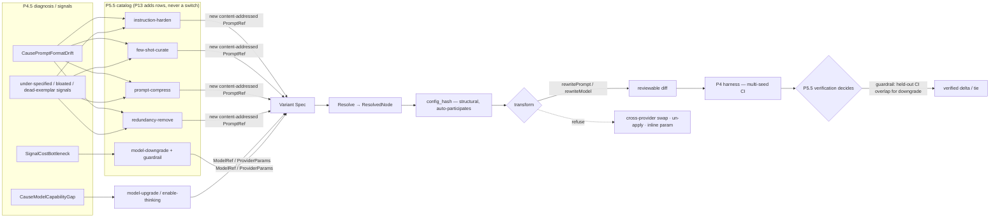

# PRD — P13: Prompt & Model Optimization (deepening the one axis that already ships)

| Field | Value |
|---|---|
| Phase / Milestone | P13 / M16 — *Optimization Axis Expansion* program |
| Target window | ~Weeks 40–54 (two waves: 13a prompt-rewrite operators, then 13b model-selection under guardrail) |
| Lead role(s) | AI Engineer + System Designer (co-leads) |
| Supporting role(s) | Backend, QA Engineer, Product Designer, Sales Operations |
| Status | Draft |
| OpenSpec change | `p13-prompt-model-optimization` |
| Related | [P5.5 — Proposals + Verification](P5.5-proposals-verification.md) · [P10 — Prompt & Model Studio](P10-prompt-model-studio.md) · [P4 — Eval Harness](P4-eval-harness.md) · [ADR-002](../adr/ADR-002-provider-gateway-serves-platform-callers.md) · [ADR-004](../adr/ADR-004-runtime-config-binding.md) |

> **Commercial position.** Prompt and model are the **only** optimization dimensions the platform can
> both model *and* apply end-to-end today — the codemod actually emits edits for them
> ([`internal/transform/rewrite.go:55-56`](../../internal/transform/rewrite.go)), where skills and
> context still refuse at the call site. That makes this axis the one whose improvements are already
> *shippable* rather than *modelable-but-deferred*, and P13 spends its budget deepening the axis that
> converts, not widening the one that does not. Every capability here is a proposal-engine and
> verification improvement; **no new dimension, no new registry `Kind`, no new database table, no eval
> or scoring change.**

> **Money-in-git rule.** No dollar amounts, percentages, or price bands appear in this document. Plans
> are referred to by **name only** — Free / Team / Business / Enterprise. Cost appears only as the
> observed telemetry metric `eval_cost_usd`, never as a price.

## 1. Summary

The prompt+model axis is the one place where the platform's promise is fully wired: a variant's model
or prompt override is modeled as a `Dimension` ([`spec.go:42-47`](../../internal/variantspec/spec.go)),
resolved and hashed into `config_hash`, and **materialized as real byte edits** by `rewriteModel` and
`rewritePrompt` ([`rewrite.go:55-56`](../../internal/transform/rewrite.go)) — while `refuseSkills` and
`refuseContext` still return `unsafeRewrite`. The proposal engine already carries four operators on
this axis — `OpModelUpgrade`, `OpEnableThinking`, `OpModelDowngrade`, `OpPromptRewrite`
([`operator.go:35-38`](../../internal/proposal/operator.go), [`catalog.go`](../../internal/proposal/catalog.go)) —
and a single coarse prior for each ([`gain.go:8`](../../internal/proposal/gain.go)).

P13 does not add an axis. It **deepens the one that ships**, in two capabilities. **`prompt-rewrite`**
turns the single grounded-rewrite operator into a family — instruction hardening, few-shot exemplar
curation, prompt compression / token-reduction, and redundancy removal — each of which produces a **new
content-addressed prompt version** through P10's immutable registry and flows through the *existing*
`rewritePrompt` codemod. **`model-selection`** adds an explicit **downgrade quality guardrail** (a
cheaper model is admissible only when it holds `task_success` within confidence-interval overlap on
**held-out** data), and specifies model-parameter tuning (temperature / max-tokens) and the honest
boundary on provider routing. Both capabilities obey the same law the platform is built on: **diagnosis
proposes, verification decides.** A new operator only *nominates* a candidate; the multi-seed P4 harness
and the P5.5 verification gate are the only things that can turn it into a claim. Milestone **M16 — the
shippable axis gets deeper without the platform getting wider** closes when the proposal engine emits a
richer, verification-gated candidate set on prompt and model with **zero** change to the eval,
scoring, transform, or registry contracts.

## 2. Problem & context

The axis that already applies is also the axis that is thinnest in *what it proposes*. The gap is not in
plumbing — it is in the operator catalog and its admissibility rules.

- **Prompt optimization is one operator wearing one hat.** `OpPromptRewrite` handles exactly one
  diagnosis code — `CausePromptFormatDrift` — and asks a wired `PromptOptimizer` for a single grounded
  rewrite ([`catalog.go:108-149`](../../internal/proposal/catalog.go)). A prompt that is *correct but
  bloated*, *correct but under-specified*, or *carrying dead few-shot examples* produces **no
  candidate**, because none of those is format drift. The transform can apply a better prompt; the
  engine simply never proposes one.

- **"Rewrite the prompt" with no discipline is exactly the move the platform exists to forbid.** An LLM
  asked to "improve this prompt" will happily return a longer, differently-worded prompt that scores the
  same or worse, and a naive tool would ship it. The repo's answer is already encoded: `OpPromptRewrite`
  **declines** an ungrounded rewrite (`ErrUngrounded` → no candidate,
  [`catalog.go:132-137`](../../internal/proposal/catalog.go)). P13 must extend that discipline to every
  new prompt operator: **an unverified rewrite is never shipped**, and a rewrite that cannot point at the
  failing cases it addresses is not even proposed.

- **Compression is where the immutability rule earns its keep.** Token-reduction and redundancy removal
  are the operators most likely to quietly change behavior — a dropped instruction, a removed slot, a
  collapsed exemplar. P10 fixed the storage contract for exactly this: **edits publish a new
  content-addressed version; the prior stays resolvable** ([`project.md`](../../openspec/project.md) P10
  rules), and **an indirection never hides a value from review — resolved values ship in the same diff,
  or the transformation is rejected.** A compression operator that removed a `{{slot}}` a call site still
  supplies would *un-apply* that node; P10's impact analysis already refuses that at resolve time, and
  P13 must route every new operator through it rather than around it.

- **Model downgrade has an incentive it must not be allowed to act on.** `OpModelDowngrade` fires on a
  `SignalCostBottleneck` and proposes cheaper models ([`catalog.go:85-104`](../../internal/proposal/catalog.go)).
  Cheaper is the operator's *goal*, which makes "ship the cheaper model" the tempting failure. The only
  defensible rule is a **guardrail**: a downgrade is admissible **only** when the cheaper model's
  `task_success` confidence interval **overlaps** the incumbent's on **held-out** cases — i.e. the
  platform cannot statistically tell them apart on data the operator did not select. That predicate is
  the same CI-overlap tie rule scoring already computes
  ([`scoring/rank.go`](../../internal/scoring/rank.go), `evalstats.Compare`); it has simply never been
  wired as an *admissibility* condition on a cost-driven operator. Today there is **no held-out split and
  no guardrail** — that is the P13 deepening.

- **Provider routing is claimed loosely and refused precisely.** `rewriteModel` **refuses a
  cross-provider swap at a user call site** — an Anthropic SDK call does not become an OpenAI call by
  changing a string ([`rewrite.go:81-86`](../../internal/transform/rewrite.go), ADR-002). Any
  "model-selection" capability that implied free provider routing would be selling a diff that compiles
  and then talks to the wrong provider. P13 states the boundary as a first-class requirement:
  **intra-provider model swap and parameter tuning are real; cross-provider routing at a user call site
  is refused, loudly, at transform** — modeled and hashable, but not materialized.

**Upstream state assumed.**
**P0** — `config_hash` is purely structural, so any field already in `ResolvedNode` (`ModelRef`,
`PromptRef`, `ProviderParams`) participates in identity with no hash change
([`internal/confighash`](../../internal/confighash/)). **P2** — the model/prompt rewriters and the
worktree/build path. **P3.5** — the pattern classifier that gates operator admissibility. **P4** — the
multi-seed harness, `task_success` and the standard metric family
([`metricnames.go`](../../internal/evalharness/metricnames.go)), and the CI/tie machinery. **P4.5** —
the diagnosis taxonomy (`CausePromptFormatDrift`, `CauseModelCapabilityGap`, …
[`diagnosis/taxonomy.go`](../../internal/diagnosis/taxonomy.go)) and the cost/redundancy signals. **P5.5**
— the operator/catalog/verification architecture P13 extends
([`operator.go`](../../internal/proposal/operator.go), [`catalog.go`](../../internal/proposal/catalog.go),
[`gain.go`](../../internal/proposal/gain.go)). **P10** — immutable content-addressed prompt versioning,
bindings, apply-mode (`inline` default, `bound` per ADR-004), impact analysis, and the rule *the studio
is not an evaluator*.

## 3. Goals & non-goals

### Goals

- **G1. Prompt optimization becomes a family of grounded operators, not one.** Instruction hardening,
  few-shot exemplar curation, prompt compression / token-reduction, and redundancy removal SHALL each be
  a distinct catalog operator with its own admissibility, added as rows — never as a widened switch.
- **G2. No prompt rewrite ships unverified.** Every new prompt operator SHALL emit only *candidates*;
  none SHALL be admissible as a change without passing the P5.5 verification gate, and a rewrite that
  cannot ground itself in the failing cases it addresses SHALL NOT be proposed.
- **G3. Prompt edits preserve P10 immutability.** Every rewrite SHALL publish a **new content-addressed
  prompt version**; the prior version SHALL remain resolvable; no operator SHALL mutate a version in
  place.
- **G4. A prompt rewrite that would un-apply a node SHALL be rejected, not silently dropped.** A rewrite
  that changes a prompt's slot set such that a call site's supplied value no longer binds SHALL be
  refused at resolve/transform with a named cause — the resolved values ship in the same diff, or the
  transform is rejected.
- **G5. Model downgrade is admissible only under an explicit quality guardrail.** A cheaper model SHALL
  be admissible **only** when its `task_success` confidence interval overlaps the incumbent's on
  **held-out** cases; a downgrade that degrades quality outside CI overlap SHALL NOT be admissible,
  regardless of cost improvement.
- **G6. Held-out evaluation is a first-class input to admissibility.** The guardrail SHALL be judged on
  cases the proposing operator did **not** select, so a downgrade cannot be admitted by overfitting the
  cases that motivated it.
- **G7. Model up/down-grade and thinking-budget selection stay verification-decided.** The existing
  `OpModelUpgrade` / `OpEnableThinking` / `OpModelDowngrade` operators SHALL keep proposing; P13 adds the
  guardrail and richer candidate derivation but SHALL NOT let any of them ship a change the harness did
  not rank a win (or, for downgrade, a guardrail-passing tie).
- **G8. Model-parameter tuning is specified within the honest apply-mode boundary.** Temperature and
  max-tokens tuning SHALL be modeled and hashed via `ProviderParams`, materialized where the apply mode
  can carry it (`bound` mode, ADR-004), and **refused** where it cannot (an inline node with no
  applicable rewrite) rather than dropped.
- **G9. Provider routing states its boundary as a requirement.** Intra-provider model swaps SHALL be
  applied; a cross-provider swap at a user call site SHALL be **refused at transform** with a named
  cause (ADR-002), never emitted as a diff that compiles against the wrong provider.
- **G10. The axis deepens with no eval, scoring, transform, registry, or schema change.** Every new
  operator's effect SHALL land in the existing `ResolvedConfig` fields (`ModelRef`, `PromptRef`,
  `ProviderParams`) so it participates in `config_hash` automatically and is scored by the unchanged P4
  harness. No new `Dimension`, no new registry `Kind`, no new metric SHALL be required.
- **G11. Statistical honesty is preserved end to end.** Every P13 candidate SHALL be judged multi-seed
  with confidence intervals and the tie rule; a single-seed result SHALL never decide a P13 change, and
  CI-overlapping candidates SHALL be reported tied, not ranked.
- **G12. The studio remains not an evaluator.** P13's operators live in the proposal/verification engine.
  No P13 capability SHALL introduce a score, rank, winner, or promotion path into the P10 authoring
  studio.

### Non-goals (explicitly deferred or owned elsewhere)

- **New optimization dimensions (skills, context, reordering).** Owned by their own axis PRDs; P13
  touches only `model` and `prompt`. The `refuseSkills`/`refuseContext` interim
  ([`rewrite.go:388,417`](../../internal/transform/rewrite.go)) is **not** addressed here.
- **Cross-provider routing at user call sites.** Deliberately out of scope by ADR-002; P13 specifies the
  **refusal**, not a cross-SDK codemod.
- **New eval oracles or a new quality metric.** The guardrail reads the existing `task_success` and its
  CI; P13 registers no bespoke metric. (The optional `registry.go:86` hook is *not* used.)
- **Prompt authoring UX.** Publishing, diffing, and impact analysis are [P10](P10-prompt-model-studio.md);
  P13 consumes them and adds no editor surface.
- **The autonomous loop's escalation policy.** P13 enriches the candidate set [P6](P6-autonomous-optimizer.md)
  runs; it does not change automation-level gating or auto-merge entitlement.
- **A second prompt store or a prompt "mutation" path.** Immutability is P10's; P13 adds nothing that
  edits a version in place.

## 4. Users & personas

| Persona | What P13 is for them | What breaks without it |
|---|---|---|
| **AI engineer tuning a workflow** (primary) | A prompt that is bloated, under-specified, or carrying dead exemplars now yields concrete, verified candidates — not just "format drift or nothing." | The engine proposes a prompt change only when the output contract is violated; every other prompt problem is invisible to it. |
| **Cost owner on an over-provisioned workflow** (primary) | Downgrade proposals that are *safe by construction*: admitted only when quality is statistically indistinguishable on held-out cases. | Cost pressure produces cheaper-model proposals whose quality was checked only on the cases that motivated them — overfit, and shipped. |
| **Platform (the autonomous optimizer, P6)** | A richer, priced, verification-gated candidate stream on the axis it can actually apply. | The loop keeps re-proposing the same four operators and stalls on prompt/model problems it cannot express. |
| **Security / procurement reviewer** | A written, checkable statement that provider routing across SDKs is *refused*, not silently attempted. | "Model selection" reads as free provider swapping, and the review stalls on a capability the platform deliberately does not ship. |
| **Verification harness (P5.5)** | Candidates that arrive already grounded and guardrail-tagged, so the gate has an explicit predicate to enforce. | The gate re-derives admissibility that should have been a property of the proposal. |

Non-personas: **the P10 studio author** (P13 adds no authoring surface), and **platform operators**
(P8).

## 5. User stories / jobs-to-be-done

**AI engineer**
- As an AI engineer, I want the engine to propose **compressing** a prompt that is correct but bloated,
  so that I get a cheaper prompt whose behavior was **verified equal**, not asserted shorter.
- As an AI engineer, I want **few-shot exemplars curated** — dead or misleading examples removed, useful
  ones kept — with the change grounded in the cases it fixes, so I am not shipping a longer prompt on a
  hunch.
- As an AI engineer, I want an **instruction-hardening** proposal when a node is under-specified, so the
  fix is a concrete new prompt version I can review as a diff, not advice.

**Cost owner**
- As a cost owner, I want a **downgrade proposed only when it is safe** — when the cheaper model cannot
  be told apart from the current one on held-out cases — so that the cost win never quietly costs
  quality.
- As a cost owner, I want to see that the guardrail was judged on **cases the tool did not pick**, so I
  can trust the "no measurable quality loss" claim.

**Platform / autonomous optimizer**
- As the optimizer, I want **more operators on the axis I can actually apply**, so that my candidate set
  on prompt/model problems is deep enough to be worth running.
- As the optimizer, I want each candidate to carry its **guardrail verdict and grounding**, so
  verification enforces a predicate rather than re-deriving one.

**Reviewer**
- As a reviewer, I want the platform to state that **cross-provider routing at my call sites is refused**,
  so "model selection" does not mean an SDK rewrite I did not ask for.

## 6. Functional requirements

Numbered FRs; each maps 1:1 to an OpenSpec requirement under
`openspec/changes/p13-prompt-model-optimization/specs/`.

### Deeper prompt operators (capability `prompt-rewrite`)

- **FR1.** The catalog SHALL gain distinct prompt operators for **instruction hardening**, **few-shot
  exemplar curation**, **prompt compression / token-reduction**, and **redundancy removal**, each added
  as a catalog row with its own `Handles()` / `HandlesSignal()` / `AdmissiblePatterns()`, never as a
  branch inside an existing operator.
- **FR2.** Each prompt operator SHALL emit only **candidate** Variant Specs. A candidate SHALL become an
  applicable change only after passing the P5.5 verification gate; no operator output SHALL be treated
  as a result.
- **FR3.** A prompt operator SHALL decline to propose (emit no candidate, not an error) when it cannot
  **ground** its rewrite in the failing or target cases it addresses — extending the existing
  `ErrUngrounded` discipline to every new operator.
- **FR4.** Every rewrite SHALL be published as a **new content-addressed prompt version** via P10's
  registry; the prior version SHALL remain resolvable, and no operator SHALL express or perform an
  in-place mutation.
- **FR5.** A rewrite SHALL carry its **grounding** (the cases it addresses) on the candidate, so
  verification and review can see what the change is for.
- **FR6.** A rewrite that changes a prompt's **slot set** such that a call site's supplied value no
  longer binds SHALL be **refused** at resolve/transform with a named cause. The resolved values ship in
  the same diff, or the transform is rejected — a compression that un-applies a node SHALL NOT be
  silently dropped.
- **FR7.** A prompt candidate's effect SHALL be expressed solely as a changed `PromptRef` on the
  affected node, so it participates in `config_hash` through the existing `ResolvedNode.PromptRef` field
  with no hash-contract change.
- **FR8.** A compression / redundancy-removal candidate SHALL be judged on the **same** `task_success`
  and cost metrics as any other candidate; a shorter prompt that does not hold quality within CI SHALL
  NOT be a win.

### Model selection under guardrail (capability `model-selection`)

- **FR9.** A **model downgrade** candidate SHALL be admissible **only** when the cheaper model's
  `task_success` confidence interval **overlaps** the incumbent's on **held-out** cases (the same
  CI-overlap predicate the tie rule uses). A downgrade outside CI overlap SHALL be inadmissible
  regardless of its `eval_cost_usd` improvement.
- **FR10.** The guardrail SHALL be evaluated on cases the proposing operator **did not select**, so a
  downgrade cannot be admitted by fitting the cases that motivated it.
- **FR11.** Model **upgrade** and **extended-thinking** candidates SHALL keep their existing
  admissibility (`CauseModelCapabilityGap`; thinking-budget models on reasoning patterns) and SHALL ship
  only when the harness ranks them a win; P13 SHALL NOT relax this.
- **FR12.** A downgrade that the guardrail admits as a **tie** (CIs overlap; cost strictly lower) SHALL
  be a valid, shippable outcome — a verified equal-quality-cheaper change — reported as a tie on quality
  and a win on cost, never as a quality win.
- **FR13.** **Model-parameter tuning** (temperature, max-tokens) SHALL be modeled and hashed via
  `ResolvedNode.ProviderParams`, materialized where the node's apply mode can carry it (**bound** mode,
  ADR-004), and **refused** with a named cause where it cannot (an **inline** node with no applicable
  parameter rewrite) — never dropped.
- **FR14.** An **intra-provider** model swap SHALL be applied via the existing `rewriteModel` path.
- **FR15.** A **cross-provider** model swap at a user call site SHALL be **refused at transform** with a
  named cause (ADR-002): it is modeled and hashable but not materialized, and SHALL NOT be emitted as a
  diff that compiles against a different provider's SDK.
- **FR16.** A model candidate's effect SHALL be expressed solely as a changed `ModelRef` and/or
  `ProviderParams` on the affected node, so it participates in `config_hash` through existing fields with
  no hash-contract change.

### Shared engine discipline (both capabilities)

- **FR17.** Every P13 candidate SHALL be evaluated **multi-seed with confidence intervals**; a
  single-seed run SHALL NOT decide a P13 change, and CI-overlapping candidates SHALL be reported **tied**
  rather than ranked.
- **FR18.** Every P13 operator SHALL carry a **prior** in the gain table so it participates in
  cheapest-first verification ordering ([`gain.go`](../../internal/proposal/gain.go)); the prior SHALL
  be used only for ordering and SHALL NOT appear as a result.
- **FR19.** No P13 capability SHALL introduce a new `Dimension`, registry `Kind`, database table, eval
  oracle, or scoring metric; the eval harness SHALL remain axis-agnostic and consume only
  `config_hash` + `Trace`.
- **FR20.** No P13 capability SHALL introduce a score, rank, winner, interval, or promotion path into
  the P10 authoring studio; the studio remains not an evaluator.

## 7. Non-functional requirements

| # | Requirement | Target |
|---|---|---|
| **NFR1** | **Verification-gated by construction** | No code path SHALL turn an operator's output into an applied change without the P5.5 gate; asserted by a test that a raw candidate is never applied. Machine-enforced, not review-enforced. |
| **NFR2** | **Immutability preserved** | A rewrite publishes a new content-addressed version; the prior remains resolvable. Asserted by a test that a rewrite creates a new `version_id` and leaves the parent intact — the P10 DB trigger is the backstop, not the first line. |
| **NFR3** | **`config_hash` participation without contract change** | A model/prompt/param change yields a new `config_hash`; a no-op change yields a byte-identical one. P0 golden vectors SHALL still reproduce bit-for-bit — no new hashed field is introduced. |
| **NFR4** | **Guardrail determinism** | For a fixed held-out split, seeds, and candidates, the downgrade guardrail verdict is identical across runs; the split is derived deterministically from `config_hash` + case ids, never sampled at runtime. |
| **NFR5** | **Held-out isolation** | The cases used to judge the guardrail are disjoint from the cases an operator selected to motivate its proposal; asserted, not assumed. |
| **NFR6** | **Interim refusal is loud** | A node carrying a cross-provider swap or an un-materializable inline param override is refused at transform with a typed `ErrUnsafeRewrite`/named cause; it is never silently dropped and never produces a diff. |
| **NFR7** | **Statistical honesty** | Every P13 verdict carries a confidence interval; ties are reported when CIs overlap; a single-seed result never decides. Same machinery as P4 — no second implementation. |
| **NFR8** | **Ungrounded rewrites are unproposable** | An operator with no grounding for its rewrite emits no candidate; asserted by a test that an ungrounded request yields zero candidates rather than a generic rewrite. |
| **NFR9** | **No content leaves the boundary it must not** | Prompt bodies handled by operators stay within the platform's existing registry/trace boundary; P13 adds no new egress and no new store. |
| **NFR10** | **Money-in-git honesty** | Cost is expressed only as `eval_cost_usd` telemetry and plan **names**; no price, band, or percentage appears in P13 code, spec, or doc. |

## 8. System design summary

### 8.1 Where P13 lives on the optimizer spine



**The whole diagram fits under one sentence:** P13 adds *rows to the catalog* and *one admissibility
predicate*, and every downstream box — resolve, hash, transform, eval, verify — is unchanged, because a
prompt/model change already lands in fields that already hash and a codemod that already applies.

### 8.2 Decisions, with what was rejected

| # | Decision | Rejected alternative | Why (八级法则) |
|---|---|---|---|
| **D1** | **Each prompt strategy is its own catalog operator** | One "improve prompt" operator with a mode flag | **L6 不可扩展 + L8.** The catalog is a dispatch table by design ([`catalog.go:16`](../../internal/proposal/catalog.go)) — "adding an operator is adding a row, never editing a switch." A mode flag rebuilds the switch the architecture removed, and couples four admissibility rules into one function. |
| **D2** | **Every new prompt operator declines when ungrounded** | Emit a best-effort rewrite and let verification filter it | **L1 安全 + strategy.** *Diagnosis proposes, verification decides* — but an ungrounded rewrite floods verification with candidates that address nothing, and the one that scores equal by chance looks like a win. The existing `ErrUngrounded` decline ([`catalog.go:132`](../../internal/proposal/catalog.go)) is the pattern; P13 generalizes it. |
| **D3** | **Rewrites publish new immutable versions; compression routes through P10 impact analysis** | Let a compression operator edit or trim a prompt version directly | **L1/L5.** P10's rule is absolute: edits publish a new content-addressed version, and a change that un-applies a node is refused so *resolved values ship in the same diff*. A compression that drops a live `{{slot}}` is exactly that refusal case; going around it produces a non-building or mis-binding codemod discovered after submit. |
| **D4** | **Downgrade is guardrailed on held-out CI overlap** | Ship the cheaper model whenever cost drops and quality "looks fine" | **L1 安全 (honesty).** The operator's goal is *cheaper*, so "looks fine" is judged by the party that wants the cheap answer, on the cases it chose. Held-out CI overlap is a predicate the operator cannot game — the same tie rule scoring already computes ([`rank.go`](../../internal/scoring/rank.go)). A cost win that silently costs quality is a stability degradation bought with cost convenience. |
| **D5** | **The guardrail reads existing metrics; no new eval** | Add a bespoke "downgrade-safety" quality metric | **L5 不可演进 + L7.** `task_success` and its CI already express "can we tell them apart." A second metric is a second definition of quality and a second place for it to drift from the harness. The eval stays axis-agnostic ([`evaluator.go`](../../internal/evalharness/evaluator.go)). |
| **D6** | **Cross-provider routing is refused at transform, as a first-class requirement** | Quietly attempt a string swap and hope the SDK matches | **L1/L2.** `rewriteModel` already refuses this ([`rewrite.go:81-86`](../../internal/transform/rewrite.go), ADR-002); a diff that compiles and then calls the wrong provider is the worst failure mode — silent and in production. The refusal is loud and named. |
| **D7** | **Param tuning is refused where the apply mode can't carry it** | Emit a param override on an inline node and drop the un-materializable part | **L1/L4.** A dropped param is a config that hashed one thing and ran another — the exact `config_hash` reconciliation P10 forbids ("a mismatched run **fails** rather than being scored"). Refuse loud, or carry it in `bound` mode (ADR-004). |
| **D8** | **Effects land only in existing `ResolvedNode` fields** | Add a P13 field to carry richer prompt/model intent | **L5.** `config_hash` is purely structural, so `ModelRef`/`PromptRef`/`ProviderParams` already carry identity ([`internal/confighash`](../../internal/confighash/)). A new field would break P0's golden vectors for every existing config. Intent belongs on the candidate's rationale/grounding, not in the hashed config. |

### 8.3 Data-model additions

```
(none to the hashed config, the registry, or the store — this is the point of the phase)

Candidate (P13-enriched, in-memory, not hashed):
  Operator        : one of {instruction_harden, few_shot_curate, prompt_compress,
                            redundancy_remove, model_downgrade(+guardrail), ...existing}
  Grounding       : the cases the rewrite addresses            // FR3, FR5 (already on Candidate)
  GuardrailVerdict: { held_out_overlap: bool, cost_delta_sign } // FR9, FR12 — verification input
  ExpectedGain    : operator_prior × severity                  // FR18, existing gain.go

HeldOutSplit (derived, deterministic):
  split(cases, config_hash) → { motivating[], held_out[] }     // NFR4, NFR5; disjoint by construction
```

`GuardrailVerdict` and `HeldOutSplit` are **verification-time**, in-memory artifacts consumed by the
P5.5 gate. Neither is stored, neither is hashed, and neither changes the eval or scoring contract — they
are the shape of an admissibility decision, not a new record.

## 9. Design by role lens

**AI Engineer (co-lead) — *the axis is applied; make it deep, and keep verification the only judge.***
The work here is operator design, and the discipline is the one already in the file: an operator
*nominates* a spec and nothing more ([`operator.go:14`](../../internal/proposal/operator.go) — "a GATE
refuses any candidate that violates the P5 contract or is inadmissible"). The four new prompt operators
each attach to a diagnosis or signal and each **declines when ungrounded**, because the failure mode of
"improve this prompt" is a longer prompt that scores the same by chance and reads like a win. Compression
and redundancy-removal are the dangerous two: they are the operators most able to change behavior while
looking like tidying, which is exactly why they publish a new immutable version and route through P10's
impact analysis — a rewrite that drops a live slot is *refused*, not shipped. On the model side the
substance is the **guardrail**: `OpModelDowngrade` has an incentive to be wrong (cheaper is its goal), so
its admissibility is a predicate it cannot game — CI overlap on **held-out** cases — computed by the same
`evalstats.Compare` the tie rule uses. Multi-seed, intervals, ties: none of that is re-implemented,
because a second statistics implementation is a second place to be wrong.

**System Designer (co-lead) — *deepen the axis without touching a single contract.***
The load-bearing observation is that this phase needs **no schema, no hash change, no new metric**. A
prompt change is a new `PromptRef`; a model change is a new `ModelRef` or `ProviderParams` — all three
are already fields on `ResolvedNode`, and `config_hash` is purely structural, so a P13 candidate
participates in identity for free ([`internal/confighash`](../../internal/confighash/)). That is the
whole argument for D8: any new field would break P0's golden vectors for every config that predates it,
to carry intent that belongs on the candidate, not in the hash. The one-way doors are named and then
*not walked through*: no new `Dimension` (`spec.go:42` stays a four-member enum), no new registry `Kind`,
no new table — which is why P13 ships **no** `decisions.md`. The guardrail is the only genuinely new
contract, and it is deliberately built from an existing predicate (CI overlap) on an existing metric
(`task_success`) so it cannot fork the definition of quality.

**Backend (support) — *the operators are catalog rows; the refusals are typed.***
Each operator is a struct with `Kind()/Handles()/HandlesSignal()/AdmissiblePatterns()/Propose()`, added
to `DefaultCatalog()` ([`catalog.go:17`](../../internal/proposal/catalog.go)), with a prior in
`gain.go`. The refusals are the sharp edges: a cross-provider swap returns `unsafeRewrite`
([`rewrite.go:81`](../../internal/transform/rewrite.go)); an inline param override with no rewriter
returns a named `ErrUnsafeRewrite`; a slot-set change that un-applies a node is refused at resolve. Every
one of these is a *typed* refusal the UI and P4 can distinguish from "you asked for something that does
not exist" ([`spec.go:49-65`](../../internal/variantspec/spec.go)) — an un-applicable override is never
a silent drop and never a diff nobody can trust.

**QA Engineer (support) — *the two guarantees that cannot be read from code.***
Two tests carry this phase. First, **held-out isolation**: a test that asserts the cases judging the
downgrade guardrail are **disjoint** from the cases the operator selected — because a guardrail judged on
the motivating cases is not a guardrail, and this is invisible in a code read. Second,
**verification-gating by construction**: a test that a raw operator candidate is *never* an applied
change without the P5.5 gate — the whole "diagnosis proposes, verification decides" claim is decoration
if a candidate can leak into a diff. Beyond those: an ungrounded operator emits **zero** candidates
(NFR8); a compression that drops a live slot is **refused** (FR6); a cross-provider swap and an
un-materializable inline param are **refused, not dropped** (NFR6); a downgrade that fails CI overlap is
**inadmissible even when cheaper** (FR9); and every verdict carries a CI with ties reported (NFR7). Each
gate must be able to go **red**: a shorter-but-worse prompt must fail, or FR8 is theatre.

**Product Designer (support) — *the change a user sees is a diff and a reason, never a nudge.***
P13 adds no editor surface — that is the point — but it changes what a user is offered, and that gets
written into the spec regardless. A prompt proposal arrives as a **reviewable diff of a new version**
with its **grounding** attached (the cases it addresses), so the user judges evidence, not adjectives. A
downgrade proposal states plainly that it was admitted as an **equal-quality-cheaper tie**, judged on
cases the tool did not pick — the honest framing that makes the cost win trustworthy. And the unhappy
paths are named: a rewrite that would un-apply a node tells the user **which slot** stopped binding,
in-editor, per P10's impact analysis — never at codemod time. Interface text, the `Candidate` data, and
the operator's code name stay three separate layers.

**Sales Operations (support) — *sell the axis that applies, and state the boundary you refuse.***
The claim is unusually strong because it is narrow: the platform can **model and apply** prompt and model
changes end-to-end today, and P13 makes the *proposals* on that axis deeper and **verification-gated** —
every shipped change passed a multi-seed gate, and every downgrade cleared a held-out guardrail. Two
things must never be said. First, that any prompt or model change is trusted because an LLM suggested it
— 🚫 *diagnosis proposes, verification decides*, and only a P5.5 verified delta is a claim. Second, that
"model selection" includes **cross-provider routing at customer call sites** — it does not; that is
refused by ADR-002, and saying otherwise sells a diff that talks to the wrong provider. Cost is framed by
plan **name** and the `eval_cost_usd` metric only — never a price, band, or percentage. "Risk is
**observable**" (the guardrail verdict, the CI, the grounding are all inspectable) — never "risk is
controlled."

## 10. Dependencies

**Requires**
- **P0** — `config_hash` structural identity; `ResolvedNode` fields `ModelRef`/`PromptRef`/`ProviderParams`.
- **P2** — the `rewriteModel`/`rewritePrompt` codemod and the worktree/build path.
- **P3.5** — the pattern classifier that gates operator admissibility.
- **P4** — the multi-seed harness, `task_success` + the standard metric family, CI/tie machinery.
- **P4.5** — the diagnosis taxonomy and cost/redundancy signals the operators attach to.
- **P5.5** — the operator/catalog/gain/verification architecture P13 extends.
- **P10** — immutable content-addressed prompt versioning, bindings, apply-mode (ADR-004), impact analysis.

**Unblocks**
- **[P6](P6-autonomous-optimizer.md)** — a deeper, guardrail-tagged candidate stream on the one axis the
  loop can actually apply.
- The **M16 program** — a template for deepening an *applied* axis (operators + admissibility) without
  paying for a new dimension's codemod, distinct from expanding into a *refused* one.

## 11. Risks & mitigations

| Risk | Owner | Mitigation |
|---|---|---|
| A prompt rewrite ships because it *looked* better, not because it verified better | AI Engineer + QA | FR2/NFR1 — candidates only; a test that a raw candidate is never applied; the P5.5 gate is the only path to a change. |
| A compression operator silently changes behavior (dropped instruction / slot) | AI Engineer + Backend | FR6 — un-apply is refused at resolve via P10 impact analysis; a new immutable version, never an in-place edit (FR4/NFR2). |
| A downgrade is admitted by overfitting the cases that motivated it | AI Engineer + QA | FR9/FR10/NFR5 — CI overlap judged on **held-out**, disjoint cases; a test asserts disjointness. |
| "Model selection" is read as free provider routing | System Designer + Sales Ops | FR15/D6/NFR6 — cross-provider swap refused at transform (ADR-002); stated as a requirement and a claim boundary. |
| A tuned param hashed one thing and ran another | Backend | FR13/D7 — bound-mode materialization (ADR-004) or a loud refusal; `config_hash` reconciliation fails a mismatched run rather than scoring it. |
| The phase quietly grows the hash/eval/registry contract | System Designer | FR19/NFR3/D8 — effects land only in existing fields; P0 golden vectors still reproduce; no new `Dimension`/`Kind`/metric. |
| A single-seed result decides a P13 change | AI Engineer | FR17/NFR7 — multi-seed CIs and the tie rule, the same P4 machinery, no second implementation. |
| Cost creeps into git as a price | Sales Ops | NFR10 — `eval_cost_usd` and plan names only; asserted in review. |

## 12. Rollout & test strategy

**Wave 13a — prompt-rewrite.** The four new prompt operators (instruction hardening, few-shot curation,
compression, redundancy removal), each grounded-or-silent, each publishing a new immutable version, each
routed through P10 impact analysis, each priced in `gain.go`. Ends when the engine proposes verified
prompt improvements for problems that are **not** format drift, and a compression that un-applies a node
is refused.

**Wave 13b — model-selection.** The downgrade guardrail (held-out CI overlap), parameter tuning within
the apply-mode boundary, and the provider-routing refusal stated as a requirement. Ends when a downgrade
is admissible only under the guardrail, an equal-quality-cheaper tie is a shippable outcome, and
cross-provider/inline-param cases refuse loudly.

**How correctness is proven.**
1. **Grounded-or-silent** — an ungrounded request from each new prompt operator yields **zero**
   candidates (NFR8).
2. **Immutability** — a rewrite creates a new `version_id`; the parent stays resolvable (NFR2).
3. **Un-apply refusal** — a compression that drops a live `{{slot}}` is refused at resolve with the slot
   named (FR6).
4. **Verification-gating** — a raw candidate is never an applied change without the P5.5 gate (NFR1).
5. **Guardrail** — a downgrade whose `task_success` CI does **not** overlap the incumbent's on held-out
   cases is **inadmissible**, even with a lower `eval_cost_usd` (FR9).
6. **Held-out isolation** — the guardrail's cases are disjoint from the operator's motivating cases
   (NFR5).
7. **Equal-cheaper tie** — a downgrade with overlapping CIs and strictly lower cost is a valid tie
   outcome, reported as a cost win and a quality tie (FR12).
8. **Refusals are loud** — cross-provider swap and un-materializable inline param each refuse with a
   named cause, producing no diff (NFR6).
9. **Hash stability** — a model/prompt/param change yields a new `config_hash`; P0 golden vectors still
   reproduce bit-for-bit (NFR3).
10. **Statistical honesty** — every verdict carries a CI; CI-overlapping candidates report tied; no
    single-seed decision (NFR7).

## 13. Success metrics & acceptance criteria (M16 exit checklist)

- [ ] **A1.** The catalog emits distinct instruction-harden / few-shot-curate / prompt-compress /
      redundancy-remove operators, each an admissible row, not a branch (G1, FR1).
- [ ] **A2.** Each new prompt operator emits only candidates; none becomes a change without the P5.5
      gate — asserted, not reviewed (G2, FR2, NFR1).
- [ ] **A3.** An ungrounded rewrite request yields **zero** candidates from every new prompt operator
      (G2, FR3, NFR8).
- [ ] **A4.** A rewrite publishes a new content-addressed version and leaves the prior resolvable; no
      in-place mutation exists (G3, FR4, NFR2).
- [ ] **A5.** A compression that changes the slot set so a call-site value no longer binds is **refused**
      at resolve/transform with the slot named (G4, FR6).
- [ ] **A6.** A prompt candidate's only hashed effect is its `PromptRef`; P0 golden vectors reproduce
      (FR7, NFR3).
- [ ] **A7.** A shorter prompt that does not hold `task_success` within CI is **not** a win (FR8).
- [ ] **A8.** A model downgrade is admissible **only** when its `task_success` CI overlaps the
      incumbent's on **held-out** cases; a non-overlapping downgrade is inadmissible despite lower cost
      (G5, FR9).
- [ ] **A9.** The guardrail is judged on cases disjoint from the operator's motivating set (G6, FR10,
      NFR5).
- [ ] **A10.** An equal-quality-cheaper downgrade (CIs overlap, cost strictly lower) is a valid tie
      outcome, reported as a cost win and a quality tie — never a quality win (FR12).
- [ ] **A11.** Model upgrade / extended-thinking keep their admissibility and ship only on a ranked win
      (G7, FR11).
- [ ] **A12.** Param tuning materializes in **bound** mode and is **refused** with a named cause on an
      inline node it cannot carry — never dropped (G8, FR13, NFR6).
- [ ] **A13.** An intra-provider swap applies; a **cross-provider** swap at a user call site is refused
      at transform with a named cause and produces no diff (G9, FR14, FR15, NFR6).
- [ ] **A14.** A model candidate's only hashed effect is `ModelRef`/`ProviderParams`; P0 golden vectors
      reproduce (FR16, NFR3).
- [ ] **A15.** Every P13 verdict is multi-seed with a CI; CI-overlapping candidates report tied; no
      single-seed decision (G11, FR17, NFR7).
- [ ] **A16.** Every P13 operator carries a `gain.go` prior used only for ordering (FR18).
- [ ] **A17.** No new `Dimension`, registry `Kind`, table, oracle, or metric was introduced; the eval
      harness still consumes only `config_hash` + `Trace` (G10, FR19).
- [ ] **A18.** No score, rank, winner, or promotion path entered the P10 studio (G12, FR20).
- [ ] **A19.** No price, band, or percentage appears in P13 code, spec, or doc; cost is `eval_cost_usd`
      and plan names only (NFR10).

## 14. Open questions

1. **How the held-out split is keyed.** Proposed: derive it deterministically from `config_hash` + case
   ids so the guardrail verdict is reproducible (NFR4) and the operator cannot select its own held-out
   set. Ratify the exact derivation before the guardrail ships.
2. **Minimum held-out size for a trustworthy CI.** Below some case count the CI is too wide to
   discriminate and *every* downgrade "ties." Define the floor below which the guardrail returns
   **inadmissible-insufficient-data** rather than a false tie — an explicit third verdict, not a silent
   pass.
3. **Whether few-shot curation may *add* an exemplar or only remove/reorder.** Adding an exemplar draws
   from data whose provenance must be clean; the conservative M16 scope may be removal/reorder only, with
   addition deferred. Decide before 13a closes.
4. **Compression's floor.** A compression operator needs a stopping rule so it does not chase tokens into
   a prompt that ties on a small eval set but is brittle in production. Proposed: compression is a
   candidate like any other and competes on the full metric family, so the floor is verification, not a
   token target — confirm no token-count target leaks in as a goal.
5. **Param-tuning search breadth.** Temperature/max-tokens tuning can explode the candidate set. Bound
   the sweep (a small, declared grid) so verification cost stays proportionate; the grid is a
   verification-ordering concern, not a hashed contract.
