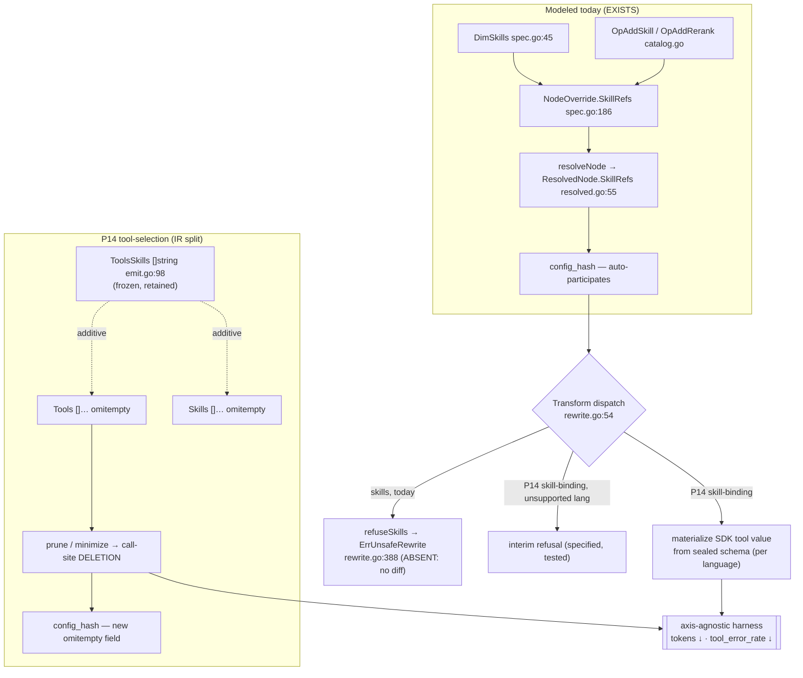

# PRD — P14: Skills & Tools Optimization (making the skill axis apply, and splitting tools from skills)

| Field | Value |
|---|---|
| Phase / Milestone | P14 / M17 |
| Target window | ~two waves: **14a** skill-binding materialization + the interim-refusal contract, then **14b** the tools≠skills IR split + tool pruning / tool-set minimization |
| Lead role(s) | Backend + System Designer (co-leads) |
| Supporting role(s) | AI Engineer, QA Engineer, Product Designer |
| Status | Draft |
| OpenSpec change | `p14-skills-tools-optimization` |
| Related | [P3 — Context + Skills + Sandbox](P3-context-skills-sandbox.md) · [P5.5 — Proposals + Verification](P5.5-proposals-verification.md) · [P10 — Prompt & Model Studio](P10-prompt-model-studio.md) · [ADR-001](../adr/ADR-001-source-transformation-apply-model.md) · [ADR-003](../adr/ADR-003-multi-language-apply-and-verification-strength.md) |

> **Commercial position.** The skill/tool axis is the one the diagnosis catalog leans on hardest — it
> is where `CauseToolSchemaMismatch` and `CauseRetrievalMiss` are answered — and it is also the one axis
> the codemod could not, until now, actually apply. Closing it turns "we can *propose* a skill change"
> into "we can *ship a verified* one," which is the difference between a report and a pull request.
> Available on the same plans as the rest of the optimizer (Team and above per P7); the CLI surface
> (P11) exposes it on Free like every other dimension.

> **Money-in-git rule.** No dollar amounts, percentages, or price bands appear in this document. Plans
> are referred to by **name only** — Free / Team / Business / Enterprise.

## 1. Summary

P14 makes **skills and tools a first-class, *applicable* optimization axis**. Today the skill axis is
modeled end to end — `DimSkills` is a closed-enum dimension
([`internal/variantspec/spec.go:45`](../../internal/variantspec/spec.go)), `NodeOverride.SkillRefs`
carries the override ([`spec.go:186`](../../internal/variantspec/spec.go)), the registry seals a
version-addressed skill contract (`KindSkill`,
[`internal/registry/skill.go`](../../internal/registry/skill.go)), and four operators
(`OpAddSkill`, `OpAddRerank`, `OpFixSchemaBinding`, plus the `ragTune` skill branch) generate skill
variants ([`internal/proposal/catalog.go`](../../internal/proposal/catalog.go)). The resolved value even
participates in `config_hash` (`ResolvedNode.SkillRefs`,
[`internal/variantspec/resolved.go:55`](../../internal/variantspec/resolved.go)). **The one thing the
axis cannot do is apply.** The call-site codemod *refuses*:
[`internal/transform/rewrite.go:388`](../../internal/transform/rewrite.go) `refuseSkills` returns
`ErrUnsafeRewrite`, and the tree-sitter engine shares that refusal
([`rewrite_span.go:62`](../../internal/transform/rewrite_span.go)). A skill change resolves, hashes, and
scores — and then produces no diff.

P14 also fixes a modeling defect that has to be settled before tools can be optimized at all: the IR
**conflates tools and skills into one flat slice**,
[`internal/discovery/emit.go:98`](../../internal/discovery/emit.go) `ToolsSkills []string`. A *tool* (a
provider-native function the model may call) and a *skill* (a registered platform capability with a
sealed input/output contract) are different things with different apply mechanics, and a single list
cannot express "prune this unused tool" without also meaning "unbind this platform skill."

Two capabilities deliver this. **`skill-binding`** replaces the refusal with real call-site
materialization — constructing the SDK tool value from the skill's sealed schema — and keeps the
interim refusal as a *specified, testable* behavior for every language whose rewriter has not yet
landed. **`tool-selection`** splits tools from skills in the IR as an additive, append-only change, then
specifies **tool pruning** (drop tools the eval set never exercises, to cut tokens and latency) and
**tool-set minimization**. Milestone **M17 — the skill axis ships diffs, and tools are a dimension of
their own** means a skill add/remove/rerank produces a verified change where its language is supported
and a loud refusal where it is not, and an unused tool can be pruned and *scored by the metrics the
harness already emits*.

## 2. Problem & context

Four problems block the axis, and each maps to a design commitment.

- **The skill axis is fully modeled and cannot apply.** Everything upstream of the codemod is real:
  resolution, hashing, the operator catalog, the diagnosis codes that trigger it. The codemod is where
  it stops. `refuseSkills` is honest about why — *"binding skills means constructing SDK tool values …
  whose shape differs per SDK and per SDK version … a subtly-wrong tool schema is the kind of change
  that compiles and then degrades quality invisibly — the worst possible failure for an eval platform"*
  ([`rewrite.go:378-396`](../../internal/transform/rewrite.go)). That refusal is correct as a default
  and wrong as a permanent state: the axis the catalog most relies on cannot close the loop, so every
  `add_skill` / `add_rerank` candidate is proposed, ranked by its prior
  ([`gain.go`](../../internal/proposal/gain.go) — `OpAddSkill: 0.35`), and then cannot be realized.
- **Tools and skills are one slice, so neither can be optimized cleanly.** `ToolsSkills []string`
  ([`emit.go:98`](../../internal/discovery/emit.go)) is a single list carrying two different kinds of
  thing. A *skill* resolves to a sealed registry contract and is *bound* by constructing a value; a
  *tool* is already declared at the call site and is *selected* — kept or pruned — from what the model
  is offered. Folding them means the optimizer cannot say "this node offers eight tools and calls two;
  prune the other six" without the sentence also reading as "unbind six platform skills." The two
  operations have opposite apply mechanics (construct vs. delete) and must be separable in the IR before
  either is safe.
- **Removing an un-applicable override silently would be a lie.** The tempting shortcut — when a
  language cannot materialize a skill, drop the `SkillRef` and emit the rest of the diff — produces a
  change that *looks* applied and is not. A node the author asked to gain a skill would ship without it,
  its `config_hash` would still claim the skill, and the eval would score a configuration that never
  existed. The refusal must stay a **first-class, loud** outcome until the materializer for that
  language lands, never a silent drop.
- **A new "tool efficiency" metric would fork the source of truth.** Tool pruning's whole payoff is
  fewer tokens and fewer tool errors — and the harness *already* measures both (`eval_tokens_total`,
  `tool_error_rate`, [`internal/evalharness/metricnames.go:27-28`](../../internal/evalharness/metricnames.go)).
  Because eval is axis-agnostic — it consumes only `config_hash` + `Trace`, never a dimension label — a
  pruned tool set is scored with **zero eval change**. Inventing a bespoke tool-efficiency score would
  create a second definition of a saving the platform can already see, and two numbers for one question.

**Upstream state assumed.**
**P1** (discovery and the IR — the frontend that populates `ToolsSkills` today and will populate the
split fields). **P2** (the codemod, the per-dimension rewriter dispatch, and the `ErrUnsafeRewrite`
refusal contract this phase both honors and narrows — [ADR-001](../adr/ADR-001-source-transformation-apply-model.md)).
**P3** (skills modeling, the `KindSkill` registry, and the rule that P2 runs only trusted/built-in
skills while sandboxed execution of arbitrary repo tool code is P3's —
[`skill.go:20-26`](../../internal/registry/skill.go)). **P3.5** (the `ToolUse` and `RetrievalRAG`
patterns that gate which nodes a skill operator is admissible on). **P4/P4.5** (the axis-agnostic eval
harness and scoring, and `CauseToolSchemaMismatch` / `CauseRetrievalMiss`, the diagnosis codes that
drive the skill operators). **P5.5** (the proposal catalog, the operators, and the *diagnosis proposes,
verification decides* discipline this phase's changes are gated by). **P10** (the additive-`config_hash`
`omitempty` pattern from [decisions.md D-1.4](../../openspec/changes/p10-prompt-model-studio/decisions.md)
and the fail-closed "validate against a recorded set" pattern from `in_scope` / `DeclaredEnv`).

## 3. Goals & non-goals

### Goals

- **G1. A bound skill is materialized at the call site.** For each supported language, `apply` SHALL
  construct the SDK tool value for a bound skill from the skill's **sealed input/output schema**
  (`KindSkill`), replacing the refusal. The skill's contract, not a guess, is the source of the shape.
- **G2. An un-applicable skill is refused, never dropped.** A node carrying a `SkillRef` whose language
  has no landed materializer SHALL be **refused at transform** with `ErrUnsafeRewrite`, naming the node
  and the dimension. It SHALL NOT be silently removed, and no partial diff SHALL be emitted for that
  node's skill dimension.
- **G3. Skill operators are verification-gated.** `add`, `remove`, and `rerank` skill changes SHALL be
  *proposals* — realized as a diff and then **scored by the eval harness**, never applied on the
  strength of the diagnosis alone. A materialized skill that degrades the score SHALL NOT ship.
- **G4. A materialized skill validates its argument shape before it runs.** A bound skill's arguments
  SHALL be checked against the skill's compiled input contract (`SkillEntry.ValidateInput`) so a
  shape violation is caught before the node executes, not at first live call.
- **G5. Tools and skills are separate in the IR.** The IR SHALL carry **tools** and **skills** as
  distinct fields — a *tool* is a provider-native function/tool the model may call; a *skill* is a
  registered platform capability. The split SHALL be **additive and append-only**: pre-P14 IR bytes are
  unchanged, and the frozen conflated `ToolsSkills` slice is retained, never repurposed.
- **G6. The discovery frontend populates the split.** Discovery SHALL classify each discovered entry as
  a tool or a skill and populate the new fields, so the split is a fact recorded at extraction, not
  inferred later by a consumer.
- **G7. Unused tools can be pruned.** A tool a node **offers** but the eval set **never exercises** SHALL
  be a pruning candidate, expressed as a **call-site deletion** of an already-present tool, reducing the
  tokens spent declaring it and the surface for a tool error.
- **G8. Tool-set minimization is expressible.** The minimal tool set that preserves `task_success`
  SHALL be expressible as a candidate the optimizer can propose and the harness can score.
- **G9. Tool selection participates in identity additively.** A tool selection SHALL join
  `resolved_config` so that pruning a tool changes `config_hash`, while a node that prunes nothing hashes
  **byte-identically** to how it did before this field existed (the `omitempty` / nil-when-empty rule).
- **G10. No eval change; existing metrics carry the effect.** Tool pruning and tool-set minimization
  SHALL be scored by the **existing** axis-agnostic harness; their benefit SHALL surface as fewer
  `eval_tokens_total` and lower `tool_error_rate`, not as a new bespoke metric.
- **G11. Tool and skill changes respect the typed envelope.** A materialized skill or a pruned tool set
  SHALL surface tool-call failures only through the `toolcontract` typed envelope's **allowlisted error
  codes** ([`internal/toolcontract/errors.go`](../../internal/toolcontract/errors.go)), so
  `tool_error_rate` stays well-defined and a change's effect on it is measurable.

### Non-goals (explicitly deferred or owned elsewhere)

- **Sandboxed execution of arbitrary repository tool code** — **[P3](P3-context-skills-sandbox.md).**
  P14 materializes bindings for **trusted/built-in** skills the registry seals (`skill.go` — *"P2 runs
  only trusted/built-in skills"*). Running untrusted repo tool implementations under isolation is P3's.
- **Cross-provider tool translation.** P14 does not rewrite a tool declared for one provider's SDK into
  another's; a provider swap at a user call site is already refused
  ([`rewrite.go:81`](../../internal/transform/rewrite.go), ADR-002) and stays so.
- **Authoring new skills in the console** — the studio surface for creating/versioning skills is
  [P10](P10-prompt-model-studio.md)'s lineage; P14 consumes sealed skill versions, it does not add an
  authoring UI.
- **A new registry `Kind` for tools.** A *tool* is discovered at the call site and *selected*, not
  resolved from a registered ref; it is not sealed into the registry and gets no `Kind` (see §8.3 D3).
- **Inventing diagnosis codes for tool bloat.** Tool pruning rides `SignalRedundantNode`-style structural
  input and the existing metrics; it does not expand the frozen P4.5 taxonomy.
- **A second cost/efficiency metric.** Fewer tokens and fewer tool errors are already first-class harness
  metrics; P14 adds none.

## 4. Users & personas

| Persona | What P14 is for them | What breaks without it |
|---|---|---|
| **AI engineer optimizing an agent** (primary) | A `CauseToolSchemaMismatch` finding turns into a *shipped* skill fix, and a bloated tool list turns into a pruned, cheaper node — both verified. | The catalog's most-used codes propose changes the codemod cannot apply; the report ends at a suggestion. |
| **Backend engineer on the transform engine** (primary) | A clear contract for what "materialize a skill" means per language, and a refusal that is *specified behavior* rather than a `TODO`. | Every language's skill rewriter is invented ad hoc, and a half-done one silently drops overrides. |
| **Platform/System designer** | A settled, one-way-door decision on tools≠skills before any consumer depends on the shape, and an additive change that cannot orphan a keyed row. | The conflated slice hardens into a contract, and splitting it later is a breaking migration. |
| **Customer reading a diff** | A skill change they can *read and merge*, and a pruned tool set with a measured token/latency win attached. | A "recommendation" with no artifact and no proof. |

Non-personas: **platform operators** (P8), and the end users of the customer's own agent.

## 5. User stories / jobs-to-be-done

**AI engineer**
- As an AI engineer, I want an `add_skill` proposal to produce a **diff I can merge**, so that a
  tool-schema mismatch is *fixed*, not just *named*.
- As an AI engineer, I want to **prune the tools my node never calls**, so that I stop paying tokens and
  latency to declare capabilities the model does not use.
- As an AI engineer, I want a skill change I *cannot yet apply* to **tell me so loudly**, so that I never
  merge a diff that quietly left the skill out.

**Backend engineer (transform)**
- As a transform engineer, I want "materialize a skill" defined by the skill's **sealed schema**, so that
  the SDK value I construct is the contract's shape and not my interpretation of it.
- As a transform engineer, I want the **interim refusal to be a tested requirement**, so that a language
  without a materializer fails in the one safe way rather than in an author's choice of unsafe ones.

**System designer**
- As a system designer, I want tools and skills **split additively**, so that pre-P14 IRs and their
  `config_hash`es are untouched and no keyed row orphans.
- As a system designer, I want tool selection to **participate in `config_hash` only when a tool is
  actually pruned**, so that identity changes iff the configuration changes.

**Product designer**
- As a product designer, I want the difference between "bound a platform skill" and "pruned a
  provider tool" to be **legible in the change**, so that a reviewer understands what each edit did.

## 6. Functional requirements

Numbered FRs; each maps 1:1 to an OpenSpec requirement under
`openspec/changes/p14-skills-tools-optimization/specs/`.

### Skill materialization + the interim-refusal contract (capability `skill-binding`)

- **FR1.** For each **supported** language, `apply` SHALL materialize a bound skill at the call site by
  constructing the SDK tool value from the skill's **sealed input/output schema** (`KindSkill`,
  `SkillEntry`). The constructed shape SHALL be derived from the contract, not inferred from the value.
- **FR2.** A node carrying a `SkillRef` whose language has **no landed materializer** SHALL be refused at
  transform with `ErrUnsafeRewrite`, naming the node and the `skills` dimension and the reason. The
  override SHALL NOT be silently dropped, and no diff SHALL be emitted for that node's skill dimension.
- **FR3.** `add`, `remove`, and `rerank` skill operators SHALL be **verification-gated**: each produces a
  candidate Variant Spec that is realized as a diff and scored by the eval harness; a change is shipped
  only on a verified non-regression, never on the diagnosis alone.
- **FR4.** A materialized skill's arguments SHALL be validated against the skill's **compiled input
  contract** (`SkillEntry.ValidateInput`) before the node executes, so an argument-shape violation is
  caught before the implementation is invoked.
- **FR5.** A skill binding SHALL participate in `config_hash` such that **adding, removing, or reranking**
  a skill yields a new hash — skill order is identity-bearing (`ResolvedNode.SkillRefs` is not sorted) —
  while a node that binds **no** skill hashes **byte-identically** to a pre-P14 node.
- **FR6.** A materialized skill SHALL surface tool-call failures only through the `toolcontract` typed
  envelope's **allowlisted error codes**; it SHALL NOT introduce an error code outside the whitelist,
  so `tool_error_rate` remains well-defined for a bound node.

### Tools≠skills split + tool pruning / minimization (capability `tool-selection`)

- **FR7.** The IR SHALL carry **tools** and **skills** as separate, **additive** fields — `omitempty`,
  nil-when-empty, following the `DeclaredEnv` pattern ([`emit.go:39-43`](../../internal/discovery/emit.go))
  — so a pre-P14 IR serializes byte-identically and the frozen `ToolsSkills` slice is retained
  unchanged, never repurposed.
- **FR8.** The discovery frontend SHALL classify each discovered entry and **populate the split fields**:
  a *tool* is a provider-native function/tool the model may call; a *skill* is a registered platform
  capability. Classification is recorded at extraction, not inferred by a consumer.
- **FR9.** Tool pruning SHALL drop a tool a node **offers but the eval set never exercises**, expressed
  as a **call-site deletion** of an already-present tool (not a construction), reducing the tokens spent
  declaring it and the tool-error surface.
- **FR10.** Tool-set minimization SHALL be expressible as a candidate: the **minimal tool set that
  preserves `task_success`**, emitted for the harness to score against the full set.
- **FR11.** A tool selection SHALL be validated against the node's **discovered tool set**: a selection
  naming a tool the IR does not record for that node SHALL be **rejected (fail closed)**, exactly as an
  `env` binding is validated against `DeclaredEnv` and an `expr` binding against `in_scope`.
- **FR12.** A tool selection SHALL join `resolved_config` **additively** (a new `ResolvedNode` field,
  `omitempty` / nil-when-empty), so pruning a tool changes `config_hash` while a node that prunes nothing
  hashes byte-identically to how it did before the field existed.
- **FR13.** Tool pruning and minimization SHALL be **verification-gated** and scored by the **existing**
  axis-agnostic harness; their benefit SHALL surface as fewer `eval_tokens_total` and lower
  `tool_error_rate`. No new metric SHALL be introduced.
- **FR14.** A tool selection over a **dynamically-assembled** tool set (one the frontend cannot locate as
  a static, deletable declaration) SHALL be **refused at transform** with `ErrUnsafeRewrite`, not
  guessed — the same refuse-until-safe discipline as FR2.

## 7. Non-functional requirements

| # | Requirement | Target |
|---|---|---|
| **NFR1** | **Reproducibility of a frozen contract** | A config that binds no skill and prunes no tool produces a `config_hash` **byte-identical** to pre-P14; asserted by the P0 golden vectors continuing to reproduce, machine-enforced not reviewed. |
| **NFR2** | **Interim-refusal is testable** | The refusal for an un-applicable skill (FR2) and a dynamic tool set (FR14) each has a test that fails if the override is silently dropped or a partial diff is emitted. A "go-red" gate. |
| **NFR3** | **No silent quality regression** | A materialized skill whose constructed tool value is subtly wrong is caught by verification (FR3) — the diff does not ship on the strength of the diagnosis; a regression fails the gate. |
| **NFR4** | **Determinism** | Same IR + same spec + same registry → byte-identical materialized diff and identical `config_hash`; skill order and tool-selection set both canonicalize deterministically. |
| **NFR5** | **Error-taxonomy containment** | No tool/skill change path emits a `tool_error_rate`-bearing error outside the `toolcontract` `ErrorCodeWhitelist`; asserted, not reviewed. |
| **NFR6** | **Additive-only IR evolution** | The split fields (FR7) and the tool-selection resolved field (FR12) leave every pre-existing serialization byte-identical; a consumer pinned below the new IR minor still parses both. |
| **NFR7** | **Multi-language honesty** | Per-language materializer coverage is a documented fact (which languages materialize, which refuse), so a refusal a user reads and the capability a doc claims cannot drift — the single-source-of-truth discipline the `argumentForm` table already enforces ([`rewrite_span.go`](../../internal/transform/rewrite_span.go)). |

## 8. System design summary

### 8.1 The axis, and the two mechanics



**The load-bearing asymmetry:** binding a skill is **construction** (build an SDK tool value from a
schema — codegen, the hard part that refuses until a language's rewriter lands); pruning a tool is
**deletion** (remove an already-present element from a static tool array — byte-safe today). That is why
`tool-selection` lands *applicable* in P14 while `skill-binding` lands *partial*, and why the interim
refusal is a permanent-until-superseded requirement rather than a temporary embarrassment.

### 8.2 What is EXISTS / PARTIAL / ABSENT (honest status)

| Surface | Status | Evidence |
|---|---|---|
| Skill dimension, override, resolution, hashing | **EXISTS** | `spec.go:45,186`, `resolve.go` skill branch, `resolved.go:55` |
| Skill registry, sealed contract, arg validation | **EXISTS** | `registry/skill.go` (`KindSkill`, `ValidateInput`) |
| Skill operators + priors | **EXISTS** | `catalog.go` (`addSkillOp`/`addRerankOp`/`ragTuneOp`), `gain.go` |
| **Skill call-site materialization** | **ABSENT** | `rewrite.go:388` `refuseSkills`, `rewrite_span.go:62` |
| **Skill remove operator** | **ABSENT** | catalog has add/rerank/swap; no explicit remove |
| **Tools≠skills IR split** | **ABSENT** | `emit.go:98` `ToolsSkills []string` (conflated) |
| **Tool-selection dimension + pruning** | **ABSENT** | no `DimTools`, no tool `NodeOverride` field, no pruning operator |
| Axis-agnostic eval / tool metrics | **EXISTS** (reused) | `metricnames.go:27-28`, `evaluator.go` |
| `toolcontract` typed envelope | **EXISTS** (reused) | `toolcontract/errors.go`, `response.go` |

### 8.3 Decisions, with what was rejected

| # | Decision | Rejected alternative | Why (八级法则) |
|---|---|---|---|
| **D1** | **Materialize from the sealed schema; verification decides.** A bound skill's SDK tool value is constructed from `KindSkill`'s compiled input/output schema, and the resulting diff is scored, not trusted. | Emit a best-effort tool value and let it ride into the merged change. | **L1 安全 + strategy.** A subtly-wrong tool schema *compiles and then degrades quality invisibly* (`rewrite.go` says this in as many words) — the worst failure for an eval platform. Construction without a verification gate trades L1 correctness for L8 implementation convenience, which the ordering forbids. |
| **D2** | **The interim refusal is a specified, tested behavior.** An un-applicable `SkillRef` refuses loudly with `ErrUnsafeRewrite`; nothing is dropped. | When a language can't materialize, strip the `SkillRef` and emit the rest of the diff. | **L1/L2.** A silent drop ships a node the author asked to gain a skill *without* it, while its `config_hash` still claims the skill and the eval scores a configuration that never existed. Fail-loud is the only direction that cannot mislead a merge. |
| **D3** | **tools≠skills is an *additive* split; `ToolsSkills` is frozen and retained.** New `Tools`/`Skills` fields are `omitempty`, nil-when-empty; the conflated slice is never repurposed. | Rename/repurpose `ToolsSkills`, or fold tools into `DimSkills`. | **L5 不可演进 + L2.** `ToolsSkills` is part of the frozen IR bytes and keyed rows depend on it; repurposing breaks the golden vectors and orphans `config_hash`-keyed rows. Folding tools into `DimSkills` overloads one dimension with two contracts, letting a tool prune masquerade as a skill change in the hash — a single-source-of-truth violation. |
| **D4** | **A new `DimTools` dimension, but no new registry `Kind`.** Tool selection is a distinct dimension; a tool is *selected* against the discovered set, not *resolved* from a registered ref. | Give tools a registry `Kind` like skills. | **L6 不可扩展 + single-source.** A tool is declared at the call site and offered to the model; sealing it into the registry would invent a version-addressed identity for something that is already identified by the call site, and force every discovered tool through a registration path it does not need. Validating a selection against the IR's discovered set (fail-closed) is the `DeclaredEnv`/`in_scope` pattern, already proven. |
| **D5** | **Tool selection joins `config_hash` additively (nil-when-empty).** A node that prunes nothing emits no field and hashes byte-identically to pre-P14. | Always-present `[]`/`{}` like the sibling fields. | **L2/L5.** The sibling fields' emptiness predates the golden and is *part of* the frozen bytes; a new field's **absence** is what must be byte-compatible, achieved by omission. This is decisions.md **D-1.4** applied to a second field. |
| **D6** | **No new metric; existing tokens/tool-error metrics carry the effect.** Pruning is scored by the axis-agnostic harness. | Add a bespoke tool-efficiency score. | **L5 不可演进 + L7 维护.** The harness already emits `eval_tokens_total` and `tool_error_rate`; a second metric is a second definition of a saving the platform can already see. Eval consumes only `config_hash`+`Trace`, so a pruned set needs **zero** eval change to be scored. |
| **D7** | **Tool/skill changes respect the `toolcontract` envelope.** Failures surface only through the allowlisted `ErrorCode` set. | Let a materialized skill or pruned tool raise raw provider errors. | **L1 安全 + L2 稳定.** An out-of-whitelist error code makes `tool_error_rate` ill-defined (the very metric that proves a prune helped) and can leak a raw provider error string into a trace the platform renders. The typed envelope is the runtime error taxonomy the axis is measured against. |

### 8.4 Data model additions

```
// IR (additive; DeclaredEnv omitempty pattern — emit.go:39-43). ToolsSkills retained, frozen.
IRNode.Tools   []IRTool  `json:"tools,omitempty"`   // provider-native functions the model may call
IRNode.Skills  []string  `json:"skills,omitempty"`  // registered platform-capability names/refs
IRTool         = { name, // the tool's call-site identifier (for pruning selection)
                   declared_at /*locator or nil if dynamic → FR14 refusal*/ }

// Dimension enum grows by one (closed, tiny → still tiny):  DimTools = "tools"
NodeOverride.ToolSelection  *ToolSelection  `json:"tool_selection,omitempty"`  // prune/keep set
ToolSelection = { keep []string }   // validated against IRNode.Tools (fail closed — FR11)

// resolved_config (additive; nil-when-empty like Bindings — decisions.md D-1.4):
ResolvedNode.ToolSelection  *ResolvedToolSelection  `json:"tool_selection,omitempty"`
```

No new store and no new registry `Kind`. `SkillRefs` on `ResolvedNode` is unchanged — skill-binding
adds *apply* mechanics, not a new resolved field.

### 8.5 The add-an-axis surface (the implementation checklist P14 fills)

Referencing the canonical "add an axis" checklist for the `tools` dimension, and the transform-only work
for `skills`:
1. `spec.go:42` — add `DimTools`.
2. `spec.go:183` — add `NodeOverride.ToolSelection` (+ `isEmpty`/`Refs`/`Validate`).
3. `resolve.go:67,154` — `Dimensions()` entry + a `resolveNode` tool block (validate-against-discovered).
4. `resolved.go:46` — add `ResolvedNode.ToolSelection` (auto-hashed, `omitempty`).
5. **No new `Kind`** (D4) — tools are not registered.
6. `emit.go:92` + `extract.go` — split fields + the discovery frontend that populates them (FR8).
7. `rewrite.go:54` + `rewrite_span.go:59` — **the hard part, two directions**: replace `refuseSkills`
   with per-language skill materialization (construction); add a tool rewriter that **deletes** a pruned
   tool and **refuses** a dynamic one (FR9, FR14).
8. `operator.go:34` + `catalog.go:18` + `gain.go` — an `OpToolPrune` (and remove-skill) row + priors.

## 9. Design by role lens

**Backend (co-lead) — *the whole phase is the codemod boundary, in two directions.***
Everything upstream of `rewrite.go` already works; the substance is the two rewriters. **Skill
materialization is construction** — take `SkillEntry`'s compiled input schema and build the SDK's tool
value (`[]anthropic.ToolParam{{Name, InputSchema}}` and its per-SDK equivalents). This is exactly what
`refuseSkills` declined to guess, and the discipline that makes it safe is that the shape comes from the
**sealed schema** (so the version_id that pinned the skill pinned the shape) and the resulting diff is
**verified**, never trusted (D1). **Tool pruning is deletion** — the opposite mechanic, and a much
easier one: a pruned tool is an already-present element of a static tool array, and removing it is a
byte-safe span edit. That asymmetry is why the two capabilities land at different maturities in the same
phase, and it is worth stating plainly rather than pretending skills are as ready as tools. The refusal
stays a first-class output in both directions: an un-applicable skill (no materializer for the language)
and an un-locatable tool set (assembled dynamically) each **refuse with `ErrUnsafeRewrite`**, because a
codemod that guesses past its own boundary produces a diff that parses, passes a syntax-checked gate,
and silently does the wrong thing — the failure mode ADR-001 names as having no downstream net.

**System Designer (co-lead) — *split the slice before anyone depends on the conflation.***
The one-way door is `ToolsSkills`. It is a single list carrying two kinds of thing, and the moment a
consumer treats "the third element" as a stable identity, splitting it becomes a breaking migration.
P14 splits it **additively**: new `Tools`/`Skills` fields, `omitempty` and nil-when-empty, with the
frozen slice retained and *never repurposed* (D3). This is the expand-contract rule the registry and IR
already live by — a new optional field must leave old serializations byte-identical — and it is why a
pre-P14 IR and its `config_hash` are untouched (NFR1, NFR6). The second structural choice is that a
**tool is not a registry `Kind`** (D4): it is identified by its call site and *selected* against the
discovered set, so a tool selection is validated the way `env` is validated against `DeclaredEnv` and
`expr` against `in_scope` — fail closed, so a selection naming a tool the IR does not record is rejected
rather than applied to nothing. And tool selection joins `config_hash` by **omission when empty** (D5),
the same D-1.4 detail that keeps a no-binding node byte-compatible: the field's *absence* is what must be
byte-stable, and absence is achieved by omitting the key, not by an empty object.

**AI Engineer (support) — *the catalog's most-relied-on codes finally close the loop.***
`CauseToolSchemaMismatch` drives `add_skill` and `fix_schema_binding`; `CauseRetrievalMiss` drives
`rag_tune` and `add_rerank`. All four are skill operators, and until P14 they proposed changes the
codemod refused — the axis the diagnosis leans on hardest was the one that could not ship. Verification
discipline is unchanged and load-bearing: a materialized skill is a **proposal**, scored by the same
multi-seed harness with intervals and the tie rule, and a binding that degrades the score does not ship
(D1, FR3). Tool pruning is where the axis-agnostic harness earns its keep: because the harness reads only
`config_hash` + `Trace`, a pruned tool set is scored with **zero eval change**, and the win shows up as
fewer `eval_tokens_total` and a lower `tool_error_rate` — the metrics already there. A "tool efficiency"
metric would be a second place for that truth to live and a second place for it to be wrong (D6).

**Product Designer (support) — *a reviewer must see which kind of edit each change is.***
The tools≠skills split is not only an IR cleanup; it is what lets the change surface say, in words a
reviewer trusts, "this edit **bound a platform skill**" versus "this edit **pruned a provider tool the
model never called**." Those are different acts with different risk, and collapsing them into one list
collapses them in the diff too. The interim refusal is also a designed surface: when a skill change
cannot apply for a language, the user sees a **named refusal** ("node X, dimension skills: no
materializer for <language> yet") rather than a diff that looks complete and is not — the same
"tell the user where to look" discipline P10 applied to binding failures. The unhappy path is a
first-class part of the interaction, not an error swallowed to keep the output tidy.

**QA Engineer (support) — *the two guarantees here cannot be read from a passing diff.***
The refusal is a **go-red gate**: there is a test that a node carrying an un-applicable `SkillRef`
produces `ErrUnsafeRewrite` and that its skill dimension emits **no** edit — and if that test cannot be
made to fail by silently dropping the ref, the guarantee is decoration (NFR2). Materialization is gated
by **verification, not by compilation**: a test that a subtly-wrong tool value is caught by the score,
not merely by the build, is what makes "verification decides" real (NFR3). The additive-hash guarantee
is the P0 golden vectors continuing to reproduce for a no-skill/no-prune config (NFR1). Error-taxonomy
containment is asserted, not reviewed: no tool/skill path emits an `ErrorCode` outside the whitelist, so
`tool_error_rate` — the number that proves a prune helped — stays well-defined (NFR5). And determinism
covers both new shapes: skill order and tool-selection set each canonicalize to byte-identical output
(NFR4).

## 10. Dependencies

**Requires**
- **P1** — the discovery frontend and the IR that carries `ToolsSkills` today and the split fields after.
- **P2** — the codemod, the per-dimension rewriter dispatch, and the `ErrUnsafeRewrite` contract
  (ADR-001, ADR-003).
- **P3** — skills modeling and the `KindSkill` registry; the trusted/built-in boundary (untrusted repo
  tool execution stays P3's).
- **P3.5** — the `ToolUse` / `RetrievalRAG` patterns gating skill-operator admissibility.
- **P4 / P4.5** — the axis-agnostic harness and the diagnosis codes the skill operators answer.
- **P5.5** — the proposal catalog, the operators, and the verification gate.
- **P10** — the additive-`config_hash` `omitempty` pattern and the fail-closed validation pattern.

**Unblocks**
- **The optimizer's skill axis produces diffs** — `add_skill` / `add_rerank` / `fix_schema_binding` /
  `rag_tune` stop ending at a proposal.
- **Tool-level cost/latency optimization** — pruning and minimization become scoreable changes.
- **A cleaner substrate for future tool work** — with tools and skills separated, per-tool policy
  (ordering, choice) can be added additively without another split.

## 11. Risks & mitigations

| Risk | Owner | Mitigation |
|---|---|---|
| A materialized tool schema is subtly wrong and degrades quality invisibly | Backend + AI Eng | Shape comes from the **sealed** schema, not a guess (D1, FR1); the diff is **verified**, not trusted (FR3, NFR3); args validated against the compiled contract before execution (FR4). |
| A language without a materializer silently drops the skill | Backend + QA | Refusal is a **specified, tested** behavior: `ErrUnsafeRewrite`, no partial diff, a go-red test (FR2, NFR2). |
| Splitting `ToolsSkills` breaks a pre-P14 `config_hash` or orphans a keyed row | System Designer | Additive fields only, `omitempty` nil-when-empty, frozen slice retained (D3, D5, FR7, FR12); golden vectors reproduce (NFR1, NFR6). |
| A tool selection names a tool the node does not offer and applies to nothing | System Designer | Validate against the **discovered** set, fail closed — the `DeclaredEnv`/`in_scope` pattern (D4, FR11). |
| Pruning a tool over a dynamically-built list produces a bad edit | Backend | Refuse a dynamic tool set with `ErrUnsafeRewrite` rather than guess (FR14). |
| A new tool metric forks the definition of a saving | AI Eng | No new metric; scored by the axis-agnostic harness via existing tokens/tool-error metrics (D6, FR13). |
| A tool/skill change leaks a raw provider error and breaks `tool_error_rate` | Backend | Failures surface only through the `toolcontract` allowlisted codes (D7, FR6, NFR5). |
| The capability doc and the actual per-language coverage drift | Backend + Product | Per-language materializer coverage is written down once (NFR7), the `argumentForm` single-source-of-truth discipline. |

## 12. Rollout & test strategy

**Wave 14a — skill-binding.** Replace `refuseSkills` with per-language materialization for the
first supported language (construction from the sealed schema), keep the interim refusal as a tested
requirement for every other language, add the `remove` skill operator, and verification-gate all skill
operators. Ends when an `add_skill` proposal produces a **verified diff** in a supported language and a
**named refusal** everywhere else.

**Wave 14b — tool-selection.** Split tools from skills in the IR additively, teach the discovery
frontend to populate the split, add `DimTools` + the tool `NodeOverride` field + the resolve/hash
participation, and implement tool pruning (deletion) and tool-set minimization, refusing a dynamic tool
set. Ends when an unused tool can be pruned into a scored change whose win is visible in
`eval_tokens_total` and `tool_error_rate`.

**How correctness is proven.**
1. **Materialization** — a bound skill in a supported language produces a diff whose SDK tool value
   matches the sealed schema; a wrong shape is caught by **verification**, not just the build.
2. **Interim refusal** — an un-applicable `SkillRef` (unsupported language) and a dynamic tool set each
   produce `ErrUnsafeRewrite` and **no** partial diff; a test that silently dropping the override still
   passes is a failing test.
3. **Arg validation** — a materialized skill with an out-of-contract argument is rejected before
   execution.
4. **Additive hash** — a no-skill / no-prune config reproduces the P0 golden `config_hash`
   byte-for-byte; a skill add/remove/rerank and a tool prune each change it; a reorder of skills changes
   it, a reorder of the same tool-selection set does not.
5. **Split additivity** — a pre-P14 IR serializes byte-identically; the frozen `ToolsSkills` slice is
   unchanged; a consumer pinned below the new IR minor parses both.
6. **Fail-closed selection** — a tool selection naming an undiscovered tool is rejected.
7. **No-eval-change scoring** — a pruned tool set is scored by the unchanged harness; the win appears as
   fewer tokens / lower tool-error-rate.
8. **Error-taxonomy containment** — no tool/skill path emits an out-of-whitelist error code.
9. **Determinism** — same inputs → byte-identical materialized diff and identical `config_hash`.

## 13. Success metrics & acceptance criteria (M17 exit checklist)

- [ ] **A1.** A bound skill in a **supported** language is materialized at the call site from its sealed
      schema, producing an applicable diff (G1, FR1).
- [ ] **A2.** A `SkillRef` in an **unsupported** language is **refused** with `ErrUnsafeRewrite`, naming
      the node and dimension, with **no** partial diff — and a test proves a silent drop fails (G2, FR2,
      NFR2).
- [ ] **A3.** `add` / `remove` / `rerank` skill operators are **verification-gated**; a materialized
      skill that regresses the score does not ship (G3, FR3, NFR3).
- [ ] **A4.** A materialized skill's arguments are validated against its compiled input contract before
      execution (G4, FR4).
- [ ] **A5.** A skill add/remove/rerank changes `config_hash`; a **no-skill** node hashes byte-identically
      to pre-P14 (G3, FR5, NFR1).
- [ ] **A6.** No tool/skill change emits an error code outside the `toolcontract` whitelist (G11, FR6,
      NFR5).
- [ ] **A7.** The IR carries **tools** and **skills** as separate `omitempty` fields; a pre-P14 IR
      serializes byte-identically and `ToolsSkills` is retained unchanged (G5, FR7, NFR6).
- [ ] **A8.** The discovery frontend populates the split — tools vs skills — at extraction (G6, FR8).
- [ ] **A9.** A tool the eval set never exercises can be **pruned** as a call-site deletion, reducing
      declared-tool tokens (G7, FR9).
- [ ] **A10.** Tool-set minimization is expressible as a candidate the harness can score (G8, FR10).
- [ ] **A11.** A tool selection naming an **undiscovered** tool is **rejected (fail closed)** (FR11).
- [ ] **A12.** A tool selection joins `config_hash`; pruning changes it and a **no-prune** node hashes
      byte-identically to pre-P14 (G9, FR12, NFR1).
- [ ] **A13.** A pruned tool set is scored by the **unchanged** harness; the win appears as fewer
      `eval_tokens_total` and lower `tool_error_rate`; **no** new metric exists (G10, FR13, D6).
- [ ] **A14.** A tool selection over a **dynamically-assembled** tool set is **refused** with
      `ErrUnsafeRewrite`, not guessed (FR14).
- [ ] **A15.** Same IR + spec + registry → byte-identical materialized diff and identical `config_hash`
      (NFR4).
- [ ] **A16.** Per-language materializer coverage is documented in one place; a refusal and the
      capability doc cannot disagree (NFR7).

## 14. Open questions

1. **Which language gets the first skill materializer.** Go is the likely first (the AST engine is the
   most precise and `refuseSkills` is a Go rewriter today), with tree-sitter languages following behind
   a shared refusal. To be ratified in the change's `decisions.md` before 14a code lands.
2. **Whether `remove` skill is a new operator or a generalization of prune.** A skill removal is
   structurally a per-dimension prune; whether it reuses `OpPrune`'s machinery or gets its own
   `OperatorKind` is an operator-catalog decision, not a contract one.
3. **How the discovery frontend classifies a borderline entry** (a provider-native tool that *wraps* a
   platform skill). The fail-closed default is "record it as a tool" — it is what the call site declares
   — with the skill relationship, if any, left to a later additive field.
4. **Whether tool ordering (not just membership) becomes identity-bearing.** P14 scopes tool *selection*
   (keep/prune) only; tool *ordering* as a dimension is a candidate follow-on, additive over this split.
