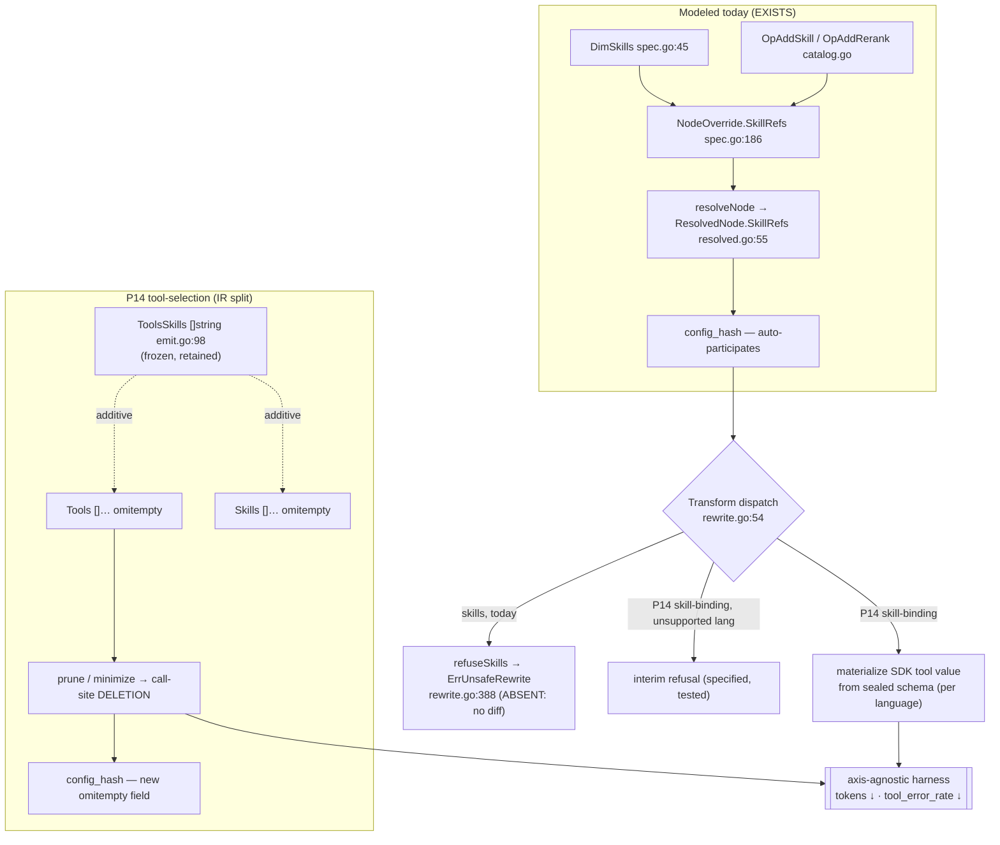

# PRD — P14: Skills & Tools Optimization (making the skill axis apply, and splitting tools from skills)

| Field | Value |
|---|---|
| Phase / Milestone | P14 / M17 |
| Target window | ~four waves: **14a** skill-binding materialization + the interim-refusal contract, **14b** the tools≠skills IR split + tool pruning / tool-set minimization, **14c** user-initiated change (`skill-tool-authoring`), then **14d** all-language coverage (`skill-tool-language-coverage`) |
| Lead role(s) | Backend + System Designer (co-leads) |
| Supporting role(s) | AI Engineer, Frontend, DevOps, QA Engineer, Product Designer, Sales Operations |
| Status | Draft |
| OpenSpec change | `p14-skills-tools-optimization` |
| Related | [P3 — Context + Skills + Sandbox](P3-context-skills-sandbox.md) · [P5.5 — Proposals + Verification](P5.5-proposals-verification.md) · [P10 — Prompt & Model Studio](P10-prompt-model-studio.md) · [ADR-001](../adr/ADR-001-source-transformation-apply-model.md) · [ADR-003](../adr/ADR-003-multi-language-apply-and-verification-strength.md) |

> **Commercial position.** The skill/tool axis is the one the diagnosis catalog leans on hardest — it
> is where `CauseToolSchemaMismatch` and `CauseRetrievalMiss` are answered — and it is also the one axis
> the codemod could not, until now, actually apply. Closing it turns "we can *propose* a skill change"
> into "we can *ship a verified* one," which is the difference between a report and a pull request.
> Available on the same plans as the rest of the optimizer (Team and above per P7); the CLI surface
> (P11) exposes it on Free like every other dimension.

> **Money-in-git rule.** No dollar amounts, percentages, or price bands appear in this document. Plans
> are referred to by **name only** — Free / Team / Business / Enterprise.

## 1. Summary

P14 makes **skills and tools a first-class, *applicable* optimization axis**. Today the skill axis is
modeled end to end — `DimSkills` is a closed-enum dimension
([`internal/variantspec/spec.go:45`](../../internal/variantspec/spec.go)), `NodeOverride.SkillRefs`
carries the override ([`spec.go:186`](../../internal/variantspec/spec.go)), the registry seals a
version-addressed skill contract (`KindSkill`,
[`internal/registry/skill.go`](../../internal/registry/skill.go)), and four operators
(`OpAddSkill`, `OpAddRerank`, `OpFixSchemaBinding`, plus the `ragTune` skill branch) generate skill
variants ([`internal/proposal/catalog.go`](../../internal/proposal/catalog.go)). The resolved value even
participates in `config_hash` (`ResolvedNode.SkillRefs`,
[`internal/variantspec/resolved.go:55`](../../internal/variantspec/resolved.go)). **The one thing the
axis cannot do is apply.** The call-site codemod *refuses*:
[`internal/transform/rewrite.go:388`](../../internal/transform/rewrite.go) `refuseSkills` returns
`ErrUnsafeRewrite`, and the tree-sitter engine shares that refusal
([`rewrite_span.go:62`](../../internal/transform/rewrite_span.go)). A skill change resolves, hashes, and
scores — and then produces no diff.

P14 also fixes a modeling defect that has to be settled before tools can be optimized at all: the IR
**conflates tools and skills into one flat slice**,
[`internal/discovery/emit.go:98`](../../internal/discovery/emit.go) `ToolsSkills []string`. A *tool* (a
provider-native function the model may call) and a *skill* (a registered platform capability with a
sealed input/output contract) are different things with different apply mechanics, and a single list
cannot express "prune this unused tool" without also meaning "unbind this platform skill."

Two capabilities deliver this. **`skill-binding`** replaces the refusal with real call-site
materialization — constructing the SDK tool value from the skill's sealed schema — and keeps the
interim refusal as a *specified, testable* behavior for every language whose rewriter has not yet
landed. **`tool-selection`** splits tools from skills in the IR as an additive, append-only change, then
specifies **tool pruning** (drop tools the eval set never exercises, to cut tokens and latency) and
**tool-set minimization**. Milestone **M17 — the skill axis ships diffs, and tools are a dimension of
their own** means a skill add/remove/rerank produces a verified change where its language is supported
and a loud refusal where it is not, and an unused tool can be pruned and *scored by the metrics the
harness already emits*.

P14 then closes the gap those waves leave, and it is the widest gap on any axis. Skill binding
materializes in **Go** and for two providers; tool pruning materializes in **Go** and nowhere else — while
discovery finds these call sites in all seven registered languages and the IR records them. A fourth
capability, **`skill-tool-language-coverage`**, makes that a stated, total table rather than an absence,
and then closes it. Two facts make the closure tractable rather than aspirational. Binding a skill is
**construction**, and the only part of it that is per language is the **spelling** — the *shape* comes from
the skill's sealed schema and is already language-independent — so the unit of coverage is the cell
**(language, provider, SDK generation)** and a new language is a set of rows, not a new source of truth.
Pruning a tool is **deletion**, and its blocker is not a rewriter at all: outside Go the frontends record
no tool split, so a prune has nothing to prune *against*. That is a **frontend** gap wearing a rewriter's
clothing, and naming it correctly is what stops the fix being scheduled in the wrong package. Both sit
under the cross-axis [`language-coverage`](P13-prompt-model-optimization.md) contract, whose ordering rule
matters most on this axis: the refusal a Python author actually hits today is that their call site passes
its arguments as an unpacked mapping — no argument to bind into, no written list to delete from — and
telling them their language is pending would be true, useless, and would leave them waiting for work that
cannot help them.

## 2. Problem & context

Four problems block the axis, and each maps to a design commitment.

- **The skill axis is fully modeled and cannot apply.** Everything upstream of the codemod is real:
  resolution, hashing, the operator catalog, the diagnosis codes that trigger it. The codemod is where
  it stops. `refuseSkills` is honest about why — *"binding skills means constructing SDK tool values …
  whose shape differs per SDK and per SDK version … a subtly-wrong tool schema is the kind of change
  that compiles and then degrades quality invisibly — the worst possible failure for an eval platform"*
  ([`rewrite.go:378-396`](../../internal/transform/rewrite.go)). That refusal is correct as a default
  and wrong as a permanent state: the axis the catalog most relies on cannot close the loop, so every
  `add_skill` / `add_rerank` candidate is proposed, ranked by its prior
  ([`gain.go`](../../internal/proposal/gain.go) — `OpAddSkill: 0.35`), and then cannot be realized.
- **Tools and skills are one slice, so neither can be optimized cleanly.** `ToolsSkills []string`
  ([`emit.go:98`](../../internal/discovery/emit.go)) is a single list carrying two different kinds of
  thing. A *skill* resolves to a sealed registry contract and is *bound* by constructing a value; a
  *tool* is already declared at the call site and is *selected* — kept or pruned — from what the model
  is offered. Folding them means the optimizer cannot say "this node offers eight tools and calls two;
  prune the other six" without the sentence also reading as "unbind six platform skills." The two
  operations have opposite apply mechanics (construct vs. delete) and must be separable in the IR before
  either is safe.
- **Removing an un-applicable override silently would be a lie.** The tempting shortcut — when a
  language cannot materialize a skill, drop the `SkillRef` and emit the rest of the diff — produces a
  change that *looks* applied and is not. A node the author asked to gain a skill would ship without it,
  its `config_hash` would still claim the skill, and the eval would score a configuration that never
  existed. The refusal must stay a **first-class, loud** outcome until the materializer for that
  language lands, never a silent drop.
- **A new "tool efficiency" metric would fork the source of truth.** Tool pruning's whole payoff is
  fewer tokens and fewer tool errors — and the harness *already* measures both (`eval_tokens_total`,
  `tool_error_rate`, [`internal/evalharness/metricnames.go:27-28`](../../internal/evalharness/metricnames.go)).
  Because eval is axis-agnostic — it consumes only `config_hash` + `Trace`, never a dimension label — a
  pruned tool set is scored with **zero eval change**. Inventing a bespoke tool-efficiency score would
  create a second definition of a saving the platform can already see, and two numbers for one question.

**Upstream state assumed.**
**P1** (discovery and the IR — the frontend that populates `ToolsSkills` today and will populate the
split fields). **P2** (the codemod, the per-dimension rewriter dispatch, and the `ErrUnsafeRewrite`
refusal contract this phase both honors and narrows — [ADR-001](../adr/ADR-001-source-transformation-apply-model.md)).
**P3** (skills modeling, the `KindSkill` registry, and the rule that P2 runs only trusted/built-in
skills while sandboxed execution of arbitrary repo tool code is P3's —
[`skill.go:20-26`](../../internal/registry/skill.go)). **P3.5** (the `ToolUse` and `RetrievalRAG`
patterns that gate which nodes a skill operator is admissible on). **P4/P4.5** (the axis-agnostic eval
harness and scoring, and `CauseToolSchemaMismatch` / `CauseRetrievalMiss`, the diagnosis codes that
drive the skill operators). **P5.5** (the proposal catalog, the operators, and the *diagnosis proposes,
verification decides* discipline this phase's changes are gated by). **P10** (the additive-`config_hash`
`omitempty` pattern from [decisions.md D-1.4](../../openspec/changes/p10-prompt-model-studio/decisions.md)
and the fail-closed "validate against a recorded set" pattern from `in_scope` / `DeclaredEnv`).

## 3. Goals & non-goals

### Goals

- **G1. A bound skill is materialized at the call site.** For each supported language, `apply` SHALL
  construct the SDK tool value for a bound skill from the skill's **sealed input/output schema**
  (`KindSkill`), replacing the refusal. The skill's contract, not a guess, is the source of the shape.
- **G2. An un-applicable skill is refused, never dropped.** A node carrying a `SkillRef` whose language
  has no landed materializer SHALL be **refused at transform** with `ErrUnsafeRewrite`, naming the node
  and the dimension. It SHALL NOT be silently removed, and no partial diff SHALL be emitted for that
  node's skill dimension.
- **G3. Skill operators are verification-gated.** `add`, `remove`, and `rerank` skill changes SHALL be
  *proposals* — realized as a diff and then **scored by the eval harness**, never applied on the
  strength of the diagnosis alone. A materialized skill that degrades the score SHALL NOT ship.
- **G4. A materialized skill validates its argument shape before it runs.** A bound skill's arguments
  SHALL be checked against the skill's compiled input contract (`SkillEntry.ValidateInput`) so a
  shape violation is caught before the node executes, not at first live call.
- **G5. Tools and skills are separate in the IR.** The IR SHALL carry **tools** and **skills** as
  distinct fields — a *tool* is a provider-native function/tool the model may call; a *skill* is a
  registered platform capability. The split SHALL be **additive and append-only**: pre-P14 IR bytes are
  unchanged, and the frozen conflated `ToolsSkills` slice is retained, never repurposed.
- **G6. The discovery frontend populates the split.** Discovery SHALL classify each discovered entry as
  a tool or a skill and populate the new fields, so the split is a fact recorded at extraction, not
  inferred later by a consumer.
- **G7. Unused tools can be pruned.** A tool a node **offers** but the eval set **never exercises** SHALL
  be a pruning candidate, expressed as a **call-site deletion** of an already-present tool, reducing the
  tokens spent declaring it and the surface for a tool error.
- **G8. Tool-set minimization is expressible.** The minimal tool set that preserves `task_success`
  SHALL be expressible as a candidate the optimizer can propose and the harness can score.
- **G9. Tool selection participates in identity additively.** A tool selection SHALL join
  `resolved_config` so that pruning a tool changes `config_hash`, while a node that prunes nothing hashes
  **byte-identically** to how it did before this field existed (the `omitempty` / nil-when-empty rule).
- **G10. No eval change; existing metrics carry the effect.** Tool pruning and tool-set minimization
  SHALL be scored by the **existing** axis-agnostic harness; their benefit SHALL surface as fewer
  `eval_tokens_total` and lower `tool_error_rate`, not as a new bespoke metric.
- **G11. Tool and skill changes respect the typed envelope.** A materialized skill or a pruned tool set
  SHALL surface tool-call failures only through the `toolcontract` typed envelope's **allowlisted error
  codes** ([`internal/toolcontract/errors.go`](../../internal/toolcontract/errors.go)), so
  `tool_error_rate` stays well-defined and a change's effect on it is measurable.
- **G12. A user can originate a skill or tool change themselves.** Binding, unbinding, reordering,
  pruning, and restoring SHALL be available as **user-initiated** changes on the shared `authored-change`
  spine (one origin more, no second pipeline), with `Origin` recorded and never hashed.
- **G13. Selection is fail-closed on both halves.** An authored skill SHALL be a **registry-sealed** entry
  with a **pinned version**; an authored tool SHALL be a member of the node's **discovered** tool set.
  Free text SHALL NOT be a binding or selection path on either.
- **G14. The language boundary is stated before the user chooses.** Where a node's language has no landed
  materializer, skills SHALL NOT be offered and the reason SHALL be stated — read from the **same**
  coverage source the transform's refusal reads, so the editor cannot offer what the codemod refuses.
- **G15. An authored change on this axis claims nothing until the harness runs.** It SHALL be applicable
  while `unverified`, with no token, cost, or error-rate saving attributed to it, and an authored
  **reorder** SHALL be presented as a real (re-hashing) change rather than a cosmetic one.
- **G16. Skill binding SHALL be materializable in every registered language, keyed per cell.** Coverage
  SHALL be stated per **(language, provider, SDK generation)**, every registered language SHALL carry an
  entry, and the **sealed schema** SHALL remain the sole source of a bound skill's shape in every language
  — only the *spelling* is per cell.
- **G17. Tool pruning SHALL be available wherever a tool declaration is locatable, in every language.**
  Every discovery frontend SHALL record the node's tools with the location of each declaration, so a prune
  is a **deletion of a written element** in any language; a tool with no locatable declaration SHALL be
  recorded as such and refused, never silently absent.
- **G18. The two refusals on this axis SHALL NOT be conflated.** *This language has no materializer* and
  *this call site cannot carry it* — unpacked arguments, a run-time-assembled tool list, an SDK that binds
  tools in an opaque body — SHALL be distinct typed causes, and the **most specific true** one SHALL be
  reported, with the language asked **last**.

### Non-goals (explicitly deferred or owned elsewhere)

- **Sandboxed execution of arbitrary repository tool code** — **[P3](P3-context-skills-sandbox.md).**
  P14 materializes bindings for **trusted/built-in** skills the registry seals (`skill.go` — *"P2 runs
  only trusted/built-in skills"*). Running untrusted repo tool implementations under isolation is P3's.
- **Cross-provider tool translation.** P14 does not rewrite a tool declared for one provider's SDK into
  another's; a provider swap at a user call site is already refused
  ([`rewrite.go:81`](../../internal/transform/rewrite.go), ADR-002) and stays so.
- **Authoring new skills in the console** — the studio surface for creating/versioning skills is
  [P10](P10-prompt-model-studio.md)'s lineage; P14 consumes sealed skill versions, it does not add an
  authoring UI.
- **A new registry `Kind` for tools.** A *tool* is discovered at the call site and *selected*, not
  resolved from a registered ref; it is not sealed into the registry and gets no `Kind` (see §8.3 D3).
- **Inventing diagnosis codes for tool bloat.** Tool pruning rides `SignalRedundantNode`-style structural
  input and the existing metrics; it does not expand the frozen P4.5 taxonomy.
- **A second cost/efficiency metric.** Fewer tokens and fewer tool errors are already first-class harness
  metrics; P14 adds none.

## 4. Users & personas

| Persona | What P14 is for them | What breaks without it |
|---|---|---|
| **AI engineer optimizing an agent** (primary) | A `CauseToolSchemaMismatch` finding turns into a *shipped* skill fix, and a bloated tool list turns into a pruned, cheaper node — both verified. | The catalog's most-used codes propose changes the codemod cannot apply; the report ends at a suggestion. |
| **Backend engineer on the transform engine** (primary) | A clear contract for what "materialize a skill" means per language, and a refusal that is *specified behavior* rather than a `TODO`. | Every language's skill rewriter is invented ad hoc, and a half-done one silently drops overrides. |
| **Platform/System designer** | A settled, one-way-door decision on tools≠skills before any consumer depends on the shape, and an additive change that cannot orphan a keyed row. | The conflated slice hardens into a contract, and splitting it later is a breaking migration. |
| **Customer reading a diff** | A skill change they can *read and merge*, and a pruned tool set with a measured token/latency win attached. | A "recommendation" with no artifact and no proof. |
| **Agent owner who already knows the answer** (primary, 14c) | They bind the reranker, drop the three tools the node never calls, and get a diff — without waiting for a signal to fire — and are told up front if this node's language cannot carry a binding. | The only way to change a skill is to wait for a diagnosis; a team that already knows what it needs has no way to say so. |
| **Reviewer of a near-miss skill proposal** (14c) | They fork the proposal, fix the ordering or swap the version, and submit it with both lineages recorded. | The candidate is discarded whole and re-proposed unchanged next cycle. |

Non-personas: **platform operators** (P8), and the end users of the customer's own agent.

## 5. User stories / jobs-to-be-done

**AI engineer**
- As an AI engineer, I want an `add_skill` proposal to produce a **diff I can merge**, so that a
  tool-schema mismatch is *fixed*, not just *named*.
- As an AI engineer, I want to **prune the tools my node never calls**, so that I stop paying tokens and
  latency to declare capabilities the model does not use.
- As an AI engineer, I want a skill change I *cannot yet apply* to **tell me so loudly**, so that I never
  merge a diff that quietly left the skill out.

**Backend engineer (transform)**
- As a transform engineer, I want "materialize a skill" defined by the skill's **sealed schema**, so that
  the SDK value I construct is the contract's shape and not my interpretation of it.
- As a transform engineer, I want the **interim refusal to be a tested requirement**, so that a language
  without a materializer fails in the one safe way rather than in an author's choice of unsafe ones.

**System designer**
- As a system designer, I want tools and skills **split additively**, so that pre-P14 IRs and their
  `config_hash`es are untouched and no keyed row orphans.
- As a system designer, I want tool selection to **participate in `config_hash` only when a tool is
  actually pruned**, so that identity changes iff the configuration changes.

**Product designer**
- As a product designer, I want the difference between "bound a platform skill" and "pruned a
  provider tool" to be **legible in the change**, so that a reviewer understands what each edit did.

**Agent owner making an active change (14c)**
- As the owner of this agent, I want to **bind the reranker myself** instead of waiting for a retrieval
  signal to fire, because I already know the node needs it.
- As the owner, I want to **prune the three tools this node never calls** and get a diff, without the
  platform first having to observe that they are unused.
- As the owner, I want to be told **before I pick anything** that this node's language cannot carry a
  skill binding — not after I have chosen and ordered four skills.
- As the owner, I want the tool list I can prune from to be **the tools that are actually there**, so a
  typo cannot produce a diff that deletes the wrong thing or nothing.
- As the owner, I want my authored prune to be labeled **unverified** rather than quoted back to me as a
  token saving I have not measured.

**Reviewer correcting a skill proposal (14c)**
- As a reviewer, I want to **fork a skill proposal, fix the order or pin a different version, and submit
  it**, so a nearly-right candidate is not discarded whole.

## 6. Functional requirements

Numbered FRs; each maps 1:1 to an OpenSpec requirement under
`openspec/changes/p14-skills-tools-optimization/specs/`.

### Skill materialization + the interim-refusal contract (capability `skill-binding`)

- **FR1.** For each **supported** language, `apply` SHALL materialize a bound skill at the call site by
  constructing the SDK tool value from the skill's **sealed input/output schema** (`KindSkill`,
  `SkillEntry`). The constructed shape SHALL be derived from the contract, not inferred from the value.
- **FR2.** A node carrying a `SkillRef` whose language has **no landed materializer** SHALL be refused at
  transform with `ErrUnsafeRewrite`, naming the node and the `skills` dimension and the reason. The
  override SHALL NOT be silently dropped, and no diff SHALL be emitted for that node's skill dimension.
- **FR3.** `add`, `remove`, and `rerank` skill operators SHALL be **verification-gated**: each produces a
  candidate Variant Spec that is realized as a diff and scored by the eval harness; a change is shipped
  only on a verified non-regression, never on the diagnosis alone.
- **FR4.** A materialized skill's arguments SHALL be validated against the skill's **compiled input
  contract** (`SkillEntry.ValidateInput`) before the node executes, so an argument-shape violation is
  caught before the implementation is invoked.
- **FR5.** A skill binding SHALL participate in `config_hash` such that **adding, removing, or reranking**
  a skill yields a new hash — skill order is identity-bearing (`ResolvedNode.SkillRefs` is not sorted) —
  while a node that binds **no** skill hashes **byte-identically** to a pre-P14 node.
- **FR6.** A materialized skill SHALL surface tool-call failures only through the `toolcontract` typed
  envelope's **allowlisted error codes**; it SHALL NOT introduce an error code outside the whitelist,
  so `tool_error_rate` remains well-defined for a bound node.

### Tools≠skills split + tool pruning / minimization (capability `tool-selection`)

- **FR7.** The IR SHALL carry **tools** and **skills** as separate, **additive** fields — `omitempty`,
  nil-when-empty, following the `DeclaredEnv` pattern ([`emit.go:39-43`](../../internal/discovery/emit.go))
  — so a pre-P14 IR serializes byte-identically and the frozen `ToolsSkills` slice is retained
  unchanged, never repurposed.
- **FR8.** The discovery frontend SHALL classify each discovered entry and **populate the split fields**:
  a *tool* is a provider-native function/tool the model may call; a *skill* is a registered platform
  capability. Classification is recorded at extraction, not inferred by a consumer.
- **FR9.** Tool pruning SHALL drop a tool a node **offers but the eval set never exercises**, expressed
  as a **call-site deletion** of an already-present tool (not a construction), reducing the tokens spent
  declaring it and the tool-error surface.
- **FR10.** Tool-set minimization SHALL be expressible as a candidate: the **minimal tool set that
  preserves `task_success`**, emitted for the harness to score against the full set.
- **FR11.** A tool selection SHALL be validated against the node's **discovered tool set**: a selection
  naming a tool the IR does not record for that node SHALL be **rejected (fail closed)**, exactly as an
  `env` binding is validated against `DeclaredEnv` and an `expr` binding against `in_scope`.
- **FR12.** A tool selection SHALL join `resolved_config` **additively** (a new `ResolvedNode` field,
  `omitempty` / nil-when-empty), so pruning a tool changes `config_hash` while a node that prunes nothing
  hashes byte-identically to how it did before the field existed.
- **FR13.** Tool pruning and minimization SHALL be **verification-gated** and scored by the **existing**
  axis-agnostic harness; their benefit SHALL surface as fewer `eval_tokens_total` and lower
  `tool_error_rate`. No new metric SHALL be introduced.
- **FR14.** A tool selection over a **dynamically-assembled** tool set (one the frontend cannot locate as
  a static, deletable declaration) SHALL be **refused at transform** with `ErrUnsafeRewrite`, not
  guessed — the same refuse-until-safe discipline as FR2.

### User-initiated change on this axis (capability `skill-tool-authoring`)

The cross-axis rules — one spine two origins, `Origin` recorded never hashed, origin-blind refusals with
**no override**, preflight's three verdicts, `unverified` never a claim and never auto-merged, named
conflicts, byte-exact reversal, append-only audit, entitlement, offline CLI parity, no new egress, and
*the user does not author the evidence* — are **FR21–FR33 of [P13](P13-prompt-model-optimization.md)**
(capability `authored-change`). They apply here in full and are **not** restated. P14 adds only what is
specific to this axis.

- **FR15.** A user SHALL be able to **bind**, **unbind**, and **reorder** a node's skills, and to **prune**
  and **restore** its tools. Each effect SHALL be expressed solely through the node's skill references or
  tool selection, so each yields a new `config_hash` through the existing fields, and a node with no
  skills and no prune SHALL still hash byte-identically to pre-P14.
- **FR16.** An authored skill binding SHALL reference a **registry-sealed** skill with a **pinned version
  identifier**. An unknown skill, or a skill without a pinned version, SHALL be refused at preflight with
  the skill and the reason named; free-text entry SHALL NOT be a binding path.
- **FR17.** On a node whose language has **no landed materializer**, skills SHALL NOT be offered as
  applicable choices, the boundary SHALL be **stated** rather than the list being silently empty, and a
  binding submitted through any surface SHALL be refused with the **same typed cause** the transform
  raises — read from the **same** per-language materializer-coverage source (NFR7), so preflight and
  transform cannot drift.
- **FR18.** Arguments supplied for an authored skill binding SHALL be validated against the **pinned**
  version's compiled input contract before the change is admissible, naming the failing field; a newer
  version's contract SHALL NOT be substituted.
- **FR19.** An authored tool selection SHALL be validated **fail-closed** against the node's **discovered**
  tool set — exactly as `env` validates against `DeclaredEnv` and `expr` against `in_scope`. A tool absent
  from that set SHALL be neither selectable nor accepted, and free-text entry SHALL NOT be a selection
  path.
- **FR20.** An authored tool selection over a **dynamically-assembled** tool set SHALL be refused at
  preflight naming the node; the deletion site SHALL NOT be inferred.
- **FR21.** Restoring every tool a user pruned on a node SHALL reproduce the pre-prune `config_hash`
  **byte-identically**.
- **FR22.** An authored skill or tool change SHALL be applicable while `unverified`, and its observed
  effect on declared-tool tokens, `tool_error_rate`, or `task_success` SHALL NOT be reported as a saving,
  improvement, or regression until the harness has run. An authored **reorder** SHALL be presented as a
  real change, never as cosmetic, because skill order is identity-bearing.

### All-language coverage on this axis (capability `skill-tool-language-coverage`)

The cross-axis rules — coverage as a **total** function over every registered language, per-cell claims,
the three typed refusal classes and their specific-first evaluation order, one coverage source read by
engine and surface and command line, executable evidence for every row, no gate weakened to reach a
language, the versioned offline table, and coverage no plan can move — are **FR41–FR51 of
[P13](P13-prompt-model-optimization.md)** (capability `language-coverage`). They apply here in full and are
**not** restated. P14 adds only what is specific to this axis.

- **FR23.** Skill-materializer coverage SHALL be keyed by **(language, provider, SDK generation)**. A
  language SHALL NOT be described as materializing skills without the providers it is true of; a covered
  language whose provider has no declared spelling SHALL refuse **naming the provider** and listing the
  providers that would have worked; and a coverage entry SHALL name the **SDK generation** its spelling
  targets, so a call site on a different generation is not claimed by it.
- **FR24.** In every language, a materialized skill's argument shape SHALL be derived from the **pinned**
  version's sealed input schema. No language's materializer SHALL infer the shape from the surrounding
  call site, from another tool present at it, or from any registry entry other than the pin. A sealed
  schema with no argument shape SHALL refuse in **every** language, classified as a fact about the
  contract rather than about the language.
- **FR25.** Materializing a bound skill and pruning a declared tool SHALL each locate the tool list by
  **binding site** — an argument at the call site, a **builder-chain call**, or a **field of a request
  value** built before the call (the P13 FR52 generalization). A language whose SDKs bind tools on a
  builder SHALL NOT be refused for lacking a tools argument; an SDK that carries its tools inside an
  opaque serialized body SHALL refuse **naming the SDK**, classified as a fact about that SDK.
- **FR26.** **Every** discovery frontend SHALL classify a node's discovered entries into tools and skills
  and record, per tool, the call-site identifier and the **location of its declaration**. A tool the
  frontend cannot locate as a written declaration SHALL be recorded as *having no location*, so a prune
  against it refuses rather than deleting nothing; it SHALL NOT be silently absent from the node's set.
- **FR27.** Tool pruning SHALL be expressible in **every** language whose frontend records the split, as
  the deletion of an already-written element: it SHALL construct nothing, SHALL NOT change the file's line
  count, and its result SHALL parse.
- **FR28.** Skill-binding coverage and tool-pruning coverage SHALL be published as **two** tables. A claim
  about one SHALL NOT be presented as a claim about the other — a language MAY prune before it can bind,
  and MAY bind for one provider while pruning for all.
- **FR29.** For a refused skill or tool change, the reported cause SHALL be the **most specific true** one,
  evaluated in the order: the skill contract → the provider and SDK form → the registry row's locator →
  the call site's own source → the language. A call site with unpacked arguments or a run-time-assembled
  tool set SHALL be told **that**, and SHALL be told that a materializer would not change the outcome; an
  unknown or unpinned skill SHALL refuse identically in every language, ahead of every language question.
- **FR30.** An authoring surface SHALL decide whether to offer a skill binding from the same
  **(language, provider, SDK generation)** coverage the transform refuses from, and whether to offer a
  prune from the same **recorded tool set** the transform deletes from. Free-text entry SHALL NOT be a
  path on either.
- **FR31.** Adding a language, a provider spelling, an SDK generation, or a frontend's tool split SHALL
  leave every previously materializable binding and prune **byte-identical**, every previously refused case
  either still refused or covered by its own new entry, and every `config_hash` unchanged — a node that
  binds no skill and prunes no tool SHALL still hash byte-identically to pre-P14.

## 7. Non-functional requirements

| # | Requirement | Target |
|---|---|---|
| **NFR1** | **Reproducibility of a frozen contract** | A config that binds no skill and prunes no tool produces a `config_hash` **byte-identical** to pre-P14; asserted by the P0 golden vectors continuing to reproduce, machine-enforced not reviewed. |
| **NFR2** | **Interim-refusal is testable** | The refusal for an un-applicable skill (FR2) and a dynamic tool set (FR14) each has a test that fails if the override is silently dropped or a partial diff is emitted. A "go-red" gate. |
| **NFR3** | **No silent quality regression** | A materialized skill whose constructed tool value is subtly wrong is caught by verification (FR3) — the diff does not ship on the strength of the diagnosis; a regression fails the gate. |
| **NFR4** | **Determinism** | Same IR + same spec + same registry → byte-identical materialized diff and identical `config_hash`; skill order and tool-selection set both canonicalize deterministically. |
| **NFR5** | **Error-taxonomy containment** | No tool/skill change path emits a `tool_error_rate`-bearing error outside the `toolcontract` `ErrorCodeWhitelist`; asserted, not reviewed. |
| **NFR6** | **Additive-only IR evolution** | The split fields (FR7) and the tool-selection resolved field (FR12) leave every pre-existing serialization byte-identical; a consumer pinned below the new IR minor still parses both. |
| **NFR7** | **Multi-language honesty** | Per-language materializer coverage is a documented fact (which languages materialize, which refuse), so a refusal a user reads and the capability a doc claims cannot drift — the single-source-of-truth discipline the `argumentForm` table already enforces ([`rewrite_span.go`](../../internal/transform/rewrite_span.go)). |
| **NFR8** | **One coverage source, read by preflight and transform** | The authoring surface's "can this node carry a skill?" answer and the transform's refusal are derived from the **same** coverage table (NFR7), asserted by a test that fails in both directions. A second list would let the editor offer what the codemod refuses. |
| **NFR9** | **Selection is fail-closed, asserted over the whole set** | No authoring path accepts a skill outside the sealed registry or a tool outside the node's discovered set. The assertion is over the enumerated selection surface, not a sample — a whitelist-style check protects only what it lists. |
| **NFR10** | **Authoring adds no dimension, `Kind`, or metric** | `skill-tool-authoring` introduces no new `Dimension`, registry `Kind`, table, oracle, or metric beyond 14a/14b's; it is a second origin on existing fields, and `Origin` is not hashed. |
| **NFR11** | **Coverage is total on both mechanics** | Binding coverage and pruning coverage each carry an entry for every registered language; a generated test over the registered language set fails on a missing cell. Two tables, both total — because a language that can prune and cannot bind is the normal case here, not an anomaly. |
| **NFR12** | **The two refusals are provably distinct** | A test asserts that a call site with unpacked arguments or a run-time-assembled tool set reports **that** cause in a language with no materializer, and that the same call site refuses identically once the materializer lands. The test goes red if the language cause is reported first. |
| **NFR13** | **A spelling row is a compile claim** | Each `(language, provider, SDK generation)` row is admitted only with a test that emits the tool value in that cell and a build gate that proves it compiles against the named generation. A wrong spelling must fail loudly at build, never quietly at run time — this is the one axis where the whole refusal existed because a wrong shape *compiles*. |

## 8. System design summary

### 8.1 The axis, and the two mechanics



**The load-bearing asymmetry:** binding a skill is **construction** (build an SDK tool value from a
schema — codegen, the hard part that refuses until a language's rewriter lands); pruning a tool is
**deletion** (remove an already-present element from a static tool array — byte-safe today). That is why
`tool-selection` lands *applicable* in P14 while `skill-binding` lands *partial*, and why the interim
refusal is a permanent-until-superseded requirement rather than a temporary embarrassment.

### 8.2 What is EXISTS / PARTIAL / ABSENT (honest status)

| Surface | Status | Evidence |
|---|---|---|
| Skill dimension, override, resolution, hashing | **EXISTS** | `spec.go:45,186`, `resolve.go` skill branch, `resolved.go:55` |
| Skill registry, sealed contract, arg validation | **EXISTS** | `registry/skill.go` (`KindSkill`, `ValidateInput`) |
| Skill operators + priors | **EXISTS** | `catalog.go` (`addSkillOp`/`addRerankOp`/`ragTuneOp`), `gain.go` |
| **Skill call-site materialization** | **ABSENT** | `rewrite.go:388` `refuseSkills`, `rewrite_span.go:62` |
| **Skill remove operator** | **ABSENT** | catalog has add/rerank/swap; no explicit remove |
| **Tools≠skills IR split** | **ABSENT** | `emit.go:98` `ToolsSkills []string` (conflated) |
| **Tool-selection dimension + pruning** | **ABSENT** | no `DimTools`, no tool `NodeOverride` field, no pruning operator |
| Axis-agnostic eval / tool metrics | **EXISTS** (reused) | `metricnames.go:27-28`, `evaluator.go` |
| `toolcontract` typed envelope | **EXISTS** (reused) | `toolcontract/errors.go`, `response.go` |
| **User-initiated change on this axis** | **ABSENT** | every skill/tool change originates in the catalog; no authoring path, no `Origin`, no preflight |
| **Skill materialization outside Go** | **ABSENT** | `rewrite_span.go:73` — the tree-sitter engines dispatch `DimSkills` straight to `refuseSkills` |
| **Skill spellings beyond two providers** | **PARTIAL** | `toolValueForms` (`skillbind.go:94`) carries `anthropic` and `openai`; every other provider refuses by name |
| **Tool split in a non-Go frontend** | **ABSENT** | the syntactic frontends record no tool split, so `spanRewriteTools` has nothing to prune against (`rewritetools.go:169`) |
| **Coverage stated as a total table** | **ABSENT** | `MaterializerCoverage()` reports only the covered cells; a language with no materializer has no row at all |

### 8.3 Decisions, with what was rejected

| # | Decision | Rejected alternative | Why (八级法则) |
|---|---|---|---|
| **D1** | **Materialize from the sealed schema; verification decides.** A bound skill's SDK tool value is constructed from `KindSkill`'s compiled input/output schema, and the resulting diff is scored, not trusted. | Emit a best-effort tool value and let it ride into the merged change. | **L1 安全 + strategy.** A subtly-wrong tool schema *compiles and then degrades quality invisibly* (`rewrite.go` says this in as many words) — the worst failure for an eval platform. Construction without a verification gate trades L1 correctness for L8 implementation convenience, which the ordering forbids. |
| **D2** | **The interim refusal is a specified, tested behavior.** An un-applicable `SkillRef` refuses loudly with `ErrUnsafeRewrite`; nothing is dropped. | When a language can't materialize, strip the `SkillRef` and emit the rest of the diff. | **L1/L2.** A silent drop ships a node the author asked to gain a skill *without* it, while its `config_hash` still claims the skill and the eval scores a configuration that never existed. Fail-loud is the only direction that cannot mislead a merge. |
| **D3** | **tools≠skills is an *additive* split; `ToolsSkills` is frozen and retained.** New `Tools`/`Skills` fields are `omitempty`, nil-when-empty; the conflated slice is never repurposed. | Rename/repurpose `ToolsSkills`, or fold tools into `DimSkills`. | **L5 不可演进 + L2.** `ToolsSkills` is part of the frozen IR bytes and keyed rows depend on it; repurposing breaks the golden vectors and orphans `config_hash`-keyed rows. Folding tools into `DimSkills` overloads one dimension with two contracts, letting a tool prune masquerade as a skill change in the hash — a single-source-of-truth violation. |
| **D4** | **A new `DimTools` dimension, but no new registry `Kind`.** Tool selection is a distinct dimension; a tool is *selected* against the discovered set, not *resolved* from a registered ref. | Give tools a registry `Kind` like skills. | **L6 不可扩展 + single-source.** A tool is declared at the call site and offered to the model; sealing it into the registry would invent a version-addressed identity for something that is already identified by the call site, and force every discovered tool through a registration path it does not need. Validating a selection against the IR's discovered set (fail-closed) is the `DeclaredEnv`/`in_scope` pattern, already proven. |
| **D5** | **Tool selection joins `config_hash` additively (nil-when-empty).** A node that prunes nothing emits no field and hashes byte-identically to pre-P14. | Always-present `[]`/`{}` like the sibling fields. | **L2/L5.** The sibling fields' emptiness predates the golden and is *part of* the frozen bytes; a new field's **absence** is what must be byte-compatible, achieved by omission. This is decisions.md **D-1.4** applied to a second field. |
| **D6** | **No new metric; existing tokens/tool-error metrics carry the effect.** Pruning is scored by the axis-agnostic harness. | Add a bespoke tool-efficiency score. | **L5 不可演进 + L7 维护.** The harness already emits `eval_tokens_total` and `tool_error_rate`; a second metric is a second definition of a saving the platform can already see. Eval consumes only `config_hash`+`Trace`, so a pruned set needs **zero** eval change to be scored. |
| **D7** | **Tool/skill changes respect the `toolcontract` envelope.** Failures surface only through the allowlisted `ErrorCode` set. | Let a materialized skill or pruned tool raise raw provider errors. | **L1 安全 + L2 稳定.** An out-of-whitelist error code makes `tool_error_rate` ill-defined (the very metric that proves a prune helped) and can leak a raw provider error string into a trace the platform renders. The typed envelope is the runtime error taxonomy the axis is measured against. |

| **D8** | **Authoring on this axis is fail-closed selection, and its language refusal moves to preflight** | Let the user type a skill or tool identifier and resolve it later; surface the language refusal at submit | **L1/L2 + L3.** A tool the frontend did not locate is not a tool the codemod can delete — the diff removes nothing or the wrong span, silently. An **unpinned** skill is worse: the SDK value's shape becomes whatever the registry holds at apply time, which is exactly the "compiles and then degrades quality invisibly" failure `refuseSkills` exists to prevent. And a node's **language** is known before the user opens the picker, so offering a full catalog and refusing after they have chosen is the interaction-simplicity failure in its purest form — preflight reads the *same* coverage table the transform reads, so the two cannot disagree. |
| **D9** | **Coverage is two total tables keyed per cell, and the tool split becomes a frontend obligation** | (a) "Go first, other languages later" as a standing posture (D-14.4's endpoint); (b) one table covering both mechanics; (c) reach the other languages by having the span pruner infer which list element is which | **L6 extensibility + L3 + L1.** (a) was the right *interim* decision and the wrong *terminal* one: discovery finds these call sites in all seven languages, so "no row" describes our backlog, not the customer's code — and it renders as "not applicable" on every surface. (b) collapses two mechanics with opposite blockers: binding needs a per-provider **spelling**, pruning needs a per-frontend **tool split**, and a language that can prune while it cannot bind is the *normal* case — one table would force a false single answer. (c) is the level-jump the ordering forbids: inferring which unnamed span is which tool trades L1 correctness for L8 convenience, and a prune that deletes the wrong element produces a diff that parses. The frontend recording each tool's declaration site is more work in the right package; the alternative is a guess in the wrong one. |

### 8.4 Data model additions

```
// IR (additive; DeclaredEnv omitempty pattern — emit.go:39-43). ToolsSkills retained, frozen.
IRNode.Tools   []IRTool  `json:"tools,omitempty"`   // provider-native functions the model may call
IRNode.Skills  []string  `json:"skills,omitempty"`  // registered platform-capability names/refs
IRTool         = { name, // the tool's call-site identifier (for pruning selection)
                   declared_at /*locator or nil if dynamic → FR14 refusal*/ }

// Dimension enum grows by one (closed, tiny → still tiny):  DimTools = "tools"
NodeOverride.ToolSelection  *ToolSelection  `json:"tool_selection,omitempty"`  // prune/keep set
ToolSelection = { keep []string }   // validated against IRNode.Tools (fail closed — FR11)

// resolved_config (additive; nil-when-empty like Bindings — decisions.md D-1.4):
ResolvedNode.ToolSelection  *ResolvedToolSelection  `json:"tool_selection,omitempty"`
```

No new store and no new registry `Kind`. `SkillRefs` on `ResolvedNode` is unchanged — skill-binding
adds *apply* mechanics, not a new resolved field.

### 8.5 The add-an-axis surface (the implementation checklist P14 fills)

Referencing the canonical "add an axis" checklist for the `tools` dimension, and the transform-only work
for `skills`:
1. `spec.go:42` — add `DimTools`.
2. `spec.go:183` — add `NodeOverride.ToolSelection` (+ `isEmpty`/`Refs`/`Validate`).
3. `resolve.go:67,154` — `Dimensions()` entry + a `resolveNode` tool block (validate-against-discovered).
4. `resolved.go:46` — add `ResolvedNode.ToolSelection` (auto-hashed, `omitempty`).
5. **No new `Kind`** (D4) — tools are not registered.
6. `emit.go:92` + `extract.go` — split fields + the discovery frontend that populates them (FR8).
7. `rewrite.go:54` + `rewrite_span.go:59` — **the hard part, two directions**: replace `refuseSkills`
   with per-language skill materialization (construction); add a tool rewriter that **deletes** a pruned
   tool and **refuses** a dynamic one (FR9, FR14).
8. `operator.go:34` + `catalog.go:18` + `gain.go` — an `OpToolPrune` (and remove-skill) row + priors.

## 9. Design by role lens

**Backend (co-lead) — *the whole phase is the codemod boundary, in two directions.***
Everything upstream of `rewrite.go` already works; the substance is the two rewriters. **Skill
materialization is construction** — take `SkillEntry`'s compiled input schema and build the SDK's tool
value (`[]anthropic.ToolParam{{Name, InputSchema}}` and its per-SDK equivalents). This is exactly what
`refuseSkills` declined to guess, and the discipline that makes it safe is that the shape comes from the
**sealed schema** (so the version_id that pinned the skill pinned the shape) and the resulting diff is
**verified**, never trusted (D1). **Tool pruning is deletion** — the opposite mechanic, and a much
easier one: a pruned tool is an already-present element of a static tool array, and removing it is a
byte-safe span edit. That asymmetry is why the two capabilities land at different maturities in the same
phase, and it is worth stating plainly rather than pretending skills are as ready as tools. The refusal
stays a first-class output in both directions: an un-applicable skill (no materializer for the language)
and an un-locatable tool set (assembled dynamically) each **refuse with `ErrUnsafeRewrite`**, because a
codemod that guesses past its own boundary produces a diff that parses, passes a syntax-checked gate,
and silently does the wrong thing — the failure mode ADR-001 names as having no downstream net.

**System Designer (co-lead) — *split the slice before anyone depends on the conflation.***
The one-way door is `ToolsSkills`. It is a single list carrying two kinds of thing, and the moment a
consumer treats "the third element" as a stable identity, splitting it becomes a breaking migration.
P14 splits it **additively**: new `Tools`/`Skills` fields, `omitempty` and nil-when-empty, with the
frozen slice retained and *never repurposed* (D3). This is the expand-contract rule the registry and IR
already live by — a new optional field must leave old serializations byte-identical — and it is why a
pre-P14 IR and its `config_hash` are untouched (NFR1, NFR6). The second structural choice is that a
**tool is not a registry `Kind`** (D4): it is identified by its call site and *selected* against the
discovered set, so a tool selection is validated the way `env` is validated against `DeclaredEnv` and
`expr` against `in_scope` — fail closed, so a selection naming a tool the IR does not record is rejected
rather than applied to nothing. And tool selection joins `config_hash` by **omission when empty** (D5),
the same D-1.4 detail that keeps a no-binding node byte-compatible: the field's *absence* is what must be
byte-stable, and absence is achieved by omitting the key, not by an empty object.

**AI Engineer (support) — *the catalog's most-relied-on codes finally close the loop.***
`CauseToolSchemaMismatch` drives `add_skill` and `fix_schema_binding`; `CauseRetrievalMiss` drives
`rag_tune` and `add_rerank`. All four are skill operators, and until P14 they proposed changes the
codemod refused — the axis the diagnosis leans on hardest was the one that could not ship. Verification
discipline is unchanged and load-bearing: a materialized skill is a **proposal**, scored by the same
multi-seed harness with intervals and the tie rule, and a binding that degrades the score does not ship
(D1, FR3). Tool pruning is where the axis-agnostic harness earns its keep: because the harness reads only
`config_hash` + `Trace`, a pruned tool set is scored with **zero eval change**, and the win shows up as
fewer `eval_tokens_total` and a lower `tool_error_rate` — the metrics already there. A "tool efficiency"
metric would be a second place for that truth to live and a second place for it to be wrong (D6).

**Product Designer (support) — *a reviewer must see which kind of edit each change is.***
The tools≠skills split is not only an IR cleanup; it is what lets the change surface say, in words a
reviewer trusts, "this edit **bound a platform skill**" versus "this edit **pruned a provider tool the
model never called**." Those are different acts with different risk, and collapsing them into one list
collapses them in the diff too. The interim refusal is also a designed surface: when a skill change
cannot apply for a language, the user sees a **named refusal** ("node X, dimension skills: no
materializer for <language> yet") rather than a diff that looks complete and is not — the same
"tell the user where to look" discipline P10 applied to binding failures. The unhappy path is a
first-class part of the interaction, not an error swallowed to keep the output tidy.

**QA Engineer (support) — *the two guarantees here cannot be read from a passing diff.***
The refusal is a **go-red gate**: there is a test that a node carrying an un-applicable `SkillRef`
produces `ErrUnsafeRewrite` and that its skill dimension emits **no** edit — and if that test cannot be
made to fail by silently dropping the ref, the guarantee is decoration (NFR2). Materialization is gated
by **verification, not by compilation**: a test that a subtly-wrong tool value is caught by the score,
not merely by the build, is what makes "verification decides" real (NFR3). The additive-hash guarantee
is the P0 golden vectors continuing to reproduce for a no-skill/no-prune config (NFR1). Error-taxonomy
containment is asserted, not reviewed: no tool/skill path emits an `ErrorCode` outside the whitelist, so
`tool_error_rate` — the number that proves a prune helped — stays well-defined (NFR5). And determinism
covers both new shapes: skill order and tool-selection set each canonicalize to byte-identical output
(NFR4).

### 9.1 Wave 14c — user-initiated change, by role lens

**System Designer — *the second origin buys no second gate, and no second coverage list.***
14c consumes P13's `authored-change` contract whole; the only architectural work here is refusing two
shortcuts. The first is free-text selection, rejected because a skill or tool identifier the platform
cannot resolve to a sealed contract or a discovered call-site element is not a change — it is a guess
about the customer's source, and the resulting diff deletes nothing or the wrong span. The second is a
second answer to "which languages can carry a skill?": preflight and the transform read the **same**
materializer-coverage table (NFR7/NFR8), because the moment the editor has its own list, it will offer
what the codemod refuses, and the user will find out after choosing.

**Backend — *validate against the pin, not the newest.***
Three edges. **Pinned-version validation**: authored arguments are checked against the *bound* version's
compiled contract, never the registry's current head — a binding that validates against a newer, laxer
contract is a shape error waiting for the first live call. **Fail-closed membership**: the tool selection
validates against `IRNode.Tools` exactly as `env` validates against `DeclaredEnv`; the unlocatable
(dynamically-assembled) case refuses by name rather than inferring a deletion site. **Hash honesty**: an
authored reorder must actually re-hash, and restoring every pruned tool must return the byte-identical
pre-prune hash — both asserted, because "roughly the same configuration" is how a revert becomes a third
configuration.

**Frontend — *state the boundary; never show an empty picker.***
The single highest-value UI decision in 14c is what a node with no materializer looks like. An empty skill
list reads as "this node has no skills available" — a fact about the catalog — when the truth is "this
language cannot carry one yet" — a fact about the platform. So the boundary is **stated**, with the
language named. Beyond that: no free-text entry anywhere on the binding or selection path; three preflight
verdicts render as three states; an authored reorder is presented as a real change because it re-hashes;
and the configure surface loses no capability it already had, proven by a parity test rather than a look.

**AI Engineer — *authoring is a different origin, not a different judge.***
An authored bind, unbind, reorder, or prune enters the same candidate structures with `Origin: user` and
is scored by the same axis-agnostic harness from `config_hash` + trace. No authoring-specific verdict, no
authoring-specific metric. The temptation unique to this axis is to attribute the *obvious* token
reduction of a prune immediately — the declared-tool tokens visibly drop — but until the harness runs,
`task_success` is unmeasured, and a prune that quietly removed a tool the model needed under rare inputs
is exactly the failure a token count cannot see.

**QA Engineer — *five refusals, each proven red.***
No-materializer, unknown-or-unpinned skill, invalid arguments against the pinned contract,
tool-outside-discovered-set, and dynamic tool set: five classes, each with a test that has been *seen*
fail. Two more that cannot be read from code: that no flag, role, or plan forces a binding on an
unsupported language, and that restoring every prune returns the byte-identical prior hash. And the
downstream rule applies with force here — after an authored bind, read back the emitted diff, the
append-only record, **and the resolved skill order**, because order is identity-bearing and a handler that
returns 2xx having silently sorted the list is a defect no status code reveals.

**DevOps — *offline parity on an axis whose answer depends on the repository.***
The CLI must reach the same verdict offline, which is straightforward for the registry checks and subtle
for the coverage check: the materializer-coverage table has to be available locally, or the offline
refusal text will differ from the hosted one. Same table, same cause string, asserted by comparison rather
than by inspection. Authoring adds no egress — the discovered tool set and the skill registry are already
inside the boundary, and preflight must not become the first path that ships a call-site fact outward.

**Product Designer — *"you can't" and "not here, not yet" are different sentences.***
Two refusals dominate this axis, and both need wording that gives the user somewhere to go. A language
with no materializer is *not yet*, and the honest sentence names the language and says the binding will
apply when its rewriter lands — not a greyed-out control with no explanation. A tool that is not in the
discovered set is *not there*, and the sentence should point at what discovery did find. The vocabulary
rule from P13 applies unchanged: an authored prune is **applied**, never *optimized* or *cheaper*.

**Sales Operations — *the honest version of "you control it".***
Deliverable: users bind, unbind, reorder, prune and restore themselves, through the same gates the
platform applies to its own proposals, with an append-only record and an exact undo. Always paired:
**unverified until the harness runs** — 🚫 never quote an authored prune as a token or cost saving.
Refused out loud, because a prospect will assume otherwise: authoring does **not** unlock a language whose
materializer has not landed (the coverage table is the answer, per plan or per prospect makes no
difference), and there is **no override** for a refusal at any tier.

### 9.2 Wave 14d — all-language coverage, by role lens

**Backend (co-lead) — *two mechanics, two blockers, two pieces of work that are not the same work.***
The sentence "skills and tools are Go-only" is true and hides the only thing worth knowing: the two halves
are blocked by different packages. **Binding** is blocked in `internal/transform` on a missing
**spelling** — this language's SDK for this provider, at this generation — and nothing else, because the
*shape* already comes from the sealed schema and is language-independent. Adding TypeScript's anthropic
spelling is a row; it is not a second source of truth about what a bound skill means. **Pruning** is
blocked in `internal/discovery`: `spanRewriteTools` refuses not because deletion is hard at the syntactic
floor — it is the easiest edit in the engine — but because the frontends record no tool split, so there is
nothing to prune *against*. Recording each tool's identifier and declaration location in every frontend is
the fix, and it is more work in the right package. The wrong fix, which must be refused explicitly, is to
let the span pruner infer which unnamed element is which tool: a prune that deletes the wrong element
produces a diff that parses, and that is the failure class with no downstream net.

**System Designer (co-lead) — *keep the two tables apart, and make both total.***
It is tempting to publish one "P14 coverage" table. It would be wrong, and predictably so: a language will
routinely be able to prune while it cannot bind, because pruning needs a frontend field and binding needs
a provider spelling. One table forces a single answer to two questions and will be resolved, in practice,
toward the pessimistic one — so a customer whose real need is a prune gets told the axis does not apply.
Two tables, both **total** over the registered language set, both keyed per cell — binding by
(language, provider, SDK generation), pruning by (language, frontend split) — and neither read as implying
the other. The additive discipline is unchanged from 14b: adding a cell must leave every existing binding
and prune byte-identical and every `config_hash` untouched, including the pre-P14 no-skill/no-prune node.

**AI Engineer (support) — *the sealed schema is what keeps seven languages from becoming seven contracts.***
The reason this axis can go multi-language without multiplying risk is that the risky part is already
centralized: the argument contract comes from the pinned version's sealed schema, so a TypeScript binding
and a Go binding of the same skill offer the model the same tool. What each language supplies is only how
its SDK spells that tool. Parity is asserted over a shared fixture rather than trusted — if two languages'
materializations disagree about the contract, the platform has begun comparing two configurations while
calling them one, and every downstream number quietly stops meaning what it says.

**Frontend (support) — *the user needs to know whose problem it is.***
Three sentences, three different next steps, and on this axis they land on the same page: *your call site
assembles its tools at run time* (their move — and it will still be true after we ship the rewriter),
*this provider has no declared spelling in this language* (ours, with the cell named), and *this SDK carries
its tools inside an opaque body* (nobody's — the honest dead end). The failure to avoid is the one this
capability exists to fix: rendering all three as one greyed control labeled "not supported in your
language", which sends the first user to wait for us and the second to file a bug about a language we
already cover.

**QA Engineer (support) — *the ordering test and the compile test are the two that matter.***
The ordering test needs a fixture that is *both* shape-refusable and language-refusable and must go **red**
when the checks are reversed — that is the whole of NFR12, and without the red run it is decoration.
The compile test is this axis's own: a spelling row is a claim that these bytes compile against a named SDK
generation, and only a build proves it. Beyond those: totality generated over the registered language set
on **both** tables; a prune in a syntactic language asserted to change **no line count** and to reparse;
and the downstream read-back — after a binding in a newly covered language, read the emitted diff, the
reparse, and the recorded cell, because a green suite is compatible with a materializer that emitted
nothing.

**DevOps (support) — *the offline table now carries two tables and a version.***
The CLI answers "can this node bind a skill?" and "can this node prune?" with no network, which means both
tables travel and both can go stale. Versioned, named in the refusal, and compared against the hosted
cause text rather than inspected — otherwise the first support ticket of the quarter is "the CLI refuses
what the console offers" with no way to tell which side is old.

**Product Designer (support) — *"not yet" belongs to us; "not there" belongs to the source.***
Two wordings, and this axis needs both more than any other. A missing spelling is *not yet applied by the
platform*, and the sentence names the provider and the language, because the reader's legitimate next
question is "when". A run-time-assembled tool set is *not there*, and the sentence points at what discovery
did find, because there is no "when" — waiting will not help. Borrowing "not yet" for the second case is
the cruelest available error: it costs the reader a quarter.

**Sales Operations (support) — *sell the cell, never the language.***
Deliverable: skill binding and tool pruning are stated per cell, per language, with the refusal's reason
attached. Always paired: **"Go is supported" is not "every Go call site is supported"** — a prospect whose
provider has no declared spelling, or whose nodes assemble tools at run time, will hit a refusal on day
one, and a coverage claim quoted at language granularity is how that becomes a credibility problem instead
of a scoping conversation. Refused out loud: coverage is identical on every plan, and no tier unlocks a
cell the engine refuses.

## 10. Dependencies

**Requires**
- **P1** — the discovery frontend and the IR that carries `ToolsSkills` today and the split fields after.
- **P2** — the codemod, the per-dimension rewriter dispatch, and the `ErrUnsafeRewrite` contract
  (ADR-001, ADR-003).
- **P3** — skills modeling and the `KindSkill` registry; the trusted/built-in boundary (untrusted repo
  tool execution stays P3's).
- **P3.5** — the `ToolUse` / `RetrievalRAG` patterns gating skill-operator admissibility.
- **P4 / P4.5** — the axis-agnostic harness and the diagnosis codes the skill operators answer.
- **P5.5** — the proposal catalog, the operators, and the verification gate.
- **P10** — the additive-`config_hash` `omitempty` pattern and the fail-closed validation pattern.

**Unblocks**
- **The optimizer's skill axis produces diffs** — `add_skill` / `add_rerank` / `fix_schema_binding` /
  `rag_tune` stop ending at a proposal.
- **Tool-level cost/latency optimization** — pruning and minimization become scoreable changes.
- **A cleaner substrate for future tool work** — with tools and skills separated, per-tool policy
  (ordering, choice) can be added additively without another split.

## 11. Risks & mitigations

| Risk | Owner | Mitigation |
|---|---|---|
| A materialized tool schema is subtly wrong and degrades quality invisibly | Backend + AI Eng | Shape comes from the **sealed** schema, not a guess (D1, FR1); the diff is **verified**, not trusted (FR3, NFR3); args validated against the compiled contract before execution (FR4). |
| A language without a materializer silently drops the skill | Backend + QA | Refusal is a **specified, tested** behavior: `ErrUnsafeRewrite`, no partial diff, a go-red test (FR2, NFR2). |
| Splitting `ToolsSkills` breaks a pre-P14 `config_hash` or orphans a keyed row | System Designer | Additive fields only, `omitempty` nil-when-empty, frozen slice retained (D3, D5, FR7, FR12); golden vectors reproduce (NFR1, NFR6). |
| A tool selection names a tool the node does not offer and applies to nothing | System Designer | Validate against the **discovered** set, fail closed — the `DeclaredEnv`/`in_scope` pattern (D4, FR11). |
| Pruning a tool over a dynamically-built list produces a bad edit | Backend | Refuse a dynamic tool set with `ErrUnsafeRewrite` rather than guess (FR14). |
| A new tool metric forks the definition of a saving | AI Eng | No new metric; scored by the axis-agnostic harness via existing tokens/tool-error metrics (D6, FR13). |
| A tool/skill change leaks a raw provider error and breaks `tool_error_rate` | Backend | Failures surface only through the `toolcontract` allowlisted codes (D7, FR6, NFR5). |
| The capability doc and the actual per-language coverage drift | Backend + Product | Per-language materializer coverage is written down once (NFR7), the `argumentForm` single-source-of-truth discipline. |
| A user types a skill or tool name and the codemod deletes the wrong span, or nothing | Backend + System Designer | D8/FR16/FR19 — fail-closed selection: sealed registry + **pinned** version for skills, the node's **discovered** set for tools; free text is not a path (NFR9). |
| The editor offers a skill on a node the codemod will refuse | Frontend + Backend | D8/FR17/NFR8 — preflight reads the **same** coverage table as the transform; a test fails in both directions. |
| An authored binding validates against the registry head instead of its pin | Backend | FR18 — validation follows the **pinned** version's compiled contract; a newer, laxer contract is never substituted. |
| An authored prune is quoted as a token saving before the harness ran | Product Designer + Sales Ops | FR22 — `unverified` attributes no token, cost, or error-rate saving; declared-token reduction is visible but is not a result. |
| An authored reorder is treated as cosmetic and not re-scored | Frontend + AI Eng | FR15/FR22 — skill order is identity-bearing; a reorder re-hashes and is presented as a real change. |
| A user forces a binding on an unsupported language via a plan or flag | System Designer + QA | The shared origin-blind refusal rule (P13 FR23) — no override exists at any tier; asserted over the enumerated refusal set. |
| A user whose call site assembles tools at run time is told to wait for a language rewriter | Backend + Product Designer | FR29/NFR12 — the call-site cause is reported first, states that a materializer would not change it, and the ordering test goes red when reversed. |
| A new language's tool-value spelling is guessed and compiles against the wrong SDK generation | Backend + QA | FR23/NFR13 — the row names the generation and is admitted only with a build gate proving those bytes compile against it. |
| A span pruner infers which unnamed element is which tool and deletes the wrong one | Backend + System Designer | D9/FR26 — the **frontend** records each tool's declaration location; a tool with none is recorded as unlocatable and refused, never inferred. |
| One coverage claim is published for two mechanics, and pruning is written off with binding | System Designer + Sales Ops | FR28/NFR11 — two total tables, neither read as implying the other. |
| Two languages materialize the same skill into different contracts | AI Engineer | FR24 — the pinned sealed schema is the sole source of shape in every language; parity asserted over a shared fixture. |
| Adding a language moves an existing diff or hash | Backend + QA | FR31 — previously materializable bindings and prunes stay byte-identical; the no-skill/no-prune node still hashes as pre-P14; golden vectors reproduce. |

### 11.1 What each language needs, today

Read from the engine's own tables; the published copy is gated against them (NFR11, and the existing
[`docs/decisions/p14-materializer-coverage.md`](../decisions/p14-materializer-coverage.md)).

| Language | Skill binding — missing artifact | Tool pruning — missing artifact |
|---|---|---|
| **go** | none for `anthropic` / `openai`; every other provider needs a spelling row | none, where the tool list is written as a static list |
| **python** | a `(python, provider, SDK generation)` spelling row per provider | the frontend's tool split with a declaration location |
| **typescript** | a spelling row per provider | the frontend's tool split with a declaration location |
| **javascript** | a spelling row per provider | the frontend's tool split with a declaration location |
| **kotlin** | a spelling row **plus** a builder-chain binding site (P13 FR52), since these SDKs bind tools on a builder | the frontend's tool split, located at the builder call |
| **java** | a spelling row **plus** a builder-chain binding site | the frontend's tool split, located at the builder call |
| **rust** | a spelling row **plus** a request-value field binding site | the frontend's tool split, located at the request field |

Two rows in that table are **not** platform gaps and must not be counted as ones: an SDK that carries its
tools inside an opaque serialized body has no tool value to construct or delete in any language, and a
call site that assembles its tool set at run time has no declaration to point at. Both refuse under
`call-site-cannot-carry-it` and stay refused after every row above has landed.

## 12. Rollout & test strategy

**Wave 14a — skill-binding.** Replace `refuseSkills` with per-language materialization for the
first supported language (construction from the sealed schema), keep the interim refusal as a tested
requirement for every other language, add the `remove` skill operator, and verification-gate all skill
operators. Ends when an `add_skill` proposal produces a **verified diff** in a supported language and a
**named refusal** everywhere else.

**Wave 14b — tool-selection.** Split tools from skills in the IR additively, teach the discovery
frontend to populate the split, add `DimTools` + the tool `NodeOverride` field + the resolve/hash
participation, and implement tool pruning (deletion) and tool-set minimization, refusing a dynamic tool
set. Ends when an unused tool can be pruned into a scored change whose win is visible in
`eval_tokens_total` and `tool_error_rate`.

**How correctness is proven.**
1. **Materialization** — a bound skill in a supported language produces a diff whose SDK tool value
   matches the sealed schema; a wrong shape is caught by **verification**, not just the build.
2. **Interim refusal** — an un-applicable `SkillRef` (unsupported language) and a dynamic tool set each
   produce `ErrUnsafeRewrite` and **no** partial diff; a test that silently dropping the override still
   passes is a failing test.
3. **Arg validation** — a materialized skill with an out-of-contract argument is rejected before
   execution.
4. **Additive hash** — a no-skill / no-prune config reproduces the P0 golden `config_hash`
   byte-for-byte; a skill add/remove/rerank and a tool prune each change it; a reorder of skills changes
   it, a reorder of the same tool-selection set does not.
5. **Split additivity** — a pre-P14 IR serializes byte-identically; the frozen `ToolsSkills` slice is
   unchanged; a consumer pinned below the new IR minor parses both.
6. **Fail-closed selection** — a tool selection naming an undiscovered tool is rejected.
7. **No-eval-change scoring** — a pruned tool set is scored by the unchanged harness; the win appears as
   fewer tokens / lower tool-error-rate.
8. **Error-taxonomy containment** — no tool/skill path emits an out-of-whitelist error code.
9. **Determinism** — same inputs → byte-identical materialized diff and identical `config_hash`.

**Wave 14c — skill-tool-authoring.** Binding / unbinding / reordering skills and pruning / restoring
tools as **user-initiated** changes on the shared `authored-change` spine. Ends when an agent owner can
bind a reranker and prune three tools from the console **and** the offline CLI; is told at preflight —
with the language named — when a node cannot carry a binding; can select only sealed-and-pinned skills and
only discovered tools; gets a diff stamped `unverified` with no saving attributed; and can restore every
prune back to the byte-identical prior `config_hash`. Independently revertible: disabling it returns the
axis to a single origin.

**How 14c correctness is proven.**
10. **Five refusals go red** — no-materializer, unknown-or-unpinned skill, invalid args against the pin,
    tool-outside-discovered-set, dynamic tool set.
11. **One coverage source** — preflight's answer and the transform's refusal derive from the same table;
    the test fails in both directions (an undocumented row and a documented row the engine dropped).
12. **No override** — no flag, role, plan, or entitlement forces a binding on an unsupported language.
13. **Restore is byte-exact** — restoring every pruned tool reproduces the pre-prune `config_hash`.
14. **Unverified claims nothing** — an authored prune contributes zero to every token, cost, and
    error-rate figure and is absent from the verified-delta ledger.
15. **Downstream assertion** — after an authored bind, the emitted diff, the append-only record, and the
    **resolved skill order** are each read back; a 2xx is not evidence.

**Wave 14d — skill-tool-language-coverage.** Two total tables over the registered language set; the
per-(language, provider, SDK generation) spelling rows that let a bound skill materialize outside Go; the
binding-site generalization so an SDK that binds tools on a builder or a request field is reachable; the
tool split recorded by **every** discovery frontend with each declaration's location; span-level pruning as
a line-count-preserving deletion; and the refusal ordering that puts the call site's own shape ahead of
its language. Ends when every registered language carries an entry in **both** tables that is either a
materialization or a named missing artifact; a skill binds in a non-Go language against a real SDK
generation, proven by a build; a tool prunes in a syntactic language without changing the file's line
count; a call site with unpacked arguments or a run-time-assembled tool set is told **that**, in every
language; and no previously materializable binding, prune, or hash moved by a byte. Independently
revertible: removing it returns the axis to its 14a/14b cells with the refusals it already had.

**How 14d correctness is proven.**
16. **Both tables are total** — a generated test over the registered language set finds a binding entry
    and a pruning entry for every language; adding a frontend with no entry goes red (FR23, FR28, NFR11).
17. **A spelling row is a compile claim** — each `(language, provider, SDK generation)` row has a test
    that emits the tool value and a build gate proving it compiles against that generation (FR23, NFR13).
18. **The shape comes from the pin in every language** — the same pinned skill materialized in two
    languages offers the same argument contract, over a shared fixture (FR24).
19. **The frontend records what the pruner needs** — a static tool list in any language yields identifiers
    and declaration locations; a run-time-assembled set is recorded as unlocatable, not omitted (FR26).
20. **A syntactic prune is a deletion** — only the element and its separator are removed, the file's line
    count is unchanged, and the result parses (FR27).
21. **The call site's cause wins** — an unpacked or run-time-assembled call site in a language with no
    materializer reports **its own** cause and states that a materializer would not change it; reversing
    the check goes red (FR29, NFR12).

## 13. Success metrics & acceptance criteria (M17 exit checklist)

- [ ] **A1.** A bound skill in a **supported** language is materialized at the call site from its sealed
      schema, producing an applicable diff (G1, FR1).
- [ ] **A2.** A `SkillRef` in an **unsupported** language is **refused** with `ErrUnsafeRewrite`, naming
      the node and dimension, with **no** partial diff — and a test proves a silent drop fails (G2, FR2,
      NFR2).
- [ ] **A3.** `add` / `remove` / `rerank` skill operators are **verification-gated**; a materialized
      skill that regresses the score does not ship (G3, FR3, NFR3).
- [ ] **A4.** A materialized skill's arguments are validated against its compiled input contract before
      execution (G4, FR4).
- [ ] **A5.** A skill add/remove/rerank changes `config_hash`; a **no-skill** node hashes byte-identically
      to pre-P14 (G3, FR5, NFR1).
- [ ] **A6.** No tool/skill change emits an error code outside the `toolcontract` whitelist (G11, FR6,
      NFR5).
- [ ] **A7.** The IR carries **tools** and **skills** as separate `omitempty` fields; a pre-P14 IR
      serializes byte-identically and `ToolsSkills` is retained unchanged (G5, FR7, NFR6).
- [ ] **A8.** The discovery frontend populates the split — tools vs skills — at extraction (G6, FR8).
- [ ] **A9.** A tool the eval set never exercises can be **pruned** as a call-site deletion, reducing
      declared-tool tokens (G7, FR9).
- [ ] **A10.** Tool-set minimization is expressible as a candidate the harness can score (G8, FR10).
- [ ] **A11.** A tool selection naming an **undiscovered** tool is **rejected (fail closed)** (FR11).
- [ ] **A12.** A tool selection joins `config_hash`; pruning changes it and a **no-prune** node hashes
      byte-identically to pre-P14 (G9, FR12, NFR1).
- [ ] **A13.** A pruned tool set is scored by the **unchanged** harness; the win appears as fewer
      `eval_tokens_total` and lower `tool_error_rate`; **no** new metric exists (G10, FR13, D6).
- [ ] **A14.** A tool selection over a **dynamically-assembled** tool set is **refused** with
      `ErrUnsafeRewrite`, not guessed (FR14).
- [ ] **A15.** Same IR + spec + registry → byte-identical materialized diff and identical `config_hash`
      (NFR4).
- [ ] **A16.** Per-language materializer coverage is documented in one place; a refusal and the
      capability doc cannot disagree (NFR7).
- [ ] **A17.** A user can bind, unbind, **reorder**, prune, and restore from the console **and** the
      offline CLI, reaching a diff through the same resolve/gate/transform an operator candidate uses
      (G12, FR15).
- [ ] **A18.** An authored skill must be **registry-sealed with a pinned version**, and an authored tool
      must be in the node's **discovered** set; free text is not a path on either, asserted over the whole
      selection surface (G13, FR16, FR19, NFR9).
- [ ] **A19.** On a node whose language has no landed materializer, skills are **not offered**, the
      boundary is **stated** with the language named, and a submitted binding is refused with the
      transform's own typed cause — from the **same** coverage source (G14, FR17, NFR8).
- [ ] **A20.** Authored skill arguments are validated against the **pinned** version's compiled contract,
      naming the failing field; a newer contract is not substituted (FR18).
- [ ] **A21.** An authored tool selection over a **dynamically-assembled** set is refused naming the node;
      no deletion site is inferred (FR20).
- [ ] **A22.** Restoring every pruned tool reproduces the pre-prune `config_hash` **byte-identically**
      (FR21).
- [ ] **A23.** An authored change on this axis is applicable while `unverified` with **no** token, cost,
      or error-rate saving attributed; an authored **reorder** re-hashes and is presented as a real change
      (G15, FR22).
- [ ] **A24.** No new `Dimension`, registry `Kind`, table, oracle, or metric was introduced by 14c;
      `Origin` is recorded and not hashed (NFR10).
- [ ] **A25.** Skill-binding coverage and tool-pruning coverage are **two** total tables, each carrying an
      entry for **every** registered language; a missing cell fails a generated check (G16, G17, FR23,
      FR28, NFR11).
- [ ] **A26.** A bound skill materializes in a **non-Go** language against a named SDK generation, with the
      argument shape taken from the **pinned** sealed schema; the row is backed by a build gate (FR23,
      FR24, NFR13).
- [ ] **A27.** A tool list bound on a **builder-chain call** or a **request-value field** is located; an SDK
      that carries tools in an opaque body refuses **naming the SDK**, classified as a fact about that SDK
      (FR25).
- [ ] **A28.** **Every** discovery frontend records the node's tools with each declaration's location; an
      unlocatable tool is recorded as unlocatable rather than omitted (G17, FR26).
- [ ] **A29.** A prune in a syntactic language deletes only the element and its separator, changes **no**
      line count, and reparses (FR27).
- [ ] **A30.** A call site with unpacked arguments or a run-time-assembled tool set is refused with **its
      own** cause in a language with no materializer, and told a materializer would not change it — with
      the ordering test proven able to go red (G18, FR29, NFR12).
- [ ] **A31.** Adding a language, spelling, SDK generation, or frontend split leaves every previously
      materializable binding and prune **byte-identical**, and every `config_hash` unchanged (FR31).

## 14. Open questions

1. ~~**Which language gets the first skill materializer.**~~ **Settled.** Go is first (14a, `decisions.md`
   D-14.4) and every other language keeps the interim refusal — as an **interim** posture only. Wave 14d
   and D-14.5 close the rest: coverage becomes two total tables, and each remaining language is a spelling
   row plus, where its SDK binds on a builder, a binding site. What remains open is the *order* the rows
   land in, which is a scheduling question rather than a contract one; the coverage table makes any order
   honest while it is in progress.
2. **Whether `remove` skill is a new operator or a generalization of prune.** A skill removal is
   structurally a per-dimension prune; whether it reuses `OpPrune`'s machinery or gets its own
   `OperatorKind` is an operator-catalog decision, not a contract one.
3. **How the discovery frontend classifies a borderline entry** (a provider-native tool that *wraps* a
   platform skill). The fail-closed default is "record it as a tool" — it is what the call site declares
   — with the skill relationship, if any, left to a later additive field.
4. **Whether tool ordering (not just membership) becomes identity-bearing.** P14 scopes tool *selection*
   (keep/prune) only; tool *ordering* as a dimension is a candidate follow-on, additive over this split.
5. **Whether an authored binding may pin a skill version the workflow has never run.** Pinning is
   required (FR16), but nothing forces the pinned version to be one the eval set exercised. Proposed:
   allow it and let `unverified` carry the honesty, since forbidding it would block the most common
   legitimate case — adopting a newly published skill version deliberately.
6. **What the offline CLI does when its local materializer-coverage table is older than the platform's.**
   A stale table could refuse a binding the hosted surface would accept, or vice versa. Proposed: the
   local table is versioned and the refusal names its version, so a surprising refusal is diagnosable
   rather than mysterious. Decide before 14c's CLI work lands.
7. **Whether unbinding the last skill should return the node to a byte-identical pre-skill hash.** FR21
   guarantees this for tool restore; the skill side is the same question and probably the same answer, but
   it interacts with skill order canonicalization. Confirm before 14c closes.
8. **How a tool is identified across languages.** In Go a tool element is rendered back to source text and
   matched against the identifier discovery recorded. That works because the element is a typed literal; in
   a syntactic language the element is a span whose text may be an identifier, a call, or a spread.
   Proposed: the frontend records the identifier it can *prove* (a literal name field, or the callee of a
   constructor) and records nothing where it cannot, so an unprovable element makes the whole list
   unprunable rather than making one element ambiguous. Ratify before 14d's frontend work lands — a
   half-identified list is the shape that deletes the wrong element.
9. **Whether a builder-bound tool list may be pruned when the builder is shared.** A builder feeding
   several call sites has one tool list and many nodes. Pruning it changes every node that uses it, which
   is a false per-node measurement. Proposed: refuse, naming the sharing — consistent with P13 open
   question 11, and for the same reason.
10. **Whether a language may carry an *unverified-spelling* row.** A spelling that reparses but has no
    build gate (a language whose toolchain the platform does not run in CI) is evidence-poor. Proposed: no
    — NFR13 requires the build, and a language whose build the platform cannot run stays a named gap
    rather than a weakly-evidenced row. Revisit only with a way to run that build.
11. **What happens to a provider that renames its tool type between generations.** The row names a
    generation, but a repository may pin an older one. Proposed: the refusal already names the generation
    the spelling targets; whether the frontend should *detect* the pinned generation and refuse ahead of
    the build gate is an efficiency question, not a safety one — the build gate catches it either way.
