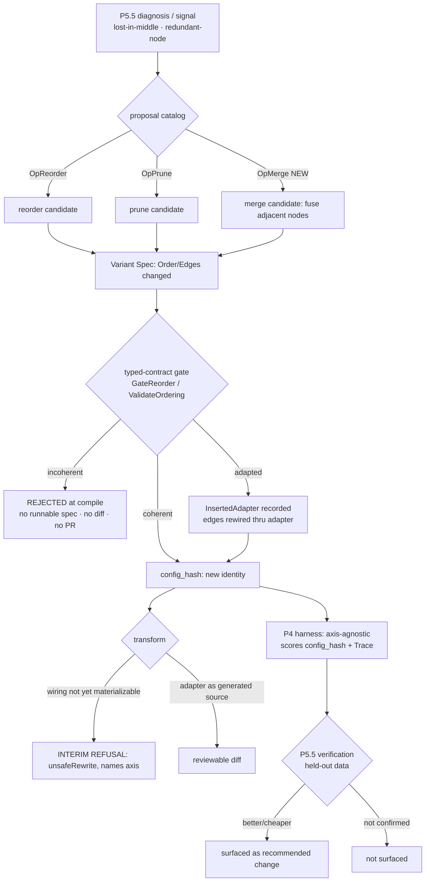

# PRD — P15: Workflow / Node-Wiring Optimization (turning the graph's shape into an optimization axis)

| Field | Value |
|---|---|
| Phase / Milestone | P15 / M18 |
| Target window | Five waves: 15a node-wiring operators (merge/reorder/prune), 15b wiring-safety as a first-class gate, **15c call-site materialization** — the reorder-only slice of a wiring rewriter — **15d user-initiated change** (`wiring-authoring`), then **15e all-language coverage** (`wiring-language-coverage`) |
| Lead role(s) | System Designer + Backend (co-leads) |
| Supporting role(s) | AI Engineer, Frontend, DevOps, QA Engineer, Product Designer, Sales Operations |
| Status | Draft |
| OpenSpec change | `p15-workflow-wiring-optimization` |
| Related | [P2 — Config & Runtime](P2-config-runtime.md) · [P4 — Eval Harness](P4-eval-harness.md) · [P5.5 — Proposals & Verification](P5.5-proposals-verification.md) · [ADR-001](../adr/ADR-001-source-transformation-apply-model.md) |

> **Money-in-git rule.** No dollar amounts, percentages, or price bands appear in this document. Plans
> are referred to by **name only** — Free / Team / Business / Enterprise.

## 1. Summary

The platform treats a target codebase's LLM calls as a graph of nodes, and it already optimizes each
node's *content* across four dimensions — model, prompt, skills, context
([`internal/variantspec/spec.go:42-47`](../../internal/variantspec/spec.go)). But the graph's **shape**
— which node runs, in what order, wired to which neighbour — is where a large class of real wins lives:
two adjacent calls one model can subsume in one, a node whose output nothing downstream reads, an
ordering that buries the decisive context in the middle of a long prompt. The structural axis exists on
the Variant Spec today (`VariantSpec.Order` and `VariantSpec.Edges`,
[`spec.go:253-258`](../../internal/variantspec/spec.go)), it is **identity-bearing** in `config_hash`,
and two of its operators are real: `OpReorder` and `OpPrune` are implemented and registered in the
proposal catalog ([`internal/proposal/catalog.go:175-199`, `:326-344`](../../internal/proposal/catalog.go)).

What is missing is the rest of the axis. **`OpMerge` is a reserved constant with a gain prior and no
implementation** — it appears at [`operator.go:46`](../../internal/proposal/operator.go) and
[`gain.go:20,29`](../../internal/proposal/gain.go) but has no `mergeOp` and is **absent from
`DefaultCatalog()`**. The reorder operator does only a single adjacent swap of a lost-in-middle node
([`catalog.go:193-198`](../../internal/proposal/catalog.go)); free rewiring — parallelizing independent
nodes, general re-ordering — is not proposed by anything. And no wiring change is yet materialized as
source: the transform engine emits model and prompt edits and **refuses** skills and context
([`internal/transform/rewrite.go:388,417`](../../internal/transform/rewrite.go)); it emits nothing for
Order/Edges/adapters at all.

P15 turns wiring into a **full optimization axis** and makes its safety a **first-class requirement**.
The `node-wiring` capability implements `OpMerge` (fuse adjacent nodes when one model call can subsume
two) and free edge rewiring (reorder/parallelize independent nodes, prune dead nodes), each proposal
producing a Variant Spec whose `Order`/`Edges` change and therefore a new `config_hash`. The
`wiring-safety` capability promotes the typed-contract coherence gate — already the exact behavioral
example [`openspec/AGENTS.md:87`](../../openspec/AGENTS.md) cites — into a named requirement: a Variant
Spec whose reordering or rewiring violates a typed I/O contract **SHALL be rejected at compile**, unless
a catalogued adapter reconciles the mismatch, in which case the adapter insertion **ships in the same
reviewable diff**. Milestone **M18 — the graph's shape is optimizable and safe by construction** means a
merge or a reorder is surfaced only when P5.5 verification shows it is better or cheaper on held-out
data, and never when it would produce a workflow that does not type-check.

**Honest status.** This axis is **PARTIAL**. Ordering **EXISTS** end to end (spec → gate → adapter
insertion → config_hash). Free rewiring is **PARTIAL** (reorder is a single swap; prune rewires
neighbours; parallelization and general rewiring are unbuilt). `OpMerge` is **reserved, UNIMPLEMENTED**.
Source-level materialization of any wiring change is **ABSENT** (the transform engine emits none), so
P15 carries an explicit **interim refusal** for it. Where the rewriter does land (15c), it materializes in
**Go and Python only** — a scope statement rather than a limit of the languages, since the per-language
part of a move is one statement resolver. Wave **15e** (`wiring-language-coverage`) makes that a total,
per-language table under the cross-axis [`language-coverage`](P13-prompt-model-optimization.md) contract
and closes it, while keeping the plan, the coherence gate and the permutation invariant one neutral path
— and while putting the **requested shape** and the source's structure ahead of the language in a refusal,
because on a real repository "there is no adjacent transposable pair" is the answer far more often than
"your language is pending".

## 2. Problem & context

The four content dimensions and the structural axis are not symmetric today, and the asymmetry is the
problem this phase closes.

- **The structural axis is modeled but half-operated.** `VariantSpec.Order`/`Edges` are first-class and
  identity-bearing ([`spec.go:253-258`](../../internal/variantspec/spec.go)); `Reorder` and the
  `GateReorder` coherence check are complete ([`internal/variantspec/rearrange.go`](../../internal/variantspec/rearrange.go));
  `OpReorder` and `OpPrune` are catalogued operators
  ([`catalog.go:175,326`](../../internal/proposal/catalog.go)). So the machinery to *propose, validate,
  and hash* a wiring change is all present — but the catalog proposes only two narrow moves, and the one
  operator that would fuse work is not built.
- **`OpMerge` is a promise, not a capability.** The constant exists
  ([`operator.go:46`](../../internal/proposal/operator.go)) and carries a gain prior and a mutating-flag
  in `gain.go` ([`:20,:29`](../../internal/proposal/gain.go)), which is exactly the shape of a reserved
  slot: the *identity* of the operator is fixed so a proposal row can name it, but `DefaultCatalog()`
  does not list a `mergeOp` and no `Propose` produces a merge candidate. A user diagnosing two redundant
  adjacent calls has no operator that fuses them.
- **"Free rewiring" is one swap.** `reorderOp.Propose` moves a single lost-in-middle node one position
  earlier ([`catalog.go:193-198`](../../internal/proposal/catalog.go)). That is the minimal correct move
  for one taxonomy code, but the axis the platform advertises — *"re-order nodes"*,
  [`openspec/project.md:6`](../../openspec/project.md) — implies more: nodes with no data dependency
  between them can run in parallel or in either order, and the optimizer should be able to explore that
  space, not just nudge one node.
- **Wiring changes are hashed and gated but not yet applied to source.** The transform engine's honest
  boundary is *refuse until safe*: model and prompt emit real edits; skills and context return
  `unsafeRewrite` ([`rewrite.go:388,417`](../../internal/transform/rewrite.go)). Wiring is not even at
  that line — no rewriter looks at `Order`/`Edges`. A resolved spec whose wiring differs from the
  discovered graph must therefore be **refused at transform**, not silently executed as if the wiring
  were unchanged; otherwise the eval would score a configuration whose `config_hash` claims a shape the
  running code does not have.
- **Safety here is not a footnote — it is the load-bearing requirement.** Rearranging a graph can break
  it in a way content edits cannot: node B may consume a field only A produced, and moving B before A, or
  pruning A, makes B's input undefined. The typed-contract gate already exists to catch exactly this
  ([`internal/typedcontract/adapter.go:61-84`](../../internal/typedcontract/adapter.go),
  `GateReorder` at [`rearrange.go:52`](../../internal/variantspec/rearrange.go)), and the OpenSpec format
  contract itself uses *"reject a Variant Spec whose node ordering violates a typed I/O contract"* as its
  canonical example of a behavioral requirement ([`AGENTS.md:87`](../../openspec/AGENTS.md)). P15 makes
  that example a shipped, named requirement rather than a doc illustration.

**Upstream state assumed.** **P1** (discovery and the Workflow IR whose nodes and edges this axis
rearranges). **P2** (the Variant Spec, `Resolve`, and `config_hash` that `Order`/`Edges` already feed).
**P3** (the typed-contract catalog and I/O schemas the coherence gate reads). **P4** (the axis-agnostic
eval harness that scores a wiring-changed `config_hash` with no change of its own). **P5.5** (diagnosis,
the operator catalog, and the priors this phase extends with `OpMerge`; the verification that decides
whether a wiring proposal is surfaced at all). No P15 requirement edits any of these; they are consumed.

## 3. Goals & non-goals

### Goals

- **G1. Wiring is a full optimization axis, not two narrow moves.** The proposal catalog SHALL propose
  node **merge**, free **reorder** (including parallelizing independent nodes), and **prune**, each as a
  candidate Variant Spec whose `Order`/`Edges` differ from the parent.
- **G2. `OpMerge` is implemented, not reserved.** A `mergeOp` SHALL exist and be registered in
  `DefaultCatalog()`, fusing two adjacent nodes into one when a single model call can subsume both,
  producing a Variant Spec whose absorbed node is dropped from `Order` and whose `Edges` are rewired
  through the survivor.
- **G3. A wiring change is a new configuration.** Because `Order` and `Edges` are identity-bearing
  ([`spec.go:253-258`](../../internal/variantspec/spec.go)), every merge/reorder/prune SHALL yield a new
  `config_hash` and be scored as a distinct configuration — with **no eval or scoring change required**,
  because the harness consumes only `config_hash` + `Trace`.
- **G4. Determinism.** The same base spec and the same diagnosis/signal SHALL produce the same candidate
  `Order`/`Edges`, the same inserted adapters, the same `config_hash`, and the same diff — on every run.
- **G5. A wiring change is surfaced only when verified better or cheaper.** A produced wiring candidate
  is not a claim; it SHALL enter the ranked, user-facing set only after **P5.5** verification shows it is
  better or cheaper on **held-out** data. Diagnosis proposes; verification decides.
- **G6. Reordering/rewiring that violates a typed I/O contract SHALL be rejected at compile.** No diff,
  no codemod, no pull request is generated from an incoherent ordering. This is
  [`AGENTS.md:87`](../../openspec/AGENTS.md)'s example, made a shipped requirement.
- **G7. A catalogued adapter may reconcile a mismatch — and it ships in the same diff.** When the
  typed-contract catalog can bridge a producer→consumer mismatch, the ordering is admitted, the adapter
  is recorded as an **explicit** `InsertedAdapter` node, and its generated source appears in the same
  reviewable diff — never a hidden runtime coercion.
- **G8. No adapter drops a consumer-required field.** An adapter SHALL be admissible only if its schemas
  satisfy both producer and consumer; one that would silently drop a required field SHALL be rejected.
- **G9. Interim refusal for un-materializable wiring.** Until the transform engine emits source for a
  wiring change, a resolved spec whose `Order`/`Edges` differ from the discovered wiring SHALL be
  **refused at transform** (`unsafeRewrite`), naming the axis — never silently dropped nor applied as a
  no-op that would let a wiring `config_hash` be scored against unchanged code.
- **G10. A user can rearrange the graph themselves.** Reorder, parallelize, merge, and prune SHALL be
  available as **user-initiated** drafts on the shared `authored-change` spine, with `Origin` recorded and
  never hashed.
- **G11. The coherence gate moves left, and names the break.** Every authored wiring draft SHALL be
  validated by the **same** gate at **preflight**, and an incoherent ordering SHALL be refused naming the
  **consumer, the producer, and the field** - never a bare "invalid ordering".
- **G12. A reconciling adapter is seen before it is agreed to.** An adapter that makes an authored
  reordering admissible SHALL be shown as an **explicit inserted node with its rewired edges in the
  preview, before submission**.
- **G13. The gap between what the editor offers and what the transform applies SHALL be visible.** A shape
  the transform cannot materialize SHALL be refused at preflight with the **shape named**, and SHALL NOT
  be presented as an applicable change.
- **G14. A refused wiring draft is never a scoreable variant.** It SHALL NOT be enqueued for evaluation,
  its hash SHALL NOT be submitted for scoring, and it SHALL NOT appear among the workflow's variants -
  because scoring a wiring hash against unchanged source is a false result, not a partial one.
- **G15. A transposition SHALL be materializable in every registered language.** The wiring coverage table
  SHALL carry an entry for **every** language discovery registers, and a language that cannot yet
  materialize SHALL name the **statement resolver** as its missing artifact — not be described as
  structurally incapable of the move.
- **G16. The statement resolver SHALL be the only per-language part of a wiring move.** The plan, the
  permutation invariant, the edge-set check, the coherence gate, and the emitted edit SHALL stay
  language-neutral, so adding a language is adding a resolver and its coverage entry.
- **G17. A shape refusal and a language refusal SHALL NOT be conflated.** A merge, a prune, a non-adjacent
  move, more than one exchange, or a workflow with **no adjacent transposable pair** SHALL be refused by
  **shape**, identically in every language, and SHALL NOT be reported as a missing rewriter.

### Non-goals (deferred or owned elsewhere)

- **Source-level codemod for wiring** — a rewriter that physically re-orders, fuses, or deletes call
  sites in the target source. That is the hard transform work
  ([`rewrite.go`](../../internal/transform/rewrite.go)/`rewrite_span.go`) and is deliberately **out of
  15a/15b**; until it lands, G9's interim refusal holds. Tracked as its own follow-on.
- **New eval metrics or a wiring-specific scorer.** The harness is axis-agnostic
  ([`internal/evalharness/evaluator.go`](../../internal/evalharness/evaluator.go)); a wiring-changed
  `config_hash` is scored by the existing metrics with no addition. P15 registers no bespoke metric.
- **Changing the `config_hash` contract.** `Order`/`Edges` already participate; P15 adds no field to the
  hashed configuration and preserves P0's golden vectors byte-for-byte.
- **Cross-workflow or whole-graph rewrites.** P15 rearranges within one discovered workflow's node set;
  splitting or merging *workflows* is not in scope.
- **Speculative parallel execution at runtime.** Marking independent nodes parallelizable is a
  *structural* proposal scored like any other; P15 does not build a parallel executor.
- **The diagnosis taxonomy.** P15 consumes the frozen P4.5 codes and P5.5 signals; it invents no new
  cause codes (redundancy arrives as a `Signal`, exactly as `OpPrune` already consumes `SignalRedundantNode`).

## 4. Users & personas

| Persona | What P15 is for them | What breaks without it |
|---|---|---|
| **AI engineer optimizing a workflow** (primary) | The optimizer proposes fusing two redundant calls, parallelizing independent ones, or dropping a dead node — and only surfaces the ones a held-out run confirms. | The graph's shape is frozen; every win has to be found and hand-applied, and the tool that promises to "re-order nodes" nudges one node one step. |
| **System designer / reviewer** | A wiring change arrives as a diff whose reordering is type-checked, with any bridging adapter visible as generated source in the same diff. | A rearranged graph reaches review with no evidence it type-checks, and coercions hide between nodes. |
| **Platform engineer running the catalog** | `OpMerge` is a real catalog row with a prior, so proposals are complete and rankable alongside the content operators. | A reserved constant advertises a capability the catalog cannot produce. |
| **QA engineer** | The compile gate can be made to **go red**: an incoherent reorder yields *no* runnable spec, provably. | "It's validated" is a claim no test can fail, which means it is decoration. |
| **Workflow owner rearranging the graph** (primary, 15d) | They drag a node and are told, on the gesture, whether it is admissible, what it would break (consumer, producer, field), or which shape the platform cannot yet apply. | A graph editor that accepts every gesture and refuses at apply time - a machine for producing rearrangements that can never ship. |
| **Reviewer of an authored reorder** (15d) | Any adapter that makes the reorder legal was visible in the preview before submission and appears as generated source in the diff. | A diff containing a component the author never saw proposed, which no reviewer can meaningfully assess. |

Non-personas: the **end user of the customer's own LLM product** (P15 never changes runtime behavior a
customer's users see except through a verified, merged delta); **operators** (P8) — wiring optimization
is a customer-console concern.

## 5. User stories / jobs-to-be-done

**AI engineer**
- As an AI engineer, I want the optimizer to **propose merging two adjacent calls** one model can do in
  one, so that I stop paying for a hop that buys nothing.
- As an AI engineer, I want it to **parallelize or reorder independent nodes**, so that ordering stops
  being a hand-tuned constant.
- As an AI engineer, I want a proposed reorder **surfaced only when a held-out run confirms it is better
  or cheaper**, so that I am not handed a list of rearrangements I have to evaluate myself.

**System designer / reviewer**
- As a reviewer, I want a rearranged graph to **arrive already type-checked**, so that "does this still
  wire up?" is answered before I read the diff, not after it merges.
- As a reviewer, I want any **bridging adapter to be visible generated source** in the same diff, so that
  no coercion is hidden between two nodes.

**Platform engineer**
- As a platform engineer, I want `OpMerge` to be a **catalogued operator with a prior**, so that merge
  candidates rank against model/prompt/context ones through the same machinery.

**QA engineer**
- As a QA engineer, I want to write a test that **feeds an incoherent ordering and asserts no runnable
  spec is produced**, so that the safety gate is a fence that can go red.

## 6. Functional requirements

Numbered FRs; each maps 1:1 to an OpenSpec requirement under
`openspec/changes/p15-workflow-wiring-optimization/specs/`.

### Node wiring as an axis (capability `node-wiring`)

- **FR1.** The proposal catalog SHALL provide a **merge** operator (`OpMerge`), registered in
  `DefaultCatalog()`, that fuses **two adjacent nodes** into one when a single model call can subsume
  both, producing a candidate Variant Spec.
- **FR2.** A merge candidate SHALL produce a Variant Spec whose **`Order` drops the absorbed node** and
  whose **`Edges` are rewired through the surviving node** (the absorbed node's inbound edges retarget
  the survivor; its outbound edges re-source from the survivor), inheriting all other per-node overrides
  unchanged.
- **FR3.** The catalog SHALL provide **free edge rewiring**: reordering independent nodes (including
  marking data-independent nodes parallelizable) and **pruning** a dead node, each producing a candidate
  Variant Spec via the `Reorder`/prune derivation, with only wiring moved and per-node overrides
  inherited.
- **FR4.** Every wiring candidate SHALL be **derived**, never mutated in place: it SHALL carry
  `ParentVariantID` lineage and leave the parent spec unchanged (as `Reorder` already does,
  [`rearrange.go:18-31`](../../internal/variantspec/rearrange.go)).
- **FR5.** A wiring change SHALL be **identity-bearing**: because `Order` and `Edges` participate in
  `config_hash` ([`spec.go:253-258`](../../internal/variantspec/spec.go)), a merge/reorder/prune SHALL
  yield a `config_hash` distinct from its parent, so the harness scores it as a distinct configuration
  with no eval-side change.
- **FR6.** Wiring proposals SHALL be **deterministic**: the same base spec and the same diagnosis/signal
  SHALL yield the same candidate `Order`/`Edges`, the same absorbed/pruned node choice, and the same
  `config_hash`.
- **FR7.** A produced wiring candidate SHALL be **surfaced to the user only after P5.5 verification**
  shows it better or cheaper on held-out data. A candidate that verification does not confirm SHALL NOT
  be presented as a recommended change.
- **FR8.** A wiring change the transform engine cannot materialize SHALL be **refused at transform**
  with an `unsafeRewrite`-class error naming the wiring axis, never silently dropped and never applied
  as a no-op that would let a wiring `config_hash` be scored against unchanged source. The refusal
  SHALL be scoped to what the SOURCE STATES: (a) a spec whose **node set** differs from the discovered
  one — the dropped call is demonstrably still in the tree — and (b) a spec that **inverts a
  source-stated order**, i.e. two call sites the source runs as consecutive sibling statements.
  🚫 An ordering between calls the source does NOT order (different functions, different files) is an
  authoring declaration with no counterpart in the tree and SHALL NOT be refused; nor SHALL a declared
  edge, because an IR that records no edge means *not recorded*, never *no edge*.

### The coherence gate as a requirement (capability `wiring-safety`)

- **FR9.** A candidate ordering SHALL be validated by the **typed-contract coherence gate**
  (`GateReorder` → `ValidateOrdering`, [`rearrange.go:52`](../../internal/variantspec/rearrange.go))
  **before any codemod is generated**.
- **FR10.** A Variant Spec whose reordering or rewiring **violates a typed I/O contract SHALL be rejected
  at compile**: the gate returns **no runnable spec**, and no diff, codemod, or pull request is generated
  from it. (This is [`AGENTS.md:87`](../../openspec/AGENTS.md)'s canonical example, made a requirement.)
- **FR11.** When a **catalogued adapter** reconciles a producer→consumer mismatch, the ordering SHALL be
  admitted (`adapted`), the adapter recorded as an explicit **`InsertedAdapter`** node on the spec
  ([`spec.go:213-229`](../../internal/variantspec/spec.go)), and its edges rewired
  producer→adapter→consumer ([`rearrange.go:66-89`](../../internal/variantspec/rearrange.go)).
- **FR12.** An adapter SHALL be admissible **only if it drops nothing the consumer requires**: its
  `InSchema` must be satisfied by the producer and its `OutSchema` must satisfy the consumer
  ([`adapter.go:73-82`](../../internal/typedcontract/adapter.go)). An adapter that would silently drop a
  consumer-required field SHALL be rejected, and the ordering rejected with it.
- **FR13.** Adapter insertion SHALL **ship in the same reviewable diff**: the inserted adapter appears in
  the spec's node list and its diff against the parent, carrying its own `io_contract`, and is
  materialized as generated source — never a hidden runtime coercion.
- **FR14.** Adapter **identity SHALL be deterministic**: adapter node ids are derived from the edge and
  kind ([`rearrange.go:91-93`](../../internal/variantspec/rearrange.go)) and the catalog match order is
  fixed ([`adapter.go:61-71`](../../internal/typedcontract/adapter.go)), so the same reorder yields the
  same inserted adapters and the same `config_hash` on every evaluation.

### Call-site materialization of a reorder (capability `wiring-materialization`)

15c closes the gap FR8 names honestly. It does **not** build a general wiring rewriter: it builds the one
slice whose behaviour a machine can bound, and leaves every other wiring change refused exactly as FR8
requires. The slice is a **transposition of two adjacent, independent sibling statements**.

- **FR15.** The transform engine SHALL materialize a wiring change as source **only** when exactly **one
  source-stated pair is inverted** and the spec places those two nodes next to each other — a
  transposition of neighbours. A merge, a prune, two or more inverted pairs, or an inversion across
  other nodes SHALL keep FR8's refusal.
- **FR16.** A transposition SHALL be materialized **only** when both nodes' call sites are, in the target
  source: in the **same file**, at the **same block nesting**, **consecutive** (nothing between them but
  blank lines), each occupying **whole lines**, and neither a control-flow statement (`return`, `raise`,
  `break`, `continue`, `yield`, `defer`, `go`). A pair failing any of these SHALL be refused with the
  specific reason named.
- **FR17.** 🔴 A transposition SHALL be materialized **only when the two statements are independent**: no
  name bound by one is read by the other, in either direction. The analysis SHALL be **conservative** —
  where the frontend cannot prove independence, the pair is refused, never assumed independent.
- **FR18.** 🔴 The emitted change SHALL be a **permutation of the file's lines**: same line count, and the
  same multiset of lines as the original. No line may be added, deleted, or altered by a wiring
  materialization — only moved. The minimality gate SHALL enforce this and SHALL confine every changed
  line to the two swapped blocks.
- **FR19.** Materialization SHALL be **per-language and named**: a language with no statement materializer
  SHALL refuse with a message that says so, in the same shape as the skills refusal (P14 D-14.3), rather
  than attempting a generic textual move.
- **FR20.** A materialized reorder SHALL pass the **same build gate** every other transform passes; a
  swap whose result does not build or no longer parses SHALL be rejected before it is proposed.
- **FR21.** Materialization SHALL be **deterministic**: the same {spec, source_revision, tree} SHALL
  produce a byte-identical diff, and the swap SHALL be its own inverse — applying the same transposition
  twice returns the original bytes.

### User-initiated change on this axis (capability `wiring-authoring`)

The cross-axis rules are **FR21-FR33 of [P13](P13-prompt-model-optimization.md)** (capability
`authored-change`) and apply here in full without restatement. P15 adds only what this axis needs - and it
needs more than the others, because **a graph editor looks like it can do anything while the transform
materializes exactly one shape**.

- **FR22.** A user SHALL be able to draft a **reorder**, a **parallelization**, a **merge**, and a
  **prune**; every authored wiring draft SHALL be validated by the typed-contract coherence gate at
  **preflight** - before submission and before any codemod is generated - using the **same** gate an
  operator candidate passes, not a second validator.
- **FR23.** An authored ordering that would leave a consumer's required input undefined SHALL be refused
  at preflight naming the **consuming node**, the **producing node**, and the **field** that would become
  undefined. A bare "invalid ordering" SHALL NOT be an acceptable refusal on this axis.
- **FR24.** Where a catalogued adapter reconciles a producer-to-consumer mismatch in an authored draft,
  the ordering SHALL be reported **adapted** and the adapter SHALL be presented as an **explicit inserted
  node with its rewired edges in the preview, before the user submits**. The adapter SHALL ship as
  generated source in the same reviewable diff and SHALL NOT be a hidden runtime coercion; adapter
  identity SHALL remain deterministic.
- **FR25.** An authored wiring change whose shape the transform cannot materialize - a merge, a prune, an
  edge change, a non-adjacent move, more than one transposition at once, unprovable independence, or a
  language with no statement materializer - SHALL be refused at preflight with the **shape named**, and
  SHALL NOT be presented as an applicable change.
- **FR26.** An unmaterializable authored wiring change SHALL NOT be presented as a **scoreable variant**:
  no evaluation run SHALL be enqueued for it, its `config_hash` SHALL NOT be submitted for scoring, and it
  SHALL NOT appear among the workflow's variants. Evaluating a wiring-changed `config_hash` against
  unchanged source would score the base configuration under a variant's hash - a false result, and the
  same failure the interim refusal exists to prevent.
- **FR27.** Where the surface retains a refused wiring draft, it SHALL retain it as a **recorded intent**
  explicitly marked as neither applicable nor scoreable, and SHALL NOT describe it as pending, queued, or
  awaiting evaluation.
- **FR28.** An authored **parallelization** SHALL be admissible only where the analysis **proves** the
  nodes data-independent; unprovable independence SHALL be a refusal naming the blocking dependency.
- **FR29.** A materializable authored transposition SHALL be applicable while `unverified`, with **no**
  latency, token, cost, or quality benefit attributed to it until the harness has run.
- **FR30.** Reverting an authored wiring change SHALL reproduce the parent `config_hash`
  **byte-identically**, including any inserted adapters.

### All-language coverage on this axis (capability `wiring-language-coverage`)

The cross-axis rules — coverage as a **total** function over every registered language, per-cell claims,
the three typed refusal classes and their specific-first evaluation order, one coverage source, executable
evidence for every row, no gate weakened to reach a language, the versioned offline table, and coverage no
plan can move — are **FR41–FR51 of [P13](P13-prompt-model-optimization.md)** (capability
`language-coverage`). They apply here in full and are **not** restated.

- **FR31.** The wiring coverage table SHALL carry an entry for **every** registered language, stating
  whether an adjacent transposition can be materialized and, where it cannot, naming the **statement
  resolver** as the missing artifact.
- **FR32.** Per-language knowledge SHALL be confined to resolving a statement's boundaries. The plan, the
  permutation invariant, the edge-set check, the coherence gate, and the emitted edit SHALL be produced by
  the same language-neutral path in every language, and the permutation invariant SHALL be asserted
  identically everywhere — an emission that fails it SHALL be refused, never emitted.
- **FR33.** A wiring change that is **not a single adjacent transposition** — a merge, a prune, an added
  or removed edge, a non-adjacent move, or more than one exchange — SHALL be refused with a cause naming
  the **requested shape**, identically in a language with a resolver and one without, and SHALL NOT imply
  that a resolver would carry it.
- **FR34.** A workflow whose nodes are **not adjacent statements** SHALL be refused with a cause stating
  that the source offers no transposable pair; the language SHALL NOT be named as the reason.
- **FR35.** For a refused wiring change the **most specific true** cause SHALL be reported, evaluated in
  the order: the requested shape → the coherence gate → the source's statement structure → the language's
  resolver.
- **FR36.** In **no** language, covered or not, SHALL an unmaterializable wiring draft become a scoreable
  variant; and before a user expresses a move, the authoring surface SHALL state — from the shared
  coverage source — whether the node's language can carry a transposition **and** whether the workflow
  offers a transposable pair.

### This axis's delivery cells (capability `wiring-delivery`)

Cross-axis rules are defined once in [P13](P13-prompt-model-optimization.md) §6 (`change-delivery`,
FR57–FR68) and [ADR-010](../adr/ADR-010-runtime-gradual-rollout.md); they are referenced, not restated.

> **This is the axis whose refusal must never soften, and the axis where the second route is most
> tempting as an escape hatch.** Order and concurrency are compiled program structure; a document that
> could reorder statements in a built binary would be an interpreter, and shipping an interpreter into a
> customer's process to rearrange their own code is a larger change to their system than any
> optimization could justify. And this is the axis with a gate that **rejects at compile** — a second
> route arriving beside a gate whose whole purpose is to produce nothing is exactly where someone
> reasons "the rewriter refused, so roll it out instead."

- **FR52.** Every wiring change — ordering, parallelization, merge, prune, edge change — SHALL be refused
  for the runtime route with cause `notRuntimeResolvable`, in every language, for every call-site shape,
  and independent of the node's apply mode. A `bound` node SHALL NOT be reported as closer to possible.
- **FR53.** The wiring refusal SHALL be presented as a **boundary** in every surface: no milestone, no
  backlog item, no named missing artifact, no "not yet", and structurally distinguishable from a cell
  that names a missing artifact.
- **FR54.** A wiring change the coherence gate rejected SHALL produce no runnable spec and SHALL
  therefore be **unauthorable as a rollout candidate**, undeliverable as a pull request, and reachable
  by no path into a customer's process.
- **FR55.** A rejected wiring transform SHALL report **undeliverable** with both routes' causes named —
  the rejection for the source route, `notRuntimeResolvable` for the runtime route — and SHALL NOT be
  reported as awaiting delivery, awaiting review, or in progress.
- **FR56.** A gate-passed, materializable wiring change SHALL continue to be delivered by the source
  route unchanged, and the runtime route's refusal SHALL NOT appear as a warning on that delivery.

## 7. Non-functional requirements

| # | Requirement | Target |
|---|---|---|
| **NFR1** | **Determinism** | A given base spec + diagnosis/signal produces a byte-identical candidate spec and an identical `config_hash` across processes and machines — asserted, not assumed (mirrors the existing reorder determinism test). |
| **NFR2** | **`config_hash` participation** | Any merge/reorder/prune changes `config_hash`; a wiring change that resolved to the *same* configuration (e.g. a no-op reorder) hashes identically. A no-binding/no-wiring spec still hashes byte-identically to today — P0 golden vectors unchanged. |
| **NFR3** | **Fail-closed safety gate** | An incoherent ordering yields **no runnable spec** (`GateReorder` returns `(nil, verdict)`), so a caller physically cannot hand a rejected ordering to the transform engine. The gate must be able to **go red** in a test. |
| **NFR4** | **Interim refusal is observable** | A wiring change that cannot yet be materialized is refused at transform with a typed error naming the axis, and the refusal is visible in the transform result — never a silent drop. |
| **NFR5** | **Eval-agnostic** | P15 adds no metric, no scorer, and no Dimension-label branch to the harness; a wiring-changed `config_hash` is scored by the existing `RunMetrics`. |
| **NFR6** | **Adapter reviewability** | Every inserted adapter is present as generated source in the diff a reviewer reads; no coercion exists that is not in that diff. |
| **NFR7** | **Verification-gated surfacing** | No wiring candidate is presented as a recommended change without a P5.5 verified delta on held-out data; a produced-but-unverified candidate is labelled exploratory, never a claim. |
| **NFR8** | **Preflight and compile never disagree** | The verdict the authoring surface shows for a draft and the verdict `GateReorder` produces at compile are the **same gate's** output, asserted across every verdict class. A second validator would let the editor bless what the compiler rejects. |
| **NFR9** | **A refused shape is unreachable by evaluation** | Machine-asserted: no code path enqueues an evaluation run, or submits a `config_hash` for scoring, for a wiring draft whose shape the transform refuses. This keeps a false measurement structurally impossible, not merely unlikely. |
| **NFR10** | **Every gesture has a verdict at the moment it is made** | The editor's verdict for a drafted gesture is produced without a submit, a diff, or an eval run, and each of the three verdict classes renders distinctly. A gesture with no verdict is a gesture that will disappoint later. |
| **NFR11** | **No hidden component reaches the diff** | Every inserted adapter appearing in an authored change's diff was visible in the preview the user submitted; asserted by comparing the preview's adapter set against the diff's. |
| **NFR12** | **Coverage is total, and generated** | The wiring coverage table carries an entry for every registered language; a test enumerates the registered set and fails on a missing cell. A language absent from a table reads as "the move does not apply here", which is the opposite of the truth: discovery finds these statements fine. |
| **NFR13** | **Shape and language refusals are provably distinct** | A merge requested on a node in a language with no resolver reports the **merge**; the test goes red if the resolver cause is reported first. This is the refusal users hit most on this axis — a real repository is far more likely to have no transposable pair than to be in an uncovered language. |
| **NFR14** | **A resolver row is a proof** | Each language's statement resolver is admitted only with a fixture that emits a transposition in it and asserts both the permutation invariant and the reparse. No language reaches coverage by relaxing the invariant. |
| **NFR15** | **The gate has no second door** | A structural assertion over every delivery path: no path enqueues, authors, or delivers a gate-rejected ordering. Adding a route without extending this assertion fails the build, because the assertion is what makes "the gate is the only way in" a fact rather than a convention. |
| **NFR16** | **The boundary cannot acquire a date** | The wiring cells are asserted to carry no artifact and no expected date in the console, the offline table, and the API. A change that gives any wiring cell a "not yet" rendering turns a test red — the refusal degrading into a roadmap item is the failure mode, and it is a slow one. |

## 8. System design summary

### 8.1 The axis, from diagnosis to a scored, safe configuration



**Structure crosses to the score; nothing about the axis reaches the harness as a label.** The harness
consumes `config_hash` + `Trace` only ([`evaluator.go`](../../internal/evalharness/evaluator.go)), so a
wiring-changed configuration is scored with no eval change — the whole reason a new axis "needs only to
land its effect in `ResolvedConfig` → `config_hash`."

### 8.2 EXISTS / PARTIAL / ABSENT ledger (honesty)

| Surface | State | Evidence |
|---|---|---|
| `VariantSpec.Order` / `Edges`, identity-bearing | **EXISTS** | [`spec.go:253-258`](../../internal/variantspec/spec.go) |
| `InsertedAdapter` on the spec | **EXISTS** | [`spec.go:213-229`](../../internal/variantspec/spec.go) |
| `Reorder` derivation + `GateReorder` coherence gate + adapter rewiring | **EXISTS** | [`rearrange.go`](../../internal/variantspec/rearrange.go) |
| Typed-contract catalog + `FindAdapter` (admissibility both sides) | **EXISTS** | [`adapter.go:61-84`](../../internal/typedcontract/adapter.go) |
| `OpReorder` operator (single adjacent swap) | **EXISTS (narrow)** | [`catalog.go:175-199`](../../internal/proposal/catalog.go) |
| `OpPrune` operator (neighbour rewire) | **EXISTS** | [`catalog.go:326-344`](../../internal/proposal/catalog.go) |
| `OpMerge` operator | **RESERVED / UNIMPLEMENTED** | const [`operator.go:46`](../../internal/proposal/operator.go); prior [`gain.go:20,29`](../../internal/proposal/gain.go); **not** in `DefaultCatalog()` |
| Free reorder / parallelize independent nodes | **PARTIAL** | reorder is one swap; no parallelization operator |
| Source-level materialization of a **reorder** (adjacent transposition, Go + Python) | **PARTIAL (15c)** | `internal/transform/wiringswap.go` — swap-only, sibling-statement, independence-checked, permutation-gated |
| Source-level materialization of a **merge** or a **prune** | **ABSENT** | deleting or fusing a call is not a permutation of the file's lines; both keep FR8's refusal |
| Source-level materialization of a wiring change in Java/Kotlin/Rust/TypeScript/JavaScript | **ABSENT** | no statement materializer for those frontends; the refusal names the language (FR19) |
| An ordering between calls the source does **not** order (different functions/files) | **NOT MODELLED** | it is identity-bearing in `config_hash` but has no source counterpart and no runtime effect; it is neither materialized nor refused, and this row exists so that is on the record rather than discovered |

### 8.3 Decisions, with what was rejected

| # | Decision | Rejected alternative | Why (八级法则) |
|---|---|---|---|
| **D1** | **`OpMerge` fuses only two *adjacent* nodes, and only where the survivor's model can subsume both** | Merge any node subset the diagnosis flags, across gaps in the order | **L2 稳定 + L1 安全.** A non-adjacent or many-to-one merge changes data flow in ways the coherence gate can admit but a reviewer cannot follow; adjacency keeps the rewrite a local, checkable edit and keeps the resulting `Edges` a mechanical rewire, not a re-plan. Correctness of the graph (L2) outranks the reach of the operator (L8). |
| **D2** | **Every wiring candidate is *derived* with lineage; the parent is never mutated** | Mutate `Order`/`Edges` on the base spec in place for speed | **L5 不可演进.** In-place mutation destroys the parent lineage the compare view and rollback depend on; a derived candidate with `ParentVariantID` is the shape the whole re-arrangement design already uses ([`rearrange.go:18`](../../internal/variantspec/rearrange.go)). |
| **D3** | **Incoherent orderings are rejected at compile — no runnable spec, ever** | Emit the diff and let the build fail downstream | **L1 安全.** A wiring change that does not type-check must be caught before a codemod, diff, or PR exists; `GateReorder` returning `(nil, verdict)` makes it *physically impossible* to hand a rejected ordering to the transform engine ([`rearrange.go:52-56`](../../internal/variantspec/rearrange.go)). Catching it later trades a safety guarantee for the convenience of not gating early. |
| **D4** | **A bridging adapter is explicit generated source in the same diff** | Insert a runtime coercion shim that reconciles the mismatch invisibly | **L1 安全 + L3 UX.** The platform's core rule is a codemod, never a runtime shim; an adapter that is not in the diff is a value change hidden from review. Recording it as an `InsertedAdapter` node with its own `io_contract` keeps "an indirection never hides a value from review." |
| **D5** | **Un-materializable wiring is refused at transform, naming the axis** | Let the transform silently no-op the wiring and rewrite only the node content | **L1 安全 + L2 稳定.** A silent no-op would let a spec whose `config_hash` claims a reordered graph be scored against source that was never reordered — a false measurement, the worst outcome for a system whose principle is *verification decides*. Refusal is the honest `refuse-until-safe` pattern the engine already uses for skills/context. |
| **D6** | **No new eval metric; wiring is scored by the axis-agnostic harness** | Add a wiring-specific quality metric | **L6 不可扩展 + single source of truth.** The harness consumes `config_hash` + `Trace`; a bespoke metric would be a second definition of "better" for one axis. Landing the effect in `config_hash` is sufficient and keeps one scoring truth. |
| **D7** | **The rewriter's admitted operation is a *transposition of two adjacent sibling statements* — nothing else** | A general "move this call anywhere" rewriter, or one that also fuses and deletes calls | **L1 安全 + L2 稳定.** A transposition of two whole-line blocks is a *permutation of the file's lines*, which is machine-checkable in one line of code and impossible to get subtly wrong; an arbitrary move rewrites bindings, scope and control flow, which is the ADR-001 top risk ("a bad codemod can break a build or subtly change behavior") with no cheap invariant behind it. Reach (L8) does not buy down a safety guarantee (L1). |
| **D8** | **The permutation invariant is a NEW edit class with its own gate, not a loosening of the existing one** | Relax `gateMinimal`'s "no rewrite may change the file's line count" so a block move fits through | **L2 稳定 + L5 不可演进.** That rule is what makes "only the targeted lines changed" checkable at all; relaxing it for one rewriter removes the check for *every* rewriter, forever. A separate class keeps the old invariant intact for value rewrites and gives the swap a stronger one (same lines, reordered). |
| **D9** | **Go and Python first; every other language refuses by name** | A generic line-based move for all seven frontends | **L1 安全.** Independence needs a parse. Go has `go/ast`; Python is whitespace-explicit and tree-sitter gives the spans. For the rest, a textual move would be a guess that compiles — the failure mode with no downstream net (P14 D-14.3, applied again). |

| **D10** | **The graph editor tells the truth about every gesture, and a refused shape is not a scoreable variant** | Accept any rewiring and surface the refusal at apply time; insert reconciling adapters silently since the gate proves they drop nothing | **L3 + L2 + L1.** Dragging a node is a two-second gesture and this axis materializes exactly one shape, so an editor that accepts everything manufactures rearrangements that can never ship. Worse, an unmaterializable wiring change is not merely un-appliable but **unscoreable**: evaluating its `config_hash` against unchanged source scores the base configuration under a variant's hash - the same false result D5's interim refusal exists to prevent - so a refused draft sitting in a variant list "awaiting evaluation" has already told the user something untrue. On adapters, *an indirection never hides a value from review*: a user who reorders two nodes and receives a diff containing a component they never saw proposed cannot review it. The coherence gate is the right thing to move left precisely because it decides statically and cheaply - no eval spend, no model call, no build. |

| **D11** | **Every registered language gets a statement resolver and a coverage entry; the shape question is asked before the language question** | (a) keep D9's "Go and Python first" as the terminal state; (b) reach the other five with a generic line-based move | **L6 + L3, and L1 for (b).** (a) was correct as an ordering and wrong as an endpoint: nothing about TypeScript, Kotlin, Java or Rust makes an adjacent transposition unsound — tree-sitter gives their statement boundaries as readily as Python's — so an absent row describes our backlog while rendering as "the move does not apply to your code". (b) is the same refusal D9 already made and it still holds: a textual move without a parse is a guess that compiles. The second half of this decision matters more in practice than the first: on a real repository the dominant refusal is **no adjacent transposable pair** or a requested shape this axis does not materialize, and both are true in Go today. Reporting those as "no wiring rewriter for your language" sends an engineer to wait for work that would not have helped them. |

### 8.4 Data model additions

**None to the hashed configuration.** `Order`, `Edges`, and `InsertedAdapter` already exist on
`VariantSpec` and already participate in (or are deliberately excluded from) `config_hash`. P15 adds:

```
mergeOp                  // new proposal.Operator: Kind()=OpMerge, HandlesSignal()=SignalRedundantNode,
                         // Propose() → a candidate that drops the absorbed node and rewires Edges thru the survivor
DefaultCatalog += mergeOp   // one new row in the dispatch table (catalog.go:17-31) — never a switch edit
```

No new registry `Kind`, no new `Dimension` const, no `NodeOverride` field, no DB table. The wiring axis
lives entirely in `Order`/`Edges`/`InsertedAdapter`, which is why it needs no `config_hash` change — the
one-way-door decisions are the **`OpMerge` semantics** and the **adapter-insertion posture**, recorded in
`decisions.md`.

## 9. Design by role lens

**System Designer (co-lead) — *the axis is already modeled; the discipline is to not remodel it.***
The temptation in P15 is to treat wiring as a new dimension and walk the eight-step "add an axis"
checklist. It is not one. `Order`/`Edges` are on the spec, hashed, and gated; the checklist's hard step
7 (a per-dimension rewriter) is exactly the part P15 defers behind an interim refusal. So the design
work is narrow and sharp: add **one** catalog row (`mergeOp`), specify its rewrite as a *mechanical
edge-rewire* rather than a re-plan (D1), and keep every candidate derived with lineage (D2). The
one-way doors are named up front in `decisions.md` — the merge semantics (adjacent-only, survivor
subsumes) and the adapter posture (explicit source, never a shim) — because both become contracts the
moment a stored proposal row or a shipped diff depends on them. Everything else is reuse.

**Backend (co-lead) — *the gate is the product; the operator is the easy half.***
`mergeOp.Propose` is small: pick the adjacent pair the redundancy signal names, build a derived spec via
the same `Reorder`/rewire helpers, drop the absorbed node, retarget its edges through the survivor.
The load-bearing code is already written and must stay the single path: `GateReorder` validates *before*
any transform, returns `(nil, verdict)` on rejection, and records inserted adapters on the `adapted`
verdict ([`rearrange.go:52-89`](../../internal/variantspec/rearrange.go)). Backend's job is to route
every new operator through that one gate — a merge candidate is validated exactly as a reorder candidate
is — so there is no second, weaker safety path. And the interim refusal (FR8) must be a *typed* error at
transform that names the wiring axis, so a wiring `config_hash` can never be scored against unchanged
source; that refusal is the honest analogue of `refuseSkills`/`refuseContext`.

**AI Engineer (support) — *a merge is a hypothesis, and only held-out data confirms it.***
`OpMerge` earns a prior in `gain.go` because it competes for evaluation budget against model and prompt
operators; its prior says "worth trying when two adjacent calls look redundant," not "this is a win." The
harness scores the merged `config_hash` with the same multi-seed, confidence-interval machinery as every
other candidate, and the merge is **surfaced only when P5.5 verification** shows it better or cheaper on
held-out data (FR7). A merge that reads "obviously redundant" but scores worse — because the second call
was quietly correcting the first — is exactly what the verification gate is for. Diagnosis proposes; the
score decides.

**QA Engineer (support) — *the safety gate must be a fence that can go red.***
The two claims that matter cannot be read from code. First, **rejection**: feed an ordering that
consumes a field before it is produced and assert `GateReorder` returns **no runnable spec** — the
existing `TestGateReorder_RejectedYieldsNoRunnableSpec` is the shape; P15 extends it to merge and prune
candidates. Second, **adapter reviewability**: an `adapted` verdict must record the adapter on the spec
*and* the adapter must appear in the diff; a test asserts the inserted adapter is present in both, so a
coercion cannot hide. Determinism gets a test too — the same reorder yields the same adapter ids and the
same `config_hash` — because "deterministic" is a promise a re-run can falsify. And the interim refusal
(FR8) gets a case: a wiring-differing spec at transform returns the typed refusal, not a silent no-op.

### 9.1 Wave 15d - user-initiated change, by role lens

**System Designer - *the editor may not promise what the transform refuses.***
This axis has the largest gap in the product between what a surface can express and what the engine can
apply, and 15d's whole job is to keep that gap visible instead of letting the editor paper over it. Two
structural commitments do the work. The coherence gate runs at **preflight**, using the same
`GateReorder` an operator candidate passes - not a second validator, because a second validator will
eventually bless what the compiler rejects. And a refused shape is **not a variant**: no eval run, no hash
submitted for scoring, no row in the variant list. That second rule is the one that matters most, because
the failure it prevents is not a bad UX but a **false measurement**.

**Backend - *name all three, and probe the shape.***
Two refusal paths, and both must be specific. An incoherent ordering names the **consumer, the producer,
and the field** - a graph error that says only "invalid ordering" gives a user nothing to act on, and this
axis is the one where the system genuinely knows the answer. A materializability refusal names the
**shape**: merge, prune, edge change, non-adjacent, multi-swap, unprovable independence, or
no-materializer for this language. The adapted path returns the inserted adapter node and its rewired
edges in the preflight result itself, so the preview can render what the user is about to agree to, with
adapter identity deterministic so the preview and the diff cannot disagree.

**Frontend - *a verdict per gesture, and a refused draft that never looks pending.***
The wiring surface is where this program's UX risk concentrates. Each gesture gets its verdict **as it is
made**, not on submit - admissible, refused with the shape named, or adapted with the adapter drawn into
the graph. The incoherence refusal highlights the consumer, the producer, and the field in the graph
itself, because names in a toast are weaker than names on the nodes. And a refused draft must never appear
in the variant list or wear the word "pending": a recorded intent is visually and semantically a different
object from a variant, or the honesty of FR26 is lost at the last inch. As everywhere: no capability is
removed from the existing surface, and tokens only.

**AI Engineer - *the same harness, and nothing to score when there is nothing to apply.***
A materializable authored transposition is scored by the axis-agnostic harness like any other
configuration. The discipline unique to this axis is negative: there is no "score it anyway with the
wiring ignored" mode, because that is exactly the scoring-against-unchanged-source failure. Where the
transform refuses, the honest answer to "how would this perform?" is *we cannot measure that yet*.

**QA Engineer - *the impossible thing must be provably impossible.***
Beyond making every refusal class go red, one assertion carries this wave: **no code path enqueues an
evaluation run or submits a `config_hash` for scoring for a wiring draft whose shape the transform
refuses.** That is a structural claim, and it must be asserted structurally rather than by testing the
handful of paths someone thought of. Then the permutation invariant on the applied swap - same line count,
same multiset, changes confined to the two blocks - read back from the **emitted diff**, not from the
handler's return. And reversal, including inserted adapters, back to a byte-identical parent hash.

**DevOps - *the same shape names offline.***
The CLI must produce the same verdict and the same **shape name** as the console, because a user
diagnosing "why won't this apply?" across two surfaces with two vocabularies has two problems. Nothing new
crosses the boundary: the graph structure is already inside it, and preflight must not become the first
path that ships a call-site fact outward.

**Product Designer - *two refusals, two different sentences.***
"This breaks your graph" and "we cannot apply this shape yet" are different messages requiring different
user actions, and collapsing them is the most likely design error here. The first names the break and
invites a fix; the second names the shape and is honest that the limitation is ours. A recorded intent is
described as retained, not applicable, not scored - never "pending", which implies someone is working on
it. The inserted adapter needs its own moment: this reorder is only legal because we would add this
component, shown before the user commits.

**Sales Operations - *the graph editor is real; the applicable shape is one.***
Deliverable: users rearrange the graph and the platform tells them the truth about every gesture -
including type-safety breaks named down to the field. Always paired, because a demo of a graph editor
implies far more: 🚫 only the **adjacent-transposition** shape is applied today; a merge, a prune, or an
edge change is **refused by name**; and a refused shape is **not scoreable** - we will not show a number
for a change we cannot apply. There is no override at any tier.

### 9.2 Wave 15e — all-language coverage, by role lens

**System Designer (co-lead) — *the resolver is the only per-language part, and that is a design property
to defend.*** Everything that makes a wiring move safe is language-neutral already: the plan that admits
exactly one adjacent transposition, the edge-set check, the coherence gate, and the line-permutation
invariant that catches an emission which is not a permutation. What differs per language is one question —
where does the statement enclosing this call site begin and end. Keeping it that way is the whole
extensibility argument (L6): five languages become five resolvers plus five coverage rows, and no gate is
written twice. The moment a language needs its own invariant or its own gate, this axis has acquired five
dialects of one safety property, and the one that is subtly weaker will not be the one anyone audits.

**Backend — *the shape question comes first, and on real repositories it is the answer.*** The refusal a
user is most likely to hit here is not "your language has no resolver" — it is "this workflow has no
adjacent transposable pair" or "a merge is not a transposition", and both of those are true in Go today.
So the ordering rule is not a nicety on this axis; it is the difference between a sentence an engineer can
act on and one that tells them to wait for work that will not help them. Beyond ordering: a resolver is
admitted only with a fixture that emits a transposition and asserts **both** the permutation invariant and
the reparse, and no language reaches coverage by relaxing the invariant.

**AI Engineer (support) — *an unmaterializable draft is unscoreable in every language.*** This is the
strictest rule on any axis and coverage growth does not soften it: a wiring change that cannot be
materialized must not become a scoreable variant anywhere, covered or not, because evaluating its hash
against unchanged source scores the base configuration under a variant's identity. Adding languages adds
places to emit and therefore places to get this wrong; the structural assertion (no path enqueues a run for
a refused draft) has to hold over the new engines too.

**Frontend (support) — *two boundaries, stated before the drag.*** A user reaching for a node needs two
facts the platform already holds: can this language carry a transposition, and does this workflow offer a
transposable pair. Both come from the shared coverage source, both are stated before the gesture, and they
are **different sentences** — the first has a "when", the second does not. An editor that accepts the drag
and refuses afterwards manufactures rearrangements that can never ship, which is the failure 15d already
named.

**QA Engineer (support) — *the red run is on the ordering test.*** Totality is generated over the
registered language set. The ordering test needs a fixture that is both shape-refusable and
language-refusable and must go red when reversed. And the invariant test travels: every newly covered
language emits a transposition whose result is asserted to be a permutation of the original lines, by the
same assertion, not a per-language copy of it.

**DevOps + Product Designer + Sales Operations (support).** The offline table carries the wiring cells,
versioned and named in a refusal. The wording keeps the two boundaries apart: a missing resolver is *not
yet applied by the platform*; a workflow with no transposable pair is a fact about the source with no
"when" attached. And the claim is stated per cell — 🚫 never "we reorder workflows", which promises merges
and prunes this axis refuses in every language, including the covered ones.

### 9.x Wave 15f — delivery cells on this axis, by role lens

**System Designer — *the refusal that must never soften.***
Order and concurrency are compiled program structure. A document that could reorder statements in a
built binary would be an interpreter, and shipping an interpreter into a customer's process to
rearrange their own code is a larger change to their system than any optimization justifies. So every
wiring cell is `notRuntimeResolvable` permanently — no artifact, no date, no "not yet". This refusal
degrades slowly if left unasserted: first into a roadmap item, then into an exception, and by then the
product is promising something that cannot be built. NFR16 makes it executable.

**Backend + QA — *the gate has no second door.***
This axis has a gate that rejects at compile: an incoherent ordering yields no runnable spec, so no
codemod, no diff, no pull request. A second delivery route arriving beside a gate whose whole purpose is
to produce *nothing* is exactly where someone reasons "the rewriter refused, so roll it out instead."
The authoring gate therefore checks the gate verdict **before** eligibility, so a gate-rejected change
on an otherwise rollout-eligible cell is still refused as gate-rejected. If that order were reversed,
the check would pass for exactly the cases it exists to catch.

**Product Designer — *undeliverable is a state, not a queue position.***
A rejected reorder reports **undeliverable** with both routes' causes named — the rejection for source,
`notRuntimeResolvable` for runtime. 🚫 Never "pending", never "in review". And a gate-passed swap in a
covered language still ships as a pull request with its evidence, unchanged: the runtime route's refusal
does not appear as a warning on a delivery that is working.

**Sales Operations — *what may be said about this axis.***

| Say | Never say | Why |
|---|---|---|
| "reordering ships as a reviewed pull request" | "we can reorder your workflow live" | 🚫 The runtime route refuses this axis in **every** language, including the covered ones. |
| "we transpose adjacent independent statements" | "we reorder workflows" | That promises merges, prunes and edge changes this axis refuses everywhere. |
| "an incoherent ordering is rejected before anything is generated" | "we will try it and see" | The gate produces no runnable spec at all, and no route goes around it. |

## 10. Dependencies

**Requires**
- **P1** — the Workflow IR (nodes, edges, per-call I/O the coherence gate reads).
- **P2** — the Variant Spec, `Resolve`, and `config_hash` that `Order`/`Edges` feed.
- **P3** — the typed-contract catalog and I/O schemas ([`internal/typedcontract`](../../internal/typedcontract/)).
- **P4** — the axis-agnostic eval harness and scoring that score a wiring-changed `config_hash`.
- **P5.5** — diagnosis, the operator catalog and priors this phase extends, and the verification that
  gates surfacing.

**Unblocks**
- The **structural axis becomes fully operable** — merge/reorder/prune are all proposable and rankable
  alongside the content operators.
- A **source-level wiring codemod** (the deferred follow-on) has a complete, gated, hashed upstream to
  build on: it only has to replace the interim refusal with real emission.

## 11. Risks & mitigations

| Risk | Owner | Mitigation |
|---|---|---|
| A merge changes behavior the gate admits but a reviewer cannot follow | System + Backend | Adjacent-only, survivor-subsumes semantics (D1); the merged spec's `Edges` are a mechanical rewire, and the diff is local. |
| An incoherent ordering reaches the transform engine | Backend + QA | `GateReorder` returns `(nil, verdict)`; a caller physically cannot pass a rejected ordering onward (NFR3); test asserts no runnable spec (FR10). |
| A bridging adapter silently drops a consumer-required field | Backend | `FindAdapter` re-validates both schemas and refuses a non-satisfying adapter ([`adapter.go:73-82`](../../internal/typedcontract/adapter.go)) (FR12). |
| A coercion hides between two nodes | System + QA | Adapter is an explicit `InsertedAdapter` node in the diff (FR13); test asserts presence in spec **and** diff. |
| A wiring `config_hash` is scored against unchanged source | Backend | Interim refusal at transform naming the axis (FR8/NFR4); no silent no-op path exists. |
| A merge is surfaced that scores worse | AI Engineer | Verification-gated surfacing on held-out data (FR7/NFR7); a produced candidate is exploratory until confirmed. |
| The wiring axis quietly acquires a bespoke metric | System | NFR5 — the harness stays axis-agnostic; no metric, no Dimension-label branch. |
| `OpMerge`'s stored semantics change after proposals reference it | System | `decisions.md` fixes the semantics as a one-way door before any `mergeOp` ships. |
| A graph editor accepts a rewiring nothing can apply, and the user learns at apply time | Frontend + System Designer | D10/FR22/FR25/NFR10 — the coherence gate and the materializability probe both run at **preflight**; every gesture gets a verdict as it is made, with the shape named. |
| A refused wiring draft is scored against unchanged source | System Designer + QA | D10/FR26/NFR9 — a refused shape is **not a scoreable variant**; asserted structurally that no path enqueues an eval run or submits its hash. |
| A reconciling adapter appears in a diff the author never saw proposed | Product Designer + Backend | D10/FR24/NFR11 — the adapter is an **explicit node in the preview before submission**, and the preview's adapter set is compared against the diff's. |
| "Invalid ordering" is the whole refusal | Backend + Product Designer | FR23 — the refusal names the **consumer, producer, and field**, highlighted in the graph; the system knows the answer, so withholding it is a defect. |
| A recorded intent reads as "pending", implying someone is working on it | Product Designer | FR27 — a recorded intent is described as retained, not applicable, not scored; it never appears among variants. |
| An authored parallelization races on an unproven dependency | Backend + QA | FR28 — admissible only on **provable** data-independence; unprovable is a refusal naming the blocking dependency. |
| An authored wiring change cannot be undone cleanly because of inserted adapters | Backend | FR30 — reversal reproduces the parent `config_hash` byte-identically, adapters included. |
| A language is absent from the wiring table and reads as "the move does not apply here" | System Designer + QA | FR31/NFR12 — a **total** table over the registered language set, generated; a missing cell goes red. |
| A user with no transposable pair is told their language has no rewriter | Backend + Product Designer | FR33/FR34/FR35/NFR13 — shape first, language last; the ordering test goes red when reversed. |
| A new language's resolver is admitted on a passing emission without the invariant | Backend + QA | NFR14 — a resolver row requires a fixture asserting **both** the permutation invariant and the reparse. |
| Adding languages multiplies the gate into per-language dialects | System Designer | FR32 — per-language knowledge is confined to statement boundaries; plan, invariant, edge check, gate and edit stay one neutral path. |
| A refused draft in a newly covered language becomes a scoreable variant | AI Engineer + QA | FR36/NFR9 — the structural assertion holds over every engine: no path enqueues a run for a refused draft. |

## 12. Rollout & test strategy

**Wave 15a — node-wiring operators.** Implement `mergeOp` and register it; broaden reorder toward free
rewiring (parallelize independent nodes) and confirm prune's neighbour-rewire; every candidate derived
with lineage, hashed, and routed through the existing gate. Ends when merge/reorder/prune all produce
gated, hashed candidates the harness scores.

**Wave 15b — wiring-safety as a first-class requirement.** Promote the coherence gate to a named
requirement set: reject-at-compile for contract violations, adapter reconciliation recorded and shipped
in the diff, adapter admissibility, deterministic adapter identity, and the interim refusal for
un-materializable wiring.

**How correctness is proven.**
1. **Merge shape** — a merge candidate drops the absorbed node from `Order` and rewires `Edges` through
   the survivor; parent unchanged; `config_hash` differs.
2. **Determinism** — the same base + signal yields the same candidate spec, adapter ids, and
   `config_hash` across runs.
3. **Reject-at-compile** — an ordering that consumes before it produces yields **no runnable spec** and
   generates no diff.
4. **Adapter reconciliation** — an `adapted` verdict records the adapter on the spec and its source in the
   diff; a non-satisfying adapter is refused and the ordering with it.
5. **Interim refusal** — a wiring-differing resolved spec is refused at transform with a typed error
   naming the axis, never silently no-op'd.
6. **Eval-agnostic** — a wiring-changed `config_hash` is scored by the existing harness with no P15
   eval change.
7. **Verification-gated surfacing** — a produced merge is presented as a recommended change only after a
   P5.5 verified delta on held-out data.

**Wave 15d — wiring-authoring.** The graph editor gains user-initiated drafts on the shared
`authored-change` spine, with the coherence gate moved to preflight, adapters shown before submission, and
unmaterializable shapes refused by name and kept out of the variant list. Ends when a user can drag a node
and receive an honest verdict on the gesture; an incoherent ordering names the consumer, producer, and
field; an adapted ordering shows its adapter in the preview; a merge, prune, edge change, non-adjacent
move, multi-swap, unprovable independence, or unsupported language is refused with the shape named; and a
refused draft is provably unreachable by evaluation. Independently revertible.

**How 15d correctness is proven.**
8. **One gate, two callers** — the preflight verdict and the compile verdict are the same gate's output
   across every verdict class (NFR8).
9. **All three names** — an incoherent authored ordering names the consumer, the producer, and the field.
10. **Adapter before submit** — an adapted preflight returns the inserted adapter node and rewired edges,
    and the adapter set in the preview equals the adapter set in the diff (NFR11).
11. **Shape named** — each unmaterializable shape refuses with its own name; each goes red.
12. **Structurally unscoreable** — no code path enqueues an eval run or submits a hash for scoring for a
    refused wiring draft (NFR9).
13. **Recorded intent is not a variant** — a retained refused draft never appears among scoreable variants
    and is never described as pending.
14. **Permutation invariant downstream** — the applied swap's *emitted diff* has the same line count, the
    same multiset, and changes confined to the two blocks.
15. **Reversal is byte-exact** — undoing an authored wiring change reproduces the parent `config_hash`,
    inserted adapters included.
16. **No override** — no flag, role, plan, or entitlement lets a refused shape reach a diff or an eval run.

**Wave 15e — wiring-language-coverage.** A statement resolver and a coverage entry for every registered
language, the totality check that forces one, and the refusal ordering that puts the requested shape and
the source's structure ahead of the language. Ends when the wiring table is total; a transposition
materializes beyond Go and Python under the **same** permutation invariant and reparse assertions; a merge
or a workflow with no transposable pair is refused by **shape**, identically everywhere; and no refused
draft in any language becomes a scoreable variant. Independently revertible: removing it returns the axis
to its 15c cells with the refusals it already had.

**How 15e correctness is proven.**
17. **Totality is generated** — every registered language has a wiring entry; adding a frontend with no
    entry goes red (FR31, NFR12).
18. **The invariant travels** — a transposition in a newly covered language is asserted by the same
    permutation and reparse assertions the covered languages use; no per-language copy exists (FR32,
    NFR14).
19. **Shape beats language** — a merge requested in a language with no resolver reports the **merge**, and
    reversing the check goes red (FR33, FR35, NFR13).
20. **No pair is not no rewriter** — a workflow with no adjacent transposable pair is told that, without
    the language being named (FR34).
21. **Still unscoreable** — the structural assertion that no path enqueues a run for a refused draft holds
    over every newly covered engine (FR36, NFR9).

## 13. Success metrics & acceptance criteria (M18 exit checklist)

- [ ] **A1.** `OpMerge` is implemented as `mergeOp` and registered in `DefaultCatalog()`; a redundant
      adjacent pair yields a merge candidate (G2, FR1). *判据:* the catalog returns a merge candidate for
      the fixture; before P15 it returns none.
- [ ] **A2.** A merge candidate's `Order` drops the absorbed node and its `Edges` are rewired through the
      survivor, parent unchanged (FR2, FR4). *判据:* asserted on the derived spec; the parent's `Order`
      is byte-identical after.
- [ ] **A3.** Free reorder (including parallelizing independent nodes) and prune each produce a gated
      candidate (G1, FR3). *判据:* candidates exist for both; each passes the gate on a coherent fixture.
- [ ] **A4.** A merge/reorder/prune yields a `config_hash` distinct from its parent (G3, FR5, NFR2).
      *判据:* hashes differ; a no-op reorder hashes identically.
- [ ] **A5.** Wiring proposals are deterministic — same base + signal → identical candidate spec and
      `config_hash` (G4, FR6, NFR1). *判据:* two runs byte-identical.
- [ ] **A6.** An ordering that violates a typed I/O contract yields **no runnable spec** and no diff
      (G6, FR9, FR10, NFR3). *判据:* `GateReorder` returns `(nil, verdict)`; the gate **goes red** on the
      incoherent fixture.
- [ ] **A7.** An `adapted` verdict records the adapter as an explicit `InsertedAdapter` node and rewires
      edges through it (G7, FR11). *判据:* the adapter appears in the spec's node list and edges.
- [ ] **A8.** A non-satisfying adapter is refused and the ordering rejected with it (G8, FR12). *判据:* an
      adapter that would drop a required field is not admitted; the ordering yields no runnable spec.
- [ ] **A9.** An inserted adapter appears as generated source in the same reviewable diff (FR13, NFR6).
      *判据:* the diff contains the adapter node; no coercion exists outside the diff.
- [ ] **A10.** Adapter identity is deterministic — same reorder → same adapter ids and `config_hash`
      (FR14, NFR1). *判据:* two runs identical.
- [ ] **A11.** A resolved spec whose wiring differs from the discovered graph is refused at transform
      with a typed error naming the wiring axis, never a silent no-op (G9, FR8, NFR4). *判据:* the
      transform result carries the refusal; no diff is emitted.
- [ ] **A12.** A wiring-changed `config_hash` is scored by the existing harness with no P15 eval or
      scoring change (NFR5). *判据:* no metric added; the harness consumes `config_hash` + `Trace` only.
- [ ] **A13.** A produced wiring candidate is surfaced as a recommended change only after a P5.5 verified
      delta on held-out data (G5, FR7, NFR7). *判据:* an unverified candidate is labelled exploratory,
      never presented as a claim.
- [ ] **A14.** A user can draft a reorder, parallelization, merge, and prune from the console **and** the
      offline CLI, and every draft is validated by the **same** `GateReorder` at preflight (G10, G11,
      FR22, NFR8). *Criterion:* preflight and compile agree across every verdict class.
- [ ] **A15.** An incoherent authored ordering is refused naming the **consumer**, the **producer**, and
      the **field**; a bare "invalid ordering" fails the test (G11, FR23).
- [ ] **A16.** An adapted authored ordering shows the **inserted adapter node and rewired edges in the
      preview before submission**, and the preview's adapter set equals the diff's (G12, FR24, NFR11).
- [ ] **A17.** Each unmaterializable shape — merge, prune, edge change, non-adjacent move, multi-swap,
      unprovable independence, no-materializer language — is refused at preflight with its **shape named**
      and is not offered as applicable (G13, FR25, FR28).
- [ ] **A18.** 🔴 No code path enqueues an evaluation run or submits a `config_hash` for scoring for a
      refused wiring draft; it does not appear among the workflow's variants (G14, FR26, NFR9). *Criterion:*
      asserted structurally, not by sampling known paths.
- [ ] **A19.** A retained refused draft is labeled a **recorded intent** — not applicable, not scored, and
      never described as pending or queued (FR27).
- [ ] **A20.** A materializable authored transposition applies while `unverified` with **no** latency,
      token, cost, or quality benefit attributed; its emitted diff satisfies the line-permutation
      invariant (FR29).
- [ ] **A21.** Reverting an authored wiring change reproduces the parent `config_hash` **byte-identically**,
      inserted adapters included (FR30).
- [ ] **A22.** Every gesture receives its verdict at the moment it is made, without a submit, a diff, or an
      eval run; the three verdict classes render distinctly (NFR10).
- [ ] **A23.** The wiring coverage table carries an entry for **every** registered language; a missing cell
      fails a generated check, and each gap names the **statement resolver** (G15, FR31, NFR12).
- [ ] **A24.** A transposition materializes in a language beyond Go and Python, with the permutation
      invariant and the reparse asserted by the **same** assertions the covered languages use (G16, FR32,
      NFR14).
- [ ] **A25.** A merge, prune, edge change, non-adjacent move, or multi-swap is refused by **shape**,
      identically in a language with a resolver and one without (G17, FR33).
- [ ] **A26.** A workflow with **no adjacent transposable pair** is told **that**, and the language is not
      named as the reason (G17, FR34).
- [ ] **A27.** The most specific true cause is reported — shape → gate → statement structure → language —
      and the ordering test is proven able to go **red** (FR35, NFR13).
- [ ] **A28.** In **no** language does a refused wiring draft become a scoreable variant, and the authoring
      surface states both boundaries — language coverage and the existence of a transposable pair — before
      a move is expressed (FR36).

- [ ] **A29.** Every wiring cell reports `notRuntimeResolvable` in every language and in both apply
      modes; a `bound` node does not change the answer (FR52).
- [ ] **A30.** No wiring cell carries an artifact, milestone, or expected date in the console, the CLI's
      offline table, or the API, and each renders distinguishably from a `noRolloutBinding` cell
      (FR53, NFR16).
- [ ] **A31.** 🔴 A gate-rejected ordering is unauthorable as a rollout candidate, undeliverable as a
      pull request, and reaches a customer's process by no enumerated path (FR54, NFR15).
- [ ] **A32.** A rejected transform reads as **undeliverable** with both routes' causes named, and as
      neither pending nor in review (FR55).
- [ ] **A33.** A gate-passed adjacent-statement swap in a covered language still ships as a pull request
      with its evidence, unchanged, and carries no runtime-route warning (FR56).

## 14. Open questions

1. **How broadly should "free reorder" explore in 15a?** The reorder operator today does one adjacent
   swap. Should 15a enumerate all data-independent permutations (bounded), or ship parallelization-marking
   plus the single swap and defer full enumeration? *Leaning:* parallelization-marking + bounded
   independent reorders; unbounded permutation is a search-cost question for P5.5, not this phase.
2. **Does `OpMerge` ever fuse more than two nodes?** D1 fixes adjacent-pair semantics. A chain of three
   redundant calls would merge pairwise across iterations. Is pairwise-across-iterations sufficient, or is
   a native n-ary merge worth the reviewability cost later? *Deferred; recorded in `decisions.md`.*
3. **When the source-level wiring codemod lands, what replaces the interim refusal?** FR8 is explicitly a
   placeholder for the deferred rewriter. The contract is that replacing it changes only the transform
   layer — the spec, gate, hash, and eval are already correct — but the exact rewriter surface
   (`rewrite.go`/`rewrite_span.go` dispatch for `Order`/`Edges`) is out of P15's scope and named as its
   unblocked follow-on.
4. **Whether a recorded intent should become a candidate automatically when its shape becomes
   materializable.** A user's refused merge is, in effect, a standing request. Proposed: notify, do not
   auto-apply — the source has moved on since the intent was recorded, and silently materializing a
   months-old intent is exactly the kind of unrequested action the platform must not take. Decide before
   15d ships the recorded-intent store.
5. **How much of the graph an authored draft may change at once.** 15d validates whatever is drafted, but
   a single submission that reorders eight nodes produces a refusal list rather than a refusal. Proposed:
   allow it, and return **all** refusals with their shapes rather than the first — a user rearranging a
   graph needs the whole picture, not the first thing that stopped them.
6. **Whether an authored parallelization is expressible at all before a runtime that honours it.** Marking
   nodes parallelizable changes `Order`/`Edges` semantics, but the applied source only reflects it where
   the materializer can express concurrency. Proposed: treat it as its own shape in the FR25 list, refused
   by name until a materializer exists, rather than accepting the mark and quietly running serially.
7. **What "adjacent" means in a language whose statements are not lines.** The Go and Python resolvers
   lean on statements that occupy whole lines. A TypeScript chain, a Kotlin `apply` block, or a Rust
   expression-statement can put two nodes on one line, where "adjacent transposition" is well-defined but
   the line-permutation invariant is not. Proposed: a resolver reports the statement's byte span and the
   invariant is asserted over **statement multiset**, with the line-count rule retained as the stricter
   special case where statements are line-aligned. Ratify before the first non-line-oriented resolver
   lands — this is the one place 15e could quietly weaken a gate.
8. **Whether a language may be covered for the invariant but not for the coherence gate.** The gate reads
   producer/consumer fields discovered by the frontend; a frontend with weaker field extraction could pass
   the invariant and under-constrain the gate. Proposed: no — a coverage entry requires both, and a
   language whose frontend cannot supply the gate's inputs stays a named gap rather than a half-covered
   row.
9. **How a resolver reports a statement it can locate but not classify.** Between "no resolver" and "a
   resolved statement" sits "this construct is not one I model". Proposed: it is a
   `call-site-cannot-carry-it` cause naming the construct, not a language gap — the same distinction
   `**kwargs` draws on the context axis.
