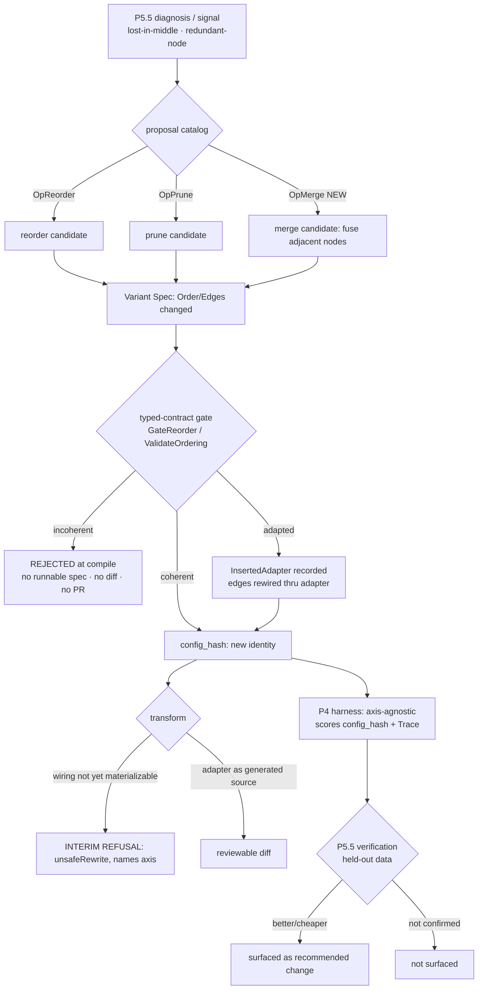

# PRD — P15: Workflow / Node-Wiring Optimization (turning the graph's shape into an optimization axis)

| Field | Value |
|---|---|
| Phase / Milestone | P15 / M18 |
| Target window | Two waves: 15a node-wiring operators (merge/reorder/prune), then 15b wiring-safety as a first-class gate |
| Lead role(s) | System Designer + Backend (co-leads) |
| Supporting role(s) | AI Engineer, QA Engineer |
| Status | Draft |
| OpenSpec change | `p15-workflow-wiring-optimization` |
| Related | [P2 — Config & Runtime](P2-config-runtime.md) · [P4 — Eval Harness](P4-eval-harness.md) · [P5.5 — Proposals & Verification](P5.5-proposals-verification.md) · [ADR-001](../adr/ADR-001-source-transformation-apply-model.md) |

> **Money-in-git rule.** No dollar amounts, percentages, or price bands appear in this document. Plans
> are referred to by **name only** — Free / Team / Business / Enterprise.

## 1. Summary

The platform treats a target codebase's LLM calls as a graph of nodes, and it already optimizes each
node's *content* across four dimensions — model, prompt, skills, context
([`internal/variantspec/spec.go:42-47`](../../internal/variantspec/spec.go)). But the graph's **shape**
— which node runs, in what order, wired to which neighbour — is where a large class of real wins lives:
two adjacent calls one model can subsume in one, a node whose output nothing downstream reads, an
ordering that buries the decisive context in the middle of a long prompt. The structural axis exists on
the Variant Spec today (`VariantSpec.Order` and `VariantSpec.Edges`,
[`spec.go:253-258`](../../internal/variantspec/spec.go)), it is **identity-bearing** in `config_hash`,
and two of its operators are real: `OpReorder` and `OpPrune` are implemented and registered in the
proposal catalog ([`internal/proposal/catalog.go:175-199`, `:326-344`](../../internal/proposal/catalog.go)).

What is missing is the rest of the axis. **`OpMerge` is a reserved constant with a gain prior and no
implementation** — it appears at [`operator.go:46`](../../internal/proposal/operator.go) and
[`gain.go:20,29`](../../internal/proposal/gain.go) but has no `mergeOp` and is **absent from
`DefaultCatalog()`**. The reorder operator does only a single adjacent swap of a lost-in-middle node
([`catalog.go:193-198`](../../internal/proposal/catalog.go)); free rewiring — parallelizing independent
nodes, general re-ordering — is not proposed by anything. And no wiring change is yet materialized as
source: the transform engine emits model and prompt edits and **refuses** skills and context
([`internal/transform/rewrite.go:388,417`](../../internal/transform/rewrite.go)); it emits nothing for
Order/Edges/adapters at all.

P15 turns wiring into a **full optimization axis** and makes its safety a **first-class requirement**.
The `node-wiring` capability implements `OpMerge` (fuse adjacent nodes when one model call can subsume
two) and free edge rewiring (reorder/parallelize independent nodes, prune dead nodes), each proposal
producing a Variant Spec whose `Order`/`Edges` change and therefore a new `config_hash`. The
`wiring-safety` capability promotes the typed-contract coherence gate — already the exact behavioral
example [`openspec/AGENTS.md:87`](../../openspec/AGENTS.md) cites — into a named requirement: a Variant
Spec whose reordering or rewiring violates a typed I/O contract **SHALL be rejected at compile**, unless
a catalogued adapter reconciles the mismatch, in which case the adapter insertion **ships in the same
reviewable diff**. Milestone **M18 — the graph's shape is optimizable and safe by construction** means a
merge or a reorder is surfaced only when P5.5 verification shows it is better or cheaper on held-out
data, and never when it would produce a workflow that does not type-check.

**Honest status.** This axis is **PARTIAL**. Ordering **EXISTS** end to end (spec → gate → adapter
insertion → config_hash). Free rewiring is **PARTIAL** (reorder is a single swap; prune rewires
neighbours; parallelization and general rewiring are unbuilt). `OpMerge` is **reserved, UNIMPLEMENTED**.
Source-level materialization of any wiring change is **ABSENT** (the transform engine emits none), so
P15 carries an explicit **interim refusal** for it.

## 2. Problem & context

The four content dimensions and the structural axis are not symmetric today, and the asymmetry is the
problem this phase closes.

- **The structural axis is modeled but half-operated.** `VariantSpec.Order`/`Edges` are first-class and
  identity-bearing ([`spec.go:253-258`](../../internal/variantspec/spec.go)); `Reorder` and the
  `GateReorder` coherence check are complete ([`internal/variantspec/rearrange.go`](../../internal/variantspec/rearrange.go));
  `OpReorder` and `OpPrune` are catalogued operators
  ([`catalog.go:175,326`](../../internal/proposal/catalog.go)). So the machinery to *propose, validate,
  and hash* a wiring change is all present — but the catalog proposes only two narrow moves, and the one
  operator that would fuse work is not built.
- **`OpMerge` is a promise, not a capability.** The constant exists
  ([`operator.go:46`](../../internal/proposal/operator.go)) and carries a gain prior and a mutating-flag
  in `gain.go` ([`:20,:29`](../../internal/proposal/gain.go)), which is exactly the shape of a reserved
  slot: the *identity* of the operator is fixed so a proposal row can name it, but `DefaultCatalog()`
  does not list a `mergeOp` and no `Propose` produces a merge candidate. A user diagnosing two redundant
  adjacent calls has no operator that fuses them.
- **"Free rewiring" is one swap.** `reorderOp.Propose` moves a single lost-in-middle node one position
  earlier ([`catalog.go:193-198`](../../internal/proposal/catalog.go)). That is the minimal correct move
  for one taxonomy code, but the axis the platform advertises — *"re-order nodes"*,
  [`openspec/project.md:6`](../../openspec/project.md) — implies more: nodes with no data dependency
  between them can run in parallel or in either order, and the optimizer should be able to explore that
  space, not just nudge one node.
- **Wiring changes are hashed and gated but not yet applied to source.** The transform engine's honest
  boundary is *refuse until safe*: model and prompt emit real edits; skills and context return
  `unsafeRewrite` ([`rewrite.go:388,417`](../../internal/transform/rewrite.go)). Wiring is not even at
  that line — no rewriter looks at `Order`/`Edges`. A resolved spec whose wiring differs from the
  discovered graph must therefore be **refused at transform**, not silently executed as if the wiring
  were unchanged; otherwise the eval would score a configuration whose `config_hash` claims a shape the
  running code does not have.
- **Safety here is not a footnote — it is the load-bearing requirement.** Rearranging a graph can break
  it in a way content edits cannot: node B may consume a field only A produced, and moving B before A, or
  pruning A, makes B's input undefined. The typed-contract gate already exists to catch exactly this
  ([`internal/typedcontract/adapter.go:61-84`](../../internal/typedcontract/adapter.go),
  `GateReorder` at [`rearrange.go:52`](../../internal/variantspec/rearrange.go)), and the OpenSpec format
  contract itself uses *"reject a Variant Spec whose node ordering violates a typed I/O contract"* as its
  canonical example of a behavioral requirement ([`AGENTS.md:87`](../../openspec/AGENTS.md)). P15 makes
  that example a shipped, named requirement rather than a doc illustration.

**Upstream state assumed.** **P1** (discovery and the Workflow IR whose nodes and edges this axis
rearranges). **P2** (the Variant Spec, `Resolve`, and `config_hash` that `Order`/`Edges` already feed).
**P3** (the typed-contract catalog and I/O schemas the coherence gate reads). **P4** (the axis-agnostic
eval harness that scores a wiring-changed `config_hash` with no change of its own). **P5.5** (diagnosis,
the operator catalog, and the priors this phase extends with `OpMerge`; the verification that decides
whether a wiring proposal is surfaced at all). No P15 requirement edits any of these; they are consumed.

## 3. Goals & non-goals

### Goals

- **G1. Wiring is a full optimization axis, not two narrow moves.** The proposal catalog SHALL propose
  node **merge**, free **reorder** (including parallelizing independent nodes), and **prune**, each as a
  candidate Variant Spec whose `Order`/`Edges` differ from the parent.
- **G2. `OpMerge` is implemented, not reserved.** A `mergeOp` SHALL exist and be registered in
  `DefaultCatalog()`, fusing two adjacent nodes into one when a single model call can subsume both,
  producing a Variant Spec whose absorbed node is dropped from `Order` and whose `Edges` are rewired
  through the survivor.
- **G3. A wiring change is a new configuration.** Because `Order` and `Edges` are identity-bearing
  ([`spec.go:253-258`](../../internal/variantspec/spec.go)), every merge/reorder/prune SHALL yield a new
  `config_hash` and be scored as a distinct configuration — with **no eval or scoring change required**,
  because the harness consumes only `config_hash` + `Trace`.
- **G4. Determinism.** The same base spec and the same diagnosis/signal SHALL produce the same candidate
  `Order`/`Edges`, the same inserted adapters, the same `config_hash`, and the same diff — on every run.
- **G5. A wiring change is surfaced only when verified better or cheaper.** A produced wiring candidate
  is not a claim; it SHALL enter the ranked, user-facing set only after **P5.5** verification shows it is
  better or cheaper on **held-out** data. Diagnosis proposes; verification decides.
- **G6. Reordering/rewiring that violates a typed I/O contract SHALL be rejected at compile.** No diff,
  no codemod, no pull request is generated from an incoherent ordering. This is
  [`AGENTS.md:87`](../../openspec/AGENTS.md)'s example, made a shipped requirement.
- **G7. A catalogued adapter may reconcile a mismatch — and it ships in the same diff.** When the
  typed-contract catalog can bridge a producer→consumer mismatch, the ordering is admitted, the adapter
  is recorded as an **explicit** `InsertedAdapter` node, and its generated source appears in the same
  reviewable diff — never a hidden runtime coercion.
- **G8. No adapter drops a consumer-required field.** An adapter SHALL be admissible only if its schemas
  satisfy both producer and consumer; one that would silently drop a required field SHALL be rejected.
- **G9. Interim refusal for un-materializable wiring.** Until the transform engine emits source for a
  wiring change, a resolved spec whose `Order`/`Edges` differ from the discovered wiring SHALL be
  **refused at transform** (`unsafeRewrite`), naming the axis — never silently dropped nor applied as a
  no-op that would let a wiring `config_hash` be scored against unchanged code.

### Non-goals (deferred or owned elsewhere)

- **Source-level codemod for wiring** — a rewriter that physically re-orders, fuses, or deletes call
  sites in the target source. That is the hard transform work
  ([`rewrite.go`](../../internal/transform/rewrite.go)/`rewrite_span.go`) and is deliberately **out of
  15a/15b**; until it lands, G9's interim refusal holds. Tracked as its own follow-on.
- **New eval metrics or a wiring-specific scorer.** The harness is axis-agnostic
  ([`internal/evalharness/evaluator.go`](../../internal/evalharness/evaluator.go)); a wiring-changed
  `config_hash` is scored by the existing metrics with no addition. P15 registers no bespoke metric.
- **Changing the `config_hash` contract.** `Order`/`Edges` already participate; P15 adds no field to the
  hashed configuration and preserves P0's golden vectors byte-for-byte.
- **Cross-workflow or whole-graph rewrites.** P15 rearranges within one discovered workflow's node set;
  splitting or merging *workflows* is not in scope.
- **Speculative parallel execution at runtime.** Marking independent nodes parallelizable is a
  *structural* proposal scored like any other; P15 does not build a parallel executor.
- **The diagnosis taxonomy.** P15 consumes the frozen P4.5 codes and P5.5 signals; it invents no new
  cause codes (redundancy arrives as a `Signal`, exactly as `OpPrune` already consumes `SignalRedundantNode`).

## 4. Users & personas

| Persona | What P15 is for them | What breaks without it |
|---|---|---|
| **AI engineer optimizing a workflow** (primary) | The optimizer proposes fusing two redundant calls, parallelizing independent ones, or dropping a dead node — and only surfaces the ones a held-out run confirms. | The graph's shape is frozen; every win has to be found and hand-applied, and the tool that promises to "re-order nodes" nudges one node one step. |
| **System designer / reviewer** | A wiring change arrives as a diff whose reordering is type-checked, with any bridging adapter visible as generated source in the same diff. | A rearranged graph reaches review with no evidence it type-checks, and coercions hide between nodes. |
| **Platform engineer running the catalog** | `OpMerge` is a real catalog row with a prior, so proposals are complete and rankable alongside the content operators. | A reserved constant advertises a capability the catalog cannot produce. |
| **QA engineer** | The compile gate can be made to **go red**: an incoherent reorder yields *no* runnable spec, provably. | "It's validated" is a claim no test can fail, which means it is decoration. |

Non-personas: the **end user of the customer's own LLM product** (P15 never changes runtime behavior a
customer's users see except through a verified, merged delta); **operators** (P8) — wiring optimization
is a customer-console concern.

## 5. User stories / jobs-to-be-done

**AI engineer**
- As an AI engineer, I want the optimizer to **propose merging two adjacent calls** one model can do in
  one, so that I stop paying for a hop that buys nothing.
- As an AI engineer, I want it to **parallelize or reorder independent nodes**, so that ordering stops
  being a hand-tuned constant.
- As an AI engineer, I want a proposed reorder **surfaced only when a held-out run confirms it is better
  or cheaper**, so that I am not handed a list of rearrangements I have to evaluate myself.

**System designer / reviewer**
- As a reviewer, I want a rearranged graph to **arrive already type-checked**, so that "does this still
  wire up?" is answered before I read the diff, not after it merges.
- As a reviewer, I want any **bridging adapter to be visible generated source** in the same diff, so that
  no coercion is hidden between two nodes.

**Platform engineer**
- As a platform engineer, I want `OpMerge` to be a **catalogued operator with a prior**, so that merge
  candidates rank against model/prompt/context ones through the same machinery.

**QA engineer**
- As a QA engineer, I want to write a test that **feeds an incoherent ordering and asserts no runnable
  spec is produced**, so that the safety gate is a fence that can go red.

## 6. Functional requirements

Numbered FRs; each maps 1:1 to an OpenSpec requirement under
`openspec/changes/p15-workflow-wiring-optimization/specs/`.

### Node wiring as an axis (capability `node-wiring`)

- **FR1.** The proposal catalog SHALL provide a **merge** operator (`OpMerge`), registered in
  `DefaultCatalog()`, that fuses **two adjacent nodes** into one when a single model call can subsume
  both, producing a candidate Variant Spec.
- **FR2.** A merge candidate SHALL produce a Variant Spec whose **`Order` drops the absorbed node** and
  whose **`Edges` are rewired through the surviving node** (the absorbed node's inbound edges retarget
  the survivor; its outbound edges re-source from the survivor), inheriting all other per-node overrides
  unchanged.
- **FR3.** The catalog SHALL provide **free edge rewiring**: reordering independent nodes (including
  marking data-independent nodes parallelizable) and **pruning** a dead node, each producing a candidate
  Variant Spec via the `Reorder`/prune derivation, with only wiring moved and per-node overrides
  inherited.
- **FR4.** Every wiring candidate SHALL be **derived**, never mutated in place: it SHALL carry
  `ParentVariantID` lineage and leave the parent spec unchanged (as `Reorder` already does,
  [`rearrange.go:18-31`](../../internal/variantspec/rearrange.go)).
- **FR5.** A wiring change SHALL be **identity-bearing**: because `Order` and `Edges` participate in
  `config_hash` ([`spec.go:253-258`](../../internal/variantspec/spec.go)), a merge/reorder/prune SHALL
  yield a `config_hash` distinct from its parent, so the harness scores it as a distinct configuration
  with no eval-side change.
- **FR6.** Wiring proposals SHALL be **deterministic**: the same base spec and the same diagnosis/signal
  SHALL yield the same candidate `Order`/`Edges`, the same absorbed/pruned node choice, and the same
  `config_hash`.
- **FR7.** A produced wiring candidate SHALL be **surfaced to the user only after P5.5 verification**
  shows it better or cheaper on held-out data. A candidate that verification does not confirm SHALL NOT
  be presented as a recommended change.
- **FR8.** Until source-level materialization of wiring exists, a **resolved spec whose `Order`/`Edges`
  differ from the discovered wiring SHALL be refused at transform** with an `unsafeRewrite`-class error
  that names the wiring axis. It SHALL NOT be silently dropped, and SHALL NOT be applied as a no-op that
  would let a wiring `config_hash` be scored against unchanged source.

### The coherence gate as a requirement (capability `wiring-safety`)

- **FR9.** A candidate ordering SHALL be validated by the **typed-contract coherence gate**
  (`GateReorder` → `ValidateOrdering`, [`rearrange.go:52`](../../internal/variantspec/rearrange.go))
  **before any codemod is generated**.
- **FR10.** A Variant Spec whose reordering or rewiring **violates a typed I/O contract SHALL be rejected
  at compile**: the gate returns **no runnable spec**, and no diff, codemod, or pull request is generated
  from it. (This is [`AGENTS.md:87`](../../openspec/AGENTS.md)'s canonical example, made a requirement.)
- **FR11.** When a **catalogued adapter** reconciles a producer→consumer mismatch, the ordering SHALL be
  admitted (`adapted`), the adapter recorded as an explicit **`InsertedAdapter`** node on the spec
  ([`spec.go:213-229`](../../internal/variantspec/spec.go)), and its edges rewired
  producer→adapter→consumer ([`rearrange.go:66-89`](../../internal/variantspec/rearrange.go)).
- **FR12.** An adapter SHALL be admissible **only if it drops nothing the consumer requires**: its
  `InSchema` must be satisfied by the producer and its `OutSchema` must satisfy the consumer
  ([`adapter.go:73-82`](../../internal/typedcontract/adapter.go)). An adapter that would silently drop a
  consumer-required field SHALL be rejected, and the ordering rejected with it.
- **FR13.** Adapter insertion SHALL **ship in the same reviewable diff**: the inserted adapter appears in
  the spec's node list and its diff against the parent, carrying its own `io_contract`, and is
  materialized as generated source — never a hidden runtime coercion.
- **FR14.** Adapter **identity SHALL be deterministic**: adapter node ids are derived from the edge and
  kind ([`rearrange.go:91-93`](../../internal/variantspec/rearrange.go)) and the catalog match order is
  fixed ([`adapter.go:61-71`](../../internal/typedcontract/adapter.go)), so the same reorder yields the
  same inserted adapters and the same `config_hash` on every evaluation.

## 7. Non-functional requirements

| # | Requirement | Target |
|---|---|---|
| **NFR1** | **Determinism** | A given base spec + diagnosis/signal produces a byte-identical candidate spec and an identical `config_hash` across processes and machines — asserted, not assumed (mirrors the existing reorder determinism test). |
| **NFR2** | **`config_hash` participation** | Any merge/reorder/prune changes `config_hash`; a wiring change that resolved to the *same* configuration (e.g. a no-op reorder) hashes identically. A no-binding/no-wiring spec still hashes byte-identically to today — P0 golden vectors unchanged. |
| **NFR3** | **Fail-closed safety gate** | An incoherent ordering yields **no runnable spec** (`GateReorder` returns `(nil, verdict)`), so a caller physically cannot hand a rejected ordering to the transform engine. The gate must be able to **go red** in a test. |
| **NFR4** | **Interim refusal is observable** | A wiring change that cannot yet be materialized is refused at transform with a typed error naming the axis, and the refusal is visible in the transform result — never a silent drop. |
| **NFR5** | **Eval-agnostic** | P15 adds no metric, no scorer, and no Dimension-label branch to the harness; a wiring-changed `config_hash` is scored by the existing `RunMetrics`. |
| **NFR6** | **Adapter reviewability** | Every inserted adapter is present as generated source in the diff a reviewer reads; no coercion exists that is not in that diff. |
| **NFR7** | **Verification-gated surfacing** | No wiring candidate is presented as a recommended change without a P5.5 verified delta on held-out data; a produced-but-unverified candidate is labelled exploratory, never a claim. |

## 8. System design summary

### 8.1 The axis, from diagnosis to a scored, safe configuration



**Structure crosses to the score; nothing about the axis reaches the harness as a label.** The harness
consumes `config_hash` + `Trace` only ([`evaluator.go`](../../internal/evalharness/evaluator.go)), so a
wiring-changed configuration is scored with no eval change — the whole reason a new axis "needs only to
land its effect in `ResolvedConfig` → `config_hash`."

### 8.2 EXISTS / PARTIAL / ABSENT ledger (honesty)

| Surface | State | Evidence |
|---|---|---|
| `VariantSpec.Order` / `Edges`, identity-bearing | **EXISTS** | [`spec.go:253-258`](../../internal/variantspec/spec.go) |
| `InsertedAdapter` on the spec | **EXISTS** | [`spec.go:213-229`](../../internal/variantspec/spec.go) |
| `Reorder` derivation + `GateReorder` coherence gate + adapter rewiring | **EXISTS** | [`rearrange.go`](../../internal/variantspec/rearrange.go) |
| Typed-contract catalog + `FindAdapter` (admissibility both sides) | **EXISTS** | [`adapter.go:61-84`](../../internal/typedcontract/adapter.go) |
| `OpReorder` operator (single adjacent swap) | **EXISTS (narrow)** | [`catalog.go:175-199`](../../internal/proposal/catalog.go) |
| `OpPrune` operator (neighbour rewire) | **EXISTS** | [`catalog.go:326-344`](../../internal/proposal/catalog.go) |
| `OpMerge` operator | **RESERVED / UNIMPLEMENTED** | const [`operator.go:46`](../../internal/proposal/operator.go); prior [`gain.go:20,29`](../../internal/proposal/gain.go); **not** in `DefaultCatalog()` |
| Free reorder / parallelize independent nodes | **PARTIAL** | reorder is one swap; no parallelization operator |
| Source-level materialization of any wiring change | **ABSENT** | transform emits model/prompt only; refuses skills/context ([`rewrite.go:388,417`](../../internal/transform/rewrite.go)); nothing reads `Order`/`Edges` |

### 8.3 Decisions, with what was rejected

| # | Decision | Rejected alternative | Why (八级法则) |
|---|---|---|---|
| **D1** | **`OpMerge` fuses only two *adjacent* nodes, and only where the survivor's model can subsume both** | Merge any node subset the diagnosis flags, across gaps in the order | **L2 稳定 + L1 安全.** A non-adjacent or many-to-one merge changes data flow in ways the coherence gate can admit but a reviewer cannot follow; adjacency keeps the rewrite a local, checkable edit and keeps the resulting `Edges` a mechanical rewire, not a re-plan. Correctness of the graph (L2) outranks the reach of the operator (L8). |
| **D2** | **Every wiring candidate is *derived* with lineage; the parent is never mutated** | Mutate `Order`/`Edges` on the base spec in place for speed | **L5 不可演进.** In-place mutation destroys the parent lineage the compare view and rollback depend on; a derived candidate with `ParentVariantID` is the shape the whole re-arrangement design already uses ([`rearrange.go:18`](../../internal/variantspec/rearrange.go)). |
| **D3** | **Incoherent orderings are rejected at compile — no runnable spec, ever** | Emit the diff and let the build fail downstream | **L1 安全.** A wiring change that does not type-check must be caught before a codemod, diff, or PR exists; `GateReorder` returning `(nil, verdict)` makes it *physically impossible* to hand a rejected ordering to the transform engine ([`rearrange.go:52-56`](../../internal/variantspec/rearrange.go)). Catching it later trades a safety guarantee for the convenience of not gating early. |
| **D4** | **A bridging adapter is explicit generated source in the same diff** | Insert a runtime coercion shim that reconciles the mismatch invisibly | **L1 安全 + L3 UX.** The platform's core rule is a codemod, never a runtime shim; an adapter that is not in the diff is a value change hidden from review. Recording it as an `InsertedAdapter` node with its own `io_contract` keeps "an indirection never hides a value from review." |
| **D5** | **Un-materializable wiring is refused at transform, naming the axis** | Let the transform silently no-op the wiring and rewrite only the node content | **L1 安全 + L2 稳定.** A silent no-op would let a spec whose `config_hash` claims a reordered graph be scored against source that was never reordered — a false measurement, the worst outcome for a system whose principle is *verification decides*. Refusal is the honest `refuse-until-safe` pattern the engine already uses for skills/context. |
| **D6** | **No new eval metric; wiring is scored by the axis-agnostic harness** | Add a wiring-specific quality metric | **L6 不可扩展 + single source of truth.** The harness consumes `config_hash` + `Trace`; a bespoke metric would be a second definition of "better" for one axis. Landing the effect in `config_hash` is sufficient and keeps one scoring truth. |

### 8.4 Data model additions

**None to the hashed configuration.** `Order`, `Edges`, and `InsertedAdapter` already exist on
`VariantSpec` and already participate in (or are deliberately excluded from) `config_hash`. P15 adds:

```
mergeOp                  // new proposal.Operator: Kind()=OpMerge, HandlesSignal()=SignalRedundantNode,
                         // Propose() → a candidate that drops the absorbed node and rewires Edges thru the survivor
DefaultCatalog += mergeOp   // one new row in the dispatch table (catalog.go:17-31) — never a switch edit
```

No new registry `Kind`, no new `Dimension` const, no `NodeOverride` field, no DB table. The wiring axis
lives entirely in `Order`/`Edges`/`InsertedAdapter`, which is why it needs no `config_hash` change — the
one-way-door decisions are the **`OpMerge` semantics** and the **adapter-insertion posture**, recorded in
`decisions.md`.

## 9. Design by role lens

**System Designer (co-lead) — *the axis is already modeled; the discipline is to not remodel it.***
The temptation in P15 is to treat wiring as a new dimension and walk the eight-step "add an axis"
checklist. It is not one. `Order`/`Edges` are on the spec, hashed, and gated; the checklist's hard step
7 (a per-dimension rewriter) is exactly the part P15 defers behind an interim refusal. So the design
work is narrow and sharp: add **one** catalog row (`mergeOp`), specify its rewrite as a *mechanical
edge-rewire* rather than a re-plan (D1), and keep every candidate derived with lineage (D2). The
one-way doors are named up front in `decisions.md` — the merge semantics (adjacent-only, survivor
subsumes) and the adapter posture (explicit source, never a shim) — because both become contracts the
moment a stored proposal row or a shipped diff depends on them. Everything else is reuse.

**Backend (co-lead) — *the gate is the product; the operator is the easy half.***
`mergeOp.Propose` is small: pick the adjacent pair the redundancy signal names, build a derived spec via
the same `Reorder`/rewire helpers, drop the absorbed node, retarget its edges through the survivor.
The load-bearing code is already written and must stay the single path: `GateReorder` validates *before*
any transform, returns `(nil, verdict)` on rejection, and records inserted adapters on the `adapted`
verdict ([`rearrange.go:52-89`](../../internal/variantspec/rearrange.go)). Backend's job is to route
every new operator through that one gate — a merge candidate is validated exactly as a reorder candidate
is — so there is no second, weaker safety path. And the interim refusal (FR8) must be a *typed* error at
transform that names the wiring axis, so a wiring `config_hash` can never be scored against unchanged
source; that refusal is the honest analogue of `refuseSkills`/`refuseContext`.

**AI Engineer (support) — *a merge is a hypothesis, and only held-out data confirms it.***
`OpMerge` earns a prior in `gain.go` because it competes for evaluation budget against model and prompt
operators; its prior says "worth trying when two adjacent calls look redundant," not "this is a win." The
harness scores the merged `config_hash` with the same multi-seed, confidence-interval machinery as every
other candidate, and the merge is **surfaced only when P5.5 verification** shows it better or cheaper on
held-out data (FR7). A merge that reads "obviously redundant" but scores worse — because the second call
was quietly correcting the first — is exactly what the verification gate is for. Diagnosis proposes; the
score decides.

**QA Engineer (support) — *the safety gate must be a fence that can go red.***
The two claims that matter cannot be read from code. First, **rejection**: feed an ordering that
consumes a field before it is produced and assert `GateReorder` returns **no runnable spec** — the
existing `TestGateReorder_RejectedYieldsNoRunnableSpec` is the shape; P15 extends it to merge and prune
candidates. Second, **adapter reviewability**: an `adapted` verdict must record the adapter on the spec
*and* the adapter must appear in the diff; a test asserts the inserted adapter is present in both, so a
coercion cannot hide. Determinism gets a test too — the same reorder yields the same adapter ids and the
same `config_hash` — because "deterministic" is a promise a re-run can falsify. And the interim refusal
(FR8) gets a case: a wiring-differing spec at transform returns the typed refusal, not a silent no-op.

## 10. Dependencies

**Requires**
- **P1** — the Workflow IR (nodes, edges, per-call I/O the coherence gate reads).
- **P2** — the Variant Spec, `Resolve`, and `config_hash` that `Order`/`Edges` feed.
- **P3** — the typed-contract catalog and I/O schemas ([`internal/typedcontract`](../../internal/typedcontract/)).
- **P4** — the axis-agnostic eval harness and scoring that score a wiring-changed `config_hash`.
- **P5.5** — diagnosis, the operator catalog and priors this phase extends, and the verification that
  gates surfacing.

**Unblocks**
- The **structural axis becomes fully operable** — merge/reorder/prune are all proposable and rankable
  alongside the content operators.
- A **source-level wiring codemod** (the deferred follow-on) has a complete, gated, hashed upstream to
  build on: it only has to replace the interim refusal with real emission.

## 11. Risks & mitigations

| Risk | Owner | Mitigation |
|---|---|---|
| A merge changes behavior the gate admits but a reviewer cannot follow | System + Backend | Adjacent-only, survivor-subsumes semantics (D1); the merged spec's `Edges` are a mechanical rewire, and the diff is local. |
| An incoherent ordering reaches the transform engine | Backend + QA | `GateReorder` returns `(nil, verdict)`; a caller physically cannot pass a rejected ordering onward (NFR3); test asserts no runnable spec (FR10). |
| A bridging adapter silently drops a consumer-required field | Backend | `FindAdapter` re-validates both schemas and refuses a non-satisfying adapter ([`adapter.go:73-82`](../../internal/typedcontract/adapter.go)) (FR12). |
| A coercion hides between two nodes | System + QA | Adapter is an explicit `InsertedAdapter` node in the diff (FR13); test asserts presence in spec **and** diff. |
| A wiring `config_hash` is scored against unchanged source | Backend | Interim refusal at transform naming the axis (FR8/NFR4); no silent no-op path exists. |
| A merge is surfaced that scores worse | AI Engineer | Verification-gated surfacing on held-out data (FR7/NFR7); a produced candidate is exploratory until confirmed. |
| The wiring axis quietly acquires a bespoke metric | System | NFR5 — the harness stays axis-agnostic; no metric, no Dimension-label branch. |
| `OpMerge`'s stored semantics change after proposals reference it | System | `decisions.md` fixes the semantics as a one-way door before any `mergeOp` ships. |

## 12. Rollout & test strategy

**Wave 15a — node-wiring operators.** Implement `mergeOp` and register it; broaden reorder toward free
rewiring (parallelize independent nodes) and confirm prune's neighbour-rewire; every candidate derived
with lineage, hashed, and routed through the existing gate. Ends when merge/reorder/prune all produce
gated, hashed candidates the harness scores.

**Wave 15b — wiring-safety as a first-class requirement.** Promote the coherence gate to a named
requirement set: reject-at-compile for contract violations, adapter reconciliation recorded and shipped
in the diff, adapter admissibility, deterministic adapter identity, and the interim refusal for
un-materializable wiring.

**How correctness is proven.**
1. **Merge shape** — a merge candidate drops the absorbed node from `Order` and rewires `Edges` through
   the survivor; parent unchanged; `config_hash` differs.
2. **Determinism** — the same base + signal yields the same candidate spec, adapter ids, and
   `config_hash` across runs.
3. **Reject-at-compile** — an ordering that consumes before it produces yields **no runnable spec** and
   generates no diff.
4. **Adapter reconciliation** — an `adapted` verdict records the adapter on the spec and its source in the
   diff; a non-satisfying adapter is refused and the ordering with it.
5. **Interim refusal** — a wiring-differing resolved spec is refused at transform with a typed error
   naming the axis, never silently no-op'd.
6. **Eval-agnostic** — a wiring-changed `config_hash` is scored by the existing harness with no P15
   eval change.
7. **Verification-gated surfacing** — a produced merge is presented as a recommended change only after a
   P5.5 verified delta on held-out data.

## 13. Success metrics & acceptance criteria (M18 exit checklist)

- [ ] **A1.** `OpMerge` is implemented as `mergeOp` and registered in `DefaultCatalog()`; a redundant
      adjacent pair yields a merge candidate (G2, FR1). *判据:* the catalog returns a merge candidate for
      the fixture; before P15 it returns none.
- [ ] **A2.** A merge candidate's `Order` drops the absorbed node and its `Edges` are rewired through the
      survivor, parent unchanged (FR2, FR4). *判据:* asserted on the derived spec; the parent's `Order`
      is byte-identical after.
- [ ] **A3.** Free reorder (including parallelizing independent nodes) and prune each produce a gated
      candidate (G1, FR3). *判据:* candidates exist for both; each passes the gate on a coherent fixture.
- [ ] **A4.** A merge/reorder/prune yields a `config_hash` distinct from its parent (G3, FR5, NFR2).
      *判据:* hashes differ; a no-op reorder hashes identically.
- [ ] **A5.** Wiring proposals are deterministic — same base + signal → identical candidate spec and
      `config_hash` (G4, FR6, NFR1). *判据:* two runs byte-identical.
- [ ] **A6.** An ordering that violates a typed I/O contract yields **no runnable spec** and no diff
      (G6, FR9, FR10, NFR3). *判据:* `GateReorder` returns `(nil, verdict)`; the gate **goes red** on the
      incoherent fixture.
- [ ] **A7.** An `adapted` verdict records the adapter as an explicit `InsertedAdapter` node and rewires
      edges through it (G7, FR11). *判据:* the adapter appears in the spec's node list and edges.
- [ ] **A8.** A non-satisfying adapter is refused and the ordering rejected with it (G8, FR12). *判据:* an
      adapter that would drop a required field is not admitted; the ordering yields no runnable spec.
- [ ] **A9.** An inserted adapter appears as generated source in the same reviewable diff (FR13, NFR6).
      *判据:* the diff contains the adapter node; no coercion exists outside the diff.
- [ ] **A10.** Adapter identity is deterministic — same reorder → same adapter ids and `config_hash`
      (FR14, NFR1). *判据:* two runs identical.
- [ ] **A11.** A resolved spec whose wiring differs from the discovered graph is refused at transform
      with a typed error naming the wiring axis, never a silent no-op (G9, FR8, NFR4). *判据:* the
      transform result carries the refusal; no diff is emitted.
- [ ] **A12.** A wiring-changed `config_hash` is scored by the existing harness with no P15 eval or
      scoring change (NFR5). *判据:* no metric added; the harness consumes `config_hash` + `Trace` only.
- [ ] **A13.** A produced wiring candidate is surfaced as a recommended change only after a P5.5 verified
      delta on held-out data (G5, FR7, NFR7). *判据:* an unverified candidate is labelled exploratory,
      never presented as a claim.

## 14. Open questions

1. **How broadly should "free reorder" explore in 15a?** The reorder operator today does one adjacent
   swap. Should 15a enumerate all data-independent permutations (bounded), or ship parallelization-marking
   plus the single swap and defer full enumeration? *Leaning:* parallelization-marking + bounded
   independent reorders; unbounded permutation is a search-cost question for P5.5, not this phase.
2. **Does `OpMerge` ever fuse more than two nodes?** D1 fixes adjacent-pair semantics. A chain of three
   redundant calls would merge pairwise across iterations. Is pairwise-across-iterations sufficient, or is
   a native n-ary merge worth the reviewability cost later? *Deferred; recorded in `decisions.md`.*
3. **When the source-level wiring codemod lands, what replaces the interim refusal?** FR8 is explicitly a
   placeholder for the deferred rewriter. The contract is that replacing it changes only the transform
   layer — the spec, gate, hash, and eval are already correct — but the exact rewriter surface
   (`rewrite.go`/`rewrite_span.go` dispatch for `Order`/`Edges`) is out of P15's scope and named as its
   unblocked follow-on.
