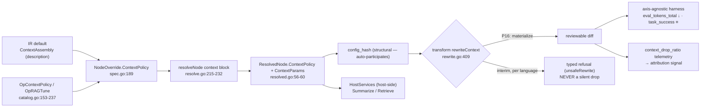

# PRD — P16: Context Strategy Optimization (make the richest modeled axis actually applicable)

| Field | Value |
|---|---|
| Phase / Milestone | P16 / M19 |
| Target window | ~Weeks 46–58 (two waves: 16a context-policy materialization, then 16b retrieval-tuning) |
| Lead role(s) | AI Engineer + Backend (co-leads) |
| Supporting role(s) | System Designer, QA Engineer |
| Status | Draft |
| OpenSpec change | `p16-context-strategy-optimization` |
| Related | [P3 — Context + Skills + Sandbox](P3-context-skills-sandbox.md) · [P4 — Eval Harness](P4-eval-harness.md) · [P4.5 — Attribution + Diagnosis](P4.5-attribution-diagnosis.md) · [P5.5 — Proposals + Verification](P5.5-proposals-verification.md) · [P10 — Prompt & Model Studio](P10-prompt-model-studio.md) |

> **Commercial position.** Context strategy is the axis with the clearest **token-cost** story: a
> variant that assembles less context per call produces fewer `eval_tokens_total` at equal
> `task_success`, and that reduction is a **verified** saving on the P5.5 ledger like any other. No new
> plan surface is introduced; this phase makes an axis the optimizer already models *deliverable*, so
> its gains flow through the existing Free / Team / Business / Enterprise entitlement and gainshare paths.
>
> **Money-in-git rule.** No dollar amounts, percentages, or price bands appear here. Plans are named
> only — Free / Team / Business / Enterprise. Cost is expressed as **tokens** and **observed spend**,
> never a currency figure.

## 1. Summary

Context is, in model terms, the **richest non-model axis in the whole platform** — and today the one
axis that cannot ship a single edit. The `Dimension` enum already contains `DimContext`
([`internal/variantspec/spec.go:46`](../../internal/variantspec/spec.go)); a node already carries a
`ContextPolicy` override ([`spec.go:189`](../../internal/variantspec/spec.go)); resolution already
binds it to a versioned registry entry and freezes `ContextPolicy` + `ContextParams` into the
`ResolvedNode` ([`internal/variantspec/resolve.go:215-232`](../../internal/variantspec/resolve.go),
[`resolved.go:56-60`](../../internal/variantspec/resolved.go)), so it auto-participates in
`config_hash`. Seven policies are registered and implemented behind one interface
([`internal/registry/context.go:29-33`](../../internal/registry/context.go),
[`context_policies.go`](../../internal/registry/context_policies.go)); loss telemetry
(`DropRatio` → `context_drop_ratio`) is emitted and already consumed by attribution as a
context-overflow signal ([`internal/telemetry/context_assembly.go:78`](../../internal/telemetry/context_assembly.go),
[`internal/attribution/signals.go:94`](../../internal/attribution/signals.go)). Two operators —
`OpContextPolicy` and `OpRAGTune` — already *propose* context variants
([`internal/proposal/catalog.go:153-237`](../../internal/proposal/catalog.go)).

Everything is modeled, resolvable, hashable, proposable, and scoreable — and then the codemod
**refuses**. [`internal/transform/rewrite.go:417`](../../internal/transform/rewrite.go) `refuseContext`
returns `unsafeRewrite` for every node carrying a context override, because *"context assembly is not a
call-site argument — it is how the surrounding code builds the message list."* A context proposal
resolves, hashes, and dies at transform. P16 is the phase that turns the platform's most elaborate
modeled axis into an **applied** one: it replaces the refusal with a real call-site **context
materialization** codemod, keeps the refusal as a *specified, testable* interim behavior per language
until each language's rewriter lands, and closes the RAG loop — top-k, chunk size, rerank, embedding —
as verified `OpRAGTune` proposals on held-out eval sets. Milestone **M19 — context is a first-class
applicable axis** means a context change reaches a customer's build as a reviewable diff, and a context
reduction is visible as fewer `eval_tokens_total` with no `task_success` regression.

## 2. Problem & context

The context axis is where the platform's honesty pattern is most visible and most costly. Six problems
block application, each mapping to a design commitment:

- **The axis is fully modeled and cannot emit one edit.** `DimContext` is a first-class dimension, a
  node's `ContextPolicy` resolves to a registered `(policy, params)` entry, and `ResolvedNode`
  freezes `ContextPolicy` + `ContextParams` so the effect is already in `config_hash`. Then
  [`rewrite.go:409-424`](../../internal/transform/rewrite.go) refuses: `rewriteContext` calls
  `refuseContext`, which returns `unsafeRewrite`. The Go engine and the tree-sitter span engine
  ([`rewrite_span.go`](../../internal/transform/rewrite_span.go)) both refuse. **A resolvable,
  hashable, scoreable context variant produces no diff.**
- **The refusal's reason is real, not laziness — and that is exactly why it is hard.** Context is not
  an argument to swap; it is the surrounding code that builds the message list. Discovery records it as
  a *description* (`inline_messages`, `inline_messages_with_tools`,
  [`internal/discovery/extract.go:239-244`](../../internal/discovery/extract.go)), not a locator.
  Materializing a policy means rewriting the code region that assembles the messages — a genuine
  codemod, per language, which is why it was deferred and why it is the hard part of every axis
  (the "add an axis" checklist's step 7).
- **The refusal names the wrong owner and was never built.** `refuseContext`'s message defers the
  rewrite to **P3** ([`rewrite.go:422`](../../internal/transform/rewrite.go)). P3 shipped the
  *policies* and their host-side `Assemble` ([`context_policies.go`](../../internal/registry/context_policies.go))
  but **not** the call-site codemod. The rewrite has no owner in code. P16 is that owner, and part of
  this phase is correcting the deferral pointer so a reader is not sent to a phase that does not build it.
- **A dropped override must never be silent.** The single worst failure for an eval platform is a
  variant that *looks* applied but whose context change was quietly discarded — it would be scored as
  the base configuration under a different `config_hash`, a false result. The interim refusal is
  therefore not a temporary gap to tolerate quietly; it is a **first-class requirement**: a node whose
  `ContextPolicy` is not yet call-site-applicable in its language SHALL be **refused at transform**,
  loudly, never dropped.
- **A lossy policy can raise quality-destroying drops that scoring alone punishes too late.** A
  `summarization` or `semantic-compaction` policy populates `DropRatio`
  ([`context_policies.go:218,339`](../../internal/registry/context_policies.go)); attribution already
  flags overflow from it. But nothing today makes a *proposal* inadmissible for exceeding a node's
  tolerance — the platform would happily generate, transform, and burn eval budget on a variant that
  drops the answer. Drop-loss must be a **scored, gated** signal, not only a post-hoc diagnosis.
- **The RAG loop is proposed but not tuned or verified as a loop.** `OpRAGTune` already emits
  candidates that raise top-k or swap retriever/embedding
  ([`catalog.go:218-237`](../../internal/proposal/catalog.go)). What is missing is the discipline that
  makes retrieval optimization trustworthy: retrieval is **non-deterministic** unless pinned, so a
  measurement run must fix the retriever and its parameters, and a retrieval change must be verified on
  a **held-out** eval set rather than the set it was tuned against, or the platform will ship overfit.

**Upstream state assumed.** **P0** (`config_hash` is purely structural, so `ContextPolicy` /
`ContextParams` already participate). **P2** (the codemod engine, the Go and tree-sitter rewriter
dispatch this phase extends). **P3** (the `Policy` interface, the seven registered policies, the
host-side `Assemble`, the `HostServices` gateway, and `Store.AddPolicy` this phase builds new policies
on). **P3.5** (the pattern classifier `RetrievalRAG` gate that keeps `OpRAGTune` / rerank admissible
only on retrieval nodes). **P4** (the axis-agnostic harness that scores a context variant from
`config_hash` + `Trace` with no context-specific change, and `eval_tokens_total` as the reduction
signal). **P4.5** (attribution's context-overflow signal, already fed by `context_drop_ratio`).
**P5.5** (proposals + verification — where a context variant becomes a *verified delta* and only then a
claim). **P10** (apply-mode: context is **code**, not data, so it is materialized inline and never
hidden from the diff).

## 3. Goals & non-goals

### Goals

- **G1. A context override produces a reviewable diff or a loud refusal — never a silent drop.** For a
  node whose `ContextPolicy` differs from its discovered assembly, the transform SHALL either emit a
  call-site materialization edit or **refuse at transform naming the node, the policy, and the
  language**. It SHALL NOT resolve, hash, and then discard the override.
- **G2. Context materialization is a real call-site codemod, per language.** The Go engine SHALL
  rewrite the message-assembly region of a call site so the resolved policy governs how the message
  list is built. Each additional language's rewriter lands independently; until it does, that language
  keeps the **specified interim refusal**.
- **G3. The interim refusal is a specified, tested behavior, not an accident.** A node carrying an
  un-applicable `ContextPolicy` SHALL be refused with a typed `unsafeRewrite` that names the node,
  the policy, and the reason, and this behavior SHALL have its own passing test per language until the
  rewriter replaces it.
- **G4. Context reduction is legible as tokens, not as a special metric.** A context variant that
  reduces assembled tokens SHALL show up as a lower `eval_tokens_total`
  ([`internal/evalharness/metricnames.go:27`](../../internal/evalharness/metricnames.go)) at
  non-regressing `task_success`, scored through the **same** axis-agnostic harness as any other axis —
  no new eval or scoring path.
- **G5. Context-loss is a scored, gated quality signal.** `DropRatio` SHALL be modeled as a
  first-class admissibility gate: a proposal whose resolved policy would drive a node's drop ratio past
  that node's declared tolerance SHALL be **inadmissible** — rejected before it consumes eval budget —
  and a materialized variant's observed drop SHALL be scoreable.
- **G6. New policies are additions behind the existing interface.** Warranted policies (e.g.
  `hierarchical-summary`, `structured-extraction`) SHALL be added via the `Policy` interface and
  `Store.AddPolicy` ([`internal/registry/store.go:41`](../../internal/registry/store.go)) — a new
  implementation and a registry row, never a schema change and never a new `Dimension`.
- **G7. Retrieval optimization is verified on held-out data.** `OpRAGTune` proposals (top-k, chunk
  size, rerank on/off, embedding model) SHALL be verified against a **held-out** eval set, and a tuning
  win measured only on the tuning set SHALL NOT be presentable as a verified delta.
- **G8. Retrieval is deterministic per measurement run.** A measurement run SHALL pin the retriever,
  its parameters, and the seed, so re-running the same `config_hash` at the same `source_revision`
  issues the **identical resolved retrieval request** — determinism at the resolved-request level, the
  reproducibility ceiling P3 already set for host-calling policies.
- **G9. Context assembly is code, materialized inline, never hidden.** Because context is *how the
  surrounding code builds the message list*, its materialization is **code** under P10's apply-mode
  rule; the resolved assembly SHALL ship in the same diff a reviewer reads, or the transform SHALL be
  rejected. There is no bound-mode indirection that hides a context change from review.
- **G10. No credential ever reaches a sandbox through a context policy.** A policy that needs a
  summarizer or retriever SHALL reach it only through the trusted-host `HostServices` gateway
  ([`context_policies.go:79-85`](../../internal/registry/context_policies.go)); the model/retrieval
  call SHALL execute host-side, never from a sandboxed node.

### Non-goals (explicitly deferred or owned elsewhere)

- **Node re-ordering as a fix for lost-in-middle** — that is the structural `Order` axis and
  `OpReorder` ([`catalog.go:186-203`](../../internal/proposal/catalog.go)), owned by **[P5](P5-contracts-rearrange-tracing.md)**.
  P16 changes *how a node assembles its own context*, not the graph.
- **Skills / tool binding at the call site** — the sibling refusal (`refuseSkills`,
  [`rewrite.go:388`](../../internal/transform/rewrite.go)) is its own axis and its own phase.
- **A new telemetry pipeline or a context-specific scorer.** Context reduction is read from the
  existing `eval_tokens_total`; drop is read from the existing `context_drop_ratio`. P16 adds no
  parallel metric family.
- **Authoring a retrieval corpus or standing up a vector store.** P16 *tunes* retrieval over a
  retriever the customer already has (`retriever_ref`); it does not build one.
- **Provider-exact token accounting.** The estimator is deterministic and monotonic
  ([`context_policies.go:393`](../../internal/registry/context_policies.go)); P16 optimizes on it and
  reconciles against measured `eval_tokens_total`, and does not promise tokenizer-exact byte counts.
- **A new `Dimension`.** `DimContext` already exists. P16 adds **no** enum member; this is the one axis
  the closed enum already names.

## 4. Users & personas

| Persona | What P16 is for them | What breaks without it |
|---|---|---|
| **AI engineer optimizing a long-context workflow** (primary) | Propose sliding-window / summarization / compaction / RAG-tune variants and get a *scored, shippable* diff — not a refusal. | The richest axis is a dead end: variants resolve and score in theory and never reach a build. |
| **Backend engineer owning the codemod** (primary) | A per-language context materialization with a specified interim refusal, so partial language coverage is honest rather than silent. | Either every context variant is refused forever, or a half-built rewriter drops overrides silently — the worst eval failure. |
| **System Designer** (support) | A drop-tolerance admissibility gate and a held-out-verification rule that keep a lossy or overfit context change out of a customer's build. | A summarizer that drops the answer, or a top-k tuned to its own eval set, ships as a "win". |
| **QA engineer** (support) | A gate that can go **red**: a refusal test per language, a drop-past-tolerance rejection test, and a held-out-vs-tuning-set separation test. | "Context works" is asserted from a green build over a codemod that refuses everything. |
| **Budget owner** (indirect, via P7/P9) | Context wins appear as reduced token spend on **linked** runs, with the same verified-savings discipline as any axis. | A token reduction the platform cannot apply is a saving nobody can bank. |

Non-personas: the end user of the customer's own LLM product; platform operators (P8). Context content
(prompt bodies, retrieved passages) never leaves the customer environment — the P11 boundary already
forbids it, and P16 adds nothing that would.

## 5. User stories / jobs-to-be-done

**AI engineer**
- As an AI engineer, I want a diagnosed context-overflow node to yield a *materialized, scored*
  summarization or windowing variant, so that I can see whether shrinking context keeps `task_success`
  before I ship it.
- As an AI engineer, I want a variant that would drop more context than a node can tolerate to be
  **refused before it runs**, so that eval budget is not spent proving an obviously-lossy change bad.
- As an AI engineer, I want a RAG top-k / rerank / embedding change verified on data it was **not**
  tuned on, so that a retrieval "win" is real and not overfit.

**Backend engineer**
- As the codemod owner, I want the context rewriter to land **per language**, with the un-built
  languages keeping a loud, specified refusal, so that partial coverage is a stated fact, not a silent
  drop.
- As the codemod owner, I want the resolved assembly to appear **in the diff**, so that a reviewer
  approves the actual message-building change rather than an opaque indirection.

**System Designer**
- As the System Designer, I want each new policy to be an addition behind the existing `Policy`
  interface and `Store.AddPolicy`, so that the registry and `config_hash` stay policy-generic and no
  one-way schema door is opened.

**QA engineer**
- As a QA engineer, I want a test that a context override on an un-built language **refuses** and is
  never silently dropped, and a test that a drop-past-tolerance proposal is rejected, so that both
  guarantees can be made to fail.

## 6. Functional requirements

Numbered FRs; each maps 1:1 to an OpenSpec requirement under
`openspec/changes/p16-context-strategy-optimization/specs/`.

### Context materialization (capability `context-policy`)

- **FR1.** For a node whose resolved `ContextPolicy` differs from its discovered context assembly, the
  transform SHALL either emit a call-site context-materialization edit or **refuse at transform**. It
  SHALL NOT produce a diff that silently omits the context change while reporting the variant's
  `config_hash`.
- **FR2.** The Go engine SHALL materialize a resolved context policy by rewriting the call site's
  message-assembly region so the assembled message list is the one the policy defines, deterministically
  given the policy, its params, the conversation, and the seed.
- **FR3.** A node carrying a `ContextPolicy` not yet call-site-applicable in its language SHALL be
  refused with a typed `unsafeRewrite` that names the node, the policy, and the reason. This interim
  refusal SHALL be specified and tested **per language** until that language's rewriter lands, and it
  SHALL NOT be a silent no-op.
- **FR4.** The refusal's reason and owner SHALL be accurate: it SHALL NOT direct a reader to a phase
  that does not implement the rewrite. (The current `refuseContext` text naming P3 is corrected to name
  the owning phase.)
- **FR5.** A materialized context change SHALL be **code** under P10's apply-mode rule: the resolved
  assembly SHALL appear in the same diff a reviewer reads. No apply mode SHALL hide a context change
  behind an indirection that omits the resolved values from review.
- **FR6.** A new context policy SHALL be added via the `Policy` interface (`Name`, `ParamsSchema`,
  `Assemble`) and registered through `Store.AddPolicy`. Adding a policy SHALL NOT change the registry
  schema, the `ContextSpec` shape, or the `Dimension` enum.
- **FR7.** `DropRatio` SHALL be modeled as a scored quality signal: a materialized lossy policy's
  observed drop SHALL be recorded per node per run through the existing `context_drop_ratio` telemetry
  and be available to scoring and diagnosis, distinguishing a measured `0.0` from an unmeasured lossless
  policy (the `Lossy` flag already distinguishes them,
  [`context_policies.go:47`](../../internal/registry/context_policies.go)).
- **FR8.** Each node SHALL carry an optional **drop tolerance**: a proposal whose resolved policy would
  drive that node's drop ratio past its tolerance SHALL be **inadmissible**. The tolerance SHALL be an
  additive, omit-when-absent attribute, so a node that declares none hashes byte-identically to a
  pre-P16 node.
- **FR9.** A context policy that requires a summarizer or other model SHALL reach it only through the
  `HostServices` gateway, host-side; the resolved request it issues SHALL be captured as the
  determinism handle (`ResolvedRequest`, [`context_policies.go:57-65`](../../internal/registry/context_policies.go)).

### Retrieval tuning (capability `retrieval-tuning`)

- **FR10.** `OpRAGTune` SHALL propose retrieval-parameter variants — top-k, chunk size, rerank on/off,
  and embedding model — as Variant Specs, admissible **only** on a node the classifier labels
  `RetrievalRAG` ([`catalog.go:214-216`](../../internal/proposal/catalog.go)).
- **FR11.** A retrieval change SHALL be verified on a **held-out** eval set — one not used to select the
  parameters. A retrieval win measured only on the tuning set SHALL NOT be presentable as a verified
  delta.
- **FR12.** A retrieval measurement run SHALL be **deterministic**: the retriever, its parameters, and
  the seed SHALL be pinned so re-running the same `config_hash` at the same `source_revision` issues the
  identical resolved retrieval request, including any rerank
  ([`context_policies.go:259-269`](../../internal/registry/context_policies.go)).
- **FR13.** A retrieval-tuning proposal that would raise a node's drop ratio past its tolerance SHALL be
  **inadmissible** (FR8 applied to retrieval), because a larger top-k or a lossy rerank can shrink the
  retained conversation.
- **FR14.** Retrieval augmentation SHALL be recorded as retrieval, not as loss: a pure augmentation
  (chunks prepended, conversation preserved) SHALL report `DropRatio` 0 and a positive `RetrievedChunks`
  count ([`context_policies.go:281-288`](../../internal/registry/context_policies.go)).

## 7. Non-functional requirements

| # | Requirement | Target |
|---|---|---|
| **NFR1** | **Determinism (LLM-free policies)** | A windowing / compaction / augmentation materialization is byte-identical across runs of the same `config_hash` + `source_revision` + seed — asserted, not inspected. |
| **NFR2** | **Determinism (host-calling policies)** | A summarization / reranked-retrieval run issues an identical `ResolvedRequest` under a fixed seed; the determinism claim is "identical resolved request", never "identical provider bytes". |
| **NFR3** | **`config_hash` participation** | `ContextPolicy`, `ContextParams`, and the drop-tolerance attribute participate in `config_hash` structurally (tolerance additively, omit-when-absent), with no change to the hash algorithm. |
| **NFR4** | **No silent drop** | A context override is never resolved-and-discarded: every node with a differing context policy yields an edit or a typed refusal — machine-enforced by a test that asserts refusal, not code review. |
| **NFR5** | **Fail-closed on drop tolerance** | A proposal exceeding a node's drop tolerance is rejected at admissibility, before transform and before any eval spend. |
| **NFR6** | **Eval-agnosticism** | Scoring a context variant requires no context-specific harness change; the reduction is read from `eval_tokens_total` and the loss from `context_drop_ratio`, both already emitted. |
| **NFR7** | **Held-out verification** | The eval set a retrieval change is *verified* on is disjoint from the set it was *tuned* on, enforced by construction, not convention. |
| **NFR8** | **Credential isolation** | No provider or retriever credential is exposed to a sandboxed node; every model/retrieval call is host-side through `HostServices`. |
| **NFR9** | **Additivity / no one-way door** | No new `Dimension`, no registry-schema change, no `ContextSpec` change; new policies and the tolerance attribute are additive and reversible. |

## 8. System design summary

### 8.1 Where the axis already lives, and the single missing edge



The whole pipeline exists **left of `TX`** already. P16 is the one edge from `TX` to `DIFF` — plus the
discipline that makes the edge safe: the interim refusal, the drop-tolerance gate, and held-out
verification.

### 8.2 The "add an axis" surface — how narrow it is here

The canonical checklist has eight steps. For context, **seven are already done**:

| Step | Surface | State for context |
|---|---|---|
| 1 | new `Dimension` | **EXISTS** — `DimContext` ([spec.go:46](../../internal/variantspec/spec.go)) |
| 2 | `NodeOverride` field | **EXISTS** — `ContextPolicy` ([spec.go:189](../../internal/variantspec/spec.go)); P16 *adds* the additive drop-tolerance field |
| 3 | `Dimensions()` + `resolveNode` block | **EXISTS** — [resolve.go:215-232](../../internal/variantspec/resolve.go) |
| 4 | `ResolvedNode` field | **EXISTS** — `ContextPolicy` + `ContextParams` ([resolved.go:56-60](../../internal/variantspec/resolved.go)), auto-hashed |
| 5 | registry `Kind` (+ register/resolve) | **EXISTS** — `KindContext`, `RegisterContextPolicy` / `ResolveContextPolicy` ([context.go](../../internal/registry/context.go)) |
| 6 | IR field + discovery frontend | **EXISTS** — `ContextAssembly` ([extract.go:239-244](../../internal/discovery/extract.go), [emit.go:99](../../internal/discovery/emit.go)) |
| 7 | **per-dimension rewriter** | **ABSENT (the hard part)** — `refuseContext` ([rewrite.go:417](../../internal/transform/rewrite.go)); **this is P16** |
| 8 | operator + catalog + priors | **EXISTS** — `OpContextPolicy` / `OpRAGTune` ([operator.go:39-41](../../internal/proposal/operator.go), [catalog.go:153-237](../../internal/proposal/catalog.go), [gain.go:13,17](../../internal/proposal/gain.go)) |

P16 is **step 7 plus the admissibility gate**. It is not a new axis; it is the one axis whose only
missing piece is the hardest one.

### 8.3 Decisions, with what was rejected

| # | Decision | Rejected alternative | Why (八级法则) |
|---|---|---|---|
| **D1** | **Interim refusal is a specified, tested behavior, per language** | Ship the Go rewriter and let every other language silently no-op the override | **L1 安全 + L2 稳定.** A silently-dropped context override is scored as the base config under a variant's hash — a *false result*, the worst failure an eval platform can produce. A loud refusal is a correct, safe answer; a silent drop is an incorrect one. The refusal is a feature, not a gap. |
| **D2** | **Context is code, materialized inline, in the diff** | A bound-mode indirection that swaps a context handle without showing the assembly | **L3 UX + L1.** Context is *how the code builds the message list*; hiding that behind an indirection means a reviewer approves a change they cannot see. P10 already ruled context is code, not data; P16 obeys it. |
| **D3** | **Drop-loss is a scored admissibility gate, not only a diagnosis** | Let lossy variants transform and run, and catch the quality drop in scoring | **L4 运维 + L8 实现.** Scoring *would* eventually punish a variant that drops the answer — after spending multi-seed eval budget on it. A drop-tolerance gate rejects it before the spend. Cheaper and earlier, with no loss of correctness. |
| **D4** | **Retrieval verified on a held-out set** | Verify on the set the parameters were tuned against | **L1 honesty.** A top-k tuned to its own eval set and "verified" on the same set is overfit sold as a win — indefensible the first time it regresses in production. Held-out separation is the only honest verdict. |
| **D5** | **Retrieval pinned per measurement run** | Let the retriever run free and average over seeds | **L2 稳定 + reproducibility.** An unpinned retriever makes a `config_hash` non-reproducible — two runs of the same config disagree, and the whole lineage design (re-derive a result from its hash) breaks. Pin the retriever, seed the rerank, capture the `ResolvedRequest`. |
| **D6** | **New policies are additions behind the existing interface** | Add policy-specific fields to `ContextSpec` / a `Dimension` variant | **L5 不可演进 + L6 不可扩展.** A schema change per policy is the extensibility failure the `Policy` interface + `Store.AddPolicy` were built to prevent. A `Name`/`ParamsSchema`/`Assemble` implementation plus a row is the whole cost. |
| **D7** | **No new `Dimension`; reuse `DimContext`** | Introduce a `DimRetrieval` sub-axis for RAG tuning | **L5 不可演进.** Retrieval *is* a context policy (`rag-retrieval`) with params; a second dimension would split one axis's identity across two enum members and double the hash surface for no behavioral gain. |

### 8.4 Data model additions

```
NodeOverride       += { context_drop_tolerance?: float64 in [0,1] }   // additive, omit-when-absent (FR8)
                         // absent ⇒ no field emitted ⇒ config_hash byte-identical to pre-P16 (NFR3)
ResolvedNode       += { context_drop_tolerance?: float64 }            // frozen when set; participates in hash additively
Admissibility gate := reject(proposal) WHEN resolved_policy.expected_drop(node) > node.context_drop_tolerance   // FR8/FR13
HeldOutSplit       := { tuning_set_id, holdout_set_id } with tuning ∩ holdout = ∅   // FR11 read model over eval sets
```

No new store, no new `Dimension`, no new registry `Kind`, no `ContextSpec` change. New policies are
rows in the existing context registry; the tolerance is an additive spec field; the held-out split is a
read model over eval sets P4 already owns.

## 9. Design by role lens

**AI Engineer (co-lead) — *evals before optimization; the interim refusal keeps a false result off the
board.*** The context axis is where "diagnosis proposes, verification decides" earns its keep. Two
operators already propose context variants from a diagnosed overflow or lost-in-middle
([`catalog.go:156-169`](../../internal/proposal/catalog.go)); what P16 adds is the guarantee that a
proposed variant is either *materialized and scored* or *loudly refused* — never resolved, hashed, and
silently discarded, because a discarded override would be scored as the base configuration under a
variant's hash and reported as that variant's result. That is the single most dangerous thing an eval
platform can do, and it is why the interim refusal is a requirement rather than a placeholder. The
drop-tolerance gate is the same discipline applied earlier: a `summarization` policy that would drop
more than a node tolerates is not a candidate to *measure*, it is a candidate to *reject*, and rejecting
it before the multi-seed spend is both cheaper and more honest than letting scoring find out. And
retrieval is where statistical honesty is easiest to lose: a top-k tuned on an eval set and verified on
the same set is overfit dressed as a win, so verification runs on a **held-out** set or it is not a
verified delta.

**Backend (co-lead) — *the refusal is real; the rewriter is the hard part, per language.*** The reason
`refuseContext` exists is correct and worth restating: context assembly is not a call-site argument, it
is the surrounding code that builds the message list, and the registry rows carry no context locator to
swap ([`rewrite.go:417-424`](../../internal/transform/rewrite.go)). Materializing a policy therefore
means rewriting a *region* of code — how the message slice is constructed — which is genuine code
generation, per language, and it is why this sat behind a refusal. P16 builds it for the Go engine
first and keeps the tree-sitter span engine's refusal in place, *specified and tested*, until each
language's rewriter lands. The load-bearing rule is that partial coverage is **honest**: a language
without a rewriter refuses loudly and names itself, so a customer on that language sees "not yet
applicable here", never a diff that quietly omitted their change. The resolved assembly ships **inline
in the diff** (P10: context is code), so a reviewer approves the actual message-building change. And the
credential never moves: a policy that needs a summarizer calls `HostServices` host-side
([`context_policies.go:79-85`](../../internal/registry/context_policies.go)), never from a sandbox.

**System Designer (support) — *one axis, one interface, no one-way doors.*** The architectural win of
P16 is how little architecture it needs: `DimContext` already exists, `config_hash` already carries the
effect, the `Policy` interface and `Store.AddPolicy` already make a new policy a row plus an
implementation ([`store.go:37-41`](../../internal/registry/store.go)). So the design constraint is
*don't open a door*: new policies (`hierarchical-summary`, `structured-extraction`) go **behind the
existing interface**, not into a schema; retrieval tuning stays a `rag-retrieval` policy with params,
not a new `DimRetrieval`; and the drop-tolerance attribute is **additive and omit-when-absent**, so a
node that declares none serialises and hashes byte-identically to a pre-P16 node — the same additive
discipline P10's `Bindings` field used ([`resolved.go:62-69`](../../internal/variantspec/resolved.go)).
The one genuinely new concept, drop tolerance, is deliberately *not* stored as a policy fact but as a
per-node admissibility input, because whether a drop is acceptable is a property of the node's job, not
of the policy.

**QA Engineer (support) — *the two guarantees that cannot be read from a green build.*** "Context works
now" is exactly the claim a passing build can lie about, because the codemod compiles whether it emits
an edit or refuses. So the gate is built from tests that can go **red**: (1) a context override on a
language whose rewriter has not landed **refuses** with a typed error naming the node and policy, and a
companion test asserts the override was **not** silently applied as the base config — that pair is what
makes FR1/FR3 real; (2) a proposal whose resolved policy would exceed a node's drop tolerance is
**rejected at admissibility**, before transform, before eval spend; (3) the eval set a retrieval change
is *verified* on is asserted **disjoint** from the set it was *tuned* on — a test that constructs an
overlap and asserts the verdict is refused; (4) a windowing/compaction materialization is
**byte-identical** across two runs of the same `config_hash`, and a summarization run issues an
**identical `ResolvedRequest`** under a fixed seed. If any of these cannot be made to fail, the
corresponding guarantee is decoration.

## 10. Dependencies

**Requires**
- **P0** — `config_hash` structural inclusion (`ContextPolicy` / `ContextParams` already participate).
- **P2** — the codemod engine and the Go + tree-sitter rewriter dispatch this phase extends.
- **P3** — the `Policy` interface, the registered policies, host-side `Assemble`, `HostServices`,
  `Store.AddPolicy`.
- **P3.5** — the `RetrievalRAG` classifier gate keeping `OpRAGTune` / rerank admissible only on
  retrieval nodes.
- **P4** — the axis-agnostic harness (`eval_tokens_total`, `task_success`) and its held-out eval sets.
- **P4.5** — attribution's context-overflow signal, already fed by `context_drop_ratio`.
- **P5.5** — proposals + verification (a context variant becomes a *verified delta* only here).
- **P10** — apply-mode: context is code, materialized inline, never hidden from review.

**Unblocks**
- **Context becomes a deliverable optimization axis** — the platform's richest modeled axis ships edits.
- **Token-cost wins on the P5.5 ledger** — a context reduction is a verified saving like any other.
- **The remaining refusal-only axis is isolated** — once context materializes, `refuseSkills` is the
  only modeled-but-unapplied axis left, and its phase can reuse this phase's interim-refusal pattern.

## 11. Risks & mitigations

| Risk | Owner | Mitigation |
|---|---|---|
| A context override is silently dropped instead of applied, and scored as the base config | Backend + QA | FR1/FR3 — a differing context policy yields an edit **or** a typed refusal; a test asserts refusal and asserts the override is not silently applied (NFR4). |
| A partially-built language rewriter emits a subtly-wrong assembly that compiles and degrades quality | Backend | The interim refusal stays in place per language until that language's rewriter is tested; a language never emits a half-correct context edit — it refuses. |
| A lossy policy drops the answer and burns eval budget proving itself bad | AI Engineer + System Designer | Drop-tolerance admissibility gate (FR8) rejects it before transform and before spend (NFR5). |
| A retrieval change overfits its tuning set and regresses in production | AI Engineer | Held-out verification (FR11, NFR7) — the verified set is disjoint from the tuned set by construction. |
| An unpinned retriever makes a `config_hash` non-reproducible | AI Engineer + Backend | Retrieval pinned per measurement run; identical `ResolvedRequest` under a fixed seed (FR12, NFR2). |
| A new policy forces a registry-schema or `Dimension` change | System Designer | Policies are additions behind the `Policy` interface via `Store.AddPolicy`; no schema, no enum member (FR6, NFR9). |
| A provider/retriever credential leaks to a sandboxed node | Backend | Every model/retrieval call is host-side through `HostServices` (FR9, NFR8). |
| The drop-tolerance field breaks frozen `config_hash` golden vectors | System Designer | Additive, omit-when-absent — a node with no tolerance hashes byte-identically to pre-P16 (NFR3). |

## 12. Rollout & test strategy

**Wave 16a — context-policy materialization (Go engine).** The Go rewriter for the message-assembly
region; the specified interim refusal for the tree-sitter languages; the corrected refusal owner; the
drop-tolerance admissibility gate; new policies (`hierarchical-summary`, `structured-extraction`) behind
the interface. Ends when a diagnosed context-overflow node on a Go target yields a **scored, reviewable
diff**, and the same node on an unbuilt language **refuses loudly**.

**Wave 16b — retrieval tuning.** `OpRAGTune` top-k / chunk-size / rerank / embedding proposals verified
on held-out eval sets, retrieval pinned per measurement run, the drop gate applied to retrieval. Ends
when a retrieval change is a **verified delta** measured on data it was not tuned on.

**How correctness is proven.**
1. **No silent drop** — a differing context policy yields an edit or a typed refusal; a test asserts the
   override is never resolved-and-discarded.
2. **Interim refusal** — a context override on an unbuilt language refuses with a typed error naming the
   node and policy; the refusal owner is accurate.
3. **Materialization determinism** — a windowing/compaction edit is byte-identical across two runs of
   the same `config_hash` + `source_revision` + seed; a summarization run issues an identical
   `ResolvedRequest`.
4. **Drop gate** — a proposal exceeding a node's tolerance is rejected at admissibility, before transform.
5. **Eval-agnosticism** — a context reduction lowers `eval_tokens_total` at non-regressing `task_success`
   with no context-specific scorer change.
6. **Held-out verification** — the verified eval set is asserted disjoint from the tuned set; an
   overlapping split is refused.
7. **Credential isolation** — no provider/retriever secret reaches a sandboxed node; the model/retrieval
   call is host-side.
8. **Additivity** — a node with no tolerance hashes byte-identically to pre-P16; no new `Dimension`.

## 13. Success metrics & acceptance criteria (M19 exit checklist)

- [ ] **A1.** A node whose resolved `ContextPolicy` differs from its discovered assembly yields a
      call-site edit **or** a typed refusal — never a silent drop (G1, FR1, NFR4).
- [ ] **A2.** The Go engine materializes a resolved policy into a reviewable diff, deterministic given
      policy + params + conversation + seed (G2, FR2, NFR1).
- [ ] **A3.** A context override on a language without a rewriter **refuses** with an error naming the
      node, the policy, and the reason, and a test asserts it was not silently applied (G3, FR3, NFR4).
- [ ] **A4.** The refusal's reason names the **owning** phase, not a phase that does not build the
      rewrite (FR4).
- [ ] **A5.** A materialized context change appears **in the diff**; no apply mode hides it (G9, FR5).
- [ ] **A6.** A new policy (`hierarchical-summary` / `structured-extraction`) is added via the `Policy`
      interface + `Store.AddPolicy` with no schema or `Dimension` change (G6, FR6, NFR9).
- [ ] **A7.** A lossy materialized policy's observed drop is recorded via `context_drop_ratio`, with a
      measured `0.0` distinguished from an unmeasured lossless policy (G5, FR7).
- [ ] **A8.** A proposal exceeding a node's drop tolerance is **inadmissible**, rejected before
      transform and before eval spend (G5, FR8, NFR5).
- [ ] **A9.** A host-calling policy reaches its model only through `HostServices`, host-side, and
      captures its `ResolvedRequest` (G10, FR9, NFR2, NFR8).
- [ ] **A10.** `OpRAGTune` proposes top-k / chunk-size / rerank / embedding variants, admissible only on
      a `RetrievalRAG` node (FR10).
- [ ] **A11.** A retrieval change is verified on a **held-out** eval set disjoint from its tuning set; an
      overlapping split is refused (G7, FR11, NFR7).
- [ ] **A12.** A retrieval measurement run is deterministic: the same `config_hash` at the same
      `source_revision` issues the identical resolved retrieval request, including rerank (G8, FR12, NFR2).
- [ ] **A13.** A retrieval proposal that would push a node past its drop tolerance is **inadmissible**
      (FR13, NFR5).
- [ ] **A14.** A pure augmentation reports `DropRatio` 0 with a positive `RetrievedChunks` count (FR14).
- [ ] **A15.** A context reduction shows up as lower `eval_tokens_total` at non-regressing `task_success`
      through the axis-agnostic harness, with no context-specific eval or scoring change (G4, NFR6).
- [ ] **A16.** A node declaring no drop tolerance hashes byte-identically to a pre-P16 node (NFR3, NFR9).

## 14. Open questions

1. **Where drop tolerance is authored** — a per-node default derived from the node's pattern
   (a Retrieval node tolerating more augmentation than a Summarization node), an explicit spec field, or
   both, with the explicit field overriding. *Leaning:* additive explicit field with a
   pattern-derived default, so the common case needs no authoring and the gate still bites.
2. **Chunk size as a policy param vs a retriever property** — whether `chunk_size` belongs in the
   `rag-retrieval` params schema or is a property of the pinned retriever the tune only *selects*.
   *Leaning:* a params-level `chunk_size` so it is part of `config_hash` and thus reproducible, with the
   retriever exposing the admissible range.
3. **Which languages get the second rewriter, and in what order** — Go ships in 16a; the tree-sitter
   span engine covers several languages behind one refusal. The order is a reach decision, and each keeps
   the specified interim refusal until it lands.
4. **Whether `structured-extraction` is lossy** — extracting a structured summary from a conversation
   discards the surface form; whether that counts against drop tolerance or is treated as a
   representation change (like `full-history`'s identity) needs a decision before its `Lossy` flag is set.
