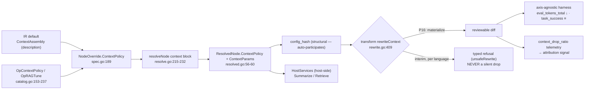

# PRD — P16: Context Strategy Optimization (make the richest modeled axis actually applicable)

| Field | Value |
|---|---|
| Phase / Milestone | P16 / M19 |
| Target window | ~Weeks 46–64 (four waves: 16a context-policy materialization, 16b retrieval-tuning, 16c user-initiated change, then 16d all-language coverage) |
| Lead role(s) | AI Engineer + Backend (co-leads) |
| Supporting role(s) | System Designer, Frontend, DevOps, QA Engineer, Product Designer, Sales Operations |
| Status | Draft |
| OpenSpec change | `p16-context-strategy-optimization` |
| Related | [P3 — Context + Skills + Sandbox](P3-context-skills-sandbox.md) · [P4 — Eval Harness](P4-eval-harness.md) · [P4.5 — Attribution + Diagnosis](P4.5-attribution-diagnosis.md) · [P5.5 — Proposals + Verification](P5.5-proposals-verification.md) · [P10 — Prompt & Model Studio](P10-prompt-model-studio.md) |

> **Commercial position.** Context strategy is the axis with the clearest **token-cost** story: a
> variant that assembles less context per call produces fewer `eval_tokens_total` at equal
> `task_success`, and that reduction is a **verified** saving on the P5.5 ledger like any other. No new
> plan surface is introduced; this phase makes an axis the optimizer already models *deliverable*, so
> its gains flow through the existing Free / Team / Business / Enterprise entitlement and gainshare paths.
>
> **Money-in-git rule.** No dollar amounts, percentages, or price bands appear here. Plans are named
> only — Free / Team / Business / Enterprise. Cost is expressed as **tokens** and **observed spend**,
> never a currency figure.

## 1. Summary

Context is, in model terms, the **richest non-model axis in the whole platform** — and today the one
axis that cannot ship a single edit. The `Dimension` enum already contains `DimContext`
([`internal/variantspec/spec.go:46`](../../internal/variantspec/spec.go)); a node already carries a
`ContextPolicy` override ([`spec.go:189`](../../internal/variantspec/spec.go)); resolution already
binds it to a versioned registry entry and freezes `ContextPolicy` + `ContextParams` into the
`ResolvedNode` ([`internal/variantspec/resolve.go:215-232`](../../internal/variantspec/resolve.go),
[`resolved.go:56-60`](../../internal/variantspec/resolved.go)), so it auto-participates in
`config_hash`. Seven policies are registered and implemented behind one interface
([`internal/registry/context.go:29-33`](../../internal/registry/context.go),
[`context_policies.go`](../../internal/registry/context_policies.go)); loss telemetry
(`DropRatio` → `context_drop_ratio`) is emitted and already consumed by attribution as a
context-overflow signal ([`internal/telemetry/context_assembly.go:78`](../../internal/telemetry/context_assembly.go),
[`internal/attribution/signals.go:94`](../../internal/attribution/signals.go)). Two operators —
`OpContextPolicy` and `OpRAGTune` — already *propose* context variants
([`internal/proposal/catalog.go:153-237`](../../internal/proposal/catalog.go)).

Everything is modeled, resolvable, hashable, proposable, and scoreable — and then the codemod
**refuses**. [`internal/transform/rewrite.go:417`](../../internal/transform/rewrite.go) `refuseContext`
returns `unsafeRewrite` for every node carrying a context override, because *"context assembly is not a
call-site argument — it is how the surrounding code builds the message list."* A context proposal
resolves, hashes, and dies at transform. P16 is the phase that turns the platform's most elaborate
modeled axis into an **applied** one: it replaces the refusal with a real call-site **context
materialization** codemod, keeps the refusal as a *specified, testable* interim behavior per language
until each language's rewriter lands, and closes the RAG loop — top-k, chunk size, rerank, embedding —
as verified `OpRAGTune` proposals on held-out eval sets. Milestone **M19 — context is a first-class
applicable axis** means a context change reaches a customer's build as a reviewable diff, and a context
reduction is visible as fewer `eval_tokens_total` with no `task_success` regression.

The per-language half of that promise is closed by wave **16d** (`context-language-coverage`) under the
cross-axis [`language-coverage`](P13-prompt-model-optimization.md) contract. Selection materializes today
in Go and Python; the engine's own note says TypeScript and JavaScript are "a row plus its splitter", and
a scope statement with no way to be recorded as one ages into a product boundary. So coverage becomes a
**total (language, policy)** table, the remaining splitters land, and one rule governs the growth:
**retention is not per language** — which turns a policy retains *is* the policy, decided by the shared
selection code, with the drop record produced by the same shared path so a newly covered language cannot
delete turns without recording them. The refusal order this axis already had to correct once becomes a
requirement: a policy whose content a model or retriever produces at run time refuses identically in every
language, a call site that wrote no message list is told **that**, and only then is the splitter the
honest answer.

## 2. Problem & context

The context axis is where the platform's honesty pattern is most visible and most costly. Six problems
block application, each mapping to a design commitment:

- **The axis is fully modeled and cannot emit one edit.** `DimContext` is a first-class dimension, a
  node's `ContextPolicy` resolves to a registered `(policy, params)` entry, and `ResolvedNode`
  freezes `ContextPolicy` + `ContextParams` so the effect is already in `config_hash`. Then
  [`rewrite.go:409-424`](../../internal/transform/rewrite.go) refuses: `rewriteContext` calls
  `refuseContext`, which returns `unsafeRewrite`. The Go engine and the tree-sitter span engine
  ([`rewrite_span.go`](../../internal/transform/rewrite_span.go)) both refuse. **A resolvable,
  hashable, scoreable context variant produces no diff.**
- **The refusal's reason is real, not laziness — and that is exactly why it is hard.** Context is not
  an argument to swap; it is the surrounding code that builds the message list. Discovery records it as
  a *description* (`inline_messages`, `inline_messages_with_tools`,
  [`internal/discovery/extract.go:239-244`](../../internal/discovery/extract.go)), not a locator.
  Materializing a policy means rewriting the code region that assembles the messages — a genuine
  codemod, per language, which is why it was deferred and why it is the hard part of every axis
  (the "add an axis" checklist's step 7).
- **The refusal names the wrong owner and was never built.** `refuseContext`'s message defers the
  rewrite to **P3** ([`rewrite.go:422`](../../internal/transform/rewrite.go)). P3 shipped the
  *policies* and their host-side `Assemble` ([`context_policies.go`](../../internal/registry/context_policies.go))
  but **not** the call-site codemod. The rewrite has no owner in code. P16 is that owner, and part of
  this phase is correcting the deferral pointer so a reader is not sent to a phase that does not build it.
- **A dropped override must never be silent.** The single worst failure for an eval platform is a
  variant that *looks* applied but whose context change was quietly discarded — it would be scored as
  the base configuration under a different `config_hash`, a false result. The interim refusal is
  therefore not a temporary gap to tolerate quietly; it is a **first-class requirement**: a node whose
  `ContextPolicy` is not yet call-site-applicable in its language SHALL be **refused at transform**,
  loudly, never dropped.
- **A lossy policy can raise quality-destroying drops that scoring alone punishes too late.** A
  `summarization` or `semantic-compaction` policy populates `DropRatio`
  ([`context_policies.go:218,339`](../../internal/registry/context_policies.go)); attribution already
  flags overflow from it. But nothing today makes a *proposal* inadmissible for exceeding a node's
  tolerance — the platform would happily generate, transform, and burn eval budget on a variant that
  drops the answer. Drop-loss must be a **scored, gated** signal, not only a post-hoc diagnosis.
- **The RAG loop is proposed but not tuned or verified as a loop.** `OpRAGTune` already emits
  candidates that raise top-k or swap retriever/embedding
  ([`catalog.go:218-237`](../../internal/proposal/catalog.go)). What is missing is the discipline that
  makes retrieval optimization trustworthy: retrieval is **non-deterministic** unless pinned, so a
  measurement run must fix the retriever and its parameters, and a retrieval change must be verified on
  a **held-out** eval set rather than the set it was tuned against, or the platform will ship overfit.

**Upstream state assumed.** **P0** (`config_hash` is purely structural, so `ContextPolicy` /
`ContextParams` already participate). **P2** (the codemod engine, the Go and tree-sitter rewriter
dispatch this phase extends). **P3** (the `Policy` interface, the seven registered policies, the
host-side `Assemble`, the `HostServices` gateway, and `Store.AddPolicy` this phase builds new policies
on). **P3.5** (the pattern classifier `RetrievalRAG` gate that keeps `OpRAGTune` / rerank admissible
only on retrieval nodes). **P4** (the axis-agnostic harness that scores a context variant from
`config_hash` + `Trace` with no context-specific change, and `eval_tokens_total` as the reduction
signal). **P4.5** (attribution's context-overflow signal, already fed by `context_drop_ratio`).
**P5.5** (proposals + verification — where a context variant becomes a *verified delta* and only then a
claim). **P10** (apply-mode: context is **code**, not data, so it is materialized inline and never
hidden from the diff).

## 3. Goals & non-goals

### Goals

- **G1. A context override produces a reviewable diff or a loud refusal — never a silent drop.** For a
  node whose `ContextPolicy` differs from its discovered assembly, the transform SHALL either emit a
  call-site materialization edit or **refuse at transform naming the node, the policy, and the
  language**. It SHALL NOT resolve, hash, and then discard the override.
- **G2. Context materialization is a real call-site codemod, per language.** The Go engine SHALL
  rewrite the message-assembly region of a call site so the resolved policy governs how the message
  list is built. Each additional language's rewriter lands independently; until it does, that language
  keeps the **specified interim refusal**.
- **G3. The interim refusal is a specified, tested behavior, not an accident.** A node carrying an
  un-applicable `ContextPolicy` SHALL be refused with a typed `unsafeRewrite` that names the node,
  the policy, and the reason, and this behavior SHALL have its own passing test per language until the
  rewriter replaces it.
- **G4. Context reduction is legible as tokens, not as a special metric.** A context variant that
  reduces assembled tokens SHALL show up as a lower `eval_tokens_total`
  ([`internal/evalharness/metricnames.go:27`](../../internal/evalharness/metricnames.go)) at
  non-regressing `task_success`, scored through the **same** axis-agnostic harness as any other axis —
  no new eval or scoring path.
- **G5. Context-loss is a scored, gated quality signal.** `DropRatio` SHALL be modeled as a
  first-class admissibility gate: a proposal whose resolved policy would drive a node's drop ratio past
  that node's declared tolerance SHALL be **inadmissible** — rejected before it consumes eval budget —
  and a materialized variant's observed drop SHALL be scoreable.
- **G6. New policies are additions behind the existing interface.** Warranted policies (e.g.
  `hierarchical-summary`, `structured-extraction`) SHALL be added via the `Policy` interface and
  `Store.AddPolicy` ([`internal/registry/store.go:41`](../../internal/registry/store.go)) — a new
  implementation and a registry row, never a schema change and never a new `Dimension`.
- **G7. Retrieval optimization is verified on held-out data.** `OpRAGTune` proposals (top-k, chunk
  size, rerank on/off, embedding model) SHALL be verified against a **held-out** eval set, and a tuning
  win measured only on the tuning set SHALL NOT be presentable as a verified delta.
- **G8. Retrieval is deterministic per measurement run.** A measurement run SHALL pin the retriever,
  its parameters, and the seed, so re-running the same `config_hash` at the same `source_revision`
  issues the **identical resolved retrieval request** — determinism at the resolved-request level, the
  reproducibility ceiling P3 already set for host-calling policies.
- **G9. Context assembly is code, materialized inline, never hidden.** Because context is *how the
  surrounding code builds the message list*, its materialization is **code** under P10's apply-mode
  rule; the resolved assembly SHALL ship in the same diff a reviewer reads, or the transform SHALL be
  rejected. There is no bound-mode indirection that hides a context change from review.
- **G10. No credential ever reaches a sandbox through a context policy.** A policy that needs a
  summarizer or retriever SHALL reach it only through the trusted-host `HostServices` gateway
  ([`context_policies.go:79-85`](../../internal/registry/context_policies.go)); the model/retrieval
  call SHALL execute host-side, never from a sandboxed node.
- **G11. A user can choose their own context strategy.** Selecting a policy and its parameters, declaring
  or clearing a drop tolerance, and tuning retrieval SHALL be available as **user-initiated** changes on
  the shared `authored-change` spine, with `Origin` recorded and never hashed.
- **G12. The drop gate runs before the user commits, and never refuses on ignorance.** It SHALL be
  evaluated at preflight before any eval spend; where the drop ratio has never been measured it SHALL
  return an explicit `not-yet-measurable` verdict naming the missing measurement — never `admissible`,
  never `refused`.
- **G13. A user may set the policy but not the label.** Retrieval parameters SHALL be available only on a
  classifier-labelled retrieval node, and no path SHALL let a user set that label to unlock them.
- **G14. Loss is never sold as saving.** An authored context change SHALL claim nothing until the harness
  runs, and `DropRatio` SHALL be presented as information discarded rather than tokens saved.
- **G15. A selection policy SHALL be materializable in every registered language.** The context coverage
  table SHALL carry an entry for **every (language, policy)** pair, and a language that cannot yet
  materialize a selection SHALL name the **list splitter** as its missing artifact.
- **G16. The list splitter SHALL be the only per-language part of a selection.** The retained-turn
  decision, the drop record, and the drop-tolerance gate SHALL stay language-neutral, so adding a language
  is adding a splitter and its coverage entry — and the drop record SHALL be unskippable in a newly
  covered language exactly as it is in an existing one.
- **G17. A policy refusal and a language refusal SHALL NOT be conflated.** A policy whose content is
  produced at run time refuses **identically in every language**, and a call site that wrote no message
  list refuses for **its own shape** — with the language question asked last in both cases.

### Non-goals (explicitly deferred or owned elsewhere)

- **Node re-ordering as a fix for lost-in-middle** — that is the structural `Order` axis and
  `OpReorder` ([`catalog.go:186-203`](../../internal/proposal/catalog.go)), owned by **[P5](P5-contracts-rearrange-tracing.md)**.
  P16 changes *how a node assembles its own context*, not the graph.
- **Skills / tool binding at the call site** — the sibling refusal (`refuseSkills`,
  [`rewrite.go:388`](../../internal/transform/rewrite.go)) is its own axis and its own phase.
- **A new telemetry pipeline or a context-specific scorer.** Context reduction is read from the
  existing `eval_tokens_total`; drop is read from the existing `context_drop_ratio`. P16 adds no
  parallel metric family.
- **Authoring a retrieval corpus or standing up a vector store.** P16 *tunes* retrieval over a
  retriever the customer already has (`retriever_ref`); it does not build one.
- **Provider-exact token accounting.** The estimator is deterministic and monotonic
  ([`context_policies.go:393`](../../internal/registry/context_policies.go)); P16 optimizes on it and
  reconciles against measured `eval_tokens_total`, and does not promise tokenizer-exact byte counts.
- **A new `Dimension`.** `DimContext` already exists. P16 adds **no** enum member; this is the one axis
  the closed enum already names.

## 4. Users & personas

| Persona | What P16 is for them | What breaks without it |
|---|---|---|
| **AI engineer optimizing a long-context workflow** (primary) | Propose sliding-window / summarization / compaction / RAG-tune variants and get a *scored, shippable* diff — not a refusal. | The richest axis is a dead end: variants resolve and score in theory and never reach a build. |
| **Backend engineer owning the codemod** (primary) | A per-language context materialization with a specified interim refusal, so partial language coverage is honest rather than silent. | Either every context variant is refused forever, or a half-built rewriter drops overrides silently — the worst eval failure. |
| **System Designer** (support) | A drop-tolerance admissibility gate and a held-out-verification rule that keep a lossy or overfit context change out of a customer's build. | A summarizer that drops the answer, or a top-k tuned to its own eval set, ships as a "win". |
| **QA engineer** (support) | A gate that can go **red**: a refusal test per language, a drop-past-tolerance rejection test, and a held-out-vs-tuning-set separation test. | "Context works" is asserted from a green build over a codemod that refuses everything. |
| **Budget owner** (indirect, via P7/P9) | Context wins appear as reduced token spend on **linked** runs, with the same verified-savings discipline as any axis. | A token reduction the platform cannot apply is a saving nobody can bank. |

| **Workflow owner choosing a strategy** (primary, 16c) | They pick the policy their workflow needs, set a drop tolerance, and are told what each policy would discard — or told plainly that it has not been measured yet. | Context strategy changes only when a diagnosis fires; a team that knows their node needs hierarchical summary has no way to say so. |
| **Cost owner shrinking context** (16c) | A smaller context is applied with the loss shown as loss, and no saving is claimed until the harness rules. | A token reduction that looks like a win and is actually silent information loss. |

Non-personas: the end user of the customer's own LLM product; platform operators (P8). Context content
(prompt bodies, retrieved passages) never leaves the customer environment — the P11 boundary already
forbids it, and P16 adds nothing that would.

## 5. User stories / jobs-to-be-done

**AI engineer**
- As an AI engineer, I want a diagnosed context-overflow node to yield a *materialized, scored*
  summarization or windowing variant, so that I can see whether shrinking context keeps `task_success`
  before I ship it.
- As an AI engineer, I want a variant that would drop more context than a node can tolerate to be
  **refused before it runs**, so that eval budget is not spent proving an obviously-lossy change bad.
- As an AI engineer, I want a RAG top-k / rerank / embedding change verified on data it was **not**
  tuned on, so that a retrieval "win" is real and not overfit.

**Workflow owner making an active change (16c)**
- As the owner of this workflow, I want to **choose the context policy myself**, because I know this node
  summarizes badly and I should not have to wait for a diagnosis to say so.
- As the owner, I want to be told **how much a policy would discard before I commit to it**, and — if the
  platform has not measured that yet — I want it to **say so**, not guess in either direction.
- As the owner, I want to **declare a drop tolerance** for a node and have the platform hold me to it
  afterwards, including telling me if my current policy already exceeds it.
- As the owner, I want a smaller context to be labeled **unverified**, with the drop ratio shown as
  information discarded — not quoted back to me as a token saving I have not earned.

**Backend engineer**
- As the codemod owner, I want the context rewriter to land **per language**, with the un-built
  languages keeping a loud, specified refusal, so that partial coverage is a stated fact, not a silent
  drop.
- As the codemod owner, I want the resolved assembly to appear **in the diff**, so that a reviewer
  approves the actual message-building change rather than an opaque indirection.

**System Designer**
- As the System Designer, I want each new policy to be an addition behind the existing `Policy`
  interface and `Store.AddPolicy`, so that the registry and `config_hash` stay policy-generic and no
  one-way schema door is opened.

**QA engineer**
- As a QA engineer, I want a test that a context override on an un-built language **refuses** and is
  never silently dropped, and a test that a drop-past-tolerance proposal is rejected, so that both
  guarantees can be made to fail.

## 6. Functional requirements

Numbered FRs; each maps 1:1 to an OpenSpec requirement under
`openspec/changes/p16-context-strategy-optimization/specs/`.

### Context materialization (capability `context-policy`)

- **FR1.** For a node whose resolved `ContextPolicy` differs from its discovered context assembly, the
  transform SHALL either emit a call-site context-materialization edit or **refuse at transform**. It
  SHALL NOT produce a diff that silently omits the context change while reporting the variant's
  `config_hash`.
- **FR2.** The Go engine SHALL materialize a resolved context policy by rewriting the call site's
  message-assembly region so the assembled message list is the one the policy defines, deterministically
  given the policy, its params, the conversation, and the seed.
- **FR3.** A node carrying a `ContextPolicy` not yet call-site-applicable in its language SHALL be
  refused with a typed `unsafeRewrite` that names the node, the policy, and the reason. This interim
  refusal SHALL be specified and tested **per language** until that language's rewriter lands, and it
  SHALL NOT be a silent no-op.
- **FR4.** The refusal's reason and owner SHALL be accurate: it SHALL NOT direct a reader to a phase
  that does not implement the rewrite. (The current `refuseContext` text naming P3 is corrected to name
  the owning phase.)
- **FR5.** A materialized context change SHALL be **code** under P10's apply-mode rule: the resolved
  assembly SHALL appear in the same diff a reviewer reads. No apply mode SHALL hide a context change
  behind an indirection that omits the resolved values from review.
- **FR6.** A new context policy SHALL be added via the `Policy` interface (`Name`, `ParamsSchema`,
  `Assemble`) and registered through `Store.AddPolicy`. Adding a policy SHALL NOT change the registry
  schema, the `ContextSpec` shape, or the `Dimension` enum.
- **FR7.** `DropRatio` SHALL be modeled as a scored quality signal: a materialized lossy policy's
  observed drop SHALL be recorded per node per run through the existing `context_drop_ratio` telemetry
  and be available to scoring and diagnosis, distinguishing a measured `0.0` from an unmeasured lossless
  policy (the `Lossy` flag already distinguishes them,
  [`context_policies.go:47`](../../internal/registry/context_policies.go)).
- **FR8.** Each node SHALL carry an optional **drop tolerance**: a proposal whose resolved policy would
  drive that node's drop ratio past its tolerance SHALL be **inadmissible**. The tolerance SHALL be an
  additive, omit-when-absent attribute, so a node that declares none hashes byte-identically to a
  pre-P16 node.
- **FR9.** A context policy that requires a summarizer or other model SHALL reach it only through the
  `HostServices` gateway, host-side; the resolved request it issues SHALL be captured as the
  determinism handle (`ResolvedRequest`, [`context_policies.go:57-65`](../../internal/registry/context_policies.go)).

### Retrieval tuning (capability `retrieval-tuning`)

- **FR10.** `OpRAGTune` SHALL propose retrieval-parameter variants — top-k, chunk size, rerank on/off,
  and embedding model — as Variant Specs, admissible **only** on a node the classifier labels
  `RetrievalRAG` ([`catalog.go:214-216`](../../internal/proposal/catalog.go)).
- **FR11.** A retrieval change SHALL be verified on a **held-out** eval set — one not used to select the
  parameters. A retrieval win measured only on the tuning set SHALL NOT be presentable as a verified
  delta.
- **FR12.** A retrieval measurement run SHALL be **deterministic**: the retriever, its parameters, and
  the seed SHALL be pinned so re-running the same `config_hash` at the same `source_revision` issues the
  identical resolved retrieval request, including any rerank
  ([`context_policies.go:259-269`](../../internal/registry/context_policies.go)).
- **FR13.** A retrieval-tuning proposal that would raise a node's drop ratio past its tolerance SHALL be
  **inadmissible** (FR8 applied to retrieval), because a larger top-k or a lossy rerank can shrink the
  retained conversation.
- **FR14.** Retrieval augmentation SHALL be recorded as retrieval, not as loss: a pure augmentation
  (chunks prepended, conversation preserved) SHALL report `DropRatio` 0 and a positive `RetrievedChunks`
  count ([`context_policies.go:281-288`](../../internal/registry/context_policies.go)).

### User-initiated change on this axis (capability `context-authoring`)

The cross-axis rules are **FR21–FR33 of [P13](P13-prompt-model-optimization.md)** (capability
`authored-change`) and apply here in full without restatement. What P16 adds is governed by **loss**, not
by permission — this is the axis where a change silently destroys information.

- **FR15.** A user SHALL be able to select a node's **context policy** and set its parameters, expressed
  solely through the existing context override so it resolves, freezes, and participates in `config_hash`
  through the existing field. Only **registered** policies SHALL be offered; free text SHALL NOT be a
  selection path.
- **FR16.** An authored context change on a node whose language has **no landed rewriter** SHALL be
  refused at preflight naming the **node, the policy, and the language**, with the same typed cause the
  transform raises, and the boundary SHALL be **stated** rather than the control being silently disabled.
- **FR17.** The **drop-tolerance gate SHALL run at preflight**, before any evaluation spend. A policy
  whose measured drop ratio for that node exceeds the node's declared tolerance SHALL be refused naming
  the node, the tolerance, and the measured ratio.
- **FR18.** 🔴 Where the resolved policy's drop ratio for that node has **never been measured**, preflight
  SHALL return **`not-yet-measurable`** naming the missing measurement. It SHALL NOT return `admissible`
  — that would assert a safety check that never ran — and it SHALL NOT return `refused` — that would make
  the platform's measurement coverage the user's problem. **The gate never refuses on ignorance, and never
  passes on ignorance.**
- **FR19.** A user SHALL be able to **declare or clear** a node's drop tolerance. The attribute SHALL
  remain additive and omit-when-absent, so declaring one re-hashes the node and clearing it reproduces the
  pre-declaration `config_hash` **byte-identically**.
- **FR20.** A declared tolerance the node's **current** policy already exceeds SHALL be **reported** —
  naming the current policy and the measured ratio — not silently accepted.
- **FR21.** Retrieval parameters SHALL be offered and accepted **only** on a node the pattern classifier
  labels `RetrievalRAG`. No surface, flag, role, entitlement, or request parameter SHALL let a user set,
  override, or declare that label.
- **FR22.** An authored retrieval change, when verified, SHALL be **pinned** (retriever, parameters, seed)
  so re-running the same `config_hash` issues the identical resolved retrieval request, and SHALL be
  judged on a **platform-derived** held-out set **disjoint from the cases the authoring surface displayed
  as motivation**.
- **FR23.** An authored context change SHALL be applicable while `unverified`, with **no** token
  reduction, cost saving, or quality effect attributed to it until the harness has run. `DropRatio` SHALL
  be presented as **information the policy discarded**, never as a token or cost saving.

### All-language coverage on this axis (capability `context-language-coverage`)

The cross-axis rules — coverage as a **total** function over every registered language, per-cell claims,
the three typed refusal classes and their specific-first evaluation order, one coverage source, executable
evidence for every row, no gate weakened to reach a language, the versioned offline table, and coverage no
plan can move — are **FR41–FR51 of [P13](P13-prompt-model-optimization.md)** (capability
`language-coverage`). They apply here in full and are **not** restated.

- **FR24.** The context coverage table SHALL carry an entry for **every (language, policy)** pair, each
  stating one of: materialized by selection, equivalent to the unrewritten call site, or refused with a
  named cause. A selection policy a language cannot yet materialize SHALL name the **list splitter** as
  its missing artifact, and SHALL NOT describe the policy as unmaterializable.
- **FR25.** A policy whose content is produced at run time — by a model call, a tiered summarizer, or a
  retriever — SHALL be refused with the **same cause in every language**, and that cause SHALL NOT vary
  with whether the language has a splitter or imply that one would carry it.
- **FR26.** Per-language knowledge SHALL be confined to splitting a written list into its elements. The
  retained-turn decision, the drop record, and the drop-tolerance gate SHALL be produced by the same
  language-neutral path in every language; no language's splitter SHALL decide retention.
- **FR27.** For a refused context change the **most specific true** cause SHALL be reported, evaluated in
  the order: the policy → the registry row → the call site's own source → the language's splitter. A call
  site that wrote **no message list** SHALL be told that, and SHALL refuse identically once its language's
  splitter lands.
- **FR28.** Materializing a selection SHALL record the dropped turns in **every** covered language,
  produced by the shared path; the record SHALL be byte-comparable with the same selection in an existing
  covered language, and no code path SHALL emit the deletion without producing it.
- **FR29.** Before a user selects a policy, the authoring surface SHALL state — from the shared coverage
  source — whether the node's language can materialize a selection, and SHALL render that as a **different
  sentence** from a policy no language can materialize.

### This axis's delivery cells (capability `context-delivery`)

Cross-axis rules are defined once in [P13](P13-prompt-model-optimization.md) §6 (`change-delivery`,
FR57–FR68) and [ADR-010](../adr/ADR-010-runtime-gradual-rollout.md); they are referenced, not restated.

> **"Context strategy" is one name for two things that land in different columns.** A retrieval
> parameter is a **number** — a `top_k`, a budget, a similarity floor — exactly the kind of fact the
> binding document was built to carry, refused today only because the schema has no field. A selection
> policy is a **deletion**: the materializer applies it by removing the turns the policy does not retain
> from the constructed message list, and no document can perform a deletion in built code.
>
> The requirement that matters most is neither of those. It is that the **drop record survives the
> second route.** This axis's central honesty guarantee is that a context change which discards
> information records what it discarded, unskippable by construction rather than by discipline. A second
> path by which a context decision can take effect is precisely where an unskippable guarantee quietly
> becomes skippable — so the rule is a property of the decision, not of the route.

- **FR52.** A change confined to a retrieval parameter SHALL be refused for the runtime route with cause
  `noRolloutBinding`, naming the absent binding document field and attributing the owner to the
  platform. It SHALL NOT be reported as `notRuntimeResolvable`.
- **FR53.** A change to which turns a node retains SHALL be refused for the runtime route with cause
  `notRuntimeResolvable` in every language, naming the deletion of written turns, and SHALL NOT be
  presented as pending work.
- **FR54.** Retrieval parameters and selection policy SHALL appear as separate cells whose causes are not
  inferred from one another, and the retrieval cell SHALL be distinguishable from a permanent boundary.
- **FR55.** A candidate-arm context decision SHALL produce a drop record through the **same unskippable
  path** as a parent-arm decision, byte-comparable in shape. No arm, route, or apply mode SHALL bypass
  the recording.
- **FR56.** The drop-tolerance gate SHALL run before a context change may be authored as a rollout
  candidate, and SHALL still NOT refuse on ignorance — an unknown tolerance is recorded and carried with
  the rollout, not treated as a rejection.
- **FR57.** A retrieval change whose held-out verdict was refused for an **overlapping split** SHALL NOT
  be authorable as a rollout candidate, and the refusal SHALL name the overlap rather than the route.

## 7. Non-functional requirements

| # | Requirement | Target |
|---|---|---|
| **NFR1** | **Determinism (LLM-free policies)** | A windowing / compaction / augmentation materialization is byte-identical across runs of the same `config_hash` + `source_revision` + seed — asserted, not inspected. |
| **NFR2** | **Determinism (host-calling policies)** | A summarization / reranked-retrieval run issues an identical `ResolvedRequest` under a fixed seed; the determinism claim is "identical resolved request", never "identical provider bytes". |
| **NFR3** | **`config_hash` participation** | `ContextPolicy`, `ContextParams`, and the drop-tolerance attribute participate in `config_hash` structurally (tolerance additively, omit-when-absent), with no change to the hash algorithm. |
| **NFR4** | **No silent drop** | A context override is never resolved-and-discarded: every node with a differing context policy yields an edit or a typed refusal — machine-enforced by a test that asserts refusal, not code review. |
| **NFR5** | **Fail-closed on drop tolerance** | A proposal exceeding a node's drop tolerance is rejected at admissibility, before transform and before any eval spend. |
| **NFR6** | **Eval-agnosticism** | Scoring a context variant requires no context-specific harness change; the reduction is read from `eval_tokens_total` and the loss from `context_drop_ratio`, both already emitted. |
| **NFR7** | **Held-out verification** | The eval set a retrieval change is *verified* on is disjoint from the set it was *tuned* on, enforced by construction, not convention. |
| **NFR8** | **Credential isolation** | No provider or retriever credential is exposed to a sandboxed node; every model/retrieval call is host-side through `HostServices`. |
| **NFR9** | **Additivity / no one-way door** | No new `Dimension`, no registry-schema change, no `ContextSpec` change; new policies and the tolerance attribute are additive and reversible. |
| **NFR10** | **The third verdict is structural** | `not-yet-measurable` is a first-class verdict the surface renders as its own state, not a variant of "disabled". Asserted by tests that an unmeasured input returns neither `admissible` nor `refused` — both directions, because each failure mode is a different lie. |
| **NFR11** | **One drop gate, two callers** | The preflight verdict and the proposal-path admissibility decision are the same gate's output; a second predicate would let the editor bless what the engine rejects. |
| **NFR12** | **Loss is never rendered as saving** | No surface presents `context_drop_ratio` or a token reduction on an `unverified` authored change as a saving or an improvement; asserted in the console tests, because this is the one number the axis exists to keep honest. |
| **NFR13** | **The classifier is not user-settable** | No authoring path, parameter, role, or plan sets or overrides a node's pattern label; asserted over the enumerated authoring surface, not sampled. |
| **NFR14** | **Coverage is total over (language, policy)** | Every registered language appears against every declared policy; a generated test fails on a missing pair. Absence is the one value the table may not carry — it renders as "this policy does not apply here", which for a *selection* policy is never true. |
| **NFR15** | **The drop record is unskippable in a new language** | A selection materialized in a newly covered language produces a drop record byte-comparable with an existing language's, asserted rather than reviewed. This is the axis's honesty mechanism; a language that could delete turns without recording them would make `context_drop_ratio` quietly incomplete. |
| **NFR16** | **Policy, source and language causes are provably distinct** | A run-time-produced policy refuses identically in a language with and without a splitter; a call site with no written message list reports **that** in both. Both directions asserted, and the ordering test goes red when reversed. |
| **NFR17** | **The recording has no second path** | A structural assertion that every way a context decision can take effect passes through the drop record — enumerated over arms, routes and apply modes, not spot-checked. Adding a path without extending the assertion fails the build; this is what keeps "unskippable" true after the axis grows a second route. |
| **NFR18** | **The split is legible in one glance** | A test asserts the retrieval cell and the policy cell carry different causes and render differently in the console, the offline table and the API. Collapsing "context is not rollout-eligible" into one row turns it red. |

## 8. System design summary

### 8.1 Where the axis already lives, and the single missing edge



The whole pipeline exists **left of `TX`** already. P16 is the one edge from `TX` to `DIFF` — plus the
discipline that makes the edge safe: the interim refusal, the drop-tolerance gate, and held-out
verification.

### 8.2 The "add an axis" surface — how narrow it is here

The canonical checklist has eight steps. For context, **seven are already done**:

| Step | Surface | State for context |
|---|---|---|
| 1 | new `Dimension` | **EXISTS** — `DimContext` ([spec.go:46](../../internal/variantspec/spec.go)) |
| 2 | `NodeOverride` field | **EXISTS** — `ContextPolicy` ([spec.go:189](../../internal/variantspec/spec.go)); P16 *adds* the additive drop-tolerance field |
| 3 | `Dimensions()` + `resolveNode` block | **EXISTS** — [resolve.go:215-232](../../internal/variantspec/resolve.go) |
| 4 | `ResolvedNode` field | **EXISTS** — `ContextPolicy` + `ContextParams` ([resolved.go:56-60](../../internal/variantspec/resolved.go)), auto-hashed |
| 5 | registry `Kind` (+ register/resolve) | **EXISTS** — `KindContext`, `RegisterContextPolicy` / `ResolveContextPolicy` ([context.go](../../internal/registry/context.go)) |
| 6 | IR field + discovery frontend | **EXISTS** — `ContextAssembly` ([extract.go:239-244](../../internal/discovery/extract.go), [emit.go:99](../../internal/discovery/emit.go)) |
| 7 | **per-dimension rewriter** | **ABSENT (the hard part)** — `refuseContext` ([rewrite.go:417](../../internal/transform/rewrite.go)); **this is P16** |
| 8 | operator + catalog + priors | **EXISTS** — `OpContextPolicy` / `OpRAGTune` ([operator.go:39-41](../../internal/proposal/operator.go), [catalog.go:153-237](../../internal/proposal/catalog.go), [gain.go:13,17](../../internal/proposal/gain.go)) |

P16 is **step 7 plus the admissibility gate**. It is not a new axis; it is the one axis whose only
missing piece is the hardest one.

### 8.3 Decisions, with what was rejected

| # | Decision | Rejected alternative | Why (八级法则) |
|---|---|---|---|
| **D1** | **Interim refusal is a specified, tested behavior, per language** | Ship the Go rewriter and let every other language silently no-op the override | **L1 安全 + L2 稳定.** A silently-dropped context override is scored as the base config under a variant's hash — a *false result*, the worst failure an eval platform can produce. A loud refusal is a correct, safe answer; a silent drop is an incorrect one. The refusal is a feature, not a gap. |
| **D2** | **Context is code, materialized inline, in the diff** | A bound-mode indirection that swaps a context handle without showing the assembly | **L3 UX + L1.** Context is *how the code builds the message list*; hiding that behind an indirection means a reviewer approves a change they cannot see. P10 already ruled context is code, not data; P16 obeys it. |
| **D3** | **Drop-loss is a scored admissibility gate, not only a diagnosis** | Let lossy variants transform and run, and catch the quality drop in scoring | **L4 运维 + L8 实现.** Scoring *would* eventually punish a variant that drops the answer — after spending multi-seed eval budget on it. A drop-tolerance gate rejects it before the spend. Cheaper and earlier, with no loss of correctness. |
| **D4** | **Retrieval verified on a held-out set** | Verify on the set the parameters were tuned against | **L1 honesty.** A top-k tuned to its own eval set and "verified" on the same set is overfit sold as a win — indefensible the first time it regresses in production. Held-out separation is the only honest verdict. |
| **D5** | **Retrieval pinned per measurement run** | Let the retriever run free and average over seeds | **L2 稳定 + reproducibility.** An unpinned retriever makes a `config_hash` non-reproducible — two runs of the same config disagree, and the whole lineage design (re-derive a result from its hash) breaks. Pin the retriever, seed the rerank, capture the `ResolvedRequest`. |
| **D6** | **New policies are additions behind the existing interface** | Add policy-specific fields to `ContextSpec` / a `Dimension` variant | **L5 不可演进 + L6 不可扩展.** A schema change per policy is the extensibility failure the `Policy` interface + `Store.AddPolicy` were built to prevent. A `Name`/`ParamsSchema`/`Assemble` implementation plus a row is the whole cost. |
| **D7** | **No new `Dimension`; reuse `DimContext`** | Introduce a `DimRetrieval` sub-axis for RAG tuning | **L5 不可演进.** Retrieval *is* a context policy (`rag-retrieval`) with params; a second dimension would split one axis's identity across two enum members and double the hash surface for no behavioral gain. |

| **D8** | **Authoring is governed by loss; the drop gate never refuses — and never passes — on ignorance** | (a) treat an unmeasured drop ratio as a pass; (b) treat it as a failure; (c) let the user mark a node as retrieval to unlock retrieval params | **(a) L1 safety (honesty)** — returning `admissible` asserts a safety check succeeded when it never ran, on the one axis whose failure mode is *silent information loss*. **(b) L3 user-facing complexity** — fail-closed is right for membership questions (a tool outside the discovered set) but wrong here: the missing fact is about **our** measurement coverage, not the user's change, and blocking on it makes the axis unusable on every workflow that has not been evaluated — i.e. every new one. **(c) L1** — the classifier gate is what makes a retrieval parameter mean anything; a user who can set the label can unlock parameters that do nothing and then attribute a result to them. A misclassification is a defect to fix upstream, not an override to hand out. |
| **D9** | **Every (language, policy) pair gets a value; the splitter is the only per-language part, and the policy question is asked first** | (a) keep "Go and Python only" as the terminal state; (b) let each language's rewriter decide retention for itself; (c) report a missing splitter as the reason whenever one is missing | **L6 + L1 + L3.** (a) is an ordering that hardened into an answer: the same deletion is sound in TypeScript and JavaScript — the engine's own comment says adding one is "a row plus its splitter" — so an absent row describes our backlog while rendering as *this policy does not apply to your code*, which for a **selection** policy is never true. (b) is the L1 error: retention is what the policy *means*, and a per-language retention decision would make one `config_hash` describe two different configurations, so the harness would compare them while calling them one. (c) is the mistake this axis already shipped once and corrected: the dominant real refusal is a call site that **wrote no message list** — nothing to select among, in any language, before or after a splitter lands — and a policy whose content does not exist until run time refuses identically everywhere. Both must be reported ahead of the language question. |

### 8.4 Data model additions

```
NodeOverride       += { context_drop_tolerance?: float64 in [0,1] }   // additive, omit-when-absent (FR8)
                         // absent ⇒ no field emitted ⇒ config_hash byte-identical to pre-P16 (NFR3)
ResolvedNode       += { context_drop_tolerance?: float64 }            // frozen when set; participates in hash additively
Admissibility gate := reject(proposal) WHEN resolved_policy.expected_drop(node) > node.context_drop_tolerance   // FR8/FR13
HeldOutSplit       := { tuning_set_id, holdout_set_id } with tuning ∩ holdout = ∅   // FR11 read model over eval sets
```

No new store, no new `Dimension`, no new registry `Kind`, no `ContextSpec` change. New policies are
rows in the existing context registry; the tolerance is an additive spec field; the held-out split is a
read model over eval sets P4 already owns.

## 9. Design by role lens

**AI Engineer (co-lead) — *evals before optimization; the interim refusal keeps a false result off the
board.*** The context axis is where "diagnosis proposes, verification decides" earns its keep. Two
operators already propose context variants from a diagnosed overflow or lost-in-middle
([`catalog.go:156-169`](../../internal/proposal/catalog.go)); what P16 adds is the guarantee that a
proposed variant is either *materialized and scored* or *loudly refused* — never resolved, hashed, and
silently discarded, because a discarded override would be scored as the base configuration under a
variant's hash and reported as that variant's result. That is the single most dangerous thing an eval
platform can do, and it is why the interim refusal is a requirement rather than a placeholder. The
drop-tolerance gate is the same discipline applied earlier: a `summarization` policy that would drop
more than a node tolerates is not a candidate to *measure*, it is a candidate to *reject*, and rejecting
it before the multi-seed spend is both cheaper and more honest than letting scoring find out. And
retrieval is where statistical honesty is easiest to lose: a top-k tuned on an eval set and verified on
the same set is overfit dressed as a win, so verification runs on a **held-out** set or it is not a
verified delta.

**Backend (co-lead) — *the refusal is real; the rewriter is the hard part, per language.*** The reason
`refuseContext` exists is correct and worth restating: context assembly is not a call-site argument, it
is the surrounding code that builds the message list, and the registry rows carry no context locator to
swap ([`rewrite.go:417-424`](../../internal/transform/rewrite.go)). Materializing a policy therefore
means rewriting a *region* of code — how the message slice is constructed — which is genuine code
generation, per language, and it is why this sat behind a refusal. P16 builds it for the Go engine
first and keeps the tree-sitter span engine's refusal in place, *specified and tested*, until each
language's rewriter lands. The load-bearing rule is that partial coverage is **honest**: a language
without a rewriter refuses loudly and names itself, so a customer on that language sees "not yet
applicable here", never a diff that quietly omitted their change. The resolved assembly ships **inline
in the diff** (P10: context is code), so a reviewer approves the actual message-building change. And the
credential never moves: a policy that needs a summarizer calls `HostServices` host-side
([`context_policies.go:79-85`](../../internal/registry/context_policies.go)), never from a sandbox.

**System Designer (support) — *one axis, one interface, no one-way doors.*** The architectural win of
P16 is how little architecture it needs: `DimContext` already exists, `config_hash` already carries the
effect, the `Policy` interface and `Store.AddPolicy` already make a new policy a row plus an
implementation ([`store.go:37-41`](../../internal/registry/store.go)). So the design constraint is
*don't open a door*: new policies (`hierarchical-summary`, `structured-extraction`) go **behind the
existing interface**, not into a schema; retrieval tuning stays a `rag-retrieval` policy with params,
not a new `DimRetrieval`; and the drop-tolerance attribute is **additive and omit-when-absent**, so a
node that declares none serialises and hashes byte-identically to a pre-P16 node — the same additive
discipline P10's `Bindings` field used ([`resolved.go:62-69`](../../internal/variantspec/resolved.go)).
The one genuinely new concept, drop tolerance, is deliberately *not* stored as a policy fact but as a
per-node admissibility input, because whether a drop is acceptable is a property of the node's job, not
of the policy.

**QA Engineer (support) — *the two guarantees that cannot be read from a green build.*** "Context works
now" is exactly the claim a passing build can lie about, because the codemod compiles whether it emits
an edit or refuses. So the gate is built from tests that can go **red**: (1) a context override on a
language whose rewriter has not landed **refuses** with a typed error naming the node and policy, and a
companion test asserts the override was **not** silently applied as the base config — that pair is what
makes FR1/FR3 real; (2) a proposal whose resolved policy would exceed a node's drop tolerance is
**rejected at admissibility**, before transform, before eval spend; (3) the eval set a retrieval change
is *verified* on is asserted **disjoint** from the set it was *tuned* on — a test that constructs an
overlap and asserts the verdict is refused; (4) a windowing/compaction materialization is
**byte-identical** across two runs of the same `config_hash`, and a summarization run issues an
**identical `ResolvedRequest`** under a fixed seed. If any of these cannot be made to fail, the
corresponding guarantee is decoration.

### 9.1 Wave 16c — user-initiated change, by role lens

**System Designer — *three verdicts, because two of them would be lies.***
Every other axis in this program needs two answers from preflight. This one needs three, and the third is
the whole design. An unmeasured drop ratio cannot be reported as `admissible` — that claims a check ran —
and cannot be reported as `refused` — that blames the user for our measurement coverage. `not-yet-
measurable`, naming what is missing, is the only honest answer, and it is the posture the drop gate
already ships; 16c's job is to make sure the authoring surface does not quietly flatten it into a disabled
control. The other structural commitment is that preflight and the proposal path call **one** gate: a
second predicate is how an editor starts blessing what the engine rejects.

**Backend — *the gate runs before the spend, and the label is not an input.***
The drop gate moves ahead of eval budget, which is the point of having it — refusing a lossy policy after
paying to measure it is the cost the gate exists to avoid. Two refusals must name their specifics: an
over-tolerance refusal names the node, the tolerance, **and the measured ratio** (a bare "exceeds
tolerance" gives the user nothing to reason with), and a language refusal names the node, the policy, and
the language. The classifier label is an **input** to what may be authored and never an **output** of it —
no parameter, role, or plan sets it. And declaring/clearing a drop tolerance must be exactly reversible:
clearing returns the byte-identical prior hash, because an additive attribute that does not cleanly
subtract is not additive.

**AI Engineer — *the user picks the strategy; the platform still picks the evidence.***
An authored retrieval change is pinned when measured — retriever, parameters, seed — so the same
`config_hash` reissues the identical resolved request. The held-out set is platform-derived and disjoint
from the cases the surface **showed** the user as motivation, which is a slightly stronger condition than
the operator path needs: a human who has been looking at five failing cases will tune to those five, so
those five are precisely the ones that must not judge the result. Pure augmentation stays recorded as
retrieval, not loss.

**Frontend — *three states, and loss is never a saving.***
Two rules carry the surface. First, `not-yet-measurable` renders as its **own** state with its own
sentence — collapsing it into a greyed control tells the user "you can't" when the truth is "we haven't
looked", and those lead to opposite actions. Second, `context_drop_ratio` is displayed as **information
discarded**. The temptation here is strong and specific: a lossier policy shows fewer tokens, and a token
count next to a green arrow is the easiest chart in the product to draw. On an `unverified` change it is
also a lie. Beyond those: only registered policies, the language boundary stated with the language named,
retrieval parameters gated by the classifier with the reason given, no capability removed, tokens only.

**QA Engineer — *assert both directions of the third verdict.***
The distinctive test here is a pair, not a single case: an unmeasured input must return neither
`admissible` nor `refused`, and both halves need their own assertion, because each failure mode is a
different bug with a different cause. Then the usual go-red set: over-tolerance, unsupported language,
non-RAG retrieval parameters, unregistered policy — each seen red. Then the two that cannot be read from
code: that no flag, role, or plan bypasses the drop gate or the classifier gate, and that clearing a
declared tolerance returns the byte-identical prior hash. And downstream: after an authored policy change,
read back the emitted diff, the record, **and the resolved policy frozen into the node** — the context
axis is exactly where a resolved-but-not-applied override would be invisible from the handler's return.

**DevOps — *the same three verdicts offline, and no new egress on a content-heavy axis.***
The CLI reaches the same verdicts with the same cause text offline. This is the axis where the egress rule
is most load-bearing: context content is prompt text and retrieved passages, and preflight is the natural
place for an implementation to accidentally ship a sample outward to "check" it. The allowlist is
unchanged, and the assertion covers preflight and diagnostics. Health signals name the verdict class, so
an operator can answer "why is this node stuck at not-yet-measurable?" without a debugger.

**Product Designer — *"we haven't measured this" is a fact about us, not a refusal of them.***
The wording of the third verdict is the most important sentence in this wave. It should read as a
statement about the platform's coverage, say what would make it measurable, and never look like a denial.
The over-tolerance refusal, by contrast, is a real *no*, and it should carry the number the user needs to
decide whether to relax the tolerance or pick another policy. And the vocabulary rule bites hardest here:
a smaller context is **applied**, never *cheaper*, *leaner*, or *optimized*, until a verdict exists.

**Sales Operations — *the drop gate is a measurement, not a guarantee.***
Deliverable: customers choose their own context strategy and the platform shows what each one discards,
with a tolerance they can set and be held to. The boundary that must always travel with it: the gate is a
**measured** check, and where it has not measured, **it says so** — 🚫 never present the drop gate as a
guarantee that no context will be lost. Two more refusals: there is no override at any tier, and a
customer cannot relabel a node to unlock retrieval tuning. Token reduction is described as reduction, and
never as a saving, until a verified delta says so.

### 9.2 Wave 16d — all-language coverage, by role lens

**AI Engineer (co-lead) — *retention is the meaning; it must not be per language.***
The one thing that cannot be delegated to a language is which turns a policy retains, because that *is* the
policy. If a TypeScript splitter decided retention for itself, one `config_hash` would describe two
configurations and the harness would go on comparing them as one — the failure that makes every downstream
number quietly wrong. So the shared `SelectionPolicy.Retain` decides, in every language, and a splitter
answers exactly one question: what are the written elements of this list. The same discipline covers the
drop record: it is produced by the shared path, so a newly covered language cannot delete turns without
recording them, and `context_drop_ratio` cannot become quietly incomplete as coverage grows.

**Backend (co-lead) — *the policy question, then the source, then the language.***
This axis has already shipped the wrong ordering once and corrected it, which makes it the best evidence
for the cross-axis rule. A call site that unpacks its arguments from a mapping has written **no message
list**; there is nothing to select among, there will be nothing to select among after every splitter has
landed, and telling that author their language is pending is true and useless. Above it sits a fact that
is not about the language either: a summarized, tiered, or retrieved context does not exist in source at
all, so it refuses identically in Go, in Python, and in a language with no splitter. Only after both is the
splitter the honest answer. Adding TypeScript, JavaScript, Kotlin, Java and Rust is adding five splitters
and five rows — no gate, no second retention path.

**System Designer (support) — *totality is what stops a scope statement from aging into a boundary.***
`spanContextMaterializers` carries Python and says, in its own comment, that TypeScript and JavaScript are
"a row plus its splitter". That is a scope statement, and scope statements age into product boundaries
whenever the data model has no way to say *we have not built this yet*. Making the (language, policy) table
total is what keeps the comment's honesty available to every surface that renders coverage.

**Frontend (support) — *two sentences that must never merge.***
"This policy cannot be written into source at all" and "this language cannot select yet" have different
next steps and different lifespans — the first has no "when". Rendering them as one disabled control is
the failure mode this capability exists to prevent, and it is especially costly here because the policies
users most want (summarization, RAG) are exactly the ones in the first category.

**QA Engineer (support) — *the drop record is the assertion that travels.***
Totality is generated over (registered language × declared policy). The ordering test needs a fixture that
is both source-refusable and language-refusable and must go **red** when reversed. And the one that is
easy to forget: a selection in a newly covered language must produce a drop record byte-comparable with
the same selection in an existing one — because a language that emits the deletion without the record
passes every test that only reads the diff.

**DevOps, Product Designer + Sales Operations (support).** The offline table carries the (language, policy)
cells, versioned and named in a refusal. The wording keeps the two boundaries apart: a missing splitter is
*not yet applied by the platform*; a run-time-produced policy is *not expressible in source*, with no
"when". And the claim stays per cell — 🚫 never "we optimize context in any language", which promises
summarization materialization that refuses in **every** language, including Go.

### 9.x Wave 16e — delivery cells on this axis, by role lens

**System Designer — *the axis splits, and not where a reader expects.***
A retrieval parameter is a **number** — a `top_k`, a budget, a similarity floor — exactly the kind of
fact the binding document was built to carry, refused today only because the schema has no field. A
selection policy is a **deletion**: the materializer applies it by removing the turns the policy does
not retain from a constructed message list, and no document performs a deletion in built code. One is
ours to close; the other cannot be. A single "context is not rollout-eligible" row tells one reader to
stop asking about something we can build and the other to wait for something that will never arrive.

**Backend + QA — *the recording has no second path, and that is now a structural claim.***
This axis's guarantee is that a context change which discards information records what it discarded,
unskippable **by construction**: `Assemble` always calls `Record`, so the ordinary path cannot forget.
🔴 But "unskippable" is only ever true against the paths that existed when it was written, and a rollout
is a second way for a context decision to take effect. So NFR17 enumerates every exported function that
hands back an assembled context and requires each to reach `Record` — adding an entry point beside the
recording one fails the build rather than passing quietly.

One subtlety worth keeping: a **lossless** policy publishes no drop-ratio event at all, because
`Record` carries `Lossy` across rather than inferring it from `DropRatio > 0`. A lossless policy's 0.0
means "cannot drop"; a lossy policy's 0.0 means "measured no drop". A test that demanded a drop signal
from every arm would be demanding that the axis break that distinction.

**Product Designer — *the gate runs first, and still never refuses on ignorance.***
Drop-tolerance gates rollout authoring. But an unknown tolerance is **recorded and carried with the
rollout**, not treated as a rejection — refusing because nobody has annotated an item would block every
change on a workflow nobody has annotated, which is most of them.

**Sales Operations — *what may be said about this axis.***

| Say | Never say | Why |
|---|---|---|
| "retrieval parameters are a field we have not shipped yet" | "context tuning is not supported" | One cell is ours to close; saying neither is possible misrepresents both. |
| "a context change records what it discarded" | "context optimization is lossless" | Some policies are lossy by design; the guarantee is the *record*, not the absence of loss. |
| "retention changes ship as a reviewed diff" | 🚫 "we tune your context live" | Retention refuses the runtime route in **every** language. |

## 10. Dependencies

**Requires**
- **P0** — `config_hash` structural inclusion (`ContextPolicy` / `ContextParams` already participate).
- **P2** — the codemod engine and the Go + tree-sitter rewriter dispatch this phase extends.
- **P3** — the `Policy` interface, the registered policies, host-side `Assemble`, `HostServices`,
  `Store.AddPolicy`.
- **P3.5** — the `RetrievalRAG` classifier gate keeping `OpRAGTune` / rerank admissible only on
  retrieval nodes.
- **P4** — the axis-agnostic harness (`eval_tokens_total`, `task_success`) and its held-out eval sets.
- **P4.5** — attribution's context-overflow signal, already fed by `context_drop_ratio`.
- **P5.5** — proposals + verification (a context variant becomes a *verified delta* only here).
- **P10** — apply-mode: context is code, materialized inline, never hidden from review.

**Unblocks**
- **Context becomes a deliverable optimization axis** — the platform's richest modeled axis ships edits.
- **Token-cost wins on the P5.5 ledger** — a context reduction is a verified saving like any other.
- **The remaining refusal-only axis is isolated** — once context materializes, `refuseSkills` is the
  only modeled-but-unapplied axis left, and its phase can reuse this phase's interim-refusal pattern.

## 11. Risks & mitigations

| Risk | Owner | Mitigation |
|---|---|---|
| A context override is silently dropped instead of applied, and scored as the base config | Backend + QA | FR1/FR3 — a differing context policy yields an edit **or** a typed refusal; a test asserts refusal and asserts the override is not silently applied (NFR4). |
| A partially-built language rewriter emits a subtly-wrong assembly that compiles and degrades quality | Backend | The interim refusal stays in place per language until that language's rewriter is tested; a language never emits a half-correct context edit — it refuses. |
| A lossy policy drops the answer and burns eval budget proving itself bad | AI Engineer + System Designer | Drop-tolerance admissibility gate (FR8) rejects it before transform and before spend (NFR5). |
| A retrieval change overfits its tuning set and regresses in production | AI Engineer | Held-out verification (FR11, NFR7) — the verified set is disjoint from the tuned set by construction. |
| An unpinned retriever makes a `config_hash` non-reproducible | AI Engineer + Backend | Retrieval pinned per measurement run; identical `ResolvedRequest` under a fixed seed (FR12, NFR2). |
| A new policy forces a registry-schema or `Dimension` change | System Designer | Policies are additions behind the `Policy` interface via `Store.AddPolicy`; no schema, no enum member (FR6, NFR9). |
| A provider/retriever credential leaks to a sandboxed node | Backend | Every model/retrieval call is host-side through `HostServices` (FR9, NFR8). |
| The drop-tolerance field breaks frozen `config_hash` golden vectors | System Designer | Additive, omit-when-absent — a node with no tolerance hashes byte-identically to pre-P16 (NFR3). |
| An unmeasured drop ratio is reported as `admissible`, so the user believes a check ran | System Designer + QA | D8/FR18/NFR10 — the third verdict `not-yet-measurable` names the missing measurement; asserted that `admissible` is never returned for an unmeasured input. |
| An unmeasured drop ratio is reported as `refused`, blocking every unevaluated workflow | Product Designer + Backend | D8/FR18 — the gate **never refuses on ignorance**; the missing fact concerns our coverage, not the user's change. |
| A user relabels a node as retrieval to unlock retrieval tuning | Backend + QA | D8/FR21/NFR13 — the classifier label is not settable through any surface, parameter, role, or plan; asserted over the enumerated authoring surface. |
| A token reduction from a lossier policy is displayed as a saving | Frontend + Sales Ops | D8 corollary/FR23/NFR12 — `DropRatio` renders as information discarded; an `unverified` change is attributed no saving. |
| The editor's drop verdict and the engine's admissibility decision drift | System Designer | NFR11 — one gate, two callers; a second predicate is how an editor starts blessing what the engine rejects. |
| A user verifies their own retrieval change on the cases they were shown | AI Engineer | FR22 — the held-out set is platform-derived and disjoint from the displayed motivation, which is stricter than the operator path needs and for good reason. |
| Preflight becomes the first path that ships context content outward | DevOps | The P11 allowlist is unchanged and covers preflight and diagnostics; prompt text and retrieved passages cross no boundary. |
| A language is absent from the context table and reads as "this policy does not apply here" | System Designer + QA | FR24/NFR14 — a **total** (language, policy) table, generated; a missing pair goes red. |
| A user whose call site wrote no message list is told their language is pending | Backend + Product Designer | FR27/NFR16 — policy → row → source → **language last**; the ordering test goes red when reversed. |
| A new language's splitter decides retention for itself | AI Engineer | FR26 — retention is decided by the shared policy code; a splitter answers only "what are the written elements". |
| A newly covered language deletes turns without recording the drop | AI Engineer + QA | FR28/NFR15 — the drop record is produced by the shared path and asserted byte-comparable across languages. |
| A run-time-produced policy is reported as a language gap | Backend | FR25 — it refuses with the same cause in every language, and the cause does not vary with splitter coverage. |

## 12. Rollout & test strategy

**Wave 16a — context-policy materialization (Go engine).** The Go rewriter for the message-assembly
region; the specified interim refusal for the tree-sitter languages; the corrected refusal owner; the
drop-tolerance admissibility gate; new policies (`hierarchical-summary`, `structured-extraction`) behind
the interface. Ends when a diagnosed context-overflow node on a Go target yields a **scored, reviewable
diff**, and the same node on an unbuilt language **refuses loudly**.

**Wave 16b — retrieval tuning.** `OpRAGTune` top-k / chunk-size / rerank / embedding proposals verified
on held-out eval sets, retrieval pinned per measurement run, the drop gate applied to retrieval. Ends
when a retrieval change is a **verified delta** measured on data it was not tuned on.

**How correctness is proven.**
1. **No silent drop** — a differing context policy yields an edit or a typed refusal; a test asserts the
   override is never resolved-and-discarded.
2. **Interim refusal** — a context override on an unbuilt language refuses with a typed error naming the
   node and policy; the refusal owner is accurate.
3. **Materialization determinism** — a windowing/compaction edit is byte-identical across two runs of
   the same `config_hash` + `source_revision` + seed; a summarization run issues an identical
   `ResolvedRequest`.
4. **Drop gate** — a proposal exceeding a node's tolerance is rejected at admissibility, before transform.
5. **Eval-agnosticism** — a context reduction lowers `eval_tokens_total` at non-regressing `task_success`
   with no context-specific scorer change.
6. **Held-out verification** — the verified eval set is asserted disjoint from the tuned set; an
   overlapping split is refused.
7. **Credential isolation** — no provider/retriever secret reaches a sandboxed node; the model/retrieval
   call is host-side.
8. **Additivity** — a node with no tolerance hashes byte-identically to pre-P16; no new `Dimension`.

**Wave 16c — context-authoring.** Policy selection, parameters, drop-tolerance declaration, and retrieval
tuning as **user-initiated** changes on the shared `authored-change` spine. Ends when a workflow owner can
choose a context policy from the console **and** the offline CLI; sees what it would discard before
committing, or is told plainly that it has not been measured; can declare a tolerance and be held to it;
cannot unlock retrieval parameters by relabelling a node; and gets a diff stamped `unverified` with the
drop ratio shown as loss rather than saving. Independently revertible.

**How 16c correctness is proven.**
9. **Three verdicts, both directions** — an unmeasured drop ratio returns neither `admissible` nor
   `refused`; each half asserted separately.
10. **Gate before spend** — an over-tolerance refusal happens at preflight with no eval run enqueued, and
    names the node, the tolerance, and the measured ratio.
11. **One gate, two callers** — the preflight verdict and the proposal-path admissibility decision are the
    same gate's output.
12. **Label is not an input** — no surface, parameter, role, or plan sets a node's classifier label;
    retrieval parameters refuse on a non-RAG node.
13. **Tolerance is exactly reversible** — declaring re-hashes; clearing reproduces the pre-declaration
    hash byte-identically.
14. **Loss is not saving** — no surface renders `context_drop_ratio` or a token reduction on an
    `unverified` change as a saving; augmentation still reports drop 0 with positive retrieved chunks.
15. **Evidence stays platform-derived** — an authored retrieval verification is pinned, and its held-out
    set is disjoint from the cases the surface displayed as motivation.
16. **Downstream assertion** — after an authored policy change, the emitted diff, the append-only record,
    and the **resolved policy frozen into the node** are each read back.

**Wave 16d — context-language-coverage.** A list splitter and a coverage entry for every registered
language, the totality check over (language, policy) that forces one, the refusal ordering that puts the
policy and the call site's own source ahead of the language, and the drop record produced by the shared
path in every language. Ends when the table is total; a selection materializes beyond Go and Python with
retention decided by the shared policy code; a run-time-produced policy refuses identically everywhere; a
call site that wrote no message list is told **that**; and a newly covered language's drop record is
byte-comparable with an existing one's. Independently revertible: removing it returns the axis to its 16a
cells with the refusals it already had.

**How 16d correctness is proven.**
17. **Totality is generated** — every registered language appears against every declared policy; adding a
    frontend or a policy with no entry goes red (FR24, NFR14).
18. **Retention is shared** — the same policy materialized in two languages retains the same turns,
    decided by the shared code; no splitter decides retention (FR26).
19. **The drop record travels** — a selection in a newly covered language produces a record
    byte-comparable with an existing language's, and no path emits the deletion without it (FR28, NFR15).
20. **Policy and source beat language** — a run-time-produced policy refuses identically with and without
    a splitter, a call site with no written message list reports **that**, and reversing the order goes
    red (FR25, FR27, NFR16).
21. **Two sentences** — the surface renders "no language can materialize this policy" and "this language
    cannot select yet" as distinct states (FR29).

## 13. Success metrics & acceptance criteria (M19 exit checklist)

- [ ] **A1.** A node whose resolved `ContextPolicy` differs from its discovered assembly yields a
      call-site edit **or** a typed refusal — never a silent drop (G1, FR1, NFR4).
- [ ] **A2.** The Go engine materializes a resolved policy into a reviewable diff, deterministic given
      policy + params + conversation + seed (G2, FR2, NFR1).
- [ ] **A3.** A context override on a language without a rewriter **refuses** with an error naming the
      node, the policy, and the reason, and a test asserts it was not silently applied (G3, FR3, NFR4).
- [ ] **A4.** The refusal's reason names the **owning** phase, not a phase that does not build the
      rewrite (FR4).
- [ ] **A5.** A materialized context change appears **in the diff**; no apply mode hides it (G9, FR5).
- [ ] **A6.** A new policy (`hierarchical-summary` / `structured-extraction`) is added via the `Policy`
      interface + `Store.AddPolicy` with no schema or `Dimension` change (G6, FR6, NFR9).
- [ ] **A7.** A lossy materialized policy's observed drop is recorded via `context_drop_ratio`, with a
      measured `0.0` distinguished from an unmeasured lossless policy (G5, FR7).
- [ ] **A8.** A proposal exceeding a node's drop tolerance is **inadmissible**, rejected before
      transform and before eval spend (G5, FR8, NFR5).
- [ ] **A9.** A host-calling policy reaches its model only through `HostServices`, host-side, and
      captures its `ResolvedRequest` (G10, FR9, NFR2, NFR8).
- [ ] **A10.** `OpRAGTune` proposes top-k / chunk-size / rerank / embedding variants, admissible only on
      a `RetrievalRAG` node (FR10).
- [ ] **A11.** A retrieval change is verified on a **held-out** eval set disjoint from its tuning set; an
      overlapping split is refused (G7, FR11, NFR7).
- [ ] **A12.** A retrieval measurement run is deterministic: the same `config_hash` at the same
      `source_revision` issues the identical resolved retrieval request, including rerank (G8, FR12, NFR2).
- [ ] **A13.** A retrieval proposal that would push a node past its drop tolerance is **inadmissible**
      (FR13, NFR5).
- [ ] **A14.** A pure augmentation reports `DropRatio` 0 with a positive `RetrievedChunks` count (FR14).
- [ ] **A15.** A context reduction shows up as lower `eval_tokens_total` at non-regressing `task_success`
      through the axis-agnostic harness, with no context-specific eval or scoring change (G4, NFR6).
- [ ] **A16.** A node declaring no drop tolerance hashes byte-identically to a pre-P16 node (NFR3, NFR9).
- [ ] **A17.** A user can select a node's context policy and parameters from the console **and** the
      offline CLI; only **registered** policies are offered and free text is not a selection path (G11,
      FR15).
- [ ] **A18.** An authored context change on a language with no landed rewriter is refused at preflight
      naming the **node, the policy, and the language**, with the boundary stated rather than the control
      silently disabled (FR16).
- [ ] **A19.** The drop gate runs at **preflight before any eval spend**; an over-tolerance policy is
      refused naming the node, the tolerance, and the **measured ratio** (G12, FR17, NFR11).
- [ ] **A20.** 🔴 An unmeasured drop ratio returns **`not-yet-measurable`** naming the missing
      measurement — and returns neither `admissible` nor `refused`, each asserted separately (G12, FR18,
      NFR10).
- [ ] **A21.** Declaring a drop tolerance re-hashes the node and clearing it reproduces the
      pre-declaration `config_hash` **byte-identically** (FR19).
- [ ] **A22.** A declared tolerance the current policy already exceeds is **reported**, naming the policy
      and the measured ratio — not silently accepted (FR20).
- [ ] **A23.** Retrieval parameters are offered and accepted only on a classifier-labelled retrieval node,
      and **no** surface, flag, role, entitlement, or parameter sets that label (G13, FR21, NFR13).
- [ ] **A24.** An authored retrieval verification is **pinned** and judged on a **platform-derived**
      held-out set disjoint from the cases the surface displayed as motivation (FR22).
- [ ] **A25.** An authored context change is applicable while `unverified` with **no** token, cost, or
      quality effect attributed; `DropRatio` is rendered as **information discarded**, never as a saving
      (G14, FR23, NFR12).

### 13.1 Wave 16d acceptance

- [ ] **A26.** The context coverage table carries an entry for **every (language, policy)** pair; a missing
      pair fails a generated check, and each language gap names the **list splitter** (G15, FR24, NFR14).
- [ ] **A27.** A selection materializes in a language beyond Go and Python, with retention decided by the
      **shared** policy code and no splitter deciding it (G16, FR26).
- [ ] **A28.** A newly covered language's **drop record** is produced by the shared path and is
      byte-comparable with an existing language's; no code path emits the deletion without it (G16, FR28,
      NFR15).
- [ ] **A29.** A policy whose content is produced at run time refuses with the **same cause in every
      language**, unaffected by splitter coverage (G17, FR25).
- [ ] **A30.** A call site that wrote **no message list** is told **that**, in every language, and refuses
      identically once its splitter lands — with the ordering test proven able to go **red** (G17, FR27,
      NFR16).
- [ ] **A31.** Before a policy is chosen, the surface states the node's language coverage and renders it as
      a **different sentence** from a policy no language can materialize (FR29).

- [ ] **A32.** A retrieval-parameter change reports `noRolloutBinding` naming the absent document field
      and the platform as owner; a retention-policy change reports `notRuntimeResolvable` in every
      language with no artifact attached (FR52, FR53).
- [ ] **A33.** The two context cells render separately with different causes in the console, the offline
      table and the API, and the retrieval cell reads as one that can gain a row (FR54, NFR18).
- [ ] **A34.** 🔴 Both arms of a rollout produce a byte-comparable drop record through the same path, and
      the enumeration of ways a context decision can take effect shows **no** path that bypasses the
      recording (FR55, NFR17).
- [ ] **A35.** The drop-tolerance gate blocks rollout authoring for a change it rejected, and an unknown
      tolerance is recorded and carried rather than treated as a rejection (FR56).
- [ ] **A36.** A retrieval change whose held-out verdict was refused for an overlapping split cannot be a
      rollout candidate, and the refusal names the overlap (FR57).

## 14. Open questions

1. **Where drop tolerance is authored** — a per-node default derived from the node's pattern
   (a Retrieval node tolerating more augmentation than a Summarization node), an explicit spec field, or
   both, with the explicit field overriding. *Leaning:* additive explicit field with a
   pattern-derived default, so the common case needs no authoring and the gate still bites.
2. **Chunk size as a policy param vs a retriever property** — whether `chunk_size` belongs in the
   `rag-retrieval` params schema or is a property of the pinned retriever the tune only *selects*.
   *Leaning:* a params-level `chunk_size` so it is part of `config_hash` and thus reproducible, with the
   retriever exposing the admissible range.
3. **Which languages get the second rewriter, and in what order** — Go ships in 16a; the tree-sitter
   span engine covers several languages behind one refusal. The order is a reach decision, and each keeps
   the specified interim refusal until it lands.
4. **Whether `structured-extraction` is lossy** — extracting a structured summary from a conversation
   discards the surface form; whether that counts against drop tolerance or is treated as a
   representation change (like `full-history`'s identity) needs a decision before its `Lossy` flag is set.
5. **Where the drop ratio for an unmeasured (policy, node) pair comes from.** FR18's third verdict says
   what to do when it is missing; it does not say who fills it in. Proposed: a cheap measurement pass the
   user can trigger from the `not-yet-measurable` state itself, so the verdict is a next step rather than
   a dead end. Decide before 16c's console work, since it shapes what that state renders.
6. **Whether a user-declared drop tolerance should be per-node or inheritable per-workflow.** Per-node is
   what FR19 specifies and what the hash supports; a workflow-level default would be far less tedious on a
   large graph but introduces a second place tolerance comes from. Proposed: per-node in 16c, with a
   workflow default deferred — the coarse-to-fine direction is not a one-way door, the reverse is.
7. **What happens to an applied authored context change when a later measurement shows it exceeds the
   node's tolerance.** It was `not-yet-measurable` when applied and is now known to be over. Proposed:
   report it on the node and in the record; never silently revert a customer's merged change — the same
   posture P13 open question 8 takes for a downgrade that later fails verification.
9. **Whether a language may be covered for `sliding-window` but not `semantic-compaction`.** Both are
   `select` policies and share one deletion mechanic, so a splitter should carry both. But compaction's
   retained set is content-dependent, and a language whose splitter cannot recover element *text*
   faithfully (escapes, multi-line strings) could select correctly for windowing and wrongly for
   compaction. Proposed: a splitter must return element text faithfully or not be admitted, keeping the
   two policies together per language rather than letting coverage fragment inside one mechanic.
10. **What a splitter does with a list that mixes written elements and a spread.** Python's `*history` and
    the JavaScript spread name the same problem: some elements are written and some are not. Proposed:
    the presence of a spread makes the list unselectable and refuses under `call-site-cannot-carry-it`
    naming the spread — selecting among the written half while the unwritten half survives would produce a
    diff whose retained set is not the policy's.
11. **Whether the drop record should name the language.** It records which turns were not retained; the
    record is currently language-free, which is what makes cross-language byte-comparison possible.
    Proposed: keep it language-free and carry the language on the transform record instead, so the
    comparison stays trivially assertable.
