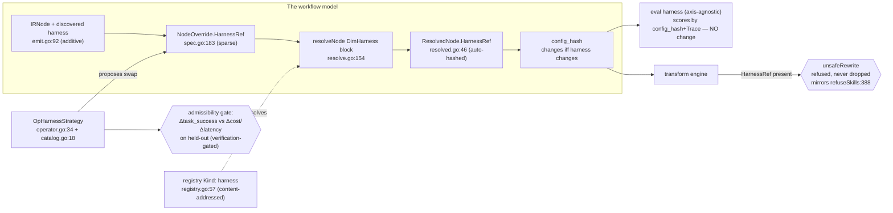

# PRD — P18: Harness Strategy Optimization (the scaffold around a node becomes a tunable dimension)

| Field | Value |
|---|---|
| Phase / Milestone | P18 / M21 |
| Target window | ~two waves: 18a the strategy catalog + the dimension (modelled, resolved, hashed, refused), then 18b the operator + cost/quality admissibility |
| Lead role(s) | System Designer + AI Engineer (co-leads) |
| Supporting role(s) | Backend, QA Engineer |
| Status | Draft |
| OpenSpec change | `p18-harness-strategy-optimization` |
| Related | P15 — node-graph wiring (concurrent sibling axis) · [ADR-001](../adr/ADR-001-source-transformation-apply-model.md) · [P3 — Context, Skills & Sandbox](P3-context-skills-sandbox.md) · [P5.5 — Proposals & Verification](P5.5-proposals-verification.md) |

> **Money-in-git rule.** No dollar amounts, percentages, or price bands appear in this document. Plans
> are referred to by **name only** — Free / Team / Business / Enterprise. Cost/quality trade-offs are
> stated in the platform's own machine metrics (`task_success`, `eval_cost_usd`, `eval_latency_ms`),
> never in currency.

## 1. Summary

Every optimization axis the platform ships today tunes what happens **inside one model call**: which
model (`DimModel`), which prompt (`DimPrompt`), which tools (`DimSkills`), which context (`DimContext`)
— `internal/variantspec/spec.go:42-47`. None of them can change **how many calls a node makes, or in
what control loop**. A node that today issues a single request could, for the same job, run a
reason-and-act tool loop, plan-then-execute its steps, or generate-and-critique with a second model —
and which *scaffold* wraps the call is frequently the difference between a right answer and a wrong one.
The platform cannot express that choice, cannot resolve it, cannot hash it, and cannot propose it.

The absence is total and it is honest: **there is no agent-harness, agent-loop, or scaffold concept
anywhere in the IR or the optimizer.** Every "harness" symbol in the tree belongs to the *eval* harness
(`internal/evalharness`), which is unrelated infrastructure. The only trace of an agent scaffold in the
whole codebase is a comment describing what *target* codebases contain —
`internal/irwriteback/recover.go:11` names "a ReAct loop" as a shape the platform *discovers*, never one
it *models*. The prior runtime harness (leader/follower/critic topology, ~1898 LOC) was removed in the
migration and is **not** carried forward; only its salvageable idea — a generator paired with a separate
critic — survives here as one catalog entry.

P18 introduces **harness strategy** as a new first-class Dimension by walking the repo's canonical
eight-step "add an axis" checklist. It delivers two capabilities. A **strategy catalog**
(`harness-strategy`): a new versioned registry Kind, `harness`, whose entries are content-addressed like
the other four registries and enumerate five builtin strategies — `single-shot`, `react-loop`,
`plan-execute`, `reflexion`, `critic-loop` — each declaring a params schema (`max_turns`, a stop
condition, an optional critic model ref, a retry budget). And a **harness dimension** (`agent-loop`): a
new `DimHarness` Dimension, a `NodeOverride.HarnessRef`, an auto-hashed `ResolvedNode` field, and an
additive IR field, so a harness choice **participates in `config_hash` and is scored by the existing
axis-agnostic harness with no eval change** (`internal/evalharness/evaluator.go`). Because materializing
a control loop at the call site is a **structural source rewrite that is not yet safe**, P18 ships the
modelled/resolvable/hashable axis with an **interim refusal at transform** — a node or node-group
carrying a `HarnessRef` is refused with a typed `unsafeRewrite`, never silently dropped, mirroring
`refuseSkills` (`internal/transform/rewrite.go:388`). The operator `OpHarnessStrategy` proposes scaffold
swaps under verification, and a **heavier harness is admissible only when the measured `task_success`
gain outweighs its added `eval_cost_usd`/`eval_latency_ms` on held-out data**. Milestone **M21 — the
scaffold is a managed dimension** means the choice of control loop is modelled, hashed, proposed, and
verified exactly like a model or prompt choice — and refused honestly wherever the codemod cannot yet
realize it.

## 2. Problem & context

The optimizer's power comes from a single structural fact: any effect that lands in `ResolvedConfig`
flows into `config_hash` (`internal/confighash`, purely structural, so a new field auto-participates in
identity), and the eval harness scores by `config_hash`+`Trace` **without ever reading a Dimension
label** (`internal/evalharness/family.go`). A new axis therefore needs only to land its effect in the
resolved configuration to be scored. Five problems block harness strategy from becoming such an axis:

- **The scaffold is invisible to the model of a workflow.** `IRNode` (`internal/discovery/emit.go:92`)
  records a node's model, prompt, skills and context, and `ResolvedNode`
  (`internal/variantspec/resolved.go:46`) freezes them. Neither records *how many turns the node runs or
  in what loop*. Two workflows identical in model/prompt/skills/context but one running a single shot and
  the other a ten-turn ReAct loop resolve to the **same `config_hash`** — the platform cannot tell them
  apart, so it can neither compare them nor attribute a quality difference to the scaffold.
- **The one place a scaffold appears, it appears as a thing observed, not modelled.** The platform's own
  write-back path already knows target agents come in shapes — `recover.go:11` enumerates "a ReAct loop, a
  script of independent LLM calls" as *discovered* topologies. That knowledge dead-ends: there is no
  Dimension, no registry Kind, and no operator that could turn "this node is a single shot; a ReAct loop
  would score higher" into a proposed, verified change.
- **The removed harness left a pattern, not a design.** The prior runtime harness (leader/follower/critic,
  ~1898 LOC) was adapted out in the migration. Re-introducing a runtime topology engine is explicitly
  *not* what this phase does. The salvageable residue is one idea — **generator + separate critic** — and
  it belongs in the catalog as data (`critic-loop`), not as resurrected runtime code.
- **A control loop is a structural rewrite, and structural rewrites are the unsafe frontier.** Today only
  `model` and `prompt` actually emit call-site edits; `refuseSkills` (`rewrite.go:388`) and `refuseContext`
  (`:417`) return a typed `unsafeRewrite` because constructing SDK tool values / context assembly at a
  call site is code generation, not argument substitution. Materializing a *control loop* — wrapping a
  single call in a bounded turn loop with a stop condition and a critic — is strictly more structural than
  either. It must follow the same honest interim: **modelled and hashed now, refused at transform until
  the codemod is safe**, never a silently dropped override.
- **A heavier scaffold is not free, and "it scored higher" is not sufficient to ship it.** A ten-turn
  loop can raise `task_success` while multiplying `eval_cost_usd` and `eval_latency_ms`. Without an
  explicit admissibility rule, the operator would propose expensive scaffolds that win on quality alone.
  The trade-off has to be a **first-class gate**, decided on held-out data so the win is not an artifact
  of the cases the proposal was tuned on.

**Upstream state assumed.** **P0** (the IR and `config_hash` contract every new field must extend
additively — `internal/confighash`, golden vectors). **P1** (discovery and `IRNode` — the frontend that
records a node's *discovered* default harness). **P2** (Variant Spec resolution and the transform engine
whose refusal contract P18 mirrors). **P3** (the sandbox and tool-grant model an autonomous loop's turns
run within — P18 adds turns, not a new egress surface). **P3.5** (pattern labels the operator's
admissibility keys on). **P4** (the axis-agnostic eval harness and its `task_success`/`eval_cost_usd`/
`eval_latency_ms` metrics — no change required). **P5.5** (the proposal/operator/verification spine
`OpHarnessStrategy` plugs into). **P15** (the concurrent node-graph wiring axis a *group* harness composes
with — a harness that wraps an ordered edge set, not a single node).

## 3. Goals & non-goals

### Goals

- **G1. Harness strategy is a first-class Dimension.** A node's scaffold SHALL be expressible as a sparse
  override (`DimHarness`), resolvable to a frozen value, and **identity-bearing in `config_hash`** — so
  two variants differing only in scaffold are distinct configurations the platform can compare.
- **G2. Strategies live in a versioned, content-addressed registry.** A new registry Kind `harness` SHALL
  seal each strategy by content address exactly as `model`/`prompt`/`skill`/`context` do
  (`internal/registry/registry.go:57`), so a `HarnessRef` in a spec is an immutable `version_id` that
  resolves the exact strategy bytes months later.
- **G3. The builtin catalog names five strategies.** `single-shot`, `react-loop`, `plan-execute`,
  `reflexion`, and `critic-loop` SHALL each be a registered strategy declaring its own params schema.
- **G4. `single-shot` is the explicit identity of today's implicit default.** A node with no harness
  override SHALL resolve to exactly what runs today; naming `single-shot` explicitly SHALL be a no-op on
  behavior and on `config_hash` for a node that already runs one call.
- **G5. The no-harness case hashes byte-identically to a pre-P18 configuration.** Adding the harness field
  SHALL NOT change the `config_hash` of any configuration that declares no harness, so every existing
  golden vector keeps reproducing (the expand-contract rule of `resolved.go`).
- **G6. A modelled-but-unrealizable harness is refused, never dropped.** A node or node-group carrying a
  `HarnessRef` SHALL be **refused at transform with a typed `unsafeRewrite`** naming the strategy and the
  reason, until the call-site materialization is proven safe. It SHALL NOT be silently ignored, and it
  SHALL NOT emit a diff that changes the loop incorrectly.
- **G7. The scaffold is scored with no eval change.** Because the harness effect lands in `config_hash`,
  the existing axis-agnostic eval harness SHALL score a harness variant with **no new metric and no
  scoring change** — the axis is admissible to eval the moment it participates in identity.
- **G8. A harness may wrap a node or an ordered edge set.** The dimension SHALL express both a
  **single-node** harness and a **node-group** harness (a subgraph / ordered edge set), and the group form
  SHALL compose with P15's wiring rather than duplicating it — the wiring says *what the edges are*, the
  harness says *what loop runs over them*.
- **G9. The operator proposes scaffold swaps under verification.** `OpHarnessStrategy` SHALL emit
  harness-override Variant Specs routed through the P5.5 verification path; **diagnosis proposes,
  verification decides** — no scaffold change ships on an unverified opinion.
- **G10. A heavier harness is admissible only when it earns its cost.** A strategy that adds turns SHALL be
  admitted over a lighter one only when the measured `task_success` gain outweighs its added
  `eval_cost_usd` and `eval_latency_ms`, decided on **held-out** cases.
- **G11. The added turns raise no new blast radius.** An autonomous multi-turn scaffold SHALL run within
  the node's **existing** P3 sandbox and tool grant; the added turns SHALL NOT widen egress or tool scope
  beyond what the node already holds. The increased surface SHALL be **observable**, not merely asserted.

### Non-goals (explicitly deferred or owned elsewhere)

- **Re-introducing a runtime topology engine.** The removed leader/follower/critic runtime is **not**
  resurrected. P18 models the scaffold as data and refuses its call-site materialization; a runtime that
  executes arbitrary topologies is out of scope for this phase.
- **Realizing the control-loop codemod.** Emitting the actual bounded-turn source at the call site is the
  named work behind the interim refusal (G6). It is deferred to the phase that proves the rewrite safe,
  exactly as `refuseContext` defers to P3.
- **Node-graph wiring itself** — **P15.** P18 consumes P15's ordered edge set for a group harness; it does
  not define, insert, or validate wiring. A harness change SHALL NOT reorder nodes.
- **New eval metrics.** P18 adds no metric; it reuses `task_success`, `eval_cost_usd`, `eval_latency_ms`
  (`internal/evalharness/metricnames.go`). A bespoke harness-quality metric, if ever needed, is an
  additive `RegisterMetric` call (`internal/evalharness/registry.go:86`), not part of this phase.
- **Provider-side "agent" features.** Vendor-hosted agent loops are a model capability, not a scaffold the
  platform materializes; they are represented, if at all, through `DimModel`, not here.

## 4. Users & personas

| Persona | What P18 is for them | What breaks without it |
|---|---|---|
| **AI engineer optimizing a workflow** (primary) | Try a node as `react-loop` vs `plan-execute` vs `single-shot`, get a scored, CI-bounded comparison, and see the cost the extra turns bought. | The scaffold is the one lever they cannot pull; they hand-edit loops and compare by eye with no `config_hash` to pin the result. |
| **System designer defining the axis** (primary) | A closed Dimension, a content-addressed Kind, and an additive field that leaves every golden vector intact — the axis added *by the checklist*, not bolted on. | A sixth ad-hoc override channel that hashes inconsistently and forks the identity contract. |
| **Optimizer (the autonomous engine)** (downstream subsystem) | `OpHarnessStrategy` in the catalog, with a prior and an admissibility gate, so scaffold swaps join the same propose→verify loop as model/prompt swaps. | Scaffold is the one improvement the engine can diagnose (a single-shot node failing a multi-step task) but never propose. |
| **QA engineer** | A refusal that can *go red* — a node carrying a `HarnessRef` must be refused with a typed error, and a no-harness config must hash unchanged, both asserted, not reviewed. | "It's modelled" collapses into "it silently did nothing," and the identity contract regresses without a failing test. |
| **Security reviewer** | A written guarantee that a harness's autonomous turns run inside the existing sandbox and grant, adding no egress path. | An autonomous loop quietly becomes a new blast-radius surface nobody scoped. |

Non-personas: the **end user of the customer's LLM product** (they never see a scaffold), and
**platform operators** (P8) — harness strategy is a workflow-configuration axis, not an operations one.

## 5. User stories / jobs-to-be-done

**AI engineer**
- As an AI engineer, I want to override one node's scaffold from `single-shot` to `react-loop` in a
  Variant Spec, so that I can measure whether a tool loop answers a multi-step case the single shot fails.
- As an AI engineer, I want the comparison to carry a distinct `config_hash`, so that the scored result is
  pinned and reproducible rather than an unrecorded hand edit.
- As an AI engineer, I want to see the `eval_cost_usd` and `eval_latency_ms` the extra turns cost next to
  the `task_success` they bought, so that I can decide whether the heavier scaffold is worth it.

**System designer**
- As a system designer, I want harness strategy added *through the eight-step checklist*, so that it is a
  closed Dimension, a content-addressed Kind, and an additive hashed field like every other axis.
- As a system designer, I want a node that declares no harness to hash byte-identically to today, so that
  no existing golden vector or keyed row is disturbed.

**Optimizer / AI engineer**
- As the optimizer, I want an `OpHarnessStrategy` operator with a prior and an admissibility gate, so that
  a scaffold swap is proposed, verified, and admitted on the same evidence bar as a model swap.
- As the optimizer, I want a heavier scaffold admitted only when it earns its cost on held-out cases, so
  that I never ship an expensive loop that won on the cases it was tuned on.

**QA engineer**
- As a QA engineer, I want the transform to *refuse* a node carrying a harness override with a typed
  error, so that "modelled but not yet applicable" is a visible, testable state and not a silent drop.

**Security reviewer**
- As a security reviewer, I want a written, observable guarantee that a multi-turn scaffold adds no egress
  path and stays inside the node's existing sandbox grant, so that autonomy does not smuggle in a new
  blast radius.

## 6. Functional requirements

Numbered FRs; each maps 1:1 to an OpenSpec requirement under
`openspec/changes/p18-harness-strategy-optimization/specs/`.

### The strategy catalog (capability `harness-strategy`)

- **FR1.** The registry SHALL gain a new Kind `harness`, sealed and decoded by content address exactly as
  the four existing Kinds (`internal/registry/registry.go:57`), so a `harness` `version_id` is unique
  across all registries and a ref pasted into the wrong dimension fails closed.
- **FR2.** The builtin catalog SHALL enumerate five strategies — `single-shot`, `react-loop`,
  `plan-execute`, `reflexion`, `critic-loop` — each a registered, content-addressed entry.
- **FR3.** Each strategy SHALL declare a **params schema** covering, as applicable: `max_turns` (a bounded
  turn ceiling), a **stop condition**, an optional **critic model ref**, and a **retry budget**. Params
  absent for a strategy (e.g. a critic ref for `single-shot`) SHALL be inexpressible for it, not silently
  ignored.
- **FR4.** A `HarnessRef` SHALL be an immutable registry `version_id` and nothing else; a spec that
  inlines a strategy definition SHALL be rejected, mirroring the ref-only rule for the existing dimensions
  (`internal/variantspec/spec.go:183`).
- **FR5.** Strategy params SHALL be validated at seal/registration: `max_turns` SHALL be a bounded
  positive integer, a declared critic model ref SHALL resolve to a `model` registry entry, and a retry
  budget SHALL be bounded. An out-of-range or unresolvable param SHALL fail registration, not resolution.
- **FR6.** `single-shot` SHALL be the explicit representation of today's implicit default: resolving a
  node that already runs one call to `single-shot` SHALL be a no-op on behavior **and** on `config_hash`.
- **FR7.** `critic-loop` SHALL express a generator paired with a **separate** critic model (the salvaged
  pattern from the removed harness), with the critic named by its own model ref in the params schema.

### The harness dimension (capability `agent-loop`)

- **FR8.** A new `Dimension` const `DimHarness` SHALL be added to the closed enum
  (`internal/variantspec/spec.go:42`), so every error and every iteration can name it and the set stays
  closed.
- **FR9.** `NodeOverride` SHALL gain a `HarnessRef` field (`spec.go:183`), additive and `omitempty`, with
  matching `isEmpty`/`Refs`/`Validate` participation — an absent field means "leave this node's scaffold
  as discovered."
- **FR10.** Resolution SHALL gain a `DimHarness` block in `resolveNode` and a `Dimensions()` entry
  (`internal/variantspec/resolve.go:67,154`): an overridden harness resolves to its registry entry and is
  pinned by `version_id`; an absent one falls back to the discovered default pinned by `source_revision`.
- **FR11.** `ResolvedNode` SHALL gain a `HarnessRef` field (`internal/variantspec/resolved.go:46`) that is
  **auto-hashed** by `config_hash`. It SHALL be additive and `omitempty` with a nil-when-empty shape, so a
  node that declares no harness emits **no** harness key and hashes byte-identically to a pre-P18 node
  (the D-1.4 expand-contract rule).
- **FR12.** The IR SHALL gain an **additive** field recording a node's **discovered** default harness
  (`internal/discovery/emit.go:92` + a discovery frontend), defaulting to `single-shot` unless discovery
  can prove a loop at the call site. The field SHALL be additive so no existing IR consumer breaks.
- **FR13.** `config_hash` SHALL change **iff** a node's resolved harness changes; reordering unrelated
  fields SHALL NOT change it, and a no-harness configuration SHALL hash exactly as before this phase.
- **FR14.** A node **or node-group** whose resolved configuration carries a `HarnessRef` SHALL be
  **refused at transform** with a typed `unsafeRewrite` naming the strategy and the reason (materializing a
  control loop is code generation, not an argument swap), mirroring `refuseSkills`
  (`internal/transform/rewrite.go:388`). It SHALL NOT be silently dropped and SHALL NOT emit an incorrect
  loop.
- **FR15.** The dimension SHALL express a harness that wraps a **single node** and a harness that wraps an
  **ordered edge set** (a node-group / subgraph). The group form SHALL **compose with P15's wiring**: the
  wiring (`VariantSpec.Order`/`Edges`, `spec.go:255-258`) defines the edges; the harness defines the loop
  that runs over them. A harness override SHALL NOT itself reorder nodes.
- **FR16.** The proposal catalog SHALL gain an `OpHarnessStrategy` operator (`operator.go:34`,
  `catalog.go:18`, `gain.go:8`) that emits harness-override Variant Specs, with a prior for verification
  ordering. Every proposed scaffold swap SHALL be routed through P5.5 verification.
- **FR17.** A heavier harness (more turns) SHALL be admitted over a lighter one **only** when the measured
  `task_success` gain outweighs its added `eval_cost_usd` and `eval_latency_ms`, computed on **held-out**
  cases. A swap that raises cost or latency without a commensurate `task_success` gain SHALL be rejected by
  the operator's admissibility gate.
- **FR18.** P18 SHALL introduce **no** new eval metric and **no** scoring change: a harness variant is
  scored by the existing axis-agnostic harness on `config_hash`+`Trace`
  (`internal/evalharness/evaluator.go`) using the standard metric family.
- **FR19.** An autonomous multi-turn scaffold SHALL run within the node's **existing** P3 sandbox and tool
  grant. The added turns SHALL NOT widen egress or tool scope beyond what the node already holds, and the
  increased turn/tool-call surface SHALL be **observable** in the trace, not merely asserted.

### This axis's delivery cells (capability `harness-delivery`)

Cross-axis rules are defined once in [P13](P13-prompt-model-optimization.md) §6 (`change-delivery`,
FR57–FR68) and [ADR-010](../adr/ADR-010-runtime-gradual-rollout.md); they are referenced, not restated.

> **A scaffold is structure; its bounds are numbers.** Swapping a node from a single call onto a
> reason-and-act loop changes how many calls the program makes and in what control flow — that is a loop,
> and no binding document introduces one. But `max_turns`, the retry budget and the stop condition are
> parameters of a loop that is **already written**, and those are data in exactly the sense the document
> was designed for.
>
> The distinction this axis must not lose is between two refusals that both mention the runtime and mean
> opposite things. **`hostAbsent`** says the strategy is deliverable and its host service simply is not
> running, so it refuses rather than substituting. **`notRuntimeResolvable`** says it cannot be delivered
> as data at all, host or no host. One is answered by starting a service; the other cannot be answered.
> A table that renders them alike sends an operator to restart something that was never the problem.

- **FR46.** A harness strategy swap SHALL be refused for the runtime route with cause
  `notRuntimeResolvable` in every language, for every strategy, and in every apply mode, naming the
  introduction of a control loop and suggesting no `bound` migration.
- **FR47.** A change confined to a strategy's bounded parameters — turn ceiling, retry budget, stop
  condition — SHALL be refused with cause `noRolloutBinding`, naming the absent binding document field.
  It SHALL NOT be reported as `notRuntimeResolvable`.
- **FR48.** The strategy cell and the parameter cell SHALL appear separately in the delivery table, with
  neither cause inferred from the other.
- **FR49.** Where a bounded parameter becomes rollout-eligible, an arm SHALL admit only values inside the
  strategy's declared `ParamsSchema`. An absent, unbounded, or non-positive turn ceiling SHALL be refused
  by the **same** validation the registry applies at seal, and a parameter the candidate strategy does
  not declare SHALL stay inexpressible rather than ignored.
- **FR50.** The `hostAbsent` execution refusal and the `notRuntimeResolvable` delivery cause SHALL be
  separate, separately readable conditions. An absent host SHALL NOT change delivery eligibility, and a
  delivery refusal SHALL NOT offer starting a host service as a remedy.
- **FR51.** Authoring a rollout whose candidate arm swaps the harness strategy SHALL be refused with the
  transform's typed cause, no document carrying a harness strategy SHALL be written, and the totality
  canary SHALL cover both routes.

## 7. Non-functional requirements

| # | Requirement | Target |
|---|---|---|
| **NFR1** | **Hash participation** | The harness field participates in `config_hash` purely structurally; a harness change is the *only* thing that changes the hash of an otherwise-identical config. Asserted by a golden test, not by inspection. |
| **NFR2** | **Backward-compatible identity** | A configuration declaring no harness hashes **byte-identically** to its pre-P18 form; every existing golden vector reproduces unchanged. Machine-enforced (`resolved_config_golden_test`). |
| **NFR3** | **Interim-refusal, machine-enforced** | A resolved config carrying a `HarnessRef` is refused at transform with a typed `unsafeRewrite`; the refusal is asserted by a test that would fail if the override were silently dropped or an incorrect loop emitted. |
| **NFR4** | **Determinism** | The same spec at the same `source_revision` with the same registry state resolves to an identical `HarnessRef` and an identical `config_hash`. |
| **NFR5** | **Bounded autonomy** | Every multi-turn strategy declares a bounded `max_turns` and a stop condition; no strategy can express an unbounded loop. A run that would exceed `max_turns` terminates and is recorded, never hangs. |
| **NFR6** | **Sandbox containment** | The added turns of any strategy execute within the node's existing P3 sandbox and tool grant; no new egress destination or tool becomes reachable because a heavier scaffold was chosen. Observable in the trace. |
| **NFR7** | **Held-out admissibility** | The cost/quality admissibility (FR17) is computed on cases disjoint from any used to generate the proposal; the gate cannot be satisfied by tuning on its own test set. |
| **NFR8** | **Fail-static resolution** | An unresolvable or malformed `HarnessRef` fails the resolve closed with a typed error naming the ref; it never falls back to a different strategy silently. |
| **NFR9** | **Registry uniqueness** | A `harness` `version_id` is unique across all five registries; a `harness` ref used in a non-harness dimension (or vice versa) fails closed. |

## 8. System design summary

### 8.1 Where the axis lands on the spine



The axis is added strictly through the canonical eight-step checklist: a new `Dimension` const, a
`NodeOverride` field, a `resolveNode`/`Dimensions()` block, a `ResolvedNode` field, a registry `Kind`, an
additive IR field + discovery frontend, the per-dimension rewriter (**which refuses**), and an operator +
catalog row + prior. Because `config_hash` is purely structural, step 4 alone makes the axis scorable;
the eval harness never changes.

### 8.2 The one asymmetry: modelled everywhere, materialized nowhere (yet)

`model` and `prompt` are the only dimensions that emit call-site edits today. `skills` and `context` are
modelled, resolved, and hashed but **refused** at transform because their materialization is code
generation. **Harness is strictly more structural than either** — wrapping a call in a bounded loop with
a stop condition and a critic is not an argument swap. P18 therefore ships the axis at exactly the same
honesty level as `skills`/`context`: fully modelled and identity-bearing, **refused at the codemod
boundary** with a typed error, until a later phase proves the loop rewrite safe. The refusal is not a gap
to hide — it is the contract that keeps a modelled-but-unrealizable override from becoming a silently
dropped one.

### 8.3 Decisions, with what was rejected

| # | Decision | Rejected alternative | Why (八级法则) |
|---|---|---|---|
| **D1** | **Harness is a new closed `Dimension`, added by the eight-step checklist** | A free-form "strategy" string on the node, or a params bag on an existing dimension | **L6 不可扩展 + L8.** A closed enum keeps every error nameable and the axis auto-participating in `config_hash`; a string forks the identity contract and invites a stringly-typed sixth channel that hashes inconsistently. |
| **D2** | **Strategies are a content-addressed registry Kind `harness`** | Hard-code the five strategies as an in-code table | **L5 不可演进.** A registry Kind lets a strategy be versioned, referenced by immutable id, and resolved back from a `config_hash` months later; an in-code table cannot be pinned and breaks lineage the moment the table changes. |
| **D3** | **A `HarnessRef` carrying a harness is refused at transform, never dropped** | Silently no-op the override until the codemod exists | **L1 安全 + L2 稳定.** A silent drop scores a variant *as if* the scaffold changed when it did not — a false result an eval platform must never produce. A typed `unsafeRewrite` fails visibly and keeps the result honest. |
| **D4** | **Harness composes with P15 wiring; it never reorders** | Let a group harness re-derive its own edge set | **L5/L7 单一真相.** Wiring is P15's single source of truth for *what the edges are*; a harness that re-derived them would be a second, divergent definition. The harness says only *what loop runs over the given edges*. |
| **D5** | **A heavier harness is admissible only when Δtask_success outweighs Δcost/Δlatency, on held-out data** | Admit any scaffold that raises `task_success` | **L1 honesty + strategy.** "It scored higher" ignores the turns it burned; admitting a cost blow-up as a win produces a bill the customer did not agree to buy quality with. Held-out framing stops a win that is really overfit to the tuning set. |
| **D6** | **`single-shot` is the explicit identity of the implicit default; no-harness hashes unchanged** | Make every node always carry an explicit harness field | **L2 稳定.** Always-present would change the golden bytes of **every** node in **every** existing config, breaking P0's frozen `config_hash`. Additive `omitempty` is the only shape that satisfies "changes iff harness changes" **and** "no-harness unchanged" at once (mirrors D-1.4). |
| **D7** | **Autonomous turns run in the node's existing P3 sandbox and grant; surface is observable** | Give an agent loop a broader grant so it can "do more" | **L1 安全.** More turns of autonomous tool-calling already enlarge the blast radius; widening the grant on top would compound it. The turns stay inside the existing sandbox, and the enlarged turn/tool surface is made **observable** — the sales-honest word is *observable*, never "controlled." |
| **D8** | **No new eval metric; scored by the existing axis-agnostic harness** | Add a bespoke "harness quality" metric | **L7 维护.** The harness scores by `config_hash`+`Trace` and never reads a Dimension label, so the axis is scorable the moment it hashes. A bespoke metric is a second thing to keep calibrated for no gain; if ever needed it is an additive `RegisterMetric`, not this phase. |

### 8.4 Data model additions

```
registry Kind "harness"           // registry.go:57 — fifth Kind, content-addressed like the others
HarnessSpec = {                    // the sealed strategy definition
    name: "single-shot"|"react-loop"|"plan-execute"|"reflexion"|"critic-loop",
    params_schema: { max_turns?: int>0, stop_condition?, critic_model_ref?: model version_id,
                     retry_budget?: int>=0 } }   // FR3/FR5 — params inexpressible for a strategy are absent, not ignored

NodeOverride.HarnessRef  string  `json:"harness_ref,omitempty"`    // spec.go:183 — sparse, ref-only (FR4/FR9)
ResolvedNode.HarnessRef  string  `json:"harness_ref,omitempty"`    // resolved.go:46 — auto-hashed, nil-when-empty (FR11)
IRNode.DiscoveredHarness string  `json:"discovered_harness,omitempty"` // emit.go:92 — additive default (FR12)

OperatorKind OpHarnessStrategy = "harness_strategy"   // operator.go:34 + catalog row + prior (FR16)
```

No new store beyond the registry Kind's own `harness_entry` table (a new DB table — a one-way door, see
`decisions.md`). The eval path, the scoring path, and the `config_hash` producer are unchanged; the
axis rides the existing spine.

## 9. Design by role lens

**System Designer (co-lead) — *the axis is added by the checklist, or it is not added.***
The whole point of the optimizer spine is that a new axis is a mechanical eight-step exercise, and the
discipline is to refuse every shortcut that would make harness a special case. It is a **closed
`Dimension`** (`spec.go:42`) so errors can name it and the set stays finite. It is a **content-addressed
registry Kind** (`registry.go:57`) so a strategy is versioned and a `HarnessRef` resolves the exact bytes
from a `config_hash` later — the same lineage guarantee the other four Kinds give. It is an **additive,
`omitempty`, nil-when-empty `ResolvedNode` field** (`resolved.go:46`) so it auto-participates in
`config_hash` **and** leaves every golden vector byte-identical — the expand-contract rule the registry
and IR already live by, applied exactly as D-1.4 applied it to bindings. The one-way doors — a new Kind, a
new Dimension, a new DB table, the interim-refusal contract, the harness-vs-wiring boundary, and the
cost/quality admissibility rule — are walked in `decisions.md` before any code, because each is a contract
a future reader depends on and none can be retracted once shipped.

**AI Engineer (co-lead) — *the scaffold is the lever the diagnosis already points at, and it must be
verified like any other.***
A single-shot node failing a multi-step case is a diagnosis the platform can already form; what it lacks
is an operator that turns it into a proposal. `OpHarnessStrategy` (`operator.go:34`, `catalog.go:18`,
`gain.go:8`) supplies exactly that, and it obeys the spine's one rule: **diagnosis proposes, verification
decides.** No scaffold swap ships on an unverified opinion. The operator's hardest content is the
**admissibility gate** (FR17). A heavier scaffold almost always raises `task_success` *somewhere* while
multiplying `eval_cost_usd` and `eval_latency_ms`; admitting it on quality alone would let the engine buy
a marginal win with an unbounded cost blow-up. So a heavier harness is admitted only when the measured
`task_success` gain outweighs its added cost and latency, and only on **held-out** cases — because a win
measured on the cases the proposal was shaped against is not a win, it is overfitting with a confidence
interval. The engine reuses the existing metrics (`metricnames.go`) verbatim: the axis is scorable the
moment it hashes, and a second metric is a second thing to keep honest for no gain.

**Backend (support) — *model it, resolve it, hash it — and refuse it, loudly.***
The resolve path gains a `DimHarness` block in `resolveNode` (`resolve.go:154`) and a `Dimensions()`
entry (`:67`): an override resolves to its registry entry pinned by `version_id`, an absent one falls back
to the discovered default pinned by `source_revision` — the same merge rule every dimension follows. The
security-critical Backend work is the **refusal**. Harness is strictly more structural than skills or
context, so its rewriter follows `refuseSkills`/`refuseContext` (`rewrite.go:388`,`:417`) exactly: a
resolved config carrying a `HarnessRef` returns a typed `unsafeRewrite` (`edit.go:90`) naming the strategy
and the reason, on **both** engines. The failure mode this forecloses is the dangerous one — a silently
dropped override that lets the platform score a variant *as if* its scaffold changed when the emitted
source did not. A refusal that can be read from a test is the whole of the honesty here; a silent no-op is
a false result wearing a green build.

**QA Engineer (support) — *the two claims that matter cannot be read from the code.***
Two guarantees decide this phase and neither survives a code review alone. First, **no-harness hashes
unchanged**: a golden test must assert that a configuration declaring no harness produces byte-identical
`config_hash` to its pre-P18 form — if the field leaked into the bytes of every node, every keyed row
would orphan, and only a failing test catches it. Second, **the refusal can go red**: a test must add a
`HarnessRef` to a resolved node and assert the transform returns a typed `unsafeRewrite` — and a companion
test must assert the override is **not** silently dropped (the resolved config still carries it; the
transform refuses rather than emits). Beyond those: determinism (same spec → same `HarnessRef` → same
`config_hash`), fail-static resolution (an unresolvable ref fails closed naming the ref, never falls back
to a different strategy), bounded autonomy (a strategy cannot express an unbounded loop; a run hitting
`max_turns` terminates and is recorded), and the admissibility gate exercised with a scaffold that raises
cost without a commensurate `task_success` gain — which must be **rejected**, because a gate that never
rejects is decoration.

### 9.x Delivery cells on this axis, by role lens

**System Designer — *a scaffold is structure; its bounds are numbers.***
Swapping a node onto a reason-and-act loop changes how many calls the program makes and in what control
flow. That is a loop, and no binding document introduces one — permanent, on the same footing as
wiring. But `max_turns`, the retry budget and the stop condition are parameters of a loop **already
written**, which is data in exactly the sense the document was designed for. Two cells, two causes, and
a table that carried one "harness" row would be wrong about both.

**Backend — *a rollout must not become the one place a bound can be removed.***
Where the parameter cell opens, an arm admits only values inside the strategy's declared `ParamsSchema`,
validated by the **same function** the registry applies at seal — passed in rather than
re-implemented. A second validator would drift, and it would drift toward permissive, because that is
the direction that makes a failing request succeed. A parameter the strategy does not declare stays
**inexpressible** rather than ignored: silently dropping it is how a user sets a ceiling, sees nothing
change, and has nothing to read.

**DevOps + QA — *the distinction that costs an afternoon when it is lost.***
`hostAbsent` says the strategy is deliverable and its host service is simply not running here and now —
it refuses rather than substituting, and starting the service fixes it. `notRuntimeResolvable` says the
change cannot be delivered as data at all, host or no host, and nothing fixes it. They are carried as
**different fields**: an execution condition travels beside the routes and does not alter delivery
eligibility, and a delivery refusal never mentions a host service or offers restarting one. NFR16 makes
that executable; NFR17 extends the totality canary so a node built to carry a real strategy comes back
refused on **each** route.

**Sales Operations — *what may be said about this axis.***

| Say | Never say | Why |
|---|---|---|
| "the scaffold is modelled, hashed and proposed" | "we optimize your agent loop automatically" | It is refused at transform wherever no materializer exists, and refused by the runtime route everywhere. |
| "turn ceilings are a field we have not shipped" | "harness tuning is not supported" | One cell is ours to close; saying neither is possible misrepresents both. |
| "a heavier scaffold has to earn its cost" | "more turns means better answers" | Admissibility is decided on held-out data, and a heavier loop that answers no better is rejected. |
| 🚫 — | "we can change your agent's loop live" | The scaffold refuses the runtime route in **every** language. |

## 10. Dependencies

**Requires**
- **P0** — the `config_hash` contract and golden vectors the additive harness field must extend without
  disturbing (`internal/confighash`).
- **P1** — discovery and `IRNode`, where the discovered default harness is recorded
  (`internal/discovery/emit.go:92`).
- **P2** — Variant Spec resolution and the transform engine whose refusal contract this mirrors.
- **P3** — the sandbox and tool-grant model the autonomous turns run within.
- **P3.5** — pattern labels the operator's admissibility keys on.
- **P4** — the axis-agnostic eval harness and its metrics (`task_success`, `eval_cost_usd`,
  `eval_latency_ms`), consumed unchanged.
- **P5.5** — the proposal/operator/verification spine `OpHarnessStrategy` plugs into.
- **P15** — the concurrent node-graph wiring axis a group harness composes with (an ordered edge set).

**Unblocks**
- The optimizer can propose **scaffold** changes, not only model/prompt/skills/context ones — closing the
  gap between a diagnosable single-shot failure and a proposable fix.
- A later phase that proves the control-loop codemod safe inherits a fully modelled, hashed, and refused
  axis to *turn on* — the refusal is the seam it lands in, exactly as P3 landed in `refuseContext`.

## 11. Risks & mitigations

| Risk | Owner | Mitigation |
|---|---|---|
| A harness override is silently dropped and a variant is scored as if its scaffold changed | Backend + QA | Typed `unsafeRewrite` refusal (FR14), plus a test asserting the override is present-and-refused, not absent (NFR3). A silent drop must make a test fail. |
| The additive field changes the `config_hash` of existing configs | System Designer | `omitempty` + nil-when-empty, no-harness emits no key; golden test asserts byte-identical (NFR2, mirrors D-1.4). |
| The operator ships an expensive scaffold that won on quality alone | AI Engineer | Cost/quality admissibility on held-out data (FR17, NFR7); a swap raising cost/latency without a commensurate `task_success` gain is rejected. |
| An autonomous loop becomes a new blast-radius surface | Backend + Security | Turns run in the node's existing P3 grant; no new egress/tool scope; surface is **observable** in the trace (FR19, NFR6). Bounded `max_turns` forecloses runaway autonomy (NFR5). |
| A group harness diverges from P15's wiring | System Designer | The harness composes with, never re-derives, the ordered edge set; it SHALL NOT reorder (FR15, D4). |
| Scope creep into a runtime topology engine (resurrecting the removed harness) | System Designer | Non-goal, explicit: P18 models the scaffold as data and refuses its materialization; only `critic-loop` carries the salvaged pattern, as data. |
| An unbounded or unresolvable strategy | Backend + QA | Params validated at seal (FR5); `max_turns`/retry-budget bounded (NFR5); an unresolvable ref fails closed naming the ref (NFR8). |

## 12. Rollout & test strategy

**Wave 18a — the catalog and the dimension.** The `harness` registry Kind and the five builtin
strategies; `DimHarness`; `NodeOverride.HarnessRef`; the `resolveNode`/`Dimensions()` block; the auto-
hashed `ResolvedNode.HarnessRef`; the additive IR field + discovery default; and the **interim refusal**
at transform. Ends when a harness override resolves, hashes (changing `config_hash` iff it changes,
byte-identical when absent), is **scored by the unchanged eval harness**, and is **refused** at transform
with a typed error.

**Wave 18b — the operator and admissibility.** `OpHarnessStrategy` in the catalog with a prior, routed
through P5.5 verification; the cost/quality admissibility gate on held-out data; and the observable-
surface guarantee for autonomous turns.

**How correctness is proven.**
1. **Hash participation** — a harness change is the only edit that changes an otherwise-identical
   `config_hash`; asserted by a golden test.
2. **Backward-compatible identity** — a no-harness config hashes byte-identically to its pre-P18 form;
   every existing golden vector reproduces.
3. **Interim refusal** — a resolved config carrying a `HarnessRef` is refused with a typed `unsafeRewrite`
   on both engines; a companion test asserts the override is present-and-refused, never silently dropped.
4. **Determinism / fail-static** — same spec → same `HarnessRef` → same `config_hash`; an unresolvable ref
   fails closed naming the ref.
5. **Bounded autonomy** — no strategy expresses an unbounded loop; a run hitting `max_turns` terminates
   and is recorded.
6. **Scored with no eval change** — a harness variant is scored by the existing harness with no new
   metric.
7. **Admissibility** — a scaffold raising `eval_cost_usd`/`eval_latency_ms` without a commensurate
   `task_success` gain is **rejected** on held-out cases; a gate that never rejects is a failing test.
8. **Sandbox containment** — the added turns reach no egress destination or tool outside the node's
   existing grant, and the enlarged surface is observable in the trace.

## 13. Success metrics & acceptance criteria (M21 exit checklist)

- [ ] **A1.** A `harness` registry Kind exists, content-addressed like the other four, with five builtin
      strategies each declaring a params schema (G2, G3, FR1–FR3, FR5).
- [ ] **A2.** A `HarnessRef` is a resolvable immutable `version_id`; an inlined strategy is rejected
      (G2, FR4).
- [ ] **A3.** `DimHarness` is in the closed Dimension enum; `NodeOverride`/`ResolvedNode` carry an
      additive harness field (G1, FR8, FR9, FR11).
- [ ] **A4.** A harness change changes `config_hash`; a no-harness config hashes **byte-identically** to
      its pre-P18 form — both asserted by a golden test (G1, G5, FR13, NFR1, NFR2).
- [ ] **A5.** `single-shot` on a one-call node is a no-op on behavior and on `config_hash` (G4, FR6).
- [ ] **A6.** A resolved config carrying a `HarnessRef` is **refused at transform** with a typed
      `unsafeRewrite`, and a test proves the override is present-and-refused, not silently dropped
      (G6, FR14, NFR3).
- [ ] **A7.** The IR records a discovered default harness additively, defaulting to `single-shot`
      (FR12).
- [ ] **A8.** A harness variant is **scored by the existing eval harness with no new metric and no scoring
      change** (G7, FR18).
- [ ] **A9.** A group harness composes with P15's ordered edge set and never reorders (G8, FR15, D4).
- [ ] **A10.** `OpHarnessStrategy` proposes scaffold swaps routed through P5.5 verification (G9, FR16).
- [ ] **A11.** A heavier harness is admitted **only** when Δ`task_success` outweighs Δ`eval_cost_usd`/
      Δ`eval_latency_ms` on **held-out** cases; a cost-only win is rejected (G10, FR17, NFR7).
- [ ] **A12.** Every strategy declares a bounded `max_turns` and stop condition; no unbounded loop is
      expressible, and a run hitting the ceiling terminates and is recorded (NFR5).
- [ ] **A13.** An autonomous scaffold's added turns stay within the node's existing P3 sandbox and grant,
      add no egress/tool scope, and the enlarged surface is **observable** in the trace (G11, FR19, NFR6).
- [ ] **A14.** An unresolvable/malformed `HarnessRef` fails the resolve closed naming the ref; a
      cross-dimension ref fails closed (NFR8, NFR9).

- [ ] **A27.** A harness strategy swap reports `notRuntimeResolvable` in every language, every strategy
      and both apply modes, naming the control loop and suggesting no `bound` migration (FR46).
- [ ] **A28.** A bounded-parameter change reports `noRolloutBinding` naming the absent document field,
      and the strategy cell and parameter cell render as separate rows with different causes (FR47, FR48).
- [ ] **A29.** A rollout arm cannot carry an absent, unbounded or non-positive turn ceiling — refused by
      the same validation the registry applies at seal — and an inapplicable parameter stays
      inexpressible rather than ignored (FR49).
- [ ] **A30.** 🔴 `hostAbsent` and `notRuntimeResolvable` render as distinct conditions everywhere; an
      absent host does not change delivery eligibility, and no delivery refusal offers starting a service
      as a remedy (FR50, NFR16).
- [ ] **A31.** 🔴 Authoring a rollout with a harness candidate arm is refused with the transform's typed
      cause, no document carrying a strategy is written, and the totality canary comes back refused on
      **each** route — with a sabotaged refusal on either turning the cell red (FR51, NFR17).

## 14. Open questions

1. **How deep does discovery go in proving a non-`single-shot` default?** M21 records `single-shot`
   unless discovery can *prove* a loop at the call site (conservative, like P10's `in_scope` fail-closed).
   Whether a heuristic ReAct-shape detector (the `recover.go:11` topologies) graduates from a
   proof-required default is deferred to the discovery frontend's own decision, tracked in P1.
2. **Does the group-harness scope live on the spec or is it derived from P15's edge set?** The M21 default
   is that a group harness names an **explicit** ordered edge set on the override (auditable in the diff),
   composing with P15 rather than inferring a subgraph. Inferred subgraph scoping is deferred until P15's
   wiring identity is frozen.
3. **What is the exact `max_turns` ceiling and retry-budget bound?** Bounded is a requirement (NFR5); the
   specific ceiling is a params-schema constant decided with the sandbox owner (P3) before any strategy
   seals, so the bound is one machine source of truth, not a per-strategy guess.
4. **When does the control-loop codemod stop refusing?** The refusal is the seam a later phase lands in
   (as P3 landed in `refuseContext`). Which phase proves the bounded-loop rewrite safe, and for which
   languages first, is out of scope for M21 and tracked against the transform engine's roadmap.

---

# Addendum — the harness runtime, the call-site rewriter, and the authored change

| Field | Value |
|---|---|
| Adds to | §3 (goals G12–G17), §6 (FR22–FR45), §7 (NFR10–NFR15), §13 (A15–A26) |
| Capabilities | `harness-runtime` (new) · `harness-materialization` (new) · `harness-authoring` (new) · `agent-loop` (refusal **narrowed per cell**, not removed) |
| Contracts of record | [`decisions.md`](../../openspec/changes/p18-harness-strategy-optimization/decisions.md) D-8 … D-13 |

## 15. What this addendum adds, and why the phase was not complete without it

Sections 1–14 describe an axis that is **modelled, hashed, proposed, and refused**. Two things were
missing, and each is load-bearing rather than cosmetic.

**A user could not make an active change to their harness strategy.** As written, a scaffold changes only
when `OpHarnessStrategy` proposes one. That makes harness the one operator-only axis: model, prompt,
skills, context, wiring and memory all bind the cross-axis `authored-change` contract — *a user MAY author
the change, a user MAY NOT author the evidence* — and harness must too, through the **same** override,
the **same** resolver, the **same** transform, and the **same** admissibility gate. A second apply path
would be a second definition of what "shipped" means.

**The refusal named two missing artifacts, and nothing was building them.** G6 refuses a `HarnessRef` at
transform because *"materializing a control loop is code generation."* That sentence names precisely what
is absent: **a harness runtime** — a bounded loop, a stop condition, and a continuation rule — and **the
call-site rewriter** that drives it. Without both, the axis can be authored, hashed and compared but can
never reach a customer's source, and an *interim* refusal is indefinite by another name.

### 15.1 Additional goals

- **G12. There is a harness runtime.** The platform SHALL define each builtin strategy's loop — the
  continue/stop decision and the continuation rule — **once**, bounded by construction, deterministic, and
  callable by the generated artifact rather than re-derived per language.
- **G13. There is a call-site rewriter.** A resolved harness SHALL be materializable as source at a call
  site wherever it can be materialized **honestly**, and refused by name wherever it cannot.
- **G14. DRIVE AND DECIDE, or refuse.** A cell SHALL materialize only when the runtime can both re-invoke
  the call **and** evaluate the strategy's stop condition against the response. A call site that can carry
  one half but not the other SHALL be refused **whole**, naming the missing half.
- **G15. The generated module reaches nothing new.** The emitted artifact SHALL make no provider call,
  dispatch no tool, read no credential, and import nothing outside the standard library. A planner, a tool
  executor and a critic are **injected host services**; a strategy whose service is absent SHALL refuse
  rather than substitute a lighter loop.
- **G16. The refusal narrows per cell; it is never removed.** Coverage SHALL become a read of the
  materializer table per `(language, strategy, call-shape)`. `single-shot` is the identity and
  materializes everywhere; every uncovered cell SHALL still return a typed `unsafeRewrite` with its own
  cause class.
- **G17. A user can change their scaffold, and is told the truth before they choose.** A user SHALL be
  able to select, parameterize and clear a node's harness strategy; the **per-cell** boundary and the
  **added per-run cost** of a heavier scaffold SHALL be stated **before** the choice, from the engine's own
  coverage source; and the change SHALL claim nothing until verification has run.

### 15.2 Additional functional requirements

#### The harness runtime (capability `harness-runtime`)

- **FR22.** A harness runtime SHALL define, for every strategy in the closed builtin set, a
  `Plan(strategy, params, turn, answer) → continue | stop(reason)` decision and the continuation rule that
  produces the next turn's input. A strategy in the sealed vocabulary without a loop definition SHALL fail
  loudly rather than degrading to a single shot.
- **FR23.** The loop SHALL be **bounded by construction**: no strategy and no combination of params SHALL
  express an unbounded loop, and the executed turn count SHALL never exceed the sealed `max_turns`.
- **FR24.** A run that terminates because it reached the ceiling SHALL record that reason, distinguishably
  from a run that terminated because its stop condition was satisfied.
- **FR25.** The loop SHALL be **deterministic**: identical strategy, params and answers SHALL produce an
  identical turn count, stop reason and per-turn record. The runtime SHALL read no clock and no random
  source.
- **FR26.** The runtime SHALL make **no provider call**, dispatch **no tool**, open **no network
  connection**, and read **no credential**.
- **FR27.** A planner, a tool executor and a critic SHALL be **injected host services**. A strategy
  requiring one that was not supplied SHALL refuse with a typed error **naming the service**, and SHALL NOT
  fall back to a lighter strategy's loop.
- **FR28.** A run SHALL expose the number of turns executed, the stop reason, and a per-turn record. None
  of these SHALL participate in `config_hash`.
- **FR29.** The added turns SHALL execute the caller-supplied turn function and nothing else; the runtime
  SHALL NOT widen the egress destinations, tool grants, or filesystem scope available at the call site.

#### The call-site rewriter (capability `harness-materialization`)

- **FR30.** A cell SHALL materialize only when **both** halves are available — the call is re-invocable and
  the stop condition is evaluable against the response — and both SHALL be resolved **before** the first
  edit is emitted.
- **FR31.** A call site that can carry one half but not the other SHALL be refused **whole**, naming which
  half is missing.
- **FR32.** `single-shot` SHALL be the identity: it emits nothing, materializes in every language, and is
  never reported as refused.
- **FR33.** A strategy requiring a host service SHALL be refused at a call site — which offers no injection
  point — **naming the service**, and SHALL NOT be degraded to a strategy that does not need one. This
  covers `react-loop` (tool execution), `plan-execute` (planning and step execution) and `critic-loop` (a
  separate critic call).
- **FR34.** The emitted artifact SHALL import nothing outside its language's standard library.
- **FR35.** The emitted artifact SHALL regenerate **byte-identically** from the same resolved
  configuration.
- **FR36.** The emitted artifact SHALL ship in the **same patch** as the call-site edit, so one revert
  restores both.
- **FR37.** The emitted artifact SHALL read the strategy and its params **as data** from the binding
  document, so retuning a bound parameter is a document change and not a code change.
- **FR38.** Coverage SHALL be a **read of the materializer table** per `(language, strategy, call-shape)`,
  never a second table, so a coverage claim cannot drift from the engine's behaviour in either direction.
- **FR39.** Every cell without a materializer SHALL still return a typed `unsafeRewrite` carrying its own
  cause class, and the resolved configuration SHALL still carry the override — **refuse, never drop**
  remains true wherever it still applies.
- **FR40.** A cause class SHALL be assigned honestly: a permanent language fact (a response whose text is
  not readable without importing the customer's SDK) SHALL be `not-expressible-at-a-call-site` and SHALL
  carry **no** missing artifact; only a genuinely absent platform artifact SHALL be
  `no-materializer-for-this-language`.
- **FR41.** Materialization SHALL change only what the transform **emits**. Every `config_hash` minted
  before the rewriter landed SHALL reproduce bit-for-bit after it, and a stored harness configuration SHALL
  materialize without being re-authored.

#### The authored change (capability `harness-authoring`)

- **FR42.** A user SHALL be able to select a node's harness strategy from the closed builtin set and supply
  its params, expressed **solely** through the existing `HarnessRef` override. Free text SHALL NOT be a
  selection path; params violating the strategy's schema — including a param the strategy does not declare
  — SHALL be rejected **before** the entry is sealed, naming the parameter.
- **FR43.** A user SHALL be able to **clear** a node's harness strategy, and clearing SHALL reproduce the
  pre-selection `config_hash` byte-identically. `single-shot` with no params SHALL be indistinguishable
  from cleared.
- **FR44.** The authoring surface SHALL state the **per-cell** boundary and the **added per-run cost** of a
  heavier scaffold **before** the user chooses, read from the engine's own coverage source. A control SHALL
  NOT be silently disabled; where a selection cannot be applied, the reason SHALL be readable and SHALL
  distinguish a missing platform artifact from a fact about the user's call site or language.
- **FR45.** An authored harness change SHALL be stamped `unverified`, SHALL claim no `task_success`, cost
  or latency effect until verification has run, and — where its cell refuses — SHALL be surfaced as
  **refused-not-scored**, never as a win, a regression, or a tie. Exactly **one** transform entry point and
  **one** admissibility gate SHALL serve both origins; there SHALL be no authoring-only apply path.

### 15.3 Additional non-functional requirements

| # | Requirement | Target |
|---|---|---|
| **NFR10** | **Both halves or refuse** | A half-materializable call site is refused whole; a test asserts the refusal names the missing half and would fail if a partial loop were emitted. |
| **NFR11** | **No new reachability** | The emitted artifact's import set is asserted to be standard-library-only, and no provider client, credential, or network destination is reachable from the runtime. |
| **NFR12** | **Byte-identical regeneration** | The same resolved configuration regenerates the artifact byte-for-byte; asserted, not assumed. |
| **NFR13** | **Coverage is derived** | The coverage read and the transform's answer for the same cell are asserted equal; a hand-maintained copy is a test failure. |
| **NFR14** | **Identity untouched** | Every `config_hash` minted under 18a reproduces bit-for-bit after the rewriter lands. |
| **NFR15** | **Cost stated before the choice** | For any strategy whose ceiling exceeds one turn, the surface states that per-run cost and latency may multiply up to that ceiling, and that whether it is worth it is verification's answer, not the selection's. |
| **NFR16** | **The two runtime refusals never merge** | A test asserts `hostAbsent` and `notRuntimeResolvable` render as distinct conditions in the console, the offline table and the API, and that a delivery refusal never names a host service. Merging them turns it red — the cost of the merge is an operator restarting the wrong thing. |
| **NFR17** | **Refusal totality spans both routes** | The harness totality canary is extended so a node built to carry a real strategy comes back refused on **each** route, and a sabotaged refusal on either turns the cell red. Adding a route without extending the canary would quietly make the refusal decoration. |

## 16. Additional acceptance criteria (M21 exit checklist, addendum)

- [ ] **A15.** A harness runtime defines every builtin strategy's loop once; a strategy in the sealed
      vocabulary without a definition fails loudly (G12, FR22).
- [ ] **A16.** The turn count never exceeds the sealed `max_turns`, for every strategy and every params
      combination (G12, FR23, NFR5).
- [ ] **A17.** Reaching the ceiling is recorded and is distinguishable from a satisfied stop condition
      (FR24).
- [ ] **A18.** The loop is deterministic over repeated execution (FR25, NFR4).
- [ ] **A19.** The runtime makes no provider call and dispatches no tool; a missing host service refuses by
      name rather than substituting (G15, FR26, FR27, NFR11).
- [ ] **A20.** A half-materializable call site is refused **whole**, naming the missing half; both halves
      are computed before any edit is emitted (G14, FR30, FR31, NFR10).
- [ ] **A21.** `single-shot` emits nothing, materializes in every language, and is never reported as
      refused (G16, FR32).
- [ ] **A22.** `react-loop`, `plan-execute` and `critic-loop` are refused at every call site, each naming
      the host service a generated module may not supply (FR33).
- [ ] **A23.** The emitted artifact imports only the standard library, regenerates byte-identically, ships
      in the same patch as the call-site edit, and reads its params as data (FR34–FR37, NFR12).
- [ ] **A24.** Coverage is a read of the materializer table; the coverage answer and the transform's answer
      agree for every cell, and every uncovered cell still returns a typed `unsafeRewrite` (G16, FR38–FR40,
      NFR13).
- [ ] **A25.** Every `config_hash` minted under 18a reproduces bit-for-bit after the rewriter lands, and a
      stored authored configuration materializes without being re-authored (FR41, NFR14).
- [ ] **A26.** A user can select, parameterize and clear a node's harness strategy; clearing reproduces the
      prior hash byte-identically; the per-cell boundary and the added per-run cost are stated before the
      choice; the change claims nothing until verification runs; and exactly one transform entry point and
      one admissibility gate serve both origins (G17, FR42–FR45, NFR15).
