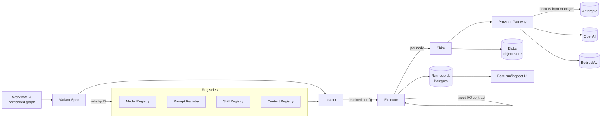

# PRD — P2: Configuration Layer + Runtime

| Field | Value |
|---|---|
| Phase / Milestone | P2 / M2 |
| Target window | ~Weeks 6–11 (overlaps P1's tail) |
| Lead role(s) | Backend |
| Supporting role(s) | System Designer, AI Engineer, DevOps, Frontend, Product Designer |
| Status | Draft |
| OpenSpec change | `p2-config-runtime` |

## 1. Summary

P2 makes discovered LLM nodes **configurable and executable without regenerating source**. A
Configuration Layer wraps each discovered call site in a **shim** that resolves its parameters —
model, prompt, skills, context strategy — from a config store at invocation time instead of from
hardcoded values. Four versioned, git-like **registries** (model / prompt / skill / context) hold
the reusable definitions; a **Variant Spec** references them by ID per node and pins a node
ordering. A **Runtime** (loader + provider gateway + executor) resolves every `*_ref`, renders
prompts, binds skills, instantiates the context policy, and walks the node graph through the shim,
with node I/O passing through the typed contract frozen in P0. This is the first point in the
program where a real workflow *runs* under our control, so idempotency and reproducibility —
keyed by `config_hash` + `seed` — are load-bearing exit criteria, not polish.

## 2. Problem & context

After P1 we have a static **Workflow IR**: nodes, edges, and per-node metadata (call site, current
model, prompt construction, tools, context assembly). But the IR is inert. To evaluate a workflow
we must be able to *change* a node (swap its model, its prompt, its tools) and *run* it — and we
cannot safely rewrite arbitrary third-party source to do so. Without P2:

- There is no way to override a node's model or prompt other than editing the target repo.
- There is nothing to execute; the eval harness (P4) and metrics substrate (P2.5) have no run to
  observe.
- Provider calls are made directly against a single SDK, so a provider swap means a code change.

**Upstream state assumed:** P0's frozen `workflow-ir.schema.json` (including the typed per-node
I/O contract field and `config_hash` scheme) and `metric-event.schema.json`; P1's Discovery
Engine emitting a valid static IR with call-site metadata and user-declared entrypoints. P2
consumes a *hardcoded* graph (a fixed IR + Variant Spec) as its input — building the graph from
arbitrary discovered repos at scale is out of scope here.

## 3. Goals & non-goals

### Goals
- G1. A **shim** wraps each discovered call site so its model/prompt/skill/context parameters
  resolve from the config store at runtime, never from hardcoded literals.
- G2. Four **registries** (model, prompt, skill, context) that are versioned (git-like,
  content-addressed), immutable per version, and referenced by ID.
- G3. A **Variant Spec** type: `{node_id → {model_ref, prompt_ref, skill_refs[], context_policy}}`
  plus a node ordering/graph, persisted in Postgres, hashed to a stable `config_hash`.
- G4. A **Loader** that resolves every `*_ref` against the registries at invocation time and fails
  closed on any dangling/ambiguous reference.
- G5. A **provider gateway** (LiteLLM-style) giving transparent provider swaps, secrets pulled
  from a manager, timeouts + bounded backoff on every provider call.
- G6. An **Executor** that walks the node graph through the shim, passing node I/O through the
  typed contract, halting on contract violations.
- G7. **Idempotency & reproducibility**: same `config_hash` + `seed` replays reproducibly; retries
  never double-charge a provider or double-write results.
- G8. A **bare run/inspect UI**: submit a Variant Spec, watch a run, see per-node I/O, with
  loading / error / empty states first-class.

### Non-goals (explicitly deferred)
- Context **policy implementations** beyond `full` — sliding-window / summarization / RAG /
  compaction are **P3**. P2 ships the config *field*, its selection, and the pluggable interface,
  with only the `full` policy implemented.
- **Sandboxed** execution of arbitrary repo tool code — **P3**. P2 runs skills that are trusted /
  built-in; the isolation boundary is P3's.
- The **metrics/OTel substrate** (spans, TSDB, cost/latency metrics) — **P2.5**. P2 emits the
  minimal run/node status records the UI needs, structured so P2.5 can attach.
- **Node re-arrangement UI** and adapter auto-insertion — **P5**. P2 *validates* against the typed
  contract and pins an ordering; it does not let users reorder.
- **Model tiering / cost-aware routing** logic — later phases. P2's gateway abstraction must not
  *preclude* tiering, but implements a direct provider→model mapping.
- **Discovery-to-Variant-Spec generation** at scale — the input graph is hardcoded/hand-authored.

## 4. Users & personas

- **Platform engineer (internal, primary)** — wires a discovered IR into a runnable Variant Spec,
  registers models/prompts/skills, and triggers runs to validate the pipeline end to end.
- **Downstream subsystems** — the Metrics substrate (P2.5) instruments the shim/gateway; the Eval
  Harness (P4) submits Variant Specs and consumes run results; the Improvement Engine (P5.5)
  emits Variant Specs as proposals. All three depend on the Variant Spec and `config_hash`
  contracts P2 freezes.
- **Workflow owner (end user, via the bare UI)** — submits a Variant Spec, watches a run, inspects
  per-node inputs/outputs to confirm an override behaves as intended.

## 5. User stories / jobs-to-be-done

**Platform engineer**
- As a platform engineer, I want to register a model/prompt/skill once and reference it by ID from
  many nodes, so that configurations are reusable and diffable.
- As a platform engineer, I want to override a single node's model or prompt without touching the
  target repo, so that I can compare variants safely.
- As a platform engineer, I want to swap a node's provider (e.g. Anthropic → OpenAI) by changing
  only its `model_ref`, so that the workflow code is unchanged.
- As a platform engineer, I want a re-run of the same `config_hash` + `seed` to reproduce the
  prior run, so that results are trustworthy and comparable.

**Downstream subsystem owner**
- As the eval harness, I want to submit a Variant Spec and receive a deterministic `run_id` and
  per-node I/O, so that I can score variants.
- As the metrics substrate, I want every provider call to flow through one gateway, so that I can
  instrument cost/latency/tokens in exactly one place (P2.5).

**Workflow owner (UI)**
- As a workflow owner, I want to submit a spec and watch the run progress node by node, so that I
  see where it is and where it failed.
- As a workflow owner, I want clear loading/empty/error states, so that a stuck or failed run is
  never indistinguishable from a slow one.

## 6. Functional requirements

These map 1:1 to the OpenSpec requirements in `openspec/changes/p2-config-runtime/specs/`.

**Configuration Layer (`config-layer`)**
- FR1. The shim SHALL resolve each of a node's four dimensions (model, prompt, skills, context)
  from the Variant Spec + registries at invocation time; if a node has no override, it resolves
  to the IR-captured default.
- FR2. A node override SHALL be expressible per-dimension independently (override only the model,
  leaving prompt/skills/context at default).
- FR3. A Variant Spec SHALL be `{node_id → {model_ref, prompt_ref, skill_refs[], context_policy}}`
  plus a node ordering/graph; it SHALL reference registry entries by immutable ID only.
- FR4. A Variant Spec SHALL hash to a stable `config_hash` that is invariant to key ordering and
  serialization whitespace, and that changes iff a referenced version or the ordering changes.
- FR5. The system SHALL reject a Variant Spec that references a non-existent node, a `*_ref` that
  does not resolve, or a `context_policy` name that is not registered.

**Registries (`registries`)**
- FR6. Each registry (model, prompt, skill, context) SHALL assign every entry an immutable,
  content-addressed version ID; a published version SHALL never be mutated in place.
- FR7. A prompt registry entry SHALL be a template with named variable slots and SHALL render
  deterministically given the same variable bindings.
- FR8. A skill registry entry SHALL carry a JSON-schema contract for its inputs and outputs; the
  runtime SHALL validate tool availability and argument shape against it before binding.
- FR9. A model registry entry SHALL capture provider + model ID + inference params (temperature,
  max_tokens, thinking budget, seed) as a versioned unit.
- FR10. Registries SHALL support additive, expand-contract evolution: adding fields or new
  versions SHALL NOT break resolution of Variant Specs that pin older versions.

**Runtime (`runtime`)**
- FR11. The Loader SHALL resolve every `*_ref` in a Variant Spec against the registries at
  invocation time and SHALL fail closed (abort the run, no partial execution) on any unresolved
  reference.
- FR12. Models SHALL be invoked through a unified provider gateway such that swapping a node's
  provider changes only its `model_ref` and no workflow code; the gateway SHALL normalize
  request/response shapes across providers.
- FR13. The gateway SHALL apply a per-call timeout and bounded exponential backoff with retry on
  transient failures, and SHALL source provider credentials from a secrets manager, never from
  the Variant Spec, code, or logs.
- FR14. The Executor SHALL walk the node graph in the spec's declared ordering, executing each
  node through the shim, and SHALL pass each node's output through the typed I/O contract before
  it becomes a downstream node's input.
- FR15. The Executor SHALL halt the run with a typed error when a node's I/O violates the typed
  contract, rather than passing malformed data downstream.
- FR16. A run of a given `config_hash` + `seed` SHALL be reproducible: identical resolved
  configuration and identical seed propagation to every provider call and stochastic step.
- FR17. Provider calls SHALL be idempotent under retry: a retried node invocation SHALL NOT
  double-charge the provider (idempotency key) and SHALL NOT double-write run results.
- FR18. Each run SHALL be identified by a `run_id` and SHALL persist per-node input/output records
  and a terminal status (succeeded / failed / halted-on-contract), queryable by the UI.

## 7. Non-functional requirements

- **Reproducibility.** Given identical `{config_hash, seed}` and provider determinism settings,
  two runs SHALL resolve to byte-identical configuration and identical seed propagation. This is a
  first-class, tested requirement (see FR16), not an aspiration.
- **Idempotency.** A node invocation carries an idempotency key derived from
  `{run_id, node_id, attempt-group}`; provider retries within a node reuse it so a duplicated
  request is de-duplicated and never billed twice (FR17).
- **Latency.** Loader ref-resolution for a spec of ≤ 200 nodes SHALL complete in < 100 ms
  (registry reads are indexed by version ID and cacheable, since versions are immutable). Per-node
  provider latency is dominated by the provider; the gateway adds < 10 ms overhead p50.
- **Reliability.** Every outbound provider call has a timeout (default 60 s, configurable per
  model entry) and bounded backoff (e.g. 3 retries, exponential with jitter). One slow provider
  cannot exhaust the executor.
- **Scale (P2 target).** Single-run execution of a hardcoded graph up to ~200 static nodes; runs
  are enqueued (run-queue seed) so fan-out lands cleanly in P4. No horizontal-scale guarantee is
  claimed at this phase beyond "runs execute serially per run, queue-dispatched."
- **Security.** Provider secrets never appear in the Variant Spec, DB rows, logs, error messages,
  or run records. Prompts and outputs that may contain PII are stored as content-hashed blobs in
  the object store, not inline in logs.
- **Durability / consistency.** Variant Specs and registry entries are strongly consistent in
  Postgres (unique on `config_hash`, FK from run records → variant/node); large prompt/artifact
  blobs are content-hashed in the object store and referenced by hash.

## 8. System design summary

**Data flow.**

**Storage (System Designer lens).**
- **Postgres** — `variant_spec` (unique `config_hash`), `model_entry` / `prompt_entry` /
  `skill_entry` / `context_entry` (each `(name, version_id)` immutable), `run` (`run_id`, FK →
  variant), `node_execution` (`run_id`, `node_id`, status, input_blob_hash, output_blob_hash,
  idempotency_key). FKs enforce that a run cannot reference an absent variant/node; a unique
  constraint on `(run_id, node_id, attempt_group)` enforces idempotent writes at the DB layer.
- **Object store** — prompt bodies, rendered prompts, node inputs/outputs stored under their
  content hash; DB holds only the hash. Immutability of content-addressed blobs is what makes
  `config_hash` replay meaningful.

**Key interfaces.**
- `Loader.Resolve(VariantSpec) → ResolvedConfig` (fails closed on dangling ref).
- `Gateway.Complete(ModelEntry, Request, Seed) → Response` (provider-agnostic; timeout + backoff;
  idempotency key).
- `Executor.Run(ResolvedConfig, Input, Seed) → Run` (graph walk; typed-contract checks between
  nodes).
- Registry write API: `Register<Kind>(entry) → version_id` (content-addressed, immutable).

## 9. Design by role lens

**Backend (lead) — explore → design → implement → test → harden → review.**
The four backend realities are exactly P2's hazards:
- *Contracts outlive code.* The Variant Spec and registry entry shapes are public contracts that
  P4/P5.5 build on. Design them additively; every registry version is immutable so older Variant
  Specs keep resolving (expand-contract migrations for schema evolution).
- *Shared persistent state.* Registries and specs are shared; a published version is never mutated
  — edits create a new version ID. This is what makes a variant reproducible months later.
- *Concurrency.* Two runs may resolve the same spec simultaneously; resolution is a pure read of
  immutable rows, so it is safe. Writes of run/node records are guarded by a unique constraint
  `(run_id, node_id, attempt_group)` turning a double-write race into a caught conflict.
- *Partial failure.* A provider 500 mid-graph must not leave a half-charged, half-written run.
  Provider calls are idempotent (idempotency key), retried with bounded backoff, and node results
  are written once; a run that cannot complete ends in a terminal `halted`/`failed` status, not a
  limbo. Timeouts on every outbound call.
- *Idempotency & reproducibility* are modeled into the schema (unique keys) and the gateway
  (idempotency key + seed propagation), not left to application discipline.

**System Designer (support).** Owns the **provider-gateway abstraction boundary** and the
**executor contract semantics**: the gateway's normalized request/response shape is the seam that
makes provider swaps transparent and (later) model tiering possible; the executor's rule that
every edge crosses the typed I/O contract is the invariant that keeps P5 re-arrangement safe.
Sizes the resolution path (immutable, indexed, cacheable → sub-100 ms) and picks Postgres +
object-store split by data shape.

**AI Engineer (support).** Ensures the **provider gateway supports model tiering later**: the
`ModelEntry` abstraction (provider + id + params + thinking budget) and the gateway's uniform
interface must not bake in a single provider's parameter model, so P6's cost/complexity-aware
routing can select a tier per node without re-plumbing. Confirms seed handling is faithful enough
for the statistical multi-seed runs P4 depends on.

**DevOps (support).** Stands up the gateway with **secrets from a manager, never in code/logs**;
seeds the **run queue** for fan-out. Enforces that provider keys are injected at call time and
scrubbed from traces; that timeouts/backoff are configured, not hoped for; and that the run
records are structured so P2.5's OTel instrumentation clips onto the shim/gateway with zero
application change.

**Frontend (support, minimal).** A **bare run/inspect view**: submit a Variant Spec → watch a run
→ see per-node I/O. Models **loading / error / empty** as first-class states (a queued run, a
failed node, and an empty result are visually distinct); avoids derived state that drifts from the
run's true persisted status by reading terminal status from the run record.

**Product Designer (support).** Owns the **configure-a-node journey**: the mental model that a
node has four independent override dimensions each pointing at a versioned registry entry, and
that "no override" is a legible default rather than a blank. Designs the unhappy path first — an
unresolved `*_ref` or a contract halt must tell the user *which* node and *which* dimension broke.

## 10. Dependencies

- **Requires (upstream):** P0 frozen `workflow-ir.schema.json` (typed I/O contract field,
  `config_hash` scheme), `metric-event.schema.json`; P1 Discovery emitting a valid static IR.
- **Consumes:** a hardcoded IR + hand-authored Variant Spec as the run input.
- **Unblocks:** P2.5 (instruments the shim/gateway), P3 (context policies + sandbox plug into the
  policy interface and the shim), P4 (eval harness submits Variant Specs), P5.5 (proposals are
  Variant Specs the runtime executes).

## 11. Risks & mitigations

| Risk | Owner | Mitigation |
|---|---|---|
| Retry double-charges a provider | Backend | Idempotency key per node invocation; gateway de-dupes; integration test asserts one charge under forced retry |
| Non-reproducible runs (seed not propagated) | Backend / AI | Seed threaded from Variant Spec → gateway → every stochastic step; test asserts identical resolution + seed for same `config_hash`+seed |
| Provider swap leaks provider-specific shape | System Designer | Gateway normalizes request/response; swap-transparency test runs same spec across two providers with only `model_ref` changed |
| Secrets leak into logs / run records | DevOps | Secrets from manager, injected at call time, scrubbed from traces; log-scrub test |
| Dangling `*_ref` executes a partial run | Backend | Loader fails closed before any node executes; test asserts no side effects on unresolved ref |
| Registry version mutated in place breaks old variants | Backend | Immutable, content-addressed versions; publish creates a new ID; mutation attempt rejected |
| Context interface too `full`-specific, blocks P3 | Backend / AI | Define policy as a pluggable interface now; `full` is one implementation behind it |
| Typed contract too rigid / too loose | System Designer | Executor validates against P0 contract; halt-on-violation test with a deliberately mismatched node |

## 12. Rollout & test strategy

- **Fixtures.** A hardcoded 3–5 node graph with a known-good Variant Spec and at least one
  variant that overrides a single node's model and one that overrides a single node's prompt.
- **Integration tests (real Postgres + real object store, stubbed providers).**
  - Reproducibility: run the same `{config_hash, seed}` twice → identical resolved config and
    identical seed reaching each stubbed provider call.
  - Idempotency: force a transient failure + retry on a node → exactly one provider charge, one
    `node_execution` row.
  - Provider swap: same spec, change only a node's `model_ref` from an Anthropic entry to an
    OpenAI entry → workflow executes, no workflow-code diff, normalized response.
  - Fail-closed: dangling `prompt_ref` → run aborts before node 1 executes; no run side effects.
  - Contract halt: node emits output violating the downstream typed contract → run halts with a
    typed error naming the node/dimension.
- **UI verification.** Actually submit a spec through the bare UI against a live (stubbed-provider)
  run and confirm loading → per-node I/O → terminal state renders, plus the error and empty states.
- **Rollout.** P2 is internal-only; ships behind the run-queue. No public surface. Migrations are
  expand-only (new tables), safe to deploy before the executor is enabled.

## 13. Success metrics & acceptance criteria (M2 exit checklist)

- [ ] A hardcoded graph runs **end to end** through the shim, producing per-node I/O and a
      terminal run status.
- [ ] A single node's **model** override and a single node's **prompt** override each take effect
      at runtime with no change to workflow code.
- [ ] A **provider swap** (Anthropic ↔ OpenAI) on one node is achieved by changing only its
      `model_ref`; the run succeeds and the response is normalized.
- [ ] Same **`config_hash` + `seed`** replays to identical resolved configuration and identical
      seed propagation (reproducibility test green).
- [ ] A forced provider **retry does not double-charge** and does not double-write
      (idempotency test green).
- [ ] Loader **fails closed** on any unresolved `*_ref`; no partial run.
- [ ] Executor **halts** on a typed-contract violation rather than passing malformed data.
- [ ] Registries are **versioned and immutable**; an older Variant Spec still resolves after a new
      version is published.
- [ ] Provider **secrets** never appear in specs, DB rows, logs, or run records.
- [ ] Bare **run/inspect UI** renders loading / error / empty / success states against a live run.

## 14. Open questions

- Q1. Idempotency-key scope: per node-attempt-group vs. per individual provider call within a
  node — how do multi-call nodes (agents/loops) reconcile a single logical charge unit? (P2 pins
  `(run_id, node_id, attempt_group)`; agent loops mature in P3/P5.)
- Q2. Determinism ceiling: providers do not guarantee bitwise-identical output even at
  temperature 0 / fixed seed. Do we assert reproducibility on *resolved config + seed propagation*
  (proposed) or attempt output-level reproduction where the provider supports it?
- Q3. Where does prompt rendering happen relative to the content hash — do we hash the template +
  bindings, or the rendered string, for `config_hash` stability? (Proposed: template version +
  binding values feed `config_hash`; rendered string is a derived, content-hashed blob.)
- Q4. Run-queue semantics for P2: at-least-once dispatch with idempotent execution (proposed) vs.
  exactly-once — confirm with DevOps ahead of P4 fan-out.
- Q5. Context-policy interface surface: how much of the P3 policy API (retrieval handles,
  summarizer model refs) must be present in the P2 interface to avoid a breaking change in P3?
