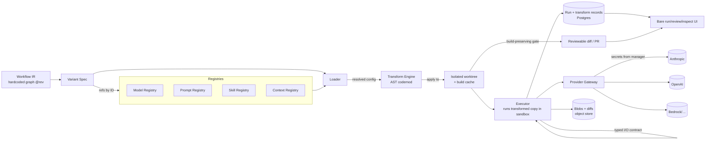

# PRD — P2: Configuration Layer + Runtime

| Field | Value |
|---|---|
| Phase / Milestone | P2 / M2 |
| Target window | ~Weeks 6–11 (overlaps P1's tail) |
| Lead role(s) | Backend |
| Supporting role(s) | System Designer, AI Engineer, DevOps, Frontend, Product Designer |
| Status | Draft |
| OpenSpec change | `p2-config-runtime` |

> Apply model per [ADR-001](../adr/ADR-001-source-transformation-apply-model.md): optimizations are
> applied by **transforming the user's source code** (deterministic AST codemods, delivered as
> reviewable diffs/PRs), not by a runtime shim.

## 1. Summary

P2 makes discovered LLM nodes **configurable and executable by transforming the user's source
code**. The Configuration Layer treats the **Variant Spec** as the canonical desired-state config
and realizes it by generating a **deterministic AST-level source transformation (codemod)** that
rewrites the discovered call sites — model, prompt, skills, context strategy — to the spec's values.
The transform is applied to an **isolated working copy** (git worktree/branch), built, and delivered
as a **reviewable diff/PR**; it never mutates the user's working tree in place. Four versioned,
git-like **registries** (model / prompt / skill / context) hold the reusable definitions; a Variant
Spec references them by ID per node and pins a node ordering. A **Runtime** (loader + transform
engine + provider gateway + executor) resolves every `*_ref`, generates and applies the codemod,
builds it, and **runs the transformed working copy in a sandbox**, with node I/O passing through the
typed contract frozen in P0. Because the code under measurement is the code that would ship,
measurements are faithful. This is the first point in the program where a real workflow *runs* under
our control, so idempotency and reproducibility — keyed by `config_hash` + `seed` — are load-bearing
exit criteria, not polish.

## 2. Problem & context

After P1 we have a static **Workflow IR**: nodes, edges, and per-node metadata (call site, current
model, prompt construction, tools, context assembly). But the IR is inert. To evaluate a workflow we
must be able to *change* a node (swap its model, its prompt, its tools) and *run* it. The original
plan wrapped each call site in a runtime shim; ADR-001 supersedes that because a shim is **infeasible
for compiled languages** (there is no monkey-patch seam in a Go binary, and Go is the P1 discovery
target) and **measures the wrong thing** (a shimmed run does not exercise the code that ships).
Without P2:

- There is no way to realize a node's model or prompt override; the IR is inert.
- There is nothing to execute; the eval harness (P4) and metrics substrate (P2.5) have no run to
  observe.
- Provider calls are made directly against a single SDK, so a provider swap means an unmanaged code
  change rather than a reviewable diff.

**Upstream state assumed:** P0's frozen `workflow-ir.schema.json` (including the typed per-node
I/O contract field, the `config_hash` scheme, and the per-node call-site anchors the codemod
targets) and `metric-event.schema.json`; P1's Discovery Engine emitting a valid static IR with
call-site metadata and user-declared entrypoints. P2 consumes a *hardcoded* graph (a fixed IR +
Variant Spec) at a pinned `source_revision` — building the graph from arbitrary discovered repos at
scale is out of scope here.

## 3. Goals & non-goals

### Goals
- G1. A **Transform Engine** that realizes a Variant Spec as a deterministic AST codemod rewriting
  each discovered call site's model/prompt/skill/context parameters to the spec's values — never a
  runtime config lookup.
- G2. Four **registries** (model, prompt, skill, context) that are versioned (git-like,
  content-addressed), immutable per version, and referenced by ID.
- G3. A **Variant Spec** type: `{node_id → {model_ref, prompt_ref, skill_refs[], context_policy}}`
  plus a node ordering/graph and a target `source_revision`, persisted in Postgres, hashed to a
  stable `config_hash`.
- G4. A **Loader** that resolves every `*_ref` against the registries and fails closed on any
  dangling/ambiguous reference before any transform is generated.
- G5. A **provider gateway** (LiteLLM-style, unaffected by ADR-001) giving transparent provider
  swaps, secrets pulled from a manager, timeouts + bounded backoff on every provider call.
- G6. **Isolated, build-preserving application**: apply the codemod to an isolated worktree, build
  it, reject any transform that fails to build, and deliver the change as a reviewable diff/PR.
- G7. An **Executor** that runs the built, transformed working copy in a sandbox, passing node I/O
  through the typed contract and halting on contract violations.
- G8. **Idempotency & reproducibility**: same `config_hash` + `seed` replays reproducibly (identical
  diff, deterministic build, identical seed propagation); retries never double-charge a provider or
  double-write results; rollback is a clean `git revert`.
- G9. A **bare run/review/inspect UI**: submit a Variant Spec, review the generated diff, watch the
  transformed copy run, see per-node I/O, with loading / error / empty states first-class.

### Non-goals (explicitly deferred)
- Context **policy implementations** beyond `full` — sliding-window / summarization / RAG /
  compaction are **P3**. P2 ships the config *field*, its selection, and the pluggable interface,
  with only the `full` policy implemented (its call-site assembly is what the transform rewrites).
- **Sandboxed** execution of arbitrary repo tool code — **P3**. P2 runs skills that are trusted /
  built-in; the tool-isolation boundary is P3's (the worktree/build sandbox for the *transformed
  code* lands here).
- The **metrics/OTel substrate** (spans, TSDB, cost/latency metrics) — **P2.5**. P2 emits the
  minimal run/node/transform status records the UI needs, structured so P2.5 can attach.
- **Node re-arrangement UI** — **P5**. P2 *validates* against the typed contract and pins an
  ordering; it does not let users reorder.
- **Model tiering / cost-aware routing** logic — later phases. P2's gateway abstraction must not
  *preclude* tiering, but implements a direct provider→model mapping.
- **Autonomous PR merge without human approval** — **P6**. Below the Autonomous level every applied
  change requires human approval after passing the gates.
- **Discovery-to-Variant-Spec generation** at scale — the input graph is hardcoded/hand-authored.

## 4. Users & personas

- **Platform engineer (internal, primary)** — wires a discovered IR into a runnable Variant Spec,
  registers models/prompts/skills, and triggers transforms/runs to validate the pipeline end to
  end, reviewing the generated diffs.
- **Downstream subsystems** — the Metrics substrate (P2.5) instruments the gateway + transform/
  build/run path; the Eval Harness (P4) submits Variant Specs and scores the transformed runs; the
  Improvement Engine (P5.5) emits Variant Specs as proposals surfaced as PRs. All three depend on
  the Variant Spec and `config_hash` contracts P2 freezes.
- **Workflow owner (end user, via the bare UI)** — submits a Variant Spec, reviews the generated
  diff, watches the transformed copy run, and inspects per-node inputs/outputs to confirm an
  override behaves as intended.

## 5. User stories / jobs-to-be-done

**Platform engineer**
- As a platform engineer, I want to register a model/prompt/skill once and reference it by ID from
  many nodes, so that configurations are reusable and diffable.
- As a platform engineer, I want to override a single node's model or prompt and get a minimal,
  reviewable diff against the target repo, so that I can see and trust exactly what changed.
- As a platform engineer, I want to swap a node's provider (e.g. Anthropic → OpenAI) by changing
  only its `model_ref`, so that the generated diff rewrites only that argument.
- As a platform engineer, I want a re-run of the same `config_hash` + `seed` to reproduce the prior
  diff, build, and run, so that results are trustworthy and comparable.

**Downstream subsystem owner**
- As the eval harness, I want to submit a Variant Spec and receive a deterministic `run_id`, the
  generated diff, and per-node I/O, so that I can score variants against the code that would ship.
- As the metrics substrate, I want every provider call to flow through one gateway, so that I can
  instrument cost/latency/tokens in exactly one place (P2.5).

**Workflow owner (UI)**
- As a workflow owner, I want to review the generated diff before anything runs, so that I approve
  the exact source change.
- As a workflow owner, I want clear loading/empty/error states — including a build-rejected
  transform — so that a stuck, failed, or unbuildable run is never indistinguishable from a slow one.

## 6. Functional requirements

These map 1:1 to the OpenSpec requirements in `openspec/changes/p2-config-runtime/specs/`.

**Configuration Layer (`config-layer`)**
- FR1. The system SHALL realize a Variant Spec by generating an AST-level source transformation that
  rewrites each of a node's four dimensions (model, prompt, skills, context) at its discovered call
  site to the spec's values; a dimension with no override SHALL leave that call-site construction
  unchanged.
- FR2. A node override SHALL be expressible per-dimension independently; overriding one dimension
  SHALL rewrite only that dimension at the call site (override only the model, leaving
  prompt/skills/context edits absent).
- FR3. A Variant Spec SHALL be `{node_id → {model_ref, prompt_ref, skill_refs[], context_policy}}`
  plus a node ordering/graph and a target `source_revision`; it SHALL reference registry entries by
  immutable ID only.
- FR4. A Variant Spec SHALL hash to a stable `config_hash` that is invariant to key ordering and
  serialization whitespace, and that changes iff a referenced version or the ordering changes.
- FR5. The system SHALL reject a Variant Spec that references a non-existent node, a `*_ref` that
  does not resolve, an unregistered `context_policy`, or a call site the transform cannot rewrite
  safely — before any transformation is generated.
- FR5a. The generated transformation SHALL be a **deterministic AST codemod**: same `config_hash` +
  same `source_revision` → byte-identical diff.
- FR5b. A transformation that **fails to build** the target SHALL be rejected before it is proposed
  or run.
- FR5c. The transformation SHALL be **behavior-preserving except for the intended change**: the diff
  edits only the configured dimension(s) at the targeted call site(s), with no incidental edits.
- FR5d. Transformations SHALL be applied only to an **isolated worktree/branch**, never the user's
  working tree in place.
- FR5e. Every applied change SHALL be **surfaced as a reviewable diff/PR** and SHALL NOT merge to the
  default branch without passing the build + eval + regression gates and (below Autonomous) human
  approval.

**Registries (`registries`)**
- FR6. Each registry (model, prompt, skill, context) SHALL assign every entry an immutable,
  content-addressed version ID; a published version SHALL never be mutated in place.
- FR7. A prompt registry entry SHALL be a template with named variable slots and SHALL render
  deterministically given the same variable bindings.
- FR8. A skill registry entry SHALL carry a JSON-schema contract for its inputs and outputs; the
  runtime SHALL validate tool availability and argument shape against it before the transform binds
  it at the call site.
- FR9. A model registry entry SHALL capture provider + model ID + inference params (temperature,
  max_tokens, thinking budget, seed) as a versioned unit.
- FR10. Registries SHALL support additive, expand-contract evolution: adding fields or new versions
  SHALL NOT break resolution of Variant Specs that pin older versions.

**Runtime (`runtime`)**
- FR11. The Loader SHALL resolve every `*_ref` in a Variant Spec against the registries and SHALL
  fail closed (abort, no transform generated, no run, no side effects) on any unresolved reference.
- FR12. Models invoked **by the platform** (the eval harness, the verifier, the optimizer — any model
  call the system makes on its own behalf) SHALL be invoked through a unified provider gateway, which
  SHALL normalize request/response shapes across providers. The **transformed program under
  measurement calls its own provider SDKs directly** and SHALL NOT be rewritten to route through the
  gateway: doing so would either ship our gateway into the customer's production call path or measure
  code that is not the code that ships. Swapping a node's model **within a provider** SHALL be a
  `model_ref` rewrite at the call site. Swapping a node's **provider** requires rewriting the SDK call
  itself and is out of P2 scope. *(Amended by [ADR-002](../adr/ADR-002-provider-gateway-serves-platform-callers.md);
  the original wording predates [ADR-001](../adr/ADR-001-source-transformation-apply-model.md).)*
- FR13. The gateway SHALL apply a per-call timeout and bounded exponential backoff with retry on
  transient failures, and SHALL source provider credentials from a secrets manager, never from the
  Variant Spec, generated diffs, code, or logs.
- FR14. The Runtime SHALL apply the transformation to an isolated worktree, build it, and run the
  **built, transformed working copy in a sandbox**, walking the node graph in the spec's declared
  ordering and passing each node's output through the typed I/O contract before it becomes a
  downstream input.
- FR15. The Executor SHALL halt the run with a typed error when a node's I/O violates the typed
  contract, rather than passing malformed data downstream.
- FR16. A run of a given `config_hash` + `seed` SHALL be reproducible: byte-identical generated
  diff, deterministic build (pinned toolchain), and identical seed propagation to every provider
  call and stochastic step.
- FR17. Provider calls SHALL be idempotent under retry: a retried node invocation SHALL NOT
  double-charge the provider (idempotency key) and SHALL NOT double-write run results.
- FR18. Each run SHALL be identified by a `run_id` and SHALL persist per-node input/output records, a
  reference to the generated diff, and a terminal status (succeeded / failed / halted-on-contract /
  build-rejected), queryable by the UI; every applied change SHALL be revertible by a single
  `git revert`.

## 7. Non-functional requirements

- **Reproducibility.** Given identical `{config_hash, source_revision, seed}` and a pinned
  toolchain, two runs SHALL generate a byte-identical diff, build the same artifact, and propagate
  the identical seed. This is a first-class, tested requirement (see FR16), not an aspiration.
- **Transform correctness.** The generated diff SHALL be deterministic (byte-identical per
  `{config_hash, source_revision}`), build-preserving (a non-building transform is rejected before
  it is proposed), and behavior-preserving except for the intended change (no incidental edits).
  These are tested gates, not review conventions (FR5a–c).
- **Idempotency.** A node invocation carries an idempotency key derived from
  `{run_id, node_id, attempt-group}`; provider retries within a node reuse it so a duplicated
  request is de-duplicated and never billed twice (FR17).
- **Latency.** Loader ref-resolution for a spec of ≤ 200 nodes SHALL complete in < 100 ms (registry
  reads are indexed by version ID and cacheable, since versions are immutable). Transform generation
  + apply + build is bounded per variant; a **`config_hash`-keyed build cache** makes a repeat
  variant a lookup rather than a rebuild. Per-node provider latency is dominated by the provider;
  the gateway adds < 10 ms overhead p50.
- **Reliability.** Every outbound provider call has a timeout (default 60 s, configurable per model
  entry) and bounded backoff (e.g. 3 retries, exponential with jitter). One slow provider cannot
  exhaust the executor. A transform that fails to build fails safely as `build-rejected` and never
  runs.
- **Scale (P2 target).** Single-run execution of a hardcoded graph up to ~200 static nodes over an
  isolated worktree; runs are enqueued (run-queue seed) and transforms/builds are pooled + cached so
  P4's fan-out over many variants of one base lands cleanly. No horizontal-scale guarantee is claimed
  at this phase beyond "runs execute serially per run, queue-dispatched."
- **Security.** Provider secrets never appear in the Variant Spec, generated diffs, DB rows, logs,
  error messages, or run records. Prompts and outputs that may contain PII are stored as
  content-hashed blobs, not inline in logs. The transform runs against a **read-only clone** of the
  target repo in an isolated worktree; the user's working tree is never mutated in place.
- **Durability / consistency.** Variant Specs and registry entries are strongly consistent in
  Postgres (unique on `config_hash`, FK from run records → variant/node); large prompt/artifact/IO
  blobs and generated diffs are content-hashed in the object store and referenced by hash; worktrees
  + build artifacts live in a pooled, evictable build cache keyed by `config_hash`.

## 8. System design summary

**Data flow.**

**Storage (System Designer lens).**
- **Postgres** — `variant_spec` (unique `config_hash`, `source_revision`), `model_entry` /
  `prompt_entry` / `skill_entry` / `context_entry` (each `(name, version_id)` immutable),
  `transform` (`config_hash` FK, `source_revision`, `diff_blob_hash`, `build_status`, `worktree_ref`,
  unique `(config_hash, source_revision)`), `run` (`run_id`, FK → variant), `node_execution`
  (`run_id`, `node_id`, status, input_blob_hash, output_blob_hash, idempotency_key). FKs enforce that
  a run cannot reference an absent variant/node; a unique constraint on `(run_id, node_id,
  attempt_group)` enforces idempotent writes at the DB layer; a unique `(config_hash,
  source_revision)` makes the generated diff a durable, deduplicated artifact.
- **Object store** — prompt bodies, rendered prompts, node inputs/outputs, and **generated
  diffs/patches** stored under their content hash; DB holds only the hash. Immutability of
  content-addressed blobs is what makes `config_hash` replay — and a byte-identical diff —
  meaningful.
- **Worktree pool + build cache** — isolated git worktrees checked out at `source_revision`; the
  codemod is applied and built there; build outputs cached keyed by `config_hash` so identical
  variants are generated and built once. Rollback = `git revert` on the variant branch.

**Key interfaces.**
- `Loader.Resolve(VariantSpec) → ResolvedConfig` (fails closed on dangling ref).
- `Transform.Generate(ResolvedConfig, SourceRevision) → Diff` (deterministic AST codemod;
  byte-identical per `{config_hash, source_revision}`).
- `Transform.Apply(Diff, WorktreeRef) → AppliedWorktree` (isolated worktree; never user's tree in
  place); `Transform.Build(AppliedWorktree) → BuildResult` (reject on build failure).
- `Gateway.Complete(ModelEntry, Request, Seed) → Response` (provider-agnostic; timeout + backoff;
  idempotency key — unaffected by ADR-001).
- `Executor.Run(AppliedWorktree, Input, Seed) → Run` (runs the built, transformed copy in a sandbox;
  typed-contract checks between nodes).
- Registry write API: `Register<Kind>(entry) → version_id` (content-addressed, immutable).
- `Rollback(config_hash) → git revert` (clean single-revert of the applied change).

## 9. Design by role lens

**Backend (lead) — explore → design → implement → test → harden → review.**
The four backend realities are exactly P2's hazards:
- *Contracts outlive code.* The Variant Spec and registry entry shapes are public contracts that
  P4/P5.5 build on. Design them additively; every registry version is immutable so older Variant
  Specs keep resolving *and* keep producing the same diff (expand-contract migrations for schema
  evolution).
- *Shared persistent state.* Registries and specs are shared; a published version is never mutated —
  edits create a new version ID. This is what makes a variant, and its generated diff, reproducible
  months later.
- *Concurrency.* Two runs may resolve and transform the same spec simultaneously; resolution is a
  pure read of immutable rows and transform generation is a pure function of `{config_hash,
  source_revision}`, so both are safe and cache-shareable. Writes of run/node records are guarded by
  a unique constraint `(run_id, node_id, attempt_group)` turning a double-write race into a caught
  conflict.
- *Partial failure.* A transform that fails to build ends as `build-rejected` and never runs; a
  provider 500 mid-graph must not leave a half-charged, half-written run. Provider calls are
  idempotent (idempotency key), retried with bounded backoff, and node results are written once; a
  run that cannot complete ends in a terminal `halted`/`failed`/`build-rejected` status, not a limbo.
  Timeouts on every outbound call. Rollback is a clean `git revert`.
- *Idempotency & reproducibility* are modeled into the schema (unique keys), the transform (a pure
  function → byte-identical diff), and the gateway (idempotency key + seed propagation), not left to
  application discipline.

**System Designer (support).** Owns the **transform/apply/build boundary** and the **executor
contract semantics**: the codemod is a deterministic AST rewrite anchored to P0 call-site metadata,
applied to an isolated worktree and gated on a green build before it is proposed or run; the
executor runs the *transformed* copy so measurement is faithful, and its rule that every edge crosses
the typed I/O contract is the invariant that keeps P5 re-arrangement safe. Sizes the resolution path
(immutable, indexed, cacheable → sub-100 ms) and the worktree pool + `config_hash`-keyed build cache
(fan-out reuses builds), and picks Postgres + object-store + build-cache split by data shape. The
**provider gateway** boundary (unaffected by ADR-001) remains the seam that makes provider swaps a
single-argument rewrite and (later) model tiering possible.

**AI Engineer (support).** Owns **evals-before-optimization and verification**: no transform is
surfaced until it passes the **build + eval + regression gate**, which is the primary mitigation for
the new top risk (transform correctness). Ensures the **provider gateway supports model tiering
later**: the `ModelEntry` abstraction (provider + id + params + thinking budget) and the gateway's
uniform interface must not bake in one provider's parameter model, so P6's cost/complexity-aware
routing can select a tier per node without re-plumbing. Confirms seed handling is faithful enough for
the statistical multi-seed runs P4 depends on, now measured on the real transformed code.

**DevOps (support).** Stands up the gateway with **secrets from a manager, never in code/logs/diffs**;
stands up the **worktree pool + build-cache** with least-privilege access to a **read-only clone** of
the target repo; seeds the **run queue** for fan-out. Enforces that provider keys are injected at
call time and scrubbed from traces and generated diffs; that timeouts/backoff are configured; that
the transform sandbox has minimal blast radius; and that the run/transform records are structured so
P2.5's OTel instrumentation clips onto the gateway and the transform/build/run path with zero
application change.

**Frontend (support, minimal).** A **bare run/review/inspect view**: submit a Variant Spec → review
the generated diff → watch the transformed copy run → see per-node I/O. Models **loading / error /
empty / build-rejected** as first-class states (a queued run, a failed node, an unbuildable
transform, and an empty result are visually distinct); avoids derived state that drifts from the
run's true persisted status by reading terminal status from the run/transform records.

**Product Designer (support).** Owns the **configure-a-node journey** and the **review-the-diff
mental model**: a node has four independent override dimensions each pointing at a versioned registry
entry; "no override" is a legible default; and the applied output is a **reviewable diff/PR** the
user approves — the model developers already trust from Dependabot/Renovate — not zero-touch magic.
Designs the unhappy path first — an unresolved `*_ref`, a build-rejected transform, or a contract
halt must tell the user *which* node and *which* dimension broke.

## 10. Dependencies

- **Requires (upstream):** P0 frozen `workflow-ir.schema.json` (typed I/O contract field,
  `config_hash` scheme, per-node call-site anchors the codemod targets), `metric-event.schema.json`;
  P1 Discovery emitting a valid static IR.
- **Consumes:** a hardcoded IR + hand-authored Variant Spec at a pinned `source_revision` as the run
  input.
- **Unblocks:** P2.5 (instruments the gateway + transform/build/run path), P3 (context policies +
  tool sandbox plug into the policy interface and the transform), P4 (eval harness submits Variant
  Specs and scores the transformed runs), P5.5 (proposals are Variant Specs the runtime transforms,
  builds, and runs, surfaced as PRs).

## 11. Risks & mitigations

| Risk | Owner | Mitigation |
|---|---|---|
| **Transform correctness — a bad codemod breaks the build or subtly changes behavior (new TOP risk)** | Backend / AI | AST-level deterministic transform; build-preserving rejection before any proposal; behavior-preserving minimal diff; **build + eval + regression gate** before a proposal is surfaced |
| Non-deterministic generated diff | Backend | Transform is a pure function of `{config_hash, source_revision}`; content-hash the patch; test asserts byte-identical diff across regenerations |
| Retry double-charges a provider | Backend | Idempotency key per node invocation; gateway de-dupes; integration test asserts one charge under forced retry |
| Non-reproducible runs (seed not propagated) | Backend / AI | Seed threaded from Variant Spec → gateway → every stochastic step; test asserts identical diff + build + seed for same `{config_hash, seed}` |
| Provider swap leaks provider-specific shape | System Designer | Gateway normalizes request/response; swap-transparency test runs same spec across two providers with only `model_ref` rewritten |
| Secrets leak into logs / diffs / run records | DevOps | Secrets from manager, injected at call time, scrubbed from traces and generated diffs; log-scrub test |
| Dangling `*_ref` triggers a partial run | Backend | Loader fails closed before any transform is generated; test asserts no diff/worktree/run side effects on unresolved ref |
| User working tree mutated in place | Backend / DevOps | Transform applies only to an isolated worktree over a read-only clone; test asserts the user tree is byte-for-byte unchanged |
| Worktree/build-cache cost under fan-out | System Designer / DevOps | Worktree pool + `config_hash`-keyed build cache so identical variants build once; evictable cache |
| Registry version mutated in place breaks old variants/diffs | Backend | Immutable, content-addressed versions; publish creates a new ID; mutation attempt rejected |
| Context interface too `full`-specific, blocks P3 | Backend / AI | Define policy as a pluggable interface now; `full` is one implementation behind it |
| Typed contract too rigid / too loose | System Designer | Executor validates against P0 contract on the transformed run; halt-on-violation test with a deliberately mismatched node |

## 12. Rollout & test strategy

- **Fixtures.** A hardcoded 3–5 node graph in a **buildable target repo pinned at a
  `source_revision`**, with a known-good Variant Spec and at least one variant that overrides a
  single node's model and one that overrides a single node's prompt.
- **Integration tests (real Postgres + object store + git worktrees, stubbed providers).**
  - Deterministic transform: generate the diff for the same `{config_hash, source_revision}` twice →
    byte-identical patch and content hash.
  - Build-preserving gate: a spec whose transform would break the build → rejected as
    `build-rejected` before any node executes; no diff surfaced.
  - Behavior-preserving minimal diff: model-only override → changed lines confined to the one call
    site, model argument only; a transform with incidental edits is rejected.
  - Isolated application: after a transform, the user's working tree at `source_revision` is
    byte-for-byte unchanged.
  - Reproducibility: run the same `{config_hash, source_revision, seed}` twice → identical diff,
    same build, and identical seed reaching each stubbed provider call.
  - Idempotency: force a transient failure + retry on a node → exactly one provider charge, one
    `node_execution` row.
  - Provider swap: same spec, rewrite only a node's `model_ref` from an Anthropic entry to an OpenAI
    entry → transformed workflow executes, diff edits only that argument, normalized response.
  - Fail-closed: dangling `prompt_ref` → aborts before any transform is generated; no side effects.
  - Contract halt: node emits output violating the downstream typed contract → run halts with a
    typed error naming the node/dimension.
  - Clean rollback: a single `git revert` of the variant commit restores `source_revision`
    byte-for-byte.
- **UI verification.** Actually submit a spec through the bare UI, **review the generated diff**, and
  run against a live (stubbed-provider) transformed copy; confirm submit → diff review → per-node
  I/O → terminal state renders, plus the error, empty, and build-rejected states.
- **Rollout.** P2 is internal-only; ships behind the run-queue. No public surface. Migrations are
  expand-only (new tables), safe to deploy before the executor is enabled. Transforms run against a
  read-only clone in isolated worktrees; nothing merges to a default branch without human approval.

## 13. Success metrics & acceptance criteria (M2 exit checklist)

- [ ] A hardcoded graph is **transformed, built, and run end to end** from the transformed working
      copy, producing per-node I/O and a terminal run status.
- [ ] A single node's **model** override and a single node's **prompt** override each produce a
      **minimal, targeted diff** and take effect when the transformed copy runs.
- [ ] The generated transform is **deterministic** — same `{config_hash, source_revision}` →
      byte-identical diff (test green).
- [ ] A transform that **breaks the build** is **rejected** as `build-rejected` before it is
      proposed or run (test green).
- [ ] The diff is **behavior-preserving except for the intended change** — no incidental edits;
      the user's working tree is never mutated in place (isolation test green).
- [ ] A **provider swap** (Anthropic ↔ OpenAI) on one node is achieved by rewriting only its
      `model_ref`; the transformed run succeeds and the response is normalized.
- [ ] Same **`config_hash` + `seed`** replays to identical diff, build, and seed propagation
      (reproducibility test green).
- [ ] A forced provider **retry does not double-charge** and does not double-write
      (idempotency test green).
- [ ] Loader **fails closed** on any unresolved `*_ref`; no transform generated, no partial run.
- [ ] Executor **halts** on a typed-contract violation rather than passing malformed data.
- [ ] Registries are **versioned and immutable**; an older Variant Spec still resolves and produces
      the same diff after a new version is published.
- [ ] Provider **secrets** never appear in specs, generated diffs, DB rows, logs, or run records.
- [ ] Every applied change is a **reviewable diff/PR** and reverts cleanly with a single
      `git revert`.
- [ ] Bare **run/review/inspect UI** renders loading / error / empty / build-rejected / success
      states against a live run.

## 14. Open questions

- Q1. Idempotency-key scope: per node-attempt-group vs. per individual provider call within a node —
  how do multi-call nodes (agents/loops) reconcile a single logical charge unit? (P2 pins
  `(run_id, node_id, attempt_group)`; agent loops mature in P3/P5.)
- Q2. Determinism ceiling: providers do not guarantee bitwise-identical output even at temperature 0
  / fixed seed. We assert reproducibility on *diff + build + seed propagation* (proposed) rather than
  provider output bytes — confirm this is sufficient for P4 scoring.
- Q3. Where does prompt rendering happen relative to the content hash — do we hash the template +
  bindings, or the rendered string, for `config_hash` stability? (Proposed: template version +
  binding values feed `config_hash`; rendered string is a derived, content-hashed blob. The codemod
  rewrites the prompt *construction*, not a pre-rendered string.)
- Q4. Run-queue semantics for P2: at-least-once dispatch with idempotent execution (proposed) vs.
  exactly-once — confirm with DevOps ahead of P4 fan-out.
- Q5. Context-policy interface surface: how much of the P3 policy API (retrieval handles, summarizer
  model refs) must be present in the P2 interface — and its call-site assembly the transform
  rewrites — to avoid a breaking change in P3?
- Q6. Build-cache eviction + worktree-pool sizing under P4 fan-out: what eviction policy and pool
  size keep transform+build cost bounded when scoring hundreds of variants of one base?
