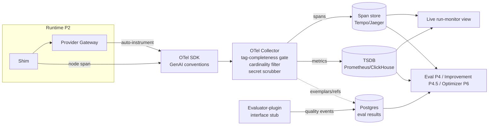

# PRD — P2.5: Metrics & Observability substrate

| Field | Value |
|---|---|
| Phase / Milestone | P2.5 / M3 |
| Target window | ~Weeks 9–13 (lands right after the first Runtime) |
| Lead role(s) | DevOps |
| Supporting role(s) | System Designer, AI Engineer, Frontend |
| Status | Draft |
| OpenSpec change | `p2.5-metrics-observability` |

## 1. Summary

P2.5 stands up the **shared telemetry substrate** that every measurement-driven subsystem —
the eval harness (P4), the attribution/diagnosis engine (P4.5), and the autonomous optimizer's
budget gates (P6) — will consume. It lands *right after* the first Runtime, not late, because
"if it isn't observable, it isn't done." Collection is **auto-instrumented at the shim/gateway
layer** so operational metrics require zero user code: every provider call that flows through
P2's gateway is measured for latency, cost, tokens, and reliability, and every node execution
emits an OpenTelemetry span. Each emitted metric is a **typed event carrying the full P0 seven-tag
set** `{variant_id, run_id, node_id, case_id, seed, timestamp, config_hash}`, routed by shape to
the three stores frozen in P0 — spans to an OTel span store, metrics to a TSDB, eval results to
Postgres — all keyed by `config_hash`. This phase also ships the **evaluator-plugin interface
stub** (built-in + user-defined) so P4's quality metrics slot in without re-plumbing. The exit bar
is concrete: a real run produces drillable spans and queryable operational metrics, every one of
them fully tagged and keyed by `config_hash`.

## 2. Problem & context

After P2 a hardcoded workflow *runs* through the shim and provider gateway, but the run is opaque.
The Runtime persists bare per-node status records for its inspect UI; it does not measure what a
run *cost*, how long each node took, how many tokens it burned, or how often a provider failed —
and nothing downstream can. Without P2.5:

- **The eval harness (P4) has no operational metrics to compare.** "Did variant B beat A" needs
  cost, latency, and token numbers per configuration; P4 would otherwise re-invent collection.
- **The improvement engine (P4.5) cannot attribute.** Per-node contribution to end-to-end
  cost/latency is decomposed from spans; with no spans there is nothing to decompose.
- **The autonomous loop (P6) has no budget gates.** "Halt if cost/run exceeds ceiling" requires a
  live, queryable cost metric keyed by `config_hash`.
- **Operational metrics would require user effort.** If collection is not auto-instrumented at the
  gateway, every workflow author would have to hand-annotate call sites — exactly the failure the
  shim design exists to prevent.

The source plan names the dominant failure mode plainly: *emitting under-tagged metrics you can't
later slice.* A latency number written without a `config_hash` can never be attributed to a
configuration; one written without a `seed` can never feed a confidence interval. P0 froze the
tag *schema* and the storage *decision*; P2.5 is where those contracts become **running
infrastructure** — and where under-tagging, if it happens, actually happens. Getting tagging right
at emission time is therefore the highest-leverage engineering decision in this phase.

**Upstream state assumed:** P0's frozen `metric-event.schema.json` (seven-tag contract, typed
payload, OTel GenAI-conventions alignment, cardinality budget), the `config_hash`/lineage scheme,
and the storage decision record (three stores by shape). P2's shim + provider gateway as the
single instrumentation seam, structured so OTel clips on with zero application change; the run
queue; and the run/`node_execution` records to which eval results foreign-key.

## 3. Goals & non-goals

### Goals
- **G1** — **Auto-instrument at the shim/gateway layer.** Every provider call and every node
  execution emits telemetry with **zero user code**; a workflow author adds nothing to get the
  full operational metric set.
- **G2** — **Emit the operational metric taxonomy:** latency (total, TTFT, tokens-per-sec), cost
  (input/output/cache tokens × price), tokens (prompt/completion/thinking/cache-hit,
  context-window utilization), reliability (error/timeout/retry/rate-limit), throughput/
  concurrency — per node and end-to-end.
- **G3** — **Every metric is a typed event carrying the full seven-tag set** from P0, populated at
  emission from the run context, with no untagged event permitted to reach any store.
- **G4** — **Route by shape to three stores:** OTel spans → span store (Tempo/Jaeger); metrics →
  TSDB (Prometheus/ClickHouse); eval results → Postgres — every record keyed by `config_hash`.
- **G5** — **Emit drillable OTel spans per run:** one run span, one span per node execution, tool
  calls as child spans, following the P0 OTel GenAI conventions doc.
- **G6** — **Ship the evaluator-plugin interface stub** (built-in + user-defined) so P4's quality
  evaluators register and run against traces through a stable contract without re-plumbing.
- **G7** — **Enforce cardinality/label discipline:** only low-to-moderate cardinality tags become
  TSDB series labels; high-cardinality identifiers (`case_id`, `run_id`, `invocation_id`, blob
  hashes) live as span attributes / Postgres columns / exemplars.
- **G8** — **Never place secrets, prompts, or PII in traces or metric labels;** telemetry
  references content-hashed blobs, it does not embed them.
- **G9** — **A minimal live run-monitoring view** so an in-flight run's per-node latency/cost/token
  metrics are visible as they stream, with loading / error / empty states first-class.

### Non-goals (deferred, with owning phase)
- **Quality / eval metrics** (exact-match, schema-valid, rubric, LLM-as-judge, faithfulness,
  retrieval relevance@k) — **P4.** P2.5 ships the *evaluator-plugin interface stub and the
  eval-results store*; it does not implement built-in evaluators beyond a trivial reference stub.
- **Custom-metric registration for real user scoring functions** — **P4.** The *interface* is
  stubbed here so P4 slots in; the registration/execution service is P4's.
- **Statistical layer** (multi-seed means, confidence intervals, significance tests) — **P4.**
  P2.5 guarantees `seed` is a tag on every event so the layer is *possible*; it does not compute CIs.
- **Trend tracking, regression detection, leaderboards, budget/alert gates** — **P4.5+.** P2.5
  makes metrics *queryable and keyed by `config_hash`*; the trend/regression/gate logic is later.
- **Pattern-driven metric-set selection** (a RAG node gets retrieval metrics) — **P3.5/P4.** P2.5
  collects the *operational* set uniformly; pattern-scoped quality metric-sets come with the
  classifier and harness.
- **Agent/workflow-specific and safety/governance metrics** (loop/iteration count, refusal rate,
  PII-in-output) — **P4/P5.** Operational metrics only in P2.5.
- **Dashboards, Pareto/cost-latency views, trend visualizations** — **P4.5+.** P2.5 ships only the
  minimal live run-monitoring view.

## 4. Users & personas

P2.5's consumers are overwhelmingly **downstream subsystems** plus the **platform/DevOps engineers**
who operate the substrate. A workflow owner touches it only through the live run-monitoring view.

| Persona | Relationship to P2.5 |
|---|---|
| **Eval Harness (P4)** | *Reads* operational metrics per `config_hash` for variant comparison; *registers* quality evaluators through the plugin interface stub; writes results to the eval-results store. |
| **Improvement Engine (P4.5)** | *Reads* spans to decompose per-node contribution to cost/latency; slices metrics by `node_id` and `case_id`. |
| **Autonomous optimizer (P6)** | *Reads* live cost/latency/error metrics keyed by `config_hash` to enforce budget gates and halt the loop. |
| **Platform / DevOps engineer** | Operates the collector, span store, TSDB; owns retention/sampling; verifies zero-user-code collection and zero secret leakage. |
| **Runtime (P2)** | *Produces* the telemetry — the shim/gateway is the instrumentation seam; it emits without knowing who consumes. |
| **Workflow owner (via live monitor)** | Watches a run's per-node latency/cost/tokens stream in; sees a failed/slow node distinctly from a healthy one. |

## 5. User stories / jobs-to-be-done

**Downstream subsystem (Eval / Improvement / Optimizer)**
- As the eval harness, I want every provider call's cost/latency/tokens collected automatically and
  keyed by `config_hash`, so that I can compare two variants without instrumenting anything myself.
- As the eval harness, I want to register a quality evaluator against a stable interface, so that my
  P4 scorers plug into the substrate without changing how metrics are stored or tagged.
- As the improvement engine, I want a per-run trace of spans (run → node → tool call), so that I can
  attribute end-to-end cost and latency down to the individual node.
- As the autonomous optimizer, I want a live cost metric keyed by `config_hash`, so that I can halt
  a run the moment it breaches a budget ceiling.

**Platform / DevOps engineer**
- As a platform engineer, I want operational metrics collected at the gateway with zero user code,
  so that no workflow author can accidentally ship an un-instrumented node.
- As a platform engineer, I want every event to fail emission if it is missing any of the seven
  tags, so that under-tagged metrics never reach a store where they can't be sliced.
- As a platform engineer, I want `case_id` and `run_id` to never become TSDB series labels, so that
  a 200-case run does not multiply active series 200× and blow the cardinality budget.
- As a platform engineer, I want provider secrets and prompt text to never appear in a span or a
  metric label, so that telemetry is safe to retain and query.

**Workflow owner (via live run-monitoring view)**
- As a workflow owner, I want to watch a running variant's per-node latency and cost stream in, so
  that I can see where a run is slow or expensive while it is still running.
- As a workflow owner, I want a failed or timed-out node to look different from a slow-but-healthy
  one, so that a stuck run is never indistinguishable from a working one.

## 6. Functional requirements

These map 1:1 to the OpenSpec requirements in
`openspec/changes/p2.5-metrics-observability/specs/metrics-observability/spec.md`.

**Auto-instrumentation & collection (`metrics-observability`)**
- **FR1** — Collection SHALL be auto-instrumented at the shim/gateway layer: every provider call
  and every node execution SHALL emit its operational metrics and spans **without any user code or
  per-node annotation**. No operational metric SHALL require a workflow author to instrument a call
  site.
- **FR2** — For every provider call the substrate SHALL collect **latency** metrics: total latency,
  time-to-first-token (TTFT), and tokens-per-second.
- **FR3** — For every provider call the substrate SHALL collect **cost** metrics derived from
  input, output, and cache token counts × the model's price, attributable per node, per run, and
  cumulative.
- **FR4** — For every provider call the substrate SHALL collect **token** metrics: prompt,
  completion, thinking, and cache-hit tokens, plus context-window utilization.
- **FR5** — For every provider call the substrate SHALL collect **reliability** metrics: error
  rate, timeout rate, retry count, and rate-limit hits.
- **FR6** — The substrate SHALL collect **throughput/concurrency** metrics for the run (in-flight
  provider calls and completed-calls-per-second).

**Structured tagged events (`metrics-observability`)**
- **FR7** — Every collected metric SHALL be emitted as a typed event carrying the full seven-tag
  set `{variant_id, run_id, node_id, case_id, seed, timestamp, config_hash}` populated from the run
  context at emission time, plus the P0 typed payload (`metric_name`, `value`, `unit`).
- **FR8** — An event missing any of the seven tags SHALL be rejected at the emission boundary and
  SHALL NOT be written to any store; enforcement SHALL be layered with P0's `NOT NULL` columns in
  the relational store.
- **FR9** — Every metric event and every span SHALL carry `config_hash` so that all telemetry is
  attributable to an exact configuration and reproducible from lineage.

**Spans & OTel (`metrics-observability`)**
- **FR10** — Each run SHALL emit an OpenTelemetry trace: one run span, one span per node execution,
  and tool calls as child spans, drillable per-run in the span store, following the P0 OTel GenAI
  semantic-conventions doc.
- **FR11** — Spans and metrics SHALL be emitted through a single OpenTelemetry instrumentation
  standard (GenAI semantic conventions), not a bespoke logging layer; the seven tags SHALL be
  carried as OTel attributes.

**Three-store routing (`metrics-observability`)**
- **FR12** — The substrate SHALL route telemetry to three stores by shape: spans → an
  OTel-compatible span store (Tempo/Jaeger); metrics → a TSDB (Prometheus/ClickHouse); eval results
  → Postgres — every record keyed by `config_hash`.
- **FR13** — Each of the three query shapes — metric trend/aggregation, per-run trace drill-down,
  and per-variant/per-node/per-case comparison — SHALL be served from the store built for it and
  SHALL be filterable by `config_hash`.

**Cardinality & label discipline (`metrics-observability`)**
- **FR14** — Only low-to-moderate cardinality tags (`variant_id`, `node_id`, `seed`, plus
  `metric_name`) SHALL be used as TSDB series labels; high-cardinality identifiers (`case_id`,
  `run_id`, `invocation_id`, content-hash references) SHALL NOT be TSDB series labels and SHALL
  instead be span attributes, Postgres columns, or exemplars.

**Secrets & PII (`metrics-observability`)**
- **FR15** — No provider secret, API key, prompt text, completion text, or PII SHALL appear in any
  span attribute, metric label, or log line; prompts/outputs SHALL be referenced by content-hashed
  blob reference only.

**Evaluator-plugin interface stub (`metrics-observability`)**
- **FR16** — The substrate SHALL define an **evaluator-plugin interface** — a stable contract for a
  scoring function that consumes a run's trace and emits quality-metric events under the same
  seven-tag contract — supporting both **built-in** and **user-defined** evaluators, so P4 slots in
  without re-plumbing collection, tagging, or storage.
- **FR17** — The interface stub SHALL be exercised by at least one trivial built-in reference
  evaluator whose output events carry the full seven-tag set and land in the eval-results store,
  proving the seam end to end; real quality evaluators are P4.

**Idempotency (`metrics-observability`)**
- **FR18** — Metric emission SHALL be idempotent under run retries: a retried node invocation
  (P2's `{run_id, node_id, attempt_group}`) SHALL NOT double-count cost or double-write a metric
  event or span for the same logical invocation.

**Live run-monitoring view (`metrics-observability`)**
- **FR19** — A minimal live run-monitoring view SHALL display a run's per-node latency, cost, and
  token metrics as they stream in, reading terminal/live status from the run record, with loading /
  error / empty states first-class and a failed/timed-out node visually distinct from a healthy one.

## 7. Non-functional requirements

First-class requirements with their own scenarios in the spec delta, not footnotes.

- **NFR1 — Zero-user-effort collection (the defining NFR).** 100% of operational metrics are
  collected at the shim/gateway with no user code. Target: a workflow author adds **zero** lines to
  obtain the full operational metric set; a node cannot be executed through the Runtime without
  being instrumented.
- **NFR2 — Tag completeness (highest-leverage NFR).** 100% of persisted events carry all seven
  non-null tags. Enforcement is the emission boundary *and* the DB, not documentation. Target: **0**
  untagged events reach any store.
- **NFR3 — Cardinality budget.** Active TSDB series stay within budget at target scale: ≈
  variant(20) × node(20) × metric_name(~15) × seed(5) ≈ **3×10⁴ series per optimization run**
  (P0 §8.2). `case_id` (200) and `run_id`/`invocation_id` (10⁶) are **never** TSDB series labels —
  as labels they would push cardinality to ~10⁸. This is the decision that keeps metrics in a TSDB.
- **NFR4 — Scale (design target).** The substrate SHALL absorb, per optimization run of 20 variants
  × 200 cases × 5 seeds × ~50 invocations/case: ~**10⁶** runtime invocations → ~**10⁷** metric
  events → ~**3×10⁶** spans (sampled/retention-bounded) → ~**2×10⁵** eval-result rows (P0 §8.2). At
  ~10 runs/day: ~10⁸ metric events/day (TSDB), ~3×10⁷ spans/day (sampled), ~2×10⁶ eval rows/day.
- **NFR5 — Collection overhead.** Instrumentation SHALL add < 5 ms p50 wall-clock overhead per
  provider call (emission is async / non-blocking off the request path) and SHALL never block or
  fail a run because a telemetry backend is unavailable — telemetry degrades, the run does not.
- **NFR6 — Security / least privilege.** Secrets from a manager, never in traces/labels/logs
  (NFR/FR15). The collector holds write-only credentials to the stores; components emit under
  least-privilege scopes. Prompts/outputs are content-hashed blob references, never inlined.
- **NFR7 — Reproducibility & attribution.** Every metric and span is keyed by `config_hash`, so any
  operational number is attributable to an exact, replayable configuration and rolls up across seeds
  under one `config_hash` (P0 NFR2).
- **NFR8 — Idempotency.** Metric writes and cost accounting are idempotent under P2's retry model
  (`{run_id, node_id, attempt_group}`), so a retried invocation is measured, not double-counted
  (FR18).
- **NFR9 — Cost sensitivity of the telemetry itself.** Metrics compress in the TSDB; spans are
  sampled and retention-bounded; blobs dedup by content hash. No store is chosen or retained "by
  reflex" — retention/sampling is a stated mechanism (tuned against real volume here, per P0 OQ6).
- **NFR10 — Evolvability.** New operational `metric_name`s and optional event dimensions are added
  additively (P0 NFR1) without breaking existing consumers or the tag contract; the evaluator-plugin
  interface is versioned so P4's evaluators bind to a stable major.

## 8. System design summary

**(DevOps lead with System Designer support — numbers before boxes, observable by default.)**

### 8.1 Where it sits



The **gateway is the one instrumentation seam** (the payoff of P2's single-gateway decision): OTel
attaches there, so every call is measured with zero application effort. The **collector** is where
the three cross-cutting disciplines are enforced *before* data hits a store — tag-completeness,
cardinality/label filtering, and secret/PII scrubbing — so an under-tagged, high-cardinality, or
secret-bearing event is caught at one chokepoint rather than in each backend.

### 8.2 Metric taxonomy collected (operational only, this phase)

| Group | Metrics | Granularity |
|---|---|---|
| **Latency** | total, TTFT, tokens/sec | per node, end-to-end |
| **Cost** | input/output/cache tokens × price | per node, per run, cumulative |
| **Tokens** | prompt, completion, thinking, cache-hit; context-window utilization | per node |
| **Reliability** | error rate, timeout rate, retry count, rate-limit hits | per node, per run |
| **Throughput** | in-flight concurrency, calls/sec | per run |

~15 operational `metric_name`s — the number that anchors the cardinality budget (NFR3). Quality,
agent-specific, and safety metrics are explicitly **out of scope** here (P4/P5).

### 8.3 Sizing — what picks the stores (from P0 §8.2)

| Data | Per-run raw | Store & why |
|---|---|---|
| Metrics | ~10⁷ events × ~2 B compressed ≈ **~20 MB** | **TSDB** — aggregation/trend over huge counts of tiny numeric points; low-cardinality labels only. |
| Spans | ~3×10⁶ × ~1–2 KB ≈ **3–6 GB** (sampled + retention-bounded) | **Span store** (Tempo/Jaeger) — per-run drill-down, trace-native. |
| Eval results | ~2×10⁵ × ~1 KB ≈ **~200 MB** | **Postgres** — low volume, rich joins across variant/node/case, `NOT NULL` tags + FKs. |
| Blobs | ~10⁶ × ~6 KB, content-hash dedup ~5–10× → **~0.6–1 GB** | **Object store**, content-addressed; telemetry references by hash, never inlines. |

**Cardinality check (the deep-dive bottleneck).** Active TSDB series ≈ variant(20) × node(20) ×
metric_name(~15) × seed(5) ≈ **3×10⁴/run** — comfortable. If `case_id`(200) or `run_id`/
`invocation_id`(10⁶) were labels, series would explode to ~10⁸ and the TSDB would fall over. They
are therefore span attributes / Postgres columns / TSDB exemplars, never labels. This single rule
(NFR3/FR14) is the highest-leverage output of §8, exactly as flagged in the ownership matrix
("metric cardinality is one of the two hardest parts").

### 8.4 Key interfaces

```
// Auto-instrumentation — no user surface; wraps the P2 gateway
Gateway.Complete(ModelEntry, Request, Seed) -> Response
  └── emits: node span + operational metric events (latency/cost/tokens/reliability), fully tagged

// Emission boundary — the tag-completeness + cardinality + scrub gate
Emit(MetricEvent{ tags: SevenTagSet, payload: {metric_name, value, unit} }) -> ok | reject
  // rejects if any tag null; strips high-card tags from TSDB labels; scrubs secrets/PII/prompt text

// Evaluator-plugin interface STUB (P4 implements against this)
type Evaluator interface {
  Name() string
  Evaluate(ctx RunContext, trace Trace) -> []QualityMetricEvent  // each carries the seven-tag set
}
Register(evaluator Evaluator)   // built-in + user-defined; same pattern as the Skill Registry
```

`RunContext` carries the seven tags so an evaluator physically cannot emit an under-tagged event.

### 8.5 Trade-offs stated explicitly

- **Collector chokepoint vs. per-emitter enforcement.** Cost: one more hop. Benefit: tag-
  completeness, cardinality filtering, and secret scrubbing enforced in exactly one place — a
  reviewable, testable gate — instead of trusting every call site. Chosen.
- **Async/non-blocking emission vs. synchronous.** Cost: a small window where a crash loses the
  last events. Benefit: telemetry never adds latency to or fails a paid provider call (NFR5).
  Chosen — a run must not fail because Tempo is down.
- **Interface *stub* now vs. full evaluator framework.** Cost: P2.5 ships a seam with one trivial
  evaluator, not real scorers. Benefit: P4 slots quality metrics in against a frozen contract with
  no change to tagging/storage — the substrate is "designed once" as the timeline demands. Chosen.
- **Operational metrics only vs. all four metric groups now.** Cost: quality/agent/safety metrics
  wait for P4/P5. Benefit: P2.5 ships the *substrate* (collection + tagging + routing) fast and
  correct, right behind the Runtime, rather than boiling the ocean. Chosen.

## 9. Design by role lens

### 9.1 DevOps (lead) — *if it isn't observable it isn't done; least privilege; secrets never in logs*

The prime directives map onto this phase directly, and the Frame → Plan → Execute → Verify → Close
loop governs the substrate build.

- **"If it isn't observable, it isn't done" is why P2.5 exists here.** The substrate lands right
  after the first Runtime, not late; a run that P2 can execute but cannot measure is half-built. The
  deliverable is the *signal that proves a run is healthy* — cost, latency, tokens, error rate — and
  the drill-down that explains it.
- **Auto-instrument at the gateway (Automate the second time / observability reference domain).**
  Collection is wired once at the shim/gateway seam so no workflow author ever hand-instruments a
  node — the toil of per-call annotation is designed out (NFR1/FR1). This is the observability-
  domain move: one instrumentation standard (OTel GenAI conventions), emitted against uniformly.
- **Secrets never touch traces, labels, or logs (directive 5).** The collector scrubs secrets,
  prompt text, completion text, and PII before anything reaches a store; telemetry carries only
  content-hashed blob references (FR15/NFR6). Provider keys stay in the manager; the collector holds
  write-only store credentials (least privilege, directive 4).
- **Blast radius / reversible / degrade safely (directives 1–2, NFR5).** Emission is async and
  non-blocking: a telemetry backend outage degrades telemetry, it never fails a paid run. Spans are
  sampled and retention-bounded so the observability system's own cost and blast radius are bounded.
- **Verify, don't assume (loop step 4).** The exit is proven by driving a real run and querying it
  back: drillable spans in the span store, operational metrics in the TSDB, both keyed by
  `config_hash` — plus a negative test that a missing-tag and a secret-bearing event are rejected.

### 9.2 System Designer (support) — *numbers before boxes; three stores by shape; the cardinality deep-dive*

- **Three stores by shape, keyed by `config_hash`.** Confirms the P0 storage decision as running
  infra: metrics→TSDB (aggregation over tiny numeric points), spans→span store (per-run drill-down),
  eval results→Postgres (relational comparison) — each query shape hits the store built for it
  (§8.3, FR12–FR13).
- **The cardinality bottleneck deep-dive (its named hardest part).** Owns FR14/NFR3: which tags are
  TSDB series labels vs. span/Postgres attributes. The arithmetic — 3×10⁴ series/run if disciplined,
  ~10⁸ if `case_id`/`run_id` leak into labels — is the single decision that keeps metrics in a TSDB
  at all, and it is enforced at the collector, not left to convention.
- **Sizing drives retention.** The §8.3 volumes (10⁷ metrics, 3×10⁶ spans, 2×10⁵ rows per run) size
  the sampling and retention policy (NFR9), so the substrate's own storage growth is a computed
  number, not a surprise.

### 9.3 AI Engineer (support) — *evaluator-plugin seam; observability of every LLM call*

- **Evaluator-plugin interface stub so P4 slots in (FR16–FR17).** Defines the contract — a scoring
  function that consumes a run's trace and emits quality-metric events under the *same* seven-tag
  contract, built-in + user-defined, mirroring the Skill Registry pattern. Ships with one trivial
  built-in evaluator to prove the seam end to end, so P4 adds real scorers against a frozen interface
  without re-plumbing tagging or storage. This is the "designed once" substrate the eval harness and
  improvement engine both consume.
- **Observability of every LLM call.** Confirms every provider call is traced and measured (no
  silent call sites), and that the tag set supports **every slice P4/P4.5 will need**: per-variant
  (`variant_id`/`config_hash`), per-node attribution (`node_id`), per-case and per-failure-cluster
  (`case_id`), and multi-seed confidence intervals (`seed`). A tag missing here is an un-answerable
  question later — so the sufficiency review happens now, against P4's concrete query needs.
- **Reproducibility for verification.** Because *diagnosis proposes, verification decides*, every
  operational number must be replayable — which `config_hash` keying (FR9/NFR7) guarantees.

### 9.4 Frontend (support, minimal) — *state as first-class; live run monitoring view states*

- **Live run-monitoring view (FR19).** A minimal view that streams a run's per-node latency, cost,
  and token metrics as they arrive. Models **loading / error / empty / streaming / terminal** as
  first-class states — a queued run, a failed node, an empty result, and a slow-but-healthy node are
  each visually distinct, so a stuck run is never indistinguishable from a working one.
- **No derived state that drifts.** Reads live/terminal status from the run record and metrics from
  the substrate rather than inferring status client-side; a failed/timed-out node is driven by the
  actual reliability metric, not a guess. Verifies against a live (stubbed-provider) run before the
  view is called done.

## 10. Dependencies

- **Requires (upstream):**
  - **P0** — `metric-event.schema.json` (seven-tag contract, typed payload, OTel GenAI alignment,
    cardinality budget), the `config_hash`/lineage scheme, the storage decision record (three stores
    by shape), and the OTel conventions doc + secrets baseline.
  - **P2** — the shim + provider gateway as the single instrumentation seam (structured so OTel
    clips on with zero application change), the run queue, and the run/`node_execution` records that
    eval results foreign-key to.
- **Unblocks:**
  - **P4 (Eval Harness)** — quality evaluators register through the plugin interface stub;
    operational metrics per `config_hash` drive variant comparison; results persist in the
    eval-results store.
  - **P4.5 (Attribution/Diagnosis)** — decomposes per-node cost/latency contribution from the spans.
  - **P6 (Autonomous optimizer)** — budget/alert gates read live cost/latency/error metrics keyed by
    `config_hash` to halt the loop.
  - **P4.5+ (Trend/regression/leaderboard/dashboards)** — consume the queryable, `config_hash`-keyed
    metric stream this phase makes real.

## 11. Risks & mitigations

| Risk | Owner | Mitigation |
|---|---|---|
| Under-tagged metrics slip through and can't later be sliced | DevOps / System Designer | Tag-completeness gate at the emission boundary rejects any event missing a tag (FR8); layered with P0 `NOT NULL` columns; negative test asserts a missing-`config_hash` event is refused. |
| Cardinality explosion — `case_id`/`run_id` used as TSDB labels blows series to ~10⁸ | System Designer / DevOps | FR14/NFR3 fix which tags are labels; the collector strips high-cardinality tags from TSDB labels; a test asserts a 200-case run does not multiply series. |
| Collection requires user code, so nodes ship un-instrumented | DevOps | Auto-instrument at the gateway (FR1/NFR1); a test proves a workflow with zero telemetry code still emits the full operational set; a node can't run through the Runtime un-instrumented. |
| Secrets / prompts / PII leak into spans or metric labels | DevOps | Collector scrubs before any store; telemetry carries content-hash refs only (FR15/NFR6); log-and-span scrub test on a run whose prompt contains a secret-shaped string. |
| Telemetry backend outage fails a paid run | DevOps | Async/non-blocking emission; telemetry degrades, run proceeds (NFR5); fault-injection test kills the collector mid-run and asserts the run still completes. |
| Retry double-counts cost or double-writes a metric | DevOps / Backend | Idempotent emission keyed by P2's `{run_id, node_id, attempt_group}` (FR18/NFR8); forced-retry test asserts one cost unit, one event. |
| Evaluator interface too narrow, forcing a P4 re-plumb | AI Engineer | Stub the interface against P4's concrete quality-metric needs now; exercise it with a built-in reference evaluator (FR16–FR17); version the interface (NFR10). |
| Span volume / cost unbounded | DevOps / System Designer | Sampling + retention bounds sized from §8.3 volumes (NFR9); retention mechanism stated, numbers tuned against real volume (P0 OQ6). |

## 12. Rollout & test strategy

**(DevOps lead — Frame → Plan → Execute → Verify → Close; observable, reversible, least-privilege.)**

- **Ship shape.** P2.5 is internal infra behind the run queue; no public surface. The span store,
  TSDB, and collector deploy as new components; the eval-results tables are expand-only additions to
  Postgres. Blast radius is the telemetry path — which, by NFR5, cannot take a run down.
- **Integration tests (real Postgres + object store + local span store/TSDB, stubbed providers):**
  - **Zero-user-code collection (FR1/NFR1):** run a fixture workflow containing *no* telemetry code;
    assert the full operational metric set (latency/cost/tokens/reliability/throughput) is emitted.
  - **Tag completeness (FR8/NFR2):** assert every emitted event carries all seven tags; a fault-
    injected event missing `config_hash` is rejected at the boundary and reaches no store.
  - **Cardinality discipline (FR14/NFR3):** run 200 cases; assert `case_id`/`run_id` are not TSDB
    series labels and series count stays ≈ 3×10⁴, while `case_id` is present as a span attribute /
    Postgres column.
  - **Three-store routing (FR12–FR13):** assert a trend query hits the TSDB, a drill-down hits the
    span store, a comparison hits Postgres — each filterable by `config_hash`.
  - **Drillable spans (FR10):** a run produces run→node→tool-call spans, navigable per-run.
  - **Secrets/PII scrubbing (FR15):** a run whose prompt embeds a secret-shaped string leaves no
    secret/prompt/PII in any span, label, or log — only a content-hash reference.
  - **Degrade-safe (NFR5):** kill the collector mid-run; the run completes; telemetry gaps, run does
    not fail.
  - **Idempotency (FR18):** force a node retry; assert one cost unit and one metric event/span per
    logical invocation.
  - **Evaluator seam (FR16–FR17):** register the built-in reference evaluator; its quality events
    carry the seven-tag set and land in the eval-results store.
- **UI verification (FR19).** Drive the live run-monitoring view against a live (stubbed-provider)
  run; confirm streaming per-node metrics plus loading / error / empty states and a visually
  distinct failed/timed-out node.
- **Reversibility.** New components and expand-only tables; rollback is scale-to-zero of the
  collector/stores and a table drop — no destructive migration on existing data.

## 13. Success metrics & acceptance criteria (M3 exit checklist)

- [ ] A real run produces **drillable spans** (run → node → tool call) in the span store and
      **queryable operational metrics** in the TSDB — the headline exit bar.
- [ ] Every metric and span is **tagged with all seven tags and keyed by `config_hash`**; a
      missing-tag event is **rejected** at the emission boundary (negative test green).
- [ ] The **full operational taxonomy** is collected: latency (total/TTFT/tokens-per-sec), cost
      (in/out/cache × price), tokens (prompt/completion/thinking/cache-hit, context-window
      utilization), reliability (error/timeout/retry/rate-limit), throughput/concurrency.
- [ ] Collection is **auto-instrumented at the gateway with zero user code**: a workflow with no
      telemetry code still emits the full operational set.
- [ ] **Cardinality discipline** holds: `case_id`/`run_id` are **not** TSDB series labels; series
      stay ≈ 3×10⁴/run; `case_id` remains a span attribute / Postgres column.
- [ ] **Three-store routing** works: trend→TSDB, drill-down→span store, comparison→Postgres, each
      filterable by `config_hash`.
- [ ] **No secret, prompt, completion, or PII** appears in any span, metric label, or log; telemetry
      references content-hashed blobs only.
- [ ] **Emission is degrade-safe and idempotent**: a collector outage does not fail a run; a retry
      does not double-count cost or double-write.
- [ ] The **evaluator-plugin interface stub** exists (built-in + user-defined) and is exercised by a
      built-in reference evaluator whose events carry the seven tags and land in the eval-results
      store — P4 can slot in without re-plumbing.
- [ ] The **live run-monitoring view** renders streaming per-node latency/cost/tokens with loading /
      error / empty states and a distinct failed/timed-out node against a live run.

## 14. Open questions

- **OQ1** — Concrete backends: Tempo vs. Jaeger for spans, Prometheus vs. ClickHouse for metrics.
  P0 fixed the *shape*; ClickHouse is attractive if exemplar/high-cardinality drill-down is wanted
  in one store. Decide here against the §8.3 volumes and the cardinality budget.
- **OQ2** — Span sampling policy: head vs. tail sampling, and the retention window per store
  (spans especially). Set the *mechanism* now; tune the numbers against real volume (P0 OQ6).
- **OQ3** — Cost pricing source: a versioned price table per model entry vs. provider-reported cost.
  Pricing changes over time — is the cost metric computed at run time (pinned to the price then) or
  recomputable later? Leaning: pin price into the model registry version so `config_hash` captures it.
- **OQ4** — Context-window utilization needs the model's context limit; does that live in the P2
  Model Registry entry, and how is cache-hit token accounting normalized across providers that
  report it differently?
- **OQ5** — Evaluator execution locus: do evaluators run inline in the collector, as a separate
  post-run job, or in the P3 sandbox (user-defined scoring code is untrusted, like skills)? The
  stub fixes the *interface*; the execution/isolation model is confirmed with P3/P4.
- **OQ6** — Exactly where the tag-completeness + cardinality + scrub gate lives: in the OTel
  Collector (processor pipeline) vs. an emission shim in the gateway. Leaning collector processor so
  the enforcement is one reviewable chokepoint independent of emitter.
