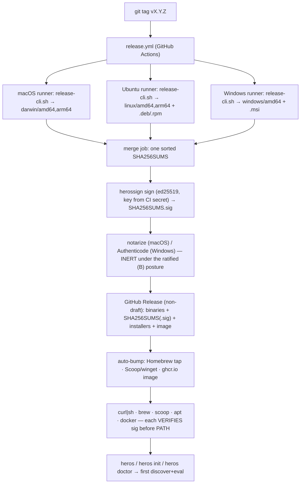

# PRD — P20: Installable Packages & Self-Serve Distribution (one command and you're using it)

| Field | Value |
|---|---|
| Phase / Milestone | P20 / M16 (cross-cutting; self-serve GA gate) |
| Target window | After P11 (the CLI + supply-chain floor exists) and P19 (the platform can be stood up); lands as a self-serve wave |
| Lead role(s) | DevOps Engineer + Product Designer (co-leads) |
| Supporting role(s) | Backend, Frontend, AI Engineer, QA Engineer, System Designer, Sales Operations |
| Status | Draft |
| OpenSpec change | `p20-installable-packages` |

> **Scope discipline.** P20 owns **how a person gets the `heros` CLI onto their own machine and reaches
> first success** — the release pipeline, the native install channels, the OS trust posture (Gatekeeper /
> SmartScreen), first-run onboarding, and safe self-update. It does **not** re-specify what the CLI *does*
> (P11 owns `discover` / `apply` / `eval` / `link`), and it does **not** deploy the platform to a server or
> cluster (P19 owns Docker/Kubernetes/air-gapped). P20 is the **individual-machine** delivery; P19 is the
> **fleet** delivery. It adds **no product feature** and **no statistic** — it turns "here is a binary" into
> "run one command and you're evaluating your first repo."

> **The one-sentence job.** *Deliver "anyone who receives it can run it", not "it runs on my machine"* — the
> DevOps first principle ([senior-devops-engineer-workflow](../../../aikeylabs-skills/senior-devops-engineer-workflow/SKILL.md)) —
> extended one step past the artifact to the **install**: the customer never sees `release-cli.sh`; they see
> `brew install`, `curl … | sh`, or a downloaded `.msi`, and they must reach a working `heros version` from it
> with **no account, no network beyond the download, and no README archaeology**.

## 1. Summary

The `heros` CLI is the platform's **free, offline, no-account** entry point: it runs discovery, the codemod,
and eval **in the user's own build environment with the user's own provider keys**, and linking a run to the
platform is explicit and opt-in (README §"Delivery surfaces", [P11](P11-cli-ci-integration.md)). P11 already
built the **supply-chain floor**: [`scripts/release-cli.sh`](../../scripts/release-cli.sh) builds one
self-contained binary per native runner, writes a sorted `SHA256SUMS`, and — when a key is present — signs it
with the ed25519 release key via [`cmd/herossign`](../../cmd/herossign/main.go); the verification steps are
documented and testable ([`docs/release/cli-verification.md`](../release/cli-verification.md),
`TestReproducibleBuild`). Targets are `darwin/amd64`, `darwin/arm64`, `linux/amd64`, `linux/arm64`,
`windows/amd64`.

What does **not** exist is everything between "a binary can be built" and "a stranger on macOS, Ubuntu, or
Windows installed it and ran their first eval." There is **no release workflow at all** — `.github/workflows/`
holds only `ci.yml` and `heros-eval.yml`, so nothing on a tag builds the matrix, merges the per-runner
artifacts into one `SHA256SUMS`, signs it, and publishes a **GitHub Release**; today a release could only be
assembled and uploaded **by hand**, which this project's DevOps rulebook forbids outright ("物理上禁止任何人手工
上传文件到 release"). There are **no native install channels** — no `install.sh` / `install.ps1` one-liner that
detects OS/arch, downloads the right asset, **verifies checksum and signature before placing it on `PATH`**,
and no Homebrew tap, Scoop bucket, winget manifest, `.deb`/`.rpm`, or published container image, so the only
"install" is *download a raw binary, read a doc, run `shasum -c` by hand, `chmod +x`, move it onto your
`PATH`* — which no developer will do and which silently drops the signature-verification step the CLI's threat
model depends on. There is **no OS trust posture** — an unsigned Mach-O from the internet is **quarantined by
Gatekeeper** and a downloaded `.exe` trips **SmartScreen**, so the honest first-run experience today is a
scary OS warning with no documented answer. There is **no first-run onboarding** — nothing greets a
freshly-installed `heros` and walks it to a first success. And there is **no self-update** — no `heros
upgrade`, no "a newer version is available" signal, and therefore no *safe* one (an unsafe one would
auto-download-and-execute or phone home on every command, breaking both the security posture and the offline/
no-account promise).

P20 delivers all of it as **pipeline + installers + posture, not a new runtime**: a **tag-triggered GitHub
Actions release pipeline** that builds every target on its **native runner** (the CLI links CGO tree-sitter
frontends, so cross-CGO is refused — §8, D1), merges into one signed `SHA256SUMS`, and publishes a GitHub
Release with **no human in the upload path**; a set of **native install channels** — a `curl … | sh` /
PowerShell one-liner, a Homebrew tap, a Scoop bucket + winget manifest, `.deb`/`.rpm` packages, and a
`ghcr.io` container image — **each of which verifies the signature before the binary is runnable**; an
**OS-trust posture** that either notarizes/Authenticode-signs the artifacts (the paid path) or documents the
exact quarantine-clear steps (the free path), with the decision escalated to the user rather than taken
silently (§9, DevOps); a **zero-config first-run onboarding** (`heros`, `heros init`, `heros doctor`) that
gets a new user to a first `discover`/`eval` without editing a config file; and a **safe self-update** — a
signature-verified `heros upgrade`, a passive opt-out-able "newer version" notice, **no auto-execution and no
per-command network call**. **M16 — installable** means a developer who has never seen this project can, from
a single command they could have found on the README or the GitHub Releases page, install `heros` on macOS,
Linux, or Windows, verify it is authentic, and reach a first eval — **without asking us, without an account,
and without trusting an unsigned download.**

## 2. Problem & context

P11 proved a `heros` binary can be **built and verified**; P20 owns everything required for a stranger to
**install and run** it. Five problems block "installable", and each maps to a design commitment, not a script
someone runs once.

- **🔴 There is no release pipeline, so a "release" can only be assembled by hand.** `.github/workflows/`
  contains `ci.yml` and `heros-eval.yml` and nothing else; there is no `release.yml`. `release-cli.sh` builds
  the **one native target of whatever machine runs it** (by design — CGO), and its own header says the matrix
  "runs it once per OS/arch runner and merges the artifacts into one SHA256SUMS" — but **that merging job does
  not exist**. So producing a real multi-OS release today means a human running the script on a Mac, on a
  Linux box, and on Windows, hand-collecting the binaries, hand-merging the checksum files, hand-signing, and
  hand-uploading to a GitHub Release. Every one of those steps violates the DevOps rulebook (rule 1: the only
  path is CI/CD; rule 2: **no human may manually upload to a release**; rule 3: no manual copy/fix — it must be
  a repeatable, retryable script). A release that depends on a person's laptop is not a release.
- **🔴 There is no install channel, so the only "install" silently drops the security step.** The CLI "runs
  **inside your CI with access to your repository**, so a compromised release is a compromise of every build
  it runs in" ([`cli-verification.md`](../release/cli-verification.md)). Verification (checksum + ed25519
  signature) is therefore load-bearing, not optional. But without an installer, the realistic path a developer
  takes is: download the binary from the Releases page, `chmod +x`, move it onto `PATH` — **skipping the
  signature step entirely**, because doing it by hand is friction and nobody does friction. An install channel
  that verifies *for* the user is the only way the threat model survives contact with real users. Today there
  is no `install.sh`, no `install.ps1`, no Homebrew formula, no Scoop manifest, no `.deb`/`.rpm`, and no
  published image.
- **🔴 The OS blocks an unsigned download, and there is no documented answer.** On macOS, a Mach-O
  downloaded from the internet carries `com.apple.quarantine`; without an Apple **Developer ID signature +
  notarization**, Gatekeeper refuses to run it and the message ("cannot be opened because the developer cannot
  be verified") reads as *malware*, not *unsigned*. On Windows, a downloaded `.exe` without an **Authenticode**
  signature (ideally EV) trips **SmartScreen**. This is not a nuisance to wave away — it is the **first thing a
  new user sees**, and with no posture (neither "we notarize" nor "here is the one command to clear the
  quarantine") the honest first-run experience is *the OS told me this might be malware and the docs said
  nothing*. There is today no notarization, no code-signing certificate, and no documented workaround.
- **The platform's own commands assume config that a fresh install does not have.** A newly-installed `heros`
  on a machine that has never seen the platform has no config, no provider key wired, and no idea what to run
  first. `heros` today is built for a user who already knows the subcommands; there is no zero-config greeting,
  no `heros init` that writes a starter config, and no `heros doctor` that says *your Python toolchain is
  present, your provider key is set, you are ready* — or, honestly, *it is not, here is the one thing to fix*.
  The interaction-simplicity-first rule (減免用户输入) applies most sharply at minute zero: the user who
  cannot get to a first success in five minutes never gets to a second.
- **There is no self-update, and the naïve one would break two invariants at once.** Users pin the CLI in CI
  (P11's contract-version window depends on it), so an update path must exist — but the obvious
  implementations are unsafe. An updater that **auto-downloads and executes** a new binary re-introduces
  exactly the supply-chain risk the signature step removes; an updater that **checks a remote version on every
  invocation** breaks the offline/no-account promise and leaks usage. P20 must ship an update path that is
  **signature-verified like a fresh install, never auto-executes, and never phones home on the hot path** —
  which is a design, not a `curl`.

Upstream state P20 assumes: P11's binary, `SHA256SUMS`, `herossign`, reproducible build, and the published
release public key ([`docs/release/heros-release.pub`](../release/heros-release.pub)); P19's platform deploy
(so the *linked* mode has something to link to). P20 changes **neither** — it wraps them in a distribution.

## 3. Goals & non-goals

### Goals

1. A **tag-triggered GitHub Actions release pipeline** that builds every supported target on its native
   runner, merges into **one signed `SHA256SUMS`**, and publishes a GitHub Release with **no human in the
   upload path** and full retryability.
2. **Native install channels** that verify the signature **before** the binary is on `PATH`: a `curl | sh`
   and PowerShell one-liner, a Homebrew tap, a Scoop bucket + winget manifest, `.deb`/`.rpm`, and a `ghcr.io`
   container image — all **auto-generated from the release**, never hand-edited.
3. An **OS-trust posture** for macOS (Gatekeeper) and Windows (SmartScreen) — either notarized/Authenticode-
   signed artifacts, or a **documented, one-command** quarantine-clear path — with the cost trade-off
   **escalated to the user**, not decided silently.
4. **Zero-config first-run onboarding**: `heros` with no args, `heros init`, and `heros doctor` get a new user
   from install to a first `discover`/`eval` with **no config-file editing**, and every failure names the next
   step.
5. A **safe self-update**: `heros upgrade` (signature-verified, same trust path as fresh install), a passive
   opt-out "newer version available" notice, and a clean uninstall — **no auto-execution, no per-command
   network call, no telemetry.**
6. A **fresh-machine smoke matrix**: every channel is proven by installing on a **clean** macOS/Ubuntu/Windows
   environment and reaching `heros version` + a first eval — not by a unit test that never touches the OS.

### Non-goals (explicitly deferred, with the owner)

- **What the CLI computes** — `discover` / `apply` / `eval` / `link` behavior and the contract-version window
  are **P11's**. P20 distributes them; it does not change them.
- **Platform/server deployment** — Docker Compose, Kubernetes/Kustomize, air-gapped cluster delivery, and the
  operator/customer consoles are **P19's**. The consoles are *server-deployed*, not end-user-installed; the
  README is explicit that this is **"not a desktop app."** P20 packages **only the CLI**.
- **A GUI installer wizard / desktop app** — out of scope by the product's own "not a desktop app" framing.
- **App-store distribution** (Mac App Store, Microsoft Store) — deferred; the CLI's threat model wants direct,
  reproducible, signature-verifiable delivery, not a store sandbox.
- **A hosted apt/yum repository** — the first cut attaches `.deb`/`.rpm` **to the GitHub Release** and installs
  them directly; a signed hosted repo is a later evolution (OQ).
- **`windows/arm64` and Linux musl/Alpine native binaries** — see §7 and §9 (Sales): these are **disclosed
  limits**, answered by the container image, not silently claimed.

## 4. Users & personas

| Persona | What they need from P20 |
|---|---|
| **Solo developer / evaluator** (macOS or Windows laptop) | One command, no account, no OS scare screen; a first eval in minutes. |
| **Platform / CI engineer** | A **pinned, checksummed, signature-verifiable** artifact to put in a build image; a stable version to pin; a clean upgrade story. |
| **Security reviewer** (of the *installing* org) | To verify **who** published the bytes and that they are **untampered**, **offline**, before allowing the tool into a CI that touches source. |
| **Linux distro / package-manager user** | `brew`, `scoop`/`winget`, `apt`/`dnf`, or `docker run` — the idiom of their platform, not a raw binary. |
| **The release engineer (us)** | A **push-a-tag** release with no laptop in the loop and no manual upload; a red button that is a `git tag`, not a checklist. |

## 5. User stories / jobs-to-be-done

**Solo developer**
- As a developer on macOS, I want to run one command and have `heros` installed and on my `PATH`, so that I
  can evaluate a repo without reading a packaging doc.
- As a developer, I want the installer to **verify the download is authentic for me**, so that I don't have to
  know what ed25519 is to be safe.
- As a developer whose OS just warned me, I want the docs (or the install output) to tell me **exactly** what
  to do, so that I don't conclude the tool is malware and give up.

**CI / platform engineer**
- As a CI engineer, I want to pin `heros@<version>` and fetch a **checksummed, signed** binary in my build
  image, so that a compromised release cannot silently enter my pipeline.
- As a CI engineer, I want `heros upgrade` (or the package manager) to move me to a new version **only when I
  ask**, verifying the signature the same way, so that updates are a decision, not a surprise.

**Security reviewer**
- As a security reviewer, I want to confirm the release was signed by the published key **without a network
  call or an account**, so that I can approve the tool under an air-gapped review.

**Release engineer**
- As the release engineer, I want tagging `vX.Y.Z` to build, sign, and publish the whole matrix with **no
  manual upload**, so that no release depends on my laptop and every release is reproducible and retryable.

## 6. Functional requirements

These map 1:1 to the OpenSpec requirements under `openspec/changes/p20-installable-packages/specs/`.

**Release pipeline** (`release-pipeline`)
- **FR1** — A tag matching the release pattern (`v*`) SHALL trigger a GitHub Actions pipeline that builds the
  CLI on the **native runner** for each supported target (macOS, Ubuntu, Windows runners), invoking
  `release-cli.sh`; cross-CGO builds SHALL NOT be used.
- **FR2** — The pipeline SHALL **merge** the per-runner binaries into a **single sorted `SHA256SUMS`** covering
  every target, and SHALL **sign** it with the ed25519 release key sourced from a CI secret, producing
  `SHA256SUMS.sig`.
- **FR3** — The pipeline SHALL publish a **GitHub Release** (non-draft) whose assets include every target
  binary, `SHA256SUMS`, `SHA256SUMS.sig`, and the packaged installers; **no artifact SHALL be uploaded by a
  human**, and the job SHALL be **idempotent/retryable** (a re-run of the same tag reproduces the same
  artifact set).
- **FR4** — The release version SHALL be stamped from the **tag** into the binary (`internal/cli.ToolVersion`
  via `-ldflags -X`) as the **single source of truth**; no package manifest, formula, or doc SHALL carry a
  hand-written version that can drift from it.
- **FR5** — The pipeline SHALL fail (block the release) if the built matrix is **incomplete** (a target
  missing), if the merged `SHA256SUMS` is **unsigned** on a non-dev channel, or if the **reproducible-build**
  assertion regresses.

**Install channels** (`install-channels`)
- **FR6** — A `curl … | sh` (macOS/Linux) and a PowerShell (`irm … | iex`, Windows) installer SHALL **detect
  OS and architecture**, download the **matching** asset from the GitHub Release, **verify its checksum against
  `SHA256SUMS` and the `SHA256SUMS.sig` signature against the pinned public key**, and only then place the
  binary on `PATH` — **failing closed** (no install) on any verification failure.
- **FR7** — A **Homebrew tap** formula, a **Scoop** manifest + **winget** manifest, and `.deb`/`.rpm` packages
  SHALL be **generated by the release pipeline** from the released assets and their checksums, and SHALL NOT be
  hand-maintained; installing through any of them yields the same verified binary.
> **Delivered as** `ghcr.io/damonleelcx/heros` (2026-07-30). The namespace below was aspirational: a pre-flight
> check before the first rehearsal tag found `heros-foreal` does not exist on GitHub, and a run's `GITHUB_TOKEN`
> cannot create a package outside its own repository's owner. `distribution.ImageRepo` is the single source, and
> both a unit test and a plan-time workflow assertion now hold it to the publishing owner.

- **FR8** — A **container image** (`ghcr.io/heros-foreal/heros:<version>` and `:latest` on GA) SHALL be
  published for CI/Alpine/musl use, digest-pinned, carrying the same CLI.
- **FR9** — Every channel SHALL install the **version the user asked for** (latest by default, a specific
  version when pinned) and SHALL be **uninstallable** by the same channel's idiom.

**Platform trust** (`platform-trust`)
- **FR10** — macOS artifacts SHALL be delivered under one of two **explicitly chosen** postures: (a)
  Developer-ID-signed **and notarized** (Gatekeeper-clean), or (b) unsigned with a **documented one-command**
  quarantine-clear step surfaced in both the docs and the installer output. The choice SHALL be recorded as a
  decision, not defaulted silently.
> **Chosen branch (2026-07-30): (b) for both OSes** — unsigned, with the documented clear surfaced by the
> installer and the README. FR10/FR11 are written as a choice on purpose; the requirement is that one branch is
> *explicitly decided and delivered*, not that a particular one is. See §14 OQ1 and `design.md` D3.

- **FR11** — Windows artifacts SHALL be delivered under the analogous choice: **Authenticode-signed** (ideally
  EV, SmartScreen-clean) or a documented "More info → Run anyway" path; the `.msi`/`.exe` SHALL declare
  publisher metadata either way.
- **FR12** — The trust posture SHALL be **stated honestly in the release notes and README** — the platform
  SHALL NOT claim "notarized"/"signed" for a channel that is not.

**First-run onboarding** (`first-run-onboarding`)
- **FR13** — `heros` invoked with **no arguments** on a fresh install SHALL print a **zero-config** greeting
  that names the first command to run and requires **no config-file editing** to reach a first `discover`.
- **FR14** — `heros init` SHALL write a **starter config** with safe defaults, and `heros doctor` SHALL check
  the local prerequisites (toolchain for the target language, provider key presence, write access) and, on any
  gap, **name the single next action** — never fail silently and never demand a prerequisite the command does
  not actually need.
- **FR15** — Local commands (`discover`, `apply`, `eval`, `version`, `doctor`, `init`) SHALL remain fully
  functional **offline with no account** (inheriting the P11 free-tier durability guarantee).

**Self-update** (`self-update`)
- **FR16** — `heros upgrade` SHALL fetch the latest release, **verify checksum + signature exactly as a fresh
  install**, and replace the binary in place; it SHALL **never** execute a downloaded artifact before
  verification and SHALL be a no-op (with a clear message) when already current.
- **FR17** — `heros` SHALL NOT make a network call to check for updates **on the hot path** of ordinary
  commands; a "newer version available" notice, if shown, SHALL be **opt-out-able** and SHALL NOT block or slow
  the command, and the CLI SHALL send **no telemetry**.
- **FR18** — When installed via a package manager (brew/scoop/apt), `heros upgrade` SHALL **defer to that
  manager** (print the manager's upgrade command) rather than overwriting a manager-owned file.

## 7. Non-functional requirements

- **NFR1 — Security (top of the 八级法则).** Signature verification is **mandatory and fail-closed** in every
  channel; a tampered artifact SHALL never reach `PATH`. The signing private key exists **only** as a CI
  secret; it SHALL never appear in the repo, a log, or an artifact.
- **NFR2 — Offline / no-account.** Every verification step (checksum + ed25519 signature against the
  in-repo public key) SHALL be runnable with **no network beyond the download and no account** — the P11
  guarantee, extended to the installer.
- **NFR3 — Reproducibility.** The per-platform reproducible-build property (P11 NFR8) SHALL be preserved; the
  pipeline builds with `-trimpath -buildvcs=false -ldflags "-s -w"` and the reproducibility test gates it.
- **NFR4 — Time-to-first-success.** A new user on a supported OS SHALL reach a working `heros version` in **one
  command** and a first `discover`/`eval` **without editing a config file**.
- **NFR5 — Supported target matrix (stated honestly).**
  | OS | arch | Native binary | Channel |
  |---|---|---|---|
  | macOS 12+ | amd64, arm64 | ✅ | curl\|sh, Homebrew |
  | Ubuntu/Debian (glibc 2.31+) | amd64, arm64 | ✅ | curl\|sh, `.deb`, Homebrew |
  | RHEL/Fedora (glibc) | amd64, arm64 | ✅ | `.rpm` |
  | Windows 10/11 | amd64 | ✅ | PowerShell, Scoop, winget |
  | Alpine / musl | any | ⛔ native (glibc CGO) | **container image** |
  | Windows | arm64 | ⛔ (not built) | — (disclosed limit) |
  The **⛔** rows are **disclosed limits** (§9 Sales), answered by the container image where possible — never
  silently claimed.
- **NFR6 — No manual step in the release.** The end-to-end release SHALL be **push a tag → published Release**;
  a human SHALL perform **zero** upload/copy/merge steps, and any failure SHALL be re-runnable without manual
  cleanup.
- **NFR7 — No new trust surface.** Verification SHALL use only what already ships (`herossign` / Go stdlib
  ed25519); no channel SHALL require the user to install a new verification tool. (Sigstore/cosign MAY be added
  as an *additional*, opt-in attestation — never as the floor.)

## 8. System design summary

P20 adds **one CI pipeline, one set of installer scripts/manifests, and five CLI subcommands' worth of
onboarding** — no new service and no new statistic. The artifact flow:

**Key interfaces.** The pipeline consumes P11's `release-cli.sh` unchanged and calls `herossign sign`. The
installers consume the **GitHub Releases API** (list assets for a tag) and the in-repo `heros-release.pub`.
`heros upgrade` reuses the *same* verification code path as the installers (a single verify routine, one
source of truth). Version is the tag, stamped once via `-X …cli.ToolVersion`.

**No data model.** P20 persists nothing; the only durable artifacts are the GitHub Release assets and the
package-manager manifests, both derived from the build.

Full arbitration of the one-way-door choices (native-runner matrix vs cross-CGO; ed25519 floor vs cosign;
notarize vs documented-clear; attach-to-release vs hosted repo; container image as the musl answer) is in
[`../../openspec/changes/p20-installable-packages/design.md`](../../openspec/changes/p20-installable-packages/design.md).

## 9. Design by role lens

Only the roles marked **L**/**S** for this phase appear. Each applies its own discipline.

**DevOps Engineer (co-lead) — *deliver "anyone who receives it can run it"; the only path is CI/CD.***
Owns `release.yml` and the install channels. The three pillars are non-negotiable here: **(1)** the release is
CI/CD-only — if the pipeline fails, the release fails; nobody hand-fixes a runner; **(2)** **no human uploads
to a Release** — the `GITHUB_TOKEN` job does, or it doesn't ship; **(3)** no manual copy/merge — the
per-runner-merge is a **repeatable, retryable** job, not a person collecting files. The release is organized
as the rulebook's 7-stage gate (prepare → build+package → archive → smoke → upgrade-sim → e2e → finalize),
compressed to what a single-binary CLI needs: **build the matrix, merge+sign, publish, then a fresh-machine
smoke on every channel** (§12) before the Release leaves draft. Secrets (the ed25519 private key, any signing
cert) live only as CI secrets in `${VAR:?}` refuse-to-start form and never touch a log or artifact.

**Product Designer (co-lead) — *interaction simplicity first; the technical方案 is part of the product.***
Owns the **install-to-first-success** journey. Applies 減免用户输入 at minute zero: the install is **one
command**, `heros init` needs **no answers to start**, and the user never edits YAML to reach a first
`discover`. Because this is a to-B私有化-adjacent tool where "what database / do I need Docker / does upgrade
stop the world" are product questions, the **install channel and the OS-trust story are product decisions, not
internal details** — the Gatekeeper/SmartScreen answer is written *for the user*, in the install output, not
buried. Owns the **unhappy path**: every `doctor` failure and every OS scare screen has a documented next step;
an install that can't verify **says so and stops** rather than limping on. The install docs are a **scenario
story** ("you're on a fresh Mac, you paste one line…"), not a flag reference.

**Backend Dev (S) — *fail loud, no silent fallback; single source of truth; health is externally readable.***
Owns the CLI-side surface: `heros upgrade`, `heros doctor`, `heros init`, and the single **verify routine**
shared by installer and updater. Applies the seven root-cause families: **no silent fallback** (a failed
signature check is a hard stop, never "install anyway"); **HTTP 200 ≠ success** (a 200 from the Releases API is
not proof the asset matches its checksum — assert the bytes); **single source of truth** (version is the tag,
stamped once; the formula/manifest versions **derive**, never a second hand-written copy that drifts). The
updater is **idempotent** (upgrade-to-current is a clean no-op) and never overwrites a package-manager-owned
file.

**AI Engineer (S) — *"looks fine" is the most dangerous state; verify end-to-end on the real path.***
The AI-adjacent risk here is the **first eval a new user runs**: onboarding must not hand them a mock or a
half-wired provider that returns a plausible-but-meaningless score. `heros doctor` verifies the provider key is
actually resolvable and the eval path is the **real** one before telling the user "you're ready"; the
quickstart's first `eval` runs the genuine end-to-end path (discover → apply → eval) so first success is
*real* success, not a green checkmark over a stub.

**System Designer (S) — *state trade-offs explicitly; contracts outlive code.***
Frames the **one-way doors**: the ed25519 release key and the public key already published are a **committed
trust root** — rotating them later is a real cost, so the key-management and rotation story is stated now (D3).
The supported-target matrix is a **contract** the moment it's on a README; adding `windows/arm64` later is
additive, but *claiming* it now and missing is a broken contract — hence the honest ⛔ rows.

**Frontend Dev (S) — *build-passing ≠ works; verify on the real surface.***
The "frontend" here is the **terminal UI** of install + first run: `heros`'s no-arg greeting, `doctor`'s
output, the installer's progress and error text. Applies "don't lose existing function in a redesign" to the
CLI help — the onboarding additions must not hide existing subcommands — and "a green build ≠ it works": the
install scripts are verified by **actually running them on a clean OS** (§12), not by shellcheck alone.

**QA Engineer (S) — *happy-path green ≠ invariant holds; I know what I did not test.***
Owns the **fresh-machine smoke matrix** and the **tamper red-check**. The canonical failure shape here would
be "the install script passed on the maintainer's Mac (which already had the tool, the toolchain, and a
cleared quarantine)" while a real new user's clean machine fails. So acceptance requires a **genuinely clean**
environment per OS (fresh VM/container image, no prior toolchain, quarantine intact) and asserts to a **first
eval**, not to `--help`. The signature check is proven by **flipping a byte** and asserting the installer
**refuses** — a verify step that has never been shown to fail is not a verify step.

**Sales Operations (S) — *every sentence is a contract; only claim ✅ 已交付.***
Owns the **honest capability map** for the install story. What ships as **✅**: one-command install on
macOS/Linux/Windows, offline signature verification, no account, free CLI. What is **⛔ disclosed limit**:
`windows/arm64`, native musl/Alpine (→ container image), and — until the trust decision (D3) lands — whether
artifacts are **notarized/Authenticode-signed** vs "documented quarantine-clear." Sales must **not** say
"notarized" or "in winget" before those are delivered; the README claims track the delivered channel, and the
free-vs-paid boundary (CLI free forever; linked/hosted surfaces are the paid upgrade) is stated plainly so a
customer's engineer can't catch a promise the product can't keep.

## 10. Dependencies

- **Upstream (must exist):** P11 — the `heros` binary, `release-cli.sh`, `herossign`, the reproducible build,
  the published `heros-release.pub`, and the contract-version window. P19 — the platform deploy (so *linked*
  mode has a target; P20's *local* mode needs nothing from it).
- **Unblocks:** self-serve GA (M16), a public Releases page a stranger can install from, distro/package-manager
  presence, a future hosted apt/yum repo, and any future auto-update channel — all of which consume the signed
  release this phase produces.

## 11. Risks & mitigations

| Risk | Owner | Mitigation |
|---|---|---|
| Release assembled by hand → non-reproducible, unauditable, and forbidden by rulebook | DevOps | CI-only `release.yml`; **no human upload**; retryable merge job (FR3, NFR6). |
| Users skip signature verification when installing by hand | Product + Backend | Installers verify **for** the user, fail-closed (FR6); by-hand path documented but not the default. |
| Gatekeeper/SmartScreen makes first-run read as malware | DevOps + Product | Explicit trust decision (D3): notarize/Authenticode **or** documented one-command clear, surfaced in install output (FR10–12). |
| Cross-CGO build produces a subtly broken tree-sitter binary | DevOps + Backend | **Native-runner matrix only** (D1); cross-CGO refused; reproducibility test gates. |
| Signing key leak compromises every install | System Designer + DevOps | Key only as CI secret (NFR1); rotation story stated (D3); public key in-repo for offline verify. |
| `heros upgrade` auto-executes or phones home → security/offline regression | Backend + Product | Verify-before-replace, no hot-path network, opt-out notice, no telemetry (FR16–17). |
| Package-manager manifest version drifts from the binary | Backend | Version = tag, single source; manifests **generated**, never hand-edited (FR4, FR7). |
| Smoke passes on maintainer's dirty machine, fails on clean user machine | QA | **Genuinely clean** VM/container per OS; assert to first eval; tamper red-check (§12). |
| Claiming a channel (winget/notarized) before it ships | Sales | Claim only ✅ 已交付; ⛔ limits disclosed (NFR5, §9 Sales). |

## 12. Rollout & test strategy

- **Pipeline dry-run first.** `release.yml` runs on a pre-release tag (`vX.Y.Z-rc.N`) to a **draft** Release;
  the matrix, merge, sign, and channel-generation are exercised end to end before any GA tag.
- **Fresh-machine smoke matrix (the gate).** For **each** channel × OS, install on a **clean** environment
  (fresh GitHub-hosted runner or a minimal container with no prior toolchain and quarantine intact), then
  assert: `heros version` prints the tag; `heros doctor` reports ready; a first `discover` + `eval` on a fixture
  repo produces a **real** result. A channel that has not passed this on a clean machine does **not** ship.
- **Tamper red-check.** A test **flips a byte** in a downloaded asset and asserts every installer and `heros
  upgrade` **refuse** (fail-closed). A verify step never shown to reject is treated as absent.
- **Reproducibility gate.** `TestReproducibleBuild` (P11) remains a required check; a change that breaks
  per-platform byte-reproducibility fails CI, not a customer's audit.
- **Upgrade simulation.** Install version *N*, then `heros upgrade` (or `brew upgrade`) to *N+1*; assert the
  binary is replaced, the signature verified, and a pinned-in-CI *N* is untouched until asked.
- **Rollback = re-install the prior version.** Every channel can install a **specific prior version** (FR9);
  there is no in-place downgrade magic — the documented rollback is "install `@<prev>`."

## 13. Success metrics & acceptance criteria

M16 — **installable** — closes when all hold:

- [ ] Pushing a release tag produces a **published (non-draft) GitHub Release** with every target binary,
  `SHA256SUMS`, `SHA256SUMS.sig`, the packaged installers, and the container image — **with no human upload
  step** and a re-run reproducing the same set.
- [ ] `curl … | sh` (macOS/Linux) and the PowerShell one-liner install a **verified** binary on a **clean**
  machine and reach `heros version` = the tag; a **tampered** asset makes both **refuse**.
- [ ] `brew install`, `scoop install`/`winget install`, and `.deb`/`.rpm` each install the same verified binary
  from **auto-generated** manifests; `docker run …/heros version` works for the musl/CI case.
- [ ] The macOS Gatekeeper and Windows SmartScreen posture is **decided, delivered, and documented**, and the
  first-run experience has a **stated answer** (either clean or one-command-clear).
- [ ] A new user reaches a **first real eval** with **no config-file editing**, **no account**, and **offline
  after download**; every `doctor` failure names the next step.
- [ ] `heros upgrade` verifies signature before replacing, no-ops when current, defers to the package manager
  when manager-installed, and makes **no hot-path network call and sends no telemetry**.
- [ ] The README/release notes claim **only** the channels and trust properties actually delivered; ⛔ limits
  (`windows/arm64`, native musl) are disclosed.

## 14. Open questions

- **OQ1 — Notarization / code-signing cost. → RESOLVED (B), 2026-07-30.** Apple Developer ID + notarization and
  a Windows (EV) Authenticode cert are recurring cost + an organizational identity. Escalated as the
  cost-escalation-path requires; answered **(A) sign + notarize on 2026-07-29** and **reversed by the same owner
  to (B) on 2026-07-30: no spend on signing.**
  **Delivered:** every artifact ships unsigned by the OS, and the one-command clear is surfaced *by the
  installer* and the README rather than only documented — a posture whose answer lives in a design document is
  the "reads like malware" state §5 describes. The verification floor is untouched (D2): the ed25519 signature
  over `SHA256SUMS` is what every channel checks, offline, with no account, so (B) costs a first-run warning and
  not a weaker guarantee. Homebrew/Scoop sidestep the warning entirely, which makes the tap and bucket
  repositories the highest-value remaining work. If signing is ever funded it layers on additively — the
  pipeline keeps inert, gated signing steps, so it is a secrets change rather than a redesign.
  Both answers are recorded in `design.md`'s decision log; the ratified value lives in
  `distribution.ChosenPosture`, pinned by test so it cannot be changed by a code edit.
- **OQ2 — Sigstore/cosign as an additional attestation.** Worth adding keyless/transparency-log attestation as
  an **opt-in extra** on top of the ed25519 floor, or does it add a network/trust dependency that hurts the
  offline promise more than it helps? (NFR7 keeps ed25519 the floor either way.)
- **OQ3 — Hosted apt/yum repo.** Attach-`.deb`/`.rpm`-to-release now; add a **signed hosted repo** (`apt.heros…`)
  later for `apt update`-style upgrades — is the maintenance cost worth it before there is distro demand?
- **OQ4 — `windows/arm64` and native musl.** Add the `windows/arm64` runner and a static-musl Linux build, or
  keep them as container-image-answered limits until asked? (Native-runner availability + CGO tree-sitter make
  these non-trivial; disclosed as limits for now.)
- **OQ5 — "Newer version available" default.** On or off by default? On respects "don't let a pinned CI drift
  unknowingly"; off respects "no surprise output." Leaning off-by-default in non-interactive/CI, on for an
  interactive TTY — confirm.
