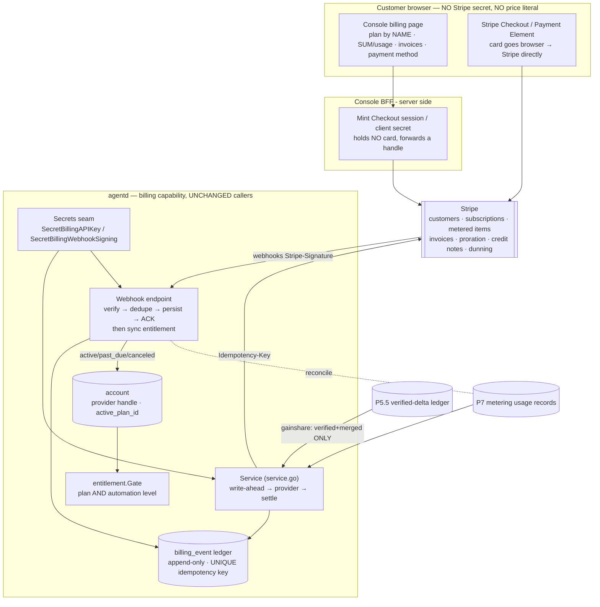

# PRD — P21: Stripe Payments (the concrete processor behind the P7 billing abstraction, plus the payment it collects)

| Field | Value |
|---|---|
| Phase / Milestone | P21 / M16 (real payments live) |
| Target window | Downstream of P7; lands as a wave alongside P9/P19 (needs the customer console and the deploy) |
| Lead role(s) | Sales Operations + Backend (co-leads) |
| Supporting role(s) | System Designer, Frontend, DevOps, Product Designer, QA Engineer |
| Status | **V1 green against a real Stripe test account (2026-07-30)**; live-mode cutover (V2) open |
| OpenSpec change | `p21-payments` |

> **Money-in-git rule (inherited from P7, non-negotiable).** This PRD contains **no dollar amounts, no
> percentages, and no price bands**. Plans are referred to by **name only** — **Free / Team / Business /
> Enterprise**. A concrete price lives **in Stripe** as a price object and is referenced from the
> platform **only** by its opaque `price_ref` (Stripe price ID) exactly as P7 already models it
> ([`plancfg.PlanConfig.PriceRefs`](../../internal/plancfg/plancfg.go)). No price value exists in code, in
> a manifest, in a client bundle, or in git — enforced by the same auto-discovering fence P7 ships
> ([`plancfg/gitfence_test.go`](../../internal/plancfg/gitfence_test.go)). Anything with a dollar sign is
> out of scope for this document by construction.

> **The one-sentence job.** P7 built the billing *abstraction* — the [`billing.Provider`](../../internal/billing/provider.go)
> interface, the append-only ledger, the idempotent webhook handler, the entitlement gate — and shipped it
> behind a [`StubProvider`](../../internal/billing/stub.go). **P21 makes it real: it implements that
> interface against Stripe, and it fills the one gap P7 left open — how a customer's payment method
> actually gets captured.** The abstraction does not change; Stripe is *one* implementation behind it.

## 1. Summary

P7 ([P7-billing-metering.md](P7-billing-metering.md)) turned the platform into a business *in principle*:
it defined the customer/account model, derived **spend under management (SUM)** from the P2.5 cost events,
built the plan × automation-level **entitlement gate**, and specified a **Stripe-style billing provider**
for subscriptions, metered usage, invoicing, proration, credits and refunds — **idempotent** (never
double-charge), **reversible** (correct by additive credit/refund, never a delete), and **auditable**
(every charge reconstructable to the usage that justified it). It shipped all of that behind a
`billing.Provider` interface and an in-process `StubProvider` that behaves the way a real processor's
idempotency contract behaves. What it deliberately did **not** do is talk to a real payment processor or
**collect a payment method** — a `StubProvider` invoices a customer who has no card on file.

P21 delivers the concrete Stripe integration of that abstraction, and closes the collection gap, in **three
capabilities**. **(1) `stripe-billing-provider`** — a real Stripe implementation of the *existing*
`billing.Provider` interface (Subscriptions, metered usage records, Invoices, proration, credits/refunds),
so the code path under test is the shipped path with the network swapped in, and a *second* processor
remains expressible without touching a single caller (八级法则 **可演进**). **(2) `payment-collection`** —
Stripe **Checkout / Payment Element** to capture a payment method, a self-serve **upgrade/downgrade** flow,
and the customer-console **billing page** (plan by **name**, current usage/SUM, invoices, payment method) —
with **no Stripe secret in the browser** and **no price value in the bundle**. **(3) `billing-webhooks`** —
the real inbound path: Stripe **signature verification** against the secret from the Secrets seam, **exactly-once**
processing keyed on Stripe's own event id, **persist-then-ack** (an HTTP 200 to Stripe is *not* proof the
event was recorded), and the subscription-lifecycle → **entitlement** sync that makes what a customer can do
follow what they pay for. **M16 — real payments live** is the milestone where the first real dollar can move,
and it can only move idempotently, reversibly, and auditably.

## 2. Problem & context

The billing *machinery* exists and is tested; what is missing is the processor it drives and the payment it
needs to drive it. Five problems block "real payments", and each maps to a design commitment, not a script.

- **🔴 The provider is a stub; there is no real processor.** `internal/billing/provider.go` defines the
  `Provider` interface (`EnsureCustomer`, `CreateSubscription`, `ReportUsage`, `RaiseCharge`, `IssueCredit`,
  `Invoice`, `RecordedUsage`) and `stub.go` implements it in-process. The stub is faithful *on purpose* — it
  models provider-side idempotency, the outage shape, and the ambiguous "recorded-then-response-lost" failure
  — but it moves no money. A real Stripe implementation of the *same interface* is simply absent, and until it
  exists the platform cannot charge anyone. The interface is the seam; P21 fills it, and does **not** widen it.
- **🔴 P7 left the collection gap: an invoiced customer with no card.** `EnsureCustomer` returns a provider
  *handle* and `CreateSubscription` places a customer on a `price_ref`, but **nothing captures a payment
  method**. There is no Checkout session, no Payment Element, no self-serve upgrade. A subscription with no
  payment method attached is an invoice that will never be paid — the machinery is real and the money is
  imaginary. This is the P7 non-goal that P21 owns.
- **🔴 The webhook path is scaffolded but not wired to reality, and HTTP 200 is not proof.**
  `internal/billing/webhook.go` verifies a signature, dedupes on `provider_event_id`, and applies state — but
  its signature scheme and payload shape are the stub's, and there is no **inbound HTTP endpoint** taking a
  real `Stripe-Signature` header. The load-bearing backend rule applies at its sharpest here: **a 200 returned
  to Stripe is not evidence the event was recorded** — a handler that acks before it has durably persisted the
  effect turns a provider redelivery into a *lost* event, because Stripe will stop retrying an event it thinks
  succeeded. Verify → persist the dedupe claim → *then* ack; a gap between "we said 200" and "we recorded it"
  is a silent billing failure, which is the one class of failure money cannot tolerate.
- **🔴 Nothing yet syncs Stripe's subscription state to entitlements.** The entitlement gate
  ([`entitlement.Gate`](../../internal/entitlement/entitlement.go)) reads the account's `active_plan_id` and
  the plan config; but no code moves the account between plans when Stripe says a subscription became
  `active`, `past_due`, or `canceled`. Without that sync, a customer who stops paying keeps their Enterprise
  auto-merge entitlement, and a customer who pays does not get what they bought. The subscription lifecycle
  must drive the entitlement — reversibly, at a defined boundary, by audited plan change, **never** by deleting
  data.
- **🔴 The secret and the one inbound path are a deployment hazard.** Stripe needs a server-side **API key**
  and a **webhook signing secret**; both already have reserved logical names in the Secrets seam
  ([`SecretBillingAPIKey`, `SecretBillingWebhookSigning`](../../internal/billing/secrets.go)) and resolve
  fail-closed through `providergateway.Secrets`. But the *console holds no Stripe key* (the BFF/platform does),
  and the webhook endpoint is the **one path where the internet reaches in** — the mirror image of every other
  egress-confined path in P19. Test-mode and live-mode must be separated so a test event can never move real
  money and a live key can never leak into a test surface. None of this is a code seam problem; it is a
  deployment-posture problem P21 must state.

**Upstream state assumed.** **P7** — the entire billing abstraction P21 implements: the `billing.Provider`
interface, the append-only `billing_event` ledger and its idempotency/write-ahead discipline
([`ledger.go`](../../internal/billing/ledger.go)), the additive-correction path
([`correction.go`](../../internal/billing/correction.go)), the reconciliation, the `Secrets` seam, the plan
model with opaque `PriceRefs`, and the entitlement gate. **P5.5** — the verified-delta ledger, the *only*
input to gainshare; P21 does not loosen that. **P9** — the customer console the billing page lands in.
**P19** — the deployment substrate and the ingress the webhook endpoint sits on. **ADR-002** — the platform is
never in a customer's production request path; billing is platform-internal commerce, unrelated to that path.

## 3. Goals & non-goals

### Goals

- **G1 — Stripe implements the *existing* `Provider` interface; the abstraction does not move.** A real
  `stripe.Provider` SHALL satisfy `billing.Provider` byte-for-byte in signature, so every caller (the charge
  protocol in [`service.go`](../../internal/billing/service.go), the correction path, the reconciler) runs
  unchanged whether the provider is the stub or Stripe. A **second** processor SHALL be addable by writing a
  second implementation of the same interface, touching **no** caller (八级法则 **可演进**).
- **G2 — A customer can attach a payment method self-serve.** The platform SHALL collect a payment method via
  Stripe **Checkout** (or the Payment Element), so a subscription is backed by a real instrument before it can
  be charged. The **card never touches the platform** — it goes from the browser to Stripe (PCI scope stays
  with Stripe); the platform holds provider **handles** only, exactly as `account.NewHandle` already enforces.
- **G3 — Self-serve upgrade/downgrade, priced by Stripe.** A customer SHALL be able to change plan by **name**
  from the console; the price is a Stripe `price_ref`, proration is Stripe's, and the **entitlement flips at
  the plan-change event** while the money proration is delegated to Stripe (P7 Q4). No price value renders on
  the client except as read back from Stripe through the billing API.
- **G4 — The console billing page shows plan-by-name, usage/SUM, invoices, and payment method — no secret,
  no priced literal.** The page SHALL render the plan name, the period SUM and metered usage, the invoice
  breakdown (subscription / metered / verified gainshare), and the payment-method status, each figure sourced
  from the billing/metering API. **No Stripe secret key** and **no hardcoded price** SHALL exist in the bundle.
- **G5 — Real Stripe webhooks are verified, exactly-once, and persist-then-ack.** The inbound endpoint SHALL
  verify the `Stripe-Signature` header against the signing secret **before any side effect**, process each
  event **exactly once** keyed on Stripe's event id, and **persist the dedupe claim and the effect before it
  returns 2xx** — an HTTP 200 is returned only after the event is durably recorded, and a gap is reconciled,
  never silently dropped.
- **G6 — Subscription lifecycle drives entitlements, reversibly and audited.** A paid/`active` subscription
  SHALL grant its plan's entitlements; a `past_due` one SHALL follow the dunning policy; a `canceled` one SHALL
  degrade to the **Free** tier **at the period boundary** (or per dunning) by an **audited plan change**,
  **never** by deleting the account or its history. The degradation is reversible: paying again restores the
  plan.
- **G7 — Idempotent: never double-charge on retry or replay.** Every charge-bearing operation SHALL carry the
  idempotency key P7 derives, passed to Stripe's `Idempotency-Key` header, so a retried operation or a
  redelivered webhook produces **at most one** charge — enforced at both the ledger's UNIQUE key and Stripe's
  own idempotency, as the stub already models.
- **G8 — Reversible: errors corrected by credit/refund with audit, never a hard delete.** A billing error SHALL
  be corrected via Stripe credit note / refund through the **existing** additive `Credit`/`Refund` path, with a
  full audit row; no correction path deletes or mutates a prior usage, invoice, or ledger record.
- **G9 — Auditable: every charge reconstructable to its justification, and gainshare bills only verified,
  merged savings.** Every Stripe charge SHALL trace through the ledger's `caused_by`/`evidence` to the
  usage_record or the P5.5 verified-delta ledger entries that justified it. **Gainshare SHALL read only the
  verified-delta ledger** — P21 does not loosen that; an estimated or unverified saving bills nothing.
- **G10 — Secret posture: Stripe credentials from the secret store, test/live separated, never leaked.** The
  Stripe API key and webhook signing secret SHALL come from the Secrets seam (env / AWS Secrets Manager /
  on-prem per deployment), never git/manifest/bundle/log/trace; **test mode and live mode** SHALL be separated
  so a test event moves no real money and a live key never reaches a test surface; the console SHALL hold **no**
  Stripe secret.
- **G11 — The webhook endpoint is the one inbound path, and it is honest about it.** The Stripe webhook endpoint
  SHALL be the single documented inbound-from-internet path (the mirror of P19's egress allowlist), signature-
  gated and rate-aware, and its deploy posture SHALL be stated for the P19 ingress model.

### Non-goals (explicitly deferred or owned elsewhere)

- **Metering / SUM derivation** — **P7 owns it.** P21 reports the already-derived usage to Stripe; it collects
  no new usage and re-derives no SUM.
- **Gainshare policy and the verified-delta computation** — **P7 / P5.5.** P21 raises a gainshare *charge* only
  from what the verified-delta ledger already proved; it re-verifies nothing and re-defines no baseline/holdout.
- **Plan definitions, limits, SUM bands, gainshare rates, and concrete prices** — **configuration + Stripe, not
  this document, not git** (P7 G4). P21 references a `price_ref`; it never authors a price.
- **Tax calculation, revenue recognition (ASC 606), and dunning *policy copy*** — **Stripe + Finance.** P21
  integrates what Stripe provides (Stripe Tax, dunning schedules) and mirrors the resulting state; it
  reimplements neither tax law nor GAAP.
- **A second payment processor** — **not now; the seam stays open.** P21 ships Stripe only. The `Provider`
  interface is the guarantee that a second processor is future work, not a rewrite (G1) — but building it is out
  of scope.
- **Storing raw card numbers / a custom in-house processor** — **never.** Card data lives with Stripe; the
  platform holds handles only (P7 non-goal, `account.NewHandle` fence, and the safety rule the design agrees
  with: the platform does not enter or store financial credentials).
- **Reselling provider tokens** — **explicitly never** (P7 G9). `ChargeKind` is a closed three-value enum with
  no token pass-through, and `Invoice.Validate` rejects a resold-token line; P21 does not touch that.

## 4. Users & personas

- **Billing owner / buyer (customer-side, primary economic buyer)** — picks a plan by name, enters a payment
  method through Stripe Checkout, and cares that the invoice is correct, explainable, and never a surprise.
  Wants to upgrade/downgrade without a support ticket, see what they are charged for (subscription / metered /
  gainshare), and — for gainshare — proof it was verified and merged. Never types a card into the platform;
  types it into Stripe.
- **Workflow owner / developer (customer-side, day-to-day)** — feels the *result* of the subscription state:
  a `past_due` account degrades their entitlement, a paid one restores it. Needs the degradation to be
  legible ("your subscription is past due — update payment to restore auto-merge"), not a silent 403.
- **Platform / Backend + DevOps operator (platform-side, co-lead of correctness)** — owns the Stripe
  integration's blast radius: idempotency (never double-charge), persist-then-ack (never lose an event),
  reconciliation, the API key + signing secret in the secret store, test/live separation, and the one inbound
  endpoint. Is paged when a charge fails, a webhook backs up, the meter drifts from Stripe, or the signing
  secret is unresolvable.
- **Sales Operations (platform-side, co-lead of the commercial boundary)** — owns that what is *sold* matches
  what the Stripe integration *delivers*: plans by name, no price value in code, honest dunning and refund
  behavior, and the self-serve upgrade path being the invitation the paywall is meant to be. Guards the
  promise that "you pay a share of savings we **verify and merge**" is true of the actual gainshare charge.
- **Finance / RevOps (platform-side, support)** — owns the Stripe price objects and the plan↔price mapping as
  configuration, reconciles the platform meter against Stripe, and needs test-mode and live-mode kept
  unambiguous.
- **Downstream subsystems** — the P7 metering usage records (what P21 reports to Stripe), the P5.5 verified-
  delta ledger (gainshare's only source), the entitlement gate (which the webhook sync drives), the P9 console
  (which the billing page lands in), and the P19 ingress (which the webhook endpoint sits on).

## 5. User stories / jobs-to-be-done

**Billing owner / buyer**
- As a billing owner, I want to **enter my card through Stripe's own checkout**, so that my card details never
  touch the platform and I trust where they go.
- As a billing owner, I want to **subscribe, upgrade, and downgrade by plan name from the console**, so that I
  can change what I pay for without a sales call, and the price change is Stripe's job.
- As a billing owner, I want my **billing page to show my plan, my usage/SUM, my invoices, and my payment
  method**, each line explainable, so that no charge is a mystery.
- As a billing owner, I want a **billing mistake fixed with a credit or refund and a clear record**, not a
  quiet edit of my history, so that I trust the numbers.

**Workflow owner / developer**
- As a developer whose subscription went **past due**, I want a **clear message and a path to restore**, so
  that I know exactly why auto-merge stopped and how to bring it back — never a bare 403.
- As a developer who just paid, I want my **entitlement to reflect it promptly**, so that what I bought works.

**Platform operator (Backend / DevOps)**
- As an operator, I want **Stripe's idempotency key on every charge**, so that a retried operation or a
  redelivered webhook never double-charges a customer.
- As an operator, I want the webhook handler to **persist before it acks**, so that a 200 to Stripe is never a
  lie about what we recorded, and a gap is reconciled.
- As an operator, I want the **Stripe key and signing secret from the secret store with test/live separated**,
  so that no secret is in git and a test event can never move real money.
- As an operator, I want **subscription lifecycle events to drive entitlements automatically and audibly**, so
  that stopping payment degrades access reversibly and paying restores it.

**Sales Operations**
- As sales ops, I want **plans referred to by name and every price sourced from Stripe**, so that packaging
  can change without an engineering release and no screen bakes in a number.
- As sales ops, I want **dunning and refunds to behave the way we tell customers they behave**, so that the
  billing experience matches the sales conversation.

## 6. Functional requirements

These map 1:1 to the OpenSpec requirements under
`openspec/changes/p21-payments/specs/{stripe-billing-provider,payment-collection,billing-webhooks}/`.

**Stripe provider — the concrete implementation behind the P7 interface** (`stripe-billing-provider`)
- **FR1** A `stripe.Provider` SHALL implement the **existing** `billing.Provider` interface without changing
  it: `EnsureCustomer`, `CreateSubscription`, `Subscription`, `ReportUsage`, `RaiseCharge`, `IssueCredit`,
  `Invoice`, `RecordedUsage`, `Describe`. Every existing caller SHALL run unchanged against it.
- **FR2** Every charge-bearing Stripe call (`CreateSubscription`, `ReportUsage`, `RaiseCharge`, `IssueCredit`)
  SHALL pass the P7-derived idempotency key as Stripe's **`Idempotency-Key`** header, so a retry or replay
  produces **at most one** Stripe object; `UsageResult.Duplicate` / `ChargeResult.Duplicate` SHALL surface
  when Stripe returned the original.
- **FR3** `CreateSubscription` SHALL place the customer on the plan's **opaque `price_ref`** (Stripe price ID);
  the provider SHALL **never** compute or store an amount, and **proration** on a plan change SHALL be Stripe's.
- **FR4** `ReportUsage` SHALL report a metered **quantity** for a `{customer, period, metric}` to a Stripe
  metered subscription item; the provider multiplies nothing — Stripe applies the price the `price_ref` names.
- **FR5** `IssueCredit` SHALL issue an **additive** Stripe credit note (or refund when `Refund` is set) against
  a prior charge; it SHALL **never** reduce or delete the original Stripe object.
- **FR6** `Invoice` SHALL read back a Stripe invoice as `billing.Invoice` and every line SHALL pass
  `Invoice.Validate` — a line whose kind is a resold-token shape is **rejected**, and every line names a basis;
  `RecordedUsage` SHALL return Stripe's recorded metered usage for reconciliation.
- **FR7** The Stripe provider SHALL distinguish **outage** (`ErrProviderUnavailable` → buffer and retry) from
  **rejection** (stop), so the P7 outage buffer and `FlushPending` recovery drain work unchanged.

**Payment collection — the P7 gap** (`payment-collection`)
- **FR8** The platform SHALL capture a payment method via Stripe **Checkout** (or the Payment Element) such that
  **card data goes from the browser to Stripe directly** and never through the platform; the platform stores
  the resulting Stripe customer/payment-method **handle** only.
- **FR9** A customer SHALL be able to **subscribe / upgrade / downgrade by plan name** from the console; on a
  plan change the **entitlement flips at the plan-change event** (audited) and the **money proration is Stripe's**.
- **FR10** The console **billing page** SHALL render plan **by name**, current period **SUM and metered usage**,
  the **invoice breakdown** (subscription / metered / verified gainshare), and **payment-method status**, each
  figure sourced from the billing/metering API — with first-class **loading / empty / past-due / payment-failed**
  states.
- **FR11** The console SHALL hold **no Stripe secret key** (only a short-lived Checkout session URL / client
  secret minted server-side by the BFF), and the client bundle SHALL contain **no hardcoded price value** — the
  same fence P7 applies to plan config applies to the payment UI.
- **FR12** A `past_due` or `payment_failed` state SHALL render a **named reason and a restore path** ("update
  payment to restore <feature>"), never a bare error; the state SHALL be driven by the mirrored provider state,
  not recomputed on the client.

**Billing webhooks — the idempotent inbound sync + entitlement drive** (`billing-webhooks`)
- **FR13** The inbound webhook endpoint SHALL verify the **`Stripe-Signature`** header against the signing
  secret from the Secrets seam **before any side effect** and **before parsing the body into a decision**; an
  unsigned, forged, or stale-timestamp payload SHALL be **rejected before it moves one byte of state**.
- **FR14** Each event SHALL be processed **exactly once** keyed on Stripe's **event id**: the endpoint claims
  the delivery in the `webhook_delivery` dedupe table, and a **redelivery is a success that applies nothing**
  and returns 2xx.
- **FR15** The endpoint SHALL **persist the dedupe claim and the effect before returning 2xx** — an HTTP 200 to
  Stripe SHALL NOT be returned for an event that was not durably recorded; a failure to persist SHALL return a
  non-2xx so Stripe **retries**, and a detected gap SHALL be reconciled, never silently dropped.
- **FR16** Subscription-lifecycle events (`customer.subscription.updated/deleted`, `invoice.paid`,
  `invoice.payment_failed`, `customer.subscription.past_due`) SHALL be **mirrored** into the provider-owned
  `BillingState` the UI renders, **verbatim** (the platform reflects Stripe's words, never recomputes dunning).
- **FR17** An `active`/paid subscription SHALL **grant** its plan's entitlements and a `canceled`/failed one
  SHALL **degrade to Free at the period boundary** (or per dunning) by an **audited plan change** through
  `account.SetPlan` + a `TypePlanChange` ledger row — **never** by deleting the account or its history; the
  change SHALL be **reversible** (paying restores the plan).
- **FR18** A `charge.refunded` / `charge.dispute.created` webhook SHALL **not** author a ledger row on its own
  — a webhook is a notification, not an authorization to write the billing ledger; the money movement is
  recorded through the audited `Credit`/`Refund` path only (P7 already enforces this; P21 preserves it).

**Live-account operation — what a *real account* adds beyond a *working integration*** (all three capabilities)

> These six requirements exist because the integration is now green against a real Stripe **test** account
> (§13), and everything that separates that from a real **live** account is either an artefact live mode does
> not inherit or a behaviour a test card never produces. Each was invisible while the only Stripe in the loop
> was one this repository wrote.

- **FR19** Every Stripe artefact SHALL be treated as **mode-scoped and not inherited**: the API key, the
  webhook endpoint and *its own* signing secret, the customer handles, the products and the **price ids** are
  separate objects in test and in live. A test-mode `price_ref` SHALL NOT be usable in live mode, and the
  preflight (NFR12) SHALL run **in the mode the deployment is running in** — a catalog that preflights clean
  in test says nothing about live, and the platform SHALL NOT report it as if it did.
- **FR20** The live cutover SHALL be an ordered, recorded sequence — live key resolvable, live endpoint
  registered with its own signing secret, live catalog preflighted clean, one reconciled test-mode period
  signed off — and the platform SHALL state plainly that **it is not symmetric**: flipping the mode back to
  test stops future charges but **un-moves no money**. The reverse path for money that has already moved is
  the additive `Credit`/`Refund` path (FR5), not the flag.
- **FR21** **Customer authentication (SCA / 3-D Secure) SHALL be a first-class state, not a failure.** A real
  card may require the cardholder to authenticate, so a subscription can sit `incomplete` with a
  `requires_action` payment intent. The platform SHALL mirror that state **verbatim** and the console SHALL
  render it as a named "your bank needs to confirm this payment" state carrying **Stripe's own** action link —
  never a generic "payment failed", never an automatic retry loop against a card that is waiting on a human.
- **FR22** **A rate limit is an outage, a decline is a rejection.** Stripe HTTP **429** and lock-contention
  errors SHALL map to `ErrProviderUnavailable` so the P7 buffer holds the work and `FlushPending` drains it
  once; a **card decline** or an invalid-request error SHALL map to a rejection that stops. Mapping a 429 to a
  rejection loses billable usage; mapping a decline to an outage hammers a card that will never succeed.
- **FR23** The webhook endpoint SHALL be **registered per mode with an explicit, enumerated event-type
  subscription**, and the registered URL, its mode and its event set SHALL be recorded in the ingress runbook.
  An event type the platform does not handle SHALL be **acked as understood-and-ignored** — a 2xx that applies
  nothing — rather than 5xx'd, so Stripe's retry queue is never filled by events nobody asked for.
- **FR24** A **dispute / chargeback moves money the platform did not author.** The webhook SHALL mirror the
  state and author **no** ledger row (FR18 preserved), and the movement SHALL surface to reconciliation as a
  **named divergence** so a human closes it through the audited credit path. Silence here is a ledger that
  disagrees with the bank and says nothing.

## 7. Non-functional requirements

- **NFR1 — Correctness of money is load-bearing, not best-effort.** Never double-charge (FR2, FR7) and never
  bill an unverified saving (G9) are **invariants enforced by construction** — Stripe's `Idempotency-Key` plus
  the ledger's UNIQUE key; gainshare reads a single verified source — and both are **tested** (a replayed
  webhook charges once; an estimated saving raises no charge).
- **NFR2 — Persist-then-ack; HTTP 200 is not proof of record.** The webhook handler records the dedupe claim and
  the side effect **before** it returns 2xx (FR15). A handler that acks first and records later is
  non-conformant; the assertion is a test that persistence failure yields a non-2xx and Stripe retries.
- **NFR3 — No secret in the bundle, no price in code.** The Stripe API key and signing secret live in the
  Secrets seam and appear in **no** git file, manifest, log line, trace attribute, or client bundle; **no price
  value** exists in code/manifest/bundle — both enforced as **build-/apply-time gates** (the plan-config fence
  extended to the payment surface), not review habits.
- **NFR4 — Test/live separation is unambiguous.** The provider mode (test | live) is the P7 rollout flag
  ([`rollout.go`](../../internal/billing/rollout.go)); a **live** key never resolves for a test surface and a
  **test** event never moves real money. The zero value is **test mode** — a deployment that forgets to
  configure the mode charges nothing real.
- **NFR5 — Reversible by additive correction only.** Every correction is a Stripe credit note / refund via the
  additive `Credit`/`Refund` path with an audit row; no path deletes or edits a prior usage, invoice, or ledger
  record. "What was charged, when, and why" is reconstructable for any period. Tested by injecting a wrong
  charge, correcting it, and asserting the originals are intact and the net is right.
- **NFR6 — Auditable and reconcilable.** Every Stripe charge traces through `caused_by`/`evidence` to its
  justification; a scheduled, idempotent, side-effect-free **reconciliation** compares platform usage to Stripe's
  recorded usage/invoices and surfaces drift as an alert, never a reconcile-by-overwrite (P7 FR4/FR14 preserved).
- **NFR7 — The webhook endpoint is the one inbound path.** It is signature-gated, timestamp-bounded (replay
  window), and rate-aware; its deploy posture is documented for the P19 ingress model as the single documented
  inbound-from-internet surface. A malformed body is a distinguishable, logged contract break, not a crash.
- **NFR8 — Availability / degradation without blocking the product.** A Stripe outage SHALL **not** block runs,
  evals, PRs, or metering; usage is **buffered** and reported idempotently on recovery, so the outage window is
  billed **once**. The billing page degrades to a clearly-worded "billing temporarily unavailable" rather than a
  blank error.
- **NFR9 — The platform is never in a customer's production request path (ADR-002).** Billing is platform-
  internal commerce; the Stripe integration adds no runtime dependency of a customer's transformed program on
  platform (or Stripe) uptime.
- **NFR10 — Accessibility & honesty of the payment UI.** The billing page renders subscription/metered/gainshare
  breakdowns with first-class loading / empty / past-due / payment-failed states; SUM and usage charts follow
  the **dataviz** skill for contrast and light/dark; every figure comes from the API/config (no hardcoded
  number); the upgrade path is keyboard-reachable and legible.
- **NFR11 — Commercial honesty.** Plans are named; dunning and refund behavior in the UI and the docs match
  Stripe's actual behavior and the sales conversation; the word "风险可控" appears nowhere; no internal
  profile/bundle/script name leaks into a customer-facing billing message.
- **NFR12 — The provider account's configuration is a precondition, and it is CHECKABLE.** Every
  `price_ref` a plan carries SHALL resolve at the provider **before** anything charges against it, and a
  reference that does not resolve SHALL be named — which plan, which charge kind, which reference — rather
  than surfacing as a rejected charge mid-period. A metered price SHALL be denominated in the meter's
  **integral unit**, because the platform reports a whole-unit quantity and refuses to round one
  (rounding silently changes what a customer is billed). This is configuration the platform does not own
  and therefore cannot fix; what it owes is to say precisely what is wrong and whose job it is.
- **NFR13 — Test-mode green is a claim about the platform, not about the live account.** Every readiness and
  verification signal that names Stripe SHALL name the **mode** it was observed in, and no signal shall let a
  test-mode result stand in for a live one. The two accounts share code and share **nothing else** — not a
  key, not an endpoint, not a price id, not a customer (FR19). A record that omits the mode is not a weaker
  record; it is a misleading one, because the reader supplies the missing word themselves and supplies it
  optimistically.
- **NFR14 — Live cutover is one-way for money and the documentation says so.** The rollout flag is reversible;
  a charge is not. Everything written about the cutover — runbook, PRD, console copy — SHALL state that the
  rollback for money already moved is an additive correction (FR20), so nobody plans a release on the belief
  that a flag protects them after the first live invoice.
- **NFR15 — The unhappy states a real card produces are designed, not defaulted.** SCA-pending
  (`requires_action`), an authentication the cardholder abandoned, a dispute, and a rate-limited window each
  render as their own state with their own next action (FR21, FR22, FR24) — a customer waiting on their bank
  and a customer whose card was declined receive **different** messages, because the action they must take is
  different and telling them the wrong one wastes a real person's afternoon.

## 8. System design summary

**Where P21 sits — one concrete implementation slotted behind the P7 interface, plus a collection surface and
one inbound endpoint.** P7 already drew the boxes; P21 fills the `Provider` box with Stripe, adds the
`payment-collection` surface in front of it, and stands up the `billing-webhooks` endpoint behind it.

Twelve decisions carry the design; each is recorded in
[`../../openspec/changes/p21-payments/design.md`](../../openspec/changes/p21-payments/design.md) with the
alternative that lost and the arbitration level (the **八级法则**: 安全 > 稳定 > UX > 运维 > 可演进 >
可扩展 > 维护 > 实现) at which it lost.

- **D1 — Stripe behind the existing `Provider` interface; the interface does not widen** (**L5 可演进**). The
  concrete processor is a swap-in implementation, not a new API surface; a second processor is a second
  implementation, touching no caller.
- **D2 — Collection is Stripe Checkout/Element; the card never touches the platform** (**L1 安全**). PCI scope
  stays with Stripe; the platform holds handles only, and the browser talks to Stripe directly.
- **D3 — Webhook order is verify → dedupe → persist → ack; 200 is not proof** (**L1 / L2**). Persist-then-ack is
  the only order under which a redelivery is safe and a lost event is impossible.
- **D4 — Idempotency key on every charge, keyed the P7 way, passed to Stripe** (**L2 稳定**). Two layers refuse
  the duplicate — the ledger's UNIQUE key and Stripe's `Idempotency-Key` — so never-double-charge holds under
  arbitrary retry/redelivery.
- **D5 — Subscription state drives entitlement by audited plan change, reversibly** (**L2 / L4**). Degradation is
  a plan change at a boundary, not a delete; restoration is another plan change; both are audited.
- **D6 — Stripe secret from the Secrets seam; test/live separated; console holds none** (**L1 安全**). The
  billing key reuses the one credential source, fail-closed, and the console never sees it.
- **D7 — Opaque price references; no price in code/bundle** (**L5 / commercial honesty**). Prices are Stripe
  objects referenced by id; the plan-config fence extends to the payment UI.
- **D8 — Reversibility is additive only; corrections are Stripe credit notes/refunds** (**L2**). No path deletes
  or edits a prior record; recovery is forward.
- **D9 — The account's configuration is verified before it is charged against, not by charging against it**
  (**L2 稳定 / L4 运维**). A read-only preflight resolves every configured `price_ref` at the provider and names
  each failure by plan / kind / reference. Rejected: validating the reference's *shape* locally (a well-shaped
  id for an archived price passes and still fails a charge); letting the first charge of the period find out.
- **D10 — Mode is a property of every artefact, not a flag on one of them** (**L1 安全 / L2 稳定**). Key,
  endpoint, signing secret, customer handle and price id are all per-mode objects; the preflight and every
  readiness line are mode-stamped (FR19, NFR13). Rejected: treating "Stripe is configured" as a single boolean
  — the shape under which a test price id reaches a live charge.
- **D11 — Customer authentication is a state to render, not an error to swallow** (**L3 UX / L2 稳定**). SCA
  `requires_action` is mirrored verbatim and rendered with Stripe's own action link (FR21). Rejected: folding it
  into `payment_failed` (tells a customer who did nothing wrong that their card was refused); retrying
  automatically (a card waiting on a human never becomes a card that succeeds).
- **D12 — 429 is an outage, a decline is a rejection** (**L2 稳定**). The transport-error split P7 already
  depends on is extended to Stripe's rate limiter (FR22). Rejected: one error class for "Stripe said no" — it
  either discards billable usage or hammers a dead card, and which one you get is luck.

**Data model (System Designer lens) — no new tables of truth; P21 fills existing ones.**
- `account` (existing) — holds the Stripe `provider_customer_handle` and `active_plan_id`; the webhook sync
  moves `active_plan_id` via `SetPlan`. No card data (the `NewHandle` Luhn fence already refuses a PAN).
- `billing_event` (existing, append-only) — the Stripe charge/credit/refund refs are stamped by `Settle`; the
  `webhook.go` path continues to author *no* ledger row from a webhook (FR18).
- `webhook_delivery` (existing) — keyed on Stripe's event id; the endpoint claims it before applying.
- Payment-method / subscription refs — Stripe **handles**, opaque; the platform stores the reference, never the
  instrument.
- **Stripe** — the system of record for *charges*, cards, proration, and dunning. The platform's `usage_record`
  is the system of record for *what was used*; **reconciliation** keeps them honest (P7 Decision 7).

**Key interfaces (sketch — details in `design.md`).**
- `stripe.New(secrets billing.Secrets, mode Mode) (billing.Provider, error)` — the concrete provider; **same
  interface**, real network.
- `BFF: POST /billing/checkout-session → {checkout_url}` — mints a Stripe Checkout session server-side; the
  browser is redirected; **no secret to the client**.
- `BFF: POST /billing/plan { plan_name } → {status}` — subscribe / upgrade / downgrade; entitlement flips at the
  event, proration is Stripe's.
- `POST /billing/webhook` (agentd) — the one inbound path: `HandleWebhook` (verify → dedupe → persist → ack) then
  entitlement sync.
- Everything else — `Service.Charge/ReportUsage/Credit/Refund/Reconcile`, the ledger, the gate — is **P7's,
  unchanged**.

## 9. Design by role lens

**Sales Operations (co-lead) — *sell exactly what the Stripe integration delivers; plans by name, prices in
Stripe, dunning and refunds honest.***
The commercial boundary is the design boundary, and it is stated by **name**: what a customer buys is a plan —
Free / Team / Business / Enterprise — never a number, and every price is a **Stripe object referenced opaquely**
(D7, FR11). This is not UX polish; it is the mechanism that lets Finance change packaging in Stripe without an
engineering release, and it is enforced the way P7 enforces it — an auto-discovering fence over the whole git
index, now extended to the payment UI, so a priced literal in a React bundle fails the build, not review. Two
honesty rules bind this integration specifically. **Dunning is Stripe's, and the UI tells the truth about it**:
the platform mirrors `past_due` / `payment_failed` verbatim and renders a *restore path*, never a softer story
than the one Stripe is actually running (FR12, FR16) — because a customer who is told "your payment is being
retried" while Stripe is about to cancel has been misled, and this role owns that not happening. **Refunds are
additive and real**: when we tell a customer "a billing mistake is fixed with a credit," the product does
exactly that through the audited `Credit`/`Refund` path (FR5, FR8), never a quiet edit — the promise and the
mechanism agree. The self-serve upgrade path is the paywall's invitation made good: a developer who hits an
Enterprise-only feature is shown the plan that lifts it (the entitlement gate already names it) and can act on it
without a sales call (FR9). And the word "风险可控" never appears; what the platform offers is an observable,
correct bill, and the copy says exactly that.

**Backend Dev (co-lead) — *money is the least-reversible thing we do; idempotent, persist-then-ack, reconciled,
no silent failure.***
This is the role P7 built the contracts for, and P21 is where they meet the network. Four disciplines are
non-negotiable.
- *Idempotency is two layers, keyed the P7 way.* Every charge-bearing Stripe call carries the derived
  idempotency key ([`ledger.go`](../../internal/billing/ledger.go) `*IdempotencyKey`) as Stripe's
  `Idempotency-Key` header (FR2, D4); the ledger's UNIQUE key refuses a second row and Stripe refuses a second
  object, so never-double-charge holds under arbitrary retry and the nastiest case — Stripe recorded the charge
  and the response was lost — resolves to a `pending` row a retry resumes, exactly as the stub already models.
  The keys are **derived, never typed at a call site**, and carry an operation prefix, because two call sites
  spelling a key differently is a double-charge with a green test suite.
- *HTTP 200 is not proof of record — persist before you ack.* The webhook endpoint verifies the signature
  first (nothing parses attacker-controlled bytes into a decision before verification), **claims the delivery**
  in `webhook_delivery`, applies and persists the effect, and **only then** returns 2xx (FR13–FR15, D3). If
  persistence fails it returns non-2xx so Stripe **retries** — because a 200 for an event we did not record is a
  lost event Stripe will never resend. This is the "HTTP 200 ≠ 成功入库" rule at its most expensive.
- *Reconcile; the two ledgers may never diverge unnoticed.* The platform owns "what was used" (usage records),
  Stripe owns "what was charged," and a scheduled, idempotent, side-effect-free reconciliation surfaces drift as
  an alert (NFR6) — never a reconcile-by-overwrite. The one auto-repair is re-reporting missing usage
  idempotently; a reduction always goes through the audited credit path.
- *No silent failure, fail closed on the secret.* A missing signing secret means the webhook cannot be verified,
  so it is **rejected**, not trusted (the seam already fails closed); a resolved-empty key is loud at the first
  charge's write-ahead, not discovered by a customer. Every degrade-to-default path carries a WARN with the
  correlating ids.

**System Designer (support) — *one implementation behind one interface; the abstraction is the evolvability
guarantee.***
The architectural content of P21 is a single substitution done cleanly: the `billing.Provider` interface is the
seam, and Stripe is one thing behind it (D1, FR1). The proof that this is done right is that **no caller
changes** — `service.go`'s charge protocol, `correction.go`'s credit path, and the reconciler all run against
Stripe exactly as they run against the stub, because the stub was written to be faithful to the same contract.
That is what makes "a second processor is future work, not a rewrite" a true statement rather than a hope: the
one-way door (do we couple callers to Stripe, or to the interface?) is decided here, at L5 可演进, with the
alternative that lost — a Stripe-typed billing package — named so a future reviewer sees a considered trade-off,
not an accident. The other structural rule is **one source of truth per fact**: Stripe owns charges, the
platform owns usage, and the only thing allowed to compare them is the read-only reconciler — the number-one
cause of billing drift is two systems each believing they own the same fact, and P21 refuses to introduce it.

**Frontend Dev (support) — *no secret and no price in the browser; unhappy states are first-class.***
The billing page is a BFF-fronted Next.js surface, and it honors the two hard frontend laws of this codebase.
**No Stripe secret ever reaches the client**: the browser gets a short-lived Checkout session URL or a client
secret minted server-side by the BFF (FR8, FR11), and the card goes from Stripe's own iframe to Stripe, never
through the platform. **No price value is hardcoded**: every figure — plan name, SUM, metered usage, invoice
lines — comes from the billing/metering API, which reads config, so the token-system bundle scan the console
build already runs (extended to catch a priced literal) fails the build if a number sneaks in (D7). The states
that matter most are the unhappy ones, designed rather than defaulted: **past-due / payment-failed** renders the
mirrored provider state with a named restore path (FR12, "update payment to restore auto-merge"), never an
ambiguous error; **upgrade/downgrade** shows plans by name and reflects the entitlement flip immediately while
the proration is Stripe's (FR9); **loading / empty / billing-unavailable** are explicit (NFR8, NFR10). SUM and
usage charts follow the **dataviz** skill for contrast and light/dark consistency, and every state is
keyboard-reachable.

**DevOps Engineer (support) — *the secret from the store, test/live separated, and the one inbound path
posture.***
Two credentials — the Stripe API key and the webhook signing secret — come from the Secrets seam under their
reserved logical names ([`SecretBillingAPIKey`, `SecretBillingWebhookSigning`](../../internal/billing/secrets.go)),
resolved fail-closed through `providergateway.Secrets`, so `/readyz`'s `secrets_source` covers them and the
scrubber that keeps provider keys out of telemetry covers these by construction (D6, NFR3). **Test mode and live
mode are separated** by the P7 rollout flag whose zero value is test (NFR4): a deployment that forgets to
configure the mode charges nothing real, a live key never resolves for a test surface, and a test event moves no
real money. The webhook endpoint is the **one place the internet reaches in** — the mirror image of P19's egress
allowlist — so its posture is stated for the P19 ingress model (NFR7, FR13): signature-gated before any side
effect, timestamp-bounded so a captured payload is not a permanent key, and rate-aware. And ADR-002 holds: this
is platform-internal commerce; nothing here puts the platform (or Stripe) in a customer's production request
path (NFR9).

**Product Designer (support) — *the receipt is the product; the unhappy path is designed, the boundary is
honest.***
Billing has to make money **legible**: the page separates subscription vs. metered vs. verified gainshare, each
line traceable to what justified it, and shows the plan by name, the period SUM, and the payment-method status.
The design work is the **unhappy path** — the past-due banner, the payment-failed restore flow, the
"downgrade takes effect at period end" explanation, the "gainshare shows what was verified and merged with links
to the evidence" — because those are the moments a customer's trust is won or lost, and a defaulted error state
loses it. The boundary is told **plainly**: a downgrade flips entitlement at the plan-change event while money
proration is Stripe's (FR9, P7 Q4); gainshare bills only savings that were **verified and merged** and says so
with links to the proof; and no internal mechanism (profile name, bundle name, script name) leaks into a
customer-facing billing message.

**QA Engineer (support) — *the charge succeeding is not the record; test replay, persist-then-ack, and reversal
as their own axes.***
Acceptance is behavioral, and for money the behaviors are precise. **Never-double-charge is a replay test**: fire
the same webhook / retry the same charge N times against a Stripe test-mode account and assert **one** Stripe
object and **one** ledger row (FR2, FR14). **Persist-then-ack is a failure-injection test**: make persistence
fail and assert the endpoint returns **non-2xx** so Stripe retries, and that no event acked-but-unrecorded exists
(FR15, NFR2) — the load-bearing test. **Reversibility is a round-trip test**: inject a wrong charge, correct it
with a credit, assert the original usage/invoice/ledger records are **intact** and the net is right (FR5, NFR5).
**Gainshare-bills-nothing-unverified** stays green: an estimated or un-merged saving raises no charge (G9).
**Secret and price fences are tests**: no Stripe secret in any bundle/manifest/log, no priced literal in the
payment UI, an unsigned or stale webhook rejected before any side effect (FR13, NFR3). And **test/live separation
is asserted**: a live key never resolves for a test surface, and the default (test) mode moves no real money
(NFR4). Each runs against **one** stack, so the claims are simultaneously true rather than each getting a
favorable fixture.

### 9.1 The live account, by role lens — what changes when the money stops being pretend

**Sales Operations.** The commercial boundary moves from "what we may say" to "what we have signed". Two
things become committable that were not: a customer can be charged, and a plan change takes effect against a
real instrument. Two things become *un*committable until they are done: a rate nobody has signed off is not a
price list (Q7), and a tax configuration that exists only in test is not a tax configuration (Q6). The
dunning copy is now describing something that actually happens to a real card, which raises the cost of the
gap between what the copy says and what Stripe does to zero tolerance — FR16's "mirror verbatim" is a
commercial commitment, not a coding style.

**Backend.** The two error mappings that were theoretical become load-bearing: a 429 is an outage and a
decline is a rejection (D12, FR22), and getting them backwards is either lost revenue or a card hammered
until the issuer blocks it. Everything else is the discipline that was already there — idempotency keyed the
P7 way, persist-then-ack, additive corrections — and the reason it survives contact with live mode is that
the real *test* account already broke five things and they were fixed then.

**DevOps.** The unit of work is artefacts, not code (§10.2). A second key, a second endpoint with a second
signing secret, a second catalog, each per-mode and none inherited — and a readiness surface that says which
mode it is talking about, because "Stripe: ok" is the sentence under which a test price id reaches a live
charge (NFR13). The one-way door is step 5 of §12, and the runbook says so where an operator will read it at
2am rather than in a design document.

**Frontend + Product Designer.** SCA is the new state and it is a *waiting* state, not a failing one (D11,
FR21). A customer who must tap "approve" in their banking app and a customer whose card was declined get
different words, a different action and a different link, because they must do different things. The design
rule that makes this non-negotiable is the one already in this repo: a status with no discriminating power is
zero information, and "payment failed" covering both is exactly that.

**QA.** Three of the six live requirements are testable *before* live mode using Stripe's authentication-
required test cards, an injected 429 and an unhandled event type — so they are tested there (§12), and the
live checklist (§13.1) is left holding only what genuinely cannot be observed until real money moves. That
split is the point: a live checklist full of things that could have been checked in test is a checklist
nobody can afford to run.

## 10. Dependencies

- **Requires (upstream):**
  - **P7** — the entire billing abstraction P21 implements: the `Provider` interface, the append-only ledger and
    its write-ahead/idempotency discipline, the additive-correction path, reconciliation, the `Secrets` seam, the
    plan model with opaque `PriceRefs`, the entitlement gate, and the rollout flag. **P21 cannot exist without
    P7.**
  - **P5.5** — the verified-delta ledger, the **only** input to gainshare charges; P21 does not loosen it.
  - **P9** — the customer console the billing page lands in (ADR-006/008 console posture).
  - **P19** — the deployment substrate and the ingress the webhook endpoint sits on; test/live secret wiring.
  - **ADR-002** — the platform is never in a customer's production request path; billing is unrelated internal
    commerce.
- **Consumes:** a Stripe account (test + live mode); the plan↔`price_ref` mapping as configuration (Finance, in
  the config store / Stripe, not git); the P7 metering usage records; gainshare consent from the buyer.
- **Unblocks:** **M16 — real payments live (first real dollar).** The subscription + metered + gainshare revenue
  that P7 specified can now actually move, idempotently and reversibly, through Stripe.

### 10.1 Stripe account prerequisites — the three artefacts this repository cannot produce

The platform code is complete and exercised end to end against an in-process Stripe. What separates that
from the M16 checklist's *"against one Stripe test-mode stack"* is **three artefacts that live in the
Stripe account**, two of which are credentials this repository must never contain. They are listed here
rather than left as a footnote because "the code is right" and "V1 can run" are different claims, and
conflating them is how a phase reports itself finished while nothing can actually be charged.

| # | Artefact | Shape | Owner | Why it is not optional |
|---|---|---|---|---|
| **A** | Stripe **test secret key** | `sk_test_…` (or `rk_test_…`) | DevOps, from the Stripe dashboard into the Secrets seam under `billing_provider` | Every outbound call authenticates with it. The mode check reads the **prefix**, so a live key is refused on a test surface and an unrecognized prefix is refused outright — assuming "probably test" is how a live key reaches a test surface. |
| **B** | **Webhook signing secret**, one **per endpoint** | `whsec_…`, into the seam under `billing_webhook` | DevOps | Inbound deliveries are authenticated by signature and nothing else. **One per mode**: sharing a secret across a test and a live endpoint means a test event verifies against a live deployment. During a rotation Stripe signs with both, and the verifier accepts either. |
| **C** | **Real Stripe price objects** | `price_…` ids replacing the placeholder `price_ref_*` values in the plan catalog | Finance creates the prices; DevOps publishes the catalog to the config store | A `price_ref` is opaque **to the platform** — but Stripe resolves it. A placeholder 404s on the first charge of the period, which is the worst possible moment to discover it. **Metered prices must be denominated in the meter's integral unit** (NFR12), because the platform reports a whole-unit quantity and refuses to round one. |

Two properties of this list are worth stating explicitly, because both are design outcomes rather than
accidents:

- **The platform never holds A or B.** They are resolved from the Secrets seam at the moment of use
  (D6), so there is no field, config file, or manifest for them to sit in — and the credential fence
  fails the build if anything key-shaped reaches a git-tracked file.
- **C is configuration, not code** (D7). Changing a price is Finance editing Stripe and republishing a
  catalog; it is not a deploy. That is the whole reason the platform holds a reference rather than a
  value — and it is also why a wrong reference is a *configuration* failure the platform must diagnose
  rather than a bug it can fix.

### 10.2 Live mode inherits nothing — the artefacts the cutover needs, and the one that cannot be undone

§10.1's three artefacts now exist **in test mode**, and the M16 checklist is green against them (§13). The
temptation at this point is to read "Stripe works" and treat live mode as the same integration with a
different flag. It is not. In Stripe, test and live are two disjoint object graphs that happen to share an
account and an API surface: **every** artefact below is a different object with a different id, and none of
them is created by flipping the flag.

| # | Artefact live mode does **not** inherit | Owner | What goes wrong if it is assumed |
|---|---|---|---|
| **A′** | **Live secret key** (`sk_live_…`), in the Secrets seam under the same logical name, resolved for the live surface only | DevOps | The mode check reads the key's prefix, so a test key on a live surface is refused rather than quietly charging nothing. The failure mode worth naming is the opposite one: a **live** key reaching a non-production surface, which is why the check is a refusal in both directions and not a warning. |
| **B′** | **A separate webhook endpoint** registered in live mode, with **its own** signing secret and its own enumerated event set (FR23) | DevOps | Sharing a signing secret across modes means a test event verifies against a live deployment. There is no such thing as "the webhook secret" — there is one per endpoint, and there is one endpoint per mode. |
| **C′** | **Live price objects** — new ids, in the meter's integral unit (NFR12), published as a live catalog | Finance creates, DevOps publishes | Test price ids do not resolve in live. The preflight (D9) is the thing that says so, which is why it must run **in live mode against the live catalog** before the first charge, not once in test and remembered (FR19, NFR13). |
| **D′** | **One reconciled test-mode period, signed off by Finance** | Finance | This is the second half of the Q5 gate and the only artefact on this list that is a *judgement* rather than a credential. It exists so the first live dollar follows a dry run somebody read. |
| **E′** | **A human who has completed a real Checkout** | Anyone with a browser | Item 3 of the M16 record is green with a stated remainder: the session is minted server-side against the real account, and nobody has typed a card into Stripe's page. A card number goes into a form by a person, deliberately, or it does not go in at all. |

Two properties of this list matter more than the list:

- **The cutover is one-way for money** (FR20, NFR14). The rollout flag is reversible and a charge is not.
  Flipping back to test stops the next charge; it does not un-make the last one, and the only path backwards
  for money that has moved is the additive credit/refund path (FR5). Any plan that treats the flag as a
  rollback is planning with a safety net that is not there.
- **Nothing here is a code change.** A′ and B′ are credentials the repository must never contain, C′ is
  configuration, D′ is a signature and E′ is a person. That is the intended shape — but it also means the
  live cutover cannot be verified by a green build, and §13.1 is written as a separate checklist for exactly
  that reason.

## 11. Risks & mitigations

| # | Risk | Owner | Mitigation |
|---|---|---|---|
| R1 | Implementing Stripe leaks a Stripe type into the caller surface, coupling the platform to one processor. | System Designer / Backend | `stripe.Provider` satisfies the **existing** `billing.Provider` byte-for-byte (FR1, D1); a test asserts every caller compiles and runs against both stub and Stripe; the interface is not widened. |
| R2 | Customer double-charged (retried op / redelivered webhook / ambiguous Stripe failure). | Backend / DevOps | Idempotency key on every charge, passed to Stripe's `Idempotency-Key` (FR2, D4); ledger UNIQUE key + Stripe idempotency both refuse the duplicate; replay test asserts one object + one row. |
| R3 | Webhook acked (200) before the effect was recorded → event lost, Stripe stops retrying. | Backend | Verify → dedupe → **persist → ack** (FR13–FR15, D3); persistence failure returns non-2xx so Stripe retries; failure-injection test is load-bearing. |
| R4 | A stopped-paying customer keeps a paid entitlement, or a paying one doesn't get it. | Backend | Subscription lifecycle drives entitlement by **audited plan change**, reversibly (FR17, D5); degrade to Free at the period boundary, restore on payment; tested both directions. |
| R5 | Card data or a Stripe secret lands in platform scope / the browser / a bundle. | DevOps / Frontend | Collection is Checkout/Element — card goes browser → Stripe (FR8, D2); `account.NewHandle` refuses a PAN; secret from the Secrets seam, console holds none (FR11, D6); bundle scan fails on a secret. |
| R6 | A price value ends up in code, a manifest, or the client bundle. | Sales Ops / Frontend | Opaque `price_ref` only (D7); the P7 auto-discovering git fence extended to the payment UI; a priced literal fails the build (NFR3). |
| R7 | Test event moves real money, or a live key leaks into a test surface. | DevOps | Test/live separated by the rollout flag whose zero value is **test** (NFR4); a live key never resolves for a test surface; asserted in tests. |
| R8 | Stripe outage blocks the product or bills the window twice. | DevOps | Product keeps running; usage **buffered** and reported idempotently on recovery, so the window bills **once** (NFR8); billing page degrades to a clear message. |
| R9 | Gainshare bills an unverified/estimated saving once real money is flowing. | AI / Backend | Gainshare reads **only** the P5.5 verified-delta ledger for merged PRs (G9, preserved from P7); estimated/un-merged saving raises no charge; test stays green. |
| R10 | Dunning/refund UI tells a softer story than Stripe is actually running. | Sales Ops / Product | Provider state mirrored **verbatim** (FR16); UI renders the real `past_due`/`payment_failed` with a restore path (FR12); refunds are additive and real (FR5). |
| R12 | A plan's `price_ref` does not exist in the Stripe account (a placeholder was never replaced, or a price was archived), and it is discovered by a rejected charge mid-period. | DevOps / Finance | A **preflight** resolves every configured `price_ref` at the provider before anything charges and names each one that fails — plan, kind, reference (NFR12); the result is on the readiness signal and rendered as a first-class *misconfigured* state in the console, distinct from "unavailable" and from "empty". |
| R11 | The webhook endpoint is a soft inbound attack surface. | DevOps / Backend | One documented inbound path (NFR7); signature-gated before any side effect, timestamp-bounded replay window, rate-aware (FR13); unsigned/forged/stale rejected before state moves. |
| R13 | A test-mode artefact is carried into live — a test price id in the live catalog, one signing secret shared by both endpoints, a test customer handle assumed to resolve — because "Stripe works" was read as a single fact. | DevOps / Finance | D10/FR19/NFR13: every artefact is mode-scoped; the preflight runs **in the running mode** against the running catalog and its result is mode-stamped on the readiness signal; a key whose prefix does not match the surface is refused in both directions. |
| R14 | A real card requires 3-D Secure, the subscription sits `incomplete`, and the customer is told "payment failed" — so they re-enter a card that was never the problem, or churn. | Product / Frontend | D11/FR21/NFR15: `requires_action` is mirrored verbatim and rendered as its own state with Stripe's own action link; it is never folded into `payment_failed` and never auto-retried. |
| R15 | Stripe rate-limits a burst (429) and the platform treats it as a rejection, dropping billable usage — or treats a card decline as an outage and retries a card that will never clear. | Backend | D12/FR22: 429 and lock contention map to `ErrProviderUnavailable` (buffer + backoff, `FlushPending` drains once); declines and invalid-request errors map to a rejection that stops. Both directions asserted. |
| R16 | A chargeback moves money the ledger never hears about, and the two disagree silently for a period. | Backend / Finance | FR24: the dispute webhook mirrors state and authors **no** ledger row (the P7 rule stands); reconciliation surfaces the movement as a **named divergence** so a human closes it through the audited credit path — the failure is loud rather than absent. |

## 12. Rollout & test strategy

- **Stripe test mode first, dark behind the rollout flag.** The `stripe.Provider` ships in **test mode** (the
  P7 rollout flag's default), exercised against a Stripe test account, dark until the M16 checklist is green.
  Nothing about the code changes when it goes live — the *mode* does (NFR4).
- **Contract-parity fixtures.** The same billing test suite P7 runs against `StubProvider` runs against
  `stripe.Provider` in test mode, asserting the interface contract is identical (FR1) — subscriptions, metered
  reporting, charges, credits/refunds, invoice read-back with `Invoice.Validate`, and the outage/rejection split.
- **Idempotency / never-double-charge tests.** Retry a charge and redeliver a webhook N times against test mode;
  assert **one** Stripe object and **one** ledger row (FR2, FR14). Reproduce the ambiguous "recorded-then-lost"
  failure and assert the retry does not double-charge (FR7).
- **Persist-then-ack test (load-bearing).** Inject a persistence failure in the webhook path; assert the endpoint
  returns **non-2xx** (so Stripe retries) and that **no** acked-but-unrecorded event exists (FR15, NFR2).
- **Signature / replay tests.** An unsigned, a forged-signature, and a stale-timestamp webhook are each
  **rejected before any side effect** (FR13); a valid redelivery is a 2xx that applies nothing (FR14).
- **Entitlement-sync tests.** `invoice.paid` / `subscription.updated(active)` grants the plan; `payment_failed` /
  `subscription.deleted` degrades to Free at the period boundary by an **audited plan change**; paying again
  **restores** it — asserted both directions with the ledger `TypePlanChange` rows intact (FR17).
- **Collection & UI verification.** Drive plan-select → **Stripe Checkout (test card)** → subscription active →
  billing page (plan name / SUM / invoice breakdown / payment method) → upgrade → downgrade → **past-due** state;
  confirm the card never posts to the platform, **no** Stripe secret is in the bundle, **no** price value is
  hardcoded, and every state renders (FR8–FR12).
- **Reversibility test (load-bearing).** Inject a wrong charge; correct via credit; assert the original records
  are intact and the net is right (FR5, NFR5).
- **Secret / test-live tests.** Stripe key + signing secret read from the Secrets seam, present in **no** span,
  label, log, or bundle; a **live** key does not resolve for a test surface and the default mode moves no real
  money (NFR3, NFR4).
- **Reconciliation & no-resale tests.** A seeded drift between platform usage and Stripe's recorded usage is
  **surfaced**, not silently accepted (NFR6); **no** invoice line represents resold provider tokens
  (`Invoice.Validate`, preserved from P7).
- **Rollout.** Land `stripe-billing-provider` (contract parity in test mode) → `payment-collection` (Checkout +
  billing page, still test mode) → `billing-webhooks` (the real endpoint + entitlement sync). Flip to **live**
  only when the M16 checklist is green and the persist-then-ack and never-double-charge tests pass. Gainshare
  charging via Stripe stays gated behind the P7 gainshare flag (P5.5 live + estimated-saving-bills-nothing green).
- **Live-account behaviours, tested where a test card cannot reach them.** Three of the six live requirements are
  reachable in test mode and are tested there: **SCA** with Stripe's authentication-required test cards (a
  subscription that goes `incomplete` renders the named waiting-on-your-bank state, not `payment_failed` — FR21);
  **429** injected on the transport, asserting `ErrProviderUnavailable` and a `FlushPending` drain that bills the
  window once, while a decline asserts a rejection that stops (FR22); and an **unhandled event type** delivered to
  the endpoint, asserting a 2xx that applies nothing rather than a 5xx (FR23). A **dispute** is asserted at the
  mirror/reconciliation level — the webhook writes no ledger row and reconciliation names the divergence (FR24).
- **The live cutover is a sequence, run in this order, recorded as it goes.** (1) Finance signs off one reconciled
  test-mode period (Q5, artefact D′). (2) The live key resolves from the Secrets seam for the live surface only.
  (3) A **live** webhook endpoint is registered with its own signing secret and its enumerated event set. (4) The
  **live** catalog preflights clean **in live mode** — every reference resolving, every metered price the right
  shape and unit. (5) Only then does the rollout flag flip. Each step is on the readiness surface or in the
  runbook, and the record states the mode it was observed in (NFR13). Step 5 is where the asymmetry starts: from
  the first live invoice onward, the way back is a credit, not the flag (FR20, NFR14).

## 13. Success metrics & acceptance criteria (M16 exit checklist)

> **Status: green against a real Stripe TEST account (2026-07-30)** — `acct_1Ty5Ze…` ("Heros Agent
> sandbox", US/USD, test mode), the platform talking to `https://api.stripe.com` over the wire, on a
> customer created by that run so no object in it came from an earlier one: **20 steps, 0 failed**. The
> three §10.1 preconditions — **(A)** a test secret key, **(B)** a webhook signing secret for the test
> endpoint, **(C)** real price objects in the meter's integral unit — all now exist. Item by item, with
> what each claim rests on: [`docs/decisions/p21-m16-exit-checklist.md`](../decisions/p21-m16-exit-checklist.md).
>
> **Two things this checklist does not claim, stated here rather than in a footnote.**
> **(1)** Nobody has typed a test card into Stripe's own Checkout page — the session is real and minted
> server-side, and entering a card is deliberately left to a human (§10.2 artefact E′). That is the
> remaining half of the third box, which is marked green with that remainder attached.
> **(2)** This is **test mode**. Live mode inherits none of these artefacts (§10.2, FR19, NFR13); its
> checklist is §13.1 and it is **not** green.
>
> Reaching green found **seven defects, five of them in shipped code** — including a correction
> idempotency key that was not customer-scoped, which could have returned one customer's credit note for
> another customer's correction. That is the argument for the real account stated as a number: a faithful
> in-process Stripe, written by the same people who wrote the caller, agreed with the caller about five
> things the real one refused.

- [x] A real **`stripe.Provider` implements `billing.Provider`** without changing the interface; **every existing
      caller runs unchanged** against both the stub and Stripe (contract-parity suite green).
- [x] Every charge-bearing Stripe call carries the **P7 idempotency key as Stripe's `Idempotency-Key`**; a
      retried op and a redelivered webhook produce **one** Stripe object and **one** ledger row.
- [x] A customer can **attach a payment method via Stripe Checkout/Element**; the **card never touches the
      platform**; the platform stores a **handle** only. *(Green with a stated remainder: a real
      `checkout.stripe.com` session is minted server-side against the test account and asserted to carry no
      key, and the console renders the mirrored method — brand and last four only. The card entry itself is
      left to a human.)*
- [x] A customer can **subscribe / upgrade / downgrade by plan name** from the console; the **entitlement flips
      at the plan-change event**, proration is **Stripe's**.
- [x] The **billing page** renders plan **by name**, SUM/usage, invoice breakdown, and payment-method status,
      with **loading / empty / past-due / payment-failed** states; the console holds **no Stripe secret** and the
      bundle contains **no price value**.
- [x] The webhook endpoint **verifies the `Stripe-Signature`** before any side effect, processes each event
      **exactly once** on Stripe's event id, and **persists before it acks** (a persistence failure returns
      non-2xx so Stripe retries).
- [x] Subscription lifecycle **drives entitlement** — paid grants, canceled/failed degrades to **Free at the
      period boundary** by an **audited plan change**, and paying **restores** it (reversible, no data deleted).
- [x] A billing error is corrected via **credit/refund** through the additive path with a full audit; the
      originals are **intact** and the net is right (**no data loss**).
- [x] **Gainshare bills only VERIFIED, MERGED savings** — an estimated/un-merged saving raises **no** charge
      (preserved from P7).
- [x] The **Stripe key + signing secret** come from the Secrets seam, appear in **no** git/manifest/log/trace/
      bundle, and **test/live are separated** (default mode moves no real money).
- [x] Usage is **reconcilable against Stripe**; a seeded drift is **surfaced**, not silently accepted; **no
      invoice line resells provider tokens**.
- [x] The **webhook endpoint** is the one documented inbound path — signature-gated, timestamp-bounded,
      rate-aware — and the platform is **never** in a customer's production request path (ADR-002).

### 13.1 V2 — the live-mode exit checklist (**not green**; nothing below has been run in live mode)

> This is a **second** checklist rather than more boxes on the first one, because the first one is about
> the platform and this one is about an account. None of it is verifiable by a build, and none of it
> inherits from §13 (§10.2, FR19). A box here is checked only when it was observed **in live mode**, and
> the record says so (NFR13).

- [ ] **Finance has signed off one reconciled test-mode period** — platform usage compared against Stripe's
      recorded usage for a closed period, read by a person, with the rates they signed off being the rates
      configured (artefact D′; the sandbox rates are a working default, **not** a commercial commitment — Q7).
- [ ] A **live secret key** resolves from the Secrets seam **for the live surface only**; a test key on the
      live surface and a live key on a test surface are each **refused**, not warned about (artefact A′, D10).
- [ ] A **live webhook endpoint** is registered with **its own** signing secret and an **enumerated event
      set**; the URL, the mode and the event list are in the ingress runbook; an unhandled event type returns
      a 2xx that applies nothing (artefact B′, FR23).
- [ ] The **live catalog preflights clean in live mode** — every `price_ref` resolves, every metered price is
      the right shape and denominated in the meter's integral unit — and the readiness line naming that
      result **names the mode it was observed in** (artefact C′, FR19, NFR12, NFR13).
- [ ] A **human has completed a real Checkout** against the live account with a real instrument, and the
      console rendered the mirrored payment method (artefact E′).
- [ ] **SCA is exercised, not assumed**: a card requiring authentication produces a subscription state the
      console renders as its own waiting-on-your-bank state carrying Stripe's action link — never
      `payment_failed`, never an automatic retry (FR21, NFR15).
- [ ] The **first live invoice reconciles**: platform usage and Stripe's recorded usage agree for the period,
      compared read-only, and any divergence — including a **dispute** — is surfaced by name rather than
      absorbed (FR24, NFR6).
- [ ] The **rollout flag flips last**, after every box above, and the record states plainly that from this
      point the rollback for money already moved is an **additive correction, not the flag** (FR20, NFR14).

## 14. Open questions

- **Q1 — Checkout vs. Payment Element as the default collection surface — ANSWERED (2026-07-30).**
  **Checkout** shipped, as recommended: the session is minted server-side against the real account and the
  browser is sent to Stripe's own page, so "the card never touches the platform" is a property of where the
  form lives rather than a claim about our code. The Payment Element remains the follow-up for an in-console
  upgrade flow; it changes no requirement here, because both surfaces sit behind the same server-minted
  session and neither puts a key in the browser (FR8, FR11).
- **Q2 — Metered reporting cadence: per-period push vs. Stripe usage records at event time.** Does the platform
  report SUM/usage once at period close, or incrementally as usage accrues? *Recommendation: report at period
  close (deterministic, matches the P7 `{customer, period, metric}` upsert), with the outage buffer covering a
  Stripe hiccup; incremental reporting is an optimization, not a requirement.*
- **Q3 — Dunning boundary for entitlement degradation.** On `past_due`, does the entitlement degrade immediately,
  at a grace-window end, or only on `canceled`? *Recommendation: mirror Stripe's dunning schedule — keep the
  entitlement through the grace window Stripe is retrying in, degrade at `canceled` / grace-end, always at a
  boundary and always audited (ties to P7 Q1/Q4).*
- **Q4 — Which Stripe products back metered usage — subscription items with usage records, or the newer meters
  API?** *Recommendation: decide with Finance against the current Stripe API; the `Provider` interface hides the
  choice from every caller, so it is an implementation decision behind FR4, not a spec change.*
- **Q5 — Live-mode cutover gate — ANSWERED (both gates), and half-satisfied.** The flag flips on the M16
  checklist green **and** one reconciled test-mode billing period signed off by Finance. **The first gate is
  now met** (§13, against a real test account). **The second is not**: no period has been reconciled and
  signed off, and the rates configured in the sandbox are a working default that satisfies the unit
  constraint, not a number anyone has committed to commercially. The ordered cutover sequence this answer
  implies is in §12, and its boxes are §13.1. The flag stays at its zero value, which is test.
- **Q7 — Who creates the price objects, and in what unit? — ANSWERED (2026-07-30).** The unit is **one US
  dollar of spend under management**, and one US dollar of verified merged saving for gainshare. It is
  the only unit the platform can report integrally without multiplying anything: the SUM meter's own
  figure is USD, the platform hands it over unaltered, and `stripeQuantity` refuses a fraction rather
  than rounding it. The division of ownership stands as recommended — **Finance owns the rate,
  engineering owns the unit** — and the preflight now enforces more than the recommendation asked for:
  it checks each reference's **shape** as well as its existence, because a metered price of the wrong
  type is green on every existence check and fails at the period's first charge.
  The decision, the rejected alternatives (cents, micro-dollars, per-$1,000, rounding at the meter,
  letting Stripe bill the subscription item directly), and what it costs — sub-dollar SUM cannot be
  billed — are in [`docs/decisions/p21-metered-unit-and-pricing.md`](../decisions/p21-metered-unit-and-pricing.md).
  Rates configured in the test sandbox: 3% / 2% / 1% of SUM on Team / Business / Enterprise, 20%
  gainshare on Enterprise, every one a whole number of cents so Stripe rounds nothing either. Those
  rates are a working default satisfying the unit constraint, **not a commercial commitment** — Finance
  still owns that number, and V2 remains gated on their sign-off.
- **Q6 — Stripe Tax and multi-currency.** Does the first delivery enable Stripe Tax and multiple currencies, or
  single-currency + tax-later? *Recommendation: single presentment currency + Stripe Tax on, since tax is
  Stripe's (non-goal to reimplement); multi-currency is a Stripe-side configuration follow-up that needs no
  platform code change.* **Now a cutover-blocking question rather than a design one:** tax configuration is
  per-mode like everything else in §10.2, so whatever is enabled in test must be enabled again in live, and
  the first live invoice is the wrong place to discover it was not.
- **Q8 — Who authors the correction after a dispute, and on what clock?** A chargeback moves money without a
  ledger row (FR24), so the ledger and the bank disagree until a person closes the gap through the audited
  credit path. Open: whether that person is Finance or the on-call operator, and whether the divergence has a
  deadline before it escalates. *Recommendation: reconciliation names it, Finance authors the correction, and
  the divergence is aged — an unclosed one older than a period is an alert, because "somebody will get to it"
  is how two ledgers stay wrong for a quarter.*
- **Q9 — What is an abandoned SCA authentication?** A cardholder who opens their bank's page and walks away
  leaves a subscription `incomplete` indefinitely — neither paid nor failed. Open: whether that is dunning
  (Stripe's schedule, mirrored) or its own state with its own reminder. *Recommendation: mirror whatever
  Stripe does with the incomplete subscription rather than inventing a second clock (FR16 — the platform
  never recomputes dunning), and render the wait as its own state so the customer is asked to finish
  something rather than told they failed (FR21).*
- **Q10 — Does live mode open to everyone at once, or to a pilot tenant first?** The cutover sequence (§12) is
  written as one flip. Open: whether the first live dollar should come from a single design-partner tenant
  whose invoice a human reads line by line before the flag applies broadly. *Recommendation: a pilot of one.
  Every defect the real test account found was found by running one flow end to end and reading the result;
  the first live period deserves the same treatment, and the mode flag is not the granularity that gives it —
  which is itself worth deciding before the flip rather than after.*
