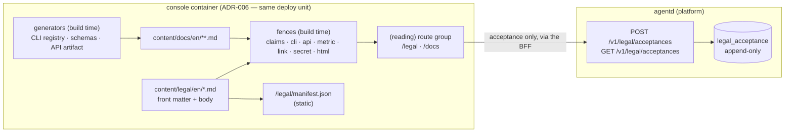

# PRD — P23: Legal Surface & Developer Documentation

| Field | Value |
|---|---|
| Phase / Milestone | P23 / M17 |
| Target window | ~Weeks 2–4 after P21/P22 land (content authoring runs in parallel from week 1) |
| Lead role(s) | Product Designer + Frontend + Sales Operations |
| Supporting role(s) | Backend, System Designer, DevOps, QA, AI Engineer |
| Status | Draft |
| OpenSpec change | `p23-legal-and-docs` |

## 1. Summary

P23 gives the customer console the two surfaces it has never had: a **legal surface** — a Terms of
Service and a Privacy Notice, published as versioned artifacts with a recorded, auditable acceptance —
and a **developer documentation surface** that takes a developer from *"what is this"* to a first real
result and then answers reference questions without them reading Go source.

Both are **published-word** surfaces: pages that are *read* rather than computed, whose characteristic
failure is not a crash but **drift** — the written sentence and the running system quietly diverging,
and nobody finding out until a customer, an auditor, or a regulator does. So the phase delivers content
*and* the machinery that keeps it honest: content-as-code in the console's own deploy unit, a
build-time fence set that fails the build on a doc describing an unshipped capability / a `heros`
command that does not exist / an endpoint absent from the API artifact / a broken anchor / a real
credential pasted into an example, and a consent record that points at an immutable **content hash**
rather than at a URL whose text may have changed since.

## 2. Problem & context

**Nothing legal exists.** A repository-wide search for "terms of service", "privacy notice" or "privacy
policy" across `.tsx`, `.ts`, `.md` and `.go` returns **zero hits**. The public surface
(`web/console/src/app/(public)/`) has a footer with a wordmark and one boundary statement; the sign-in
page has no legal line; `/app/account` shows plan and spend with nothing about the agreement that
governs them. Meanwhile [P21](P21-stripe-payments.md) is about to put a **Stripe Checkout** in front of
customers and [P22](P22-sso-identity.md) is about to let an enterprise IdP create tenants. Both are
moments where a commitment is made, and today there is no document being agreed to, no record that
anyone agreed, and no way to answer *"what exactly did this customer accept, and when?"* — which is the
first question asked in a billing dispute, a security review, and a data-protection audit.

**Documentation exists only as engineering artifacts.** The repository is unusually well-documented
*inward*: a 279-line README, 27 phase PRDs, 9 ADRs, a decisions log, `docs/release/cli-verification.md`.
None of it is written for the person the product is sold to. A developer who installs the CLI
([P20](P20-installable-packages.md)) or opens the console ([P9](P9-web-console.md)) has no quickstart, no
task-shaped guide, no CLI reference, no HTTP reference, no schema reference and no glossary — the
product's own vocabulary (Variant Spec, `config_hash`, Dimension, verified delta, refusal-as-BuildStatus)
appears in the UI with nowhere to look it up. The current answer to *"how do I use this"* is *read
`internal/`*, which is not an answer for a customer, and is the reason the free CLI's install-to-first-
success path can be perfect and still lose the user at minute six.

**Why the two ship together.** They are the same engineering problem wearing different clothes. Both are
long-form text served from the console, read by people with no session, that must stay true as the
system changes and must keep serving when the platform does not. Both need the same three things: a
content pipeline in the deploy unit, a reading composition that neither existing composition provides,
and a fence that makes drift fail a build instead of a customer conversation. Shipping them separately
means building that machinery twice and — the likelier outcome — building it once, well, for whichever
ships first, and never for the other.

**Upstream state assumed.** P9's console shell, its public/`(public)` composition and its build-time
scan scripts (`scan-claims`, `scan-strings`, `scan-markup`, `scan-tokens`, `scan-bundle`) exist and pass.
The `CAPABILITIES` manifest in `web/console/src/content/capabilities.ts` exists and already gates public
claims. ADR-006 (console ships as its own container in the platform's deployment unit), ADR-007 (console
type generation) and ADR-008 (the tenant identity seam) hold. P11's CLI and P20's install channels are
the subject of the quickstart. P7's entitlements and P21's Stripe objects are what the commercial terms
must match.

## 3. Goals & non-goals

### Goals

1. **Publish a Terms of Service and a Privacy Notice** that are readable with no session, permanently
   addressable per version, printable, and honest — the Privacy Notice describes the stores that
   actually exist and asserts only rights the platform has a route to honor.
2. **Record acceptance against an immutable document identity** — `(kind, version, content_hash)` — so
   *"what did they agree to"* is answerable years later by resolving a hash to an archived text.
3. **Gate new commitments, not reading.** Re-acceptance is required at the moments a commitment is made
   (first sign-in, checkout, plan change), is triggered only by a **declared material** change, and
   never walls off a console the customer is already working in.
4. **Ship a three-tier developer documentation surface** — quickstart, guides, generated reference — that
   gets a developer to a first real result without reading source, and answers reference questions from
   artifacts the code already produces.
5. **Make drift fail the build.** Extend the claim fence to documentation and add fences for CLI
   commands, API paths, metric definitions, links/anchors and leaked credentials.
6. **Serve both surfaces with zero platform calls and zero third-party requests**, so they work during a
   platform incident and inside an air-gapped P19 deployment.

### Non-goals (explicitly deferred, with the phase that owns them)

- **Self-serve data export / erasure buttons.** The Privacy Notice names a *request route* and an
  operator runbook (P8), not a button. A self-serve DSAR flow is deferred to a later phase and the
  notice must not imply otherwise.
- **A Data Processing Agreement, sub-processor portal, SOC 2 / ISO reports, or a trust center.** P23
  ships the two documents a product cannot sell without; the enterprise compliance package is its own
  work with its own owner.
- **Legal review and jurisdictional tailoring.** P23 owns the *engineering* of the legal surface —
  structure, versioning, acceptance, availability, honesty fences. The text is authored with counsel;
  this document does not substitute for counsel and does not fix a governing law.
- **Localization.** Content is English-only at P23. The content path is locale-segmented from day one
  and every legal document declares its authoritative language, so adding a locale later is additive.
- **A marketing blog, changelog, or status page.** Different surfaces, different cadence, different
  owner.
- **Hosted third-party search, analytics or a headless CMS.** Ruled out in §8, Decision 1.
- **Cookie consent UI.** The console sets one session cookie that is strictly necessary; if that ever
  changes, the banner arrives with the change, not before it.

## 4. Users & personas

| Persona | What they come for | What failure looks like today |
|---|---|---|
| **Evaluating developer** (no account) | *Is this real, and can I try it in ten minutes?* | Reads a marketing poster, finds no docs, closes the tab. |
| **Integrating developer** (has the CLI or a console session) | *What is the exact flag / field / endpoint?* | Reads `internal/cli/*.go` or guesses; files a support ticket. |
| **Buyer / procurement** | *What am I agreeing to, and what happens to our code?* | Asks in email; gets a per-deal answer nobody can reproduce. |
| **Security reviewer / DPO** | *What data is stored, where, for how long, and who processes it?* | Nothing to read; the review stalls at the first questionnaire. |
| **Support & sales engineer** | *A link that answers this exactly, that I did not write myself.* | Answers from memory; two engineers give two answers. |
| **Operator (internal)** | *Which document version is live on this deployment?* | Unanswerable — no version is stamped anywhere. |
| **The auditor, later** | *Show me that this tenant accepted v2 on this date.* | No record exists. |

## 5. User stories / jobs-to-be-done

**Evaluating developer**
- As an evaluating developer, I want a quickstart that reaches a real result on my own repository in
  minutes, so that I can judge the product on its output instead of its copy.
- As an evaluating developer, I want every page to say what the capability does **not** do, so that I
  discover the boundary before I build on it rather than after.

**Integrating developer**
- As an integrating developer, I want CLI and API reference generated from the shipped artifacts, so
  that what I read is what the binary and the service actually accept.
- As an integrating developer, I want an error message or an empty state to deep-link me to the exact
  section that explains it, so that I do not search for the sentence I need.
- As an integrating developer, I want a glossary for the product's own nouns, so that "Variant Spec",
  "Dimension" and "verified delta" stop being folklore.

**Buyer / procurement / DPO**
- As a buyer, I want to read the Terms before I create an account, so that legal review starts before
  the trial rather than after the invoice.
- As a DPO, I want the Privacy Notice to name the actual stores, categories, retention and processors,
  so that I can complete a review without a call.
- As a buyer, I want a permanent link to the exact version in force on the day we signed, so that our
  contract file is not a screenshot.
- As a security reviewer, I want to print the Terms with the version and content hash on the page, so
  that the file we archive is self-identifying.

**Customer administrator**
- As an administrator, I want to see which documents my organization accepted, when, and by which
  principal, so that I can answer my own audit without contacting support.
- As an administrator, I want a material change to reach me before it takes effect and to be
  acknowledged at a moment of my choosing, so that a legal update never blocks a running evaluation.

**Operator / support**
- As an operator, I want the live document versions readable from the deployment, so that I can tell a
  customer which text their instance is serving.
- As a support engineer, I want documentation to be the place the answer lives, so that a fix is a pull
  request rather than a habit.

## 6. Functional requirements

### Legal documents

- **FR1** — A **Terms of Service** is published at a stable public route, readable **without a session**
  and **without any call to the platform**.
- **FR2** — A **Privacy Notice** is published on the same terms, and its substance is derived from a
  **data inventory** that names the actual stores, data categories, retention windows, processors and
  transfer basis. Every store named is checkable against the repository or explicitly marked external.
- **FR3** — Every legal document declares, in machine-readable front matter: `kind`, `version`,
  `effective_date`, `authoritative_language`, `supersedes`, and `material` (whether the change requires
  re-acceptance). A document missing any field **fails the build**.
- **FR4** — A document's identity is `(kind, version, content_hash)`, where the hash is computed at build
  time over the normalized source. The hash is displayed on the page and in the print rendering.
- **FR5** — **Every superseded version stays permanently addressable** at its own route. A version
  history page lists all versions with effective dates and links to each.
- **FR6** — The console serves a **static legal manifest** (`/legal/manifest.json`) listing current and
  historical documents with kind, version, effective date, hash and route — resolvable with no session.
- **FR7** — Legal documents print correctly: paginated, no chrome, with kind, version, effective date
  and content hash in the running footer.
- **FR8** — Legal documents are reachable from the public footer, the sign-in page, the console shell,
  the account surface and the checkout flow — every place a commitment is made or reviewed.
- **FR9** — The Privacy Notice asserts **only rights the platform has an implemented route to honor**,
  names that route, and states the response commitment operators have actually agreed to.

### Consent records

- **FR10** — Acceptance is recorded server-side as an **append-only** record of `(tenant_id, principal,
  document_kind, document_version, content_hash, accepted_at, method)`. Records are never updated in
  place; a withdrawal or a re-acceptance is a new row.
- **FR11** — Acceptance is **idempotent**: re-submitting the same `(tenant, principal, kind, version)`
  creates no second record and returns success.
- **FR12** — Publishing a version marked **material** requires re-acceptance from every principal whose
  latest acceptance is for an earlier version. A version **not** marked material requires nothing.
- **FR13** — The acceptance gate blocks **new commitments only** — first sign-in for a principal with no
  acceptance, checkout, and plan change. It **never** blocks reading the console, an in-flight run, or a
  document itself. Existing sessions receive a non-blocking notice naming the effective date.
- **FR14** — If the acceptance record **cannot be written**, the commitment does not proceed and the UI
  does **not** display the acceptance as recorded. There is no optimistic acknowledgement of consent.
- **FR15** — A tenant can read its **own acceptance history** in the console — document, version, date,
  principal — with each entry linking to the exact archived text that was accepted.
- **FR16** — Consent records are retained for a configured statutory period, are **not** deleted by
  tenant deletion, and survive identity erasure in **pseudonymized** form (the record keeps document
  version, hash and timestamp; the subject is tombstoned).

### Developer documentation

- **FR17** — Documentation ships in **three tiers**: **Quickstart** (install → first real result),
  **Guides** (task-shaped, one job each) and **Reference** (CLI, HTTP API, schemas, metrics, glossary).
- **FR18** — The quickstart reaches a **first real result** — a discovery graph on the reader's own
  repository — **without editing a configuration file**, consistent with the P20 first-run contract.
- **FR19** — **Reference tiers are generated** from shipped artifacts: the CLI command registry, the JSON
  schemas under `schemas/`, and a machine-readable HTTP API artifact. Hand-written reference for anything
  a generator can produce is rejected at review, and a reference tier whose artifact does not exist is
  **marked absent rather than hand-written**.
- **FR20** — Every code sample is either **executable as written** or explicitly marked a fragment, and
  carries placeholder credentials only.
- **FR21** — Documentation is reachable from the console shell **and** the public surface, and every page
  is reachable by navigation — no orphan pages.
- **FR22** — **Anchors are a contract.** Every heading has a stable slug, published in a slug manifest;
  removing or renaming a slug fails the build unless a redirect is added in the same change.
- **FR23** — Search is **static and in-console**: an index built at build time, served by the console,
  with **no third-party service**. With JavaScript disabled the surface degrades to a browsable table of
  contents, not a blank page.
- **FR24** — Documentation renders fully in an **air-gapped** deployment: no external font, script,
  image, stylesheet or analytics request.
- **FR25** — Every page states the **platform version** it documents and the **boundary** — what the
  described capability deliberately does not do.

### Accuracy fences (build-time)

- **FR26** — **Claim fence, extended to docs**: a documentation page may not describe a capability that
  is not `shipped: true` with a named owning phase in `CAPABILITIES`.
- **FR27** — **CLI fence**: every `heros …` invocation appearing in content resolves to a real subcommand
  and real flags in the CLI registry.
- **FR28** — **API fence**: every documented endpoint, method and field resolves against the
  machine-readable API artifact.
- **FR29** — **Metric fence**: every metric or statistic defined in documentation matches the harness's
  definition — same name, same unit, same computation — and cites where it is computed.
- **FR30** — **Link fence**: every internal link and anchor resolves; external links are allow-listed and
  visibly marked as external.
- **FR31** — **Secret fence**: content matching a credential pattern (provider key prefixes, PEM blocks,
  bearer tokens) fails the build.
- **FR32** — **Content fence**: content is Markdown with **no raw HTML** and no script; a raw HTML block,
  an inline event handler or an external script reference fails the build.

### The reading surface

- **FR33** — Legal and documentation render in a **third composition** — public (no session, no fetch),
  **theme-following**, typographic — distinct from the dark-fixed marketing poster and from the console
  shell.
- **FR34** — The reading surface **scrolls as a document** (an explicit, stated exemption from the
  console's viewport-first rule), holds a bounded measure, and offers a table of contents as a `nav`
  landmark whose current section is marked by a **word**, not by colour alone.

## 7. Non-functional requirements

| # | Requirement | Target / how it is checked |
|---|---|---|
| **NFR1** | **Availability independent of the platform** | Every legal and docs route returns 200 with the platform stub stopped; the test harness asserts **zero upstream requests** (the same counter `routes.test.mjs` already uses). |
| **NFR2** | **No third-party requests** | Zero requests to any origin other than the console's own in a rendered page; asserted in the build scan, not by inspection. |
| **NFR3** | **Server render latency** | No slower than the existing public surface on the same hardware; docs and legal pages are statically rendered, so p95 is dominated by transfer, and the regression check is against the existing public-surface baseline. |
| **NFR4** | **Client weight** | The reading surface ships **no client JavaScript beyond the TOC and search islands**; `scan-bundle.mjs` budget unchanged, i.e. the docs route group adds no new dependency to the console bundle. |
| **NFR5** | **Accessibility** | WCAG 2.2 AA in **both** themes: hierarchical headings, skip link, TOC landmark, keyboard-scrollable code blocks, contrast verified by the existing design-system test. |
| **NFR6** | **Print fidelity** | A legal document prints paginated with a self-identifying footer (kind, version, effective date, hash) — verified on the rendered print stylesheet, not assumed. |
| **NFR7** | **Consent durability** | An acceptance record is resolvable to an exact text **for the full retention period**; removing an archived version is a schema-level one-way door and is prevented by a fence, not by convention. |
| **NFR8** | **Consent write integrity** | Acceptance is **persist-then-acknowledge**; a failed write never renders as success (FR14). Idempotency is enforced by a uniqueness constraint in the schema, not by application code alone. |
| **NFR9** | **Data minimization in the record** | The consent record holds no email, no name and no free text; the subject is an opaque principal identifier, so pseudonymization on erasure is a tombstone rather than a rewrite. |
| **NFR10** | **Air-gapped parity** | The docs and legal surfaces are byte-identical in the P19 air-gapped package and the hosted deploy — same container, same content, no egress. |
| **NFR11** | **Version observability** | The live document versions and content hashes are readable from the deployment (the legal manifest, and the console's existing health/version surface), so an operator can answer "which text is live" without a database query. |
| **NFR12** | **Fence honesty** | Each fence states in its own header what it does **not** check. A fence that implies broader coverage than it has is worse than no fence, because it stops the human review that would have caught the rest. |
| **NFR13** | **Content authoring cost** | A copy fix is a Markdown edit and a console deploy — no code change, no JSX, no rebuild of the platform service. The deploy cost is accepted and named in §8, Decision 1. |

## 8. System design summary

### 8.1 Shape



The load-bearing property: **the arrow from the reading surface to the platform carries acceptance and
nothing else.** Reading a document, printing it, resolving a hash and browsing documentation involve no
platform call at all — which is what makes NFR1 and NFR10 true rather than aspirational.

### 8.2 Decisions

**Decision 1 — Content is code in the console image. No CMS, no runtime fetch, no external docs host.**
Alternatives considered: a headless CMS, platform-served content through the BFF, and an external docs
host on its own domain. Ruled out by the priority law: **第1级 安全** — a CMS or external host is a third
party with write access to the highest-trust page the product has, and an injection surface on the page
where a customer reads what they are agreeing to; **第2级 稳定** — the legal surface must serve during a
platform incident, and an air-gapped P19 deployment has no egress at all; **第4级 运维** — a second system
to operate, back up and patch; **第5级 演进** — git history *is* the legal change history an auditor asks
for, with authorship and review attached. The cost is real and named: **a copy change requires a console
deploy** (NFR13). It is priced against a deploy path P19 already makes routine and against content whose
cadence is slow by nature.

**Decision 2 — A legal document's identity is `(kind, version, content_hash)`; consent points at that,
never at a URL.** "The customer agreed to the Terms" is meaningless if "the Terms" is a URL whose text
has since changed. The hash is computed at build over normalized source, published on the page, in the
print footer and in the manifest. Every superseded version remains served forever: deleting one orphans
every consent record referencing it, which is a **one-way door**, so it is prevented by a fence rather
than by care.

**Decision 3 — Materiality is a declared field, not a diff heuristic.** A typo fix must not push a
consent interstitial at every customer (**第3级 UX**); a rights-changing amendment must not slip through
silently (**第1级/合规**). No machine can judge materiality, so a human declares it in front matter and
the build **fails if a new version omits the declaration**. The fence does not decide; it forces the
decision to exist and to be attributable.

**Decision 4 — The gate blocks commitments; it never walls the console.** Re-acceptance is demanded at
first sign-in for a principal with no acceptance, at checkout and at plan change. An existing session
gets a persistent, dismissible notice with the effective date. The failure this avoids is specific and
self-inflicted: a consent modal keyed to a deploy can block **every customer at once**, and it will do so
on the day of a release — turning a legal update into an outage (**第2级**), on top of interrupting work
the customer is in the middle of (**第3级**).

**Decision 5 — The Privacy Notice is generated against a data inventory, and asserts only executable
rights.** The inventory names actual stores — eval results and registries (Postgres), telemetry and spans
(P2.5), delivery records (P12), session state (P9), billing objects (P7/P21) — each checkable against
`db/migrations/postgres/` or explicitly marked external. Rights are asserted **only where a route
exists**; at P23 the route is a documented request address plus an operator runbook (P8), and the notice
says so plainly instead of implying a self-serve button. This is the sales-operations rule — *only
promise what has been delivered* — applied to the document where over-promising is a legal liability
rather than a support ticket.

**Decision 6 — Reference is generated; where the artifact does not exist, the page is marked absent.**
Honest status at authoring time: **CLI reference — EXISTS** (the command registry in `internal/cli`);
**schema reference — EXISTS** (`schemas/workflow-ir.schema.json`, `metric-event.schema.json`,
`runtime-invocation.schema.json`, `console-view.schema.json`); **HTTP API reference — ABSENT**, because
the repository contains **no OpenAPI document** (verified: no `*openapi*` file exists). So this phase
either emits that artifact from the existing route table or the API reference tier is **rendered as
absent with the reason**. What it does *not* do is hand-write an endpoint list, which would be a copy of
the truth that starts drifting the day it is written.

**Decision 7 — A third composition: the reading surface.** The console follows the reader's theme
because it is sat in front of for an hour; the public surface is dark-fixed because it is a poster seen
once. A 9,000-word Terms of Service and a reference page are neither: they are read long, printed,
searched with the browser's own find, and deep-linked. So they get their own composition — public,
theme-following, bounded measure, document scroll. **This is the one place the viewport-first rule
(NFR17) does not apply**, and the exemption is stated here so it reads as a decision rather than as a
page somebody forgot to bound: a long legal text inside a bounded inner scroll region is hostile to read
and prints as one page of clipped text.

**Decision 8 — Anchors are a published contract.** CLI errors, console empty states and API error bodies
will deep-link into documentation. A renamed heading therefore breaks a link that ships inside a binary
the customer already installed. Slugs go in a manifest; a removal or rename fails the build unless the
same change adds a redirect — the same discipline the console already applies to its legacy routes,
which resolve by permanent redirect rather than by 404.

**Decision 9 — Search is a build-time static index.** No hosted search service, for the reasons in
Decision 1. The disclosed limit: the first cut ranks over titles, headings and lead paragraphs rather
than doing full-text ranking, and the index grows with the corpus — stated in the fence header and in
§14 rather than discovered later.

### 8.3 Data model

One new table, on the next free migration number (`0016` at time of writing — P21 and P22 are docs-only
and have claimed none):

```
legal_acceptance
  id                 uuid       pk
  tenant_id          text       not null
  principal_id       text       not null   -- opaque; never an email (NFR9)
  document_kind      text       not null   -- 'terms' | 'privacy'
  document_version   text       not null
  content_hash       text       not null   -- resolves to an archived text forever
  accepted_at        timestamptz not null
  method             text       not null   -- 'signin' | 'checkout' | 'plan_change' | 'api'
  superseded_by      uuid       null       -- set when a MATERIAL later version is published
  unique (tenant_id, principal_id, document_kind, document_version)   -- FR11 in the schema
```

Append-only by construction; the unique constraint makes idempotency a schema property rather than an
application habit (NFR8). `content_hash` is stored **as accepted**, so a later republication that changes
the text under the same version number is detectable rather than invisible.

### 8.4 Interfaces

| Interface | Owner | Shape |
|---|---|---|
| `GET /legal/terms`, `/legal/privacy`, `/legal/{kind}/v/{version}`, `/legal/history` | console | Static render, no session, no fetch |
| `GET /legal/manifest.json` | console | Static: kinds → versions → `{effective_date, hash, route, material}` |
| `GET /docs`, `/docs/**` | console | Static render; `/docs/search-index.json` build-time artifact |
| `POST /v1/legal/acceptances` | platform | `{document_kind, document_version, content_hash}` → 201 / 200 on repeat; **persist-then-ack** |
| `GET /v1/legal/acceptances` | platform | The calling tenant's own history, plus `pending[]` — the kinds needing acceptance |

The console's BFF is the only caller of the platform endpoints, preserving the P9 credential boundary
(ADR-006 Decision 1); the browser never holds a platform credential.

## 9. Design by role lens

### 9.1 Senior Product Designer — *anchor to the outcome, match effort to certainty*

The outcome is not "we have a docs site" and not "we have terms." It is: **a stranger reaches a real
result, and a buyer's lawyer reaches a decision, without talking to us.** Both are measurable (§13) and
both are lost in the unhappy path, which is where the effort goes.

*Naming.* Three nouns, fixed, and used identically in navigation, footers, page titles and support
replies: **Terms of Service**, **Privacy Notice** (a *notice*, because it describes what happens — a
"policy" implies an internal rule the reader cannot check), **Documentation**. No "Legal Center", no
"Docs Hub", no "Resources" — a category name that contains three unrelated things is where features go
to be un-findable.

*The unhappy paths, designed rather than defaulted:*

- **A material update lands while a customer is mid-run.** They get a banner naming the document and the
  effective date, with "Read it" and "Accept" — and the console keeps working. The wall arrives only at
  the next commitment (Decision 4).
- **The acceptance write fails.** The button returns to its resting state with a plain sentence — *the
  acceptance was not recorded; nothing has been agreed* — and a retry. It never shows a checkmark it
  cannot back with a row (FR14).
- **A reader lands on a superseded version** (from an old email or a contract file). The page says so at
  the top, states which version is current, and links to it — without redirecting, because the whole
  point of the archived route is that it still shows the old text.
- **A docs page the reader wants does not exist yet.** The 404 offers the section index and the search
  box, not a joke.
- **Search returns nothing.** It says what it searched (titles, headings, lead paragraphs — Decision 9)
  so the reader knows to try the browser's find, instead of concluding the answer does not exist.

*Progressive disclosure.* The quickstart is one page with one path and no options. Choices — other
languages, other providers, CI wiring, the hosted console — appear in Guides, after the reader has had a
result. A quickstart that opens with a five-way decision is a quickstart the evaluating developer does
not finish.

### 9.2 Senior System Designer — *numbers before boxes*

*Scale, so the storage choice is arithmetic rather than taste.* Consent records are bounded by
**principals × material versions**: a thousand tenants at ten principals each, with two documents changing
materially twice a year, is ~40k rows a year — kilobytes. This is emphatically **not** a new store; it is
a table beside the existing Postgres schema. Documentation and legal content are bounded by the corpus
(a few hundred kilobytes of Markdown, a search index in the low hundreds of kilobytes) and are **static
assets in an image**, so they cost nothing at request time and nothing to back up.

*The contract that outlives the code* is `(kind, version, content_hash)` (Decision 2). Everything else in
this phase is replaceable: the renderer, the search implementation, the composition, the generators. That
triple is not — it is referenced by rows that must remain resolvable for the retention period, so it is
designed once, additively, and fenced.

*State the trade-off explicitly.* Content-in-image trades **authoring latency** (a deploy per copy fix)
for **availability, integrity and auditability**. That is the priority law's ordering — 第1级 and 第2级
over 第4级 and 第8级 — and it is recorded as an ADR (ADR-010) rather than left in a PRD, because the next
person who wants a CMS deserves the reasoning and not a re-litigation.

*The seam to P22.* Acceptance binds to the **principal** the ADR-008 seam yields, not to an email or an
IdP subject. When P22 makes the seam real, this table needs no migration — which is the test of whether
the seam was respected.

### 9.3 Senior Backend Dev — *contracts outlive code; model invariants into the schema*

Two endpoints, both small, both hostile-input-shaped.

- **Idempotency is a constraint, not a code path.** `unique (tenant_id, principal_id, document_kind,
  document_version)` — a double-submitted form, a retried request and a browser back-button all collapse
  to one row. Application-level "check then insert" is a race with a customer's double-click.
- **Persist-then-acknowledge.** The 201 is written after the commit, never before. The mirror of the P21
  webhook rule, for the same reason: an acknowledged consent with no row is indistinguishable from
  consent that never happened, and it is the direction of the error that matters.
- **Server-side hash validation.** The submitted `content_hash` is checked against the manifest the server
  knows; a client that submits a hash for a version it was not shown is rejected. Without this, the
  record says whatever the browser said, and the audit value is zero.
- **Never log the record's subject with the document body**, and never log free text — there is none to
  log (NFR9). The record is deliberately boring.
- **Migration is expand-only** and reversible: a new table, no alteration of existing ones, a `.down.sql`
  that drops only what it created.
- **Retention is a configured window, enforced by a job that can be run dry.** A deletion job whose first
  run in production is also its first run ever is a defect waiting for a quiet weekend.

### 9.4 Senior Frontend Dev — *match the codebase, smallest correct change, a11y & perf are requirements*

The reading surface is a **new route group beside the two that exist**, not a flag on either. The
`(public)` layout's own header comment already argues this case for itself — a shared shell that renders
tenant parts "when there is a session" is how a public page acquires a session call. The same reasoning
applies again here, so the codebase's existing decision is followed rather than re-argued.

- **Composition.** Theme-following (the console's tokens, not `--marketing-*`), one bounded measure,
  document scroll, TOC as a `nav` landmark. Current section marked with `aria-current` **and** a word —
  the console's existing rule that no status is carried by colour alone applies to a table of contents
  too.
- **Islands only.** TOC scroll-spy and search are the only client components; everything else is server-
  rendered Markdown. With JavaScript off, the TOC is still a list of links and the docs are still
  readable (FR23), which is also what makes NFR4 hold.
- **Multi-language code samples use the existing `<Tabs>` component** rather than a new one — the console
  already has one, and a second tab implementation is a second set of keyboard-navigation bugs.
- **Deep links are the primary entry.** Every heading is a link target and shows its anchor on hover/focus;
  the slug manifest (Decision 8) is generated from the same pass that renders them, so the manifest cannot
  drift from the page.
- **Print is a stylesheet, tested.** `@media print` drops chrome, expands the measure, and puts the
  document identity in the running footer (FR7).
- The existing scans (`scan-tokens`, `scan-strings`, `scan-markup`, `scan-bundle`) apply unchanged to the
  new routes; the new fences are additions in the same idiom, run from the same `npm run build`.

### 9.5 Senior AI Engineer — *evals before optimization; diagnosis proposes, verification decides*

This phase writes no model code, and the AI lens is not decoration here: **documentation is where a
statistic gets softened.** Three rules:

1. **A metric defined in docs must match the harness's definition** — name, unit, computation — and cite
   where it is computed (FR29). The failure mode is a doc that says "confidence" for something the
   harness computes as an agreement rate, after which every customer conversation is about a number that
   does not exist.
2. **Refusals are documented as first-class outcomes.** The platform's honest refusals — an unclassified
   graph region, a `BuildStatus` refusal, an axis marked ABSENT — are documented as *what the product
   does*, not as errors or as omissions. A developer who first meets a refusal in production reads it as
   a bug; one who met it in the quickstart reads it as the design.
3. **No model-generated example output may be presented as a real run.** Sample outputs in docs are
   either captured from an actual run (and labelled with the version that produced them) or clearly
   marked illustrative. This is the same discipline as the eval harness's baseline rule, applied to prose:
   an unlabelled plausible example is a fabricated result with a screenshot's authority.

Where documentation copy is drafted with model assistance, it passes the same fences as any other
content — the fences do not care who typed it, which is the point of having them.

### 9.6 Senior DevOps Engineer — *blast radius, reversible, observable, least-privilege*

- **Blast radius.** Content ships in the console container (ADR-006), so a bad copy change is reverted by
  redeploying the previous console image — no data migration, no platform restart. The legal surface
  cannot take the platform down, and the platform cannot take the legal surface down (NFR1).
- **Observable.** The live document versions and hashes are readable from the running deployment via the
  static manifest and the console's version surface (NFR11), so "which text is live on this cluster" is a
  `curl`, not an investigation.
- **Least privilege.** The consent endpoints are the only new authenticated surface; they accept exactly
  three fields, write one row, and read only the caller's own tenant. There is no cross-tenant read on
  this path at all — operator-side access to consent records belongs to the P8 console, behind its
  existing RBAC and append-only audit.
- **Air-gapped parity (NFR10).** No CDN, no external font, no analytics — verified by a fence rather than
  by a policy, because "we agreed not to add a CDN font" survives exactly one hurried pull request.
- **Reversibility of content.** Because every published version stays served (FR5), a rollback of a legal
  document is *publishing a new version*, never deleting one — the archived route is the thing consent
  records depend on.

### 9.7 Senior QA Engineer — *green tests are the goal only if green is credible*

The acceptance gate for this phase is designed to **be able to fail**, which for documentation is the
hard part — a docs test suite that only checks that pages return 200 is a suite that will be green
forever while every sentence rots.

| Layer | What it proves | The assertion that can actually go red |
|---|---|---|
| **Build fences** | Content does not describe a system that does not exist | A test fixture with a fake `heros frobnicate` command, an unshipped claim, a dead anchor, and a fake API key — each must fail the build **individually**. A fence with no failing fixture is not tested. |
| **Availability** | NFR1 | Stop the platform stub; every legal and docs route still 200s and the upstream request counter does not move. |
| **Legal identity** | FR4/FR5 | Change a document's body without bumping the version → build fails. Delete an archived version → build fails. |
| **Consent behavior** | FR11/FR12/FR13/FR14 | Double-submit → one row. Publish a **material** version → an existing user is asked again. Publish a **non-material** version → they are not. Make the write fail → the UI shows no acceptance and the commitment does not proceed. |
| **A11y & print** | NFR5/NFR6 | Contrast and heading order in both themes via the existing design-system test; the print stylesheet asserted to emit the document identity. |
| **Reachability** | FR21 | Extend the existing link-coverage test: every docs page reachable by navigation, every anchor referenced from CLI/console output resolves. |

The negative assertions are the valuable ones, and they mirror what the console's test suite already
does well: `routes.test.mjs` proves a selection surface makes **no** upstream call. The docs and legal
suites prove the same shape of nothing.

### 9.8 Senior Sales Operations — *only promise what has shipped; state the boundary out loud*

- **The Terms must match what P7 and P21 actually do.** Plans, metering basis (LLM spend under
  management), the gainshare/verified-savings basis, cancellation and refund behavior, and any SLA
  language are checked line-by-line against the entitlement schema and the Stripe objects. A refund term
  that Stripe's configuration cannot execute is a promise that will be broken by software.
- **The claim fence follows the reader into the docs (FR26).** The rule that produced
  `capabilities.ts` — a marketing page is the file nobody re-reads — is *more* true of documentation,
  which is longer, older and read by people making commitments.
- **Boundaries are on the page, not in the objection-handling script.** Every documented capability
  carries its boundary (FR25), reusing the `boundary` field the manifest already requires. The
  consistently valuable ones here: *your code stays yours, you bring your own provider keys, the platform
  never resells tokens, a change is a reviewable pull request, and a human reviews at every automation
  level.* These are differentiators, and stating them where a technical buyer reads them is worth more
  than stating them in a deck.
- **One answer, one place.** Support and sales answer from the published page and fix the page when it is
  wrong. A frequently-asked question whose answer is "let me check with engineering" is a documentation
  defect with a ticket number.
- **No SLA, no certification, no sub-processor list is claimed** until it exists. The compliance package
  is a non-goal (§3), and saying so early is cheaper than retracting it during a security review.

## 10. Dependencies

**Upstream (must exist):**
- **P9 — Web Console**: the shell, the `(public)` composition, the BFF credential boundary, the build
  scan idiom, `CAPABILITIES`, and the stub-platform test harness.
- **P11 / P20 — CLI & install**: the subject of the quickstart, and the command registry the CLI fence
  reads.
- **P7 — Billing & entitlements**: the plan/metering facts the Terms must match.
- **ADR-006 / ADR-007 / ADR-008**: deploy packaging, type generation, and the principal the consent
  record binds to.

**Soft dependencies (integrate when they land; P23 does not block on them):**
- **P21 — Stripe Payments**: checkout is one of the commitment moments the gate covers. Until P21 ships,
  the gate covers first sign-in and plan change.
- **P22 — SSO & Identity**: makes the principal real. The record's shape is designed so P22 requires no
  migration here.

**This phase unblocks:** self-serve signup that is legally complete; enterprise security review without a
bespoke questionnaire round-trip; deep-linkable error messages in the CLI and console; a support model
where the answer lives in one place; and the compliance package (DPA, sub-processors, trust center),
which needs a data inventory to exist first — and P23 produces one.

## 11. Risks & mitigations

| # | Risk | Owner | Mitigation |
|---|---|---|---|
| R1 | **Legal text written without counsel, or counsel's text contradicting the system** | Sales Ops | Engineering owns structure, versioning, availability and the honesty fences; counsel owns the words. The data inventory (Decision 5) is produced by engineering *first* and is counsel's input, so the notice describes the real system. |
| R2 | **Content-in-image friction pushes someone to add a CMS later** | System Designer | ADR-010 records the reasoning and the accepted cost, so the next proposal starts from the trade-off rather than from "why is this so annoying". |
| R3 | **A material change is mis-declared as non-material** (or the reverse) | Sales Ops + Product | The field is mandatory (build fails without it), is set in a reviewed pull request, and its value is visible in the manifest and version history — so the declaration is attributable and checkable after the fact. |
| R4 | **The re-acceptance gate blocks users during an incident or a release** | Product + Frontend | Decision 4: commitments only, never reading, never in-flight work. Tested explicitly (§9.7). |
| R5 | **Docs drift as the platform changes** | QA | The fences are the mitigation, and their coverage limits are stated (NFR12). What no fence catches — tone, emphasis, omission — stays a named review responsibility rather than being implied as covered. |
| R6 | **The API reference is hand-written because the artifact does not exist** | Backend | Decision 6 forbids it: either emit the artifact or render the tier as absent with the reason. An absent tier is honest; a hand-written one is a fiction with a table of contents. |
| R7 | **A real credential lands in an example** | QA / DevOps | The secret fence (FR31) fails the build, with a failing fixture proving the fence works. |
| R8 | **An archived legal version is deleted during a repo cleanup**, orphaning consent records | Backend | A fence asserts that every version referenced by the manifest — and every hash format the records can hold — still resolves; deletion fails the build (NFR7). |
| R9 | **Documentation scope expands into a full docs platform** and the phase never lands | Product | Three tiers, fixed (FR17). Versioned docs per release, localization, interactive API playgrounds and a changelog are out of scope by name (§3). |
| R10 | **Consent records complicate erasure requests** | System Designer | NFR9 + FR16: the record holds no personal data beyond an opaque principal id, so erasure tombstones the subject and the evidentiary record survives — decided now rather than during the first request. |

## 12. Rollout & test strategy

**Sequencing.** (1) The reading surface and the fences, with placeholder content — machinery before
prose, so the content lands into something that checks it. (2) Documentation tiers 1–2 plus the generated
CLI and schema reference. (3) Legal documents v1 and the manifest, published **read-only** — visible and
linkable, with **no gate**. (4) The consent record backend, exercised by the API and by the account-page
history view. (5) The gate, enabled last and at first only for **new** principals. Every step is
independently shippable and independently revertible; a fault at step 5 never makes the documents
unreadable.

**Enabling the gate** is deliberately the last, smallest, most reversible step, because it is the only
one that can stop a customer doing something. It ships behind a flag, is enabled for new sign-ins first,
and only then for the re-acceptance path.

**Proving correctness.** The full negative-assertion matrix in §9.7, run in CI as part of the console's
existing `npm run build` + `npm test`, plus the Go tests for the consent endpoints (including a
`pgproof`-style test against a real Postgres for the uniqueness constraint — an idempotency guarantee
asserted only against an in-memory fake is not asserted). Each fence ships with a **failing fixture**;
a fence with no proof that it can go red is not counted as delivered.

**The end-to-end acceptance is human.** In the spirit of the process's "the terminus is the user's eyes":
one reviewer, on a clean machine, follows the published quickstart start to finish without reading source
or asking a question, and one reviewer reads the Terms and the Privacy Notice as a buyer would, printing
both. Both walks are recorded as evidence. A green suite over documentation nobody has read end-to-end is
the exact failure this phase exists to prevent.

## 13. Success metrics & acceptance criteria

**Acceptance criteria (the checklist that closes M17):**

1. `/legal/terms` and `/legal/privacy` render with the platform stopped, with **zero** upstream requests
   recorded by the harness.
2. Both documents carry kind, version, effective date, authoritative language and content hash on the
   page and in the print rendering; the build fails if any front-matter field is missing.
3. Every superseded version resolves at its own permanent route; the version history page lists them all;
   deleting one fails the build.
4. `/legal/manifest.json` lists current and historical versions with hashes and is resolvable with no
   session.
5. Acceptance is recorded append-only and idempotently, proven against real Postgres; a failed write
   renders no acceptance and blocks the commitment.
6. A **material** publication demands re-acceptance from an existing principal at the next commitment; a
   **non-material** one demands nothing. Both proven by test.
7. The console never blocks reading, an in-flight run, or a legal document itself, because of consent.
8. A tenant can see its own acceptance history with links to the exact accepted texts.
9. The quickstart reaches a discovery graph on a real repository **without editing a config file**,
   verified by a reviewer on a clean machine.
10. CLI and schema reference are generated; the HTTP API reference is either generated from a committed
    artifact or rendered as absent with the reason stated.
11. All seven fences (claims, CLI, API, metric, link, secret, HTML) run in the build and each has a
    fixture proving it fails.
12. Docs and legal render with no external requests; asserted in an air-gapped-equivalent run.
13. WCAG 2.2 AA in both themes; the reading surface ships no client JS beyond the TOC and search islands,
    with the bundle budget unchanged.
14. Terms language reconciled line-by-line against P7 entitlements and (when present) P21 Stripe
    configuration, with the reconciliation recorded in `docs/sales/`.

**Success metrics (measured after release, feeding the ⑦ → ① loop):**

| Metric | Baseline | Target |
|---|---|---|
| Support questions answerable by a documentation link | n/a (no docs) | ≥ 70% of inbound "how do I" tickets closed with a link |
| Security-review round-trips before a trial | 1+ questionnaire cycle | Zero for the questions the Privacy Notice and data inventory answer |
| Time from install to first discovery graph (unassisted) | unmeasured | ≤ 10 minutes for a developer following only the quickstart |
| Consent coverage at first billable commitment | 0% | 100% — no commitment proceeds without a recorded acceptance |
| Doc-drift defects found by customers | unmeasured | Zero of the classes the fences cover; anything else that escapes becomes a new fence or a stated limit |

## 14. Open questions

1. **Governing law, entity and jurisdiction** for the Terms — a business/counsel decision that this
   document deliberately does not pre-empt. It affects the text, not the machinery.
2. **Retention period for consent records** — the default proposed is 7 years; the statutory answer
   depends on Q1. The window is configuration, so the decision can land after the code.
3. **Does the HTTP API artifact get emitted in this phase or does the reference tier ship absent?**
   Decision 6 permits both; the choice is a sizing call on generating OpenAPI from the existing route
   table, and it should be made explicitly rather than by whichever is easier in the week.
4. **Does the operator console (P8) need a consent read surface** in this phase, or is the tenant-facing
   history (FR15) plus a database query enough until an auditor asks?
5. **Is a separate short "acceptable use" section needed inside the Terms** for the sandboxed execution
   and forge-delivery paths (P3/P12), or do the existing sections cover it?
6. **Search ranking** — the static index's first cut is titles/headings/lead paragraphs (Decision 9). At
   what corpus size does that stop being adequate, and what is the trigger to revisit it?
7. **Versioned documentation per platform release** — deferred, but the URL shape should not foreclose it.
   Does `/docs/**` need a version segment reserved now, before external links exist?
