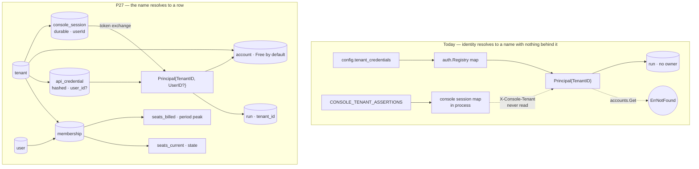

# PRD — P27: Account System (the tenant becomes a row, the person becomes real, the run gets an owner)

| Field | Value |
|---|---|
| Phase / Milestone | P27 / M17 (commercial self-serve gate; downstream of P22 identity and P21 payments) |
| Target window | Lands as one wave; blocks self-serve revenue and blocks any honest seat claim |
| Lead role(s) | System Designer + Backend (co-leads) |
| Supporting role(s) | Frontend, Product Designer, DevOps, QA Engineer, AI Engineer, Sales Operations |
| Status | **Draft** — nothing below is built |
| OpenSpec change | `p27-account-system` |

> **The one-sentence job.** *Make the tenant a row instead of a configuration entry, give it members, give it
> the runs it produced, and let the first member create it by signing up* — so a person can come back tomorrow,
> find their work, and pay for the plan that governs it. **On every surface they reach it from, the console and
> the command line alike.**

> **Scope discipline.** P27 adds **persistence and ownership**, not product surface. It does not add an
> optimization axis, a statistic, a scoring rule, or a pricing dimension. Every capability below exists because
> something already shipped cannot function without it: [P21](P21-stripe-payments.md) checkout needs an account
> that exists, [P22](P22-sso-identity.md) sign-in needs a tenant that can be created, the
> [P7](P7-billing-metering.md) `seats` limit needs somebody to count, and the [P9](P9-web-console.md) console
> needs to be able to answer *"what did I run last week?"*

## 1. Summary

The platform can prove **who is calling** (P22 federates a real assertion to a `tenantId`) and it can **price
what they used** (P7 meters, P21 charges). What it cannot do is **remember that they exist**. A tenant is not a
row anywhere in the thirty-seven migrations — it is a key in a map that
[`auth.Registry`](../../internal/auth/registry.go) builds from the configuration file at boot, and a second map
the console reads from its environment. Creating a customer therefore means editing a file and restarting a
process. There is no signup, and there cannot be one, because there is nowhere to write the answer.

Everything downstream inherits that hole. There is **no user** — the console session is
`{id, tenantId, issuedAt, expiresAt, revokedAt}` and [`session.ts`](../../web/console/src/lib/session.ts) says
why in its own comment: *the platform cannot currently prove one*. That was true when ADR-008 was written and
**P22 made it false**, and the deferral was never revisited. There is **no account creator**:
`account.Store.Create` has zero callers outside demos, so a customer who signs in and clicks *Upgrade* reaches
`StartCheckout → accounts.Get → ErrNotFound`. There is **no owner on a run**: the `run` table (migration 0005)
has no tenant column and there is no `GET /api/v1/runs`, so "my runs" is not a question the API can be asked.
And the console's session store is a **process-local map**, so a rollout signs every customer out and the second
replica P19's Kubernetes manifest declares cannot work at all.

P27 closes the chain with five capabilities: a **durable tenant** whose configuration list becomes a boot-time
seed rather than the truth; a **durable user** with membership, roles and invitations, so a session can name a
person and offboarding can revoke them; **tenant ownership on runs** plus the scoped list surfaces that make
work findable — enforced by the platform against a credential that *carries* the tenant, never by a header the
caller supplies; **seats as two separately-named quantities** (the current count that gates an invitation, the
period peak that prices an invoice), because today `LimitSeats` is enforced against a number nothing ever
writes; and a **self-serve subscription path** where signing up creates a Free account with no payment method,
and the first *Upgrade* finds an account instead of a 404.

The load-bearing invariants are 🔴 **L1 security**: the tenant on a request comes from the credential the
platform verified, never from a value the caller can set; a person who is removed loses their sessions *and*
their credentials at the next request; and no new secret mechanism is introduced — credentials are stored as
hashes, and identity secrets keep flowing through the one `Secrets` seam P7, P21 and `adminidentity` already
share.

## 2. Problem & context

Six facts, each checked in the repository rather than remembered. They are not six problems; they are one
problem observed at six depths.

- **🔴 A tenant exists only in deployment configuration, so it cannot be created at runtime.**
  [`auth.Registry`](../../internal/auth/registry.go) is a `map[string]Principal` built once from
  `cfg.TenantCredentials`; the console's federated mapping is `CONSOLE_IDP_TENANT_MAP` /
  `CONSOLE_TENANT_ASSERTIONS`, injected by a secrets manager
  ([`identity.ts`](../../web/console/src/lib/identity.ts)). Grep the thirty-seven Postgres migrations for a
  `tenant` table and the only hits are *columns* on other people's tables — `delivery.tenant_id`,
  `workflow_ir.tenant_id`, `legal_acceptance.tenant_id` — every one a foreign key into nothing. Onboarding a
  customer is a deploy. P22's `jit` strategy provisions a *person* into a tenant that already exists; no
  strategy provisions the tenant.
- **🔴 There is no user, and the reason recorded for that has expired.**
  [`session.ts`](../../web/console/src/lib/session.ts) states the position plainly: the session holds a tenant
  and not a user "because the platform cannot currently prove one", and P22's non-goals repeat it — promoting
  the subject into a first-class `user` "is a scoped follow-up, not assumed here". **P22 shipped.** A verified
  assertion now yields `sub@issuer`, which is exactly the proof whose absence was the reason. A deferral whose
  precondition has since been met is not a decision any more; it is an unexamined default, and the standing
  lesson applies — *when the thing you were blocked on completes, re-check the condition rather than the
  status*. The costs it is still charging are concrete: a revoked session cannot say **whose** it was, an audit
  entry cannot attribute an action to a person, an invitation has nowhere to land, and the `seats` limit has
  nothing to count.
- **🔴 Nothing creates an account, so the paid path terminates in a 404 on its first step.**
  `account.Store.Create` is called by `cmd/demo/billing`, `cmd/proof/payments`, `cmd/proof/billing`,
  `cmd/proof/operatorconsole`, and by test fixtures. In non-test code under `internal/` it is called **zero**
  times. Meanwhile
  [`billing/collection.go`](../../internal/billing/collection.go) opens `StartCheckout`, `ChangePlan` and the
  payment read model with `s.accounts.Get(customerID)`, and
  [`entitlement`](../../internal/entitlement/entitlement.go) denies with `ReasonNoAccount` when that misses. So
  the P21 collection path is complete and correct and reachable only for a customer somebody inserted by hand.
- **🔴 A run has no owner, and "my runs" is not an expressible question.** Migration
  `0005_p2_run.up.sql` keys `run` by `run_id` with a foreign key to `config` and no tenant column;
  `internal/api/configruntime.go:62` registers `GET /api/v1/runs/{run_id}` and there is no collection route
  beside it. [`scope.ts`](../../web/console/src/lib/scope.ts) is honest about the consequence — the platform's
  routes are "keyed by subject … not by tenant", and it declines to claim the console enforces isolation
  because "a comment claiming the console enforces isolation would be a claim about somebody else's code."
- **🔴 The isolation that comment defers to does not exist.** `scope.ts` says isolation is enforced "by the
  platform against the credential and the `X-Console-Tenant` header the forwarder attaches". The platform never
  reads that header: `grep -rn X-Console-Tenant --include=*.go` returns one hit, a comment in
  `cmd/proof/customerconsole/main.go`. And every console request carries the **same** credential —
  `platformFetch` sets `X-API-Key: platformCredential()`, read from `CONSOLE_PLATFORM_CREDENTIAL`, one value for
  the process ([`platformApi.ts`](../../web/console/src/lib/platformApi.ts)). So on a multi-tenant deployment
  every signed-in tenant resolves to one platform principal. The console's half of the contract is kept
  perfectly; the other half was never built. This is the single highest-severity item in the phase and it is
  **not** a console bug — the console cannot fix a scope the platform does not read.
- **The `seats` limit is sold, gated, and enforced against a permanent zero.** `plancfg.LimitSeats` and
  `metering.MetricSeats` both exist; [`entitlement.go:109`](../../internal/entitlement/entitlement.go) gates
  `FeatureDashboard` on `{LimitSeats, MetricSeats}`; the plan fixtures price 1 / 5 / 25 / 500 seats. No code
  path anywhere records a `seats` usage record — the only non-test references are `billingview`'s two
  formatting switches. The gate therefore compares *n* against 0 forever, which passes. A plan that sells five
  seats can admit five hundred, and the invoice line for seats is derived from nothing.

- **🔴 The command line has the same hole, one layer up.** `heros login --token <string>` stores a **tenant**
  credential ([`credential.go`](../../internal/cli/credential.go)) and validates it at `/api/v1/whoami`, which
  answers `{"identity": principal.TenantID}` — the organization, never the person. So the CLI cannot say who
  you are, a person's first experience of the product is *"paste the string an admin sent you"* (the same
  somebody-edits-a-file problem the console has), and, worst of the three, **removing a member does not revoke
  their CLI access**. Offboarding today is: rotate the organization's key and redistribute it to everyone who
  stayed. Any claim that removal ends a person's access is false while the CLI credential names no person.

Two consequences are worth stating separately because they are what a customer actually experiences.

**A console restart is a mass logout, and the declared topology cannot run.** Sessions live in a
`globalThis`-anchored `Map` ([`session.ts`](../../web/console/src/lib/session.ts)), which the file documents as
honest for ADR-006's one-container deployment and states will need a shared store to scale. P19's Kubernetes
overlay declares `replicas: 2`. Under two replicas a user signs in against one pod and is signed out by the
next request that lands on the other — intermittently, which is the worst failure mode to diagnose.

**A person who leaves keeps working access.** A CLI token is a *tenant* credential
(`internal/runlink/transport/client.go` validates it at `/api/v1/whoami`, and `auth.Registry` maps it to
`Principal{TenantID, Role}`). It names no person, so there is no operation that revokes one person's access
without revoking the whole tenant's. Offboarding is currently: rotate the tenant key and re-distribute it to
everyone who stayed.

## 3. Goals & non-goals

### Goals

- **G1 — The tenant is a durable record; configuration becomes a seed, not the truth.** A `tenant` row is the
  system of record for existence, name, status and plan binding. `cfg.TenantCredentials` is applied **once at
  boot as an expand-only seed** (create if absent, never overwrite, never delete), so every deployment that
  boots today boots tomorrow with the same tenants and the same keys — and a tenant created at runtime survives
  the next restart, which is the property configuration cannot provide.
- **G2 — A person is a first-class record, and a session names one.** `user`, `membership` and `invitation` are
  durable; the console session carries `{sessionId, tenantId, userId}`. Per-user revocation, per-user audit
  attribution and seat counting all become expressible for the first time. Where the subject is genuinely not
  provable (a machine credential), the field is **absent**, never invented.
- **G3 — Sign-up is self-serve and creates everything the paid path needs, in one transaction.** A verified
  identity that maps to no existing tenant may **create** one: tenant + owner user + owner membership + a Free
  `account` are written together or not at all. The first *Upgrade* click then finds an account and opens
  checkout. Nobody edits a file; no operator is in the path.
- **G4 — 🔴 Scope comes from the credential, never from the request.** The platform derives the tenant from the
  verified credential exactly as `auth.Middleware` does today. `X-Console-Tenant` is **removed**, not honored:
  the console's BFF exchanges its session for a **short-lived, tenant-scoped platform token** and forwards
  that, so the tenant is *inside* the thing the platform verifies. A tenant identifier in any client-controlled
  position never widens, changes or overrides scope — and the browser still never holds a credential (ADR-008
  Rule 2 is strengthened, not relaxed).
- **G5 — Every run has an owner, and a tenant can list its own work.** New runs, variant specs, eval runs and
  proposals record the owning tenant at write time. `GET /api/v1/runs` returns **this tenant's** runs, paged and
  ordered; a subject belonging to another tenant answers `404` — indistinguishable from "does not exist", which
  is the correct answer to give a stranger. Rows written before P27 carry a **NULL** owner meaning
  *pre-ownership*, and every surface distinguishes that from *"you have no runs"*.
- **G6 — A credential can name a person, so offboarding is one operation.** An API credential row may carry a
  `user_id`. Removing a membership revokes that person's sessions and their user-scoped credentials at the
  **next request** — the store is read every request, so there is no grace window. Tenant-scoped machine
  credentials are untouched and are visibly labelled as machine credentials, because pretending a CI key
  belongs to a person is how an offboarding checklist gets signed while access remains.
- **G7 — Seats are two quantities with two names.** `seats_current` is the count of active console-capable
  memberships — a **state**, read directly, and what gates the sixth invitation. `seats_billed` is the
  **period peak**, written as a usage record whenever membership changes, and what an invoice line may cite.
  Collapsing them is the reason the current limit is decorative: a state accumulated as a flow is a number
  nobody ever writes.
- **G8 — Sessions are durable and shared.** The console session store moves to Postgres with the shape
  `admin_session` already uses on the operator side. A rollout no longer signs customers out, and `replicas: 2`
  becomes a supported topology rather than an intermittent bug. Revocation semantics, TTL and the fail-closed
  middleware are **unchanged**.
- **G9 — An invitation link is a convenience, never a credential.** The link pre-fills the organization name
  and the invited address; it grants nothing. Membership is created only when the invitee completes SSO and the
  **verified** identity matches the invitation. A mismatch is a refusal and a security event, not a silent
  admission.
- **G11 — The command line signs in as a person, through the same account system.** `heros login` with no
  token performs a **device authorization**: the CLI shows a short code, the person approves it in the console
  behind their existing SSO sign-in, chooses which organization, and the CLI receives a **user-scoped
  `api_credential`** — the same row type the members page lists and the same row removal revokes. `--token`
  remains supported for CI and machine credentials, which is exactly the machine/person split `user_id`
  encodes. `heros status` and `whoami` then name the person **and** the organization, additively, so every
  existing consumer of `whoami` keeps working unchanged.
- **G10 — The honest boundary of "your data" is written down before it is sold.** What P27 makes findable, how
  long it is kept, what an account closure does and does not erase, and which existing mechanism
  (`gdpr_request`) owns erasure — stated as the mechanism it is, so no surface promises a deletion the platform
  does not perform.

### Non-goals (explicitly deferred, with the owner)

- **A password database or credential recovery.** P27 stores no password and runs no reset flow. Identity
  remains federated (P22) or deployment-configured. *(Owner: nobody — out of scope by principle, unchanged from
  P22.)*
- **SCIM / directory provisioning and push-based deactivation.** Invitations and JIT membership are in scope;
  synchronizing the customer's directory is not, and the deactivation window remains the published session TTL.
  *(Owner: a future identity-provisioning phase; the claim boundary is already written in
  [P22 §G11](P22-sso-identity.md).)*
- **Repricing, new plans, or a new billing dimension.** P27 makes `seats` measurable; it does **not** change
  what a seat costs, add a plan, or introduce a pricing axis. Plan definitions stay in configuration with no
  price in git. *(Owner: P7 / P21.)*
- **Fine-grained RBAC.** Three roles — `owner`, `admin`, `member` — and nothing more. Per-resource permissions,
  custom roles and delegated administration are a later phase; inventing a permission model nobody has asked
  for is exactly the "built it for the future" the repository forbids. *(Owner: a future access-control phase.)*
- **Cross-tenant sharing, public run links, or transfer of a run between tenants.** Ownership is written once at
  creation. *(Owner: unscheduled; it is a product decision, not a storage one.)*
- **Hard erasure of a tenant's history.** Account closure marks the account and stops billing; erasure runs
  through the existing `gdpr_request` mechanism and its audit tombstones. P27 does not build a second deletion
  path. *(Owner: P8 operator surface.)*
- **Backfilling ownership onto historical runs.** A pre-P27 run's tenant is not recoverable — the information
  was never written. Guessing it from a neighbouring table would produce a *confident wrong* owner, which is
  worse than a NULL. *(Owner: nobody; the NULL is the answer, and §6 FR14 requires every surface to say so.)*
- **Operator identity.** `admin_principal` / `admin_session` / `admin_role_grant` are already durable and stay
  categorically separate — an operator is not a user and never gains a membership. *(Owner: P8 / P22
  `operator-sso-mfa`.)*

## 4. Users & personas

- **The first person at a new customer** — arrives from the marketing page, signs in with their company IdP,
  and expects to have an organization thirty seconds later. Today they are a support ticket. Judges the
  delivery by whether they can reach a run and a bill without talking to anyone.
- **The organization owner / admin** — invites colleagues, removes them when they leave, sees who is in the
  organization and what the seat count is against the plan, and is the one who clicks *Upgrade*. Needs removal
  to be **one** action that actually ends access, because they will be asked to attest to that.
- **The returning individual contributor** — signed in last week, ran three variants, and wants to find them.
  Needs `/app/runs` to answer, and needs the answer to survive a console deploy.
- **The CLI-first developer** — lives in a terminal, may never open the console except to approve a device.
  Wants `heros login` to work without being handed a secret by a colleague, and wants `heros status` to tell
  them which person and which organization they are acting as before they push anything.
- **The CI pipeline** — is not a person and must never be given one. Holds a machine credential with no
  `user_id`, keeps working when the engineer who created it leaves, and is listed by name on the screen where
  that engineer is removed so the decision to rotate it is deliberate.
- **The platform operator (us)** — needs a tenant to be a row so a support question ("does this customer
  exist, and what plan are they on?") has one place to be answered, and needs the seat number on the operator
  console to be a measurement rather than a formatted zero.
- **The buyer's security reviewer** — asks two questions P27 must be able to answer with a mechanism rather
  than an intention: *can tenant A read tenant B's runs?* and *when I remove someone, when exactly do they lose
  access?*
- **Downstream: P21 collection, P7 entitlement, P9 console, P8 operator console** — all consume the account
  and the tenant. Each already assumes both exist; P27 is what makes the assumption true.

## 5. User stories / jobs-to-be-done

**The first person at a new customer**
- As a new customer, I want to **sign in and get an organization**, so that I can start without an email thread
  and a deploy on your side.
- As a new customer, I want the free tier to **work immediately**, so that I evaluate the product before I
  evaluate your billing.

**Organization owner / admin**
- As an owner, I want to **invite a colleague by email**, so that they join my organization and not a new one.
- As an owner, I want **removing someone to end their access** — console and CLI — so that my offboarding
  checklist is true when I sign it.
- As an owner, I want to **see seats used against seats included**, so that "upgrade for more seats" is a
  number I can check rather than a prompt I distrust.
- As an owner, I want to **click Upgrade and reach a payment form**, so that giving you money is not the
  hardest step.

**Returning contributor**
- As a returning user, I want **`/app/runs` to list what I ran**, so that last week's work is findable without
  a run id in my shell history.
- As a returning user, I want to **stay signed in across your deploys**, so that a release of yours is not an
  interruption of mine.

**CLI-first developer**
- As a developer, I want **`heros login` to sign me in without a colleague sending me a secret**, so that
  onboarding is something I can do myself.
- As a developer, I want **`heros status` to name the person and the organization**, so that I know whose
  quota I am about to spend before I spend it.
- As an owner, I want **removing someone to end their CLI access too**, so that "their access ends" means what
  it says rather than meaning "in the browser".

**Security reviewer**
- As a security reviewer, I want the tenant on a request to come from **the credential you verified**, so that
  a header cannot widen it.
- As a security reviewer, I want **a run belonging to another tenant to be a 404**, so that the API does not
  confirm the existence of things I may not see.

**Operator (us)**
- As an operator, I want **one place that answers "does this tenant exist"**, so that a support question is a
  query rather than a grep across a config file and an environment variable.

**Downstream subsystems**
- As the P21 collection path, I want **`accounts.Get` to succeed for any signed-in tenant**, so that checkout
  is a payment problem and never a provisioning problem.
- As the entitlement gate, I want **`seats` to be a number somebody writes**, so that enforcing it means
  something.

## 6. Functional requirements

These map 1:1 to OpenSpec requirements in `p27-account-system` across five capabilities: `account-registry`,
`user-identity`, `run-ownership`, `seat-accounting` and `self-serve-subscription`.

### The durable tenant (`account-registry`)

- **FR1 — A tenant is a row.** The platform SHALL store each tenant as a durable record `{tenant_id, name,
  status, created_at}` and resolve every principal against it. `status` reuses the account lifecycle vocabulary
  (`active` / `suspended`) so a tenant has one lifecycle, not two.
- **FR2 — Configuration is an expand-only seed.** At boot the platform SHALL apply `cfg.TenantCredentials` as
  a create-if-absent seed: a configured tenant or credential that does not exist is created; one that exists is
  **never** overwritten, downgraded or deleted by the seed. A deployment upgrading into P27 SHALL keep every
  tenant and every key it had, and this SHALL be proven by a migration test that boots against a populated
  config.
- **FR3 — Credentials are stored as hashes and can be rotated.** An API credential SHALL be stored as
  `{credential_id, tenant_id, user_id?, label, hash, created_at, revoked_at?}`. The plaintext SHALL be shown
  exactly once, at creation, and SHALL never be readable afterwards from any surface, log or export. Lookup
  SHALL be constant-time against the stored hash.
- **FR4 — A revoked credential is refused at the next request.** Verification SHALL read the store on every
  request; a credential with `revoked_at` set SHALL be refused with the same generic `unauthorized` the unknown
  case returns, so revocation is not a probing oracle.
- **FR5 — Tenant suspension halts the tenant everywhere.** A suspended tenant SHALL be refused at
  authentication rather than at each feature, and the refusal SHALL be distinguishable in the platform's own
  logs from an unknown credential while being indistinguishable on the wire.

### The person, membership and invitations (`user-identity`)

- **FR6 — A user is a row keyed by an internal id, identified by `(issuer, subject)`.** The federated identity
  pair SHALL be the unique key; `email` SHALL be a **display attribute**, never the identity, because an
  address can be reassigned to a different person while a subject cannot.
- **FR7 — Membership is its own record.** `{user_id, tenant_id, role, status, invited_by, joined_at}` with
  `role ∈ {owner, admin, member}`. A user MAY hold memberships in more than one tenant; the console SHALL make
  the active organization explicit and SHALL derive scope from the session, never from a selector the client
  can post.
- **FR8 — The last owner cannot be removed or demoted.** Any operation that would leave a tenant with zero
  `owner` memberships SHALL be refused with a named reason. An organization with no owner has no one who can
  restore it, which makes the mistake unrecoverable through the product.
- **FR9 — An invitation is a record, and its link is not a credential.** An invitation SHALL store
  `{invitation_id, tenant_id, email, role, invited_by, expires_at, accepted_at?}`. The link SHALL pre-fill the
  organization and address only. Membership SHALL be created **only** when a completed SSO sign-in yields a
  verified identity whose address matches the invitation; a mismatch or an expired invitation SHALL be refused
  and recorded as a security event.
- **FR10 — A session names the person where the person is provable.** The session record SHALL become
  `{id, tenantId, userId?, issuedAt, expiresAt, revokedAt?}`. `userId` SHALL be present for every
  interactively-signed-in session and **absent** — never a placeholder — for a machine principal.
- **FR11 — The session store is durable and shared.** Sessions SHALL persist across a console restart and SHALL
  be visible to every console replica. TTL, revocation-at-next-request-with-no-grace, cookie flags and the
  fail-closed middleware SHALL be **unchanged**, asserted by regression test rather than by review.
- **FR12 — Removing a member ends their access at the next request.** Setting a membership to `removed` SHALL
  revoke that user's sessions for that tenant and revoke every credential carrying their `user_id` for that
  tenant. Tenant-scoped machine credentials SHALL be unaffected and SHALL be listed as machine credentials on
  the member-removal surface, so the operator sees what removal does **not** cover.
- **FR13 — Audit entries attribute to the person when there is one.** An audited action taken through a session
  SHALL record the acting `user_id`; an action taken by a machine credential SHALL record the credential id and
  SHALL NOT name a person.

### Ownership of work (`run-ownership`)

- **FR14 — New work records its owner at write time.** A run, variant spec and eval run SHALL record the
  owning `tenant_id` when created, derived from the verified principal. (**Not `proposal`** — migration 0025
  already gave it `tenant_id NOT NULL`, so proposals have been tenant-scoped since P5.5 and have no
  pre-ownership state. An earlier draft of this phase added the column anyway; the schema fence caught it.) A row created before P27 SHALL
  carry `NULL`, meaning *pre-ownership*, and every surface that lists work SHALL distinguish "no runs" from
  "runs exist that predate ownership" rather than collapsing them into an empty list.
- **FR15 — A tenant can list its own work.** `GET /api/v1/runs` SHALL return this tenant's runs, newest first,
  paged, with a stable cursor. It SHALL NOT accept a tenant parameter in any position.
- **FR16 — 🔴 Scope is derived from the credential, and `X-Console-Tenant` is removed.** The platform SHALL
  derive the tenant from the verified credential only. The `X-Console-Tenant` header SHALL be **deleted** from
  the console forwarder rather than made authoritative, and a build fence SHALL fail if it reappears — a header
  that names authority is the exact shape ADR-008 Rule 2 forbids.
- **FR17 — The console holds a tenant-scoped token, not one shared platform key.** The BFF SHALL exchange its
  session for a short-lived platform token bound to that session's tenant and SHALL forward that token upstream.
  The browser SHALL still receive no credential of any kind. A BFF that cannot obtain a scoped token SHALL fail
  closed.
- **FR18 — Cross-tenant reads answer 404.** A subject that exists but belongs to another tenant SHALL answer
  `404`, identical in body and timing class to a subject that does not exist.
- **FR19 — Ownership is immutable.** There SHALL be no interface that changes the owning tenant of an existing
  run. A transfer would silently move billed usage between customers.

### Command-line identity (`account-registry`, `user-identity`)

- **FR29 — `heros login` with no token SHALL authenticate a person through a device authorization.** The CLI
  requests a device code; the console verifies it behind the operator's existing SSO session; the person
  chooses the organization from their memberships; the CLI polls and receives a credential. The CLI SHALL NOT
  handle a password, an assertion, or an ID token at any point — it receives only the credential the platform
  issued.
- **FR30 — The credential a device authorization issues SHALL be user-scoped.** It is an `api_credential` row
  carrying the approving person's `user_id`, labelled with the device the CLI reported. It appears in the
  organization's credential list as a **personal** credential, and it is revoked when that membership is
  removed (FR12) — which is what makes the offboarding claim true on the command line as well as in the
  browser.
- **FR31 — `--token` SHALL remain supported, and SHALL remain the machine path.** A token pasted into
  `heros login --token` is used exactly as it is today. A machine credential has no `user_id`, is listed as a
  **machine** credential, and is not revoked by removing a person — stated on the removal screen (FR12) rather
  than discovered when a build breaks.
- **FR32 — `whoami` SHALL name the person and the organization, additively.** The response keeps `identity`
  with its current meaning and value, and gains the organization's name, the acting user (absent for a machine
  credential), and which of the two kinds the credential is. No existing consumer changes; both current callers
  read only `identity`.
- **FR33 — A device authorization SHALL be short-lived, single-use, and approvable only by a signed-in
  member.** The device code expires; approving it twice is refused; and the approver must hold an active
  membership in the organization they select. An unapproved or expired code yields **no** credential and is
  indistinguishable, to the CLI, from one that was denied.

### Seats (`seat-accounting`)

- **FR20 — `seats_current` is a state and gates invitations.** The count of `active` memberships whose role can
  open the console SHALL be read directly from membership. Inviting or activating a member beyond the plan's
  `seats` allowance SHALL be refused with the plan's number and the current number **both named** in the
  refusal.
- **FR21 — `seats_billed` is the period peak and is written on change.** Every membership activation or removal
  SHALL record a `seats` usage observation for the current period; the invoice line SHALL cite the **peak**
  held during the period, not the value at close, so an organization that adds five people for three weeks and
  removes them on the last day is billed for what it held.
- **FR22 — The two numbers are never rendered as one.** Any surface showing seats SHALL label which quantity it
  shows. A single unlabelled "seats" figure is non-conformant.
- **FR23 — An operator quota override still wins.** `account.QuotaOverrides["seats"]` SHALL continue to replace
  the plan allowance for that one limit, unchanged from P7.

### Self-serve subscription (`self-serve-subscription`)

- **FR24 — Sign-up creates tenant, owner and account atomically.** A verified identity mapping to no tenant,
  where the deployment permits self-serve, SHALL create `{tenant, user, membership(owner), account(Free)}` in a
  single transaction. A partial failure SHALL leave none of them, because a tenant with no owner and an account
  with no tenant are both unrecoverable through the product.
- **FR25 — A Free account may have no provider handle.** `account.provider_customer_handle` SHALL be nullable,
  meaning *no billing-provider customer yet*. The invariant becomes: **an account may lack a handle only while
  its plan charges nothing**, enforced in the database. The existing card-data `CHECK` SHALL remain in force for
  every non-null handle.
- **FR26 — The first upgrade mints the handle.** `StartCheckout` on an account with no handle SHALL create the
  provider customer, persist the returned handle, and proceed — idempotently, so a retried checkout does not
  create a second provider customer.
- **FR27 — Self-serve is a deployment posture, and it is off by default.** A deployment SHALL declare whether
  unmapped verified identities may create a tenant. When self-serve is off, an unmapped identity SHALL be
  refused exactly as P22 refuses it today (`not_provisioned`), unchanged. An air-gapped or single-customer
  install SHALL NOT gain a signup form by upgrading.
- **FR28 — Account closure stops billing and states what it does not do.** Closing an account SHALL suspend the
  tenant, stop metered accrual, and SHALL NOT erase history. The surface SHALL name the erasure mechanism
  (`gdpr_request`) rather than implying deletion has occurred.

## 7. Non-functional requirements

- **NFR1 — Credential verification is one indexed lookup per authenticated request, with no
  positive-result cache.** Verification moves from a map lookup to a store read and stays there. A revoked
  credential is refused at the **next** request (FR4), and that is only true if nothing caches an accept.

  > **Corrected during implementation.** This requirement originally asked for a bounded positive-result
  > cache with a ≤60-second TTL *and* for revocation never to be cached. **Those cannot both hold across more
  > than one replica**: a positive entry cached for up to 60 seconds **is** a cached non-revocation, so
  > revoking on replica A leaves replica B accepting the credential until its own entry expires, and
  > *"refused at the next request"* silently becomes *"refused within a minute"* — changing the meaning of
  > the sentence a customer is asked to rely on when they offboard somebody, with nobody editing it.
  >
  > The priority law settles it: security is level 1, implementation cost is level 8, and level 8 does not
  > push back. So there is no cache. This is what `admin_session` has done on the operator side since P8, for
  > the same reason. **Caching a "yes" is a performance decision; caching a "no longer" is a security
  > decision** — and here the first is the second. If the lookup ever becomes a measured bottleneck, the fix
  > is a faster store or a shorter-lived credential, not a window in which a revoked key still works.
- **NFR2 — Sign-up completes in one transaction under 500 ms at p95** on the reference deployment, or fails
  wholly. There is no partially-created organization state to clean up, and therefore no cleanup job.
- **NFR3 — `GET /api/v1/runs` is paged and index-backed.** A tenant with 100,000 runs SHALL receive the first
  page in under 300 ms p95, served by an index on `(tenant_id, created_at DESC)`. No list endpoint SHALL return
  an unbounded result set.
- **NFR4 — Session reads scale to every request.** The session store SHALL be read on every authenticated
  request (this is what makes revocation immediate) and SHALL sustain the console's request rate with an index
  on the opaque token. A cached session is a session that cannot be revoked.
- **NFR5 — 🔴 No credential plaintext at rest, in a log, in a trace attribute, or in an export.** Credentials
  are stored hashed; the plaintext exists only in the creation response. `scan-secrets` SHALL cover the new
  surfaces.
- **NFR6 — Store parity is proven by running both implementations.** Every new store SHALL ship a `MemStore`
  and a `PGStore` behind one interface, the same behavioural tests SHALL run against both, and the durable half
  SHALL be proven against a **live Postgres** under the `pgproof` tag. An unrun implementation is not missing
  coverage — it is cover for the failures already in it.

  > **Corrected during implementation.** This requirement originally demanded SQLite/Postgres dual-dialect
  > parity, borrowed from a sibling project. **That axis does not exist here**: the platform schema is
  > Postgres-only (`db/migrations/postgres/`, embedded by `db/migrations/embed.go`), and the SQLite schema in
  > `internal/db/db.go` belongs to a different subsystem and holds none of these tables. Writing a SQLite
  > baseline nobody reads would have been a fence that cannot fail. The parity axis that exists here is
  > `MemStore` vs `PGStore`, and that is what is required.
- **NFR7 — Migrations are expand-only and idempotent.** Every migration SHALL be safe to re-run and SHALL NOT
  rewrite existing rows in a single unconditional `UPDATE`. Adding an owner column to a deployed table SHALL be
  nullable-first; there is no step that requires downtime.
- **NFR8 — Rollback is re-apply.** The phase SHALL be revertible by deploying the prior image with the schema
  in place: every new column is nullable or defaulted, and the prior code path ignores it. A rollback SHALL NOT
  require a down-migration on customer data.
- **NFR9 — Deployment posture is declared, not inferred.** Self-serve, the tenant seed and the session store's
  backend SHALL each be explicit configuration whose effective value is reported on the platform's readiness
  surface. A capability that is silently on in one deployment shape and off in another is the failure P19's
  capability ledger exists to prevent.
- **NFR10 — The new surfaces appear in the operator-surface ledger.** Every capability P27 adds SHALL resolve
  to either an operator surface or a recorded, reasoned absence, so P26's build fence stays meaningful rather
  than being satisfied by a phase that predates it.

## 8. System design summary

### 8.1 The shape of the change



The left half is not a simplification: `auth.Registry` really is a map, the session store really is a map, and
the arrow from the console to the platform really does carry a header nobody reads. The right half adds five
tables and one column family, and changes no interface above them — `Principal` gains an optional field,
`Session` gains an optional field, and every consumer of both keeps compiling.

### 8.2 Data model

| Table | Why it exists | Notes |
|---|---|---|
| `tenant` 🆕 | The record that today lives in a config file | `{tenant_id PK, name, status, created_at}`; `status` shares the `account.Status` vocabulary |
| `user` 🆕 | The person P22 made provable and ADR-008 could not | `{user_id PK, issuer, subject, email, created_at}`; `UNIQUE(issuer, subject)` |
| `membership` 🆕 | A person's relationship to an organization — one person, many organizations | `{user_id, tenant_id, role, status, invited_by, joined_at}`; PK `(user_id, tenant_id)` |
| `invitation` 🆕 | A pending membership that is not yet a membership | `{invitation_id PK, tenant_id, email, role, invited_by, expires_at, accepted_at}` |
| `api_credential` 🆕 | The keys the config map holds today, made durable and revocable | `{credential_id PK, tenant_id, user_id NULL, label, hash, created_at, revoked_at}` |
| `console_session` 🆕 | The map that a restart empties | Shape mirrors the operator side's `admin_session`, which has been durable since P8 |
| `account` 🔧 | Exists; gains a nullable handle | `provider_customer_handle` becomes NULL-able, guarded by a paid-plans-need-a-handle `CHECK` |
| `run`, `variant_spec`, `eval_run` 🔧 | Gain `tenant_id` NULL | NULL means *pre-ownership*, not *unowned*. `proposal` is **excluded**: 0025 already gave it `tenant_id NOT NULL` |

**Five new tables is four more than this repository likes**, and `careful-table-creation` requires the
alternatives to be written down rather than implied. They are, in `design.md` — the two serious ones being a
single `principal` table with a discriminator column (rejected: it merges two lifecycles into one object, the
failure `§11.3` of the design-pattern library names) and a JSON document on `tenant` holding members (rejected:
membership is queried *by user* at every sign-in, and a document cannot be indexed that way without becoming a
table with extra steps).

### 8.3 The two interface changes, and everything that does not change

```go
// internal/auth — Principal gains one optional field. Every existing consumer compiles unchanged.
type Principal struct {
    TenantID string
    Role     string
    APIKeyID string
    UserID   string // NEW — empty for a machine credential. Never a placeholder.
}
```

```ts
// web/console — Session gains one optional field; the store moves; the SEMANTICS are byte-for-byte.
type Session = {
  id: string; tenantId: string;
  userId?: string;          // NEW — absent, not "", when the principal is not a person
  issuedAt: number; expiresAt: number; revokedAt?: number;
};
```

Unchanged and asserted by regression test: the cookie name and flags, the TTL, revocation with no grace period,
the fail-closed middleware, `scope.ts`'s rule that no call site may pass a tenant, and every tenant page.

### 8.4 The isolation fix, stated precisely

Today the console sends one credential and a header the platform ignores. Two fixes were available:

1. **Make the platform trust `X-Console-Tenant` when presented with the BFF's credential.** Cheapest by a wide
   margin. It also means any holder of that one credential can name any tenant — a request describing its own
   authority, which is the thing ADR-008 Rule 2 exists to forbid and the thing a security reviewer will find in
   an afternoon. **Rejected at level 1.**
2. **Exchange the session for a tenant-scoped token.** The BFF authenticates to the platform with its own
   credential, presents the session's tenant *once*, and receives a short-lived token whose subject is that
   tenant. It forwards the token. The platform reads scope from `auth` exactly as it always has. **Chosen.**

The cost of (2) is one endpoint and a token cache; the benefit is that the header disappears entirely, which is
why FR16 deletes it and fences its return rather than leaving it inert. An inert header is a header somebody
later makes load-bearing.

## 9. Design by role lens

### System Designer

Applies the eight-level priority law to the phase's one genuine conflict: **the isolation fix is expensive and
the header fix is nearly free.** Level 1 (security) decides it, and level 8 (implementation cost) may not push
back — so §8.4's option 1 is not a fallback to keep in reserve, it is rejected. Owns the three one-way doors and
requires them ratified before any table is created: the tenant/user/membership split, the credential-carries-
scope contract, and the nullable-handle account invariant. Applies **control plane / data plane separation** —
account, membership and seats are control-plane state and must not enter the run's hot path; the run path reads
a resolved principal and nothing else. Applies **bounded contexts**: `tenant` (an organization we bill),
`account` (a billable customer), `user` (a person) and `principal` (an authenticated caller) are four words for
four things, and the phase's naming section forbids using any of them for another.

### Backend

Owns the schema, and it owns the part of the schema that has been got wrong before: **adding a column to a
deployed table**. Nullable-first, backfill by condition, no unconditional `UPDATE`, and the same DDL landing in
the Postgres chain and the Go model in one commit — with the embedded set **applied to a live Postgres**,
because the failure this repository already paid for was a migration that was, in CI terms, a text file: nothing
applied anything past 0009, and 0024 shipped a `CREATE TABLE` against a table 0013 had already created. Owns the `event-write-reconcile-read` obligation
for `seats_billed`: the membership change is the event, and the period's peak projection is the idempotent
reconciliation point that must be nameable — "the invariant holds because the events are ordered" is not an
answer. Owns `DomainError` codes for every new refusal, so *seat limit reached*, *last owner*, *invitation
expired* and *identity mismatch* are four codes and not four strings.

### Frontend

Owns four surfaces — `/app/runs`, `/app/settings/members`, the invitation acceptance page, and the sign-up
path — and one deletion: `X-Console-Tenant` leaves `platformApi.ts`. Applies the **three-state** rule to the
runs list: *no runs yet*, *runs that predate ownership*, and *the platform did not answer* are three states with
three messages and three next actions; collapsing any pair of them into an empty table is the failure mode the
console's own comments already warn about. Applies the **state → copy mapping table** to member management,
where six states (invited, expired, active, last-owner, over-seat-limit, removed) each need their own title,
explanation and control. Never derives a seat count client-side, and never renders a seat number without its
label (FR22).

### Product Designer

Owns the naming, because this phase introduces the four most confusable words in the product. Owns the
**noun dictionary**: what a customer sees is an **organization** (never "tenant" — a customer is not our
multi-tenancy), a **member**, an **invitation**, a **seat**, and a **plan**. Owns the rule that an invitation
link pre-fills and does not admit (FR9, G9), and the rule that removal must show what it does *not* revoke,
because an offboarding surface that hides the machine credentials it left behind is worse than no surface.
Owns the acceptance criteria in §13 being observable facts rather than adjectives, and owns the refusal copy:
"seat limit reached" must name both numbers, because a limit the user cannot check is a limit they distrust.

### AI Engineer

Has a narrow but real lens here. Owns the assertion that **P27 changes no measurement**: `config_hash`,
scoring, confidence intervals, ties and the eval harness are untouched, and this is asserted rather than
assumed — an ownership column that leaked into the hash would silently invalidate every cached score. Owns the
check that tenant-scoped listing does not become a tenant-scoped **filter on evaluation data**: a board that
ranks variants must keep ranking what it ranked, and a scope applied to a statistic is a different statistic.

### DevOps

Owns the migration order, the boot-time seed, and the rollback story — which is *re-apply*, because every added
column is nullable and the prior image ignores it (NFR8). Owns the readiness surface: the session store's
backend, the tenant seed's outcome (how many created, how many already present) and whether self-serve is on
are **reported**, not inferred, and a seed that fails partially must fail the boot rather than serve a platform
missing half its tenants. Owns the fact that P19's `replicas: 2` becomes correct only once FR11 lands, and that
until it does, the manifest is declaring a topology the code cannot serve — so the two ship together or the
replica count comes down first.

### QA Engineer

Owns the fences, and owns the rule that a fence must be **watched failing**. Four that must go red before they
are trusted: reintroducing `X-Console-Tenant` fails the build; a run created without an owner fails a schema
test; a seat count read from the usage store rather than membership fails a unit test; a credential written
unhashed fails `scan-secrets`. Owns four-layer live assertions on sign-up — HTTP 2xx is not evidence the tenant
exists — and owns the cross-tenant probe as an explicit test rather than a review claim: tenant A's token
requesting tenant B's run must observe `404`, and the test must be able to fail (a first version that runs both
requests as the same tenant passes vacuously, which is the trap). Owns the **upgrade path** as a separate axis
from a fresh install: a deployment with existing config tenants, existing runs, and an existing account must
upgrade with nothing lost, and that is not the same test as a clean database.

### Sales Operations

Owns the claim boundary, in `docs/sales/P27-account-copy.md`. Three sentences become sayable and must be said
precisely: *"organizations and members"* (true after FR7), *"remove a member and their access ends at their next
request"* (true after FR12 — and it must be stated together with what it does not cover, the tenant-scoped
machine credentials), and *"seats included in your plan"* (true only after FR20/FR21 — until then it is a number
nobody measures, and quoting it is the exact discipline violation the workflow forbids). Owns the correction
that P27 **does not** change pricing, and owns keeping the P22 offboarding claim intact: platform-side
revocation is immediate; IdP-side deactivation is still bounded by the session TTL, and P27 does not close that
window.

## 10. Dependencies

**Upstream — must be in place**

| Dependency | What P27 takes from it |
|---|---|
| [P22 — SSO & Identity](P22-sso-identity.md) | The verified `(issuer, subject)` pair that makes a `user` provable, and `resolveTenant`'s refusal taxonomy, which P27 extends with *self-serve creation* rather than replacing |
| [ADR-008](../adr/ADR-008-console-tenant-identity-seam.md) | The seam and everything above it; P27 keeps Rule 3 (nothing above the seam moves) and strengthens Rule 2 (the client never describes its authority) |
| [P7 — Billing & Metering](P7-billing-metering.md) | `account`, `plancfg`, `entitlement`, `metering` — consumed verbatim; P27 supplies the rows they were written to read |
| [P21 — Stripe Payments](P21-stripe-payments.md) | `StartCheckout` / `ChangePlan` / webhook lifecycle; P27 makes the account they require exist |
| [P8 operator console](P8-admin-console.md) | `admin_session` as the proven durable-session shape, and the audit chain P27 attributes into |
| [P19 — Deployment](P19-deployment-delivery.md) | The readiness surface and the capability ledger the new surfaces must register in |
| [ADR-004](../adr/ADR-004-runtime-config-binding.md) | Fail-static binding, which the tenant seed follows |

**What P27 unblocks**

- Self-serve revenue: a customer who can sign up, invite, and pay without an operator.
- Any honest seat-based commercial claim, on any surface.
- Per-user audit attribution, which P8's audit chain has had a hole for since it was built.
- SCIM (a future phase) — which needs a `user` and a `membership` to synchronize *into*.
- P19's `replicas: 2` becoming a supported topology.

**Explicitly not depended on**

- A password store, an email delivery guarantee for invitations (an invitation is retrievable from the console
  by the inviter; email is a convenience), or any change to the transformed program's identity (ADR-002).

## 11. Risks & mitigations

| # | Risk | Owner | Mitigation |
|---|---|---|---|
| R1 | 🔴 The tenant seed overwrites or drops a production tenant on upgrade, taking a live customer offline | Backend | Seed is create-if-absent only, never update, never delete; a boot against a populated config is a migration test, and the seed's outcome (created / already present) is reported on the readiness surface rather than logged |
| R2 | 🔴 The token-exchange path fails open and the platform serves an unscoped principal | System Designer | A BFF that cannot obtain a scoped token fails closed with no upstream call (FR17); the platform has no code path that accepts a request without a resolved tenant, which is `auth.Middleware`'s existing behavior and is not relaxed |
| R3 | 🔴 A latency optimisation reintroduces a window in which a revoked key works | Backend | There is **no** positive-result cache (NFR1, corrected). The regression test drives 25 successful lookups before revoking, so an implementation that caches accepts fails it — a version that revokes a cold credential would pass against exactly the code this forbids |
| R4 | Adding `tenant_id` to `run` on a large deployed table locks it | DevOps | Nullable add with no default rewrite; the backfill is conditional and resumable; the index is created concurrently on Postgres |
| R5 | Self-serve turns on by accident in a single-customer or air-gapped install and exposes a signup form | DevOps | Off by default (FR27); the effective value is on the readiness surface (NFR9); the air-gapped package asserts it off at package-build time, beside the existing zero-external-origin assertion |
| R6 | Seats are measured two ways and the two disagree in front of a customer | Backend | The two quantities are separately named at the schema, the API and the UI (FR20–FR22); a surface rendering an unlabelled "seats" is non-conformant and fails review |
| R7 | The nullable `provider_customer_handle` lets a paid account exist with no billing customer | Backend | The DB `CHECK` binds the two: a handle may be NULL only while the plan charges nothing (FR25); the card-shaped-value `CHECK` is unchanged for every non-null handle |
| R8 | Sign-up partially succeeds, leaving an ownerless tenant | Backend | One transaction (FR24); a partial failure leaves nothing, so there is no cleanup job and therefore no cleanup job to forget to run |
| R9 | The runs list quietly becomes "runs since the upgrade" and reads as data loss | Frontend + Product | Pre-ownership rows are a **named state** with its own copy, distinct from empty (FR14, §9 Frontend) |
| R10 | The `user` model tempts a permission system nobody asked for | System Designer | Three roles, fixed (non-goal); a fourth role is a new phase, not a pull request |
| R11 | A customer reads "remove a member" as covering the CI key that member created | Product + Sales | The removal surface lists the machine credentials it does **not** revoke; the sales copy states the same boundary in the same words |

## 12. Rollout & test strategy

**Order.** Schema → seed → credential store → session store → ownership column → scoped token → self-serve.
Each step is independently deployable and each is reversible by re-apply.

1. **Schema and seed, code inert.** Tables land; the seed runs; `auth.Registry` still answers from the map.
   Nothing changes behaviourally. Proves the migration on real customer data before anything depends on it.
2. **Credential store becomes authoritative, config becomes seed.** `auth.Registry` reads the store. The seed
   is what makes this a no-op for existing deployments, and the upgrade test is the gate: a deployment with N
   configured tenants must have exactly N tenants and N credentials afterwards, with the same keys working.
3. **Session store becomes durable.** Semantics unchanged, asserted against the pinned regression suite. Only
   after this does P19's `replicas: 2` become claimable.
4. **Ownership column, writes first, reads second.** New work records an owner while nothing reads it; then
   `GET /api/v1/runs` lands. Writing before reading means the first page a customer sees is not empty.
5. **Scoped token exchange; `X-Console-Tenant` deleted; the fence goes in.** The cross-tenant probe is the
   acceptance gate for this step and must be watched failing first.
6. **Users, memberships, invitations, seats.**
7. **Self-serve, off by default, then on for the hosted deployment only.**

**Proof.** Four-layer live assertions on every write path — a 2xx is not evidence a row exists. Both store
implementations executed against one suite, and the embedded migration set applied to a live Postgres. The upgrade axis is separate from the fresh-install axis and runs against a
database that already holds config tenants, runs and an account. Browser verification for the four new surfaces,
because a green build is compatible with a page that renders nothing. And a **real** end-to-end commercial walk
on the hosted deployment: sign up, invite a second person, exceed the seat limit and be refused with both
numbers, upgrade through real Stripe test-mode collection, list runs, remove the second person, and observe
their next request refused.

**What will not be claimed until it is run.** Every item in §13 is unchecked. The two most likely to be
believed early are the cross-tenant refusal (which passes vacuously if both probes run as the same tenant) and
the seat limit (which passes vacuously against an empty membership table). Both have a stated way to be wrong,
and both must be observed red first.

## 13. Success metrics & acceptance criteria (M17 exit checklist)

Every line is an observable fact with a trigger. Nothing below is checked.

**The tenant is real**
- [ ] A deployment booting with N configured tenants has exactly N `tenant` rows and N `api_credential` rows
      afterwards, and every previously-working API key still authenticates
- [ ] Re-running the seed changes no row (idempotent), asserted by comparing a full table checksum before and
      after a second boot
- [ ] A tenant created at runtime is still present, with its credentials, after a full platform restart
- [ ] A revoked credential is refused on the **next** request with a warm positive cache

**The person is real**
- [ ] A completed SSO sign-in produces a session whose `userId` is populated; a machine credential produces a
      session-less principal whose `UserID` is empty, not `"unknown"`
- [ ] Removing a member: their next console request redirects to sign-in, and their user-scoped CLI token
      returns `401` — both at the next request, with no restart
- [ ] The removal confirmation lists, by label, every tenant-scoped machine credential that removal does **not**
      revoke
- [ ] Removing or demoting the last `owner` is refused, and the refusal names *last owner* rather than a
      generic denial
- [ ] An invitation link opened by an identity whose verified address differs from the invitation creates **no**
      membership and records a security event
- [ ] A console restart does not end a live session; a second replica serves the same session

**The work is owned**
- [ ] A run created after P27 carries the creating tenant; `GET /api/v1/runs` returns it and does not return
      another tenant's
- [ ] Tenant A requesting tenant B's run id receives `404` with a body identical to a non-existent id — and the
      test that asserts this fails when both probes are run as the same tenant
- [ ] `grep -rn "X-Console-Tenant"` over the repository returns no forwarding code, and reintroducing it fails
      the build
- [ ] A tenant whose only runs predate P27 sees the *pre-ownership* state, with its own copy and its own next
      action — not an empty table
- [ ] There is no interface, in any surface, that changes a run's owning tenant

**The seats are counted**
- [ ] With a plan allowing 5 seats and 5 active members, the 6th invitation is refused and the message contains
      both `5` and `5`
- [ ] Adding a 5th member for part of a period and removing them before it closes produces an invoice seat
      quantity of `5`, not the closing count
- [ ] No surface renders a seat number without naming which quantity it is
- [ ] An operator seat override still replaces the plan allowance and leaves every other limit resolving from
      the plan

**The command line is part of the account system**
- [ ] `heros login` with no token completes a device authorization and stores a credential whose `user_id` is
      the approving person
- [ ] `heros status` names the person and the organization, and still prints no secret
- [ ] Removing that person makes their **CLI** next request return `401`, not only their console request
- [ ] `heros login --token <machine credential>` still works unchanged, and `whoami` reports it as a machine
      credential with no user
- [ ] An expired or already-approved device code yields no credential, and the CLI's message does not
      distinguish denial from expiry
- [ ] `whoami`'s existing `identity` field is unchanged in name, meaning and value — asserted against the two
      current callers

**The money path closes**
- [ ] A brand-new sign-up reaches a working Free account with **no** payment method, and the entitlement gate
      grants the Free plan's features rather than denying with `ReasonNoAccount`
- [ ] The first *Upgrade* creates the provider customer, persists the handle, and completes collection against
      the **real Stripe test account** on a customer created by that run
- [ ] A retried checkout does not create a second provider customer
- [ ] An account with a paid plan and a NULL handle cannot be written — the database refuses it
- [ ] Closing an account suspends the tenant, stops accrual, and the surface names `gdpr_request` as the erasure
      mechanism rather than implying erasure happened
- [ ] Self-serve is off on a fresh install; turning it on is a declared configuration value visible on the
      readiness surface

**Nothing above the seam moved**
- [ ] Cookie name and flags, session TTL, revocation-with-no-grace, the fail-closed middleware and `scope.ts`'s
      no-tenant-parameter rule are byte-for-byte unchanged, asserted by the pinned regression suite
- [ ] `config_hash`, scoring, confidence intervals and tie determination are unchanged, asserted against a
      recorded pre-P27 board

**The fences can fail**
- [ ] Each of the four new fences (header reintroduction, unowned run, seats-from-usage-store, unhashed
      credential) has been observed **red** against a deliberately broken fixture, and the fixture is checked in

## 14. Open questions

1. **Does self-serve sign-up belong on the hosted deployment only, or is it a supported posture for a customer
   running their own install?** FR27 makes it declarable and off by default, which is safe either way, but the
   *documentation* answer differs: a self-hosted customer enabling signup is publishing a registration form on
   their network, and that deserves a warning we have not written. **Owner: Sales Operations + DevOps.**
2. **Should an email domain automatically join an existing organization, or always require an invitation?**
   P22's `domain` strategy already resolves a verified domain to a tenant, so the mechanism exists; the product
   question is whether a new hire at `@acme.com` lands in Acme silently or waits for an invitation. Silent join
   is better onboarding and worse for a customer who does not control every address in their domain.
   **Owner: Product Designer, with the security reviewer's answer weighted.**
3. **What is the seat definition when a member never opens the console?** FR20 counts console-capable
   memberships. A CLI-only contributor who holds a user-scoped token but never signs in is arguably a seat and
   arguably not, and the sales workflow's own guidance — *developers calling through a key are typically not
   billed per seat* — points one way while the plan fixtures point the other. This must be decided **before**
   any seat number is quoted, not after. **Owner: Sales Operations + Product Designer.**
4. **How long is a run retained, and does the plan's `retention_days` limit finally acquire an enforcer?**
   P27 makes runs findable, which immediately raises "for how long". `LimitRetention` exists and, like `seats`,
   is enforced against nothing. It is deliberately **out of scope** here — but a runs list that grows forever
   will make that a customer question within a quarter. **Owner: a follow-up phase; flagged, not built.**
5. **Should the `user` record be shared across tenants globally, or scoped per deployment?** FR6 keys a user by
   `(issuer, subject)` globally within one deployment. A contractor working for two customers on the **hosted**
   deployment therefore has one user row and two memberships — which is correct for seats and slightly
   surprising for privacy: their two customers can each see the same display email. **Owner: System Designer +
   Product Designer.**
