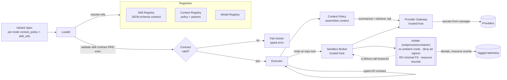

# PRD — P3: Context strategies + Skill registry + Sandbox

| Field | Value |
|---|---|
| Phase / Milestone | P3 / (no numbered milestone; precedes M4) |
| Target window | ~Weeks 12–16 |
| Lead role(s) | Backend + DevOps (co-lead) |
| Supporting role(s) | AI Engineer |
| Status | Draft |
| OpenSpec change | `p3-context-skills-sandbox` |

## 1. Summary

P3 makes two of a node's four override dimensions real and makes node execution **safe**. First,
it implements **context strategies** as pluggable, named policies with typed params —
`full-history`, `sliding-window (window size)`, `summarization (summarizer model)`,
`rag-retrieval (top-k)`, `semantic-compaction` — so a node's context assembly is swappable
per-node purely by config, deterministic given that config. Second, it **hardens the Skill
Registry**: every entry carries a JSON-schema contract, and the runtime validates a skill's
availability and argument shape against that contract **before** the skill is allowed to run,
failing closed on any mismatch. Third — the sharpest security boundary in the whole program — it
introduces the **sandbox**: skills execute *arbitrary tool code discovered in the target repo*,
which is untrusted, so every node runs in a subprocess/container isolate with **no ambient
credentials**, least-privilege network and filesystem, and enforced resource bounds. P3's exit is
concrete and testable: a node using a repo tool executes inside the sandbox with no ambient creds,
and a context policy is swappable per node via config.

## 2. Problem & context

P2 shipped the Configuration Layer, the four registries, the Loader/Executor, and the provider
gateway — but with two deliberate stubs. The `context_policy` field exists and is selectable, yet
only the `full` policy is implemented. And skills are run **trusted / built-in**: there is no
isolation boundary, so executing a tool discovered in a target repo would run untrusted third-party
code with the platform's ambient credentials and full host access. Both are unacceptable to carry
forward:

- **Context is a first-class evaluation lever.** The improvement engine (P5.5) will *swap context
  policies* as a change operator ("context overflow → switch to summarization or sliding window").
  That operator is meaningless until the policies exist and are swappable per node by config alone.
  Without P3, every node is forced onto `full` history — the exact anti-pattern (lost-in-the-middle,
  context overflow) the platform is meant to diagnose.
- **Executing discovered code with ambient credentials is a critical vulnerability.** The platform
  ingests arbitrary repos and will *run their tool code*. A tool that reads `~/.aws/credentials`,
  exfiltrates the provider API key from an environment variable, or makes an outbound POST to an
  attacker endpoint must be structurally unable to do so — not merely discouraged. This is the
  project's sharpest security boundary and cannot be retrofitted after the fact.
- **A tool contract that isn't validated before execution fails open.** A skill whose arguments
  violate its JSON schema, or whose declared tool isn't actually available, must be rejected *before*
  the implementation is invoked. Validating after the call has already fired defeats the purpose.

**Upstream state assumed:** P2's Configuration Layer (shim, Variant Spec, `config_hash`), the four
registries with the P2 Skill Registry baseline (name → JSON-schema contract + impl handle) and the
`context_policy` field + pluggable policy interface, the Runtime loader/executor, and the provider
gateway with secrets sourced from a manager. P2.5's OTel substrate is available to instrument the
sandbox boundary but is not a hard dependency for P3's exit.

## 3. Goals & non-goals

### Goals
- G1. **Context policies as named strategies with typed params**, all behind the P2 pluggable
  interface: `full-history`, `sliding-window {window_size}`, `summarization {summarizer_model_ref}`,
  `rag-retrieval {top_k, retriever_ref}`, `semantic-compaction {target_tokens}`.
- G2. A context policy is **swappable per node via config alone** — changing a node's
  `context_policy` (and its params) requires no workflow-code change and produces a new `config_hash`.
- G3. Context assembly is **deterministic given the policy config + inputs + seed** — the same
  policy, params, conversation, and seed produce byte-identical assembled context (or, where a
  summarizer/retriever LLM is involved, an identical resolved request under fixed seed).
- G4. **Skill Registry hardened**: every entry carries a JSON-schema contract; the registered schema
  is itself validated at registration; the runtime validates **tool availability + argument shape**
  against the contract **before execution**, and **fails closed** on any contract mismatch.
- G5. **Sandbox runner**: each node executes inside a subprocess/container isolate. Skill/tool code
  from the target repo runs *only* inside the sandbox.
- G6. **No ambient credentials**: the sandbox inherits no provider API keys, cloud credentials,
  environment secrets, tokens, or credential files. Nothing a discovered tool can read yields a
  usable credential.
- G7. **Least-privilege network + filesystem**: default-deny egress (allowlist only); a read-only,
  minimal filesystem view scoped to the node's declared working set; no access to the host, other
  runs, or the secrets manager.
- G8. **Resource bounds**: per-node CPU, memory, wall-clock, process/PID, and output-size limits;
  breach terminates the isolate and fails the node closed with a typed error.
- G9. An explicit **untrusted-code threat model** documenting the boundary, the attacks in scope
  (credential theft, egress/exfiltration, host escape, resource exhaustion, cross-run contamination),
  and how each is denied.

### Non-goals (explicitly deferred, with the owning phase)
- **Context-policy *change operators*** (auto-swapping a policy in response to a diagnosis) — **P5.5**.
  P3 ships the policies and their swappability; P5.5 decides *when* to swap.
- **Behavioral confirmation of agentic patterns** (iteration counts, memory R/W, HITL) — **P5**
  (needs dynamic tracing). P3 does not classify workflows.
- **Just-in-time / sub-agent context isolation semantics as optimizer operators** — the AI Engineer
  *advises* on these here so the interface admits them, but they land as **P5.5** operators.
- **The eval harness, scoring, and statistical treatment** — **P4**. P3 makes policies and sandboxed
  tools runnable; measuring which policy wins is P4.
- **Provider-gateway calls inside the sandbox.** Summarizer/retriever/tool LLM calls a policy or
  skill needs are **brokered by the trusted host**, not made from inside the isolate (see §8) — so
  the sandbox never needs and never receives a provider key. This is a design invariant, not a
  deferral.
- **RAG index construction / embedding pipelines at scale** — P3 ships the `rag-retrieval` policy
  against a retriever handle with a top-k contract; large-corpus index build-out is later.

## 4. Users & personas

- **Platform engineer (internal, primary)** — assigns a context policy per node, registers skills
  with contracts, and runs a discovered repo tool to confirm it executes inside the sandbox with no
  ambient creds.
- **Security reviewer (internal)** — audits the sandbox against the threat model; must be able to
  point at a test proving a repo tool's egress and credential-read attempts are denied.
- **Downstream subsystems** — the Improvement Engine (P5.5) consumes context-policy swapping as a
  change operator; the Metrics substrate (P2.5) instruments the sandbox boundary (context-window
  utilization, tool-error rate, sandbox denials); the Eval Harness (P4) runs variants that differ
  only in a node's context policy.
- **Workflow owner (end user)** — selects a context strategy for a node to trade context fidelity
  against cost/latency, trusting that running the repo's own tools cannot compromise their secrets.

## 5. User stories / jobs-to-be-done

**Platform engineer**
- As a platform engineer, I want to set a node's context policy to `sliding-window` with a window
  size (or `summarization` with a summarizer model, or `rag-retrieval` with a top-k) purely in
  config, so that I can compare context strategies without editing workflow code.
- As a platform engineer, I want to register a skill with a JSON-schema contract and have the runtime
  reject a call whose args violate the schema *before* the tool runs, so that a bad binding fails
  loudly and safely.
- As a platform engineer, I want a discovered repo tool to run in isolation with no ambient
  credentials, so that ingesting an unknown repo can never leak our provider keys.

**Security reviewer**
- As a security reviewer, I want a test that proves a repo tool attempting outbound network egress is
  denied, so that the exfiltration path is closed by construction, not by policy prose.
- As a security reviewer, I want a test that proves a repo tool reading the environment/credential
  files finds no usable secret, so that "no ambient credentials" is verified, not asserted.

**Downstream subsystem owner**
- As the improvement engine, I want context policy to be a per-node config field with stable params
  and a stable `config_hash`, so that "swap context policy" is a clean change operator (P5.5).
- As the metrics substrate, I want the sandbox boundary to emit tool-error rate, context-window
  utilization, and sandbox-denial events, so that P4/P4.5 can slice on them.

**Workflow owner**
- As a workflow owner, I want a context policy to behave deterministically given its config and seed,
  so that a variant comparison isn't confounded by nondeterministic context assembly.

## 6. Functional requirements

These map 1:1 to the OpenSpec requirements in
`openspec/changes/p3-context-skills-sandbox/specs/`.

**Context strategies (`context-strategies`)**
- FR1. The system SHALL provide five named context policies behind the P2 policy interface:
  `full-history`, `sliding-window`, `summarization`, `rag-retrieval`, `semantic-compaction`; each
  SHALL declare a typed params schema.
- FR2. `sliding-window` SHALL take a `window_size` (turns or tokens) and assemble context from the
  most recent messages within that bound; `summarization` SHALL take a `summarizer_model_ref`;
  `rag-retrieval` SHALL take `top_k` and a `retriever_ref`; `semantic-compaction` SHALL take a
  `target_tokens` (or compression ratio) bound. Each policy SHALL reject params that violate its
  params schema at resolution time (fail closed).
- FR3. A node's context policy SHALL be selectable per node **via config alone** (the
  `context_policy` field of the Variant Spec) with no workflow-code change; changing the policy or
  its params SHALL change the `config_hash`.
- FR4. Given identical policy + params + input conversation + seed, context assembly SHALL be
  deterministic: for policies with no LLM step (`full-history`, `sliding-window`,
  `semantic-compaction` where deterministic), byte-identical assembled context; for policies with an
  LLM step (`summarization`, `rag-retrieval` reranking), an identical *resolved request* to the
  provider under the fixed seed (P2's reproducibility contract).
- FR5. A policy that needs a model (summarizer) or a retriever SHALL reference it by registry ref
  (`summarizer_model_ref`, `retriever_ref`) and the LLM/retrieval call SHALL be executed by the
  trusted host via the provider gateway — never from inside a sandboxed node.
- FR6. Each policy SHALL emit context-assembly telemetry (assembled token count, source-message
  count, drop/compaction ratio, retrieved-chunk count) tagged with the P0 tag set, so P4 can slice
  by policy.

**Skill Registry (`skill-registry`)**
- FR7. Every Skill Registry entry SHALL carry a JSON-schema contract for its inputs and outputs; the
  contract itself SHALL be validated as well-formed JSON Schema at registration, and a malformed
  contract SHALL be rejected.
- FR8. Before a node executes a skill, the runtime SHALL validate (a) that the named tool is
  **available** (the referenced skill version resolves and its implementation handle is bindable in
  the sandbox) and (b) that the **argument object conforms** to the entry's input JSON-schema.
- FR9. On any contract mismatch — unavailable tool, argument-schema violation, or a tool **result**
  that violates the output JSON-schema — the runtime SHALL **fail closed**: it SHALL NOT invoke (or
  SHALL discard the result of) the implementation and SHALL surface a typed error naming the skill
  and the violated field.
- FR10. Contract validation SHALL occur **before** the skill implementation is invoked for inputs
  (pre-execution) and **before** the result is passed downstream for outputs (post-execution,
  pre-propagation); a skill SHALL never run on unvalidated arguments.
- FR11. Skill binding and contract validation SHALL be deterministic given the skill `version_id`
  and argument object, and SHALL not depend on ambient host state.

**Sandbox (`sandbox`)**
- FR12. Each node whose execution involves skill/tool code from the target repo SHALL run inside an
  isolate (subprocess or container) separate from the host process; discovered tool code SHALL run
  **only** inside the isolate.
- FR13. The isolate SHALL start with **no ambient credentials**: no provider API keys, no cloud
  credential files, no secrets-manager access, and no inherited environment secrets. A tool reading
  the environment, credential files, or metadata endpoints SHALL find no usable credential.
- FR14. The isolate SHALL enforce **least-privilege network egress**: default-deny, with only an
  explicit allowlist permitted; an un-allowlisted outbound connection attempt SHALL be blocked and
  recorded as a denial.
- FR15. The isolate SHALL enforce a **least-privilege filesystem**: a minimal, read-only-by-default
  view scoped to the node's declared working set; it SHALL NOT expose the host filesystem, other
  runs' data, the repo's `.git` credentials, or the secrets store.
- FR16. The isolate SHALL enforce **resource bounds** — CPU, memory, wall-clock timeout,
  process/thread count, and output size — and on breach SHALL terminate the isolate and fail the
  node closed with a typed resource error, without affecting other runs.
- FR17. Provider/model and retrieval calls a sandboxed node needs SHALL be **brokered by the trusted
  host** through a narrow, audited channel; the sandbox SHALL NOT hold or receive the provider
  credential, and the broker SHALL apply the same validation and least-privilege rules.
- FR18. Sandbox lifecycle and every denied action (egress block, credential-read attempt, resource
  breach, filesystem-scope violation) SHALL emit a tagged telemetry event for audit, without
  leaking secret values into the event.
- FR19. Sandbox isolation SHALL fail **closed**: if an isolate cannot be created with the required
  restrictions, the node SHALL NOT execute the untrusted code on the host as a fallback.

## 7. Non-functional requirements

- **Security (primary, first-class).** *No ambient credentials* (FR13) and *default-deny egress*
  (FR14) are tested requirements with adversarial scenarios, not footnotes. The threat model
  enumerates: credential theft, network exfiltration, host/container escape, resource exhaustion
  (fork bomb, memory bomb, infinite loop), cross-run contamination, and filesystem traversal — each
  mapped to the control that denies it. The sandbox is the platform's sharpest boundary and is
  reviewed by a security reviewer against this model before P3 closes.
- **Fail-closed everywhere.** Contract validation (FR9), policy param validation (FR2), and isolate
  creation (FR19) all fail closed. There is no path in which unvalidated arguments run, a broken
  isolate downgrades to host execution, or a contract mismatch silently proceeds.
- **Determinism / reproducibility.** Context assembly is deterministic given config + seed (FR4),
  extending P2's `config_hash` + seed contract to the context dimension. Sandbox execution does not
  introduce nondeterminism into the resolved request beyond the provider's own (P2 Q2 ceiling).
- **Least privilege (quantified defaults).** Egress: deny-all with an allowlist of zero hosts by
  default. Filesystem: read-only, scoped to a per-node working directory; no host mounts. Resource
  defaults: e.g. 1 vCPU, 512 MB RAM, 60 s wall-clock, 128 processes, 8 MB captured output — all
  configurable per node/skill but never *un*bounded.
- **Blast radius / reversibility (DevOps prime directives).** One node's sandbox breach cannot affect
  another run, the host, or the control plane. Isolates are ephemeral and destroyed after each node;
  no state persists between nodes except through the typed I/O contract via the trusted host.
- **Performance.** Isolate cold-start overhead SHALL be bounded (target < 500 ms p50 for the
  subprocess path; container path amortized via a warm pool) so sandboxing does not dominate per-node
  latency for short tool calls. Context assembly for `full-history`/`sliding-window`/
  `semantic-compaction` (no LLM) SHALL complete in < 50 ms for typical conversation sizes.
- **Observability.** Every sandbox denial and every contract rejection is a tagged event (P0 tag
  set); secret values never appear in these events, logs, or traces (inherited P2 secret-scrub rule).

## 8. System design summary

**Execution path with the sandbox and context policies inserted.**

**Context policy interface (Backend lens).** Each policy implements the P2 pluggable interface:
`Policy.Assemble(conversation, params, seed) → AssembledContext`. Policies are pure/host-side and
never run inside the sandbox. A policy that needs an LLM (summarization) or retriever
(rag-retrieval) calls out through the provider gateway on the trusted host — so the sandbox never
needs a provider key for context assembly. Params are validated against the policy's params schema
at resolution (fail closed on bad params).

**Skill contract validation (Backend lens).** The Skill Registry entry is
`{name, version_id, input_schema, output_schema, impl_handle}`. Validation has two gates: (1) at
**registration** the two schemas are checked to be well-formed JSON Schema; (2) at **execution** the
Loader/Executor checks tool availability + input-arg conformance *before* invoking the impl, and
output conformance *before* propagating the result. Any failure is a typed, fail-closed error.

**Sandbox broker (DevOps lens).** The trusted host never hands a credential to the isolate. When a
sandboxed tool must make an LLM/retrieval/allowlisted call, it requests it over a narrow broker
channel; the host performs the call via the gateway (with real secrets) and returns only the
result. This is the seam that keeps "no ambient credentials" true even for tools that legitimately
need a model call. Isolates are ephemeral, destroyed per node; a warm pool amortizes container
start cost.

**Storage / interfaces.**
- Context Registry entries (`policy_kind`, `params_json`) are P2 registry rows — immutable,
  content-addressed, referenced by `context_policy`.
- Skill Registry entries gain first-class `input_schema` / `output_schema` columns; the impl handle
  points at a repo-tool entrypoint executed only in-sandbox.
- `Sandbox.Run(node, workingSet, resourceBounds, egressAllowlist) → Result` — creates the isolate,
  runs the node's tool code, brokers permitted calls, tears down.
- `Broker.Complete(request)` / `Broker.Retrieve(query, top_k)` — host-side, credentialed; the
  isolate calls a stub that RPCs the broker.

## 9. Design by role lens

**Backend (co-lead) — explore → design → implement → test → harden → review.**
Two of the four backend realities dominate P3:
- *Contracts outlive code.* The Skill Registry's JSON-schema contract is a public contract that the
  runtime enforces at a boundary; validating **before execution** (and before propagation for
  outputs) is the "model invariants into the schema" discipline applied to tool I/O — the runtime,
  not each skill author, guarantees no skill runs on malformed args. The context-policy interface is
  likewise a contract P5.5's change operators build on, so its params surface is designed additively.
- *Partial failure / fail-closed.* Every new decision point — bad params, unavailable tool,
  arg-schema violation, output-schema violation, un-creatable isolate — resolves to a typed,
  fail-closed error, never a silent proceed or a host-execution fallback. The Backend owns making
  each of these a caught, named error rather than an application-discipline hope. Determinism of
  context assembly (given config + seed) extends P2's reproducibility contract to the context
  dimension.

**DevOps (co-lead) — blast radius, reversible, observable, least-privilege.**
This phase *is* the DevOps prime-directive showcase — its security & containers routing and the
"secrets never touch repo·logs·terminal" rule are the spine of the sandbox:
- *Least privilege / secrets never touch the isolate.* The isolate inherits **no** ambient
  credentials; provider keys stay on the trusted host and are brokered, never injected into the
  sandbox (FR13, FR17). Default-deny egress with an explicit allowlist (FR14) and a read-only,
  scoped filesystem (FR15) are the containment controls.
- *Blast radius before implementation + reversible or say it isn't.* Isolates are ephemeral and
  per-node; resource bounds (FR16) cap exhaustion; a breach terminates one isolate without touching
  other runs, the host, or the control plane. Isolate creation fails closed (FR19) — no downgrade to
  host execution.
- *If it isn't observable, it isn't done.* Every denied action and resource breach emits a tagged
  audit event (FR18) — secret values scrubbed — so the security reviewer can *see* the boundary
  holding, and P4/P4.5 can slice on sandbox-denial and tool-error rates.
- *Automate the second time.* The adversarial sandbox tests (egress-denied, cred-read-finds-nothing,
  fork-bomb-contained) are CI pipeline steps, not manual checks.

**AI Engineer (support) — context-engineering discipline.**
Advises on **context-policy semantics** so the interface is faithful to the four agentic
disciplines and admits P5.5's change operators without a breaking change:
- Names the policy family from the context-engineering vocabulary — full history / sliding window /
  summarization / RAG (just-in-time retrieval) / semantic compaction — and pins the params that make
  each a *distinct, measurable* strategy (window size, top-k, summarizer model, compaction target).
- Flags that **summarization** and **compaction** are lossy and their quality is itself measurable
  (P4): the interface must emit drop/compaction ratios so a "compaction that dropped the answer" is
  later diagnosable. Confirms **just-in-time retrieval** and **sub-agent context isolation** map onto
  the same interface as future operators (P5.5), so the params surface reserves room for them now.
- Enforces the discipline that a context policy's effect is a hypothesis to be *measured*, not
  assumed — P3 makes the policies swappable and instrumented; P4 decides which wins.

## 10. Dependencies

- **Requires (upstream):** P2 Configuration Layer (shim, Variant Spec, `config_hash`), the four
  registries (esp. the P2 Skill Registry baseline and the `context_policy` field + pluggable policy
  interface), the Runtime loader/executor, and the provider gateway with secrets from a manager.
  P2.5 OTel substrate is used to emit sandbox/context telemetry (soft dependency).
- **Unblocks:** P4 (eval harness runs variants differing only by context policy; sandbox lets it run
  repo tools safely), P4.5 (attribution slices on tool-error and context-utilization metrics), P5.5
  (context-policy swap and skill-add become change operators; the context-engineering disciplines
  become named change operators), P3.5 (Tool Use / RAG structural detection keys off skill bindings
  and the `rag-retrieval` policy).

## 11. Risks & mitigations

| Risk | Owner | Mitigation |
|---|---|---|
| Sandbox escape lets repo tool reach host / secrets | DevOps | Container/subprocess isolate with dropped privileges, no host mounts, no ambient creds; broker pattern for credentialed calls; escape-attempt test in CI; security-reviewer sign-off vs. threat model |
| Ambient credential leaks into the isolate (env, files, metadata endpoint) | DevOps | Isolate starts with a scrubbed env and no credential mounts; metadata endpoint blocked by deny-all egress; cred-read-finds-nothing test asserts no usable secret |
| Tool exfiltrates data via network egress | DevOps | Default-deny egress, zero-host allowlist by default; egress-denied test; every attempt recorded as a denial event |
| Resource exhaustion (fork bomb, memory bomb, infinite loop) starves the host | DevOps | Per-node CPU/mem/PID/wall-clock/output bounds; breach terminates the isolate only; other runs unaffected (blast-radius test) |
| Skill runs on malformed args (validation after the fact) | Backend | Pre-execution input-schema validation; fail closed before invoke; output-schema validated before propagation; arg-violation-rejected test |
| Context policy nondeterministic → confounds variant comparison | Backend / AI | Deterministic assembly given config + seed; summarizer/retriever calls carry the seed; determinism test per policy |
| Context interface too narrow for P5.5 operators | Backend / AI | Co-design params surface with AI Engineer to admit just-in-time retrieval + sub-agent isolation; additive param evolution |
| Broker becomes a hole (over-broad credentialed calls from sandbox) | DevOps / Backend | Broker is narrow + audited; applies same validation + least-privilege; requests are logged; no raw credential ever crosses to the isolate |
| Lossy compaction silently drops the answer | AI | Emit drop/compaction ratio + retrieved-chunk telemetry so P4 can measure; policy never silently truncates without an event |
| Isolate cold-start dominates latency for tiny tool calls | DevOps | Bounded subprocess start; warm container pool; measured against the < 500 ms p50 target |

## 12. Rollout & test strategy

- **Fixtures.** (a) A conversation fixture long enough to exercise every context policy at a known
  boundary (window truncation, summarization trigger, top-k retrieval, compaction target). (b) A
  **malicious repo tool** fixture set: one that reads env/credential files, one that attempts
  outbound egress, one fork/memory bomb, one that writes outside its working set, one that returns a
  result violating its output schema.
- **Context-policy tests.** Per-node config swap changes only `context_policy` → assembly changes,
  `config_hash` changes, workflow code unchanged. Determinism: same policy + params + conversation +
  seed → byte-identical assembly (LLM-free policies) / identical resolved request (LLM policies).
  Param validation: out-of-range `window_size`/`top_k` rejected at resolution (fail closed).
- **Skill-contract tests.** Malformed contract rejected at registration. Arg-schema violation → skill
  not invoked, typed error. Output-schema violation → result discarded before propagation. Missing
  tool → fail closed, node does not execute.
- **Sandbox adversarial tests (CI, DevOps + AI).**
  - *No ambient creds:* the cred-reading tool runs; assert it finds no usable provider key / cloud
    credential in env, files, or metadata endpoint.
  - *Egress denied:* the exfiltration tool's un-allowlisted outbound connection is blocked and a
    denial event is emitted.
  - *Resource bounds:* fork/memory bomb is contained; the isolate is terminated, the node fails
    closed with a typed resource error, and a second concurrent run is unaffected (blast radius).
  - *Filesystem scope:* a write/read outside the working set is denied; the host FS and secrets store
    are not reachable.
  - *Fail-closed isolate:* simulate isolate-creation failure → the node does **not** run the tool on
    the host.
  - *Broker boundary:* a sandboxed tool's brokered LLM call succeeds without the isolate ever holding
    the credential; a tool cannot use the broker to reach a non-allowlisted host.
- **Security review.** A security reviewer signs off the sandbox against the §7 threat model before
  P3 closes; the mapping (attack → control → test) is the review artifact.
- **Rollout.** Internal-only; the sandbox is the *only* path by which repo tool code executes —
  there is no un-sandboxed tool execution flag. Context policies ship behind the existing
  `context_policy` field (additive; `full` remains the default), safe to deploy incrementally.

## 13. Success metrics & acceptance criteria (P3 exit checklist)

- [ ] A node using a **repo tool executes inside the sandbox** with **no ambient credentials**
      (cred-read test finds nothing usable).
- [ ] A **context policy is swappable per node via config alone** — changing `context_policy`
      changes assembly and `config_hash` with no workflow-code change.
- [ ] All five policies (`full-history`, `sliding-window`, `summarization`, `rag-retrieval`,
      `semantic-compaction`) are implemented behind the P2 interface with validated typed params.
- [ ] Context assembly is **deterministic** given policy + params + conversation + seed.
- [ ] A skill whose args **violate its JSON schema is rejected before running**; a tool result
      violating the output schema is discarded before propagation.
- [ ] A malformed skill **contract is rejected at registration**.
- [ ] A repo tool attempting **network egress is denied** and the attempt is recorded.
- [ ] A **resource-exhausting** tool is contained; the isolate is terminated, the node fails closed,
      and other runs are unaffected.
- [ ] A **filesystem-scope violation** (host FS, secrets store, other runs) is denied.
- [ ] Isolate creation **fails closed** — no fallback to host execution of untrusted code.
- [ ] A sandboxed tool's needed LLM/retrieval call is **brokered by the host**; the isolate never
      holds the provider credential.
- [ ] Every sandbox denial and contract rejection emits a **tagged audit event** with no secret
      values leaked.
- [ ] **Security reviewer sign-off** against the threat model is recorded.

## 14. Open questions

- Q1. **Isolate technology.** Subprocess with OS-level sandboxing (seccomp/namespaces/job objects)
  vs. containers vs. microVMs (gVisor/Firecracker/Kata) — what's the default, and where is the
  cold-start/security trade-off drawn for short tool calls? (Proposed: container isolate with a warm
  pool for the default path; microVM available for higher-risk repos.)
- Q2. **Egress allowlist granularity.** Per-skill vs. per-node vs. per-run allowlists — and does a
  legitimately network-using tool (e.g. a repo's search API) declare its hosts in the Skill Registry
  contract? (Proposed: per-skill declared allowlist in the registry entry, default empty.)
- Q3. **Broker surface.** Which call types may a sandboxed tool broker (LLM only, or also
  retrieval/allowlisted HTTP)? How is the broker itself prevented from becoming an egress bypass?
- Q4. **Compaction determinism.** `semantic-compaction` may use an embedding/LLM step; is it scoped
  as deterministic-given-seed (like summarization) or is there a purely deterministic compaction
  variant? (Proposed: both — a deterministic token-budget variant and an LLM-assisted variant.)
- Q5. **Filesystem working set.** How is a node's declared working set derived — from the Skill
  Registry entry, the IR call-site metadata, or an explicit per-node config — and what is the safe
  default when it's unspecified? (Proposed: explicit, default empty read-only.)
- Q6. **Resource-bound defaults per pattern.** Should defaults differ by node type once the Pattern
  Classifier (P3.5) exists (a RAG node vs. a tool-use loop)? Deferred to P3.5/P4 tuning.
