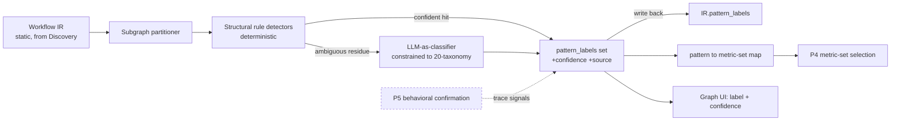

# PRD — P3.5: Pattern Classifier (structural)

| Field | Value |
|---|---|
| Phase / Milestone | P3.5 / M4 |
| Target window | ~Weeks 15–17 (alongside P3's tail) |
| Lead role(s) | AI Engineer |
| Supporting role(s) | System Designer, Frontend |
| Status | Draft |
| OpenSpec change | `p3.5-pattern-classifier` |

## 1. Summary

P3.5 adds a **Pattern Classifier** that labels each **subgraph** of a discovered Workflow IR with
the agentic pattern(s) it implements, each carrying a confidence score. It is a **dispatcher, not
decoration**: its output selects which metrics, failure modes, eval cases, and improvement
operators are in-scope for each subgraph downstream — the mechanism that stops the rest of the
system from measuring a router as if it were a RAG pipeline. Classification runs **structurally**
over the IR topology (a cheap, reliable prior): rule-based detectors fire first and
deterministically for the eight structurally-detectable patterns; an **LLM-as-classifier fallback**
handles only the ambiguous residue, **constrained to the fixed 20-pattern taxonomy** and required
to return a confidence. Behavioral confirmation (iteration counts, planning lists, voting, memory
read/write, HITL pauses) needs dynamic tracing and is explicitly **deferred to P5**. The phase
exits when subgraphs carry pattern labels with confidence and P4's metric-set selection keys off
the label.

## 2. Problem & context

By the end of P3 we can discover a workflow, override any node, run it under tracing, and swap
context policies. But every subgraph looks the same to the machinery that comes next. Without a
pattern label, P4 would have to either compute *every* metric on *every* node (wasteful, noisy, and
often meaningless — retrieval relevance@k on a node with no retriever) or make the user hand-label
each subgraph. Concretely, without P3.5:

- **Metric selection is undirected.** The eval harness (P4) has no principled way to pick the
  metric-set per subgraph — a router should be scored on misroute-rate, a RAG pipeline on retrieval
  relevance@k / faithfulness, a reflection loop on quality-gain-per-revision. Absent a label these
  are applied blindly or not at all.
- **Failure-taxonomy scoping is undirected.** P4.5 diagnosis would check failure modes a subgraph
  cannot exhibit (looking for misroutes in a linear chain) and miss ones it can.
- **Improvement operators are ungated.** P5.5 could propose "add rerank" to a subgraph with no
  retriever, or "route cheap cases to a smaller model" where no cost-aware routing exists.
- **Eval-case targeting is undirected.** P4's generator would not know that a router needs
  boundary/ambiguous inputs across all branches, or that a reflection loop needs cases requiring
  multiple revisions.

**Upstream state assumed:** P0's frozen `workflow-ir.schema.json` — including the reserved optional
`pattern_labels` field (nodes and/or subgraphs) and typed edges (`kind ∈ {data, control}`); P1's
Discovery emitting a valid IR with nodes, edges, `tools_skills`, and framework-source metadata; P2
registries so "node bound to registry tools" is a checkable structural fact. P3.5 consumes the
**static IR only** — it does not require runtime traces, which is exactly why it can ship now and
why behavioral confirmation waits for P5.

## 3. Goals & non-goals

### Goals
- G1. **Per-subgraph classification.** Partition the IR into subgraphs and emit a *set* of pattern
  labels, each tied to the specific subgraph it applies to — never one label for the whole
  workflow. A workflow with a router in one region and a RAG pipeline in another gets both,
  separately.
- G2. **Eight structural detectors**, deterministic over IR topology: linear chain → **Prompt
  Chaining**; conditional fan to N specialists → **Routing**; fan-out→merge → **Parallelization**;
  output loops back to a generate node → **Reflection**; node bound to registry tools → **Tool
  Use**; manager dispatching to role nodes + shared context → **Multi-Agent Collaboration**;
  retriever+embed+rerank→generator → **Retrieval/RAG**; cost/complexity-conditioned model selection
  → **Resource-Aware Optimization**.
- G3. **Fixed 20-pattern taxonomy** as the closed vocabulary (control-flow / capability /
  coordination / governance groups). No classifier — rule or LLM — may emit a label outside it.
- G4. **Per-pattern confidence** on every label, from both the rule layer (calibrated per detector)
  and the LLM fallback.
- G5. **Rules-first, constrained-LLM fallback.** Rule detectors are the primary, deterministic
  layer; the LLM classifier runs only on ambiguous subgraphs, is constrained to the taxonomy, and
  must return a confidence — same discipline as the diagnosis engine: rules first, LLM for the
  fuzzy residue, never unverified.
- G6. **Pattern→metric-set dispatch.** Deliver the mapping table and expose the labels so that P4's
  metric-set selection keys off them (RAG subgraph → retrieval metrics; router → misroute-rate).
- G7. **Write labels back to the IR** via the reserved `pattern_labels` field; **surface labels +
  confidence on the graph UI**.

### Non-goals (explicitly deferred, with the owning phase)
- **Behavioral confirmation** — iteration count > 1 on a self-edge (confirms Reflection vs.
  one-shot), a planning node emitting a consumed task list (Planning), sample-N-then-vote
  (Self-Consistency / Reasoning Techniques), memory read/write between turns (Memory Management),
  human-approval pauses (Human-in-the-Loop) — needs dynamic tracing. **Deferred to P5.** P3.5 MAY
  emit a *structural candidate* for these with low confidence but SHALL NOT assert them as
  confirmed.
- **Wiring pattern → failure-taxonomy scoping and pattern → eval-case targeting** end-to-end —
  **P5**. P3.5 delivers the label and the pattern→metric-set table; the full dispatch into
  diagnosis and eval generation lands with behavioral classification.
- **Pattern → improvement-operator gating and anti-pattern diagnoses** ("a Reflection loop that
  never improves", "a Router that sends everything to one branch") — **P5.5+**, folded into the
  improvement engine. Anti-pattern detection needs behavioral signal to be meaningful.
- **Governance/capability patterns with no structural signature** (Learning & Adaptation, Goal
  Setting & Monitoring, most of Guardrails & Safety) — remain in the taxonomy as vocabulary but are
  **not structurally detectable**; they await P5 behavioral signals.
- **Interactive re-labeling / user override UI** beyond read-only display — later. P3.5 surfaces
  labels + confidence; editing them is out of scope.

## 4. Users & personas

- **AI Engineer (internal, primary owner)** — authors and calibrates the structural detectors and
  the constrained LLM fallback; owns the taxonomy and the pattern→metric-set table.
- **Downstream subsystems** — the **Eval Harness (P4)** reads `pattern_labels` to select the
  metric-set per subgraph; the **Analysis & Improvement Engine (P4.5/P5.5)** reads them to scope
  the failure taxonomy and gate improvement operators; **eval-set generation (P4/P5)** reads them to
  target pattern-stressing cases. All consume the label contract this phase freezes.
- **Workflow owner (end user, via the graph UI)** — sees each subgraph annotated with its
  pattern(s) and confidence, so the graph reads as *what kind of workflow* each region is, and can
  tell a high-confidence rule hit from a low-confidence LLM guess.

## 5. User stories / jobs-to-be-done

**AI Engineer**
- As an AI engineer, I want each subgraph labeled with its agentic pattern(s) and confidence, so
  that P4 measures each region with the right metric-set instead of computing everything everywhere.
- As an AI engineer, I want the LLM fallback constrained to a fixed taxonomy with confidence, so
  that its outputs are aggregatable and never invent a pattern the rest of the system can't consume.
- As an AI engineer, I want deterministic rule detectors to run first, so that the common,
  unambiguous topologies never pay an LLM call and never vary run to run.

**Downstream subsystem owner**
- As the eval harness, I want to read a subgraph's `pattern_labels` and look up its metric-set, so
  that a RAG subgraph gets retrieval relevance@k/faithfulness and a router gets misroute-rate.
- As the improvement engine, I want to know a subgraph is a Reflection loop (or is *not* a RAG
  pipeline), so that I only propose operators valid for that pattern.

**Workflow owner (UI)**
- As a workflow owner, I want each subgraph on the graph annotated with its pattern label and
  confidence, so that I understand the shape of my own workflow.
- As a workflow owner, I want to distinguish a confident rule-based label from a low-confidence LLM
  guess, so that I know how much to trust the annotation.

## 6. Functional requirements

These map 1:1 to the OpenSpec requirements in
`openspec/changes/p3.5-pattern-classifier/specs/pattern-classifier/`.

**Classification model**
- FR1. The classifier SHALL partition the IR into subgraphs and classify **per-subgraph**, emitting
  a *set* of `{pattern, confidence, subgraph_ref}` labels — never a single label for the whole
  workflow.
- FR2. Two or more patterns applying to **different subgraphs** of one workflow SHALL each be
  emitted against their own subgraph (e.g. Routing on one region, RAG on another); the labels
  coexist without conflict.
- FR3. Every emitted label SHALL name a pattern drawn **only** from the fixed 20-pattern taxonomy
  (control-flow / capability / coordination / governance). A label outside the taxonomy SHALL be
  rejected.
- FR4. Every emitted label SHALL carry a `confidence` in `[0,1]` and a `source` ∈ {`rule`, `llm`}
  identifying which layer produced it.

**Structural detectors (rules-first)**
- FR5. The classifier SHALL provide deterministic structural detectors for the eight patterns in
  §8.2; each detector is a pure function of IR topology + node metadata and SHALL produce identical
  labels on identical IR input across runs.
- FR6. A **linear chain** of ≥ 2 LLM nodes connected by data edges with no fan-out/fan-in/loop
  SHALL be labeled **Prompt Chaining**.
- FR7. A node with **control edges** fanning conditionally to N ≥ 2 specialist nodes SHALL be
  labeled **Routing**.
- FR8. A **fan-out to ≥ 2 parallel nodes that reconverge (merge) at a downstream node** SHALL be
  labeled **Parallelization**.
- FR9. A node whose **output loops back** (a cycle / self-edge) to a generate node SHALL be labeled
  **Reflection** as a *structural candidate* — confirmation that it actually iterates > 1 is
  behavioral and deferred to P5, so its structural confidence SHALL reflect that.
- FR10. A node **bound to one or more registry tools/skills** (`tools_skills` non-empty, resolvable
  against the Skill Registry) SHALL be labeled **Tool Use**.
- FR11. A **manager node dispatching to role nodes over a shared context** SHALL be labeled
  **Multi-Agent Collaboration**.
- FR12. A **retriever + embed + rerank chain feeding a generator** SHALL be labeled **Retrieval/RAG**.
- FR13. A **cost/complexity-conditioned model-selection** structure (a control branch selecting
  among model tiers) SHALL be labeled **Resource-Aware Optimization**.

**Constrained LLM fallback**
- FR14. When no structural detector fires with sufficient confidence on a subgraph (ambiguous
  topology), the classifier SHALL invoke an **LLM-as-classifier** fallback.
- FR15. The LLM fallback SHALL be **constrained to the fixed 20-pattern taxonomy** — it selects from
  the enumerated pattern set and cannot emit free-text or out-of-taxonomy labels — and SHALL return
  a `confidence` per label.
- FR16. Rule detectors SHALL take precedence: on a subgraph where a rule detector fires
  confidently, the LLM fallback SHALL NOT override it. The LLM runs only on the ambiguous residue.

**Dispatch**
- FR17. The classifier SHALL deliver a **pattern→metric-set mapping** (§8.4) such that P4's
  metric-set selection keys off a subgraph's `pattern_labels`: a **RAG** subgraph selects retrieval
  metrics (relevance@k, faithfulness), a **Routing** subgraph selects routing metrics (misroute-rate,
  routing-accuracy), a **Reflection** subgraph selects iteration/convergence/quality-gain metrics.
- FR18. The classifier SHALL write labels back to the IR via the reserved `pattern_labels` field
  additively — its presence or absence SHALL NOT invalidate the IR against the P0 schema.

**Deferred boundary (explicit)**
- FR19. The classifier SHALL NOT assert a **behavioral** pattern (iteration counts, planning lists,
  voting, memory R/W, HITL pauses) as confirmed from structure alone; such patterns are marked
  structural candidates at most and their confirmation is deferred to **P5**.

**UI**
- FR20. The graph UI SHALL surface each subgraph's pattern label(s) and confidence, visually
  distinguishing a rule-sourced label from an LLM-sourced one, with a no-label / empty state for
  unclassified subgraphs.

## 7. Non-functional requirements

- **Determinism (rule layer).** Structural detectors SHALL be pure functions of IR topology + node
  metadata: the same IR SHALL produce byte-identical labels across runs, with no reliance on the
  LLM for any subgraph a rule covers. This is a first-class, tested requirement.
- **Latency.** Structural classification of an IR of ≤ 200 nodes SHALL complete in < 500 ms
  (topology walks are linear in nodes+edges). The LLM fallback is invoked only on ambiguous
  subgraphs; a workflow whose subgraphs are all rule-covered SHALL make **zero** LLM calls.
- **Cost.** Because rules cover the common topologies, LLM-classifier spend scales with the
  *ambiguous residue*, not with workflow size — the deliberate consequence of rules-first.
- **Constrainedness & aggregatability.** LLM outputs SHALL be structured (pattern ∈ taxonomy +
  confidence), never free-text, so labels aggregate across workflows and feed metric selection
  mechanically.
- **Reproducibility of the LLM layer.** The LLM fallback SHALL run with a pinned model + seed +
  temperature captured in the classification record, so a given IR + classifier config is
  reproducible and auditable (keyed by `config_hash`, consistent with project convention).
- **Additivity.** Writing `pattern_labels` SHALL be additive to the IR — no `ir_version` MAJOR bump,
  no invalidation of consumers written before P3.5.
- **Calibration honesty.** Rule-detector confidences SHALL be calibrated against a hand-labeled
  fixture set; a structural-only label for a behavioral pattern (e.g. Reflection) SHALL carry a
  confidence that reflects the missing behavioral confirmation, not a false 1.0.

## 8. System design summary

### 8.1 Where it sits

### 8.2 Structural signatures (the eight detectors)

| Pattern | Group | Structural signature over the IR | Confidence note |
|---|---|---|---|
| **Prompt Chaining** | control-flow | ≥ 2 LLM nodes in a linear data-edge chain, no fan-out/fan-in/loop | High — topology fully determines it |
| **Routing** | control-flow | one node with **control** edges fanning conditionally to N ≥ 2 specialists | High |
| **Parallelization** | control-flow | fan-out to ≥ 2 independent nodes that reconverge at a merge node | High |
| **Reflection** | control-flow | output cycles back (self-edge / loop) to a generate node | **Medium** — structure shows the loop exists; that it iterates > 1 is behavioral (P5) |
| **Tool Use** | capability | node's `tools_skills` non-empty and resolvable in the Skill Registry | High |
| **Multi-Agent Collaboration** | coordination | a manager node dispatching (control edges) to role nodes over shared context | Medium–High |
| **Retrieval/RAG** | capability | retriever + embed + rerank nodes chained into a generator | High |
| **Resource-Aware Optimization** | governance | control branch selecting among model tiers on a cost/complexity condition | Medium–High |

### 8.3 The fixed 20-pattern taxonomy

The closed vocabulary. Patterns operate at different layers and are **not mutually exclusive** — a
real workflow is a composition (e.g. "Routing → per-branch Tool Use → Reflection, under Guardrails,
with Memory"). ✅ = a structural detector ships in P3.5; ⏳ = detection deferred to P5 (behavioral).

| # | Pattern | Group | P3.5 structural detector | Primary P5 behavioral signal |
|---|---|---|---|---|
| 1 | Prompt Chaining | Control-flow | ✅ linear data chain | — |
| 2 | Routing | Control-flow | ✅ conditional control fan-out | branch-hit distribution |
| 3 | Parallelization | Control-flow | ✅ fan-out→merge | real branch independence |
| 4 | Reflection | Control-flow | ✅ loop-back (candidate) | iteration count > 1 |
| 5 | Planning | Control-flow | ⏳ | planning node emits a consumed task list |
| 6 | Prioritization | Control-flow | ⏳ | ordering/scoring of tasks at runtime |
| 7 | Exploration & Discovery | Control-flow | ⏳ | branching search trajectories |
| 8 | Tool Use | Capability | ✅ registry-tool binding | tool-call→observe→retry trajectory |
| 9 | Retrieval / RAG | Capability | ✅ retriever+embed+rerank→generator | retrieval hit at runtime |
| 10 | Memory Management | Capability | ⏳ | memory read/write against a store between turns |
| 11 | Reasoning Techniques (CoT/ToT/self-consistency/debate) | Capability | ⏳ | sample-N-then-vote; multi-path reasoning |
| 12 | Multi-Agent Collaboration | Coordination | ✅ manager→role nodes + shared context | inter-agent dispatch at runtime |
| 13 | Inter-Agent Communication | Coordination | ⏳ | validated message passing between agents |
| 14 | Goal Setting & Monitoring | Governance | ⏳ | goal-check nodes firing at runtime |
| 15 | Exception Handling & Recovery | Governance | ⏳ | error→recover trajectory |
| 16 | Human-in-the-Loop | Governance | ⏳ | human-approval pause in the trace |
| 17 | Evaluation & Monitoring | Governance | ⏳ | evaluator node scoring at runtime |
| 18 | Guardrails & Safety | Governance | ⏳ | guard node blocking/refusing at runtime |
| 19 | Resource-Aware Optimization | Governance | ✅ cost/complexity-conditioned model selection | tier-selection decisions at runtime |
| 20 | Learning & Adaptation | Governance | ⏳ | policy/weights updated from feedback |

### 8.4 Pattern → metric-set mapping (the dispatch table)

This is the payoff: the label selects the metric-set P4 computes on that subgraph, so the harness
measures each region correctly instead of computing everything everywhere.

| Pattern | In-scope metric-set (selected by the label) | Signature failure modes (scoped for P4.5) |
|---|---|---|
| Prompt Chaining | per-node output-contract adherence, inter-node handoff validity, cumulative cost/latency | broken handoff, format drift breaking the next node |
| Routing | **misroute-rate**, routing-accuracy, per-branch coverage, branch-load balance | misroutes, everything-to-one-branch |
| Parallelization | **merge-consistency**, branch-agreement, fan-out cost/latency, redundant-branch rate | merge conflicts, no real independence |
| Reflection | **iteration-count, convergence, quality-gain-per-revision** | non-convergence, degradation-on-revision |
| Tool Use | **tool-call success rate, wrong-tool rate, arg-validity, schema-mismatch rate** | wrong-tool, schema errors, repeated tool failure |
| Multi-Agent Collaboration | **inter-agent-message-validity**, per-role contribution, coordination overhead | dropped/invalid messages, role starvation |
| Retrieval / RAG | **retrieval relevance@k, faithfulness/groundedness, recall, rerank gain** | retrieval miss, hallucination, low relevance |
| Resource-Aware Optimization | **cost-per-case, tier-selection accuracy, cost/quality Pareto position, downgrade-safety** | over-spend, quality loss from wrong tier |

Patterns not yet structurally detected (rows ⏳ in §8.3) receive their metric-sets when behavioral
classification lands in P5; the table is authored now so P4 keys off the eight available labels
immediately.

### 8.5 Data model & interfaces

- **`pattern_labels`** (reserved in P0, populated here): array on a node and/or subgraph of
  `{pattern: <taxonomy enum>, confidence: [0,1], source: rule|llm, subgraph_ref, detector_id?,
  llm_run_ref?}`. Additive; absence does not invalidate the IR.
- **`Classifier.Classify(IR) → []PatternLabel`** — partitions into subgraphs, runs rule detectors,
  invokes the constrained LLM only on the ambiguous residue, returns the label set.
- **`MetricSetFor(pattern) → MetricSet`** — the §8.4 dispatch lookup P4 consumes.
- The LLM fallback record captures `{model, seed, temperature, prompt_version, taxonomy_version}`
  keyed by `config_hash` for reproducibility.

## 9. Design by role lens

**AI Engineer (lead) — evals-before-optimization; rules first, LLM for the fuzzy residue, never
unverified.** The classifier is the direct application of the AI Engineer's core discipline to
*classification*: a deterministic rule layer covers the topologies where structure fully determines
the pattern, and the LLM is admitted only for the ambiguous residue, **constrained to the fixed
taxonomy with a confidence score** — the same shape as the diagnosis engine. The
**four agentic disciplines** are the vocabulary for reasoning about what each label means and why it
drives different metrics: a **Reflection** loop is *loop-engineering* territory (its risk is
non-convergence / degradation-on-revision — hence iteration-count and quality-gain-per-revision
metrics, not RAG's relevance@k); a **Tool Use** node is *harness-engineering* territory (its risk is
wrong-tool / schema-mismatch); a **RAG** subgraph is *context-engineering* territory (retrieval
relevance and faithfulness); a **Multi-Agent** subgraph is *coordination* over shared context
(inter-agent-message-validity). This is why the classifier is a **dispatcher**: the pattern picks
the metric-set, the failure taxonomy, and (later) the valid improvement operators — the label is
what stops P4 from evaluating a router as if it were a RAG pipeline. The AI Engineer also enforces
the honesty boundary: structural signal alone cannot *confirm* a behavioral pattern, so Reflection
et al. are structural **candidates** with confidence that reflects the missing behavioral
confirmation — never asserted as fact until P5 traces exist. Rule-detector confidences are
calibrated against a hand-labeled fixture set, exactly as an LLM-judge would be.

**System Designer (support) — the classifier as a dispatcher; the pattern-label field on the IR.**
Owns the shape of the **`pattern_labels`** field as a first-class, additive IR contract (nodes
and/or subgraphs; `{pattern, confidence, source, subgraph_ref}`), reusing the slot reserved in P0
so no `ir_version` MAJOR bump is needed and pre-P3.5 consumers still validate. Frames the classifier
as a **dispatcher interface** (`MetricSetFor(pattern) → MetricSet`) rather than an annotation, so
P4/P4.5/P5.5 consume the label through a stable seam. Defines the subgraph-partitioning contract so
"per-subgraph" is a precise, checkable notion and two patterns on two subgraphs of one workflow are
representable without ambiguity.

**Frontend (support) — surface labels + confidence on the graph UI.** Renders each subgraph's
pattern label(s) and confidence directly on the graph, visually distinguishing a **rule**-sourced
label (deterministic, high trust) from an **llm**-sourced one (fallback, show the confidence
prominently). Models the **no-label / empty** state as first-class — an unclassified subgraph must
read as *"not yet classified"*, never as a silent blank or a misleading default. Coordinates encoding
(color/contrast for confidence) with the dataviz discipline; keeps the annotation legible on large
IRs (the graph already virtualizes for scale from P2's inspect view).

## 10. Dependencies

- **Requires (upstream):** P0 frozen `workflow-ir.schema.json` (reserved `pattern_labels`, typed
  `data`/`control` edges, subgraph representability); P1 Discovery emitting a valid IR with
  `tools_skills` and framework-source metadata; P2 registries (so "bound to registry tools" is a
  checkable structural fact). Runs alongside P3's tail.
- **Consumes:** the **static IR only** — no runtime traces (that independence is why it ships now).
- **Unblocks:** **P4** (metric-set selection keys off the label — the M4 exit); **P4.5** (failure
  taxonomy scoped by pattern); **P5** (behavioral confirmation extends these labels; pattern →
  failure-taxonomy / eval-targeting wired); **P5.5+** (pattern → improvement-operator gating and
  anti-pattern diagnoses).

## 11. Risks & mitigations

| Risk | Owner | Mitigation |
|---|---|---|
| LLM fallback emits an out-of-taxonomy or free-text label | AI Engineer | Constrain to the enumerated 20-pattern set (structured output); reject + drop any non-taxonomy label; test with an adversarial prompt |
| Structural label for a behavioral pattern asserted as fact (false Reflection) | AI Engineer | Behavioral patterns are structural **candidates** only, with confidence reflecting missing confirmation; deferral to P5 is a spec requirement (FR19) |
| Rule detectors misfire / overlap on composite topologies | AI Engineer / System Designer | Per-subgraph classification with precedence rules; hand-labeled fixture set of composite graphs (co-existing patterns) asserts expected label sets |
| Whole-workflow single label instead of per-subgraph | System Designer | Subgraph partitioner + FR1/FR2; fixture with two patterns on two subgraphs asserts both are emitted separately |
| Non-deterministic classification (LLM leaks into rule-covered subgraphs) | AI Engineer | Rules-first precedence (FR16); determinism test asserts zero LLM calls on a fully rule-covered IR |
| Metric dispatch mismatch (RAG subgraph gets router metrics) | AI Engineer | Pattern→metric-set table is the single source; test asserts a RAG subgraph selects retrieval metrics and a router selects misroute-rate |
| `pattern_labels` write breaks IR consumers | System Designer | Additive field reused from P0; schema-validation test asserts labeled and unlabeled IR both validate at the same `ir_version` MAJOR |
| Uncalibrated confidences mislead downstream gating | AI Engineer | Calibrate rule confidences against a hand-labeled set; record source + confidence so consumers can threshold |

## 12. Rollout & test strategy

- **Fixtures.** A labeled fixture set of IRs covering each of the eight structural signatures in
  isolation; **at least one composite IR** with two patterns on two different subgraphs (e.g.
  Routing on subgraph A, RAG on subgraph B); at least one **ambiguous IR** that no rule detector
  covers (drives the LLM fallback); one IR with a **Reflection loop** (asserts structural-candidate
  + confidence, not confirmed).
- **Unit tests (rule layer, no LLM).**
  - Determinism: classify the same IR twice → byte-identical label sets; a fully rule-covered IR
    makes zero LLM calls.
  - Each detector fires on its signature and does **not** fire on a near-miss (a linear chain is not
    Routing; a node with empty `tools_skills` is not Tool Use).
  - Per-subgraph: the composite fixture emits **both** labels, each against the correct subgraph.
- **LLM-fallback tests (stubbed model).**
  - Constrained output: the fallback returns only taxonomy patterns + confidence; an attempt to
    emit a free-text/out-of-taxonomy label is rejected.
  - Precedence: on a rule-covered subgraph the LLM does not override the rule label.
- **Dispatch tests.** Given the fixtures, `MetricSetFor(pattern)` selects retrieval metrics for the
  RAG subgraph and misroute-rate for the router — the M4 exit behavior, asserted directly.
- **IR round-trip.** Writing `pattern_labels` back validates against `workflow-ir.schema.json`; an
  IR with and without labels both validate at the same `ir_version` MAJOR.
- **UI verification.** Render the composite fixture in the graph UI; confirm each subgraph shows its
  label + confidence, rule vs. llm source is distinguishable, and the empty/no-label state renders.
- **Calibration.** Rule-detector confidences checked against the hand-labeled fixture set;
  agreement reported.
- **Rollout.** Internal-only, read-only annotation. Additive IR field — safe to deploy before P4
  consumes it; the classifier can run and write labels with no downstream behavior change until P4
  keys off them.

## 13. Success metrics & acceptance criteria (M4 exit checklist)

- [ ] Subgraphs receive **pattern labels with confidence**, classified **per-subgraph** (never one
      label for the whole workflow).
- [ ] All **eight structural detectors** fire correctly on their signature fixtures and do not
      misfire on near-misses.
- [ ] A **composite** workflow with two patterns on two subgraphs emits **both** labels, each tied
      to its own subgraph.
- [ ] The **LLM fallback** runs only on ambiguous subgraphs, is **constrained to the 20-pattern
      taxonomy**, and returns a **confidence**; rule detectors take precedence.
- [ ] Classification of a fully rule-covered IR is **deterministic** and makes **zero LLM calls**.
- [ ] **Pattern→metric-set dispatch** works: a **RAG** subgraph selects retrieval metrics
      (relevance@k / faithfulness); a **Routing** subgraph selects **misroute-rate** — P4's
      metric-set selection keys off the label.
- [ ] **Behavioral** patterns (Reflection iteration, Planning, Memory, HITL, voting) are **not
      asserted as confirmed** from structure; they are structural candidates at most, deferred to P5.
- [ ] Labels are **written back to the IR** via `pattern_labels` additively (no `ir_version` MAJOR
      bump) and **surfaced on the graph UI** with confidence + source, including an empty state.

## 14. Open questions

- Q1. **Subgraph boundary definition.** What precisely delimits a "subgraph" for per-subgraph
  labeling — a connected component, a router-rooted region, a maximal single-pattern region? (Proposed:
  maximal region matching one structural signature; overlaps resolved by the precedence rules.)
- Q2. **Confidence scale for structural candidates.** What confidence does a structural-only
  Reflection loop carry to honestly signal "loop exists, iteration unconfirmed"? (Proposed: a capped
  medium band reserved for behavioral-pending patterns, distinct from a confirmed high band.)
- Q3. **Overlap semantics.** When two patterns legitimately co-apply to the *same* subgraph (Tool Use
  *inside* a Routing branch), do we emit both against the subgraph or split further? (Proposed:
  capability patterns like Tool Use co-exist on the node; control-flow patterns own the subgraph.)
- Q4. **LLM fallback trigger threshold.** What rule-confidence floor triggers the LLM fallback, and
  how do we avoid it firing on genuinely novel-but-valid topologies the rules simply don't cover yet?
- Q5. **Taxonomy version pinning.** The taxonomy is fixed at 20 for P3.5; how is a future taxonomy
  extension versioned so old labels remain interpretable (a `taxonomy_version` on each label)?
