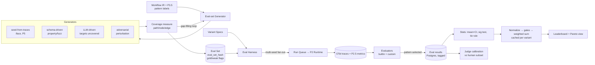

# PRD — P4: Eval Harness + eval-set generation + composite scoring

| Field | Value |
|---|---|
| Phase / Milestone | P4 / M5 |
| Target window | ~Weeks 16–22 |
| Lead role(s) | AI Engineer + Frontend (co-leads) |
| Supporting role(s) | System Designer, DevOps, Product Designer |
| Status | Draft |
| OpenSpec change | `p4-eval-harness` |

## 1. Summary

P4 is the precondition for the entire intelligence half of the platform. It replaces the amateur
loop (*change → eyeball → ship*) with the senior loop (*build eval set → measure baseline → change
one thing → re-run → keep only if the number rose, and only if the rise beats noise*). It delivers
three tightly-coupled capabilities: an **eval harness** that runs any Variant Spec over an eval set
multi-seed and computes pluggable metrics over the OTel traces; an **eval-set generator** that
synthesizes cases until *measured* path/node/edge coverage crosses thresholds, labels references as
gold-vs-weak, and tracks its own difficulty/diversity; and a **composite scoring + leaderboard**
layer that normalizes metrics, applies hard constraints as disqualifying **gates** (separate from
soft weighted preferences), reports every score with a confidence interval, declares a **tie when
CIs overlap**, and re-ranks instantly under named weight profiles without re-executing. The AI
Engineer's one law governs the phase: **evals before optimization** — nothing in P4.5/P5.5/P6 is
trustworthy until this harness exists and is honest about noise.

## 2. Problem & context

After P2 a Variant Spec *runs*, and after P2.5 every run emits tagged OTel spans + metrics
(cost/latency/tokens/errors keyed by `{variant_id, run_id, node_id, case_id, seed, config_hash}`).
After P3.5 each subgraph carries a **pattern label** (Routing, RAG, Reflection, …). But there is
still no way to answer the only question that matters: *is variant B actually better than variant
A?* Without P4:

- Comparisons are single-run and eyeballed, so stochastic noise is read as signal — a reordering
  delta inside the noise band gets shipped as a "win."
- There is no eval set to run against; real workflows almost never ship with adequate test data,
  and a hand-picked handful of cases exercises neither every graph path nor the edge cases.
- Metrics are computed but not *judged*: no normalization, no weighting, no gates, no leaderboard.
- LLM-as-judge scores drive decisions with no calibration against human labels — an uncalibrated
  judge is decoration.

**Upstream state assumed:** P0 frozen `workflow-ir.schema.json` (typed per-node I/O contract,
`config_hash`) and `metric-event.schema.json` (the tagging contract); P2 Runtime executing Variant
Specs reproducibly under `{config_hash, seed}`; P2.5 metrics substrate emitting operational metrics
+ spans; P3.5 structural pattern labels per subgraph. Real-trace *seeding* of the generator depends
on P5 dynamic tracing and is explicitly deferred — P4 ships the seed-generator interface but wires
it in P5.

## 3. Goals & non-goals

### Goals
- G1. **Run any Variant Spec over an eval set, multi-seed**, fanned out through the run queue, and
  collect per-case/per-node/per-run results keyed by the P0 tag set.
- G2. **Pluggable evaluators** over traces: built-in (exact-match, JSON-schema, regex, LLM-judge)
  plus **user-defined custom metrics** registered like skills. Metric-sets are selected per node by
  its **P3.5 pattern label** — the harness does not compute every metric everywhere.
- G3. **Per-node contribution** decomposition: attribute end-to-end success/cost/latency to
  individual nodes from the traces (the substrate P4.5 attribution builds on).
- G4. **Statistical rigor, enforced:** multi-seed runs, mean + confidence intervals, significance
  tests on deltas; when two variants' CIs overlap the system declares a **tie**, never a false
  winner.
- G5. **Judge calibration:** every LLM-judge metric is calibrated against a human-labeled subset,
  its agreement (e.g. Cohen's κ / % agreement) reported alongside every score it produces; an
  uncalibrated judge metric is flagged and blocked from gating decisions.
- G6. **Eval-set generation with measured coverage:** path (every IR edge, every branch/router
  outcome, loops at min/typical/max iterations), node (each node across its input schema), and edge
  cases (empty/malformed, tool-returns-nothing, retrieval-miss, context-overflow, adversarial/
  injection, boundaries). Layered generators (seed → schema-driven → LLM-driven targeting uncovered
  paths → adversarial perturbation). A **coverage report** drives a gap-filling loop that iterates
  until thresholds are met.
- G7. **Reference labeling:** auto-label where an oracle exists; else LLM-generated reference +
  human review of a subset, or reference-free metrics. Every case is flagged **gold vs.
  weak-labeled**; unverified synthetic references never silently drive scoring.
- G8. **Eval-set quality as a metric:** track difficulty and diversity so a passing score on a weak
  eval set is visibly worthless.
- G9. **Composite scoring:** normalize each metric to [0,1] before weighting;
  `Score = w_q·quality + w_c·(1−cost̂) + w_l·(1−latencŷ) + w_r·reliability − penalties`. Weights are
  a **named profile** (quality-first / cost-optimized / balanced); scores cache per variant so a
  profile change re-ranks without re-executing.
- G10. **Gates ≠ weights:** hard constraints (max cost/run, latency SLA, min quality, provider
  allowlist) are **disqualifying gates**, evaluated before weighting; soft weighted preferences
  apply only to variants that pass every gate.
- G11. **Leaderboard + Pareto view:** rows show score ± CI, component-metric breakdown, gate
  pass/fail, and config lineage (`config_hash`); a Pareto view surfaces the quality/cost/latency
  frontier; re-rank is instant on weight-profile change.

### Non-goals (explicitly deferred, with the owning phase)
- **Attribution beyond per-node contribution, failure clustering, ablation, rule-based/LLM
  diagnosis, scorecard** — **P4.5**. P4 produces the per-node contribution *signal*; it does not
  cluster failures or name causes.
- **Change operators, proposal generation, held-out verification gate** — **P5.5**. P4 scores; it
  does not propose fixes.
- **Real-trace seeding** of the generator and **per-path targeting from dynamic traces** — **P5**
  (needs dynamic tracing). P4 ships the seed-generator plug-in interface, unused until P5.
- **Automated search / autonomous optimizer** (grid/Bayesian/DSPy over the composite objective) —
  **P6**. P4 defines the objective + gates the optimizer will later maximize/constrain; it runs no
  search.
- **Behavioral pattern re-classification** (Reflection/Planning/HITL confirmed from runtime) —
  **P5**. P4 consumes the P3.5 *structural* label as-is.
- **Trend view across variants over time, regression detection, budget alerts** — **P4.5+**. P4
  ships the leaderboard for a snapshot comparison, not longitudinal tracking.

## 4. Users & personas

- **Workflow owner (end user, primary)** — has a discovered workflow and two or more variants;
  wants a trustworthy answer to "which is better, and by how much, under my priorities?" Consumes
  the leaderboard, the Pareto view, and the coverage report.
- **AI/ML engineer (power user)** — authors custom metrics and judge rubrics, curates the
  human-labeled calibration subset, sets coverage thresholds and gate constraints, and inspects
  per-node contribution.
- **Downstream subsystems** — P4.5 attribution/diagnosis consumes per-node contribution + the eval
  results; P5.5 verification re-uses the harness (held-out re-runs, significance gate); P6's
  optimizer uses the composite score as its objective and the gates as its hard constraints. All
  three depend on the eval-result schema, the CI/tie semantics, and the score cache P4 freezes.
- **Product Designer / Frontend** — own the eval-run journey, the "is this eval set good enough?"
  coverage screen, and the leaderboard/Pareto interface with its states.

## 5. User stories / jobs-to-be-done

**Workflow owner**
- As a workflow owner, I want two variants run over an eval set multi-seed and ranked by a single
  composite score under a named profile, so that I can pick a winner without reading raw traces.
- As a workflow owner, I want a variant whose CI overlaps the leader's to be shown as a **tie**,
  so that I don't ship a change that is really just noise.
- As a workflow owner, I want a cheap-but-broken variant that violates my min-quality gate to be
  **disqualified**, not merely penalized, so that it can't top my cost-weighted board.
- As a workflow owner, I want to switch from "balanced" to "cost-optimized" and see the board
  re-rank instantly, so that I can explore priorities without paying to re-run.
- As a workflow owner, I want to see whether my eval set is *good enough* (coverage + difficulty)
  before I trust its scores.

**AI/ML engineer**
- As an ML engineer, I want to register a custom metric as a scoring function over traces, so that
  domain-specific quality is measured without changing the harness.
- As an ML engineer, I want each node to be scored only with metrics valid for its pattern, so that
  a router isn't judged as if it were a RAG pipeline.
- As an ML engineer, I want every LLM-judge metric calibrated against my human-labeled subset with
  its agreement reported, so that I know whether to trust it.
- As an ML engineer, I want the generator to keep synthesizing cases until path/node/edge coverage
  crosses my thresholds, and to tell me which paths are still uncovered.
- As an ML engineer, I want each case flagged gold vs. weak-labeled, so that weak labels never
  silently drive a ranking.

**Downstream subsystem owner**
- As the P5.5 verification gate, I want to re-run a proposal over a held-out slice with the same
  multi-seed + CI + tie semantics, so that "improvement" means a statistically real gain.
- As the P6 optimizer, I want the composite score as an objective and the gates as hard
  constraints, so that search maximizes the right thing without ranking noise.

## 6. Functional requirements

These map 1:1 to the OpenSpec requirements under
`openspec/changes/p4-eval-harness/specs/`.

**Eval harness (`eval-harness`)**
- FR1. The harness SHALL run a Variant Spec over an eval set for **N seeds** (N configurable,
  default ≥ 5), fanned out through the run queue, and persist per-case/per-node/per-run results
  tagged `{variant_id, run_id, node_id, case_id, seed, config_hash}`.
- FR2. **Evaluators SHALL be pluggable functions over traces.** Built-in evaluators SHALL include
  exact-match, JSON-schema validity, regex, and LLM-judge; **user-defined custom metrics** SHALL be
  registrable (name → scoring function + declared output range) the same way skills are registered.
- FR3. The harness SHALL select the metric-set applied to each node from that node's **P3.5 pattern
  label**, and SHALL NOT compute a metric on a node whose pattern does not admit it.
- FR4. The harness SHALL compute the standard metric family — task success (per-task via
  rubric / LLM-judge / exact-match / regex), cost, latency, token usage, tool-error rate — and
  **per-node contribution** to end-to-end success/cost/latency from the traces.
- FR5. For every metric, the harness SHALL run **multi-seed** and report **mean + confidence
  interval**, and SHALL run a **significance test** on each pairwise variant delta.
- FR6. When two variants' CIs on the comparison metric **overlap**, the harness SHALL label the
  pair a **tie** and SHALL NOT declare a winner between them.
- FR7. For every **LLM-judge** metric the harness SHALL compute and report **agreement against a
  human-labeled calibration subset**; a judge metric whose agreement is below a configured floor (or
  uncalibrated) SHALL be flagged and SHALL NOT be used as a gate input.

**Eval-set generation (`eval-set-generation`)**
- FR8. The generator SHALL **measure** achieved **path coverage** (every IR edge, every branch/
  router outcome, loops driven to min/typical/max iterations), **node coverage** (each node across
  its input schema), and **edge-case coverage** (empty/malformed, tool-returns-nothing,
  retrieval-miss, context-overflow, adversarial/injection, boundaries), and emit a **coverage
  report**.
- FR9. The generator SHALL run **layered generators** — seed-from-real-traces (interface present,
  active in P5), schema-driven synthesis from typed I/O contracts (property/fuzz), LLM-driven
  synthesis **targeting currently-uncovered paths** and a fixed failure taxonomy, and adversarial
  perturbation of existing cases.
- FR10. The generator SHALL **iterate a gap-filling loop** — measure coverage, target the gaps,
  regenerate — until configured path/node/edge thresholds are met or a max-iteration bound is hit
  (reporting the residual gap if unmet).
- FR11. Each case's reference output SHALL be labeled **gold** (oracle-derived: exact-match/schema/
  deterministic tool, or human-reviewed) or **weak** (LLM-generated, unreviewed); weak-labeled
  references SHALL NOT drive a scoring or gating decision without being surfaced as weak.
- FR12. The generator SHALL compute and report **eval-set difficulty and diversity** metrics, and
  SHALL dedupe near-identical cases; a score on an eval set below a difficulty/diversity floor SHALL
  be surfaced as low-confidence.
- FR12a. The coverage report SHALL distinguish **"no obligations on this axis"** from **"every
  obligation covered"**. A dimension with zero obligations SHALL be reported as *not measurable* and
  SHALL NOT satisfy its threshold. *(Added after implementation: an empty-set covered-fraction is
  1.0 by arithmetic, and reporting that alone claimed 100% path coverage for a workflow whose
  control flow had never been observed — see Q8.)*
- FR12b. An oracle SHALL be counted as evidence only when it is **decisive** — when it can return
  "fail" for some plausible output of the workflow. The generator SHALL report the fraction of cases
  carrying a decisive oracle (**oracle coverage**), SHALL count cases whose oracle can never fail
  separately, and SHALL surface a set below the oracle-coverage floor as low-confidence.
  *(Added after implementation: counting oracle PRESENCE rather than POWER credited an
  unconstrained `{"type":"object"}` contract as evidence and let a variant that answers wrong 70% of
  the time score task_success 1.000 — see Q9.)*

**Scoring (`scoring`)**
- FR13. Each metric SHALL be **normalized to [0,1]** (min-max or z-score across the variant set)
  before it enters the weighted sum.
- FR14. The composite score SHALL be
  `Score = w_q·quality + w_c·(1−cost̂) + w_l·(1−latencŷ) + w_r·reliability − penalties`, computed
  only over normalized metrics.
- FR15. Weights SHALL be a **named profile** (at least quality-first, cost-optimized, balanced);
  per-variant normalized metric values SHALL be **cached**, so switching profiles recomputes only
  the weighted sum and **re-ranks without re-executing** any run.
- FR16. **Hard constraints SHALL be gates, not penalties.** A variant violating any gate (max
  cost/run, latency SLA, min quality, provider allowlist) SHALL be **disqualified** — excluded from
  the ranked order — regardless of how favorable its weighted score would be.
- FR17. Soft weighted preferences SHALL apply **only to variants that pass every gate**.
- FR18. Each composite score SHALL be reported with its **confidence interval**; two variants whose
  composite-score CIs overlap SHALL be shown as tied.
- FR19. A **leaderboard** SHALL rank gate-passing variants by composite score under the active
  profile; each row SHALL show **score ± CI, the component-metric breakdown, gate pass/fail, and the
  config lineage (`config_hash`)**. Disqualified variants SHALL be listed separately with the
  failed gate named.
- FR20. A **Pareto view** SHALL surface the quality/cost/latency frontier so multi-objective
  tradeoffs are visible without collapsing to one number, and SHALL re-render on weight-profile
  change.

## 7. Non-functional requirements

- **Statistical honesty (first-class).** Every reported metric and composite score carries a CI;
  no winner is declared across overlapping CIs (FR5, FR6, FR18). This is the phase's load-bearing
  correctness property, tested with a synthetic pair whose true delta is zero — the harness must
  return "tie," not a coin-flip winner.
- **Reproducibility.** A given `{eval_set_hash, config_hash, seed}` re-runs to the same per-case
  results (inherits P2 seed propagation); the eval set itself is content-hashed (`eval_set_hash`)
  and versioned so a leaderboard is attributable to an exact set + exact configs.
- **Scale / fan-out.** A comparison of ≥ 2 variants × an eval set of ~1k cases × ≥ 5 seeds
  (≥ 10k runs) SHALL fan out through the run queue and complete without manual orchestration;
  results aggregate incrementally so partial progress is visible. Result rows are tagged so every
  leaderboard slice (per pattern, per failure category, per node) is queryable.
- **Latency of re-ranking.** A weight-profile switch SHALL re-rank the board in < 200 ms for ≤ 500
  variants by recomputing only the cached weighted sum — no run re-execution, no re-scoring.
- **Cost control.** Judge and LLM-generation calls are themselves metered (they cost money); the
  harness SHALL cap judge/generation spend per eval run and surface it, so measuring a workflow
  doesn't silently blow a budget.
- **Security / isolation.** Generated adversarial/injection cases execute only inside the P3
  sandbox; synthesized inputs never carry ambient credentials; judge prompts and references that may
  contain PII are stored as content-hashed blobs, not inline in logs.
- **Accessibility & performance (UI).** Leaderboard and Pareto render potentially hundreds of
  variants: large lists are **virtualized**; chart color/encoding follows the **dataviz** skill for
  contrast and consistency across light/dark; every long-running eval job models
  loading/error/empty/partial as first-class states.

## 8. System design summary

**Data flow.**

**Storage (System Designer lens).**
- **Postgres** — `eval_set` (`eval_set_hash` PK, thresholds, difficulty/diversity), `eval_case`
  (`case_id`, `eval_set_hash` FK, input_blob_hash, reference_blob_hash, `label ∈ {gold, weak}`,
  path/edge tags), `eval_result` (FK → variant/case, `seed`, `node_id`, metric name, value —
  tagged with the full P0 tag set), `metric_stat` (variant × metric → mean, CI, n), `judge_cal`
  (judge metric → agreement, n_human), `score_cache` (variant → per-metric normalized value),
  `leaderboard` is a *view* computed from `score_cache` + active profile + gates.
- **Object store** — case inputs, reference outputs, rendered judge prompts, per-node I/O — all
  content-hashed; DB holds hashes only.
- **TSDB / span store (P2.5)** — the traces the evaluators read; the harness does not re-store them.

**Key interfaces.**
- `Evaluator(trace, case) → MetricValue` (built-in + registered custom; declares output range +
  admissible patterns).
- `Generator(ir, coverage_gap) → []EvalCase` (four kinds behind one interface).
- `Coverage(ir, eval_set) → CoverageReport` (path/node/edge achieved vs. target).
- `Harness.Run(variant, eval_set, seeds) → EvalResults` (queue fan-out; pattern-scoped evaluation).
- `Stats.Compare(a, b, metric) → {mean_a±ci, mean_b±ci, sig, verdict ∈ {a>b, b>a, tie}}`.
- `Score(variant, profile) → {composite±ci, components, gate_status, config_hash}` (gates first,
  then cached normalized weighted sum).

## 9. Design by role lens

**AI Engineer (co-lead) — *evals before optimization; verification decides.***
This is the phase where the playbook's core law is literally implemented. The discipline lands as:
- *Build the eval harness FIRST.* P4 precedes P4.5/P5.5/P6 precisely because none of them is
  trustworthy without it. The harness + generator + scoring are the load-bearing infrastructure the
  whole intelligence half consumes.
- *Coverage is measured, not assumed.* The generator does not "produce some cases"; it runs a
  gap-filling loop against a **coverage report** and only stops when path/node/edge thresholds are
  met (or reports the residual). An eval set is "enough" *iff* the report says so. Difficulty/
  diversity are tracked so a passing score on a weak set is visibly worthless.
- *LLM-as-judge calibration is non-negotiable.* Every judge metric is calibrated against a
  human-labeled subset, its agreement reported alongside every number it emits, and an uncalibrated/
  low-agreement judge is barred from gating. No single unverified LLM opinion drives a decision —
  the same rule that governs P4.5 diagnosis and P5.5 verification, applied here at the source.
- *Statistical honesty is enforced, not optional.* Multi-seed, mean + CI, significance tests, and
  the **tie-on-overlapping-CIs** rule are wired into the comparison primitive itself, so downstream
  consumers cannot accidentally rank noise. Reordering deltas are usually within noise; the harness
  must say so.
- *evaluation.md discipline.* Every evaluator, its admissible patterns, its output range, and its
  calibration status are documented as a first-class artifact — the eval methodology is versioned
  alongside the specs, not folk knowledge.
- *Pattern-scoped metrics.* Metric-sets attach by the P3.5 label so a router gets misroute metrics
  and a RAG node gets relevance@k — the harness computes what's valid, not everything everywhere.

**Frontend (co-lead) — *match the codebase, smallest correct change, a11y & perf are requirements.***
- **Leaderboard** ranks gate-passing variants under the active profile; each row shows score ± CI,
  component breakdown, gate pass/fail, and full `config_hash` lineage; disqualified variants are a
  separate, clearly-labeled section naming the failed gate.
- **Pareto view** surfaces the quality/cost/latency frontier so users see tradeoffs directly rather
  than trusting one collapsed number; re-ranks/re-renders instantly on weight change (reads the
  score cache, never re-runs).
- **State & data** — every eval job models loading / error / empty / **partial** (fan-out in
  progress) as first-class; the board reads terminal aggregate status from persisted results, never
  derived state that drifts from the run's truth.
- **Accessibility & performance** — large variant lists are **virtualized**; keyboard-operable rows
  and controls; score/heatmap/frontier color follows the **dataviz** skill for contrast and
  light/dark consistency; a "tie (CIs overlap)" state is a distinct, legible visual, not a footnote.

**System Designer (support) — *numbers before boxes.***
Owns the **run fan-out data path** and the **tag-completeness invariant**: every eval-result row
carries the full P0 tag set so *every* leaderboard slice (per pattern, per failure cluster, per
node, per seed) is a query, not a re-run. Sizes the fan-out (≥ 2 variants × ~1k cases × ≥ 5 seeds →
≥ 10k queued runs) and the score cache; picks Postgres for structured eval results + TSDB/span
store (P2.5) for the traces evaluators read. Ensures `eval_set_hash` + `config_hash` make every
leaderboard attributable to an exact set + exact configs. Designs the generator's queue-driven seed
fan-out so schema/LLM/adversarial generators produce independently and merge deterministically.

**DevOps (support) — *blast radius, reversible, observable, least-privilege.***
Stands up the **queue-driven run fan-out infrastructure** for multi-seed sweeps and generation
fan-out: bounded concurrency, backpressure, idempotent re-delivery (inherits P2 idempotency so a
redelivered eval run doesn't double-charge). Meters and **caps judge/generation spend** per eval
run — measuring a workflow must not silently blow a budget. Ensures adversarial/injection cases run
only in the P3 sandbox with no ambient credentials, and that judge prompts/references with possible
PII are content-hashed blobs, never in logs. Automates the fan-out + aggregation as pipeline steps,
not manual runs (*automate the second time*).

**Product Designer (support) — *anchor to the outcome; content is the interface; name the tradeoff.***
Designs the **eval-run journey** (choose variants → generate/select eval set → run → compare) and
the first-class **"is this eval set good enough?"** moment: the coverage report is a screen, not a
log line — it shows achieved vs. target path/node/edge coverage, the residual uncovered paths, and
the difficulty/diversity read, so a user *sees* whether to trust the scores before reading them.
Content is the interface: a variant marked **"tie (CIs overlap)"** must say exactly that, a
**disqualified** variant must name the gate it failed, and a **weak-labeled** case must be visibly
weak. Designs the unhappy path first — a coverage loop that can't reach threshold, a judge that
fails calibration, an all-tie board.

## 10. Dependencies

- **Requires (upstream):** P0 (`workflow-ir.schema.json` typed I/O contract + `config_hash`;
  `metric-event.schema.json` tag set); P2 (Runtime executing Variant Specs reproducibly under
  `{config_hash, seed}`, run queue seed, idempotency); P2.5 (OTel spans + operational
  cost/latency/token/error metrics the evaluators read); P3 (sandbox for adversarial/injection case
  execution); P3.5 (structural pattern label per subgraph → metric-set selection).
- **Consumes:** Variant Specs (≥ 2 to compare), user-provided eval inputs/references (optional),
  a human-labeled calibration subset (for judge metrics).
- **Unblocks:** **P4.5** (per-node contribution + eval results → attribution, clustering, ablation,
  diagnosis, scorecard); **P5** (dynamic traces seed the generator; behavioral pattern labels refine
  metric-set selection); **P5.5** (the harness *is* the verification gate — held-out re-runs +
  significance + regression); **P6** (composite score = optimizer objective, gates = hard
  constraints).

## 11. Risks & mitigations

| Risk | Owner | Mitigation |
|---|---|---|
| Harness declares a false winner across overlapping CIs | AI | Tie rule wired into the comparison primitive; test with a true-zero-delta pair asserts "tie", not a winner |
| Uncalibrated LLM-judge silently drives a ranking | AI | Judge agreement vs. human subset computed + reported per score; below-floor/uncalibrated judge barred from gating (FR7) |
| Synthetic eval set is trivially easy / unrealistic → passing score is worthless | AI | Difficulty/diversity tracked as a metric; dedupe near-identical cases; calibrate against real-trace subset (P5); low-quality set surfaced as low-confidence |
| Weak-labeled references drive a decision unnoticed | AI / Product | Every case flagged gold vs. weak; weak labels blocked from silently gating; UI marks weak cases visibly |
| Coverage "assumed" instead of measured | AI | Coverage report measures achieved path/node/edge; gap-filling loop iterates until threshold or reports residual (FR8, FR10) |
| Cheap-but-broken variant tops a cost-weighted board | AI / System Designer | Gates disqualify (not penalize) before weighting; soft weights apply only to gate-passers (FR16, FR17) |
| Fan-out overwhelms providers / blows budget | DevOps | Bounded concurrency + backpressure on the queue; judge/generation spend cap per eval run; idempotent redelivery |
| Re-ranking re-executes runs (slow, expensive) | System Designer / Frontend | Normalized metrics cached per variant; profile switch recomputes only the weighted sum (< 200 ms) (FR15) |
| Metric computed on a node it doesn't apply to (router judged as RAG) | AI | Metric-set selected by P3.5 pattern label; harness refuses inadmissible metric on a node (FR3) |
| Leaderboard renders slowly on many variants | Frontend | Virtualized lists; memoized rows; reads score cache not raw results |

## 12. Rollout & test strategy

- **Fixtures.** A small multi-pattern workflow (a Routing subgraph → per-branch Tool Use →
  Reflection loop) with a hand-authored eval set *and* a generated one; two variants with a **known
  true-zero delta** (same config, different label) and two with a **known real delta**; a
  human-labeled calibration subset for one judge metric.
- **Statistical-honesty tests.**
  - True-zero-delta pair over ≥ 5 seeds → comparison returns **tie**, no winner.
  - Known-real-delta pair → significance test fires, non-overlapping CIs, correct winner.
  - Composite-score CI overlap → leaderboard shows both as tied.
- **Gate/weight-separation tests.**
  - A variant that is cheapest but below the min-quality gate → **disqualified**, listed separately
    with the failed gate named, *not* ranked #1 on the cost-optimized profile.
  - Switch profile quality-first → cost-optimized → re-rank happens with no re-execution (assert
    zero new runs enqueued) and completes < 200 ms.
- **Judge-calibration tests.**
  - A judge metric with agreement below the floor is flagged and **cannot** be used as a gate input;
    a well-calibrated judge reports its agreement alongside every score.
- **Coverage tests.**
  - Generator runs the gap-filling loop and **iterates until measured path coverage ≥ threshold**;
    on an unreachable path it terminates at max iterations and reports the residual gap, not a false
    "100%".
  - A case with only an LLM-generated reference is labeled **weak** and cannot silently gate.
- **Pattern-scoping test.** A router node is scored with misroute metrics and *not* relevance@k; a
  RAG node is scored with relevance@k and *not* misroute.
- **UI verification.** Drive the leaderboard + Pareto + coverage screens against a live (stubbed-
  provider) fan-out; confirm loading/partial/error/empty/tie/disqualified states render; confirm
  instant re-rank on profile switch; confirm virtualization on a many-variant board.
- **Rollout.** Internal-only, behind the run queue; generation + judge spend capped by default.
  Migrations expand-only (new eval tables). The harness ships dark until the fixtures' M5 exit
  checklist is green.

## 13. Success metrics & acceptance criteria (M5 exit checklist)

- [x] **Two variants** run over a **generated + user** eval set, **multi-seed**, and appear on a
      **leaderboard** with **CI-bounded composite scores** and **gate status**.
- [x] Evaluators are **pluggable**: a built-in (exact-match/schema/regex/LLM-judge) and a
      **user-registered custom metric** both compute over traces.
- [x] Metric-sets are **selected by the P3.5 pattern label** — a router is not scored as a RAG node.
- [x] **Per-node contribution** to end-to-end success/cost/latency is computed from traces.
- [x] A **true-zero-delta** pair is reported as a **tie** (overlapping CIs), not a false winner.
- [x] Every **LLM-judge** metric reports **agreement vs. a human-labeled subset**; an uncalibrated
      judge is flagged and blocked from gating.
- [x] The generator **measures** path/node/edge coverage and **iterates a gap-filling loop until
      thresholds are met** (or reports the residual on an unreachable path).
- [x] Cases are flagged **gold vs. weak-labeled**; weak references do not silently drive scoring.
- [x] Eval-set **difficulty/diversity** is reported; a weak set is surfaced as low-confidence.
- [x] Metrics are **normalized to [0,1]** before weighting; the composite formula matches G9.
- [x] Weight profiles are **named**; switching profiles **re-ranks without re-executing** (cached).
- [x] Hard constraints are **disqualifying gates**, separate from weights; a gate-violating variant
      is disqualified, not merely penalized.
- [x] Leaderboard rows show **score ± CI, component breakdown, gate pass/fail, `config_hash`
      lineage**; a **Pareto view** renders the quality/cost/latency frontier.

> **Verified 2026-07-22** by `TestM5ExitChecklist` (`internal/evale2e`), which runs one in-process
> pipeline from IR to leaderboard and asserts every item above against what it actually produces,
> plus the live-Postgres proofs (`make pg-proof`) and the browser verification recorded in
> `openspec/changes/p4-eval-harness/ui-verification.md`.

## 14. Open questions

- Q1. **CI method.** Bootstrap CIs over per-case scores vs. normal-approximation on the seed-mean —
  which is the default, and what N (seeds × cases) makes the tie test reliable? (Proposed: bootstrap
  over case-level scores, seeds as a variance component; default N ≥ 5 seeds.)
- Q2. **Composite-score CI.** ~~Propagate per-metric CIs analytically through the weighted sum, or
  bootstrap the composite directly?~~ **RESOLVED — bootstrap the composite**, by recombining cached
  per-metric replicates under the active profile. Two implementation findings forced detail the
  question did not anticipate: (a) the analytic route cannot hold the correlation between a
  variant's metrics (a lucky-fast seed is also a cheap one); (b) a penalty derived from a *measured*
  quantity must enter the bootstrap **per replicate** — subtracting its mean as an exact constant
  shifts the interval without widening it, and on a board where every metric was statistically
  degenerate that promoted a 1e-5 noise difference into a confident 1-2-3 ranking of three
  indistinguishable variants. Count-derived penalties (what fraction of cases are weak-labeled) stay
  exact constants.
- Q3. **Coverage thresholds.** Are default path/node/edge thresholds fixed platform-wide, or
  per-pattern (a Reflection loop needs min/typical/max iterations; a linear chain doesn't)?
- Q4. **Normalization set boundary.** Min-max is computed *across the variant set on the board* —
  does adding a new variant re-normalize (and thus re-rank) existing ones? **Still open**, with the
  reference scale now recorded per cached value (`score_cache.scale_min/scale_max`) so two boards can
  be checked for comparability rather than assumed comparable. One sub-question CLOSED by
  implementation: a metric whose variants' CIs all overlap must be treated as **degenerate** and
  normalize to 1 for everyone. Min-max divides by the observed spread, so when that spread is
  comparable to the measurement noise it amplifies noise across the whole [0,1] axis — the step meant
  to make metrics comparable was promoting noise to a ranking signal. A metric that cannot separate
  the field must not decide the ranking.
- Q5. **Judge-agreement floor.** What κ / %-agreement is the default gate-eligibility floor, and
  does it vary by metric criticality?
- Q6. **Difficulty/diversity definition.** How is "difficulty" operationalized before P5 real-trace
  calibration exists — baseline-model pass-rate, disagreement across seeds, or reference-free
  uncertainty? (Proposed: baseline pass-rate + embedding-space spread for diversity.)
- Q7. **Held-out split ownership.** P5.5 verification wants a held-out slice; does P4 mint the
  train/held-out split at generation time (tagged on the case) or does P5.5 carve it later?
- Q8. **What may a board rank when an axis was never measured?** *(Raised by running P4 against a
  real repository — see §14.1.)* A dimension with no obligations, or with obligations of which zero
  were discharged, is now flagged and forces low-confidence — but the leaderboard still ranks.
  Should it **refuse to rank** instead? "Nothing was exercised" is arguably not low confidence, it
  is not a measurement. Open: refuse vs. flag.
- Q9. **Should gate eligibility generalize past judges?** *(Raised by the same run.)* FR7 bars an
  uncalibrated LLM judge from being a gate input. A min-quality gate reading a metric with **0%
  oracle coverage** is exactly as unreliable and currently passes freely — that is how a variant
  answering wrong 70% of the time earned a green `gate: pass`. Proposed: generalize the judge's
  gate-eligibility predicate to any gate input whose *evidence base* is below floor, reusing the
  existing refusal path (gate refused, disqualifies nobody, stated on the board). Not implemented —
  it is a product call between refusing and flagging.
- Q10. **Where does "this contract constrains nothing" get reported?** *(Same run.)* P1 discovery
  emitted `{"type":"object"}` as the I/O contract for 40 of 40 nodes — its syntactic frontend does
  not resolve types — and P4 had to discover downstream that its oracles were powerless. Discovery
  already emits ambiguity flags; contract-emptiness arguably belongs there, as a P1 concern rather
  than something each consumer re-derives.

### 14.1 What running against a real repository changed

The checklist in §13 was verified against a fixture. Pointing the same pipeline at a real repository
(`nousresearch/hermes-agent`, commit `e57918a`) produced findings a fixture could not, because a
fixture is built by the same person as the thing it tests:

- **P1 discovery yields call sites, not flow.** 40 LLM call sites across 3,214 Python files, and
  **zero edges** — inter-node flow is P5's dynamic tracing. Consequences: path coverage has no
  obligations (FR12a), and P3.5 labels **nothing**, because its detectors work on graph topology.
  Pattern-driven metric selection (FR3) therefore has nothing to dispatch on for such a workflow.
- **Static I/O contracts may constrain nothing.** All 40 nodes carried `{"type":"object"}`, which
  accepts every possible output (FR12b, Q10). Schema-driven generation (FR9) also has nothing to
  fuzz from such a contract, and silently produced near-nothing rather than saying so.
- **Model ids are unresolved.** All 40 call sites report `model_id: unresolved` — the model is
  chosen at runtime — so a Variant Spec's per-node `model_ref` override has no static target on this
  workflow.

Taken together: a workflow can be **discovered** long before it can be **scored**. What P4 produces
for such a repository is a *readiness verdict*, not a leaderboard, and it must say so — which is
what FR12a, FR12b and the low-confidence surface now do.
