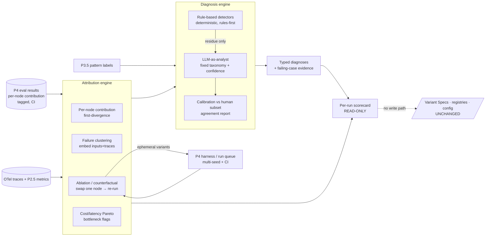

# PRD — P4.5: Attribution + rule-based Diagnosis + scorecard (read-only)

| Field | Value |
|---|---|
| Phase / Milestone | P4.5 / M6 |
| Target window | ~Weeks 21–25 |
| Lead role(s) | AI Engineer |
| Supporting role(s) | System Designer, DevOps, Frontend, Product Designer |
| Status | Draft |
| OpenSpec change | `p4.5-attribution-diagnosis` |

## 1. Summary

P4.5 turns the eval harness's numbers from "*here are the scores*" into "*here is **which node** is
failing and **why**.*" It delivers an **attribution engine** that localizes an end-to-end
failure/cost/latency to individual nodes from the OTel traces (per-node contribution, failure
clustering, ablation/counterfactual isolation, cost/latency bottleneck flags) and a **diagnosis
engine** that attaches a named, typed cause — **rules-first** deterministic detectors over traces,
with an **LLM-as-analyst** constrained to a fixed failure taxonomy for the fuzzy residue. The whole
phase is **read-only**: it reports, it proposes nothing, and it changes nothing (proposals and the
verification gate are P5.5; autonomous apply is P6). The AI Engineer's law governs it end to end:
**diagnosis proposes; verification decides** — no single unverified LLM opinion drives a change, and
the analyst is calibrated against a human-labeled subset with its agreement reported alongside every
diagnosis.

**Framework-agnostic by construction, and topology-recovering.** P4.5 localizes failures from
**traces** and the agent's **recovered effective topology** — not from a framework graph it assumes
exists. It works for **any agent that emits (or is wrapped to emit) OTel spans**, whether a
LangGraph/CrewAI graph or a **hand-rolled agent loop** (a bespoke `run_agent.py` with no framework).
The node edges come from **whichever linkage signals exist**, in a provenance-ranked order: a
**framework** graph when present (strongest); else the **static** call-graph / data-flow / shared-
state edges recovered from the code (P1); else the **dynamic** span parent-child / shared-thread-id /
temporal-and-data order recovered from the traces (P2.5); and only when nothing links the calls, a
**flat trace-order** fallback. Every recovered edge is a **provenance-tagged hypothesis** (framework /
inferred-static / inferred-dynamic), not asserted as ground truth — ablation is what upgrades a
localization to a proven cause. The IR's per-node output contracts and P3.5 pattern labels remain
optional enrichment: absent, contract-violation degrades to span-status and an unclassified node is
surfaced as **"not classified"** with pattern-agnostic checks only, never silently full-diagnosed.
The one real prerequisite is **trace acquisition** (§10); the topology-recovery signals sharpen the
localization but are not required to produce a scorecard.

## 2. Problem & context

After P4 a comparison is honest: two Variant Specs run multi-seed over a coverage-measured eval set,
each metric carries a confidence interval, ties are declared when CIs overlap, and P4 already emits a
**per-node contribution** signal from the traces. But a workflow owner still only knows *that* a
variant scores 60% — not *which node* is responsible, whether the failures are one category or ten,
or *why* the node fails. Without P4.5:

- Aggregate scores hide locality. A 60%-scoring workflow could be failing entirely at one node or
  degrading across all of them; the number can't tell them apart, and a fix aimed at the wrong node
  is wasted.
- Failures are treated as one-offs. Nobody clusters the failing cases, so "fails on multi-hop" and
  "fails when a tool returns empty" — different fixes — are lumped together.
- Causation is asserted, not isolated. "Node 3's prompt is the bottleneck" is a guess until every
  other node is held fixed and only that one is swapped and re-run.
- There is no named cause. Even with the right node localized, the *reason* (context overflow, tool
  schema mismatch, retrieval miss, prompt-format drift, lost-in-the-middle, model-capability
  mismatch) is left to human trace-reading — slow, inconsistent, and un-aggregatable.
- Any LLM-generated explanation is un-calibrated. LLM-as-analyst is itself noisy and biased; without
  a fixed taxonomy, calibration, and agreement reporting, its opinion is confident guessing.
- **Most real agents aren't graphs — but their calls are still linked.** A large fraction of
  production agents are hand-rolled loops (a bespoke `run_agent.py`, a CLI, an SDK wrapper), not
  LangGraph/CrewAI graphs. Framework detection finds **0 edges** for them (observed on a real repo:
  40 call sites, 0 edges, no pattern labels). But "no framework graph" is **not** "no topology": the
  LLM calls are linked by the code itself — a **static call graph** (a dispatch function forwards to
  the create boundary; a fallback wraps the primary), **data flow** (one call's response is appended
  to `messages` and becomes the next call's prompt), and a **shared conversation/memory object** every
  call reads and writes. At runtime the spans add more linkage: parent-child nesting, a shared
  conversation/thread id, and temporal + data order. The framework graph is only **one signal** for
  recovering topology, and the strongest when present; for a hand-rolled agent the other signals
  recover the effective node graph. So the goal is not "graph or no graph" — it is **recover the
  effective topology from whatever linkage signals exist**, treat every recovered edge as a
  provenance-tagged hypothesis, and fall back to flat trace-order only when nothing links the calls at
  all. A product that gives up at "no framework graph" is leaving the real topology — which is sitting
  in the code and the traces — on the floor.

**Upstream state assumed:** P0 frozen `workflow-ir.schema.json` (typed per-node I/O contract,
`config_hash`) and `metric-event.schema.json` tag set; P2 Runtime executing Variant Specs
reproducibly under `{config_hash, seed}` with the run queue (reused for ablation); P2.5 OTel spans +
operational metrics; P3.5 structural pattern labels per subgraph (scopes which failure modes to
check); **P4** eval harness + eval results + per-node contribution signal + the multi-seed / CI /
tie comparison primitive (attribution and ablation reuse it). Behavioral pattern re-classification
(Reflection/Planning/HITL confirmed from runtime) is P5; P4.5 consumes the P3.5 structural label
as-is.

## 3. Goals & non-goals

### Goals
- G1. **Per-node contribution decomposition.** For a failing variant, decompose end-to-end
  failure/cost/latency to individual nodes from the OTel traces and identify, per failing case, the
  node whose output **first diverges** from success.
- G2. **Failure clustering.** Embed failing inputs + traces and cluster them into named **categories**
  ("fails on multi-hop" vs. "fails when a tool returns empty") so fixes target categories, not
  one-offs; report cluster size and representative cases.
- G3. **Ablation / counterfactual isolation.** Hold every node fixed, swap exactly one node's config,
  re-run through the P4 harness (multi-seed, CI) — the only rigorous way to attribute causal
  contribution to a single node — and report the measured delta with its CI.
- G4. **Cost/latency bottleneck flags.** Compute the cost/latency **Pareto** across nodes and flag the
  node(s) that dominate spend or sit on the critical path.
- G5. **Rule-based detectors (rules-first).** Fast, deterministic, cheap detectors over traces:
  context overflow/truncation before a failing node; tool schema mismatch / repeated tool errors;
  retrieval miss (low-relevance chunks); prompt-format drift (output contract ignored → downstream
  parse fail); lost-in-the-middle from over-long context; model-capability mismatch (cheap model on a
  reasoning-heavy node). These run first on every failing case.
- G6. **LLM-as-analyst for the fuzzy residue.** For failing cases the rules don't explain, feed the
  full trace to an analyst model with a structured rubric, **constrained to a fixed failure taxonomy
  + a confidence score** so outputs aggregate rather than sprawl as free text.
- G7. **Analyst calibration + agreement reporting.** Calibrate the analyst against a human-labeled
  subset, report its agreement (e.g. Cohen's κ / % agreement) alongside every diagnosis it emits, and
  **never let a single unverified analyst opinion drive a change** — diagnosis proposes, verification
  (P5.5) decides.
- G8. **Pattern-scoped failure modes.** Check only the failure modes the node's P3.5 pattern can
  exhibit — Routing → misroutes; Planning → infeasible/circular plans; Reflection →
  non-convergence / degradation-on-revision — so a router isn't diagnosed for a RAG failure mode.
- G9. **Read-only, first-class.** The engine emits reports (attributions, clusters, ablation deltas,
  bottleneck flags, diagnoses, scorecard) and **mutates no Variant Spec, registry, config, or
  workflow**, and **emits no proposal** — that is P5.5's job.
- G10. **Per-run scorecard.** A read-only scorecard: overall metrics, per-node breakdown, top failure
  clusters, and diagnosis cards that show *why* with the **specific failing cases attached as
  evidence**, not just a label.
- G11. **Framework-agnostic, trace-derived locality with graceful degradation.** Attribution and
  diagnosis SHALL derive locality from **traces** (span execution order), so they work for any agent
  that emits run/node/tool spans — graph-framework or hand-rolled. When the IR carries no edges, no
  per-node output contract, or no P3.5 pattern label, the engine SHALL degrade **explicitly, not
  silently**: first-divergence from trace order; contract-violation only where a node declares a
  contract; and — for an unclassified node — only the **pattern-agnostic** detectors, with the node
  surfaced as **"not classified · pattern-agnostic checks only"** and pattern-scoped modes refused
  (not misapplied).
- G12. **Effective-topology recovery from multiple linkage signals.** The system SHALL recover a
  hand-rolled agent's node edges from signals **beyond** framework detection — the **static**
  call-graph, data-flow (response → next prompt), and shared-conversation-state links inferred from
  the code (P1), and the **dynamic** span parent-child, shared-thread-id, and temporal-and-data links
  observed in the traces (P2.5). Each recovered edge SHALL be tagged with its **provenance**
  (framework / inferred-static / inferred-dynamic) and a confidence; attribution SHALL prefer the
  higher-provenance edge set when present and SHALL treat an inferred edge as a **hypothesis** that
  ablation upgrades, never as a framework-certain fact. Edge recovery is owned upstream (P1 static,
  P2.5 dynamic); P4.5 **consumes** the recovered edges and surfaces their provenance on the scorecard.

### Non-goals (explicitly deferred, with the owning phase)
- **Change operators / proposal generation** (diagnosis → candidate Variant Specs) — **P5.5**. P4.5
  names causes; it proposes no fix.
- **Verification gate** (auto-run a proposal held-out, statistical gate, regression check, verdict) —
  **P5.5**. P4.5 does the ablation *measurement* the verification gate later reuses, but emits no
  recommendation.
- **Automation levels** (Advisory / Assisted one-click apply) and **autonomous apply** — **P5.5 /
  P6**. P4.5 is strictly read-only with no apply path.
- **Behavioral pattern (re-)classification** from runtime and **anti-pattern detection** wired to
  operators — **P5 / P5.5**. P4.5 consumes the P3.5 *structural* label.
- **Ranked recommendation list, trend view across variants over time** — **P5.5+**. P4.5 ships the
  per-run scorecard, not longitudinal recommendation tracking.
- **Human-readable narrative synthesis over the structured results** — a thin LLM narration layer is
  deferred to P5.5's reporting; P4.5's scorecard is the structured surface it will later narrate.

## 4. Users & personas

- **Workflow owner (end user, primary)** — has a failing variant on the P4 leaderboard and needs to
  know *which node* to fix and *why* before spending effort. Consumes the scorecard, the failure
  clusters, and the diagnosis cards with their evidence.
- **AI/ML engineer (power user)** — inspects per-node contribution and ablation deltas, curates the
  analyst's human-labeled calibration subset, reviews the analyst's agreement, and decides whether a
  diagnosis is trustworthy enough to act on manually (there is no automated apply here).
- **Downstream subsystems** — **P5.5** proposal operators consume the typed diagnoses (each cause
  maps to an operator) and reuse the ablation/verification machinery; **P6**'s diagnosis-guided
  search points the search at the node+dimension attribution P4.5 localizes. Both depend on the
  fixed failure taxonomy and the diagnosis schema P4.5 freezes.
- **Product Designer / Frontend** — own the per-run scorecard: the per-node breakdown, the failure
  clusters, and diagnosis cards that show the failing cases as evidence rather than a bare label.

## 5. User stories / jobs-to-be-done

**Workflow owner**
- As a workflow owner, I want a 60%-scoring variant's failures **localized to the responsible
  node(s)**, so that I fix the right node instead of guessing.
- As a workflow owner, I want my failing cases **clustered into categories** with sizes, so that I
  fix "fails on multi-hop" as one thing rather than debugging fifty cases individually.
- As a workflow owner, I want a **named, typed cause** for a node's failures (e.g. "context overflow
  before node 3", "retrieval miss") with the **specific failing cases shown as evidence**, so that I
  understand *why*, not just *what*.
- As a workflow owner, I want to know **which node dominates my cost / sits on the critical path**,
  so that I know where a latency or spend fix would actually pay off.
- As a workflow owner, I want the engine to **report only** and change nothing, so that inspecting a
  diagnosis never risks mutating my workflow.
- As the owner of a **hand-rolled agent** (no LangGraph/CrewAI graph), I want the scorecard to still
  localize which of my instrumented call sites the failures diverge at, cluster them, and name the
  causes its trace signals support — with the un-classifiable nodes clearly marked "not classified"
  rather than the whole scorecard refusing — so that I get value without migrating to a framework.

**AI/ML engineer**
- As an ML engineer, I want an **ablation** that holds every node fixed and swaps only node 3's
  config and re-runs multi-seed, so that "node 3's prompt is the bottleneck" is a measured causal
  claim with a CI, not an assertion.
- As an ML engineer, I want the LLM-analyst **constrained to a fixed failure taxonomy + confidence**,
  so that its diagnoses aggregate across cases instead of being free-text one-offs.
- As an ML engineer, I want the analyst **calibrated against my human-labeled subset with its
  agreement reported**, so that I know whether to trust it and it can never silently drive a change.
- As an ML engineer, I want only the failure modes **valid for a node's pattern** to be checked, so
  that a router isn't diagnosed with a RAG failure mode.
- As an ML engineer, I want the **cheap deterministic rules to run first** and the analyst only on the
  residue they can't explain, so that most diagnoses are free and fast and the analyst spend is bounded.

**Downstream subsystem owner**
- As the P5.5 proposal engine, I want each diagnosis emitted as a **typed cause from the fixed
  taxonomy**, so that I can map it deterministically to a change operator.
- As the P6 optimizer, I want the **node+dimension attribution**, so that diagnosis-guided search is
  pointed at the right node rather than searching blindly.

## 6. Functional requirements

These map 1:1 to the OpenSpec requirements under
`openspec/changes/p4.5-attribution-diagnosis/specs/`.

**Attribution (`attribution`)**
- FR1. For a failing variant, the engine SHALL decompose end-to-end failure/cost/latency to
  individual nodes from the OTel traces, and SHALL identify, per failing case, the node whose output
  **first diverges** from success.
- FR2. The engine SHALL cluster failing cases by embedding their inputs + traces, and SHALL emit
  **named clusters** each with a size, a representative case, and the member `case_id`s — so failures
  are addressable as categories, not one-offs.
- FR3. The engine SHALL perform **ablation/counterfactual isolation**: holding every other node's
  config fixed, swap exactly one node's config, re-run through the P4 harness **multi-seed**, and
  report the measured delta **with its confidence interval** — the change attributable to that single
  node. Ablation runs SHALL be ephemeral measurement variants and SHALL NOT be applied to the user's
  workflow.
- FR4. The engine SHALL compute a cost/latency **Pareto across nodes** and **flag** the node(s) that
  dominate spend or sit on the critical path (bottleneck flags).
- FR5. The engine SHALL produce a read-only **per-run scorecard**: overall metrics, the per-node
  contribution breakdown, and the **top failure clusters**.

**Diagnosis (`diagnosis`)**
- FR6. The engine SHALL provide **rule-based detectors** over traces — at least: context
  overflow/truncation before a failing node; tool schema mismatch / repeated tool errors; retrieval
  miss (low-relevance chunks); prompt-format drift (output-contract ignored → downstream parse
  failure); lost-in-the-middle (over-long context degrading a later node); model-capability mismatch
  (cheap model on a reasoning-heavy node) — each deterministic and emitting a **typed cause** from the
  fixed failure taxonomy.
- FR7. The detectors SHALL run **first** (rules-first) on every failing case; the **LLM-as-analyst**
  SHALL be invoked only on the **residue** the rules do not explain.
- FR8. The **LLM-as-analyst** SHALL receive a failing case's full trace + a structured rubric and
  SHALL emit a diagnosis **constrained to the fixed failure taxonomy + a confidence score**; a
  free-text or off-taxonomy label SHALL be rejected, not recorded.
- FR9. The analyst SHALL be **calibrated against a human-labeled subset**; its **agreement** (e.g.
  Cohen's κ / % agreement, with `n_human`) SHALL be reported **alongside every diagnosis** it emits;
  an **uncalibrated or below-floor** analyst SHALL be flagged, and **no single unverified analyst
  diagnosis SHALL drive a change** (there is no apply path in P4.5; the constraint binds P5.5).
- FR10. Diagnosis SHALL be **pattern-scoped**: the engine SHALL check only the failure modes a node's
  P3.5 pattern admits — Routing → misroutes; Planning → infeasible/circular plans; Reflection →
  non-convergence / degradation-on-revision — and SHALL NOT diagnose a node with a failure mode its
  pattern cannot exhibit.
- FR11. Each diagnosis SHALL attach the **specific failing cases as evidence** (the `case_id`s /
  trace excerpts that triggered it), not merely a label.
- FR12. **Read-only guarantee.** The engine SHALL mutate no Variant Spec, registry, node config, or
  workflow, and SHALL emit **no proposal**; its only outputs are reports (attributions, clusters,
  ablation deltas, bottleneck flags, diagnoses, scorecard).

**Framework-agnostic operation (`attribution` + `diagnosis`)**
- FR13. **Trace-derived locality that consumes the recovered topology when present.** The engine
  SHALL derive per-node contribution, first-divergence order, clustering, and cost/latency bottleneck
  flags from the **traces** (span attributes + execution order), so that given only traces it still
  produces all of them with no discovered graph. When **recovered edges** are present in the IR — of
  any provenance (framework / inferred-static / inferred-dynamic, FR15) — the engine SHALL order
  first-divergence and scope ablation's "hold every upstream node fixed" by the **highest-provenance
  edge set available**, falling back to raw span **start-time order** only when no edge links the
  calls. The IR's per-node **output contract** and **P3.5 pattern label** remain optional enrichment
  used only for contract-violation detection and scoping.
- FR15. **Edge provenance is first-class.** Every node edge the engine consumes SHALL carry a
  **provenance** (`framework` | `inferred_static` | `inferred_dynamic`) and a confidence, and the
  engine SHALL NOT present an **inferred** edge as a framework-certain one. First-divergence along an
  inferred edge is a weaker claim than along a framework edge; the scorecard SHALL surface the edge
  provenance so a reader knows how the topology was recovered, and ablation (the rigorous causal test,
  FR3) is what upgrades an inferred-edge localization to a measured cause. Edge **recovery** is owned
  upstream (P1 static call-graph / data-flow / shared-state inference; P2.5 dynamic span / thread /
  temporal inference); P4.5 **consumes and attributes provenance to** the recovered edges, it does not
  invent them.
- FR14. **Graceful, explicit degradation.** When a node has **no declared output contract**, the
  contract-violation check SHALL fall back to span-error/failed only (and first-divergence to
  reference-mismatch or span failure), and SHALL NOT report a contract violation it cannot check.
  When a node has **no P3.5 pattern label** (unclassified), the engine SHALL check **only the
  pattern-agnostic** failure modes (context overflow, prompt-format drift, lost-in-the-middle,
  model-capability mismatch, tool schema mismatch, retrieval miss where its signal is present),
  SHALL refuse the pattern-scoped modes (misroute, infeasible/circular plan, non-convergence /
  degradation-on-revision), and SHALL surface the node as **"not classified"** — the reduced coverage
  is stated, never hidden behind a silent default (per `no-lazy-defaults`; mirrors P3.5's "not yet
  classified"). A silent fallback to a default pattern SHALL be logged WARN, not applied.

## 7. Non-functional requirements

- **Read-only correctness (first-class).** The engine has **no write path** to Variant Specs,
  registries, node configs, or the workflow, and **emits no proposal object**. This is the phase's
  load-bearing safety property, tested by asserting that a full attribution + diagnosis run over a
  failing variant leaves every Variant Spec / registry / config byte-identical (same `config_hash`)
  and produces zero proposal records. Ablation's ephemeral measurement variants are the sole runs the
  engine enqueues, and they are never persisted as user variants.
- **Determinism of rules.** Rule-based detectors SHALL be deterministic — the same trace yields the
  same typed cause every time — so most diagnoses are reproducible and free of LLM variance.
- **Analyst calibration & agreement (first-class).** No analyst diagnosis is surfaced without its
  agreement-against-human-subset reported; an uncalibrated analyst is flagged; the analyst is
  constrained to the fixed taxonomy so its outputs aggregate. Same discipline as P4 judge calibration
  and P5.5 verification, applied at the diagnosis source.
- **Statistical rigor of ablation.** Ablation reuses the P4 multi-seed + CI + tie primitive; a
  single-run ablation delta is never surfaced as a causal claim — an ablation whose delta CI overlaps
  zero is reported as **inconclusive**, not a bottleneck.
- **Cost control.** The analyst costs money; the engine SHALL run rules-first and cap analyst spend
  per run, so diagnosing a workflow doesn't silently blow a budget. Ablation fan-out reuses the P4
  queue's bounded concurrency + spend cap.
- **Reproducibility.** Every attribution/diagnosis output is keyed by `{variant_id, eval_set_hash,
  config_hash}` and reads the same content-hashed traces P2.5/P4 persisted, so a scorecard is
  attributable to an exact variant + exact eval set and re-derives identically.
- **Security / isolation.** Ablation re-runs execute only inside the P3 sandbox with no ambient
  credentials; traces and analyst prompts that may contain PII are read as content-hashed blobs and
  never logged inline.
- **Framework-agnostic degradation (first-class).** Locality is a property of the traces, not of a
  discovered graph; the engine SHALL NOT require IR edges, per-node contracts, or pattern labels to
  produce a scorecard. Missing enrichment reduces coverage **visibly** (an unclassified node is
  labeled as such and diagnosed only by pattern-agnostic rules) and never silently — the same honesty
  discipline as coverage-never-rounds-up in P4. Tested against a trace set whose IR carries **no edges,
  no contracts, and no pattern labels** (the hand-rolled-agent case).
- **Accessibility & performance (UI).** The scorecard renders potentially many nodes and clusters:
  large lists virtualized; per-node / cost-Pareto encodings follow the **dataviz** skill for contrast
  and light/dark consistency; diagnosis cards and clusters model loading/error/empty/partial as
  first-class states; evidence (failing cases) is reachable from every card.

## 8. System design summary

**Data flow.**

**Storage (System Designer lens).**
- **Postgres (read-mostly, append-only reports)** — `attribution` (`variant_id`, `eval_set_hash`,
  `node_id`, contribution to success/cost/latency, first-divergence flag per `case_id`),
  `failure_cluster` (`cluster_id`, `variant_id`, label, size, representative `case_id`, member
  `case_id`s), `ablation_result` (`variant_id`, `node_id`, swapped-config ref, delta mean, CI,
  verdict ∈ {bottleneck, inconclusive}), `bottleneck_flag` (`variant_id`, `node_id`, dimension ∈
  {cost, latency}, dominance), `diagnosis` (`diag_id`, `variant_id`, `node_id`, taxonomy code,
  source ∈ {rule, analyst}, confidence, evidence `case_id`s), `analyst_cal` (agreement, `n_human`,
  calibrated bool, floor). **No table in this schema is written to any Variant Spec / registry.**
- **Object store** — trace excerpts, analyst prompts/rubrics, cluster embeddings — content-hashed;
  DB holds hashes only.
- **TSDB / span store (P2.5) + eval results (P4)** — read-only inputs; P4.5 re-stores none of them.

**Key interfaces.**
- `Attribute(variant, eval_set) → PerNodeContribution` (reads P4 results + traces; first-divergence).
- `Cluster(failing_cases) → []FailureCluster` (embed inputs+traces; named categories).
- `Ablate(variant, node, config') → AblationResult{delta±ci, verdict}` (P4 harness re-run; ephemeral).
- `Bottleneck(variant) → []BottleneckFlag` (cost/latency Pareto across nodes).
- `Detect(trace) → []TypedCause` (deterministic rule detectors; fixed taxonomy).
- `Analyze(trace, rubric) → Diagnosis{taxonomy_code, confidence, agreement}` (residue only; constrained).
- `Scorecard(variant, eval_set) → Report` (overall + per-node + top clusters + diagnosis cards). No
  interface returns or accepts a mutation to a Variant Spec, registry, or config.

## 9. Design by role lens

**AI Engineer (lead) — *evals before optimization; diagnosis proposes, verification decides.***
This is the phase that operationalizes localization + naming without crossing into change. The
discipline lands as:
- *Rules-first, then LLM for the fuzzy residue.* Deterministic detectors (context overflow, tool
  schema mismatch, retrieval miss, prompt-format drift, lost-in-the-middle, model-capability
  mismatch) run first on every failing case — cheap, reproducible, free of LLM variance. The
  LLM-analyst is invoked only on what the rules can't explain, keeping analyst spend bounded and most
  diagnoses deterministic.
- *LLM-as-analyst is noisy — constrain and calibrate it.* The analyst is constrained to a **fixed
  failure taxonomy + confidence** so its outputs aggregate across cases instead of sprawling as free
  text, **calibrated against a human-labeled subset**, and its agreement is reported alongside every
  diagnosis. No single unverified analyst opinion drives a change — the same law as P4 judge
  calibration and P5.5 verification, applied at the diagnosis source.
- *Ablation is the only rigorous causal isolation.* "Node 3 is the bottleneck" is a hypothesis until
  every other node is held fixed and only node 3 is swapped and re-run **multi-seed with a CI**
  (reusing the P4 harness). An ablation delta whose CI overlaps zero is **inconclusive**, not a
  finding — the honesty from P4's tie rule carries straight into causal attribution.
- *Pattern-scoped failure modes.* The P3.5 label is the dispatcher: only the failure modes a node's
  pattern can exhibit are checked (Routing → misroutes; Planning → infeasible/circular; Reflection →
  non-convergence/degradation-on-revision), so the engine never diagnoses a router with a RAG failure
  mode.
- *Read-only is a law, not a mode.* The engine has no write path and emits no proposal — it localizes
  and names, and stops. Turning a diagnosis into a change is P5.5's job behind a verification gate.
- *diagnosis.md / taxonomy discipline.* The fixed failure taxonomy, each rule detector's trace
  signature, and the analyst's rubric + calibration status are versioned first-class artifacts, so
  the diagnosis methodology is auditable, not folk knowledge.

**System Designer (support) — *numbers before boxes.***
Owns the **read-only report data model** and the **attribution decomposition** that reads the traces
without re-storing them. Ensures every attribution/cluster/ablation/diagnosis row is keyed by
`{variant_id, eval_set_hash, config_hash}` so every scorecard slice (per node, per cluster, per
pattern) is a query, not a re-run, and every output is attributable to an exact variant + exact eval
set. Designs the append-only report tables so P4.5 has **no schema path** that could mutate a Variant
Spec or registry — the read-only guarantee enforced structurally, not by convention. Sizes the
ablation fan-out (one swap × N seeds per candidate node) against the P4 queue and the clustering
embedding cost.

**DevOps (support) — *blast radius, reversible, observable, least-privilege.***
Provides **trace access** for the attribution engine (read-only against the P2.5 span store / TSDB)
and stands up the **ablation fan-out** on the P4 run queue with bounded concurrency, backpressure,
and idempotent re-delivery (inherits P2 idempotency — a redelivered ablation run doesn't
double-charge). **Meters and caps analyst + ablation spend** per run — diagnosing a workflow must not
silently blow a budget — and enforces rules-first so most cases cost nothing. Ensures ablation
re-runs execute **only in the P3 sandbox** with no ambient credentials, and that traces / analyst
prompts with possible PII are content-hashed blobs, never inline in logs. Verifies the engine's
least-privilege posture: read on traces/eval results, write only to the append-only report tables,
**no grant** to Variant Spec / registry / config stores.

**Frontend (support) — *match the codebase, smallest correct change, a11y & perf are requirements.***
Builds the **per-run scorecard**: overall metrics up top, a **per-node breakdown** (contribution to
success/cost/latency, first-divergence, bottleneck flags), and the **top failure clusters** with
sizes. **Diagnosis cards show *why*** — the typed cause, its source (rule vs. analyst), the analyst's
confidence + agreement, and the **specific failing cases attached as evidence** reachable in one
click — never a bare label. Ablation results render the delta **with its CI** and the
inconclusive/bottleneck verdict. Large node/cluster lists are **virtualized**; cost-Pareto and
per-node encodings follow the **dataviz** skill for contrast + light/dark consistency; every panel
models loading / error / empty / **partial** (ablation fan-out in progress) as first-class states.
Because the phase is read-only, the scorecard has **no apply/change affordance** — a deliberate
absence, so the UI can't imply a mutation the engine can't make.

**Product Designer (support) — *anchor to the outcome; content is the interface; name the tradeoff.***
Designs the **diagnose journey** (failing variant → scorecard → localized node → clusters → typed
cause with evidence) so a workflow owner moves from "*it scores 60%*" to "*node 3 overflows context on
the multi-hop cluster*" without reading a raw trace. **Content is the interface**: a diagnosis card
states the cause plainly and shows the failing cases as evidence, not just a label; an
**inconclusive** ablation says so rather than implying a finding; an **uncalibrated analyst** is
visibly flagged; a **low-confidence** analyst diagnosis is marked. Frames the phase's boundary
explicitly — this screen **explains, it does not fix** — so the absence of an apply button reads as a
guarantee, not a missing feature (the fix arrives in P5.5, verified). Designs the unhappy paths
first: no failing cases to cluster, an analyst that fails calibration, an ablation that comes back
inconclusive, a node whose pattern admits no checked failure mode.

## 10. Dependencies

- **Hard requirement — trace acquisition.** The one non-optional input is a run's **OTel traces**
  (run/node/tool spans with the P0 tag set), from P2.5. For a graph-framework agent, P1/P2 wire this
  automatically. For a **hand-rolled agent** (no supported framework), the spans must come from one of
  two paths — and because the correct path costs more than "do nothing", this is surfaced as a
  decision for the user, not silently defaulted (per `cost-escalation-path`):
  - **(a) Auto-instrument the discovered call sites (zero user code).** P1 discovery already finds the
    LLM call sites (e.g. 40 in the observed repo); P2.5 wraps each as a node span at the provider-SDK
    boundary. Nodes = call sites; cheap, but node identity is coarse (no loop-iteration or sub-step
    boundaries) and there are no edges.
  - **(b) A thin user-declared node-boundary adapter (`llm-eval.yaml`-style).** The user declares their
    in-house wrapper / loop boundaries so spans carry richer node identity (and optionally edges).
    Higher fidelity, small one-time user cost.
  - **(c) Adopt a supported graph framework — rejected** as a prerequisite: it defeats the goal of
    working on any agent. It remains available to users who already use one.

  Path (a) vs (b) is **P1/P2.5 work, not P4.5** (`scope-fidelity`): P4.5 consumes whatever spans
  exist and degrades per FR13/FR14. This dependency is called out here so the gap is owned upstream
  rather than discovered when a hand-rolled repo yields an edge-less IR.
- **Requires (upstream):** P0 (`workflow-ir.schema.json` typed I/O contract + `config_hash`;
  `metric-event.schema.json` tag set); P2 (Runtime + run queue + idempotency — reused for ablation
  re-runs); P2.5 (OTel spans + operational cost/latency/token/error metrics the attribution engine
  reads — **the hard requirement above**); P3 (sandbox for ablation re-runs).
- **Optional enrichment (degraded-without, per FR13/FR14):** the Workflow IR's **edges** (sharpen
  ordering; trace order is the fallback), its **per-node output contracts** (enable contract-violation
  detection; span-status is the fallback), and **P3.5 structural pattern labels** (enable
  pattern-scoped diagnosis; pattern-agnostic detectors are the fallback and the node reads "not
  classified"). None of these is required to produce a scorecard.
- **Requires (upstream, still hard):** **P4** (eval harness + eval results + per-node contribution
  signal + the multi-seed / CI / tie comparison primitive that attribution and ablation reuse).
- **Consumes:** a failing variant's traces + P4 eval results, the eval set (`eval_set_hash`), a
  human-labeled calibration subset for the analyst, and candidate node-config swaps for ablation.
- **Unblocks:** **P5.5** (typed diagnoses → change operators; the ablation machinery becomes the
  verification gate's re-run; the fixed taxonomy is the operator map's key); **P6** (node+dimension
  attribution points diagnosis-guided search, far more sample-efficient than blind grid/Bayesian);
  the **P5** behavioral classifier's anti-pattern detections plug into the same pattern-scoped
  failure-mode framework.

## 11. Risks & mitigations

| Risk | Owner | Mitigation |
|---|---|---|
| Engine mutates a workflow / emits a proposal despite "read-only" | AI / System Designer | No write path in the schema to Variant Spec/registry/config; test asserts every spec/config byte-identical (same `config_hash`) and zero proposal records after a full run (FR12) |
| Unverified analyst opinion drives a decision | AI | Analyst constrained to fixed taxonomy + confidence, calibrated vs. human subset, agreement reported per diagnosis; below-floor/uncalibrated flagged; no apply path in P4.5 (FR8, FR9) |
| Analyst free-texts off-taxonomy → outputs don't aggregate | AI | Output constrained to fixed taxonomy codes; off-taxonomy/free-text label rejected, not recorded (FR8) |
| Ablation delta read as causal from a single run | AI | Ablation reuses P4 multi-seed + CI; delta CI overlapping zero → **inconclusive**, not a bottleneck (FR3, NFR) |
| Node diagnosed with a failure mode its pattern can't exhibit | AI | Pattern-scoped: only P3.5-admissible failure modes checked per node (FR10) |
| Analyst spend blows a budget | DevOps | Rules-first so most cases cost nothing; analyst + ablation spend capped per run; ablation fan-out on the bounded P4 queue |
| Diagnosis is a bare label with no evidence | Frontend / Product | Every diagnosis attaches the specific failing `case_id`s / trace excerpts as evidence (FR11) |
| Failures debugged as one-offs | AI | Failure clustering into named categories with sizes; scorecard surfaces top clusters (FR2, FR5) |
| Ablation re-runs execute discovered code with credentials | DevOps | Ablation runs only in the P3 sandbox, no ambient credentials; traces/prompts content-hashed, never logged inline |
| Attribution un-attributable to an exact config | System Designer | Every report row keyed by `{variant_id, eval_set_hash, config_hash}`; reads content-hashed traces |
| **Engine assumes a graph; real agents are hand-rolled** (no edges / contracts / pattern labels) | AI / System Designer | Locality derived from **traces**, not IR edges; IR is optional enrichment; degrade explicitly (FR13, FR14); tested on an edge-less/contract-less/label-less IR |
| **Unclassified node silently treated as fully diagnosed** | AI / Frontend | Unclassified node runs **only pattern-agnostic** detectors, refuses pattern-scoped modes, and is surfaced as "not classified" (FR14); silent default-pattern fallback logged WARN, not applied |
| No traces at all (hand-rolled agent never instrumented) | DevOps / AI | Trace acquisition named as the **hard** dependency with two owned upstream paths (§10); P4.5 has nothing to attribute without spans and says so, rather than fabricating a scorecard |
| **Topology left on the floor** — a hand-rolled agent's real links (call-graph / data-flow / shared-state / span-nesting) ignored, so first-divergence is only wall-clock order | AI / System Designer | Recover the effective topology from multiple linkage signals (G12, FR15); consume the highest-provenance edge set; flat trace-order is the last resort, not the story |
| **Inferred edge presented as certain** — an inferred link read as a framework fact drives a wrong conclusion | AI | Every edge carries provenance + confidence (FR15); an inferred-edge localization is a hypothesis ablation must upgrade; the scorecard shows provenance, never hides it |

## 12. Rollout & test strategy

- **Fixtures.** A multi-pattern workflow (a Routing subgraph → per-branch Tool Use → Reflection loop)
  with a known injected fault at exactly **one node** (e.g. node 3's prompt drops the output
  contract, causing a downstream parse failure); a failing eval set that exercises that fault; a
  **multi-hop cluster** and a **tool-returns-empty cluster** so clustering has two real categories; a
  human-labeled diagnosis subset for analyst calibration.
- **Read-only tests (load-bearing).**
  - Run full attribution + diagnosis over the failing variant → assert every Variant Spec / registry /
    node config is **byte-identical** afterward (same `config_hash`) and **zero proposal records**
    were created.
  - Assert the only runs enqueued are the ablation's **ephemeral** measurement variants, and none is
    persisted as a user variant.
- **Attribution tests.**
  - Per-node contribution names the **injected-fault node** as the first-divergence node on the
    failing cases.
  - Clustering produces the **multi-hop** and **tool-returns-empty** clusters as distinct named
    categories with sizes and representative cases.
  - **Ablation isolates one node:** hold every other node fixed, swap only the faulty node's config,
    re-run multi-seed → the measured delta's CI is non-overlapping-zero and names that node the
    bottleneck; swapping a **non-faulty** node returns an **inconclusive** (CI overlaps zero) delta.
  - Bottleneck flags name the cost/latency-dominating node on the Pareto.
- **Diagnosis tests.**
  - Rule detectors fire deterministically: the prompt-format-drift detector names the faulty node's
    cause on every run of the same trace; a context-overflow fixture trips the overflow detector.
  - **Rules-first:** the analyst is invoked **only** on cases the rules didn't explain (assert analyst
    call count = residue count, not total failing count).
  - **Analyst constraint:** an analyst response outside the fixed taxonomy (free text / unknown code)
    is **rejected**, not recorded; a valid response carries a taxonomy code + confidence.
  - **Analyst calibration:** the analyst's agreement vs. the human-labeled subset (with `n_human`) is
    reported alongside every diagnosis; a below-floor analyst is flagged, and no analyst diagnosis is
    treated as driving a change.
  - **Pattern-scoped:** the Routing node is checked for misroutes and **not** for a RAG failure mode;
    the Reflection node is checked for non-convergence/degradation-on-revision.
  - **Evidence:** every diagnosis card carries the specific failing `case_id`s that triggered it.
- **Framework-agnostic tests (load-bearing for G11).**
  - **Hand-rolled fixture:** a trace set whose IR carries **no edges, no per-node output contracts,
    and no P3.5 pattern labels** (nodes = bare instrumented call sites, e.g. modeled on a real
    hand-rolled repo). Assert the engine still produces the per-node breakdown, names the
    first-divergence node from **trace order**, clusters the failures, and flags cost/latency
    bottlenecks — no IR graph required.
  - **Pattern-agnostic-only diagnosis:** on the unclassified fixture, assert the pattern-agnostic
    detectors (e.g. context overflow) fire and the pattern-scoped codes (misroute, non-convergence)
    are **refused**, and that each unclassified node is surfaced as "not classified" on the scorecard.
  - **Enrichment sharpens, never gates:** the same trace set WITH contracts + labels adds
    contract-violation localization and pattern-scoped causes, but the no-enrichment run already
    produced a usable scorecard (assert both).
  - **Recovered-topology consumption:** given an IR with **recovered edges** (a linear data-flow chain
    A→B→C tagged `inferred_static`), first-divergence orders by the edge DAG rather than raw
    start-time, and the edge provenance is surfaced; with the edges removed, the engine falls back to
    start-time order and still localizes. The **inferred** edge is rendered distinctly from a
    `framework` edge (provenance is not hidden).
- **UI verification.** Drive the scorecard against a live (stubbed-provider) run; confirm the per-node
  breakdown, clusters, bottleneck flags, diagnosis cards with evidence, ablation CI/verdict, and
  loading/partial/empty/error/inconclusive/uncalibrated states render; confirm there is **no apply /
  change affordance** anywhere on the scorecard.
- **Rollout.** Internal-only, read-only by construction; analyst + ablation spend capped by default;
  migrations expand-only (new append-only report tables, no FK write into Variant Spec / registry
  stores). Ships dark until the M6 exit checklist is green.

## 13. Success metrics & acceptance criteria (M6 exit checklist)

- [x] For a **failing variant**, the system **names the responsible node(s)** — the first-divergence
      node on the failing cases — from the OTel traces.
- [x] Failing cases are **clustered into named categories** with sizes and representative cases.
- [x] **Ablation isolates one node:** every other node held fixed, one node's config swapped and
      re-run multi-seed, with a measured delta **+ CI**; a non-faulty swap returns **inconclusive**.
- [x] **Cost/latency bottleneck flags** name the node dominating spend / on the critical path.
- [x] **Rule-based detectors** (context overflow, tool schema mismatch, retrieval miss, prompt-format
      drift, lost-in-the-middle, model-capability mismatch) emit **typed causes** deterministically.
- [x] The **LLM-analyst** runs **only on the rule residue**, is **constrained to the fixed failure
      taxonomy + confidence**, and an off-taxonomy/free-text label is **rejected**.
- [x] The analyst's **agreement vs. a human-labeled subset** is **reported alongside every diagnosis**;
      an uncalibrated/below-floor analyst is flagged; **no single unverified analyst opinion drives a
      change**.
- [x] Diagnosis is **pattern-scoped** — only P3.5-admissible failure modes are checked per node.
- [x] Every diagnosis attaches the **specific failing cases as evidence**, not just a label.
- [x] A **per-run scorecard** shows overall metrics, per-node breakdown, and top failure clusters.
- [x] **Read-only, proven:** a full attribution + diagnosis run mutates **no** Variant Spec / registry /
      config (same `config_hash`) and emits **zero proposals**.
- [x] **Framework-agnostic, proven:** the engine produces a scorecard (per-node breakdown +
      first-divergence + clusters + bottleneck flags + pattern-agnostic diagnoses) from a trace set
      whose IR has **no edges, no contracts, and no pattern labels**; unclassified nodes are surfaced
      as "not classified" and pattern-scoped modes are refused, not misapplied. *(Committed:
      `scorecard.TestFrameworkAgnostic_HandRolledNoGraph` + `…_EnrichmentSharpensNeverGates`.)*
- [ ] **Topology-recovery, consumed:** when the IR carries **recovered edges** (any provenance),
      first-divergence orders by the highest-provenance edge set and each edge's provenance is surfaced
      on the scorecard; with no edges the engine falls back to flat trace-order. *(Consumption side is
      P4.5; edge **recovery** — P1 static + P2.5 dynamic inference — is the upstream deliverable, G12.)*

## 14. Open questions

- Q1. **First-divergence definition.** Is "the node whose output first diverges from success"
  operationalized against the gold reference (where one exists), against the typed I/O contract
  (contract-violation = divergence), or against a per-node success oracle? Do all three combine, and
  how is divergence defined on a node with no reference? (Proposed: contract-violation first, then
  reference-mismatch where a gold reference exists.)
- Q2. **Clustering method.** What embedding (input-only, trace-only, or joint) and clustering
  algorithm (HDBSCAN vs. k-selection) best separate "fails on multi-hop" from "fails when a tool
  returns empty"? How is a cluster **named** — LLM-labeled (and thus itself calibrated) or
  rule-derived from the dominant trace signature?
- Q3. **Ablation candidate selection.** Ablating every node × every config is combinatorial; is the
  ablation set seeded by the per-node contribution ranking (ablate the top-contribution nodes first),
  and what is the default N seeds for an ablation delta's CI?
- Q4. **Analyst agreement floor.** What κ / %-agreement is the default "trust-this-analyst" floor, and
  does it vary by taxonomy code (some causes harder to judge than others)? Is the floor shared with
  the P4 judge floor or independent?
- Q5. **Taxonomy source of truth.** Is the fixed failure taxonomy a single flat list, or partitioned
  by pattern (Routing causes vs. Reflection causes)? How does it stay in sync with the P5.5 change-
  operator map that keys off it? (Proposed: one versioned taxonomy, tagged with the admissible
  patterns per code.)
- Q6. **Rule/analyst overlap.** When a rule and the analyst both fire on the same case with different
  taxonomy codes, which wins — the deterministic rule always, or the higher-confidence source? (Proposed:
  the deterministic rule wins; the analyst's disagreement is logged for calibration.)
- Q7. **Scorecard-to-P5.5 handoff.** Does P4.5 freeze the diagnosis record schema (taxonomy code +
  node + evidence + confidence + agreement) as the exact contract P5.5's operators consume, and where
  is that schema versioned?
- Q8. **Trace acquisition for hand-rolled agents (owned upstream; decision needed).** For an agent
  with no supported graph framework, where do the run/node/tool spans come from — **(a)** auto-
  instrumenting the discovered provider-SDK call sites (zero user code, coarse node identity, no
  edges), **(b)** a thin user-declared node-boundary adapter (`llm-eval.yaml`-style, higher fidelity,
  small user cost), or a mix? What is the minimum span shape P4.5 requires (node_id + start-time +
  cost/latency/status), and does node identity default to the call-site symbol when nothing richer is
  declared? (This is a P1/P2.5 decision P4.5 depends on, not a P4.5 deliverable — flagged so it is
  owned rather than discovered. **Now owned upstream:** P1 §non-goals hands it to P2.5;
  **P2.5 FR17a/FR17b** define the two acquisition paths, the default (auto-instrument discovered call
  sites, node-id = call-site symbol), and the minimum span shape P4.5 requires.)
- Q9. **"Not classified" node UX.** How prominent should the "not classified · pattern-agnostic checks
  only" state be on the scorecard's per-node breakdown and diagnosis cards, and does the scorecard
  show an at-a-glance count of classified vs. unclassified nodes so a user knows how much coverage the
  missing P3.5 labels cost them?
- Q10. **Linkage-signal precedence & confidence (P1/P2.5, P4.5 consumes).** In what order are the
  recovered edges trusted — framework > inferred-static > inferred-dynamic > flat-trace-order — and how
  is a confidence attached per signal (call-graph edge vs. data-flow edge vs. shared-state edge vs.
  span-nesting vs. shared-thread-id)? Do static (source) and dynamic (trace) signals get **reconciled**
  into one edge set, and when they disagree, which wins? (Proposed: dynamic observation of an edge
  confirms/raises a statically-inferred one; a statically-inferred edge never observed at runtime is
  kept but flagged low-confidence.)
- Q11. **Where linkage inference is owned & how much fidelity is worth it.** The static call-graph /
  data-flow / shared-state analysis is real P1 work (and data-flow across a 300 KB `run_agent.py` is
  non-trivial); the dynamic span/thread inference is P2.5 work. What is the **minimum viable** edge set
  that already sharpens first-divergence meaningfully (proposed: shared-conversation-state links +
  span parent-child, cheapest and highest-signal), vs. the full data-flow graph as a later fidelity
  uplift? (cost-escalation-path: staged, with the cheap high-signal subset first.)
