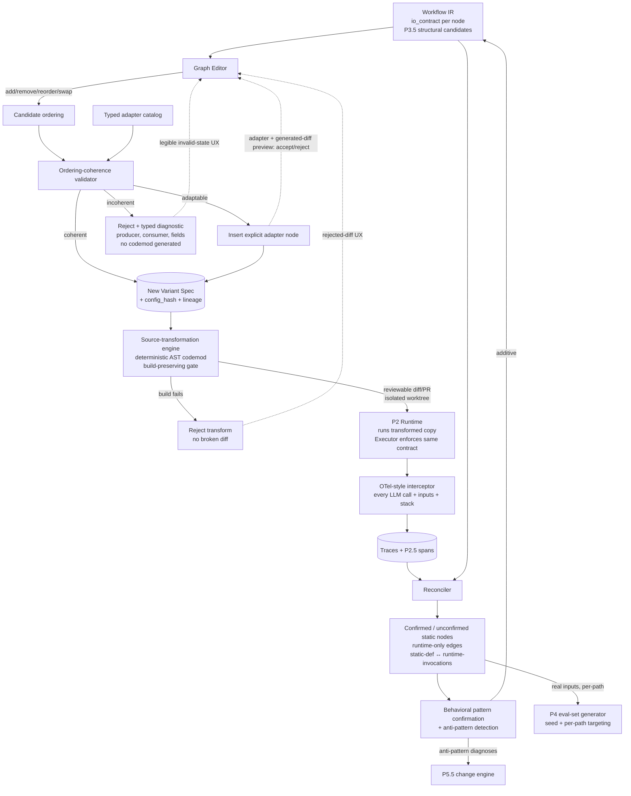

# PRD — P5: Typed I/O contracts + Node Re-arrangement + Dynamic tracing + Behavioral pattern classification

| Field | Value |
|---|---|
| Phase / Milestone | P5 / M7 |
| Target window | ~Weeks 24–30 |
| Lead role(s) | System Designer + Backend + Frontend + Product (co-leads) |
| Supporting role(s) | AI Engineer, DevOps |
| Status | Draft |
| OpenSpec change | `p5-contracts-rearrange-tracing` |

## 1. Summary

P5 closes **the biggest gap in the naïve design**: it lets users re-arrange the workflow graph
*safely*, and it validates the statically-discovered graph against what actually runs. Four leads
because safe re-arrangement is simultaneously a **schema** problem (System Designer), a **runtime**
problem (Backend), a **UI** problem (Frontend), and a **UX** problem (Product). It delivers three
tightly-coupled capabilities. First, a **typed per-node I/O contract validator + adapter
auto-inserter**: the `io_contract` reserved on every node since P0 is finally *enforced* — the
system decides whether a proposed ordering is coherent, and where two nodes' schemas don't match it
either **auto-inserts an explicit adapter** or **rejects the reorder**, but it **never silently
produces a broken workflow**. Per **ADR-001**, a coherent arrangement is *applied* by **transforming
the user's source code** — a deterministic, AST-level codemod that rewrites the affected call sites /
node wiring, delivered as a **reviewable diff/PR** on an isolated worktree — not by a runtime shim; the
typed contract gates codemod generation (validation runs *before* a transform exists), adapter
auto-insertion is itself a **generated code change**, and a transform that does not **build** is rejected
before it is ever proposed. The thesis extends: **no silently-broken reorder** and **no silently-broken
diff**. Second, a **dynamic-tracing interceptor + reconciler**: static
analysis produced a *candidate* graph; P5 confirms it by instrumenting a run — an OTel-style
interceptor logs every real LLM call, its inputs, and its stack, then reconciles the observed calls
against the static candidates, resolving runtime-dynamic dispatch (loops, conditional routing) that
static analysis cannot see and distinguishing **static node definitions** from **runtime
invocations** concretely. Third, **behavioral pattern classification**: now that real traces exist,
patterns topology could only *guess* are **confirmed** — iteration count > 1 on a self-edge →
Reflection, a planning node whose task list is consumed downstream → Planning, sample-N-then-vote →
Self-Consistency, memory read/write between turns → Memory Management, a human-approval pause →
HITL — and **anti-patterns** fall out (a reflection loop that never improves, a router that sends
everything one way, parallelization with no real independence) as typed diagnoses for P5.5. The
interactive **graph editor** ties it together: users add/remove/reorder/swap nodes to produce a new
Variant Spec, and — **the unhappy path designed first** — an invalid reordering is *legible*, not
silently broken.

## 2. Problem & context

By the end of P4 a user can run any Variant Spec over a coverage-measured eval set, multi-seed, and
rank variants on a CI-bounded leaderboard. But every Variant Spec so far is either the
statically-discovered graph or a *per-node* re-configuration of it (model/prompt/skill/context
swaps). Two structural gaps remain, and they are the two the source plan flags as "most likely to be
underestimated":

- **Re-arrangement is unsafe.** The naïve product ships "drag to reorder." But node B usually
  depends on B's parsing of A's output — arbitrary re-ordering is **not free**. Without enforcing a
  typed I/O contract, dragging node B ahead of node A (its data producer) silently produces a
  workflow that will fail at runtime or, worse, run and emit garbage. The `io_contract` has been a
  mandatory-but-unused field on every IR node since P0 precisely so this enforcement is cheap to add
  now rather than a ruinous retrofit.
- **The static graph is unvalidated against reality.** Static analysis produced a *candidate* graph.
  Runtime-dynamic dispatch — loops that iterate a variable number of times, conditional routing that
  only activates a branch under some inputs, dispatch through a wrapper static analysis couldn't
  fully resolve — is invisible to it. The IR may claim edges that never fire, and miss edges that
  only exist at runtime. And P3.5 could only mark Reflection/Planning/Memory/HITL as **structural
  candidates with capped confidence**, explicitly deferring confirmation to P5, because you cannot
  tell a one-shot self-edge from an iterating loop without watching it run.

**Upstream state assumed:** P0 frozen `workflow-ir.schema.json` — every node carries a mandatory
`io_contract` (`input_schema`, `output_schema` as JSON Schema draft 2020-12), the IR distinguishes
`static_definition` nodes from runtime invocations (`invocation_id`, `run_id`, `invocation_index`),
and reserves an additive `pattern_labels` field; the `config_hash`/lineage scheme. P2 Runtime whose
Executor already **passes node I/O through the typed contract and halts on a violation** (the same
contract P5 validates statically). P2.5 OTel span substrate + GenAI semantic conventions (the
interceptor extends it). P3 sandbox + provider gateway (the instrumented run executes here, never
with ambient credentials). P3.5 **structural** pattern labels, with behavioral patterns emitted as
capped-confidence candidates awaiting P5. P4 eval-set generator that already ships a
**seed-from-real-traces** plug-in interface, dark until P5 supplies the traces.

## 3. Goals & non-goals

### Goals
- G1. **Enforce the typed per-node I/O contract** (P0's `io_contract`) as a coherence check on any
  proposed node ordering: for every producer→consumer edge, decide whether the producer's
  `output_schema` satisfies the consumer's `input_schema`.
- G2. **Adapter auto-insertion as a generated code change.** Where a producer→consumer schema mismatch
  is bridgeable by a typed, lossless transform, the system SHALL synthesize an **explicit adapter node**,
  insert it into the Variant Spec, and **materialize it as a generated, reviewable source change** (a
  codemod that inserts the adapter's code and rewires the call sites) — never a hidden runtime coercion.
- G3. **No silently-broken reorder — and no silently-broken diff.** A proposed ordering whose mismatch is
  **not** bridgeable SHALL be **rejected** *before any codemod is generated*, with a typed diagnostic
  naming the producer, the consumer, and the exact schema fields that don't match; the incoherent Variant
  Spec is never persisted as runnable and produces no source transformation. This is the phase's
  load-bearing correctness property.
- G3a. **Apply-by-source-transformation (ADR-001).** A coherent arrangement SHALL be applied by
  generating a **deterministic, AST-level codemod** that rewrites the affected call sites / node wiring —
  not a runtime shim. The transform SHALL be **deterministic** (same `config_hash` + source →
  byte-identical diff), **build-preserving** (a codemod that fails to build the target is rejected before
  it is proposed), **behavior-preserving except for the intended change**, applied to an **isolated
  worktree/branch**, and delivered as a **reviewable diff/PR** revertible by `git revert`.
- G4. **Interactive graph editor.** Users add/remove/reorder/swap nodes and produce a **new Variant
  Spec** (new `config_hash`, lineage to the parent) **plus a reviewable source diff**, every edit
  validated through the typed-contract check before it can be committed.
- G5. **The unhappy path is legible (designed first).** An invalid reordering surfaces the contract
  mismatch, previews the auto-inserted adapter when one exists, and explains *what would break* when
  none does — the user is never left with a silently-broken graph.
- G6. **Keyboard-operable, accessible, responsive editor.** Full add/remove/reorder/swap by keyboard;
  labeled controls; screen-reader announcement of validation state; responsive on large IRs.
- G7. **Dynamic-tracing interceptor.** An OTel-style interceptor wraps SDK entrypoints and logs
  **every real LLM call, its inputs, and its call stack**, tagged with the P0 tag set.
- G8. **Reconcile against static candidates.** Match each observed call to a static candidate node;
  mark static candidates **confirmed / unconfirmed** and observed calls **matched / runtime-only**;
  surface **runtime-only edges** static analysis missed and reconcile them into the IR.
- G9. **Resolve runtime-dynamic dispatch.** Loops and conditional routing are resolved from concrete
  runtime invocations; a **static node definition** maps to its **many runtime invocations**
  (`invocation_index`) as P0 specified.
- G10. **Behavioral pattern confirmation.** Upgrade P3.5 structural candidates to **confirmed**
  labels from trace evidence — iteration count > 1 → Reflection; a consumed planning list →
  Planning; sample-N-then-vote → Self-Consistency; memory R/W between turns → Memory Management; a
  human-approval pause → HITL — and **wire pattern → metric-set / failure-taxonomy / eval-targeting**.
- G11. **Anti-pattern detection.** Emit typed anti-pattern diagnoses (reflection loop that never
  improves; router sending everything one way; parallelization with no real independence; plan never
  followed) as inputs to P5.5.
- G12. **Eval-set generation enrichment.** Seed the P4 generator from the new dynamic traces (real
  inputs) and add **per-path targeting** now that typed contracts and real runs exist.

### Non-goals (explicitly deferred, with the owning phase)
- **Change operators, proposal generation, and the held-out verification gate** — **P5.5**. P5
  *surfaces* anti-patterns as diagnoses and lets a user re-arrange by hand; it does not propose fixes
  or prove them. A re-arranged Variant Spec is scored by the P4 harness, but P5 does not rank or
  recommend re-arrangements.
- **Automated search over orderings / the autonomous optimizer** — **P6**. Manual re-arrangement is
  the baseline here; automated search is the payoff, later.
- **Inference of a node's `io_contract` where static analysis cannot** — P5 consumes the contracts as
  discovered (permissive where P0/P1 left them permissive) and *refines* them from observed trace
  shapes additively; it does not add a new discovery language or synthesizer.
- **LLM-authored, free-form adapter transform code** — P5 draws adapters only from a **typed adapter
  catalog** (rename, projection, wrap/unwrap, default-fill, declared format coercion), each emitting a
  fixed, deterministic codemod; free-form generated transform code beyond the catalog is out of scope
  (and would itself need P3 sandboxing + P5.5 verification).
- **Autonomous merge of a generated PR** — P5 *opens* reviewable diffs/PRs that a human approves;
  merging without human approval is **P6** (Autonomous). Below that level, nothing reaches the default
  branch without human approval and the build + eval verification gate.
- **New metric-set definitions** — P5 *wires* confirmed patterns to the metric-sets P3.5/P4 already
  defined; it does not author new metrics.

## 4. Users & personas

- **Workflow owner / editor (end user, primary)** — has a discovered workflow and wants to try a
  different node arrangement (reorder a critic before a formatter, drop a redundant node, swap two
  stages). Consumes the graph editor and, critically, the **invalid-state UX** that keeps them from
  shipping a broken graph.
- **AI/ML engineer (power user)** — instruments a real run to validate the static IR, inspects the
  reconciliation report (what static analysis missed), reviews confirmed behavioral labels and
  anti-pattern diagnoses, and uses trace-seeded per-path eval cases.
- **Downstream subsystems** — **P4** eval-set generator consumes the trace seeds + per-path targets;
  **P4.5** attribution consumes the reconciled runtime graph (per-invocation attribution needs the
  static↔runtime mapping) and the confirmed pattern labels (failure-taxonomy scoping); **P5.5**
  consumes the anti-pattern diagnoses as change-operator inputs and re-runs re-arranged Variant Specs
  through the P4 harness; **P6** consumes the ordering-coherence validator as the legal-move
  generator for its search.
- **Frontend / Product** — own the graph editor, the invalid-reorder UX, the adapter preview, and the
  reconciliation report screen.

## 5. User stories / jobs-to-be-done

**Workflow owner / editor**
- As an editor, I want to drag a node to a new position and, *if that ordering is incoherent*, be
  told exactly which two nodes' schemas don't match and why — so that I never ship a silently-broken
  workflow.
- As an editor, I want the system to offer an **adapter** when a reorder *almost* works (a field
  rename, a projection) and show me the adapter it would insert — so that I can accept a safe fix
  instead of hand-patching data flow.
- As an editor, I want a reorder that *cannot* be made coherent to be **blocked** (not saved as a
  runnable spec) with a plain-language explanation of what would break — so that "drag to reorder"
  is safe by construction.
- As an editor, I want to do every edit — add, remove, reorder, swap — from the keyboard, with the
  validation state announced — so that the editor is usable without a mouse.
- As an editor, I want a committed edit to produce a new, diffable Variant Spec with lineage to the
  original — so that I can compare arrangements on the P4 leaderboard.

**AI/ML engineer**
- As an ML engineer, I want to instrument a real run and see every actual LLM call with its inputs
  and stack — so that I can confirm the static graph reflects reality.
- As an ML engineer, I want the reconciler to flag a **runtime-only edge** static analysis missed
  (a conditional branch, a loop-back) — so that the IR is corrected to what actually runs.
- As an ML engineer, I want a self-edge that iterates > 1 time confirmed as **Reflection** (not a
  one-shot) from the trace — so that the right metric-set (iteration-count / convergence /
  quality-gain-per-revision) attaches automatically.
- As an ML engineer, I want a reflection loop that **never improves** flagged as an anti-pattern —
  so that P5.5 has a concrete diagnosis to act on.
- As an ML engineer, I want the eval-set generator seeded with real trace inputs and targeted
  per-path — so that generated cases exercise the paths that actually run.

**Downstream subsystem owner**
- As the P5.5 change engine, I want anti-pattern diagnoses as typed inputs and the ordering-coherence
  validator to legalize my proposed reorders — so that I never propose a broken graph.
- As the P4.5 attribution engine, I want the static↔runtime invocation mapping — so that I can
  attribute a failing *invocation* to its static node definition.

## 6. Functional requirements

These map 1:1 to the OpenSpec requirements under
`openspec/changes/p5-contracts-rearrange-tracing/specs/`.

**Typed contracts (`typed-contracts`)**
- FR1. The system SHALL validate a proposed node ordering by checking, for **every** producer→consumer
  data edge, whether the producer's `io_contract.output_schema` **satisfies** the consumer's
  `io_contract.input_schema` (structural/subtype compatibility: every field the consumer *requires*
  is present in and type-compatible with the producer's output; extra producer fields are permitted).
- FR2. For each mismatching edge the system SHALL classify the mismatch as **adaptable** (bridgeable
  by a typed adapter from the catalog) or **incoherent** (not bridgeable), and SHALL **never** admit a
  mismatching edge as coherent without either an adapter or a rejection.
- FR3. Where a mismatch is **adaptable**, the system SHALL synthesize an **adapter node** from the
  typed adapter catalog (field rename, projection, wrap/unwrap, default-fill, declared format
  coercion), insert it on the edge in the resulting Variant Spec, and **materialize it as a generated,
  reviewable source change** (a deterministic codemod that inserts the adapter's code and rewires the
  call sites) — represented as an **explicit, inspectable node** carrying its own `io_contract`, not a
  hidden runtime coercion.
- FR4. An adapter SHALL itself be validated: its `input_schema` SHALL be satisfied by the upstream
  producer and its `output_schema` SHALL satisfy the downstream consumer; the system SHALL NOT insert
  an adapter that would silently **drop a field the consumer requires** or lose data without flagging
  the loss, and the generated code change SHALL **build**.
- FR5. **No silently-broken reorder.** When a proposed ordering contains an **incoherent** edge with
  no admissible adapter, the system SHALL **reject** the ordering — *before any codemod is generated* —
  with a typed diagnostic that names the producer node, the consumer node, and the specific schema
  field(s) that fail to match, and SHALL NOT persist the incoherent ordering as a runnable Variant Spec
  or generate any source transformation for it.
- FR6. A coherent ordering — including one made coherent by inserted adapters — SHALL produce a new
  Variant Spec with a new `config_hash` whose node I/O is guaranteed to pass the **same** typed
  contract the P2 Executor enforces at runtime (on the **transformed** working copy), so static
  validation and runtime enforcement never disagree.
- FR6a. **Apply-by-source-transformation (ADR-001).** Applying a coherent Variant Spec SHALL mean
  generating a **deterministic, AST-level source transformation (codemod)** that rewrites the affected
  call sites / node wiring to match the spec — not resolving config through a runtime shim. The
  transform SHALL be **deterministic** (same `config_hash` + same source → byte-identical, content-hashed
  diff), **build-preserving** (a codemod that fails to compile/build the target SHALL be rejected before
  it is proposed — no broken diff reaches the user), **behavior-preserving except for the intended
  change** (only the reordered wiring + any inserted adapter move), applied to an **isolated
  worktree/branch** (never the user's working tree in place), and delivered as a **reviewable diff/PR**
  revertible by a single `git revert`. Below the P6 Autonomous level, no diff merges to the default
  branch without human approval and the build + eval verification gate.
- FR7. The validator SHALL be a **pure, deterministic** function of the two schemas and the adapter
  catalog: the same ordering over the same IR SHALL yield the same coherent/adaptable/incoherent
  verdict and the same inserted adapters every time.

**Re-arrangement (`rearrangement`)**
- FR8. The graph editor SHALL expose the Workflow IR and let a user **add, remove, reorder, and swap**
  nodes, producing a **candidate** new Variant Spec that is **not committed** until it passes
  typed-contract validation; commit generates the reviewable source diff, not a runtime shim update.
- FR9. Every edit SHALL be validated through the `typed-contracts` check **before commit** (and
  therefore before any codemod is generated); an edit that yields an incoherent, un-adaptable ordering
  SHALL NOT be silently committed and SHALL NOT produce a source diff.
- FR10. **The invalid state is legible (unhappy path, first-class).** When an edit yields a mismatch,
  the editor SHALL surface the contract mismatch (the two nodes and the specific fields), SHALL
  **preview the auto-inserted adapter and the source change it would generate** when the mismatch is
  adaptable, and SHALL **explain what would break** when it is not — in plain language attached to the
  offending edge, not a generic error; an invalid reorder is legible as a **rejected or adapted diff
  that is never applied**.
- FR11. When an adapter can bridge a mismatch, the editor SHALL show the adapter it would insert and
  require the user to **accept or reject** it; the workflow SHALL never be committed in a broken state
  whether the user accepts or declines.
- FR12. The editor SHALL be **fully keyboard-operable** (add/remove/reorder/swap without a pointer),
  with labeled controls, managed focus, and **screen-reader announcement of the validation state**
  (coherent / adapter-inserted / rejected).
- FR13. The editor SHALL remain **responsive on large IRs** (virtualized/canvas rendering, incremental
  re-validation of only the affected edges) so editing a large graph does not block the UI.
- FR14. A committed edit SHALL produce a new Variant Spec with **lineage to the parent** and a diff,
  so the arrangement can be compared against its parent on the P4 leaderboard, **and** a **reviewable
  source diff (an AST-level codemod rewriting node wiring)** that must **build** before it is proposed
  and is applied on an isolated worktree/branch, never the user's working tree in place (FR6a).

**Dynamic tracing (`dynamic-tracing`)**
- FR15. An **OTel-style interceptor** SHALL wrap the SDK entrypoints in the signature registry and log
  **every real LLM call, its inputs, and its call stack**, each event tagged with the P0 tag set
  (`{variant_id, run_id, node_id, case_id, seed, timestamp, config_hash}`) and correlated to a span.
- FR16. The reconciler SHALL match each observed call to a **static candidate** node, marking each
  static candidate **confirmed** (observed) or **unconfirmed** (never observed on the traced run) and
  each observed call **matched** (maps to a candidate) or **runtime-only** (no static candidate).
- FR17. The reconciler SHALL surface a **runtime-only edge or node that static analysis missed** (a
  conditional branch, a loop-back, dispatch through an unresolved wrapper) and reconcile it into the
  IR additively, distinguishing it as observed-at-runtime.
- FR18. The reconciler SHALL **resolve runtime-dynamic dispatch** by mapping one **static node
  definition** to its **many runtime invocations** (`invocation_index` 0..n as P0 specifies), so a
  loop is one definition with n observed invocations — never n definitions.
- FR19. **Behavioral pattern confirmation.** From trace evidence the classifier SHALL upgrade a P3.5
  structural candidate to a **confirmed** label: iteration count > 1 on a self-edge → **Reflection**;
  a planning node emitting a task list consumed downstream → **Planning**; sampling one node N times
  then voting → **Self-Consistency (Reasoning Techniques)**; memory read/write against a store between
  turns → **Memory Management**; a human-approval pause in the trace → **Human-in-the-Loop**. A
  confirmed label SHALL carry `source = behavioral` and SHALL select the pattern's
  metric-set / failure-taxonomy / eval-targeting.
- FR20. **Anti-pattern detection.** The classifier SHALL emit typed **anti-pattern** diagnoses from
  trace evidence — a Reflection loop whose quality does not improve across iterations; a Router that
  sends (nearly) all traffic to one branch; Parallelization whose branches are not actually
  independent; a Plan that is never followed — each as a structured diagnosis (pattern, subgraph,
  evidence) consumable by P5.5.
- FR21. **Eval-set enrichment.** The system SHALL make the observed trace inputs available to the P4
  eval-set generator as **seed cases**, and SHALL enable **per-path targeting** (generate cases that
  force each reconciled path, including runtime-only edges and loop min/typical/max iteration counts).
- FR22. The interceptor SHALL be **passive**: it SHALL NOT alter the traced workflow's behavior or
  outputs, and it SHALL redact secrets/PII from logged inputs (content-hashed blobs, secrets sourced
  from the manager, never inline) — instrumentation that changes the run is invalid evidence.

## 7. Non-functional requirements

- **Coherence is deterministic and total (first-class).** The ordering-coherence verdict
  (coherent / adapter-inserted / incoherent) is a pure function of the schemas + adapter catalog
  (FR7) and is defined for **every** producer→consumer edge (FR1) — there is no "unclassified" state
  that could leak a broken graph through. Tested with a reorder whose true state is incoherent: the
  validator returns *rejected*, never *coherent*.
- **Static/runtime contract parity.** The schema-compatibility rule the validator uses is the **same**
  rule the P2 Executor enforces at runtime (FR6); a Variant Spec the validator accepts SHALL NOT halt
  on a typed-contract violation at runtime, and one it rejects SHALL NOT be runnable. Tested by
  applying a validator-accepted reorder as a source diff and running the transformed copy end-to-end and
  asserting no contract halt.
- **Source-transformation safety (first-class, ADR-001).** Applying an arrangement is a **deterministic,
  AST-level codemod** (same `config_hash` + source → byte-identical, content-hashed diff), **build-
  preserving** (a codemod that fails to build the target is rejected before it is proposed — no broken
  diff reaches the user), **behavior-preserving except for the intended change**, applied to an
  **isolated worktree/branch** (never the user's tree in place), delivered as a **reviewable diff/PR**,
  and revertible by a single `git revert`. Tested with a build-breaking codemod (rejected, not applied)
  and a re-generation determinism check.
- **Interceptor overhead bounded.** The dynamic-tracing interceptor adds ≤ a configured overhead
  budget (target < 5% wall-clock and no added provider calls) to the traced run and never blocks it;
  logging is async and best-effort so a logging failure never fails the run.
- **Reconciliation is reproducible.** A given `{config_hash, seed}` traced run reconciles to the same
  confirmed/unconfirmed/runtime-only verdicts (inherits P2 reproducibility); the reconciliation report
  is content-addressed so it is attributable to an exact run.
- **Editor performance & a11y (first-class).** The editor renders large IRs (target: hundreds of
  nodes) with virtualized/canvas rendering and re-validates only the affected edges on each edit
  (< 200 ms perceived validation on a single reorder); it is fully keyboard-operable and
  screen-reader-legible (WCAG AA contrast on node/edge/validation encodings; the invalid/adapter
  states are distinct, labeled, not color-only).
- **Security / isolation.** The instrumented run executes only in the P3 sandbox with no ambient
  credentials; logged inputs are content-hashed blobs; secrets never appear in trace logs, stacks, or
  the reconciliation report (inherits P2 secrets discipline). Adapters are drawn from a **typed
  catalog** — no arbitrary generated code executes as an adapter.
- **Additivity.** Reconciled runtime edges/nodes and confirmed behavioral labels are written back to
  the IR **additively** (same `ir_version` MAJOR); a pre-P5 consumer still parses a reconciled,
  behaviorally-labeled IR.

## 8. System design summary

**Data flow.**

**Storage (System Designer lens).**
- **Postgres** — `variant_spec` gains `parent_variant_id` (lineage) and an `adapters` list per
  inserted adapter (`adapter_id`, edge, catalog kind, `io_contract` hash); `reconciliation`
  (`run_id`, per static candidate: `confirmed BOOL`, per observed call: `matched|runtime_only`,
  runtime-only edges); `behavioral_label` (subgraph_ref → pattern, `source = behavioral`, evidence
  ref, confidence); `anti_pattern` (subgraph_ref → kind, evidence ref). The `io_contract` schemas
  live in the IR (P0) — P5 reads them, and writes refined schemas back additively.
- **Object store** — logged call inputs, call stacks, adapter definitions, generated diffs/codemods, and
  reconciliation reports, content-hashed; DB holds hashes + tags only. No prompt/PII inline.
- **Worktree pool / build cache (ADR-001)** — transforms apply to isolated git worktrees/branches; the
  Runtime manages a working-copy + build cache per variant so the transformed copy (not a shimmed run) is
  what is measured; the generated diff/PR is the audit trail and `git revert` the rollback.
- **Span store / TSDB (P2.5)** — the spans the interceptor correlates to; the interceptor emits, it
  does not re-store.

**Key interfaces.**
- `Satisfies(output_schema, input_schema) → {ok | mismatch(fields)}` — structural subtype check; the
  same predicate the P2 Executor uses.
- `ValidateOrdering(ir, ordering, catalog) → {coherent | adapted(adapters) | rejected(diagnostics)}`
  — pure, deterministic, total over all edges.
- `Adapter{kind, in_schema, out_schema, emit_codemod}` from a fixed **catalog**; each carries its own
  `io_contract` and emits a deterministic codemod.
- `GenerateTransform(ir, variant_spec, source) → Diff | RejectedTransform(build_error)` — deterministic
  AST-level codemod; build-preserving; applied to an isolated worktree; reviewable diff/PR (ADR-001).
- `Editor.Commit(edit) → {VariantSpec, ReviewableDiff} | InvalidState(mismatch) | RejectedTransform` —
  never commits a broken spec; never applies a diff that won't build.
- `Interceptor.wrap(entrypoint) → logs {call, inputs_hash, stack, tags}` — passive, async.
- `Reconcile(ir, trace) → ReconciliationReport{confirmed[], unconfirmed[], runtime_only[], invocations}`.
- `ConfirmBehavioral(ir, trace) → {labels[], anti_patterns[]}` — upgrades P3.5 candidates; wires
  pattern → metric-set.
- `SeedFromTraces(trace) → []EvalCaseSeed` + `PerPathTargets(reconciled_ir)` — feeds the P4 generator.

## 9. Design by role lens

**System Designer (co-lead) — *numbers before boxes; state trade-offs explicitly.***
Owns the **typed I/O contract as the interface that makes re-arrangement safe** — the highest-leverage
P0 decision (designed once, early), now enforced. The discipline lands as:
- *The contract is the interface.* `Satisfies(output, input)` is a single, precisely-specified
  structural-subtype predicate, and it is **the same predicate** the P2 Executor enforces at runtime —
  static validation and runtime enforcement cannot disagree (FR6). Defining it once, on the schemas
  P0 froze, is what prevents the "validator says yes, runtime halts" class of bug.
- *Totality over the graph.* The verdict is defined for **every** producer→consumer edge with no
  escape hatch — there is no "unknown" bucket a broken ordering could slip through. Coherent /
  adaptable / incoherent partition the space (FR1, FR2).
- *State the trade-off: permissive schemas.* P0 allowed permissive early schemas (`{"type":"object"}`)
  where static analysis couldn't infer shape. The Designer states plainly: a permissive schema admits
  more orderings as "coherent" than a strict one would — so P5 **refines** schemas from observed trace
  shapes additively (dynamic tracing feeds the contract), tightening coherence over time without a
  schema-version break.
- *Data model for lineage + reconciliation.* Sizes the reconciliation store (one report per traced
  run) and the static-def↔runtime-invocation mapping (one definition, n invocations) so P4.5 can
  attribute an invocation to its definition.

**Backend (co-lead) — *contracts outlive code; partial failure; harden.***
Owns the **validator + adapter inserter**, the **source-transformation engine** (ADR-001), and the
**interceptor + reconciler** as services.
- *Contracts outlive code.* The adapter catalog is a versioned, additive contract; an inserted adapter
  carries its own `io_contract` and is validated like any node (FR4) — the system never trusts an
  adapter it hasn't type-checked. No adapter silently drops a required field, and each adapter emits a
  deterministic codemod rather than a runtime coercion.
- *Apply is a source transformation, not a shim (ADR-001).* A coherent Variant Spec is applied by
  generating a **deterministic, AST-level codemod** that rewrites the call sites / node wiring — the
  same `config_hash` + source yields a byte-identical diff. The transform is **build-preserving** (a
  codemod that won't build is rejected before it is proposed — no broken diff), behavior-preserving
  except for the intended change, applied to an isolated worktree, and delivered as a reviewable PR
  (`git revert` = rollback). This resolves the compiled-language feasibility hole and makes the eval
  harness measure the code that actually ships (FR6a).
- *Fail closed.* An incoherent ordering is **rejected** *before any codemod is generated*, not
  best-effort-run (FR5) — the same fail-closed posture as the P2 Loader aborting on a dangling ref. The
  incoherent Variant Spec is never persisted as runnable and no transform is produced for it.
- *Partial failure in tracing.* The interceptor is **passive and async** (FR22): a logging failure
  never fails the traced run, and instrumentation never alters outputs — otherwise the evidence is
  worthless. Reconciliation tolerates a partial trace (marks unobserved candidates *unconfirmed*, not
  *deleted*).
- *Harden.* The instrumented run executes in the P3 sandbox with no ambient credentials; logged inputs
  and stacks are content-hashed blobs; secrets never enter trace logs. Adapters run only from the
  typed catalog — no generated transform code executes.
- *Idempotency.* Re-tracing the same `{config_hash, seed}` reconciles to the same verdicts; writing
  reconciled edges/labels back to the IR is additive and idempotent.

**Frontend (co-lead) — *match the codebase, smallest correct change, a11y & perf are requirements.***
Owns the **interactive graph editor** and its states.
- *The invalid state is a first-class state.* Loading / valid / **adapter-inserted** (with a preview of
  the source diff it would generate) / **rejected** / **rejected-transform** (the codemod would not
  build) are modeled explicitly per edit; the editor reads the validator's verdict as truth and never
  renders a committed-but-broken graph or applies a broken diff. The rejected state is attached to the
  **specific offending edge** with the mismatching fields named — not a global toast.
- *Accessibility as a gate.* Every edit — add/remove/reorder/swap — is keyboard-operable; controls are
  labeled; focus is managed across a drag/reorder; the validation verdict is announced to a screen
  reader (FR12). The adapter-inserted and rejected states are distinct and **not color-only**.
- *Performance.* Large IRs render on a virtualized canvas; a single reorder re-validates only the
  affected edges (< 200 ms), not the whole graph — the node canvas stays responsive on hundreds of
  nodes (FR13).
- *Verify before done.* Drive the editor against a live IR: reorder into an incoherent state and
  confirm it is blocked + legible with **no diff generated**; reorder into an adaptable state and confirm
  the adapter + its **generated diff** preview, that the committed reorder emits a **reviewable diff that
  builds**, and that the transformed working copy runs without a runtime contract halt.

**Product (co-lead) — *design the unhappy path first; content is the interface; name the tradeoff.***
Owns the **re-arrangement UX**, explicitly the riskiest interaction in the product.
- *Design the unhappy path first.* The primary design artifact is not the successful drag — it is the
  **invalid reorder**. The mismatch must be legible: *which* two nodes, *which* fields, and *what*
  breaks. When an adapter can bridge, the UX offers it and shows exactly what it inserts; when nothing
  can, the UX explains why and blocks the commit. "Drag to reorder" is never allowed to silently
  produce a broken workflow — nor a broken **diff**: a reorder whose codemod won't build is surfaced as
  a rejected diff, never applied (ADR-001). This is the phase's product thesis (FR5, FR6a, FR10).
- *PR-native mental model.* An applied arrangement is a **reviewable pull request** against the user's
  repo — the model developers already trust from Dependabot/Renovate/coding agents — not zero-code-change
  "magic." The UX previews the exact source change, and git history + `git revert` are the audit trail
  and rollback the user already understands.
- *Content is the interface.* An adapter must be named for what it does ("insert adapter: rename
  `answer`→`response`"), a rejection must state the concrete breakage ("node *Formatter* requires
  field `summary`, which *Router* does not produce"), and a confirmed **anti-pattern** must show its
  evidence (the iterations where quality didn't move), not just a label.
- *Name the tradeoff.* An inserted adapter is a real change to data flow — and now a real change to
  source — the UX names it as such, attributes it, and shows the diff it generates, so the user knows the
  arrangement they're comparing includes an adapter. A refined-from-traces schema that tightens coherence
  is surfaced, not silent.
- *Journey.* Import → inspect graph → **re-arrange (with the safety rails above)** → run on the P4
  harness → compare. Designs the reconciliation-report moment ("here's what actually ran vs. what we
  discovered") as a legible screen.

**AI Engineer (support) — *evals before optimization; verification decides; rules first, LLM for the residue.***
Owns **dynamic-tracing reconciliation logic, behavioral pattern confirmation, anti-pattern detection,
and eval-set seed enrichment**.
- *Rules first.* Behavioral confirmation is **deterministic rules over trace signatures** — iteration
  count, a task list consumed downstream, N-samples-then-vote, memory R/W between turns, an approval
  pause — the same rules-first discipline as the P3.5 structural detectors and the P4.5 diagnosis
  engine. The LLM classifier is only the fuzzy residue, constrained to the fixed 20-pattern taxonomy.
- *Confirm what topology could only guess.* P3.5 emitted Reflection/Planning/Memory/HITL as
  **capped-confidence candidates**; P5 upgrades them to **confirmed** from evidence and wires the
  pattern to its metric-set / failure-taxonomy / eval-targeting — a self-edge that iterates once is
  *not* Reflection and gets no convergence metrics.
- *Anti-patterns are diagnoses, not verdicts.* A reflection loop that never improves is *surfaced* as
  a typed diagnosis for P5.5; P5 does not fix it. Diagnosis proposes; **verification (P5.5) decides**.
- *Eval enrichment.* Real trace inputs seed the P4 generator (the realistic baseline the generator's
  seed interface has awaited since P4), and per-path targeting now covers reconciled runtime-only
  edges and loop iteration bounds.

**DevOps (support) — *if it isn't observable it isn't done; least-privilege; blast radius.***
Owns the **interceptor instrumentation** as an operational concern.
- *Observable by construction.* The interceptor extends the P2.5 OTel substrate (GenAI semantic
  conventions) rather than inventing bespoke logging — every real call becomes a correlated span with
  inputs + stack, tagged with the P0 tag set (FR15).
- *Least privilege.* The instrumented run executes in the P3 sandbox with no ambient credentials;
  secrets are sourced from the manager and never touch trace logs, stacks, or the reconciliation
  report. Logged inputs are content-hashed blobs (FR22).
- *Bounded blast radius.* Instrumentation is passive and async (best-effort, non-blocking) with a
  bounded overhead budget; a logging failure degrades to a partial trace, never a failed run.
  Interceptor wrapping is scoped to the signature-registry entrypoints, not arbitrary monkey-patching
  of the whole process.

## 10. Dependencies

- **Requires (upstream):** **P0** (`workflow-ir.schema.json` — mandatory `io_contract` per node, the
  `static_definition`↔runtime-invocation distinction, the reserved additive `pattern_labels`,
  `config_hash`/lineage); **P2** (Runtime whose Executor already passes node I/O through the typed
  contract and halts on violation — the runtime half of the static/runtime parity; the run queue;
  reproducibility + idempotency; Variant Spec + `config_hash`); **P2.5** (OTel span substrate + GenAI
  semantic conventions the interceptor extends; the tag set); **P3** (sandbox + provider gateway for
  the instrumented run); **P3.5** (structural pattern candidates with capped confidence, awaiting P5
  behavioral confirmation; the pattern→metric-set mapping to wire); **P4** (eval-set generator's
  seed-from-real-traces interface + coverage machinery to enrich; the harness that scores re-arranged
  variants).
- **Consumes:** a runnable Variant Spec + an input to trace; the discovered IR + its `io_contract`s.
- **Unblocks:** **P4.5** (reconciled static↔runtime mapping → per-invocation attribution; confirmed
  labels → failure-taxonomy scoping); **P5.5** (anti-pattern diagnoses → change operators;
  ordering-coherence validator → legal-move check on proposed reorders; the P4 harness re-runs
  re-arranged specs); **P6** (the validator is the autonomous optimizer's legal-move generator for
  search over orderings; trace-seeded eval cases are the living memory).

## 11. Risks & mitigations

| Risk | Owner | Mitigation |
|---|---|---|
| "Drag to reorder" silently ships a broken workflow | System Designer / Product | Ordering-coherence verdict is total over all edges; an incoherent, un-adaptable reorder is **rejected** with named producer/consumer/fields, never persisted as runnable (FR1, FR5); tested with a known-incoherent reorder |
| Validator accepts an ordering the runtime then halts on | System Designer / Backend | `Satisfies` is the **same predicate** the P2 Executor enforces (FR6); test runs a validator-accepted reorder end-to-end and asserts no contract halt |
| An adapter silently drops a required field / loses data | Backend | Adapters drawn from a typed catalog; each carries its own `io_contract` and is validated; no adapter that drops a consumer-required field without flagging the loss (FR3, FR4) |
| A generated codemod produces a broken diff (won't build / incidental edits) | Backend | Build-preserving + behavior-preserving gate: a codemod that fails to build the target is **rejected before it is proposed**; the diff touches only reordered wiring + any adapter; applied on an isolated worktree, delivered as a reviewable PR, reverted with `git revert` (FR6a) |
| Applied diff is non-deterministic / not reproducible | System Designer / Backend | Deterministic AST-level transform: same `config_hash` + same source → byte-identical, content-hashed diff (FR6a, FR7) |
| A bad change reaches the user's default branch unreviewed | Product / DevOps | Every change is a reviewable diff/PR; below P6 Autonomous nothing merges without human approval + the build + eval verification gate (FR6a) |
| Permissive P0 schemas admit incoherent orderings as "coherent" | System Designer | Refine schemas from observed trace shapes additively (dynamic tracing tightens the contract); surface which nodes still carry permissive schemas |
| Interceptor alters the traced run's behavior/outputs → invalid evidence | Backend / DevOps | Interceptor is passive + async; a logging failure never fails the run; assert identical outputs traced vs. untraced (FR22) |
| Static analysis missed a runtime-only edge → wrong graph | AI / Backend | Reconciler flags runtime-only edges/nodes and adds them additively; unobserved candidates marked *unconfirmed*, not deleted (FR16, FR17) |
| A one-shot self-edge is mislabeled Reflection | AI | Behavioral confirmation requires iteration count > 1 from the trace; a self-edge that runs once is **not** confirmed Reflection and gets no convergence metrics (FR19) |
| Anti-pattern flagged is treated as a verdict / auto-fixed | AI / Product | Anti-patterns are typed **diagnoses** with evidence for P5.5; P5 does not fix; verification decides (FR20) |
| Secrets/PII leak into trace logs or stacks | DevOps | Sandbox, no ambient credentials, content-hashed input blobs, secrets from the manager only — inherits P2 discipline (FR22) |
| Editor unusable by keyboard / unresponsive on large IRs | Frontend | Full keyboard operation + screen-reader validation announcements; virtualized canvas + incremental per-edge re-validation (FR12, FR13) |
| Behavioral label / reconciled edge write breaks pre-P5 consumers | System Designer | Writes are additive at the same `ir_version` MAJOR; a pre-P5 consumer still parses the labeled IR |

## 12. Rollout & test strategy

- **Fixtures.** A multi-pattern workflow with (a) a **linear producer→consumer chain** whose reorder
  is *incoherent* (consumer requires a field the swapped-in producer doesn't emit); (b) a pair whose
  reorder is *adaptable* by a field-rename adapter; (c) a **loop / self-edge** that iterates a variable
  number of times at runtime; (d) a **conditional router** with a branch that only fires on some
  inputs (a runtime-only edge static analysis misses); (e) a reflection loop with a variant that
  **never improves** across iterations (anti-pattern).
- **Typed-contract tests.**
  - A reorder that makes the consumer precede its data producer → **rejected** *before any codemod is
    generated*, diagnostic names both nodes + the missing field; the spec is **not** persisted as
    runnable and **no diff** is produced.
  - A reorder bridgeable by a rename → **adapter inserted** as an explicit node with its own
    `io_contract`, emitted as a **reviewable diff that builds**; the transformed working copy **runs
    end-to-end without a runtime contract halt** (static/runtime parity).
  - An adapter that would drop a consumer-required field → **refused**, not inserted.
  - Determinism: the same reorder over the same IR yields the same verdict + same adapters twice.
  - **Source-transformation (ADR-001):** a coherent reorder → **byte-identical diff** on re-generation; a
    codemod that fails to build → **rejected before proposal**, not applied; the change is applied on an
    isolated worktree (user tree untouched) and reverts cleanly with `git revert`; the diff touches only
    reordered wiring + any inserted adapter.
- **Re-arrangement UX tests.**
  - Drag into an incoherent state → the offending **edge** shows the mismatch (both nodes, the
    fields) and the commit is blocked; a screen reader announces "rejected".
  - Drag into an adaptable state → the adapter previews; accept → committed with adapter; decline →
    reverts, never committed broken.
  - Full add/remove/reorder/swap performed **by keyboard only**; validation state announced.
  - Large-IR responsiveness: a reorder on a hundreds-of-node graph re-validates only affected edges
    < 200 ms.
- **Dynamic-tracing tests.**
  - Instrument the fixture run → **every** LLM call is logged with inputs + stack, tagged with the P0
    tag set.
  - The **conditional-router** fixture: the reconciler flags the branch edge as **runtime-only**
    (static analysis missed it) and adds it to the IR additively.
  - The **loop** fixture: one static definition ↔ **n runtime invocations** (`invocation_index`
    0..n−1), not n definitions.
  - Traced vs. untraced outputs are **identical** (passive interceptor).
- **Behavioral-classification tests.**
  - The self-edge that iterates > 1 time is **confirmed Reflection** (`source = behavioral`) and
    selects iteration-count / convergence / quality-gain-per-revision; a self-edge that runs **once**
    is **not** confirmed Reflection.
  - The never-improving reflection loop is emitted as a typed **anti-pattern** diagnosis with the
    per-iteration quality evidence attached.
- **Eval-enrichment test.** Real trace inputs appear as **seed cases** in the P4 generator and
  per-path targeting generates a case that forces the reconciled runtime-only edge.
- **Rollout.** Internal-only, behind the run queue; instrumentation opt-in per traced run; editor
  ships dark until the M7 exit checklist is green. Migrations expand-only (variant-spec lineage +
  adapters, reconciliation, behavioral-label, anti-pattern tables). Schema refinements written back to
  the IR are additive (no `ir_version` MAJOR bump).

## 13. Success metrics & acceptance criteria (M7 exit checklist)

- [ ] A user **re-orders a graph**; an **incoherent** ordering is **flagged/rejected** (not silently
      broken), naming the producer, consumer, and mismatching field(s); the incoherent spec is not
      runnable.
- [ ] An **adaptable** mismatch results in an **explicit auto-inserted adapter node** (from the typed
      catalog, carrying its own `io_contract`), materialized as a **reviewable diff that builds**; the
      transformed working copy **runs without a runtime contract halt** (static/runtime parity).
- [ ] No adapter is inserted that would **silently drop a consumer-required field**.
- [ ] Applying a coherent arrangement generates a **deterministic, build-preserving, reviewable source
      diff (codemod)** on an isolated worktree (ADR-001); a codemod that won't build is **rejected before
      proposal**, and the diff is byte-identical on re-generation and revertible by `git revert`.
- [ ] The graph editor supports **add/remove/reorder/swap**, produces a **new Variant Spec** with
      lineage **plus a reviewable source diff**, and validates every edit before commit.
- [ ] The **invalid-reorder UX is legible** — the mismatch is attached to the offending edge, the
      adapter is previewed when available, and the breakage is explained when not — **first-class**,
      not a generic error.
- [ ] The editor is **fully keyboard-operable**, screen-reader announces the validation state, and it
      stays **responsive on a large IR**.
- [ ] **Dynamic tracing** instruments a run and logs **every real LLM call, its inputs, and its
      stack**, tagged with the P0 tag set.
- [ ] The reconciler **reconciles the trace against the static IR**: confirmed/unconfirmed static
      nodes, and a **runtime-only edge static analysis missed** is surfaced and added additively.
- [ ] A **static node definition** is distinguished from its **runtime invocations** concretely (one
      definition, n invocations).
- [ ] **Behavioral tracing confirms Reflection** via iteration count > 1 on a self-edge (and does
      *not* confirm it for a one-shot); the confirmed label selects the Reflection metric-set.
- [ ] At least one **anti-pattern** (e.g. a never-improving reflection loop) is emitted as a typed
      diagnosis with evidence for P5.5.
- [ ] The P4 eval-set generator is **seeded from the dynamic traces** and does **per-path targeting**
      over the reconciled graph.

## 14. Open questions

- Q1. **Schema-satisfaction semantics.** Is `Satisfies` strict structural subtyping (consumer's
  required fields ⊆ producer's fields, types invariant), or does it allow width + depth coercions
  (e.g. numeric widening, optional→required)? (Proposed: structural subtyping with an explicit,
  catalogued coercion set — anything outside the catalog is *incoherent*, never silently coerced.)
- Q2. **Adapter catalog scope.** Which transforms are in the fixed catalog (rename, projection,
  wrap/unwrap, default-fill, declared format coercion) and where is the line to "needs generated code"
  (out of scope, deferred with sandboxing + P5.5 verification)?
- Q3. **Permissive-schema coherence.** When a node's `io_contract` is still permissive
  (`{"type":"object"}`), *every* ordering is trivially "coherent" against it — does P5 warn that
  coherence is unverified for that edge, and does trace-driven refinement (FR-refine) run automatically
  or on request?
- Q4. **Reconciliation of an unobserved candidate.** A static candidate never hit on the traced run is
  *unconfirmed* — is it kept (a path this input didn't exercise) or flagged dead (never reachable)?
  Distinguishing "not exercised by this case" from "unreachable" needs multi-case tracing. (Proposed:
  keep as *unconfirmed*, escalate to *suspected-dead* only after path-covering traces from the P4
  generator.)
- Q5. **Behavioral confirmation thresholds.** How many iterations / samples / turns constitute
  "confirmed" Reflection / Self-Consistency / Memory across a multi-case, multi-seed set — a single
  observed iteration, or a rate across cases?
- Q6. **Anti-pattern thresholds.** What defines "never improves" (zero mean quality-gain across
  iterations, or gain within CI of zero) and "router sends everything one way" (a traffic-share
  threshold), and are these per-pattern defaults or user-tunable?
- Q7. **Adapter and refinement lineage on the leaderboard.** When a re-arranged variant includes an
  inserted adapter or a trace-refined schema, how is that surfaced in the P4 config lineage so a
  comparison is apples-to-apples?
- Q8. **Codemod delivery granularity (ADR-001).** Is each committed arrangement one PR, or are related
  reorders/adapters batched into a single reviewable PR to bound review burden? And what is the branch /
  worktree lifecycle (per-variant, per-session) and build-cache eviction policy for the worktree pool?
- Q9. **Transform robustness across source shapes.** When the discovered call site is behind a wrapper,
  a macro, or generated code the codemod can't rewrite deterministically, is that surfaced as a
  **rejected transform** (like a build failure) rather than a best-effort edit — keeping "no
  silently-broken diff" total?
