# PRD — P5.5: Proposal operators + Verification gate (advisory/assisted)

| Field | Value |
|---|---|
| Phase / Milestone | P5.5 / M8 |
| Target window | ~Weeks 29–34 |
| Lead role(s) | AI Engineer |
| Supporting role(s) | System Designer, Frontend, Product Designer, DevOps |
| Status | Draft |
| OpenSpec change | `p5.5-proposals-verification` |

## 1. Summary

P5.5 is what separates the improvement engine from a plausible-sounding suggestion box: it turns the
read-only diagnoses P4.5 produced into **concrete source-code changes delivered as reviewable
diffs / pull requests** and **proves each one before it reaches the user**. Every diagnosis maps to a
**change operator** that emits candidate Variant Specs (upgrade/downgrade model, rewrite prompt
grounded in failing cases, switch context policy, tune RAG, add/fix a tool, prune a redundant node)
**and the concrete source diff a deterministic AST-level codemod produces by rewriting the discovered
call site(s) to the spec's values** (ADR-001); each candidate is ranked by **expected gain / cost of
change** under the user's hard constraints and presented as a **reviewable source diff (paired with
the P5 Variant-Spec diff) with the diagnosis and the specific failing cases attached as evidence**. A
diff that fails to build is rejected before it is ever surfaced. Before anything surfaces, the
**verification gate** auto-executes the **transformed working copy** (the built codemod output — the
code that would actually ship, not a shimmed run) on the eval dataset — **held out where possible** so
the recommendation is not overfit to the cases that generated it — applies the P4 **statistical gate**
(multi-seed, CIs, significance vs. baseline), runs a **regression check** on other clusters and the
cost/latency budget, and emits a **verdict**: measured delta with CI, cost/latency impact, cases
fixed and cases broken. The AI Engineer's one law governs the phase — **analysis without
verification is confident guessing** — so its load-bearing guarantee is blunt: **nothing unverified
reaches the user.** Two automation levels ship: **Advisory** (open a draft PR / report the verified
diff, the human applies and merges) and **Assisted** (one-click open the verified pull request, the
human still reviews and merges). In both, the change reaches the repo only as a reviewable diff/PR;
the system never merges to the default branch and never mutates the working tree in place — rollback
is `git revert`, the audit trail is git history.

## 2. Problem & context

After P4.5 the platform localizes a failure to a node + dimension and attaches a named, typed cause
("node 3 is a reasoning-heavy node on a weak model", "the RAG node returns low-relevance chunks",
"the output-contract is ignored so downstream parsing fails") — but it is **read-only**. It says
*what* is wrong and *why*; it does not say *what to change*, and it certainly does not *prove* that a
change helps. Without P5.5:

- Diagnoses die as prose. A user reads "reasoning-heavy node on a weak model" and is left to guess
  the fix, hand-edit a Variant Spec, and re-run it themselves — the loop never closes.
- Any fix the engine *did* suggest would be **asserted, not verified** — exactly the "confident
  guessing" the architecture is built to avoid, and LLM-generated suggestions are especially prone
  to it.
- The classic failure goes uncaught: a change that **fixes accuracy but triples cost**, or fixes one
  failure cluster while silently breaking another, looks like a win on the single metric that
  motivated it.
- A prompt "improvement" overfits to the handful of failing cases that generated it and does nothing
  (or regresses) on unseen inputs — because it was never tested on cases it was *not* derived from.

The mechanism that delivers the change is settled by **ADR-001**: a configuration is applied by
**transforming the user's source code** — a deterministic AST-level codemod rewrites the discovered
call site(s) to the Variant Spec's values — and the change is delivered as a **reviewable diff / pull
request**. The originally-planned **runtime shim/adapter** (resolve per-node parameters from a config
store at execution time) was abandoned: it is **infeasible for compiled targets** — there is no
monkey-patch seam to intercept `anthropic.messages.create` in a Go binary, and Go is the P1 discovery
target — and it **measured a code path that never ships**, so shimmed cost/latency/quality could
diverge from production. Editing user code is high blast radius, so P5.5 inherits ADR-001's
first-class obligations: deterministic AST transforms, a build-preserving pre-surface gate, behavior
preservation, isolated worktree application, always-reviewable delivery, and clean `git revert`
rollback.

**Upstream state assumed:** the **source transformation engine** (ADR-001) — the deterministic
AST-level codemod that turns a Variant Spec into a concrete source diff, applies it to an isolated
worktree/branch, and build-checks it — **a new dependency P5.5 drives**; P4 eval harness (multi-seed
runs, mean + CI, significance test, the tie-on-overlapping-CIs rule, composite score + disqualifying
gates, `eval_set_hash`) — **the harness *is* the verification engine P5.5 drives**; P4.5 attribution
+ diagnosis (per-node contribution, failure clusters, typed causes with failing cases as evidence) —
**the input to the operators**; P5 typed per-node I/O contracts + the Variant-Spec diff view +
behavioral pattern labels + anti-pattern diagnoses — operators emit contract-valid diffs and are
**gated by the pattern label** (propose "add rerank" only on a RAG subgraph, "add a critic" only on a
chain missing Reflection); P2 Runtime + registries (model/prompt/skill/context) the operators
reference — the **provider gateway (LiteLLM) is unaffected by ADR-001**; P3.5/P5 pattern classifier.

## 3. Goals & non-goals

### Goals
- G1. **Change-operator catalog.** Each P4.5 diagnosis maps to one or more **change operators**, each
  emitting one or more candidate Variant Specs **and the concrete source diff a deterministic
  AST-level codemod produces from that spec** (ADR-001): model-upgrade / extended-thinking,
  model-downgrade, prompt-rewrite (+ format-constraint/schema), context-policy switch (summarization /
  sliding window / reorder), RAG-tune (top-k / retriever / embedding / rerank), add-skill /
  fix-schema-binding, and prune/merge redundant node.
- G2. **Grounded prompt optimization.** Prompt-rewrite operators use a **DSPy-style / self-refine
  optimizer grounded in the specific failing cases** attached to the diagnosis — not a generic "make
  it better." The optimizer's edits are traceable to the failing cases that motivated them.
- G3. **Operator gating by pattern + contract.** An operator is emitted only where it is valid: the
  P5 typed I/O contract must accept the resulting Variant Spec (contract-valid diff, adapters flagged
  as in P5), and the P3.5/P5 pattern label must admit the operator (no "add rerank" on a non-RAG
  node).
- G3b. **Deterministic, build-preserving, isolated, reviewable codemod (ADR-001).** Each candidate's
  Variant Spec is turned into a **concrete source diff by a deterministic AST-level codemod** (same
  `config_hash` + same source → byte-identical diff), changing only the targeted call site(s)
  (behavior-preserving except for the intended change). The diff is applied to an **isolated
  worktree/branch — never the user's working tree in place** — and **build-checked before it is
  surfaced**: a diff that fails to compile/build is **rejected before surfacing** (never ranked,
  verified, or shown).
- G4. **Ranking by expected gain / cost of change, under constraints.** Candidates are ranked by
  **expected gain per unit cost-of-change**, respecting the user's hard constraints (budget ceiling,
  latency SLA, provider allowlist) — a candidate that would violate a hard constraint is **not
  surfaced as a recommendation** (it can be shown as constraint-excluded, never as a top pick).
- G5. **Reviewable-source-diff-with-evidence presentation.** Each candidate is presented as a
  **reviewable source diff** (the codemod output against the user's source), paired with the **diff
  against the current Variant Spec**, with the originating diagnosis and the **specific failing cases**
  attached as evidence — the user sees *why*, not just *what*.
- G6. **Held-out auto-execution.** The verification gate **auto-executes** each proposal against the
  eval dataset, on a **held-out split** (cases the proposal was *not* generated from) where such a
  split exists, to avoid overfitting the recommendation to its own generating cases.
- G7. **Statistical significance gate.** Verification runs **multi-seed** and admits a proposal only
  when its improvement over baseline is **statistically significant** (CIs, significance test) — a
  delta inside the noise band does **not** pass; a CI-overlapping result is a tie, not a win.
- G8. **Regression check.** Verification confirms the proposal **did not degrade other failure
  clusters** and **did not blow the cost/latency budget** — explicitly catching "fixed accuracy,
  tripled cost" and "fixed cluster A, broke cluster B".
- G9. **Verdict.** Every verified proposal carries a **verdict**: the proposed change (the diff), the
  **measured delta with CI**, the **cost/latency impact**, and the lists of **cases fixed** and
  **cases broken**.
- G10. **Nothing unverified surfaces.** A proposal that has not passed the verification gate — or that
  failed the significance gate, the regression check, or a hard constraint — **is not presented as a
  recommendation**. This is the phase's first-class guarantee.
- G11. **Ranked recommendation list + trend view.** The UI shows a ranked list where each entry =
  diagnosis + evidence + proposed diff + **verified delta**; a **trend view across variants over
  time** shows whether the workflow actually improved or the problems merely moved. Human-readable
  synthesis is **narration over the structured verdict, never the source of truth**.
- G12. **Automation levels — Advisory + Assisted.** **Advisory** = open a **draft PR** / report the
  verified diff, the human applies and merges. **Assisted** = **one-click open the verified pull
  request** carrying the codemod's source diff, the human still reviews and merges. In both, the
  change reaches the repo **only as a reviewable diff/PR** — the system never merges to the default
  branch and never mutates the working tree in place. Product designs how authority is granted and
  shown; Assisted one-click PR-open is available **only** for a proposal that passed the gate.

### Non-goals (explicitly deferred, with the owning phase)
- **Autonomous apply — the full analyze → propose → verify → apply loop running unattended under
  hard constraints** — **P6**. P5.5 stops at Assisted (one-click, human-in-the-loop apply); it does
  not close the loop automatically, and it does not run continuous optimization.
- **Automated search (grid / Bayesian over model×prompt×context), diagnosis-guided or otherwise** —
  **P6**. P5.5 emits operator-driven candidates from *diagnoses*; it does not sweep a search space.
- **Kill switch, audit trail, and rollback as prerequisites for unattended apply** — **P6** (they
  gate autonomous, not assisted, apply). P5.5's Assisted apply is a single human-initiated,
  reversible action; the P6 governance machinery is not required for it.
- **The attribution + diagnosis engine itself** (per-node contribution, clustering, ablation,
  rule-based + LLM-analyst diagnosis) — **P4.5**. P5.5 *consumes* diagnoses; it does not produce
  them.
- **The eval harness, statistics primitive, composite score + gates, coverage/generation** —
  **P4**. P5.5 *drives* the harness as its verification engine; it does not reimplement it.
- **Production-failures-become-eval-cases feedback loop** — **P6**. P5.5 verifies against the
  existing eval set (+ held-out split); it does not mine production for new cases.
- **New change operators beyond the P4.5 diagnosis→operator table** (e.g. graph-topology rewrites
  beyond prune/merge) — future work; P5.5 ships the catalog in the source-plan table.

## 4. Users & personas

- **Workflow owner (end user, primary)** — has a diagnosed, under-performing workflow and wants
  **fixes they can trust**: a ranked list of concrete changes, each already proven to help, each a
  **reviewable source diff they can read and merge** — (Advisory) apply the reported diff / draft PR
  themselves, or (Assisted) one-click open the verified PR and merge it. Thinks **PR-native**
  (Dependabot / Renovate): the product opens a reviewable pull request, the human reviews and merges;
  nothing lands in the repo unreviewed. Never wants to be handed an unverified suggestion.
- **AI/ML engineer (power user)** — sets the constraints (budget ceiling, latency SLA, provider
  allowlist), curates the held-out split policy, inspects the verdict (delta ± CI, cost impact, cases
  fixed/broken), and tunes the prompt-optimizer's grounding. Cares that a prompt rewrite was tested
  on held-out cases and that the regression check ran.
- **Downstream subsystem — the P6 autonomous optimizer** — consumes the change-operator catalog, the
  ranker, and the verification gate wholesale: P6 is P5.5's loop made autonomous, adding search,
  guardrails, audit, and rollback. The operator interface, the verdict schema, and the
  nothing-unverified guarantee P5.5 freezes are P6's foundation.
- **Product Designer / Frontend** — own the ranked recommendation list, the diff-with-evidence card,
  the trend view, and the **Advisory/Assisted automation-level UX** — how authority is granted, how a
  verified verdict is shown, and how one-click apply is gated on verification.

## 5. User stories / jobs-to-be-done

**Workflow owner**
- As a workflow owner, I want each diagnosis turned into a concrete proposed change I can read as a
  **reviewable source diff / PR** (paired with the Variant-Spec diff), so that I know exactly *what*
  source *would* change and *why* before anything reaches my repo.
- As a workflow owner, I want every recommendation to come with **proof it actually helps** — a
  measured delta with a confidence interval — so that I'm never acting on a guess.
- As a workflow owner, I want a proposal that fixes accuracy but **triples cost** to be flagged (or
  withheld), so that I don't ship a "fix" that blows my budget.
- As a workflow owner, I want a proposal that fixes my failing cluster but **breaks another** to show
  me both the cases fixed *and* the cases broken, so that I can judge the trade honestly.
- As a workflow owner in **Advisory** mode, I want the verified proposal reported as a diff / draft
  PR so I can apply and merge it myself; in **Assisted** mode, I want to **one-click open the verified
  pull request** and then review and merge it — the system opening, never merging, the PR for me.
- As a workflow owner, I want a trend view telling me whether the workflow is **actually improving**
  across iterations, or whether the problems just moved somewhere else.

**AI/ML engineer**
- As an ML engineer, I want prompt rewrites **grounded in the specific failing cases**, not generic
  "improve this," so that the edit targets the real failure.
- As an ML engineer, I want the proposal tested on a **held-out split** — cases it was *not*
  generated from — so that I know the gain generalizes and isn't overfit.
- As an ML engineer, I want candidates ranked by **expected gain per cost-of-change** and filtered by
  my **budget / latency / provider** constraints, so that the top pick is both effective and
  admissible.
- As an ML engineer, I want an operator emitted **only where it's valid** — no "add rerank" on a
  non-RAG node, no diff that violates the typed I/O contract — so that I never see a nonsensical
  proposal.

**Downstream subsystem owner**
- As the P6 autonomous optimizer, I want to reuse the operator catalog, the ranker, and the
  verification gate as-is, so that "autonomous" is this loop plus search + guardrails, not a rewrite.

## 6. Functional requirements

These map 1:1 to the OpenSpec requirements under
`openspec/changes/p5.5-proposals-verification/specs/`.

**Proposal engine (`proposal-engine`)**
- FR1. Each P4.5 diagnosis SHALL map to one or more **change operators** per the catalog: reasoning-
  heavy-node-on-weak-model → upgrade model / enable extended thinking; cheap-task-on-expensive-model
  → downgrade; prompt/output-contract violation → rewrite prompt + add format constraints/schema;
  context overflow / lost-in-middle → switch context policy (summarization / sliding window) or
  reorder; RAG relevance low → tune top-k / swap retriever/embedding / add rerank; missing/erroring
  tool → add skill from registry / fix schema binding; redundant node → prune / merge. Each operator
  SHALL emit one or more **candidate Variant Specs** (content-hashed as `config_hash`) **and the
  concrete source diff produced by a deterministic AST-level codemod** that rewrites the discovered
  call site(s) to the candidate's values (ADR-001): the same `config_hash` against the same source
  SHALL produce a **byte-identical diff**, changing only the configured dimension(s) at the targeted
  call site(s).
- FR2. Prompt-rewrite operators SHALL use a **DSPy-style / self-refine optimizer grounded in the
  specific failing cases** attached to the diagnosis, not a generic instruction; the produced edit
  SHALL be traceable to the failing cases that motivated it.
- FR3. An operator SHALL be emitted only where **valid**: the candidate Variant Spec SHALL satisfy
  the P5 typed I/O contract (contract-valid, adapters flagged as in P5), and the operator SHALL be
  **admissible for the node's pattern label** (e.g. `add rerank` only on a `Retrieval (RAG)`
  subgraph). An inadmissible or contract-violating candidate SHALL NOT be emitted.
- FR3b. **A proposed source diff SHALL build before it is surfaced.** Each candidate's source diff
  SHALL be applied to an **isolated worktree/branch** (never the user's working tree in place) and
  SHALL **build/compile the target** before the candidate is surfaced. A candidate whose diff fails to
  build SHALL be marked `build_failed` and **rejected before surfacing** — it SHALL NOT be ranked,
  verified, or presented as a recommendation (the failure is recorded for diagnostics only). (ADR-001)
- FR4. Candidates SHALL be ranked by **expected gain / cost of change**, and SHALL respect the user's
  hard constraints (budget ceiling, latency SLA, provider allowlist): a candidate that would violate
  a hard constraint SHALL NOT be ranked as a recommendation (it MAY be listed as constraint-excluded
  with the violated constraint named).
- FR5. Each candidate SHALL be presented as a **reviewable source diff** (the codemod output against
  the user's source), paired with the **diff against the current Variant Spec**, with the originating
  diagnosis and the **specific failing cases** attached as evidence.

**Verification gate (`verification`)**
- FR6. The verification gate SHALL **auto-execute the transformed working copy** — the candidate's
  source diff applied to an isolated worktree/branch and built, i.e. the code that would actually ship
  (ADR-001), not a shimmed run — against the eval dataset, on a **held-out split** (cases the proposal
  was not generated from) when such a split exists, so the measured gain is not overfit to the
  generating cases. When no held-out split exists, the gate SHALL surface the result as **not
  held-out**.
- FR7. Verification SHALL run **multi-seed** and admit a proposal only when its improvement over the
  baseline variant is **statistically significant** (mean + CI + significance test, reusing the P4
  primitive); an improvement whose CI overlaps the baseline's is a **tie** and SHALL NOT pass the
  gate.
- FR8. Verification SHALL run a **regression check**: it SHALL confirm the proposal did **not degrade
  any other failure cluster** beyond a configured threshold and did **not breach the cost or latency
  budget**. A proposal that fixes its target cluster but breaks another cluster, or that improves
  quality while breaching the cost/latency budget, SHALL **fail** the regression check.
- FR9. Verification SHALL emit a **verdict** containing: the proposed change (the diff), the
  **measured delta with confidence interval**, the **cost and latency impact**, the list of **cases
  fixed**, and the list of **cases broken**.
- FR10. **Nothing unverified surfaces.** A proposal that has not passed the verification gate — or
  that failed the significance gate, the regression check, or a hard constraint — SHALL NOT be
  presented to the user as a recommendation.
- FR11. **Ranked recommendation list.** The system SHALL present verified proposals as a ranked list
  where each entry = diagnosis + evidence + proposed diff + **verified delta (with CI, cost/latency
  impact, cases fixed/broken)**.
- FR12. **Trend view.** The system SHALL present a **trend view across variants over time** showing
  whether the workflow's metrics actually improved or the failure mass merely relocated across
  clusters; any human-readable synthesis SHALL be **narration over the structured verdict**, and the
  structured verdict SHALL remain the source of truth.
- FR13. **Automation levels.** The system SHALL support **Advisory** (open a **draft pull request** /
  report the verified diff; the human applies and merges) and **Assisted** (**one-click open the
  verified pull request** carrying the codemod's source diff; the human reviews and merges). In both
  levels the change SHALL reach the user's repository **only as a reviewable diff/PR**: the system
  SHALL NOT merge to the default branch and SHALL NOT mutate the working tree in place (rollback is
  `git revert`, audit is git history). **Assisted one-click PR-open SHALL be offered only for a
  proposal that passed the verification gate** (`gate_result = pass`); an unverified or gate-failing
  proposal SHALL NOT be one-click-openable as a PR.

## 7. Non-functional requirements

- **Transform correctness (ADR-001) (first-class).** Because applying a proposal now **edits the
  user's source**, the codemod is a load-bearing correctness surface: transforms are **deterministic
  and AST-level** (same `config_hash` + same source → byte-identical diff), **behavior-preserving
  except for the intended change** (only the targeted call site(s) change, no incidental edits),
  applied to an **isolated worktree/branch** and gated by a **pre-surface build check** (a diff that
  fails to compile/build is rejected before it is ranked, verified, or shown), delivered as an
  **always-reviewable diff/PR**, and revertible as a **single `git revert`**. With runtime
  interception gone, **transform correctness is now the top risk surface** (superseding
  runtime-shim fragility) — the build+eval gate before any proposal surfaces is what contains its
  blast radius.
- **Verification is the correctness backbone (first-class).** The nothing-unverified guarantee (FR10)
  is the phase's load-bearing property, tested with a proposal that *looks* good on its generating
  cases but fails the held-out/significance/regression gate — it must be withheld, not surfaced. The
  significance gate reuses the **exact P4 primitive**, so "improvement" means the same statistically-
  honest thing everywhere.
- **No overfitting to generating cases (first-class).** Held-out evaluation (FR6) is not advisory:
  when a train/held-out split exists, the surfaced delta is the **held-out** delta; a proposal that
  wins only on its own generating cases and ties on held-out does **not** pass.
- **Reproducibility & lineage.** Every candidate Variant Spec is content-hashed (`config_hash`); its
  verification runs are keyed `{config_hash, eval_set_hash, split, seed}` and inherit P2 idempotency
  (a re-verified proposal re-runs to the same verdict, no double-charge). A verdict is attributable to
  an exact proposal × exact eval split.
- **Cost & latency of verification itself (DevOps).** Auto-executing every candidate multi-seed
  multiplies runs; the gate SHALL **cap verification spend per diagnosis/proposal batch**, fan out
  through the P2 run queue with bounded concurrency + backpressure, and surface verification cost so
  proving proposals does not silently blow a budget. Cheap operators (downgrade, prune) are verified
  before expensive multi-candidate prompt sweeps.
- **Budget/latency gates in verification (DevOps).** The regression check's cost/latency budget is a
  **hard gate**, not a soft penalty — mirroring the P4 gate discipline — so "fixed accuracy, tripled
  cost" fails deterministically.
- **Security / isolation.** Candidate Variant Specs execute only inside the P3 sandbox; prompt-
  optimizer inputs (failing-case traces, which may contain PII) and rendered candidate prompts are
  stored as content-hashed blobs, never inline in logs; operators reference registry entries by ID
  and never inject arbitrary code.
- **Accessibility & performance (UI).** The ranked recommendation list and trend view render
  potentially many proposals across many variants: large lists are **virtualized**; the diff view
  reuses the P5 Variant-Spec diff component; verdict charts (delta ± CI, cost/latency impact) follow
  the **dataviz** skill for contrast and light/dark consistency; every long-running verification job
  models loading / verifying / verified / gate-failed / error as first-class states.

## 8. System design summary

**Data flow.**

```mermaid
graph LR
  DIAG[P4.5 Diagnoses<br/>node+dimension+typed cause<br/>+ failing cases] --> OPS[Operator dispatch]
  PAT[P3.5/P5 pattern label] -->|gates operators| OPS
  subgraph Operators
    MU[model up/down]
    PR[prompt-rewrite<br/>DSPy/self-refine<br/>grounded in failing cases]
    CTX[context-policy<br/>switch/reorder]
    RAG[RAG tune<br/>top-k/retriever/rerank]
    TOOL[add-skill / fix-binding]
    PRUNE[prune / merge]
  end
  OPS --> Operators
  Operators -->|candidate Variant Specs<br/>+ source diff| CODEMOD[Deterministic AST codemod<br/>rewrite call site&#40;s&#41;]
  CODEMOD -->|source diff| BUILD[Build gate<br/>isolated worktree/branch]
  BUILD -.->|build_failed: rejected| DROP2[not surfaced]
  BUILD -->|builds| CVAL[P5 typed-contract<br/>validation]
  CVAL -->|contract-valid diffs| RANK[Rank by expected gain / cost-of-change<br/>filter by budget/latency/provider]
  RANK -->|candidate batch| VER[Verification gate]
  subgraph Verification
    HELD[held-out auto-execution of the<br/>transformed working copy<br/>multi-seed via P4 harness]
    SIG[significance gate<br/>P4 Stats.Compare]
    REG[regression check<br/>other clusters + cost/latency budget]
  end
  VER --> Verification
  Verification -->|PASS: verdict| REC[Ranked recommendations<br/>diagnosis+evidence+reviewable source diff+verified delta]
  Verification -.->|FAIL: withheld| DROP[not surfaced]
  REC --> TREND[Trend view across variants]
  REC --> APPLY{Automation level}
  APPLY -->|Advisory| DRAFT[open draft PR /<br/>report diff — human applies + merges]
  APPLY -->|Assisted| ONECLICK[one-click open verified PR<br/>human reviews + merges]
```

**Storage (System Designer lens).**
- **Postgres** — `proposal` (`proposal_id` PK, `diagnosis_id` FK → P4.5, `operator`, base
  `variant_id`, candidate `config_hash`, `diff_blob_hash` (Variant-Spec diff), `source_diff_blob_hash`
  (codemod output), `build_status ∈ {building, builds, build_failed}`, `status ∈ {candidate,
  build_failed, verifying, verified, gate_failed, constraint_excluded}`); `proposal_evidence`
  (`proposal_id` FK, `case_id`, role ∈ {generating, held_out}); `verdict` (`proposal_id` PK, `delta`,
  `ci_low`, `ci_high`, `significant BOOL`, `held_out BOOL`, `cost_delta`, `latency_delta`,
  `regression_pass BOOL`, `cases_fixed_json`, `cases_broken_json`); `rank_entry` (proposal ×
  ranking-context → `expected_gain`, `cost_of_change`, `score`, `constraint_status`). A
  `build_failed` candidate is never ranked or verified. Verification runs are ordinary P4
  `eval_result` rows tagged with the candidate `config_hash` (executing the transformed working copy).
- **Object store** — candidate **source diffs** (the codemod output against the user's source),
  candidate Variant-Spec diffs, rendered candidate prompts, prompt-optimizer grounding bundles
  (failing-case traces) — all content-hashed; DB holds hashes only.
- **Reuses** the P4 eval-result / metric-stat / score-cache tables and the P2.5 span/TSDB substrate
  for the verification runs; P5.5 stores proposals + verdicts, not a second copy of the traces.

**Key interfaces.**
- `Operator(diagnosis, ir, registries) → []CandidateVariantSpec` (one per catalog row; pattern-gated).
- `PromptOptimize(node, failing_cases) → PromptEdit` (DSPy-style / self-refine, grounded).
- `Codemod(candidate, source) → SourceDiff` (deterministic AST rewrite of the discovered call site(s);
  same `config_hash` + same source → byte-identical diff; ADR-001).
- `BuildCheck(source_diff, worktree) → {builds}` (apply the diff to an isolated worktree/branch and
  compile; a non-building diff is `build_failed` and rejected before surfacing).
- `ContractValidate(candidate) → {ok, adapters[]}` (reuses P5 typed-contract validator).
- `Rank(candidates, constraints) → []RankedProposal` (expected gain / cost-of-change; constraint filter).
- `Verify(proposal, eval_set, split) → Verdict` (runs the **transformed working copy**: held-out
  auto-exec → `Stats.Compare` → regression).
- `Verdict = {source_diff, spec_diff, delta±ci, significant, held_out, cost_delta, latency_delta,
  cases_fixed[], cases_broken[], regression_pass, gate_result ∈ {pass, fail_significance,
  fail_regression, fail_constraint}}`.
- `Apply(proposal, level ∈ {advisory, assisted}) → PullRequest` (advisory opens a **draft PR**;
  assisted opens the **verified PR**; the human merges — the system never merges or mutates the tree;
  assisted requires `gate_result = pass`).

## 9. Design by role lens

**AI Engineer (lead) — *evals before optimization; analysis without verification is confident
guessing; verification decides.***
This is the phase where the playbook's sharpest law is the whole point of the deliverable.
- *Every proposal is real, transformed code the runtime executes.* The engine closes the loop: a
  recommendation is not an opinion about a change, it **is** a candidate Variant Spec **turned into a
  concrete source diff by the codemod** (ADR-001) and executed as the **transformed working copy** —
  the code that would actually ship, applied to an isolated worktree and built — that the P2 runtime
  runs and the P4 harness scores. Verification therefore measures the shipping code, not a shimmed
  substitute; recommendations are **verified, not asserted** — the architectural backbone of the
  improvement engine.
- *Prompt optimization is grounded, not generic.* Prompt-rewrite operators run a **DSPy-style /
  self-refine** optimizer over the *specific failing cases* the P4.5 diagnosis attached — the edit is
  derived from and traceable to real failures, never "make it better." This is the AI playbook's
  *prompt-and-context engineering* discipline applied as a change operator.
- *Held-out evaluation avoids overfitting.* A prompt tuned on the cases that generated it will look
  great on those cases and may do nothing on unseen ones. The gate tests the proposal on a
  **held-out split** — cases it was *not* generated from — so the surfaced delta is a generalization
  estimate, not a memorization artifact. Where no split exists, the result is honestly flagged
  *not held-out*.
- *The statistical gate is the P4 primitive, reused.* Multi-seed, CIs, significance vs. baseline, and
  the tie-on-overlapping-CIs rule are not re-implemented — verification calls the **same
  `Stats.Compare`** the leaderboard uses, so "improvement" means one statistically-honest thing
  everywhere. A delta inside the noise band does not pass.
- *The regression check catches the classic trap.* Fixing the target cluster is necessary, not
  sufficient. The regression check re-scores the **other failure clusters** and the **cost/latency
  budget**, so "fixed accuracy, tripled cost" and "fixed cluster A, broke cluster B" **fail the
  gate** rather than ship as wins. The verdict reports **cases fixed *and* cases broken** — both, so
  the trade is legible.
- *Nothing unverified reaches the user.* The load-bearing guarantee. A candidate that fails held-out,
  significance, regression, or a hard constraint is **withheld** — it is never rendered as a
  recommendation. Human-readable synthesis narrates the structured verdict; the verdict is the source
  of truth.
- *evaluation.md discipline.* Each operator, its admissible patterns, the optimizer's grounding
  contract, the held-out split policy, and the gate thresholds are documented as a versioned
  artifact — the improvement methodology is spec'd, not folk knowledge.

**System Designer (support) — *numbers before boxes; the proposal closes the loop.***
Owns the design decision that makes the whole engine coherent: **a proposal is a new Variant Spec**,
content-hashed and reproducible like any other, so verification is "run the harness on config_hash
X" and a verdict is attributable to an exact proposal × exact eval split. Models the proposal /
evidence / verdict / rank tables so a verdict's `cases_fixed`/`cases_broken` and delta±CI are
queryable and sliceable by cluster; ensures verification runs reuse the P4 `eval_result` substrate
(tagged with the candidate `config_hash`) rather than a parallel store. Sizes the verification
fan-out (candidates × seeds × eval-split cases through the P2 queue) and states the trade-offs:
held-out split sizing (enough held-out cases to power the significance test vs. enough generating
cases to ground the optimizer), and where the split is minted (a P5.5-owned carve of the P4 eval set
vs. a P4-minted train/held-out tag — see Open Questions). Also owns the **codemod / worktree / build
substrate** ADR-001 introduces: the source transformation engine is a new dependency; each candidate
gets an **isolated worktree/branch** (a worktree pool the runtime manages) where its source diff is
applied and **build-checked** before ranking, with a **build cache** so verifying N candidates does
not recompile the world N times — heavier than the abandoned runtime shim but the price of measuring
the code that actually ships. The store adds `source_diff_blob_hash` + `build_status` so a
`build_failed` candidate is recorded and excluded without ever reaching verification.

**Frontend (support) — *match the codebase, smallest correct change, a11y & perf are requirements.***
- **Ranked recommendation list** — each entry is a self-contained card: the **diagnosis**, the
  **failing-case evidence**, the **proposed diff** (reusing the P5 Variant-Spec diff component), and
  the **verified verdict** (delta ± CI, cost/latency impact, cases fixed / cases broken). Withheld
  (gate-failed) proposals are not in the recommendation list; if shown at all they are a separate,
  clearly-labeled "did not pass verification" section.
- **Trend view** across variants over time — did quality actually rise, or did the failure mass just
  move from cluster A to cluster B? Reads the structured verdicts/eval history, never a hand-written
  narrative.
- **Automation-level UX (with Product)** — **Advisory** renders the verdict + a copyable/applyable
  diff for the human to apply; **Assisted** renders a **one-click apply** that is **enabled only when
  `gate_result = pass`** and disabled-with-reason otherwise. The verified state is unmistakable; an
  unverified proposal can never present an apply button.
- **State & data** — every verification job models loading / verifying / verified / **gate-failed** /
  error as first-class; the list reads terminal verdict status from persisted results, never derived
  state that drifts.
- **Accessibility & performance** — virtualized proposal lists; keyboard-operable cards and the
  one-click apply; verdict charts (delta ± CI, cost/latency) via the **dataviz** skill for contrast
  and light/dark consistency.

**Product Designer (support) — *anchor to the outcome; content is the interface; name the tradeoff;
each automation level is a trust contract.***
Designs the **Advisory / Assisted automation-level model** as the phase's central UX: how a user
**grants authority** (Advisory by default; Assisted is an explicit opt-in per workflow), how the
**verified verdict is shown** so trust is earned by evidence not assertion, and how **one-click
PR-open** is visibly gated on verification. **Assisted is a trust contract that opens — never merges —
a pull request**: the system does the mechanical work of preparing a reviewed-and-verified PR against
the user's repo, and the human still reviews and merges it (the Dependabot/Renovate mental model), so
"assisted" never means "the system changed my code behind my back." Content is the interface: a recommendation must lead with
**"verified: +X% quality (95% CI), +$Y/run, fixed 12 cases, broke 1"**, not "we suggest…"; a proposal
that fixes accuracy but triples cost must **name the tradeoff** (or be withheld by the gate), and a
**held-out** vs. **not-held-out** delta must be labelled as such. Designs the unhappy path first: the
empty state (every candidate failed the gate — the honest "no verified improvement found" screen),
the regression-caught state (cases fixed *and* cases broken shown side by side), the
constraint-excluded state (a promising candidate withheld because it violates the budget). Defines
the Advisory→Assisted authority boundary so P6's Autonomous is a clean third contract, not a retrofit.

**DevOps (support) — *blast radius, reversible, observable, budget/latency gates in verification.***
Owns the **cost/latency guardrails inside the verification gate**. Auto-executing every candidate
multi-seed is a fan-out multiplier, so DevOps: caps **verification spend per diagnosis/proposal
batch** and surfaces it (proving proposals must not silently blow a budget); fans verification out
through the P2 queue with bounded concurrency, backpressure, and idempotent re-delivery (a
re-verified `config_hash` doesn't double-charge); orders verification cheapest-operator-first
(downgrade/prune before multi-candidate prompt sweeps). Makes the regression check's **cost/latency
budget a hard gate** (mirroring the P4 gate discipline) so "fixed accuracy, tripled cost" fails
deterministically. Ensures candidate specs run only in the **P3 sandbox** with no ambient
credentials, and that optimizer grounding bundles / candidate prompts (possible PII) are
content-hashed blobs, never in logs. **Editing the user's source is the highest blast radius in the
system (ADR-001)**, so DevOps holds the delivery discipline: every change reaches the repo **only as
a reviewable diff / pull request**, the system **never merges to the default branch and never mutates
the working tree in place**, and no diff is even surfaced until it **builds in an isolated
worktree/branch** and passes the eval + regression gates. **Rollback is `git revert`; the audit trail
is git history** — no bespoke machinery needed. Assisted is a single reversible action that **opens a
PR the human merges** (not an in-place mutation); the heavier P6 kill-switch/audit/rollback machinery
for *unattended* apply is a P6 prerequisite, explicitly out of scope here.

## 10. Dependencies

- **Requires (upstream):** **P4** (eval harness — multi-seed, mean + CI, `Stats.Compare` significance
  + tie rule, composite score + disqualifying gates, `eval_set_hash`; **this is the verification
  engine**); **P4.5** (attribution + diagnosis — per-node contribution, failure clusters, typed
  causes with **failing cases as evidence**; **this is the operator input**); **P5** (typed per-node
  I/O contract + validator/adapter insertion — operators emit **contract-valid** diffs; the
  **Variant-Spec diff view**; **behavioral pattern labels + anti-pattern diagnoses** that gate
  operators); **P2** (Runtime + registries the operators reference by ID; run queue + idempotency);
  **P3** (sandbox for candidate execution); **P2.5** (span/metric substrate the verification runs
  emit into).
- **Consumes:** P4.5 diagnoses (+ their failing-case evidence), the current Variant Spec (baseline),
  the registries (model/prompt/skill/context), user hard constraints (budget ceiling, latency SLA,
  provider allowlist), and the P4 eval set (with a held-out split where available).
- **Unblocks:** **P6** (the autonomous optimizer *is* this analyze → propose → verify loop made
  unattended — reusing the operator catalog, the ranker, and the verification gate — plus automated
  search, hard-constraint gates, kill switch, audit trail, and rollback). Also **P9** — the
  human-in-the-loop **proposal-review surface** (queue → rationale → **verified delta** → diff →
  approve/reject) is specified in [P9](P9-web-console.md) §6 FR16 but **blocks on this phase's
  proposal API**: P9 will not ship a review surface without a backing endpoint. It is the English
  successor to the orphaned `internal/api/static/index.html`, which is exactly what a surface built
  ahead of its API becomes.

## 11. Risks & mitigations

| Risk | Owner | Mitigation |
|---|---|---|
| An unverified LLM suggestion reaches the user as a recommendation | AI | Nothing-unverified guarantee (FR10): a proposal that hasn't passed held-out + significance + regression is withheld; tested with a good-looking-but-gate-failing proposal that must not surface |
| Prompt rewrite overfits to its generating cases | AI / System Designer | Held-out auto-execution (FR6): surfaced delta is the held-out delta; a proposal that wins only on generating cases and ties held-out does not pass |
| "Fixed accuracy, tripled cost" ships as a win | AI / DevOps | Regression check (FR8) makes the cost/latency budget a **hard gate**; verdict reports cost/latency impact; such a proposal fails the gate |
| Fixed the target cluster, silently broke another | AI | Regression check re-scores **other clusters**; verdict lists **cases broken** as well as cases fixed (FR8, FR9) |
| A delta inside the noise band is read as improvement | AI | Significance gate reuses P4 `Stats.Compare`; CI-overlap = tie = does not pass (FR7) |
| A nonsensical proposal is emitted (add rerank on a non-RAG node) | AI | Operator gated by pattern label + P5 typed I/O contract; inadmissible/contract-violating candidates not emitted (FR3) |
| A promising proposal violates the user's budget/latency/provider constraint | AI / DevOps | Ranking respects hard constraints; a constraint-violating candidate is not surfaced as a recommendation (constraint-excluded, FR4) |
| Verifying every candidate multi-seed blows the budget | DevOps | Verification spend cap per batch; queue fan-out with backpressure; cheapest-operator-first; idempotent re-delivery |
| Assisted one-click PR-open opens an unverified PR | Product / Frontend | Assisted one-click PR-open enabled **only** when `gate_result = pass`; disabled-with-reason otherwise; the system opens (never merges) the PR (FR13) |
| A bad codemod breaks the build or silently changes behavior | AI / System Designer | Deterministic AST transform (byte-identical diff per `config_hash`) + **pre-surface build gate** (a non-building diff is rejected before ranking/verification) + behavior-preservation (only the targeted call site changes) + isolated worktree application (FR1, FR3b, ADR-001) |
| A change mutates the user's working tree / is unreviewable | DevOps / System Designer | Transforms apply to an **isolated worktree/branch**, never in place; every change is delivered **only as a reviewable diff/PR** the human merges; rollback is `git revert`, audit is git history (FR3b, FR13, ADR-001) |
| Human-readable summary is mistaken for the result | AI / Product | Synthesis is narration over the structured verdict; the verdict is the source of truth (FR12) |
| No held-out split exists → false confidence | System Designer / AI | Result surfaced as **not held-out**; split-minting policy defined (Open Q); significance still required |

## 12. Rollout & test strategy

- **Fixtures.** A diagnosed multi-pattern workflow (a Routing subgraph → per-branch Tool Use →
  Reflection loop, with a RAG node) carrying P4.5 diagnoses across the operator table: a reasoning-
  heavy node on a weak model, an output-contract-violating prompt, a low-relevance RAG node, an
  erroring tool, and a redundant node. An eval set with a **train/held-out split**. A **known-good
  proposal** (real held-out gain), a **noise proposal** (true-zero held-out delta), an **overfit
  proposal** (wins on generating cases, ties held-out), a **cost-regression proposal** (fixes
  accuracy, triples cost), a **cluster-regression proposal** (fixes cluster A, breaks cluster B), and
  a **build-failing proposal** (a candidate whose codemod produces a diff that does not compile — must
  be rejected before surfacing). Candidate diffs apply to an isolated worktree/branch, never the
  fixture's working tree.
- **Operator tests.**
  - Each diagnosis emits the catalog operator(s) and a **contract-valid** candidate Variant Spec.
  - A prompt-rewrite is **grounded**: its edit is traceable to the attached failing cases; a generic
    rewrite with no case grounding is rejected.
  - `add rerank` is emitted on the RAG node and **not** on the Routing node; a candidate that violates
    the typed I/O contract is **not** emitted.
  - Ranking orders by expected gain / cost-of-change; a candidate that violates the budget/latency/
    provider constraint is **constraint-excluded**, not ranked #1.
- **Codemod / build-gate tests (ADR-001).**
  - **Deterministic:** re-compiling the same `config_hash` against the same source yields a
    **byte-identical** source diff (content-hashed to the same value).
  - **Build-preserving:** a candidate whose codemod produces a diff that **does not compile/build** is
    marked `build_failed` and is **rejected before surfacing** — it is never ranked, verified, or
    shown.
  - **Behavior-preserving:** the diff changes only the targeted call site(s); other call sites are
    byte-unchanged.
  - **Isolated application:** the transform is applied to an **isolated worktree/branch**; the user's
    working tree is not mutated in place.
  - **Faithful verification:** verification executes the **transformed working copy** (the built
    codemod output), not a shimmed run — measured cost/latency/quality reflect the shipping code.
- **Verification tests (the phase's core).**
  - **Nothing-unverified:** the noise proposal (true-zero held-out delta) **does not surface**; the
    overfit proposal (wins-on-generating, ties-held-out) **does not surface**.
  - **Held-out:** the surfaced delta for the known-good proposal is the **held-out** delta; with no
    split, the verdict is flagged **not held-out**.
  - **Significance:** a CI-overlapping improvement is a **tie** and does not pass; a real, significant
    gain passes.
  - **Regression — cost:** the cost-regression proposal (fixed accuracy, tripled cost) **fails** the
    regression check; the verdict shows the cost impact.
  - **Regression — cluster:** the cluster-regression proposal **fails**; the verdict lists **cases
    broken** alongside **cases fixed**.
  - **Verdict contents:** a passing proposal's verdict contains diff + delta±CI + cost/latency impact
    + cases fixed + cases broken.
- **Automation-level tests.**
  - **Advisory:** a verified proposal is reported with its verdict as a diff / draft PR for the human
    to apply and merge; no auto-apply or auto-merge occurs.
  - **Assisted:** one-click **PR-open** is offered **only** for a `gate_result = pass` proposal and
    **opens a pull request** carrying the candidate's source diff for the human to review and merge;
    the system does **not** merge the PR or mutate the working tree in place; a gate-failed proposal
    offers **no** PR-open control.
- **Trend-view test.** Across three variant iterations where cluster-A failures fall but cluster-B
  failures rise, the trend view shows the workflow did **not** globally improve (problems moved), not
  a false "improving."
- **UI verification.** Drive the ranked list + reviewable-source-diff-with-evidence + trend +
  Advisory/Assisted screens against a live (stubbed-provider) verification fan-out; confirm
  loading/verifying/verified/gate-failed/error states, held-out vs. not-held-out labelling,
  cases-fixed/broken rendering, and that Assisted one-click PR-open is gated on verification.
- **Rollout.** Advisory is the default automation level; Assisted is an explicit per-workflow opt-in.
  Verification spend capped by default; candidate execution sandboxed. Migrations expand-only (new
  proposal/verdict tables). The engine ships dark until the M8 exit checklist is green.

## 13. Success metrics & acceptance criteria (M8 exit checklist)

- [x] Each P4.5 diagnosis maps to the catalog **change operator(s)** and emits **candidate Variant
      Specs** (upgrade/downgrade, prompt-rewrite, context-policy, RAG-tune, add-skill/fix-binding,
      prune/merge) **plus the concrete source diff a deterministic AST-level codemod produces**
      (ADR-001).
- [x] The codemod is **deterministic** (same `config_hash` + same source → byte-identical diff) and
      **behavior-preserving** (only the targeted call site(s) change), applied to an **isolated
      worktree/branch** — never the user's working tree in place.
- [x] The codemod is **build-preserving**: a diff that fails to compile/build is **rejected before
      surfacing** (never ranked, verified, or shown).
- [x] Prompt rewrites are **grounded in the specific failing cases** (DSPy-style / self-refine), not
      generic; the edit is traceable to those cases.
- [x] Operators are **gated by pattern label + the P5 typed I/O contract**: no `add rerank` on a
      non-RAG node; no contract-violating candidate emitted.
- [x] Candidates are **ranked by expected gain / cost of change** and **respect hard constraints**
      (budget/latency/provider); a constraint-violating candidate is not surfaced as a recommendation.
- [x] Each candidate is presented as a **reviewable source diff** (codemod output), paired with the
      **diff against the current Variant Spec**, with the **diagnosis + specific failing cases**
      attached as evidence.
- [x] The gate **auto-executes the transformed working copy** (the built codemod output, not a shimmed
      run) on a **held-out split** where available; the surfaced delta is the held-out delta (else
      flagged **not held-out**).
- [x] The **significance gate** admits only statistically-real gains (multi-seed, CI, significance vs.
      baseline via the P4 primitive); a CI-overlap tie does **not** pass.
- [x] The **regression check** catches **"fixed accuracy, tripled cost"** (cost/latency budget as a
      hard gate) **and** "fixed cluster A, broke cluster B" (other-cluster re-scoring).
- [x] The **verdict** reports the proposed change, **measured delta with CI**, **cost/latency
      impact**, **cases fixed**, and **cases broken**.
- [x] **Nothing unverified reaches the user** — a proposal that fails held-out / significance /
      regression / a hard constraint is **withheld**, not surfaced.
- [x] The **ranked recommendation list** shows diagnosis + evidence + diff + **verified delta**; the
      **trend view** shows whether the workflow improved or problems merely moved; synthesis is
      narration over the structured verdict.
- [x] **Advisory** (open a draft PR / report the verified diff — human applies and merges) and
      **Assisted** (**one-click open the verified pull request** — human reviews and merges) both work;
      Assisted one-click PR-open is offered **only** for a gate-passing proposal; the system never
      merges to the default branch or mutates the working tree in place (rollback = `git revert`).

## 14. Open questions

- Q1. **Held-out split ownership & sizing.** Does P4 mint a train/held-out tag at generation time
  (carried on each case), or does P5.5 carve the split from the P4 eval set at verification time? And
  how are the two sides sized — enough generating cases to ground the prompt optimizer vs. enough
  held-out cases to power the significance test? (Proposed: P4.5 tags the cases that generated a
  diagnosis; P5.5 verifies on the complement, topping up from the generator if the held-out slice is
  underpowered.)
- Q2. **Expected-gain estimation for ranking.** Before verification, how is "expected gain" estimated
  to *rank* candidates for verification order — a cheap heuristic per operator (e.g. historical
  operator lift), a small pilot run, or the diagnosis's severity? (Proposed: operator-prior × cluster
  severity for the *pre-verification* rank; the *post-verification* rank uses the measured verdict.)
- Q3. **Regression-check cluster scope.** Does the regression check re-score **all** other clusters
  every time (expensive) or only clusters sharing the touched node / pattern? (Proposed: all clusters
  on the affected path, plus a cheap global cost/latency budget check on the full set.)
- Q4. **Cost-of-change metric.** Is "cost of change" purely the verification/run-cost delta, or does
  it include change risk (blast radius — how many nodes the diff touches, whether an adapter is
  inserted)? (Proposed: run-cost delta for ranking; blast-radius shown as a separate risk badge.)
- Q5. **Multiple candidates per diagnosis.** When one diagnosis yields several candidates (e.g. three
  model upgrades, a prompt rewrite, and a context switch), does the gate verify **all** and surface
  the best, or verify in ranked order and stop at the first that passes? (Proposed: verify top-K by
  pre-verification rank under the spend cap; surface all that pass, ranked by verdict.)
- Q6. **Significance vs. composite-score gate.** Does a proposal have to beat the baseline on the
  **targeted metric**, on the **composite score**, or both? (Proposed: significant gain on the
  targeted metric **and** no composite-score regression — the targeted win must not be a net loss.)
- Q7. **Assisted PR semantics.** One-click Assisted **opens a pull request** carrying the codemod's
  source diff (ADR-001) that the **human reviews and merges** — the system never auto-merges. Open
  detail: does it open a **draft** or a **ready-for-review** PR, and against which target branch (a
  dedicated `optimizer/…` branch off the workflow's default)? (Proposed: a ready-for-review PR from a
  system-owned `optimizer/<proposal_id>` branch into the default branch; merge is always the human's
  action, so Assisted stays reversible and P6-Autonomous owns any unattended merge.)
- Q8. **Codemod coverage per language.** The AST-level codemod must rewrite call sites in every
  language the Discovery Engine parses (Go first, then the rest); which operator × language
  combinations are in scope for M8, and how is a diagnosis whose fix has no codemod for its language
  handled — surfaced as an advisory-only Variant-Spec diff with no source diff, or withheld?
  (Proposed: ship the full operator catalog for Go at M8; for languages without a codemod for a given
  operator, surface the Variant-Spec diff as advisory-only and flag "no automated source change
  available.")
