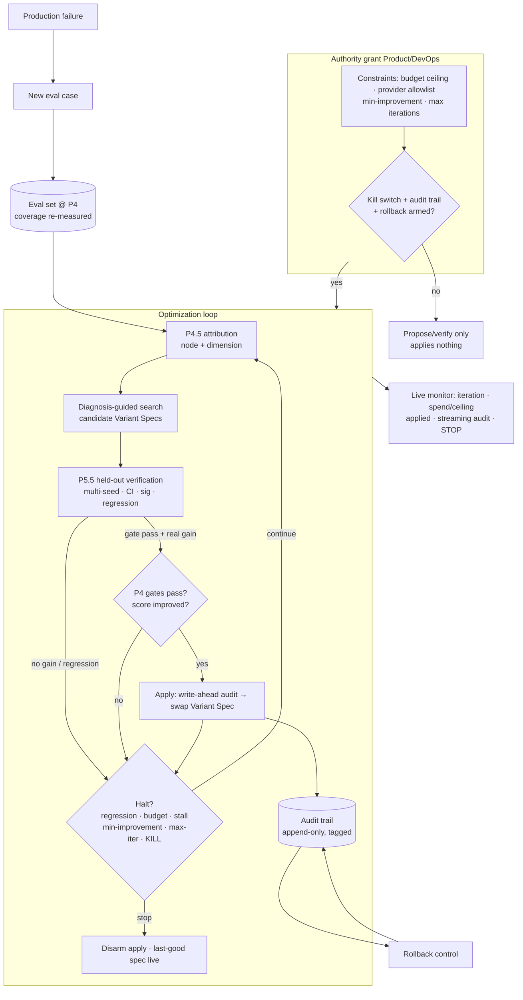

# PRD — P6: Autonomous optimizer

| Field | Value |
|---|---|
| Phase / Milestone | P6 / M9 |
| Target window | ~Weeks 33–40 |
| Lead role(s) | AI Engineer + DevOps (co-leads) |
| Supporting role(s) | Product Designer, System Designer |
| Status | Draft |
| OpenSpec change | `p6-autonomous-optimizer` |

## 1. Summary

P6 closes the loop. Every phase before it either measured (P4), localized (P4.5), or *proposed and
verified* a single change with a human in the seat (P5.5). P6 lets the system run the full cycle —
**analyze → propose → verify → apply** — on its own, under hard constraints, so a workflow improves
without a human clicking each step. Two things make this safe rather than reckless. First, the
search is **diagnosis-guided, not blind**: the composite score (P4) is the objective it maximizes,
the gates (P4) are its hard constraints, and the P4.5 node+dimension attribution points the search
at what to change — far more sample-efficient than grid/Bayesian sweeps over the whole
model×prompt×context space. Second, the loop is allowed to apply **nothing** until three operational
prerequisites exist and are wired in: a **kill switch**, a full **audit trail**, and **rollback**.
Regression detection and budget alerts halt the loop the moment any metric degrades past threshold
or a budget is breached. Production failures feed back as new eval cases and re-enter at P4 — the
eval set is the system's living memory. Autonomous is a distinct **trust contract**: the Product
lens designs how a user grants that authority, watches it live, sets its constraints, and stops it.

## 2. Problem & context

After P5.5 the engine emits a proposed diff with a *verified* delta (CI + cost/latency impact +
cases fixed/broken), but a human still applies every change one at a time. That is correct for
Advisory and Assisted, and it is the ceiling of what those levels can do. It does not scale to a
workflow with a dozen nodes each carrying a fixable diagnosis, and it wastes the sample-efficiency
the diagnosis engine already bought — the machine knows *which node and which dimension* to change,
but a person still drives every iteration. Without P6:

- Optimization is manual and serial; a multi-node workflow with several diagnosed defects takes as
  many human sessions as there are fixes, and the search never runs overnight.
- The only automated search anyone would otherwise reach for is **blind** grid/Bayesian over the
  full configuration space — orders of magnitude more runs (and dollars) than a search pointed at
  the attributed node+dimension.
- There is no safe substrate for a machine to *apply* a change: no kill switch to stop a runaway
  loop, no audit trail to reconstruct what it did and why, no rollback to undo a regression. A loop
  that can apply changes without these is an unbounded, irreversible production actor — exactly the
  blast-radius the DevOps playbook exists to prevent.
- Production failures observed after a change never re-enter the eval set, so the system cannot
  learn from what broke in the wild.

**Upstream state assumed:** P4 (composite score + disqualifying gates + multi-seed/CI/tie harness —
the objective and hard constraints the search uses, and the verification substrate); P4.5
(attribution to node+dimension + typed diagnosis — what points the search); P5.5 (change operators +
held-out verification gate + regression check — the propose/verify half of the loop, run once per
proposal, now run repeatedly under automation); P5 (typed I/O contracts + dynamic tracing, so an
applied re-arrangement is validated, not silently broken); P2.5 (metrics substrate for
regression/budget signals); P2 (Runtime + run queue + idempotency for the run fan-out the loop
generates). P6 adds the search controller, the constraint/gate engine, the apply-path prerequisites
(kill switch, audit trail, rollback), the halt conditions, the production-failure feedback intake,
and the Autonomous-level governance UX.

## 3. Goals & non-goals

### Goals
- G1. **Diagnosis-guided search, not blind.** The search SHALL be pointed by the P4.5 node+dimension
  attribution — it enumerates and prioritizes candidate changes at the attributed node/dimension
  before considering any blind grid/Bayesian expansion, and SHALL record, for every candidate it
  evaluates, the diagnosis that motivated it.
- G2. **Composite score is the objective; gates are the hard constraints.** The search SHALL
  maximize the P4 composite score under the active weight profile and SHALL treat the P4 gates
  (budget ceiling, provider allowlist, min quality, latency SLA) as hard constraints — a candidate
  that violates any gate is never selected, regardless of its score.
- G3. **The loop may apply nothing without kill switch + audit trail + rollback.** The apply step
  SHALL be disabled unless all three prerequisites are present and armed for the run; this is a
  first-class precondition, not a configuration nicety.
- G4. **Enumerated hard-constraint gates as the loop's constraints:** budget ceiling (spend cap for
  the whole optimization run), provider allowlist, **min-improvement threshold** (a verified gain
  below it does not justify another iteration), and **max iterations**. These bound the loop in
  cost, providers, marginal value, and time.
- G5. **Kill switch — immediate, honored, auditable.** A user (or an automated halt) SHALL be able
  to stop the loop; after a stop no further candidate is applied, the in-flight iteration finishes
  or is abandoned safely, and the stop is recorded in the audit trail.
- G6. **Full audit trail.** Every decision the loop makes — candidate considered, motivating
  diagnosis, verification verdict, gate evaluation, apply, halt, rollback — SHALL be recorded as an
  append-only, attributable record keyed by the P0 tag set (`config_hash`, `variant_id`, `run_id`),
  sufficient to reconstruct *what changed, why, and with what measured effect*.
- G7. **Rollback via the audit trail.** Any applied change SHALL be reversible to the exact prior
  Variant Spec using the audit trail; a rollback is itself audited.
- G8. **Regression & budget halt.** The loop SHALL halt automatically when regression detection finds
  any tracked metric degraded beyond its threshold versus the current best, or when a budget alert
  fires (run spend cap breached). A halt disarms the apply step until a human re-arms it.
- G9. **Feedback loop — production failures become eval cases.** Failures observed in production
  after an applied change SHALL be ingestible as new eval cases that re-enter at P4 (added to the
  eval set, coverage re-measured), so the eval set is the living memory and the next optimization
  run is measured against them.
- G10. **Verification-in-the-loop.** No candidate SHALL be applied on an unverified delta — every
  apply is gated by the P5.5 held-out verification (multi-seed, CI, significance, regression check);
  diagnosis proposes, verification decides, even when no human is in the seat.
- G11. **Loop-engineering discipline: it stops well.** The loop SHALL have explicit stopping
  conditions (min-improvement threshold, max iterations, budget), **stall/no-progress detection**
  (K iterations with no gate-passing verified gain), and safe recovery (a failed apply or a crashed
  iteration leaves the last-good Variant Spec live).
- G12. **Autonomous-level governance UX.** The Autonomous automation level SHALL be a distinct trust
  contract with an explicit **authority grant** (constraints set at grant time), a **live monitor**
  (current iteration, spend against ceiling, candidates applied, audit trail streaming), and an
  always-available **stop** control; the audit trail and rollback SHALL be visible throughout.

### Non-goals (explicitly deferred or owned elsewhere)
- **Advisory / Assisted automation levels** — **P5.5**. P6 adds the Autonomous level on top of the
  automation-level model P5.5 established; it does not redefine the lower levels.
- **The change operators themselves** (upgrade model, rewrite prompt, tune top-k, prune node, …) —
  **P5.5**. P6 *drives* the P5.5 operator catalog under search; it adds no new operators.
- **The verification gate mechanics** (held-out split, multi-seed, CI, significance, regression
  check) — **P4/P5.5**. P6 *invokes* the existing gate every iteration; it does not reimplement it.
- **The composite score, weight profiles, and the P4 gate definitions** — **P4**. P6 consumes them
  as objective + constraints unchanged.
- **Attribution + diagnosis** — **P4.5**. P6 consumes the node+dimension attribution to steer; it
  runs no new diagnosis method.
- **General-purpose production incident response / on-call for the target workflow** — out of scope.
  P6 owns halting *its own loop* safely, not operating the user's production system.
- **Multi-tenant scheduling / fair-share of the optimizer across many users** — deferred; P6 targets
  one optimization run over one workflow at a time with bounded fan-out.

## 4. Users & personas

- **Workflow owner (end user, primary)** — has a diagnosed, verified-improvable workflow and wants
  it optimized without babysitting each proposal. Grants Autonomous authority, sets the constraints
  (budget ceiling, provider allowlist, min-improvement, max iterations), watches the live monitor,
  and holds the stop control. Trust is the product: they must be able to see what the loop did and
  undo it.
- **Platform / DevOps operator** — owns the operational guardrails: confirms the kill switch,
  audit trail, and rollback are armed before a loop may apply; owns the budget-alert and
  regression-halt thresholds; is paged if a loop halts abnormally. Cares about blast radius and
  reversibility above throughput.
- **AI/ML engineer (power user)** — tunes the search policy (how aggressively diagnosis-guided vs.
  when to widen to blind search), curates the production-failure intake into eval cases, and audits
  whether the loop's applied changes actually held up.
- **Downstream subsystems** — the P4 leaderboard/score cache (the loop reads scores, writes new
  variants), the P5.5 verification gate (invoked per iteration), the eval set (re-seeded by the
  feedback loop), and the metrics substrate (regression/budget signals).

## 5. User stories / jobs-to-be-done

**Workflow owner**
- As a workflow owner, I want to grant the optimizer authority to run the full loop under a budget
  ceiling, provider allowlist, min-improvement threshold, and max iterations, so that it improves my
  workflow overnight without me applying each change.
- As a workflow owner, I want the search to go after the *diagnosed* node and dimension first rather
  than sweeping every combination, so that it converges in a handful of runs instead of thousands.
- As a workflow owner, I want a single, always-visible **stop** control that halts the loop
  immediately, so that I never feel it's running away from me.
- As a workflow owner, I want the loop to stop on its own once further iterations aren't buying a
  meaningful improvement, so that it doesn't burn budget chasing noise.
- As a workflow owner, I want to see, for any change the loop applied, the diagnosis, the verified
  delta, the cost/latency impact, and a one-click **rollback**, so that I trust it and can undo it.
- As a workflow owner, I want a failure I hit in production to become a new eval case, so that the
  next optimization run is measured against the thing that actually broke.

**Platform / DevOps operator**
- As an operator, I want the loop to refuse to apply anything unless the kill switch, audit trail,
  and rollback are all armed, so that no change is ever unattributable or irreversible.
- As an operator, I want the loop to halt automatically the moment any tracked metric regresses past
  threshold or the run breaches its budget, so that a bad iteration can't compound.
- As an operator, I want an applied change reconstructed and reverted from the audit trail, so that
  recovery does not depend on anyone remembering what the loop did.

**AI/ML engineer**
- As an ML engineer, I want every candidate the loop evaluated recorded with its motivating
  diagnosis and verification verdict, so that I can audit whether diagnosis-guidance actually beat a
  blind sweep.
- As an ML engineer, I want a candidate applied only on a held-out verified gain, so that the loop
  can't overfit to the cases that generated the proposal.

## 6. Functional requirements

These map 1:1 to the OpenSpec requirements under
`openspec/changes/p6-autonomous-optimizer/specs/autonomous-optimizer/`.

**The optimizer — objective, constraints, diagnosis-guided search**
- FR1. The optimizer SHALL maximize the **P4 composite score** (under the active weight profile) as
  its objective function, and SHALL treat the **P4 gates** as hard constraints — a candidate
  Variant Spec that fails any gate SHALL never be applied, regardless of its composite score.
- FR2. The search SHALL be **diagnosis-guided**: it SHALL enumerate candidate changes at the
  node+dimension identified by the P4.5 attribution *before* expanding to blind grid/Bayesian search
  over the wider model×prompt×context space, and SHALL record the motivating diagnosis for every
  candidate it evaluates.
- FR3. The optimizer SHALL only apply a candidate whose improvement has passed the **P5.5 held-out
  verification** (multi-seed, CI, significance vs. current best, regression check) — diagnosis
  proposes, verification decides, with no human in the seat.

**Hard-constraint gates (the loop's operational constraints)**
- FR4. The loop SHALL enforce, as hard constraints for the whole optimization run: a **budget
  ceiling** (cumulative spend cap), a **provider allowlist**, a **min-improvement threshold**, and a
  **max-iterations** bound. Each is set at authority-grant time and is immutable for the run unless
  the run is stopped and re-granted.
- FR5. When the cumulative verified improvement from a further iteration would fall **below the
  min-improvement threshold**, the loop SHALL stop iterating (declare convergence) rather than
  continue.
- FR6. When the run reaches **max iterations**, the loop SHALL stop even if candidates remain.

**Apply-path prerequisites (kill switch + audit trail + rollback)**
- FR7. The loop SHALL apply **no** change unless a **kill switch**, an **audit trail**, and a
  **rollback** capability are all present and armed for the run. Absent any one, the apply step is
  disabled and the loop may run only in a propose/verify (dry-run) mode that applies nothing.
- FR8. The **kill switch** SHALL stop the loop on demand; after it fires, no further candidate is
  applied, the in-flight iteration is finished or abandoned leaving the last-good Variant Spec live,
  and the stop is recorded in the audit trail.
- FR9. The **audit trail** SHALL record every loop decision — candidate considered, motivating
  diagnosis, verification verdict, gate evaluation, apply, halt, and rollback — as an append-only,
  attributable record keyed by the P0 tag set, sufficient to reconstruct *what changed, why, and
  with what measured effect*.
- FR10. Any **applied change SHALL be reversible** to the exact prior Variant Spec via the audit
  trail; the rollback SHALL itself be recorded in the audit trail.

**Halt conditions (regression + budget)**
- FR11. The loop SHALL **halt automatically** when regression detection finds any tracked metric
  degraded beyond its configured threshold versus the current best, or when a budget alert fires
  (cumulative run spend breaches the budget ceiling). A halt SHALL disarm the apply step until a
  human explicitly re-arms it.
- FR12. The loop SHALL detect **stall / no-progress** — K consecutive iterations producing no
  gate-passing, verification-passing improvement — and stop rather than wander.

**Feedback loop — living memory**
- FR13. A **production failure** observed after an applied change SHALL be ingestible as a **new eval
  case** that re-enters at P4 (added to the eval set, coverage re-measured), so the next optimization
  run is measured against it. The eval set is the living memory of the system.

**Autonomous-level governance UX**
- FR14. **Autonomous** SHALL be a distinct automation level with an explicit **authority grant**: the
  user sets the hard constraints (budget ceiling, provider allowlist, min-improvement threshold, max
  iterations) at grant time, and the grant is recorded in the audit trail.
- FR15. While a loop runs, the UI SHALL present a **live monitor** — current iteration, cumulative
  spend against the ceiling, candidates applied, and the streaming audit trail — and an
  always-available **stop** control wired to the kill switch.
- FR16. The audit trail and a **rollback** control SHALL be visible for every applied change, so a
  user can see what the loop did and undo any of it.

## 7. Non-functional requirements

- **Reversibility (first-class, load-bearing).** Every applied change is reversible to the exact
  prior Variant Spec (FR10). The one irreversible surface — a production side effect a change caused
  downstream of the workflow — is out of the loop's apply scope; the loop reverts the *Variant Spec*,
  and the DevOps lens states plainly what the loop cannot un-happen. Tested by applying a change and
  reverting it from the audit trail to the byte-identical prior spec (`config_hash` match).
- **Bounded blast radius / cost.** A run's cumulative provider spend never exceeds the budget ceiling
  (FR4, FR11); the loop's run fan-out goes through the P2 queue with bounded concurrency and
  backpressure; a redelivered run does not double-charge (inherits P2 idempotency). The worst case is
  a run that spends up to the ceiling and applies zero changes — never an unbounded spend or an
  unattributable apply.
- **Auditability / reproducibility.** The audit trail is append-only and keyed by `{config_hash,
  variant_id, run_id, timestamp}`; replaying it reconstructs the exact sequence of applied specs.
  Every applied Variant Spec is content-addressed so "what is live now" and "what was live at
  iteration k" are exact, not approximate.
- **Halt latency.** A kill-switch stop and an automated regression/budget halt SHALL take effect
  before the next apply — no candidate is applied after a stop/halt is raised. In-flight verification
  runs may finish, but their result is discarded rather than applied.
- **Safe degradation (System Designer lens).** If the search controller, the verification service,
  the queue, or the audit store is unavailable, the loop **fails closed** — it stops applying and
  leaves the last-good Variant Spec live — rather than applying unverified or unaudited. No single
  point of failure on the **apply path**: apply requires the audit write to succeed first
  (write-ahead), so an apply that isn't audited cannot happen.
- **Least privilege / secrets.** The loop actuates only through the Runtime + registries; it holds no
  ambient provider credentials of its own, executes candidate runs only in the P3 sandbox, and never
  writes prompts/keys/PII into the audit trail inline (content-hashed blobs, hashes in the record).
- **Observability.** Loop state (iteration, spend, best score, halt reason), regression/budget
  signals, and every apply/rollback emit metrics + traces on the P2.5 substrate; the live monitor and
  the operator alerts read the same signals, never derived state that can drift.
- **Accessibility & performance (UI).** The live monitor updates without blocking; the audit trail is
  virtualized for long runs; the **stop** control is keyboard-reachable and always visible (never
  scrolled off); status color follows the **dataviz** skill for contrast and light/dark consistency;
  loading / running / halted / stopped / rolled-back are first-class, visually distinct states.

## 8. System design summary

**The closed loop.**

**Data model (System Designer lens).**
- **Postgres** — `optimization_run` (`run_id` PK, workflow, active weight profile, constraints
  snapshot, state ∈ {running, converged, max-iter, halted-regression, halted-budget, stalled,
  stopped}, armed-prereqs flags); `optimization_iteration` (`run_id` FK, iteration index, motivating
  `diagnosis_id`, candidate `config_hash`, verification verdict + delta + CI, gate status,
  applied bool); `audit_event` (append-only: `run_id`, seq, type ∈ {grant, consider, verify, apply,
  halt, stop, rollback}, actor, `config_hash` before/after, payload_blob_hash, timestamp) — the
  write-ahead record the apply path depends on; `applied_change` (`run_id`, from_config_hash →
  to_config_hash, reversible bool, reverted_by seq). `optimization_run.constraints` is immutable per
  run.
- **Object store** — candidate Variant Specs, verification result blobs, rendered diffs, and the
  before/after specs for rollback — all content-hashed; the audit record holds hashes only.
- **TSDB / span store (P2.5)** — loop metrics (iteration, cumulative spend, best score), regression
  and budget signals; the run fan-out's per-run traces.

**Key interfaces.**
- `Search.NextCandidates(diagnosis, current_spec, policy) → []VariantSpec` (diagnosis-guided first,
  blind expansion only after).
- `Verify(candidate, held_out, seeds) → {delta±ci, sig, regression, gate_status}` (the P5.5 gate,
  invoked per iteration).
- `Apply(candidate) → AppliedChange` — **precondition:** prerequisites armed; **write-ahead:** audit
  event committed before the Variant Spec swaps; returns the reversible handle.
- `Rollback(applied_change) → VariantSpec` (reconstruct prior spec from the audit trail; audited).
- `Halt(reason)` / `Stop()` — disarm apply, leave last-good spec live, record the reason.
- `IngestProductionFailure(trace) → EvalCase` — re-enters at P4; coverage re-measured.
- `Grant(constraints) → Authority` — records the grant, arms the run subject to prerequisites.

## 9. Design by role lens

**AI Engineer (co-lead) — *evals before optimization; verification decides; the loop must stop well.***
This is where the playbook's phase 10 closes onto phase 3: production failures become new eval cases
and re-enter the harness — *the eval set is the living memory of the system*, and P6 is what wires
that loop shut. The discipline lands as:
- *The objective is the composite score; the constraints are the gates.* The search does not invent
  a new success signal — it maximizes the exact P4 composite under the active profile and treats the
  P4 gates as inviolable. This keeps the optimizer honest: it can't "win" by ranking noise or by
  topping a cost board with a broken variant, because those are already handled at the objective/gate
  layer it inherits.
- *Diagnosis-guided beats blind — and it's measured.* The search points at the P4.5 node+dimension
  attribution first; blind grid/Bayesian is the fallback, not the default. Every candidate records
  its motivating diagnosis so the sample-efficiency claim is auditable, not asserted. This is the
  whole reason the loop is affordable.
- *Verification-in-the-loop is non-negotiable.* Every apply is gated by the P5.5 held-out
  verification — multi-seed, CI, significance, regression — so *diagnosis proposes, verification
  decides* holds even with no human present. The loop cannot apply a candidate on the cases that
  generated it (held-out split), so it can't overfit its own recommendation.
- *Loop engineering — how it stops is the whole game.* Explicit stopping conditions
  (min-improvement threshold, max iterations, budget), **stall/no-progress detection** (K iterations
  with no gate-passing verified gain), verification separated from generation, and recovery that
  leaves the last-good spec live. An optimizer that reliably converges is distinguished from one that
  burns money wandering toward a plausible-but-wrong config precisely by these.
- *The feedback intake is a first-class input.* A production failure is not a log line — it is a new
  eval case that re-enters at P4, re-measures coverage, and becomes something the next run is scored
  against. This is the memory-engineering discipline applied to the whole system: write selectively
  (real failures), retrieve relevantly (into the eval set), and measure that it helps.

**DevOps (co-lead) — *blast radius before implementation; reversible or say it isn't; observable; least privilege.***
An autonomous loop that can apply changes to a production workflow is the highest-blast-radius actor
in the platform, so the guardrails come *before* the capability, not after.
- *Prerequisites before power.* The loop applies **nothing** unless a kill switch, an audit trail,
  and a rollback are all armed (FR7). This is the direct expression of "reversible — or you must say
  it isn't": without rollback there is no reversibility, so there is no apply. Absent any prerequisite
  the loop is confined to a dry-run that proposes and verifies but changes nothing.
- *Hard constraints as gates, not hopes.* Budget ceiling, provider allowlist, min-improvement
  threshold, and max iterations are set at grant time and immutable for the run. The worst case is
  bounded: spend up to the ceiling, apply zero changes — never unbounded spend, never an
  unattributable change.
- *Halt on the first sign of harm.* Regression detection and budget alerts halt the loop the moment a
  metric degrades past threshold or spend breaches the ceiling, and a halt *disarms* the apply step
  until a human re-arms it — degradation cannot compound across iterations.
- *Write-ahead audit is the apply path.* Apply requires the audit event to commit *first* (write-
  ahead); an apply that wasn't audited cannot occur. This is what makes "no single point of failure on
  the apply path" concrete — the audit store is on the critical path by construction, and if it's
  unavailable the loop fails closed.
- *Least privilege / secrets.* The loop actuates only through the Runtime + registries, holds no
  ambient credentials, runs candidates in the P3 sandbox, and never writes prompts/keys/PII inline
  into the audit trail. If it isn't observable it isn't done: loop state, halt reasons, and every
  apply/rollback emit metrics + traces on the P2.5 substrate that the monitor and the alerts both
  read.

**Product Designer (co-lead) — *automation levels are trust contracts; design the unhappy path; content is the interface; name the tradeoff.***
Autonomous is not "Assisted with the button pressed for you" — it is a different contract about how
much authority the user hands the machine, and the UX has to make that grant deliberate, legible, and
revocable.
- *Granting authority is an explicit, bounded act.* The user sets the hard constraints (budget
  ceiling, provider allowlist, min-improvement, max iterations) *at grant time*; the grant is
  recorded. The design names the tradeoff plainly — "you are letting the system apply changes on its
  own within these limits" — so no one grants power they didn't understand.
- *Monitoring live is the trust surface.* A live monitor shows the current iteration, spend against
  the ceiling, what's been applied, and the streaming audit trail — with an always-visible **stop**
  control wired to the kill switch. Content is the interface: "halted — quality regressed on cluster
  X, apply disarmed" must say exactly that, not "error."
- *Design the unhappy path first.* The states that matter are the bad ones: loop halted by
  regression, loop stopped by the user mid-iteration, budget exhausted with no gain, an applied change
  the user wants to undo. Each has a designed screen, and rollback is one control away from any
  applied change.
- *Each automation level is its own contract.* Advisory (report), Assisted (one-click apply), and
  Autonomous (the full loop) are visibly distinct; a user always knows which contract is active and
  how to step down a level or stop entirely.

**System Designer (support) — *numbers before boxes; the failure story; no single point of failure on the apply path.***
Owns how the loop **degrades safely** and the **queue semantics** for the run fan-out it generates.
The design principle is fail-closed: if the search controller, verification service, queue, or audit
store is unavailable, the loop stops applying and leaves the last-good Variant Spec live — it never
applies unverified or unaudited. The apply path is made single-point-of-failure-free by construction:
the audit write is *write-ahead* of the spec swap, so no apply escapes the trail, and the audit store
is the one component the apply path cannot proceed without. The run fan-out (candidate × held-out
slice × seeds, per iteration) goes through the P2 queue with bounded concurrency, backpressure, and
idempotent redelivery, so a redelivered verification run doesn't double-charge or double-apply.
Content-addressing every applied Variant Spec makes "what is live now" and "what was live at
iteration k" exact — the substrate rollback and audit reconstruction depend on.

## 10. Dependencies

- **Requires (upstream):** **P4** (composite score = objective; disqualifying gates = hard
  constraints; multi-seed/CI/tie harness = verification substrate; eval set the feedback loop
  re-seeds); **P4.5** (node+dimension attribution + typed diagnosis that steers the search); **P5.5**
  (change-operator catalog the search drives; held-out verification gate + regression check invoked
  per iteration; the Advisory/Assisted automation-level model P6 extends); **P5** (typed I/O
  contracts + dynamic tracing so an applied re-arrangement is validated, not silently broken); **P2.5**
  (metrics substrate for regression + budget signals, and loop observability); **P2** (Runtime +
  registries the loop actuates through; run queue + idempotency for fan-out); **P3** (sandbox for
  candidate execution); **P0** (tag set + `config_hash` the audit trail and reproducibility depend on).
- **Consumes:** a diagnosed, verified-improvable workflow; a user authority grant with constraints; a
  human-set regression threshold and budget ceiling; optional production-failure traces for intake.
- **Unblocks:** the closed-loop optimizer as a product capability — the M9 milestone and the end of
  the intelligence half. Nothing further in this timeline depends on it; it is the terminal phase.

## 11. Risks & mitigations

| Risk | Owner | Mitigation |
|---|---|---|
| Loop applies a change with no way to undo it | DevOps | Apply disabled unless kill switch + audit trail + rollback all armed (FR7); apply is write-ahead-audited (FR9); every applied change reversible to the exact prior spec (FR10) |
| Runaway spend — loop burns budget searching | DevOps / AI | Budget ceiling as a hard constraint; budget alert halts the loop mid-run and disarms apply (FR4, FR11); fan-out bounded on the queue |
| Loop chases noise, iterating on sub-threshold gains | AI | Min-improvement threshold stops iteration (FR5); stall/no-progress detection stops after K barren iterations (FR12); every gain is CI-verified vs. current best |
| A blind grid/Bayesian sweep is used by default (sample-inefficient, costly) | AI | Search is diagnosis-guided first — candidates at the attributed node+dimension before any blind expansion (FR2); motivating diagnosis recorded per candidate |
| An applied change regresses another case cluster or the cost budget | AI / DevOps | Per-iteration regression check in verification (FR3); regression detection halts the loop and disarms apply (FR11) |
| Change applied on the cases that generated it (overfit) | AI | Held-out verification split every iteration (FR3) — diagnosis proposes, verification decides |
| Kill switch fires but a candidate still applies | DevOps / System Designer | Stop takes effect before the next apply; in-flight verification result discarded not applied; stop recorded in audit (FR8) |
| Audit store down → unattributable apply | System Designer | Write-ahead audit: apply cannot proceed without the audit commit; loop fails closed, last-good spec stays live (§7) |
| Production failures never re-enter the system | AI | Production-failure intake creates a new eval case that re-enters at P4; coverage re-measured (FR13) |
| User grants authority they didn't understand | Product | Explicit authority grant with constraints set at grant time and recorded; the tradeoff named in the grant UX (FR14) |
| Applied re-arrangement silently breaks the graph | System Designer / AI | Candidates validated against the P5 typed I/O contracts before verification; incoherent orderings rejected, not applied |
| Loop keeps running after a halt because apply was only paused, not disarmed | DevOps | A halt *disarms* apply until a human re-arms; re-arming is an explicit, audited action (FR11) |

## 12. Rollout & test strategy

- **Fixtures.** A multi-node workflow with two independently diagnosable defects (a reasoning-heavy
  node on a weak model; a RAG node with low relevance), a P4 eval set with a held-out slice, a P4.5
  attribution pointing at each defect, and the P5.5 operator catalog + verification gate wired in. A
  budget ceiling small enough that a deliberately non-converging search *hits* it; a min-improvement
  threshold a noise-level candidate falls below; a seeded regression a candidate triggers.
- **Prerequisite-gating tests.**
  - With rollback (or audit trail, or kill switch) **absent**, the loop runs in dry-run and applies
    **zero** changes; assert no Variant Spec swap occurs. (FR7)
  - With all three armed, the loop applies a verified, gate-passing candidate; assert the apply is
    preceded by an audit event (write-ahead). (FR7, FR9)
- **Diagnosis-guided-search test.** Assert the first candidates evaluated are at the P4.5-attributed
  node+dimension, *before* any blind grid/Bayesian candidate; assert each candidate carries its
  motivating diagnosis. (FR2)
- **Objective/constraint test.** A candidate with a higher composite score that fails a P4 gate is
  **not** applied; a lower-scoring gate-passing candidate is preferred. (FR1)
- **Budget-halt-mid-run test.** Drive a search that would exceed the ceiling; assert the loop halts
  when cumulative spend breaches the budget, applies nothing further, disarms apply, and records the
  halt. (FR11)
- **Min-improvement-stop test.** After a candidate whose verified gain is below the threshold, assert
  the loop stops iterating (converged), not continues. (FR5)
- **Rollback-via-audit test.** Apply a change, then roll it back from the audit trail; assert the live
  Variant Spec is byte-identical to the prior one (`config_hash` match) and the rollback is recorded.
  (FR10)
- **Regression-halt test.** A candidate that fixes the target cluster but regresses another is caught
  by the per-iteration regression check and not applied; a seeded post-apply regression halts the loop
  and disarms apply. (FR3, FR11)
- **Kill-switch test.** Fire the stop mid-iteration; assert no candidate applies after the stop, the
  last-good spec stays live, and the stop is audited. (FR8)
- **Stall-detection test.** A search with no gate-passing verified gain for K iterations stops with a
  `stalled` state, not an infinite loop. (FR12)
- **Feedback-loop test.** Ingest a production-failure trace; assert a new eval case is added to the
  P4 eval set, coverage is re-measured, and the next run is scored against it. (FR13)
- **Fail-closed test.** Kill the audit store (then the verification service) mid-run; assert the loop
  stops applying and leaves the last-good spec live — never applies unaudited/unverified. (§7)
- **UI verification.** Drive the Autonomous grant → live monitor → stop → rollback flow against a
  live (stubbed-provider) loop; confirm the grant records constraints, the monitor streams iteration
  + spend/ceiling + audit, the stop control is always visible and halts immediately, and every applied
  change exposes a working rollback; confirm halted / stopped / rolled-back states render.
- **Rollout.** Ships **dark** and dry-run-only by default (applies nothing) until the fixtures' M9
  checklist is green; Autonomous authority is off until a user explicitly grants it with constraints;
  operators must confirm kill switch + audit + rollback armed before apply is enabled. Migrations
  expand-only (new optimization/audit tables).

## 13. Success metrics & acceptance criteria (M9 exit checklist)

- [ ] The system autonomously runs **analyze → propose → verify → apply** under hard constraints,
      with every applied change **auditable and reversible**.
- [ ] The search is **diagnosis-guided** — candidates at the P4.5-attributed node+dimension are
      evaluated before any blind grid/Bayesian expansion, and each candidate records its motivating
      diagnosis.
- [ ] The **composite score is the objective** maximized and the **P4 gates are hard constraints** —
      a higher-scoring gate-failing candidate is never applied.
- [ ] The loop **applies nothing** unless kill switch + audit trail + rollback are all armed; absent
      any one, it runs dry-run only.
- [ ] The enumerated hard constraints — **budget ceiling, provider allowlist, min-improvement
      threshold, max iterations** — bound the run.
- [ ] A **budget breach halts the loop mid-run**, applies nothing further, and disarms apply.
- [ ] A verified gain **below the min-improvement threshold stops** further iterations.
- [ ] An applied change is **rolled back via the audit trail** to the byte-identical prior spec.
- [ ] **Regression detection halts** the loop and disarms apply; no candidate is applied on an
      unverified or regressing delta.
- [ ] The **kill switch** stops the loop immediately; no candidate applies after a stop; the stop is
      audited.
- [ ] **Stall/no-progress detection** stops a search that isn't improving, rather than wandering.
- [ ] A **production failure re-enters at P4** as a new eval case; coverage is re-measured.
- [ ] The **Autonomous level** exposes an authority grant (constraints recorded), a live monitor
      (iteration + spend/ceiling + streaming audit + stop), and a visible rollback per applied change.

## 14. Open questions

- Q1. **Search policy hand-off.** What exactly triggers widening from diagnosis-guided candidates to
  blind grid/Bayesian expansion — diagnosis exhausted, no gate-passing gain after J targeted
  candidates, or an explicit budget slice? (Proposed: widen only after targeted candidates are
  exhausted *and* budget remains, capped by a separate blind-search sub-budget.)
- Q2. **Min-improvement semantics.** Is the threshold on the *marginal* gain of the next iteration or
  the *cumulative* gain since the run start, and is it on the composite score or per-metric?
  (Proposed: marginal gain on the composite CI-lower-bound, so noise can't clear it.)
- Q3. **Multi-node interaction.** When two nodes each have a diagnosed fix, does the loop apply them
  independently or verify the combination (fixes can interact — improving node 3 may shift node 5's
  inputs)? (Proposed: apply serially, re-attribute after each apply, since an applied change can
  invalidate a pending diagnosis.)
- Q4. **Re-arm authority.** After a regression/budget halt disarms apply, who may re-arm — the
  original granter only, or any operator — and does re-arming require re-stating the constraints?
- Q5. **Production-failure trust.** A production-failure intake case has no gold reference; how is it
  labeled (weak, per P4) and can a weak-labeled failure case gate an apply, or only widen coverage?
  (Proposed: it widens coverage and can *block* via regression, but a weak case alone cannot be the
  sole basis for an apply.)
- Q6. **Concurrent runs on one workflow.** Are two Autonomous runs on the same workflow forbidden
  (lock), or serialized? A second run applying against a spec the first is mid-optimizing is a
  write-write hazard. (Proposed: one active run per workflow, enforced by a lock keyed on the
  workflow.)
- Q7. **Rollback depth.** Can a user roll back several applies at once (revert to iteration k), or
  only the most recent apply? (Proposed: revert-to-any-prior-`config_hash` via the audit trail, since
  every applied spec is content-addressed.)
