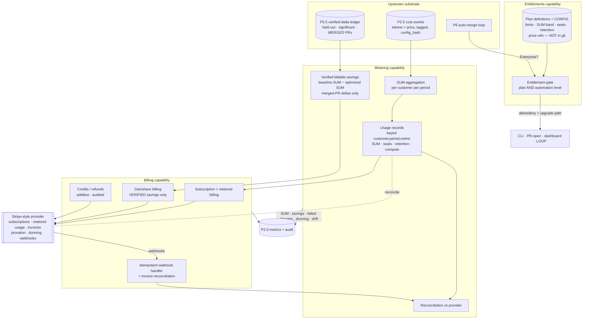

# PRD — P7: Billing, Metering & Entitlements (Commercialization)

| Field | Value |
|---|---|
| Phase / Milestone | P7 / M10 |
| Target window | ~Weeks 41–48 (two waves: 7a, then 7b) |
| Lead role(s) | Backend + DevOps (co-leads) |
| Supporting role(s) | System Designer, AI Engineer, Frontend, Product Designer |
| Status | Draft |
| OpenSpec change | `p7-billing-metering` |

> **Money-in-git rule.** This PRD contains **no dollar amounts, no percentages, and no price
> bands**. Plans are referred to by **name only** — **Free / Team / Business / Enterprise**. Every
> plan definition (its limits, its SUM band, its seat and retention allowances, and the *price
> references* it points at) is **configuration, not code, and not in git**; it lives in a
> gitignored local business doc and a runtime config store. The platform reads plan definitions; it
> never hardcodes them. Anything with a dollar sign is out of scope for this document by
> construction.

## 1. Summary

P7 is where the platform becomes a **business**. Every phase before it built the product — discover,
configure, run, evaluate, diagnose, propose, verify, and (P6) autonomously apply verified
optimization pull requests. P7 adds the three things that turn that product into revenue without
adding a single new telemetry pipeline: **metering** (turn the P2.5 cost-event substrate into a
per-customer, per-period record of value delivered), **entitlements** (gate every surface by the
customer's active **plan** *and* automation level, so what a customer can do follows what they pay
for), and **billing** (a Stripe-style provider handling subscriptions, metered usage, invoicing,
proration, dunning, credits, and refunds — **idempotently**, so a customer is **never
double-charged**, and **reversibly**, so a billing error is corrected by a credit with a full audit
trail). The value metric is **LLM spend under management (SUM)** — the aggregate cost the platform
observes flowing through a customer's workflows, derived by **reusing the P2.5 cost events** (tokens
× price), never a second meter. P7 ships in **two waves**: **7a** (metering + entitlements +
subscription billing) is sellable the moment the eval harness (P4) exists; **7b** (verified-savings
/ gainshare billing) waits for P5.5, because it may bill only for savings the **verified-delta
ledger** proves came from a **merged** optimization PR. **Unverified or estimated savings are never
billed.** M10 — self-serve billing live — is the first-dollar milestone.

## 2. Problem & context

The platform can measure, diagnose, verify, and apply improvements to a customer's LLM workflows,
but it cannot **charge** for any of it. There is no notion of a customer, a plan, a billing period,
or an entitlement; every capability is available to everyone who can reach the API. Three problems
block commercialization, and each maps to one of P7's capabilities:

- **No value metric, no meter.** The platform emits rich per-call cost events (P2.5: tokens × price,
  fully tagged, keyed by `config_hash`), but nothing aggregates them into a **per-customer,
  per-period** figure a business can price against. Standing up a *second* usage pipeline next to
  the telemetry substrate would be duplication and a reconciliation nightmare — two sources of truth
  for "what did this customer use." The meter must be a **derivation of the existing substrate**, not
  a new one.
- **No entitlements, so nothing is sellable.** Without a plan model, there is no difference between
  Free and Enterprise — the Autonomous auto-merge loop (P6), the highest-authority capability in the
  platform, would be as available to an anonymous Free user as to a contracted Enterprise customer.
  Packaging *is* the product boundary: it decides which surface (CLI, PRs, dashboard, auto-merge) a
  customer reaches. And plan definitions must change (a limit is raised, a price reference is
  repointed, a new plan is introduced) **without a code deploy** — pricing is a business lever pulled
  weekly, not an engineering release.
- **No billing, so no revenue — and billing is where correctness is unforgiving.** Charging money is
  the least-reversible thing the platform does. A double-charge, a charge for savings that did not
  actually materialize, or a charge that cannot be traced and refunded, is a trust-and-legal
  incident, not a bug. Billing must be **idempotent** (a retried webhook or a redelivered usage
  record never charges twice), **reversible** (every error corrected by a credit or refund, never by
  deleting data), and **auditable** (every charge reconstructable to the usage that justified it).
- **The gainshare temptation.** The most differentiated pricing the platform can offer is a share of
  the savings it produces — but savings are exactly the thing an optimizer is tempted to *assert*.
  The platform already has the antidote: the P5.5 **verified-delta ledger** only records deltas that
  passed held-out, statistically-significant verification and were **merged**. Gainshare billing
  MUST read that ledger and nothing else. *Analysis without verification is confident guessing* — and
  **billing** a customer for confident guessing is the worst version of that failure.

**Upstream state assumed.** **P2.5** (the cost-event substrate — every provider call emits `cost`
from tokens × price, fully tagged, idempotent under retries, keyed by `config_hash`; **this is the
meter's raw material**); **P4** (the eval harness — a customer running evals is the sellable unit of
value 7a prices against); **P5.5** (the **verified-delta ledger** — held-out, statistically-
significant, merged-PR deltas; **this is the only input to gainshare billing**, gating 7b); **P6**
(the Autonomous auto-merge loop — the highest-tier entitlement); **P2** (Runtime + registries + run
queue + idempotency — the idempotency discipline P7's meter and billing inherit); **ADR-001** (apply
= source transformation delivered as a reviewable PR; merges — the events gainshare attributes
savings to — are git-history facts). P7 adds the customer/account model, the metering derivation, the
entitlement gate, the billing-provider integration, and the billing/usage UI.

## 3. Goals & non-goals

### Goals
- **G1. SUM is the value metric, derived not re-collected.** Spend under management (SUM) for a
  customer in a billing period SHALL be an **aggregation of the P2.5 cost events** (tokens × the
  model's price) attributed to that customer, computed by reusing the telemetry substrate — **not a
  new usage pipeline**. There is one source of truth for what a customer used.
- **G2. Idempotent metering keyed `{customer, period, metric}`.** Every usage record — SUM, seats,
  retention, cloud eval compute — SHALL be an **idempotent** record keyed by
  `{customer, period, metric}`, so the **same period's usage is never double-counted** no matter how
  many times events are replayed, reconciled, or re-derived.
- **G3. Entitlements gate every surface by plan AND automation level.** Feature access SHALL be
  gated by the customer's **active plan** *and* the **automation level** (Advisory / Assisted /
  Autonomous): CLI + discovery available to **all** plans including **Free**; Assisted PRs for
  **Team and above**; the Web dashboard for **Team and above** (seats, trace/metric retention, and
  SUM band **per plan**); **Autonomous auto-merge for Enterprise only**.
- **G4. Plans are configuration, changeable without a code deploy.** A plan's definition — its
  limits, its SUM band, its seat/retention allowances, and its **price references** — SHALL be
  **configuration**, not code. A plan/price change, or the introduction of a new plan, SHALL take
  effect **without a code deploy**. No plan definition or price is in git.
- **G5. Over-limit is denied *with an upgrade path*, never silently.** When a customer attempts an
  action their plan does not entitle (or that would exceed a metered limit), the action SHALL be
  **denied with a clear, named reason and an upgrade path** — never silently dropped, silently
  degraded, or silently allowed.
- **G6. Billing is idempotent — never double-charge.** Subscription and metered-usage billing SHALL
  be **idempotent**: a retried operation, a redelivered provider webhook, or a re-reported usage
  record for a `{customer, period, metric}` SHALL **not** produce a second charge.
- **G7. Billing is reversible and auditable.** A billing error SHALL be correctable via a **credit or
  refund** through the provider, with a **full audit log**, and **without deleting or mutating** the
  underlying usage or invoice records. Recovery is additive (a corrective credit), never destructive.
- **G8. Gainshare bills only VERIFIED savings from MERGED PRs.** Billable savings SHALL be
  `baseline SUM − optimized SUM`, attributable **only** to **merged** optimization PRs, computed
  **only** from the **P5.5 verified-delta ledger** (held-out, statistically significant).
  **Unverified or estimated savings SHALL NOT be billed.** The baseline + holdout methodology is
  **fixed and auditable**.
- **G9. The platform never resells provider tokens.** Customers use their **own** LLM provider keys
  for optimization and eval runs; the platform meters SUM and bills for its service and its verified
  savings, but **never resells or marks up provider tokens**. Provider spend is the customer's, on
  the customer's keys.
- **G10. Usage is reconcilable against the billing provider.** The metered usage the platform reports
  SHALL be **reconcilable** against what the billing provider recorded and invoiced — a
  reconciliation SHALL detect and surface any drift between the platform's meter and the provider's
  ledger rather than letting the two silently diverge.
- **G11. Revenue is observable.** Metering, billing, and gainshare emit metrics and audit events on
  the **P2.5 substrate** (the same one they derive from), so revenue, usage, failed charges, dunning
  state, and reconciliation drift are **observable** operational signals, not month-end surprises.
- **G12. Two waves, honest dependencies.** **7a** (metering + entitlements + subscription billing)
  ships when P4 exists; **7b** (gainshare) ships only when P5.5's verified-delta ledger exists. 7b
  MUST NOT ship an estimated-savings shortcut to beat its dependency.

### Non-goals (explicitly deferred or owned elsewhere)
- **Concrete prices, plan limits, SUM band boundaries, and gainshare rates** — **configuration, not
  this document, not git.** They live in the gitignored business doc + the runtime config store. P7
  builds the *mechanism* that reads them.
- **The cost-event collection pipeline** — **P2.5.** P7 **derives** SUM from it; it collects nothing
  new.
- **The verified-delta computation** (held-out split, multi-seed, significance, regression check,
  the merge that makes a delta real) — **P4 / P5.5 / P6.** P7 **reads** the verified-delta ledger; it
  re-verifies nothing.
- **Reselling LLM tokens / being a provider proxy** — **explicitly never** (G9). The provider gateway
  abstracts providers at execution time on the customer's keys; it is not a billing reseller.
- **Tax calculation, revenue recognition (ASC 606) accounting, and dunning *policy* copy** — owned by
  the billing provider and Finance, respectively; P7 integrates the provider and exposes the state,
  it does not reimplement tax or GAAP.
- **A custom in-house payments processor / storing raw card numbers** — **never.** Card data lives
  with the PCI-compliant billing provider; the platform holds provider customer/subscription handles,
  never PANs. (See the safety rule: the platform does not enter or store financial credentials.)
- **Marketplace / partner-resale / multi-party revenue split** — deferred; P7 is one platform ↔ one
  customer.

## 4. Users & personas

- **Billing owner / buyer (customer-side, primary economic buyer)** — the person who picks a plan,
  holds the payment relationship, and cares that the invoice is correct, explainable, and never a
  surprise. Wants to see SUM under management, what plan they are on, what they are being charged for
  (subscription vs. metered vs. gainshare), and — for gainshare — **proof** that the savings billed
  were verified. Grants **gainshare consent** explicitly; must be able to see the baseline and holdout
  methodology.
- **Workflow owner / developer (customer-side, day-to-day user)** — hits the entitlement gate: runs
  the CLI and discovery on **Free**, gets Assisted PRs on **Team+**, and (on **Enterprise**) can turn
  on Autonomous auto-merge. When they hit a limit they need a **clear reason and an upgrade path**,
  not a cryptic 403.
- **Platform / DevOps + Backend operator (platform-side, co-lead)** — owns billing correctness and
  its blast radius: idempotency (never double-charge), reversibility (credits/refunds with audit),
  webhook handling, invoice reconciliation, secrets (provider keys in a secrets manager, never in
  code or telemetry), and **revenue observability** (failed charges, dunning, drift). Is paged when a
  charge fails, a webhook backs up, or the meter drifts from the provider.
- **AI Engineer (platform-side, support)** — owns the integrity of the **gainshare computation**: it
  reads the P5.5 verified-delta ledger and nothing else, attributes savings only to merged PRs, and
  can prove the baseline/holdout methodology. Guards the load-bearing invariant: **unverified savings
  are never billed.**
- **Finance / RevOps (platform-side, support)** — owns plan definitions and price references *as
  configuration*, reconciles the platform meter against the provider ledger, and needs revenue to be
  observable and auditable.
- **Downstream subsystems** — the P2.5 cost-event store (the meter's source), the P5.5 verified-delta
  ledger (gainshare's only source), the entitlement gate (consulted by CLI, PR-open, dashboard, and
  the P6 auto-merge loop before any gated action), and the billing provider (subscriptions + metered
  usage + invoices + webhooks).

## 5. User stories / jobs-to-be-done

**Billing owner / buyer**
- As a billing owner, I want to subscribe to a **plan by name** (Free / Team / Business / Enterprise)
  and see exactly what it entitles, so that I know what I'm buying before I pay.
- As a billing owner, I want my invoice to break down **subscription vs. metered usage vs. verified
  gainshare**, each traceable to the usage that justified it, so that no line item is a mystery.
- As a billing owner, I want gainshare to bill me **only for savings that were verified and merged**,
  with the baseline and holdout methodology visible, so that I'm never charged for a saving that
  didn't actually happen.
- As a billing owner, I want a billing mistake fixed with a **credit** and a clear record, not by
  someone quietly editing my history, so that I trust the numbers.

**Workflow owner / developer**
- As a Free user, I want the **CLI and discovery** to work, so that I can try the platform before I
  pay.
- As a Team user, I want **Assisted verified PRs**, and as an Enterprise user, I want to turn on
  **Autonomous auto-merge**, so that my automation level follows my plan.
- As a developer who hits a limit, I want a **clear message naming the limit and the plan that lifts
  it**, so that I know exactly how to proceed instead of guessing why something failed.

**Platform operator (Backend / DevOps)**
- As an operator, I want usage recorded **idempotently per `{customer, period, metric}`**, so that a
  replayed event or a retried webhook never double-charges a customer.
- As an operator, I want to **reconcile** the platform meter against the billing provider on a
  schedule and be alerted on drift, so that the two ledgers can't silently diverge.
- As an operator, I want provider webhooks handled **idempotently** and every charge/credit
  **audited**, so that recovery from a provider hiccup is safe and reconstructable.
- As an operator, I want to change a **plan or price without shipping code**, so that pricing is a
  business lever, not a release.

**AI Engineer**
- As an AI engineer, I want gainshare to read **only** the P5.5 verified-delta ledger and attribute
  savings **only** to merged PRs, so that the platform can never bill for an unverified or estimated
  saving.

## 6. Functional requirements

These map 1:1 to the OpenSpec requirements under
`openspec/changes/p7-billing-metering/specs/{metering,entitlements,billing}/`.

**Metering — value metric, idempotent records, verified savings, reconciliation** (`metering`)
- **FR1 (→ metering).** SUM for a customer in a billing period SHALL be computed as an **aggregation
  of the P2.5 cost events** (tokens × price) attributed to that customer over that period, **reusing
  the telemetry substrate** — no second collection pipeline. Re-deriving SUM for a closed period
  SHALL yield the same figure (deterministic from the same events).
- **FR2 (→ metering).** Every meter — **SUM, seats, retention, cloud eval compute** — SHALL be
  recorded as an **idempotent usage record keyed `{customer, period, metric}`**; re-reporting or
  re-deriving the same period's usage SHALL update the one record in place, **never** append a second
  charge-bearing record. The **same period usage is never double-counted**.
- **FR3 (→ metering).** **Billable savings** SHALL be `baseline SUM − optimized SUM`, attributable
  **only** to **merged** optimization PRs, computed **only** from the **P5.5 verified-delta ledger**.
  A saving that is estimated, unverified, or attributable to an un-merged proposal SHALL **not**
  contribute to billable savings. The **baseline + holdout methodology SHALL be fixed and auditable**.
- **FR4 (→ metering).** Reported usage SHALL be **reconcilable against the billing provider**: a
  reconciliation over a period SHALL compare the platform's usage records to the provider's recorded
  usage/invoices and **surface any drift** (records the provider is missing, or the provider has that
  the platform did not report) rather than silently accepting divergence.

**Entitlements — plan × automation-level gate, plans-as-config, over-limit** (`entitlements`)
- **FR5 (→ entitlements).** Feature access SHALL be gated by the customer's **active plan AND the
  automation level**: CLI + discovery for **all plans incl. Free**; Assisted PRs for **Team+**; the
  Web dashboard for **Team+** (seats, trace/metric retention, and SUM band **per plan**); **Autonomous
  auto-merge for Enterprise only**. An action outside the customer's plan-and-level entitlement SHALL
  NOT be performed.
- **FR6 (→ entitlements).** Plan definitions — limits, SUM band, seat/retention allowances, and
  **price references** — SHALL be **configuration**, resolved at runtime from a config store, **not**
  compiled into code and **not** in git. A **plan or price change**, or introducing a new plan, SHALL
  take effect **without a code deploy**.
- **FR7 (→ entitlements).** An over-limit or under-entitled action SHALL be **denied with a named
  reason and an upgrade path** — the response SHALL identify the limit/entitlement hit and the plan
  that lifts it — and SHALL **never** be silently dropped, silently degraded, or silently allowed.
- **FR8 (→ entitlements).** **Autonomous auto-merge SHALL be performed only for a customer whose
  active plan entitles it (Enterprise).** The P6 loop SHALL consult the entitlement gate before a
  merge; absent the Enterprise entitlement the loop SHALL fall back to a lower automation level
  (open a PR for a human) rather than merge.

**Billing — provider integration, idempotency, reversibility, gainshare, no-resale, webhooks**
(`billing`)
- **FR9 (→ billing).** The platform SHALL integrate a **Stripe-style billing provider** for
  **subscriptions + metered usage + invoicing** (with proration and dunning handled by the provider),
  holding only the provider's **customer/subscription handles** and never raw card data.
- **FR10 (→ billing).** Billing SHALL be **idempotent — never double-charge.** A retried billing
  operation or a re-reported usage record for a `{customer, period, metric}` SHALL carry an
  **idempotency key** such that the provider records **at most one** charge for it.
- **FR11 (→ billing).** A billing error SHALL be correctable via a **credit or refund** with a **full
  audit log** and **without deleting or mutating** the underlying usage or invoice records —
  correction is **additive** (a corrective credit/refund entry), never destructive.
- **FR12 (→ billing).** **Gainshare SHALL be billed as a share of VERIFIED savings only** — computed
  from the metering capability's verified billable-savings (FR3), which reads only the P5.5
  verified-delta ledger. The platform SHALL **refuse to raise a gainshare charge** for any savings not
  present in the verified-delta ledger.
- **FR13 (→ billing).** Customers SHALL use their **own provider keys** for optimization and eval
  runs; the platform SHALL **never resell or mark up provider tokens.** No invoice line item SHALL
  represent resold provider tokens.
- **FR14 (→ billing).** Provider **webhooks SHALL be handled idempotently** (a redelivered webhook is
  processed once), and **invoices SHALL be reconciled** against the platform's usage records (FR4) so
  that a provider-side and platform-side view of a period agree or the drift is surfaced.

## 7. Non-functional requirements

- **Correctness of money (load-bearing).** Never double-charge (FR2, FR10) and never bill an
  unverified saving (FR3, FR12) are **correctness invariants**, not best-effort. Both are enforced by
  construction — idempotency keys on every charge-bearing operation; gainshare reads a single
  verified source — and both are **tested** (a replayed period charges once; an estimated saving
  raises no charge).
- **Reversibility.** Every billing action is reversible by an **additive** credit/refund with audit
  (FR11); no correction path deletes or overwrites a usage or invoice record. "What was charged, when,
  and why" is reconstructable for any period. Tested by injecting a wrong charge and correcting it via
  credit, then asserting the original records are intact and the net is right.
- **Idempotency & exactly-once accounting.** Usage records are keyed `{customer, period, metric}` and
  upserted; billing operations and webhooks carry idempotency keys; the meter inherits P2/P2.5's
  retry-idempotent discipline so a redelivered cost event does not double-count SUM. Target: **zero**
  double-charges under arbitrary retry/redelivery.
- **Reconciliation.** A scheduled reconciliation compares platform usage to provider-recorded usage
  and invoices and **surfaces drift** (FR4, FR14); drift is an alert, not a silent write. The
  reconciliation is itself idempotent and side-effect-free on the source records.
- **Secrets & least privilege.** Provider API keys and webhook signing secrets live in a **secrets
  manager**, never in code, config-in-git, or telemetry; webhook payloads are **signature-verified**
  before processing; the billing service holds no customer card data (PCI scope stays with the
  provider). No secret appears in any span, metric label, or log (inherits the P2.5
  secrets-never-in-telemetry rule).
- **Observability of revenue.** Metering and billing emit metrics + audit events on the **P2.5
  substrate**: SUM per customer/period, metered-usage totals, invoice state, **failed charges**,
  **dunning state**, gainshare billed, and **reconciliation drift** — so revenue health is a
  dashboard, not a month-end reconstruction. Alerts fire on failed charges and drift.
- **Data integrity & privacy.** Usage records and the customer↔account mapping are the system of
  record for "what was used"; the provider is the system of record for "what was charged." Neither
  overwrites the other; reconciliation keeps them honest. No PII or prompt/completion content enters
  usage records or invoices (content-hash references only, per P2.5).
- **Availability / degradation.** A billing-provider outage SHALL **not** block the *product* (runs,
  evals, PRs continue); usage is **buffered** and reported when the provider recovers, and buffered
  reporting is idempotent so the outage window is billed **once**. Metering (deriving SUM) continues
  regardless of provider availability.
- **Auditability.** Every charge, credit, refund, plan change, entitlement decision, and gainshare
  computation is an **append-only audit event** keyed by `{customer, period}` (and, for gainshare, the
  contributing verified-delta ledger entries + merge commits), sufficient to reconstruct any invoice
  from first principles.
- **Accessibility & performance (UI).** The billing/usage UI renders subscription, metered, and
  gainshare breakdowns with first-class **loading / empty / past-due / payment-failed** states; SUM
  and savings charts follow the **dataviz** skill for contrast and light/dark consistency; the
  gainshare consent flow and the "why was I denied + upgrade path" state are designed, keyboard-
  reachable, and legible.

## 8. System design summary

**Where P7 sits — a derivation layer on the existing substrate, plus a provider integration.**

**Data model (System Designer lens).**
- **Postgres** —
  - `account` (`customer_id` PK, provider_customer_handle, active_plan_id, gainshare_consent BOOL +
    consented_at, created_at) — the customer↔provider mapping; holds provider **handles**, never card
    data.
  - `plan` is **not a table of truth for prices** — the *runtime plan config* (limits, SUM band, seat
    and retention allowances, **price references**) is resolved from the **config store**, not git; the
    DB holds only a `plan_id` + `plan_config_version` the account points at, so a plan/price change is a
    config publish, not a migration or deploy (FR6).
  - `usage_record` (`customer_id`, `period`, `metric` ∈ {sum, seats, retention, eval_compute},
    `quantity`, `source_digest`, `reported_to_provider BOOL`, `provider_usage_ref`, updated_at) —
    **PRIMARY KEY `{customer_id, period, metric}`**; upserted, so a period's usage is one row per
    metric (FR2). `source_digest` makes re-derivation idempotent.
  - `billable_savings` (`customer_id`, `period`, `baseline_sum`, `optimized_sum`, `savings`,
    `verified_delta_refs[]`, `merge_commits[]`) — populated **only** from the P5.5 verified-delta
    ledger for **merged** PRs (FR3); the refs make every billed saving trace to a verified, merged
    delta.
  - `billing_event` (append-only: `customer_id`, `period`, type ∈ {charge, credit, refund,
    subscription_change, plan_change, gainshare_charge}, `idempotency_key` UNIQUE, `provider_ref`,
    amount_ref (opaque handle to provider amount — **no dollar value stored here**), `caused_by`,
    timestamp) — the **audit log**; `idempotency_key` UNIQUE is the never-double-charge guard (FR10);
    corrections are new rows, never edits (FR11).
  - `webhook_delivery` (`provider_event_id` PK, processed_at) — idempotent webhook dedupe (FR14).
- **Config store (not git)** — plan definitions + price references, versioned, published without a
  deploy. The platform reads the active version; a change is a publish + audit event.
- **Billing provider** — the system of record for **charges**; holds cards, computes proration and
  dunning, emits webhooks.
- **TSDB / span store (P2.5)** — SUM, metered totals, invoice/dunning state, failed-charge and
  reconciliation-drift signals; the same substrate the meter derives from.

**Key interfaces.**
- `DeriveSUM(customer, period) → Quantity` — aggregates P2.5 cost events; deterministic + idempotent
  per `{customer, period}`.
- `RecordUsage(customer, period, metric, quantity, source_digest) → UsageRecord` — **upsert** keyed
  `{customer, period, metric}`; re-reporting the same digest is a no-op.
- `ComputeBillableSavings(customer, period) → {baseline_sum, optimized_sum, savings, refs}` — reads
  **only** the P5.5 verified-delta ledger for **merged** PRs; returns zero when nothing verified.
- `Reconcile(customer, period) → {matched, drift[]}` — platform usage vs. provider; surfaces drift.
- `CheckEntitlement(customer, feature, automation_level) → {allowed, reason?, upgrade_plan?}` —
  consulted by CLI, PR-open, dashboard, and the P6 loop before any gated action.
- `ResolvePlan(plan_id) → PlanConfig` — from the config store, not code/git; hot-reloadable.
- `Charge(customer, period, kind, idempotency_key) → BillingEvent` — subscription/metered/gainshare;
  provider records at most once per key. **Gainshare `Charge` asserts the savings exist in the
  verified-delta ledger or refuses.**
- `Credit(customer, reason, ref) → BillingEvent` / `Refund(...)` — **additive**, audited; never
  deletes.
- `HandleWebhook(signed_payload) → …` — signature-verified, deduped by `provider_event_id`, drives
  invoice reconciliation.

## 9. Design by role lens

**Backend + DevOps (co-leads) — *money is the least-reversible thing we do; idempotent, reversible,
observable, least-privilege.***
Billing is the one place a naive change is not a bug but an incident, so the backend contracts and the
operational guardrails are designed together, up front.
- *Idempotency is a schema property, not a hope.* Usage is keyed `{customer, period, metric}` and
  **upserted** — the database itself refuses a second charge-bearing row for a period (FR2). Every
  charge-bearing billing operation and every webhook carries an **idempotency key** that is UNIQUE in
  `billing_event` / deduped in `webhook_delivery`, so "never double-charge" (FR10) holds under
  arbitrary retries and provider redelivery. This inherits the P2/P2.5 retry-idempotent discipline
  rather than inventing a new one; a redelivered cost event does not double-count SUM.
- *Reversible — or it isn't allowed.* Corrections are **additive**: a wrong charge is fixed by a
  **credit/refund** row with a full audit trail, never by deleting or editing history (FR11). "What
  was charged and why" survives every correction, so recovery never depends on someone remembering
  what they mutated. The usage record is the platform's system of record; the provider is the system
  of record for charges; **reconciliation** (FR4, FR14) keeps them from silently diverging.
- *Secrets and PCI scope stay out.* Provider keys and webhook signing secrets live in a **secrets
  manager**, never in code, git-config, or telemetry; the billing service holds provider **handles**,
  never card numbers, so PCI scope stays with the provider (and the platform never enters or stores
  financial credentials — the safety rule and the design agree). Webhooks are **signature-verified**
  before a single side effect.
- *If it isn't observable, it isn't done.* SUM, metered totals, invoice/dunning state, **failed
  charges**, and **reconciliation drift** emit on the P2.5 substrate; failed charges and drift page an
  operator. Revenue is a live signal, not a month-end reconstruction (G11).
- *Degrade without blocking revenue-generating work or double-billing.* A provider outage does not
  block runs/evals/PRs; usage is **buffered** and reported idempotently when the provider recovers, so
  the outage window is billed exactly once.

**System Designer (support) — *one source of truth per fact; the failure story; no silent
divergence.***
The central design tension is **two ledgers** (the platform meter and the provider's billing ledger)
that must never disagree unnoticed. The resolution: **one source of truth per fact** — the platform
owns "what was used" (usage records derived from P2.5), the provider owns "what was charged," and a
**scheduled, idempotent reconciliation** is the only thing allowed to compare them, surfacing drift
as an alert rather than reconciling by overwrite. The meter is a **derivation** of the P2.5 cost
events, not a parallel pipeline (G1) — the number one reason usage systems drift is two collectors
disagreeing, and P7 refuses to have two. Every usage record is keyed and content-digested so
re-derivation of a closed period is deterministic and idempotent (FR1, FR2). The apply-path
principle from P6 recurs: the billing path **fails closed** — if the verified-delta ledger, the usage
store, or the provider is unavailable, the platform does not guess a charge; it defers, buffers, and
reconciles, never bills an unverified or unreconciled amount.

**AI Engineer (support) — *verification decides — even about money; bill nothing you can't prove.***
Gainshare is the sharpest edge of the platform's founding law. *Analysis without verification is
confident guessing*, and **billing** a customer for a guessed saving is that failure at its most
expensive. So the gainshare computation has exactly **one** input: the **P5.5 verified-delta ledger**
— deltas that passed the held-out, multi-seed, statistically-significant, regression-clean gate **and
were merged** (a git-history fact per ADR-001). Billable savings = `baseline SUM − optimized SUM`,
and every billed saving carries **references back to the verifying ledger entries and the merge
commits** that produced it (FR3, FR12). An **estimated** saving, a saving from a proposal that was
verified-but-not-merged, or a saving the ledger doesn't contain, contributes **zero**. The baseline +
holdout methodology is **fixed and auditable**, not per-invoice discretion — so a customer (or an
auditor) can reconstruct exactly why a gainshare figure is what it is. This is the memory-engineering
discipline pointed at revenue: *bill selectively (only verified, merged), attribute precisely (to the
ledger entry), and prove it (the refs).* The invariant that makes gainshare trustworthy is the one
the whole architecture already enforces one layer down.

**Frontend (support) — *the interface is the receipt; unhappy states are first-class.***
The billing/usage UI has to make money **legible**: SUM under management, the plan and what it
entitles, and an invoice that separates **subscription vs. metered vs. verified gainshare**, each line
traceable to the usage that justified it. The states that matter most are the unhappy ones — designed,
not defaulted:
- *Over-limit / under-entitled* renders the **named reason + upgrade path** (FR7): "Autonomous
  auto-merge is an Enterprise feature — here's how to upgrade," never a bare 403.
- *Payment failed / past-due / dunning* is a first-class, clearly-worded state driven by the provider
  webhook state, not an ambiguous error.
- *Gainshare* shows **what was verified and merged** with links to the evidence (the verified delta,
  the merged PR) so a customer sees proof, not an assertion.
SUM and savings charts follow the **dataviz** skill (contrast, light/dark, no chart-junk); all states
are keyboard-reachable; no dollar amount is hardcoded in the client — every figure comes from the
billing/metering API, which reads config.

**Product Designer (support) — *packaging is the product boundary; gainshare consent is a trust
contract; name the tradeoff.***
Packaging is where the product becomes a business, and the design work is drawing the **plan
boundaries** so they feel fair and legible rather than arbitrary. Three deliverables:
- *The paywall is an invitation, not a wall.* Every entitlement denial is a designed moment that
  names what's gated and offers the upgrade path (FR7) — the boundary between Free (CLI + discovery),
  Team+ (Assisted PRs + dashboard), and Enterprise (Autonomous auto-merge) is explained where the
  user meets it.
- *Gainshare consent is an explicit, informed contract.* Billing a customer for savings is a
  different relationship than a flat subscription; the consent flow states the tradeoff plainly —
  "you pay a share of the savings we **verify and merge**; here is the baseline and holdout method;
  here is what you'll see billed" — so no one is surprised by a gainshare line. Consent is recorded
  and revocable.
- *Plans are named, prices are config.* The UX refers to plans by name and pulls every limit and
  price from configuration (G4), so Finance can change packaging without an engineering release and
  the design never bakes a number into a screen.

## 10. Dependencies

- **Requires (upstream):**
  - **P2.5** — the **cost-event substrate** SUM is derived from (tokens × price, tagged, idempotent,
    `config_hash`-keyed); also the observability substrate revenue signals ride on. **Metering (7a)
    depends on this directly.**
  - **P4** — the **eval harness**: a customer running evals is the sellable unit of value 7a prices
    against; **7a is sellable once P4 exists.**
  - **P5.5** — the **verified-delta ledger** (held-out, significant, merged-PR deltas): the **only**
    input to gainshare. **7b depends on this** and cannot ship without it.
  - **P6** — the Autonomous auto-merge loop: the highest-tier entitlement the gate protects.
  - **P2** — Runtime + run queue + **idempotency** discipline the meter and billing inherit.
  - **ADR-001** — apply = source-transformation PR; a **merge** is the git-history event gainshare
    attributes a saving to.
- **Consumes:** a billing-provider account (Stripe-style); plan definitions + price references **as
  configuration** (from Finance, in the config store, not git); a customer's **own provider keys**
  (never resold); gainshare consent from the buyer.
- **Unblocks:** **M10 — self-serve billing live (first dollar).** 7a unblocks subscription + metered
  revenue; 7b unblocks verified-savings/gainshare revenue. This is the commercialization phase — it
  turns the built platform into a business.

**Two waves.**
- **7a — metering + entitlements + subscription billing.** Metering (SUM/seats/retention/compute) +
  the plan×level entitlement gate + subscription and metered-usage billing. Depends on P2.5; sellable
  once P4 exists.
- **7b — verified-savings / gainshare billing.** Billable savings from the P5.5 verified-delta ledger
  + gainshare billing + gainshare consent UX. Depends on P5.5.

## 11. Risks & mitigations

| Risk | Owner | Mitigation |
|---|---|---|
| Customer double-charged (retried op / redelivered webhook / re-reported usage) | Backend / DevOps | Usage keyed `{customer, period, metric}` + **upsert** (FR2); idempotency key UNIQUE on every charge-bearing op and webhook dedupe (FR10, FR14); tested by replaying a period and asserting one charge |
| Billed for a saving that didn't happen (unverified/estimated) | AI / Backend | Gainshare reads **only** the P5.5 verified-delta ledger for **merged** PRs (FR3, FR12); estimated/un-merged savings contribute zero; gainshare `Charge` refuses savings absent from the ledger; tested with an estimated saving raising no charge |
| Platform meter drifts from provider ledger unnoticed | DevOps / System Designer | Scheduled, idempotent **reconciliation** surfaces drift as an alert (FR4, FR14); one source of truth per fact, no reconcile-by-overwrite |
| A billing error can't be undone / history is mutated to "fix" it | Backend | Corrections are **additive** credits/refunds with audit; underlying records never deleted or edited (FR11); tested by correcting a wrong charge and asserting originals intact |
| Second usage pipeline diverges from telemetry | System Designer | SUM is a **derivation** of P2.5 cost events, not a new collector (FR1); deterministic re-derivation per `{customer, period}` |
| Plan/price change needs a code deploy (pricing can't move at business speed) | Backend / Product | Plan definitions + price refs are **config**, resolved at runtime, not in git (FR6); a change is a config publish + audit, no deploy; tested by changing a plan with no code change |
| Over-limit action silently dropped or silently allowed | Backend / Frontend | Denied **with named reason + upgrade path** (FR7); never silent; tested at every gated surface |
| Free/underpaid user reaches Autonomous auto-merge | Backend / DevOps | Auto-merge gated to **Enterprise** entitlement; the P6 loop consults the gate and falls back to open-PR absent it (FR8) |
| Provider keys / webhook secrets leak | DevOps | Secrets in a **secrets manager**, never in code/git-config/telemetry; webhooks **signature-verified**; no secret in any span/label/log (P2.5 rule) |
| Platform accidentally resells provider tokens | Backend / Product | Customers use their **own** keys; **no** invoice line represents resold tokens (FR13); asserted in tests |
| Provider outage blocks the product or bills the window twice | DevOps | Product keeps running; usage **buffered** and reported idempotently on recovery, so the window bills **once** (NFR) |
| Gainshare feels like a surprise charge | Product | Explicit, informed **consent** flow stating the tradeoff + baseline/holdout method; consent recorded + revocable; gainshare line traces to verified+merged evidence |
| Card data lands in platform scope (PCI) | DevOps / Backend | Platform holds provider **handles** only; card data stays with the PCI-compliant provider; platform never enters/stores card numbers (safety rule) |

## 12. Rollout & test strategy

- **Fixtures.** A synthetic **customer** on each named plan (Free / Team / Business / Enterprise) with
  a config-store plan definition (limits, SUM band, seat/retention allowances, price *references* —
  all fixture config, **no real prices**); a stream of **P2.5 cost events** attributed to the
  customer over a billing period (so SUM is derivable); a **P5.5 verified-delta ledger** containing a
  **merged** verified saving *and* a deliberately **estimated / un-merged** saving that must **not**
  bill; a **stub billing provider** (Stripe-style test mode) with subscriptions, metered usage,
  invoices, and **redeliverable webhooks**.
- **Idempotency / never-double-charge tests.**
  - Report a period's usage, then **replay** the same events/records N times; assert the
    `{customer, period, metric}` record is **one row** and the provider records **one** metered charge
    (FR2, FR10).
  - **Redeliver** a provider webhook; assert it is processed **once** (FR14).
  - A provider **outage** then recovery: usage buffered and reported; assert the window bills **once**
    (NFR).
- **Verified-savings tests.**
  - The **merged, verified** saving in the ledger produces a `billable_savings` row and a gainshare
    charge that **traces** to the ledger refs + merge commits (FR3, FR12).
  - The **estimated / un-merged** saving raises **no** gainshare charge — `ComputeBillableSavings`
    returns zero for it and `Charge` refuses (FR3, FR12). *(Load-bearing test.)*
  - Baseline + holdout methodology is reconstructable from the stored refs (auditable).
- **Entitlement tests.**
  - CLI + discovery work on **Free**; Assisted PR-open is denied on Free and allowed on **Team+**;
    dashboard denied on Free, allowed on Team+; **Autonomous auto-merge** denied on Team/Business,
    allowed on **Enterprise** (FR5, FR8).
  - An **over-limit** action (e.g., SUM band or seats exceeded) is **denied with a named reason + the
    upgrade plan**, never silently (FR7).
  - **Plan/price change with no code deploy:** repoint the fixture plan config to a new limit / price
    reference; assert the new entitlement/limit takes effect with **zero code change and no deploy**
    (FR6). *(Load-bearing test.)*
- **Reversibility test.** Inject a **wrong charge**; correct it with a **credit**; assert the original
  usage/invoice records are **intact**, the correction is a new audited row, and the net is right —
  **no data loss** (FR11). *(Load-bearing test.)*
- **Reconciliation test.** Seed a deliberate drift (a record the provider is missing); assert
  reconciliation **surfaces** it as drift rather than silently accepting it (FR4, FR14).
- **No-resale test.** Assert **no** invoice line item represents resold provider tokens and runs used
  the **customer's** keys (FR13).
- **Secrets test.** Assert provider keys/webhook secrets are read from the secrets manager and appear
  in **no** span, metric label, or log; an unsigned webhook is **rejected** before any side effect.
- **Observability test.** Assert SUM, metered totals, failed charges, dunning state, and
  reconciliation drift appear as P2.5 metrics/audit events and that a failed charge + a drift raise
  alerts.
- **UI verification.** Drive plan-select → usage/SUM view → invoice breakdown (subscription / metered
  / gainshare) → over-limit-with-upgrade-path → gainshare-consent → payment-failed states against the
  stub provider; confirm each state renders, no dollar figure is hardcoded (all from the API/config),
  and gainshare shows verified+merged evidence.
- **Rollout.** **7a first** (metering + entitlements + subscription billing) behind a billing feature
  flag, in provider **test mode**, dark until the M10-7a checklist is green; **7b** (gainshare)
  enabled only after the P5.5 verified-delta ledger is live and the estimated-saving-bills-nothing
  test passes. Migrations are **expand-only** (new account/usage/billing tables); plan config ships
  via the config store, never a migration. Enterprise auto-merge entitlement stays off until the gate
  is verified.

## 13. Success metrics & acceptance criteria (M10 exit checklist)

- [x] **SUM** for a customer/period is **derived from the P2.5 cost events** (tokens × price), not a
      second pipeline, and re-derivation of a closed period is deterministic.
- [x] Every meter — **SUM, seats, retention, cloud eval compute** — is an **idempotent usage record
      keyed `{customer, period, metric}`**; a **replayed period charges once** (never double-counted).
- [x] **Billable savings = baseline SUM − optimized SUM**, from **merged-PR deltas in the P5.5
      verified-delta ledger only**; an **estimated / un-merged saving bills nothing**; baseline +
      holdout methodology is **auditable**.
- [x] Usage is **reconcilable against the billing provider**; a seeded drift is **surfaced**, not
      silently accepted.
- [x] Feature access is gated by **plan AND automation level**: CLI + discovery on **all incl. Free**;
      Assisted PRs on **Team+**; dashboard (seats/retention/SUM band) on **Team+**; **Autonomous
      auto-merge on Enterprise only**.
- [x] Plan definitions + price references are **configuration**; a **plan/price change takes effect
      with no code deploy** and nothing priced is in git.
- [x] An **over-limit action is denied with a named reason and an upgrade path**, never silently.
- [x] The billing provider integration bills **subscription + metered usage**; billing is
      **idempotent — never double-charge** (idempotency key per charge-bearing op; webhook dedupe).
- [x] A **billing error is corrected via credit/refund** with a full audit log and **no data loss**
      (additive correction; originals intact).
- [x] **Gainshare bills a share of VERIFIED savings only** — a charge for savings absent from the
      verified-delta ledger is **refused**.
- [x] Customers use their **own provider keys**; **no invoice line resells provider tokens**.
- [x] Provider **webhooks are handled idempotently** and **invoices reconcile** against platform
      usage.
- [x] Revenue is **observable** on the P2.5 substrate (SUM, metered totals, failed charges, dunning,
      drift), with alerts on failed charges and drift.

> **Confirmed 2026-07-23.** Every line above is asserted, item by item, by
> `TestM10ExitChecklist` in [`internal/billinge2e/exit_test.go`](../../internal/billinge2e/exit_test.go) —
> against ONE stack, so the claims have to be simultaneously true rather than each getting its own
> favourable fixture. Wave **7a** items run first, then **7b**. The storage-layer half
> (never-double-count, never-double-charge, append-only, no-card-data, gainshare-traces-to-evidence)
> is proven against a live Postgres by `make pg-proof`.

## 14. Open questions

- **Q1. Billing period boundary vs. usage lateness.** A cost event can arrive after its billing
  period closes (buffered during an outage). Does a late event reopen the closed period's usage
  record (and issue a corrective metered charge) or roll into the next period? (Proposed: a bounded
  grace window reopens the period via an **additive** correction; past the window it rolls forward,
  so a period is never silently rewritten.)
- **Q2. Gainshare period vs. verification timing.** A saving is verified-and-merged in period *k* but
  the savings accrue across *k+1, k+2…* as the merged change keeps running. Is gainshare billed once
  on the verified delta, or as realized SUM reduction each period? (Proposed: bill on **realized**
  SUM reduction per period, each period's charge still traced to the same verified-delta ledger entry,
  capped by the verified delta — so we never bill more than we proved.)
- **Q3. SUM attribution multi-tenancy.** When one repo/workflow serves several of the customer's own
  downstream teams, is SUM attributed at the customer level only, or sub-attributed? (Proposed:
  customer-level for billing; sub-attribution is a reporting view over the same events, not a second
  meter.)
- **Q4. Plan downgrade / mid-period proration.** When a customer downgrades mid-period, does the
  entitlement change take effect immediately (deny newly-out-of-plan actions) while proration is the
  provider's job? (Proposed: entitlements flip at the plan-change event; money proration is delegated
  to the provider; both are audited.)
- **Q5. Free-tier SUM ceiling behavior.** When a Free user's SUM crosses the Free band, is the next
  action denied-with-upgrade-path (FR7) or is discovery/CLI still allowed while only paid surfaces are
  gated? (Proposed: read-only CLI + discovery stay available; only plan-gated surfaces deny — Free
  never becomes a broken experience, it becomes an upgrade prompt.)
- **Q6. Reconciliation authority on drift.** When reconciliation finds drift, does it ever
  auto-correct (report the missing usage to the provider) or only alert for a human? (Proposed:
  auto-**report** missing platform→provider usage idempotently; **never** auto-delete or auto-reduce a
  provider charge — reductions go through the audited credit path.)
- **Q7. Gainshare consent revocation.** When a customer revokes gainshare consent mid-period, are
  already-verified-and-merged savings in that period still billable, or does revocation apply only
  forward? (Proposed: revocation is **forward-only**; savings already verified, merged, and realized
  before revocation remain billable and are the last gainshare charge.)
