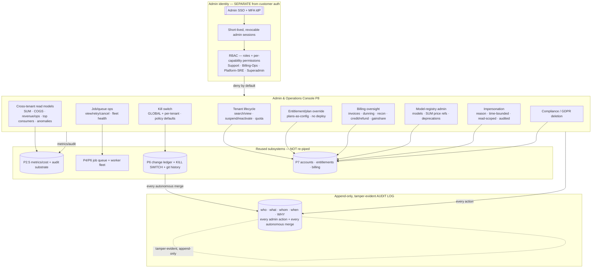
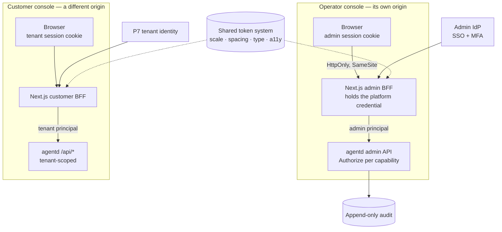

# PRD — P8: Admin & Operations Console (Platform Administration)

| Field | Value |
|---|---|
| Phase / Milestone | P8 / M11 |
| Target window | ~Weeks 45–52 (two waves: 8a alongside P7, then 8b) |
| Lead role(s) | Backend + Frontend + DevOps (co-leads) |
| Supporting role(s) | System Designer, Product Designer, AI Engineer, QA Engineer |
| Status | Draft |
| OpenSpec change | `p8-admin-console` |
| Console architecture | **Next.js (App Router) + TypeScript on its own origin, with its own BFF** — a separate application from the [P9](P9-web-console.md) customer console. See §8.4 and `admin-console-surface`. |

> **Money-in-git rule.** This PRD contains **no dollar amounts, no percentages, and no price
> bands**. Plans are referred to by **name only** — **Free / Team / Business / Enterprise**. The
> model-registry price references the console administers (the per-model prices used to derive SUM)
> are **configuration, not code, and not in git**; the console reads and repoints them, it never
> hardcodes a number. Anything with a dollar sign is out of scope for this document by construction.

## 1. Summary

P8 is the **internal operator console** the platform team uses to run the whole system — the
back-office surface, **not** the customer-facing web dashboard (P4/P7). It is the platform's
**highest-blast-radius surface**: a single console that **crosses tenant boundaries**, can **change a
customer's plan, entitlements, and billing** (credits/refunds), can **retry or cancel any tenant's
optimization jobs**, and can **halt the entire autonomous optimizer fleet** — globally or per tenant —
so no further optimization pull request merges. Because one operator action here can affect every
customer at once, P8 is designed **security-first**: admin identity is **separate from customer auth**,
access requires **SSO + MFA** on **short-lived, revocable sessions**, every capability is **permission-
gated under least privilege** (a Support agent cannot issue a refund or halt the fleet), every
**destructive or privileged action requires a confirmation and a recorded reason**, tenant
**impersonation is reason-required, time-bounded, read-scoped, and fully audited**, and **every admin
action and every autonomous merge lands in an append-only, tamper-evident audit log**. P8 adds **no
new pipeline** — it is a privileged read-model + command surface over machinery that already exists:
metrics/cost from **P2.5**, jobs/queue from **P4/P6**, the autonomous audit trail and kill switch from
**P6**, and tenants/billing/entitlements from **P7**. It ships in **two waves**: **8a** (admin RBAC +
tenant/billing/entitlement administration + the audit log) alongside P7, and **8b** (fleet operations,
global autonomous controls, cross-tenant observability, and compliance/GDPR handling). Milestone
**M11 — operator console live** means the platform is **manageable end-to-end** by an authenticated,
least-privileged operator, with every action observable and reversible.

## 2. Problem & context

By the end of P7 the platform is a business: it can discover, configure, run, evaluate, diagnose,
verify, and autonomously merge optimization PRs for paying tenants across named plans. But there is
**no supported way to operate it**. Every day-two task — a customer emails "suspend my account," a
charge fires twice, an optimization queue backs up, a runaway autonomous loop needs stopping across
every tenant, a regulator files a data-deletion request — has **no console**. Today those tasks would
be done by an engineer with a database shell and a production credential: **unaudited, unscoped, and
catastrophically over-privileged**. That is the exact anti-pattern P8 exists to kill. Five problems
block safe operation, and each maps to a design commitment:

- **No operator identity, so no least privilege.** The platform has *customer* auth (P7 accounts) but
  no **admin** identity. Without a separate admin identity provider, a role model, and per-capability
  permissions, "operator access" is all-or-nothing: whoever can reach the box can do anything to
  anyone. A **Support** agent answering a ticket and a **Superadmin** rotating a model price must not
  be the same power. Admin access must require **SSO + MFA**, run on **short-lived, revocable
  sessions**, and gate **every** capability under **least privilege** — deny by default.
- **Cross-tenant blast radius with no guardrail.** The console's whole point is to act *across*
  tenants — but that is also its danger. A mis-click can suspend the wrong tenant, refund the wrong
  invoice, or cancel a healthy queue. Every **destructive or privileged** action therefore needs a
  **confirmation, a recorded reason, and an audit entry** naming **who did what to whom, when, and
  why** — and irreversible actions need an explicit **second confirmation**. Reversibility is the
  default; irreversibility is a designed, gated exception.
- **The autonomous fleet has no operator brake.** P6 gives each *tenant* a kill switch for *their*
  loop. But the platform team needs a **global** and **per-tenant** brake reachable from one place —
  when a bad model, a provider incident, or a runaway search is causing harm across the fleet, an
  operator must **halt further autonomous PR merges immediately**, everywhere or for one tenant,
  without a deploy. Without it, the most autonomous, highest-authority actor in the system (the P6
  auto-merge loop) has no platform-level stop.
- **Support can't help a customer without becoming them — unsafely.** Diagnosing a tenant's issue
  often needs to see what the tenant sees. Doing that by copying their credential or querying their
  data ad hoc is an unaudited privacy breach. **Impersonation** must be a **first-class, consented,
  bounded** capability: **reason-required**, **time-bounded** (auto-expiring), **read-scoped by
  default**, and **fully audited** — every impersonated view logged, writes requiring explicit
  elevation and a second confirmation.
- **No cross-tenant visibility and no compliance path.** Running a fleet needs aggregate read models
  — usage/SUM, provider spend/COGS, revenue/ops health, top consumers, anomalies — but **any**
  cross-tenant view is a privacy event that must be **permission-gated and logged**. And a
  **data-deletion (GDPR) request** must be **actionable from the console and verifiable**, not a
  manual scavenger hunt. The audit log that records all of this must itself be **append-only and
  tamper-evident** — an operator (even a Superadmin) must not be able to quietly erase their tracks.

**Upstream state assumed.** **P2.5** (the cost/metric telemetry substrate — the cross-tenant read
models and the admin-action audit stream both ride it; SUM/COGS aggregates derive from it). **P4/P6**
(the discovery/eval/optimization **job queue and worker fleet** — the console views/retries/cancels
jobs and reads fleet health, it does not run a second queue). **P6** (the autonomous optimizer — its
**append-only change ledger + git-history audit trail** and its **kill switch** are the primitives the
console's global/per-tenant controls and merge-audit consume; every autonomous merge is already a
write-ahead-audited event). **P7** (the **tenant/account model, plan-as-config entitlements, and
billing** — the console administers these: suspend/reactivate, quota, plan/entitlement override,
credit/refund, reconciliation status, gainshare oversight). **ADR-001** (apply = source-transformation
PR; a **merge** is a git-history fact — the thing the audit log captures and the kill switch prevents).
P8 adds the **admin identity/RBAC** layer, the **privileged command surface** over those subsystems,
the **cross-tenant read models**, and the **append-only, tamper-evident audit log**.

## 3. Goals & non-goals

### Goals
- **G1. Admin identity is separate from customer auth and requires SSO + MFA.** Admin access SHALL be
  authenticated through a **dedicated admin identity provider** (never the customer auth path), SHALL
  require **SSO + MFA**, and an admin principal SHALL **never** be a tenant principal. No admin
  capability is reachable without an authenticated, MFA-verified admin session.
- **G2. Admin sessions are short-lived and revocable.** An admin session SHALL have a **short TTL** and
  SHALL be **immediately revocable**; an expired or revoked session SHALL be denied at the next request
  with no grace, so a lost laptop or a compromised session has a bounded blast radius.
- **G3. Every admin capability is permission-gated under least privilege (deny by default).** Access to
  **every** admin capability SHALL be gated by an explicit permission held via a **role** (Support /
  Billing-Ops / Platform-SRE / Superadmin); absent a granting permission the capability SHALL be
  **denied**. A **Support** role SHALL **not** be able to perform **billing** (credits/refunds) or
  **destructive** operations (suspend, cancel jobs, kill switch, plan override).
- **G4. Every destructive or privileged action requires confirmation + a recorded reason + an audit
  entry.** Any action that changes tenant state, money, entitlements, jobs, the fleet, or the model
  registry SHALL require a **confirmation** and a **recorded reason**, and SHALL write an audit entry
  capturing **actor, target, action, reason, and timestamp**. An **irreversible** action SHALL require
  an explicit **second confirmation**.
- **G5. Tenant lifecycle is operable and audited.** Operators SHALL be able to **search/view** tenants
  and **suspend/reactivate** them and **adjust quotas** — each permission-gated, reason-required, and
  audited; a **suspended** tenant's autonomous merges SHALL be halted as part of the suspension.
- **G6. Entitlement/plan overrides take effect with no code deploy and are audited.** An operator with
  the right permission SHALL be able to **override a tenant's plan/entitlement** (plans-as-config, per
  P7), the override SHALL take effect **without a code deploy**, and it SHALL be **audited** — with no
  price value written to git.
- **G7. Billing operations are overseeable, with least privilege and reversibility (P7 discipline).**
  **Billing-Ops** (not Support) SHALL be able to view invoices/dunning/reconciliation status and issue
  **credits/refunds** — each an **additive, audited** correction per P7 (never a destructive edit) — and
  oversee **verified-savings / gainshare** (which bills only verified, merged savings).
- **G8. The model registry is administrable, audited, and non-retroactive.** Operators SHALL be able to
  **add/deprecate models** and **repoint the per-model price references** used to derive SUM (config,
  not git); changes SHALL be **audited** and SHALL **not retroactively alter** already-closed
  metering/billing periods.
- **G9. Jobs and the worker fleet are operable.** Operators SHALL be able to **view/retry/cancel**
  discovery/eval/optimization jobs (reusing the P4/P6 queue, not a second one) and read **worker-fleet
  health**; a **cancel** is destructive and SHALL be confirmation-+-reason-+-audit gated.
- **G10. A global and per-tenant kill switch halts autonomous merges immediately.** An operator SHALL
  be able to fire a **global** kill switch (no tenant's autonomous loop merges further) and a
  **per-tenant** kill switch (only that tenant halts), each taking effect **immediately** and without a
  deploy, wired to the **P6** kill switch, with policy defaults settable and audited.
- **G11. Impersonation is consented, time-bounded, read-scoped, and fully audited.** Support
  impersonation of a tenant SHALL be **reason-required**, **time-bounded** (auto-expiring),
  **read-scoped by default** (writes require explicit elevation + a second confirmation), and **fully
  audited** — every impersonated action logged as impersonation, not as the tenant.
- **G12. Cross-tenant read models are permission-gated and every view is logged.** Aggregate read
  models — usage/SUM, COGS/provider spend, revenue/ops aggregates (the **mechanism**, not numbers), top
  consumers, anomalies — SHALL be **read-only**, **permission-gated**, and **every cross-tenant view
  SHALL be logged**; an unauthorized admin SHALL be **denied**.
- **G13. The audit log is append-only, tamper-evident, and captures every admin action AND every
  autonomous merge.** The audit log SHALL be **append-only** and **tamper-evident** (a mutation or
  deletion of an entry is prevented and detectable); it SHALL capture **every** admin action and
  **every** P6 autonomous merge; not even a Superadmin can silently erase an entry.
- **G14. Compliance/GDPR deletion is actionable from the console and verifiable.** A data-deletion
  (GDPR) request SHALL be **actionable** from the console and its completion **verifiable** — the
  subject's data is removed (or tombstoned), a verifiable completion record is produced, and the action
  is audited (the append-only audit retains a non-PII tombstone reference, not the deleted content).
- **G15. Admin actions are themselves observable.** Admin activity (logins, privileged actions, kill-
  switch state, impersonation sessions, cross-tenant views) SHALL emit metrics/audit events on the
  **P2.5 substrate**, so operator behavior is a live operational signal, not a black box.
- **G16. Two waves, honest dependencies.** **8a** (admin RBAC + tenant/billing/entitlement admin +
  audit log) ships alongside **P7**; **8b** (fleet ops, global autonomous controls, cross-tenant
  observability, compliance) follows once **P6** fleet controls and **P2.5** aggregates it depends on
  are in place.
- **G17. The operator console is a separate application on a separate origin.** The console SHALL be a
  **distinct Next.js application** with its **own BFF** and its **own origin**, deployed independently
  of the P9 customer console. Isolation SHALL be **enforced by the browser's origin boundary**, not by
  routing correctness inside a shared application: separate origins mean separate cookie jars, so a
  cross-site-scripting or routing defect in the customer console cannot reach an admin capability, and
  an admin session is not reachable from customer-console script.
- **G18. No admin credential reaches the browser.** The admin BFF SHALL hold the platform credential
  server-side and issue the browser an `HttpOnly`, `SameSite` **admin session** bound to an admin
  principal. No admin API key SHALL appear in the client bundle, a script-readable cookie, `localStorage`,
  a URL, a log line, or a telemetry attribute — the P9 rule, applied to the higher-blast-radius surface.
- **G19. The operator console is visually unmistakable.** The console SHALL share the platform's token
  **system** (scale, spacing, type, accessibility primitives) but SHALL carry **distinct operator chrome**
  — a distinct accent and a persistent, always-visible operator identification — so an operator with both
  consoles open in tabs **cannot mistake one for the other at a glance**. Distinctness is a requirement
  with a stated safety reason, not a style preference: the confusion it prevents is performing a
  cross-tenant action while believing the view is single-tenant.
- **G20. The screen and the gate never disagree.** The console SHALL render capability from the **same
  permission map the backend enforces** (G3), so an operator is never shown a control the gate will
  refuse, and never hidden one their role grants.
- **G21. Accessibility and acceptance are not relaxed because the audience is internal.** Every control
  SHALL be keyboard-reachable with a visible focus indicator, every data table SHALL use scoped headers,
  every chart SHALL have a tabular fallback, contrast SHALL meet WCAG 2.1 AA, UI strings SHALL be English
  with `en-US`-pinned formatting, and acceptance for any user-visible behavior SHALL require
  **rendered-browser evidence**, never a successful build.

### Non-goals (explicitly deferred or owned elsewhere)
- **The customer-facing web dashboard** — **[P9](P9-web-console.md).** P8 is the **internal operator**
  console; it is a distinct surface with a distinct identity and RBAC. The two are **never the same app,
  never the same origin, and never the same login** — see G17.
- **Concrete prices, plan limits, SUM band boundaries, and gainshare rates** — **configuration, not
  this document, not git** (P7). P8 provides the **mechanism** to view and repoint the config; it holds
  no numbers.
- **The metric/cost collection pipeline** — **P2.5.** The console **reads** aggregates; it collects
  nothing new.
- **The job queue / worker execution** — **P4/P6.** The console **operates** (view/retry/cancel) the
  existing queue; it does not run a parallel executor.
- **The autonomous loop mechanics, its per-run kill switch, its change ledger** — **P6.** P8 exposes a
  **platform-level** (global + per-tenant) control wired to P6's kill switch and **reads** P6's audit
  trail; it does not reimplement the loop.
- **Billing provider integration, idempotency, proration/dunning** — **P7.** P8 **oversees** billing
  state and issues **additive** credits/refunds through P7's audited path; it does not reimplement
  billing.
- **Entering financial credentials / storing raw card data / a payments processor** — **never** (P7
  safety rule). The console shows provider **handles** and state; card data stays with the PCI-compliant
  provider.
- **A general-purpose SQL/prod-shell replacement for arbitrary queries** — **explicitly not.** P8
  replaces the *ad-hoc prod shell* with **bounded, permission-gated, audited capabilities**; "run
  arbitrary SQL against any tenant" is the anti-pattern it exists to remove, not a feature.

## 4. Users & personas

The console has **four operator roles**, ordered by increasing privilege, plus the subsystems it
drives. Roles are the unit of least privilege (G3); a person may hold one role.

- **Support (least privileged, read-first).** Answers customer tickets. Can **search/view** tenants,
  read job status, and **impersonate** a tenant **read-scoped, time-bounded, with a reason** to
  reproduce an issue. **Cannot** issue credits/refunds, cannot suspend/cancel, cannot touch the kill
  switch, cannot override a plan. When Support needs one of those, they **escalate** to the role that
  holds it. This is the persona the least-privilege tests are written against.
- **Billing-Ops.** Owns billing correctness in the field: views invoices, dunning, and
  **reconciliation status**; issues **additive, audited** credits/refunds (P7); oversees
  **verified-savings / gainshare**; and administers **entitlement/plan overrides** (plans-as-config).
  Does **not** operate the optimizer fleet or the kill switch.
- **Platform-SRE.** Owns fleet and job operations: **view/retry/cancel** jobs, read **worker-fleet
  health**, administer the **model registry** (add/deprecate/repoint price refs), and operate the
  **global and per-tenant kill switch** for the autonomous optimizer. Does **not** issue refunds.
- **Superadmin (most privileged, tightly held).** Everything above, plus **role/permission grants** and
  **compliance/GDPR** actions. Superadmin is the only role that can grant admin roles — and that grant
  is itself **permission-gated and audited**. Even Superadmin **cannot** mutate or delete an audit
  entry (G13); the tamper-evidence holds against every role.
- **Downstream subsystems.** The **P2.5** telemetry substrate (source of cross-tenant read models + the
  admin-action audit stream); the **P4/P6** job queue + worker fleet (operated, not duplicated); the
  **P6** autonomous loop's change ledger + kill switch (read for merge-audit; wired for global/per-
  tenant halt); the **P7** account/entitlement/billing services (administered: suspend, quota, override,
  credit/refund, reconciliation, gainshare oversight); and the **admin identity provider** (SSO + MFA,
  separate from customer auth).

## 5. User stories / jobs-to-be-done

**Support**
- As a Support agent, I want to **sign in with SSO + MFA** and get a **short-lived** session, so that
  operator access is bounded and a lost session can't be replayed for long.
- As a Support agent, I want to **search and view** a tenant and read their **job status**, so that I
  can triage a ticket without a database shell.
- As a Support agent, I want to **impersonate** a tenant **read-only, for a bounded time, with a stated
  reason**, so that I can see exactly what they see — and I accept that every view is logged.
- As a Support agent, when I need a refund or a suspension, I want the console to **tell me I lack the
  permission and who to escalate to**, so that least privilege is a guardrail, not a mystery.

**Billing-Ops**
- As Billing-Ops, I want to view a tenant's **invoices, dunning, and reconciliation status**, so that I
  can resolve a billing ticket from one place.
- As Billing-Ops, I want to issue a **credit or refund** as an **additive, audited** correction with a
  recorded reason, so that a billing error is fixed reversibly and traceably (never by editing history).
- As Billing-Ops, I want to **override a tenant's plan/entitlement** and have it take effect **with no
  code deploy** and be **audited**, so that packaging changes are a config action, not a release.
- As Billing-Ops, I want to oversee **gainshare** and confirm a charge traces to a **verified, merged**
  saving, so that the platform never bills for a saving it can't prove.

**Platform-SRE**
- As Platform-SRE, I want to **view/retry/cancel** any tenant's discovery/eval/optimization jobs and
  read **worker-fleet health**, so that I can clear a backed-up queue — with a **cancel** requiring a
  confirmation + reason.
- As Platform-SRE, I want to **administer the model registry** — add/deprecate a model, repoint the
  per-model **price reference** used for SUM — with the change **audited** and **not** retroactively
  rewriting closed periods.
- As Platform-SRE, when a bad model or a provider incident is harming the fleet, I want to fire a
  **global kill switch** that **immediately** halts every tenant's autonomous merges, and a **per-tenant
  kill switch** when only one tenant is affected, **without a deploy**.

**Superadmin**
- As a Superadmin, I want to **grant and revoke admin roles**, with the grant itself **permission-gated
  and audited**, so that privilege distribution is controlled and traceable.
- As a Superadmin, I want to **action a GDPR data-deletion request** from the console and get a
  **verifiable** completion record, so that compliance is operable, not a manual hunt.
- As a Superadmin, I want the audit log to be **append-only and tamper-evident** — so that **not even I**
  can quietly erase an action, and an auditor can trust it.

**Platform operator (all roles)**
- As any operator, I want a **cross-tenant read model** (usage/SUM, COGS, revenue/ops, top consumers,
  anomalies) **only if I'm authorized**, and I accept that **every cross-tenant view is logged**.
- As any operator, I want **every destructive action** to require a **confirmation + reason** and land
  in the audit log as **who/what/whom/when/why**, so that operating the platform is safe and
  reconstructable.

## 6. Functional requirements

These map 1:1 to the OpenSpec requirements under
`openspec/changes/p8-admin-console/specs/{admin-rbac,admin-operations,admin-observability-audit}/`.

**Admin RBAC — separate identity, SSO+MFA, short-lived sessions, least privilege** (`admin-rbac`)
- **FR1 (→ admin-rbac).** Admin access SHALL be authenticated through a **dedicated admin identity
  provider separate from customer auth** and SHALL require **SSO + MFA**; an admin principal SHALL never
  be a tenant principal, and no admin capability is reachable without an authenticated, MFA-verified
  admin session.
- **FR2 (→ admin-rbac).** Admin sessions SHALL be **short-lived** and **immediately revocable**; an
  expired or revoked session SHALL be denied at the next request.
- **FR3 (→ admin-rbac).** **Every** admin capability SHALL be **permission-gated (deny by default)** via
  a **role** (Support / Billing-Ops / Platform-SRE / Superadmin); a capability with no granting
  permission SHALL be denied and the denial logged.
- **FR4 (→ admin-rbac).** Roles SHALL enforce **least privilege**: a **Support** role SHALL **not** be
  able to perform **billing** (credits/refunds) or **destructive** operations (suspend, cancel jobs,
  kill switch, plan override).
- **FR5 (→ admin-rbac).** **Role/permission grants SHALL themselves be permission-gated (Superadmin
  only) and audited.**

**Admin operations — tenant/billing/entitlement/model/job/fleet/impersonation** (`admin-operations`)
- **FR6 (→ admin-operations).** Every **destructive or privileged** admin action SHALL require a
  **confirmation** and a **recorded reason** and SHALL write an audit entry of **{actor, target, action,
  reason, timestamp}**; an **irreversible** action SHALL require an explicit **second confirmation**.
- **FR7 (→ admin-operations).** Operators SHALL be able to **search/view** tenants and
  **suspend/reactivate** them and **adjust quotas** — permission-gated, reason-required, audited; a
  **suspension** SHALL halt the tenant's autonomous merges.
- **FR8 (→ admin-operations).** An **entitlement/plan override** SHALL take effect **without a code
  deploy** (plans-as-config, P7) and SHALL be **audited**, with **no price value written to git**.
- **FR9 (→ admin-operations).** **Billing-Ops** (not Support) SHALL be able to view
  invoices/dunning/reconciliation status and issue **credits/refunds** as **additive, audited**
  corrections (P7 discipline — never a destructive edit), and oversee **verified-savings / gainshare**.
- **FR10 (→ admin-operations).** Operators SHALL be able to administer the **model registry** —
  **add/deprecate models** and **repoint the per-model price references** used to derive SUM (config, not
  git) — **audited** and **without retroactively altering already-closed metering/billing periods**.
- **FR11 (→ admin-operations).** Operators SHALL be able to **view/retry/cancel** discovery/eval/
  optimization **jobs** (reusing the P4/P6 queue) and read **worker-fleet health**; a **cancel** SHALL
  be confirmation-+-reason-+-audit gated.
- **FR12 (→ admin-operations).** A **global** and a **per-tenant kill switch** SHALL **immediately halt**
  further autonomous PR **merges** (global = all tenants; per-tenant = one tenant), wired to the **P6**
  kill switch, effective **without a deploy**, with policy defaults settable — each fire audited.
- **FR13 (→ admin-operations).** Support **impersonation** of a tenant SHALL be **reason-required**,
  **time-bounded** (auto-expiring), **read-scoped by default** (a write requires explicit elevation + a
  second confirmation), and **fully audited** — every impersonated action logged as impersonation.

**Admin observability & audit — cross-tenant read models, audit log, compliance** (`admin-observability-audit`)
- **FR14 (→ admin-observability-audit).** **Cross-tenant read models** (usage/SUM, COGS/provider spend,
  revenue/ops aggregates — mechanism, not numbers; top consumers; anomalies) SHALL be **read-only** and
  **permission-gated**; an **unauthorized** admin SHALL be **denied** and every **authorized cross-tenant
  view SHALL be logged**.
- **FR15 (→ admin-observability-audit).** The audit log SHALL be **append-only** and **tamper-evident** —
  a mutation or deletion of an entry SHALL be **prevented and detectable**, and **no role (including
  Superadmin)** SHALL be able to silently erase an entry.
- **FR16 (→ admin-observability-audit).** The audit log SHALL capture **every admin action** and **every
  P6 autonomous merge**, keyed to reconstruct **who/what/whom/when/why** (and, for a merge, the
  motivating diagnosis, verified delta, and merge commit per P6).
- **FR17 (→ admin-observability-audit).** A **data-deletion (GDPR) request** SHALL be **actionable** from
  the console and its completion **verifiable** — the subject's data is removed (or tombstoned), a
  verifiable completion record is produced, and the action is audited (the append-only audit retains a
  **non-PII tombstone reference**, not the deleted content).
- **FR18 (→ admin-observability-audit).** **Admin actions SHALL be observable** — logins, privileged
  actions, kill-switch state, impersonation sessions, and cross-tenant views SHALL emit metrics/audit
  events on the **P2.5 substrate**.

**Operator console surface — the application, its isolation, and its interface discipline** (`admin-console-surface`)
- **FR19 (→ admin-console-surface).** The operator console SHALL be a **separate Next.js application**
  with its **own BFF**, served from an **origin distinct from the customer console**, and deployed as an
  independent unit. It SHALL NOT share an origin, a session cookie, or a client bundle with the P9
  customer console.
- **FR20 (→ admin-console-surface).** The admin BFF SHALL hold the platform credential **server-side
  only** and issue an `HttpOnly`, `SameSite` admin session bound to an **admin principal**. No credential
  SHALL appear in any client artifact, log, or telemetry attribute, and an unauthenticated request to any
  console route SHALL **redirect to sign-in rather than render** a shell that then fails.
- **FR21 (→ admin-console-surface).** A **customer (tenant) session SHALL NOT authorize any admin
  capability**, and an admin session SHALL NOT be presentable to the customer console — the two session
  domains are disjoint.
- **FR22 (→ admin-console-surface).** The console SHALL render capability from the **same permission map
  the backend enforces**; a control an operator's role does not grant SHALL NOT be rendered, and an
  under-privileged action SHALL render **who holds the permission and how to escalate**, never a bare
  refusal.
- **FR23 (→ admin-console-surface).** The console SHALL carry **distinct operator chrome** — a distinct
  accent and persistent operator identification naming the console and the acting admin principal —
  visible on **every** view, so it cannot be confused with the customer console at a glance.
- **FR24 (→ admin-console-surface).** Dangerous-action friction SHALL be **proportional to blast radius**
  and rendered as such: a destructive action requires a **typed reason**; an **irreversible** action
  additionally requires the operator to **type the target's identifier**; a **global** control (e.g. the
  fleet kill switch) SHALL be visually distinct from and higher-friction than its per-tenant counterpart,
  so "halt this tenant" can never be mistaken for "halt the fleet".
- **FR25 (→ admin-console-surface).** While impersonation is active the console SHALL display a
  **persistent banner** naming the tenant, the read-only scope, the expiry, and that every action is
  logged, with an always-visible **End** control; entering write scope SHALL require a second
  confirmation.
- **FR26 (→ admin-console-surface).** **Loading, empty, denied, and degraded** SHALL be four distinct
  renderings on every view; a permission denial SHALL NOT render as an empty result, and a transport
  failure SHALL NOT render as absence of data.
- **FR27 (→ admin-console-surface).** The console SHALL meet the same interface floor as P9: every control
  keyboard-reachable with a visible focus indicator, scoped table headers, a tabular fallback for every
  chart, WCAG 2.1 AA contrast, English UI strings with `Intl` formatting pinned to `en-US` through a
  single swap point, and values escaped on render.
- **FR28 (→ admin-console-surface).** **No number SHALL be hardcoded** in the console — plan names and
  price references come from configuration, never from the client bundle (P7's money-in-git rule).

## 7. Non-functional requirements

- **Security (load-bearing).** Admin identity is **separate from customer auth**; **SSO + MFA** is
  mandatory (FR1); sessions are **short-lived + revocable** (FR2); **every** capability is
  **deny-by-default permission-gated** (FR3); **least privilege** is enforced (Support cannot refund or
  perform destructive ops — FR4). These are correctness invariants, not best-effort, and each is a
  first-class test. The console **never** offers arbitrary SQL/prod-shell access — only bounded,
  audited capabilities.
- **Blast-radius containment.** Because one action can affect every tenant, **every destructive/
  privileged action requires confirmation + recorded reason + audit** (FR6), irreversible actions need a
  **second confirmation**, and **cross-tenant scope is explicit** (a per-tenant action names its target;
  a global action — e.g., the global kill switch — is a distinct, higher-friction control). Default is
  **reversible**; irreversibility is a gated exception.
- **Least privilege / separation of duties.** Roles partition capability: **Support** (read + bounded
  impersonation), **Billing-Ops** (billing + entitlement override), **Platform-SRE** (jobs + fleet +
  registry + kill switch), **Superadmin** (role grants + compliance). No role is a superset by accident;
  the grant of a role is itself gated and audited (FR5).
- **Auditability & tamper-evidence.** The audit log is **append-only** and **tamper-evident** (e.g., a
  hash-chained / write-once store) — no operator, including Superadmin, can mutate or delete an entry
  without detection (FR15). It captures **every** admin action and **every** autonomous merge (FR16),
  keyed by the P0 tag set + `{actor, target, reason, timestamp}`, sufficient to reconstruct any
  operator session or fleet change from first principles.
- **Multi-tenant isolation.** Cross-tenant access is the console's purpose *and* its hazard: it is
  **permission-gated** and **every cross-tenant view is logged** (FR14); a per-tenant command cannot
  silently fan out; impersonation is scoped to **one** named tenant, read-only, and time-bounded (FR13).
  Aggregate read models expose **mechanism, not raw tenant content**.
- **Reuse, not re-pipeline.** The console is a **read-model + privileged-command layer**: metrics/cost
  from **P2.5**, jobs/queue from **P4/P6**, the autonomous audit trail + kill switch from **P6**,
  tenants/billing/entitlements from **P7**. It stands up **no** new collection pipeline, executor, or
  billing integration.
- **Availability & fail-closed.** The kill switch and the audit write **fail closed**: if the audit
  store is unavailable, a privileged action does **not** proceed unaudited (mirrors P6's
  write-ahead-audit); if the kill-switch state store is unreachable, the safe default is **halt**, not
  merge. A console outage never leaves the fleet un-stoppable — the P6 kill switch remains independently
  armable.
- **Secrets & credentials.** Admin SSO/MFA secrets, session signing keys, and any provider handles live
  in a **secrets manager**, never in code/git/telemetry (P2.5 rule); the console holds provider
  **handles**, never card data; it never enters or stores financial credentials (safety rule).
- **Compliance.** GDPR/data-deletion is **actionable + verifiable** (FR17); the tension between
  "delete the subject's data" and "the audit log is append-only" is resolved by **tombstoning** — the
  content is deleted, a **non-PII** reference remains in the audit chain so the deletion itself is
  auditable and the chain stays intact.
- **Observability of operators.** Admin activity emits on the **P2.5 substrate** (FR18): login rate, MFA
  failures, privileged-action volume, active impersonation sessions, kill-switch state, cross-tenant
  view counts — with alerts on anomalies (e.g., a spike in privileged actions or a kill switch left
  armed). Operators watching operators.
- **Console isolation (load-bearing).** The console is a **separate Next.js application on a separate
  origin with its own BFF** (FR19). Isolation is enforced by the **browser's origin boundary** — separate
  cookie jars, separate bundles — rather than by routing correctness inside a shared app, because on the
  platform's highest-blast-radius surface a routing defect must not be the only thing standing between a
  customer session and a cross-tenant capability. The admin credential is **server-side only** (FR20), and
  the customer and admin session domains are **disjoint** (FR21).
- **Accessibility & performance (UI).** The back-office renders **role-scoped** views from the same
  permission map the backend enforces (FR22), first-class **dangerous-action confirmation** with friction
  proportional to blast radius (FR24), a designed **impersonation-consent/active-session banner** (FR25),
  and **loading / empty / denied / degraded** as four distinct states (FR26); cross-tenant charts follow
  the **dataviz** skill for contrast and light/dark and carry a tabular fallback; every control is
  keyboard-reachable at **WCAG 2.1 AA** (FR27); **no number is hardcoded** — plan names and price
  references come from config (FR28). The audience being internal **does not** lower this floor: an
  operator using a keyboard, or working at 200% zoom during an incident, is the normal case, not an edge
  one.
- **Visual distinctness as a safety property.** The console shares the platform token **system** but
  carries **distinct operator chrome** (FR23). This is a safety requirement, not a style choice: the
  failure it prevents is an operator with both consoles open performing a cross-tenant action while
  believing the view is single-tenant.

## 8. System design summary

**Where P8 sits — a privileged read-model + command surface over the existing platform, behind a
separate admin identity.**

**Data model (System Designer lens).**
- **Admin identity store (separate from customer auth)** —
  - `admin_principal` (`admin_id` PK, sso_subject, mfa_enrolled BOOL, status, created_at) — **never** a
    tenant principal; authenticated only via the admin IdP.
  - `admin_role_grant` (`admin_id`, `role` ∈ {support, billing_ops, platform_sre, superadmin},
    granted_by, granted_at, revoked_at NULL) — **append-only**; a grant/revoke is a new row, itself
    Superadmin-gated + audited (FR5).
  - `admin_session` (`session_id` PK, `admin_id`, issued_at, expires_at (**short TTL**), revoked_at
    NULL) — a request is authorized only against a live, unexpired, unrevoked session (FR2).
  - `permission` map (role → capabilities) — **deny by default**; the gate resolves a capability against
    the caller's live role grants (FR3, FR4).
- **Command + audit store** —
  - `audit_entry` (`seq` PK monotonic, `prev_hash`, `entry_hash`, `actor_admin_id`, `target` (tenant/
    subject/job/global), `action`, `reason`, `params_digest`, `result`, `created_at`) — **append-only**,
    **hash-chained** (`entry_hash = H(prev_hash ‖ payload)`) so any mutation/deletion breaks the chain
    and is detectable (FR15); captures every admin action (FR16). For an **autonomous merge** the entry
    mirrors the P6 change-ledger event (motivating diagnosis, verified delta, merge commit).
  - `impersonation_session` (`imp_id` PK, `actor_admin_id`, `tenant_id`, `reason`, scope ∈
    {read, elevated_write}, started_at, expires_at (**bounded**), ended_at) — every impersonated action
    references its `imp_id` in the audit log (FR13).
  - `kill_switch_state` (`scope` ∈ {global, tenant:<id>}, `armed` BOOL, `set_by`, `reason`, `set_at`) —
    the platform-level arm state the P6 loop consults before a merge (FR12); read fail-closed to
    **halt**.
  - `gdpr_request` (`request_id` PK, `subject_ref`, status ∈ {received, executing, completed}, `actor`,
    `verification_ref`, tombstone_ref) — the deletion tombstones content and keeps a **non-PII** ref in
    the audit chain (FR17).
- **Reused stores (read/administer, not own):** P2.5 TSDB/span store (cross-tenant aggregates + admin
  metrics), P4/P6 queue (jobs + fleet health), P6 change ledger + git history (merge audit), P7
  Postgres (accounts, entitlements, billing events, reconciliation).
- **Config store (not git):** plan definitions + model **price references** the registry admin repoints
  (P7); the console reads/publishes versions, never a git-tracked number.

**8.4 Console topology — two applications, two origins, two BFFs.**

The two consoles are **separate Next.js applications on separate origins with separate BFFs** (FR19).
That is the whole of the isolation argument: the browser enforces the boundary. Separate origins mean
separate cookie jars and separate bundles, so a cross-site-scripting or routing defect in the customer
console **cannot** reach an admin session or an admin capability. In a single application with
role-gated routes the same isolation would be a property of routing correctness — and on the platform's
highest-blast-radius surface, routing correctness is not a strong enough thing to rest it on.

What the two consoles **do** share is the token **system** — scale, spacing, type, and the accessibility
primitives — because the alternative is drift and doubled maintenance. What they must **not** share is
appearance: the operator console carries **distinct chrome** (a distinct accent and persistent operator
identification on every view, FR23) so an operator with both open in tabs cannot mistake one for the
other. The failure that prevents is concrete and severe: performing a cross-tenant action while
believing the view is single-tenant.

**Key interfaces.**
- `Authenticate(sso_assertion, mfa) → AdminSession` — via the admin IdP; short-TTL, revocable (FR1, FR2).
- `AdminBFF.Forward(admin_session, request)` — resolves the admin principal server-side and attaches the
  server-held credential; a **tenant** session presented here is refused (FR20, FR21).
- `PermissionMap(admin_id) → capabilities[]` — the **same** map the backend gate enforces, read by the
  console so screen and gate cannot disagree (FR22).
- `Authorize(admin_id, capability, target) → {allowed, reason?}` — deny-by-default role gate; logs
  denials (FR3, FR4).
- `SuspendTenant(admin_id, tenant, reason) / ReactivateTenant(...) / SetQuota(...)` — reason-required,
  audited; suspend halts the tenant's autonomous merges (FR7).
- `OverrideEntitlement(admin_id, tenant, plan_ref, reason) → AuditedEffect` — plans-as-config, effective
  with **no deploy**, audited (FR8).
- `IssueCredit(admin_id, tenant, reason) / IssueRefund(...)` — **Billing-Ops only**; additive + audited
  via P7 (FR9); Support is denied (FR4).
- `AdminRegistry.AddModel / DeprecateModel / RepointPriceRef(...)` — audited, non-retroactive on closed
  periods (FR10).
- `Jobs.List / Retry / Cancel(admin_id, job, reason)` + `FleetHealth()` — cancel is confirm+reason+audit
  (FR11).
- `KillSwitch.Arm(scope = global | tenant:<id>, reason) / Disarm(...) / State(scope)` — immediate,
  no-deploy, wired to P6; read fail-closed to halt (FR12).
- `Impersonate.Start(admin_id, tenant, reason, ttl) → ImpersonationSession` (read-scoped default) /
  `Elevate(...)` (second confirmation) / auto-expire — every action logged as impersonation (FR13).
- `CrossTenantView(admin_id, aggregate) → ReadModel` — permission-gated; **every** call logged; denies
  the unauthorized (FR14).
- `Audit.Append(entry) → seq` (hash-chained, append-only) / `Audit.Verify() → {intact, break_at?}`
  (tamper detection) — no mutate/delete path exists (FR15, FR16).
- `GDPR.Execute(admin_id, subject_ref, reason) → {completed, verification_ref}` — actionable +
  verifiable; tombstones content, keeps non-PII audit ref (FR17).

## 9. Design by role lens

**Backend (co-lead) — *the console is a bounded command surface, not a prod shell; deny by default,
audit before effect.***
The backend contract for every capability is the same shape: **authenticate → authorize (deny by
default) → confirm + reason → write-ahead audit → effect → observe.** Authorization is a first-class
gate, not middleware sugar: `Authorize(admin_id, capability, target)` resolves the caller's **live**
role grants against a **deny-by-default** permission map, so a Support principal calling `IssueRefund`
is refused **and the refusal is logged** (FR3, FR4) — the same code path proves least privilege in a
test. Every state-changing call is **write-ahead-audited** (the `audit_entry` is committed before the
effect, mirroring P6's merge discipline), so no privileged effect can escape the trail even under a
crash; if the audit store is unavailable, the action **fails closed** rather than proceeding unaudited.
Reversibility is designed in: suspend↔reactivate, arm↔disarm, credit-as-additive-correction (never a
destructive edit, per P7); the one-way doors (GDPR deletion) are gated behind a **second confirmation**.
The backend **reuses** P7 for billing/entitlements, P4/P6 for jobs, and P6 for the kill switch — it
issues *commands* to those services, it does not fork their logic, which keeps one source of truth per
fact and keeps the console honest.

**Frontend (co-lead) — *a separate application, because isolation should not be a routing property.***
The console is its **own Next.js (App Router, TypeScript) application on its own origin with its own
BFF** (FR19) — not a role-gated section of the P9 customer console. The reasoning is the one the whole
phase is organized around: this is the highest-blast-radius surface in the platform, and in a shared
application the separation between a tenant session and a cross-tenant capability would be a property
of routing correctness. As two origins it is a property the **browser** enforces — separate cookie
jars, separate bundles — so a cross-site-scripting or routing defect on the customer side cannot reach
an admin capability at all. The admin credential stays **server-side in the BFF** and the browser holds
only an `HttpOnly` admin session (FR20); a tenant session presented to the admin BFF is refused (FR21).
What the two consoles share is the token **system** — scale, spacing, type, accessibility primitives —
because the alternative is the palette fork P9 spent a phase reconciling. What they deliberately do
**not** share is appearance: distinct accent and **persistent operator identification on every view**
(FR23), so an operator with both consoles open in tabs cannot confuse them. That is a safety
requirement with a named failure, not a style preference.

*The interface makes power legible and dangerous actions deliberate; role-scoped by construction.*
The back-office IA is organized **by role and by blast radius**, not by database table. An operator
sees **only** the capabilities their role grants (a Support view has no refund button to mis-click) —
the UI reads the same permission map the backend enforces, so the screen and the gate never disagree.
The states that matter most are the dangerous ones, designed rather than defaulted:
- *Dangerous-action confirmation.* A destructive action opens a confirmation that **requires a typed
  reason**; an **irreversible** action (GDPR deletion) additionally requires the operator to **type the
  target's identifier** to confirm — friction proportional to blast radius (FR6).
- *Global vs. per-tenant.* The **global** kill switch is a visually distinct, higher-friction control
  (it affects **every** tenant) separated from the per-tenant one, so "halt this tenant" can never be
  mistaken for "halt the fleet" (FR12).
- *Impersonation consent + active banner.* Starting impersonation is a **consent flow** stating the
  tenant, the reason, the read-only scope, and the expiry; while active, a **persistent banner** shows
  "You are impersonating <tenant> (read-only, expires in N min) — every action is logged," and an
  always-visible **End** control; entering write scope demands a **second confirmation** (FR13).
- *Denied-with-escalation.* An under-privileged action renders **who holds it and how to escalate**, not
  a bare 403 (FR3) — least privilege as a guardrail, not a dead end.
- *Loading / empty / denied / degraded* are all four first-class and distinct (FR26) — a permission
  denial is not an empty result, and a transport failure is not absence of data; cross-tenant charts
  follow the **dataviz** skill (contrast, light/dark, no chart-junk) and carry a tabular fallback;
  everything is keyboard-reachable at WCAG 2.1 AA with scoped table headers (FR27); UI strings are
  English with `Intl` pinned to `en-US`; **no number is hardcoded** — plan names and price refs come from
  config (FR28).

The interface floor is **not** relaxed because the audience is internal. An operator driving this
console with a keyboard, or at 200% zoom, at 3am during an incident is the normal case — and the
consequence of a mis-read control here is measured in tenants.

**DevOps (co-lead) — *highest blast radius, so least privilege, tamper-evident audit, fail-closed, and
operators-watching-operators.***
P8 is the surface a DevOps review would flag first, so its guardrails are the deliverable, not an
afterthought. **Least privilege** is enforced at the identity layer: a **separate admin IdP** with
**mandatory SSO + MFA** (FR1), **short-TTL, revocable** sessions (FR2) so a compromised session has a
bounded window, and a **deny-by-default** capability gate (FR3). **Separation of duties** partitions the
four roles so no one persona can both move money *and* halt the fleet *and* erase the record. The
**audit log is append-only and tamper-evident** — hash-chained/write-once so a mutation or deletion,
**even by a Superadmin**, breaks the chain and is detected (FR15); it captures **every** admin action
and **every** autonomous merge (FR16). Critical paths **fail closed**: audit-store-down ⇒ block the
action; kill-switch-state-unreachable ⇒ default to **halt**; a console outage never removes the P6
kill switch as an independent brake. Finally, **operators are observed**: logins, MFA failures,
privileged-action volume, active impersonations, kill-switch state, and cross-tenant view counts emit
on the **P2.5 substrate** with anomaly alerts (FR18) — a spike in privileged actions or a kill switch
left armed pages someone. Rollout is **8a** (RBAC + tenant/billing/entitlement admin + audit log,
behind an admin feature flag, roles seeded minimal) then **8b** (fleet ops + global controls +
cross-tenant read models + GDPR); migrations are **expand-only**; the global kill switch is drilled in
staging before it is armed in production.

**System Designer (support) — *read-model + privileged-command over one source of truth per fact; no
second pipeline; explicit cross-tenant scope.***
The central design discipline is that P8 **owns almost no data**: it is a **read-model + command
layer** over subsystems that already hold the truth — P2.5 (usage/cost), P4/P6 (jobs/fleet), P6 (merge
audit + kill switch), P7 (accounts/billing/entitlements). Standing up a second usage or job pipeline
would create two disagreeing ledgers, so the console **reads aggregates and issues commands**, never
re-collects. The data P8 *does* own is exactly the operator layer: identity/roles/sessions, the
**append-only hash-chained audit log**, impersonation sessions, kill-switch state, and GDPR requests —
each chosen so the security invariants are **structural** (append-only + hash chain make tamper
detectable by construction; a short-TTL session row makes revocation a single write; a deny-by-default
permission map makes "unlisted ⇒ denied" a property, not a check). Cross-tenant access — the console's
reason for existing and its top hazard — is made **explicit**: a per-tenant command names its target, a
global command is a distinct higher-friction control, and **every** cross-tenant read is logged (FR14).
The apply-path principle recurs: privileged paths **fail closed** — if the audit or kill-switch store
is unavailable, the console defers or halts rather than acting unrecorded or letting the fleet run.

**Product Designer (support) — *back-office IA that encodes least privilege and makes consent explicit;
name the blast radius.***
Packaging the operator experience is a trust-and-safety design problem, not a CRUD screen. Three
deliverables:
- *Role-based IA.* The console's information architecture is organized so **each role sees a coherent,
  minimal surface** — Support gets triage + bounded impersonation; Billing-Ops gets billing +
  entitlement; Platform-SRE gets jobs + fleet + registry + kill switch; Superadmin adds role grants +
  compliance. The boundary between roles is where least privilege becomes tangible; the UX explains it
  where an operator meets it (denied-with-escalation), turning a wall into a route.
- *Dangerous-action confirmation patterns.* The design language scales **friction to blast radius**: a
  reversible per-tenant action gets a reason-required confirm; an irreversible or global action gets a
  **second confirmation** (type-the-target / global-scope acknowledgement). The pattern is consistent so
  operators learn "the amount of friction tells me how dangerous this is."
- *Impersonation-consent flow.* Impersonation is designed as an explicit, informed, bounded contract —
  the operator states a **reason**, sees the **read-only scope** and **expiry**, and works under a
  **persistent, unmissable banner** that every action is logged as impersonation. This is the privacy-
  respecting alternative to the credential-copying anti-pattern; consent and audit are the design, not
  a policy note.

**AI Engineer (support) — *the console is the operator brake on the most autonomous actor; halt is
immediate, and every autonomous merge is on the record.***
P8 is where the platform's most autonomous, highest-authority actor — the **P6 auto-merge loop**, which
edits and merges user code without a human in the seat — gets its **platform-level oversight**. Two
invariants carry the AI-safety weight. First, the **kill switch is a real brake**: a **global** arm
halts **every** tenant's autonomous merges and a **per-tenant** arm halts one, both **immediately** and
**without a deploy**, wired to the same P6 kill-switch the loop consults **before every merge** (FR12);
the state store reads **fail-closed to halt**, so "can't tell if we're stopped" means stopped. This is
the fleet-scale version of P6's own principle that the loop merges nothing unless a kill switch is
armed and reachable. Second, **every autonomous merge is on the tamper-evident record**: the audit log
captures each merge with its **motivating diagnosis, verified delta, and merge commit** (mirroring the
P6 change ledger), so an operator or auditor can reconstruct **what the fleet changed, why, and with
what measured effect** — and **no one, including a Superadmin, can erase it** (FR15, FR16). Oversight
without a stop is theater; a stop without a record is unaccountable. P8 provides both.

## 10. Dependencies

- **Requires (upstream):**
  - **P2.5** — the **metrics/cost + audit telemetry substrate**: the cross-tenant read models
    (usage/SUM, COGS, revenue/ops, top consumers, anomalies) derive from it, and admin actions emit on
    it. **Cross-tenant observability (8b) and admin-action observability depend on this.**
  - **P4 / P6** — the **discovery/eval/optimization job queue + worker fleet** the console operates
    (view/retry/cancel + fleet health). **Job/queue ops depend on this.**
  - **P6** — the **autonomous optimizer's change ledger + git-history audit trail + kill switch**: the
    console's merge-audit reads them and the **global/per-tenant kill switch is wired to P6's**.
    **Global autonomous controls (8b) depend on this.**
  - **P7** — the **tenant/account model, plan-as-config entitlements, and billing** the console
    administers (suspend/reactivate, quota, entitlement override, credit/refund, reconciliation status,
    gainshare oversight). **Tenant/billing/entitlement admin (8a) depends on this.**
  - **ADR-001** — apply = source-transformation PR; a **merge** is the git-history fact the audit log
    captures and the kill switch prevents.
- **Consumes:** a **dedicated admin identity provider** (SSO + MFA, separate from customer auth); a
  **tamper-evident append-only audit store**; the P2.5/P4/P6/P7 read and command interfaces; plan/price
  **configuration** (read + repoint, never in git).
- **Unblocks:** **M11 — operator console live (platform manageable end-to-end).** The platform can be
  run by an authenticated, least-privileged operator: tenants administered, billing overseen,
  entitlements overridden, jobs and the fleet operated, the autonomous fleet halt-able globally and per
  tenant, cross-tenant health visible, and compliance actionable — with **every** action observable,
  reversible where possible, and on a tamper-evident record.

**Two waves.**
- **8a — admin RBAC + tenant/billing/entitlement admin + audit log.** The identity/RBAC foundation
  (separate IdP, SSO+MFA, short-lived sessions, deny-by-default roles), tenant lifecycle, entitlement/
  plan override, billing oversight (credits/refunds, reconciliation, gainshare oversight), and the
  append-only tamper-evident audit log. Ships **alongside P7** (it administers what P7 builds).
- **8b — fleet ops + global autonomous controls + cross-tenant observability + compliance.** Job/queue
  operations + worker-fleet health, the **global and per-tenant kill switch**, cross-tenant read models,
  and compliance/GDPR handling. Follows once **P6** fleet controls and **P2.5** aggregates are in place.

## 11. Risks & mitigations

| Risk | Owner | Mitigation |
|---|---|---|
| Over-privileged operator access (all-or-nothing, like a prod shell) | DevOps / Backend | Separate admin IdP + **SSO + MFA** (FR1); **deny-by-default** per-capability gate (FR3); **least privilege** — Support cannot refund or perform destructive ops (FR4); no arbitrary-SQL surface |
| Compromised / lingering admin session | DevOps | **Short-TTL, immediately revocable** sessions (FR2); expired/revoked denied at next request; tested |
| A mis-clicked destructive action hits the wrong tenant / the whole fleet | Frontend / Backend | **Confirmation + recorded reason + audit** on every destructive/privileged action (FR6); **second confirmation** for irreversible; global controls are distinct, higher-friction from per-tenant |
| Support agent quietly issues a refund / suspends a tenant | Backend | Billing + destructive ops gated to Billing-Ops/Platform-SRE; Support **denied + logged** (FR4, FR9); least-privilege test is load-bearing |
| Runaway autonomous fleet with no platform brake | AI / Platform-SRE | **Global + per-tenant kill switch** halts merges **immediately**, no deploy, wired to P6 (FR12); state reads **fail-closed to halt** |
| Impersonation used as an unaudited backdoor into tenant data | Backend / Product | Impersonation **reason-required, time-bounded, read-scoped, fully audited** (FR13); writes need elevation + second confirm; every action logged as impersonation |
| Entitlement/plan override needs a deploy or leaks a price into git | Backend / Product | Override is **plans-as-config**, effective with **no deploy**, **audited**; no price value in git (FR8) |
| An operator (even Superadmin) erases their tracks | DevOps | Audit log **append-only + tamper-evident** (hash-chained/write-once); mutation/deletion **prevented + detectable**, no role exempt (FR15) |
| An autonomous merge escapes the record | AI / DevOps | Audit log captures **every** autonomous merge with diagnosis/delta/commit (FR16); write-ahead-audited per P6 |
| Unauthorized cross-tenant snooping | Backend / DevOps | Cross-tenant read models **permission-gated**; unauthorized **denied**; **every** authorized view **logged** (FR14) |
| Model-registry price change silently rewrites closed billing periods | Backend / System Designer | Registry changes **audited** and **non-retroactive** on closed metering/billing periods (FR10) |
| GDPR deletion is a manual, unverifiable hunt — or breaks the append-only audit | Superadmin / Backend | GDPR deletion **actionable + verifiable** from the console (FR17); content **tombstoned**, **non-PII** ref kept so the audit chain stays intact |
| Console outage leaves the fleet un-stoppable or actions unaudited | DevOps | Critical paths **fail closed** (audit-down ⇒ block; kill-state-unreachable ⇒ halt); P6 kill switch remains an independent brake |
| Admin behavior is a black box | DevOps | Admin actions **observable** on P2.5 (FR18): logins, MFA failures, privileged-action volume, impersonations, kill-switch state, cross-tenant views — with anomaly alerts |
| Operator enters card data / financial credentials into the console | DevOps / Backend | Console shows provider **handles + state** only; card data stays with the PCI-compliant provider; console never enters/stores financial credentials (safety rule) |
| Customer-console defect reaches an admin capability | Frontend / DevOps | **Separate application, separate origin, separate BFF** (FR19) — isolation is enforced by the browser's origin boundary, not by routing correctness inside a shared app. Separate cookie jars, separate bundles; a tenant session presented to the admin BFF is refused (FR21). |
| An admin credential leaks through the client | Frontend / DevOps | Credential is **server-side in the BFF only** (FR20); a build-time gate scans the shipped bundle; an unauthenticated route **redirects rather than renders**. |
| An operator confuses the two consoles and acts cross-tenant believing it is one tenant | Product / Frontend | **Distinct operator chrome** — distinct accent + persistent operator identification on **every** view (FR23) — plus global controls visually distinct from per-tenant ones (FR24). |
| The screen offers a control the gate refuses (or hides one it grants) | Frontend / Backend | The console renders from the **same permission map the backend enforces** (FR22); a denial renders **who holds it and how to escalate**, never a bare refusal. |
| The interface floor is relaxed because the audience is internal | Frontend / QA | FR27 holds the console to the same a11y floor as P9, verified by automated audit **plus a keyboard-only pass**; acceptance requires **rendered-browser evidence**, not a green build (G21). |

## 12. Rollout & test strategy

- **Fixtures.** A **dedicated admin IdP** (SSO + MFA, test mode) issuing short-TTL sessions; **four
  admin principals**, one per role (Support / Billing-Ops / Platform-SRE / Superadmin), with seeded role
  grants; several synthetic **tenants** on named plans (P7 fixtures) with entitlements, invoices, a
  reconciliation state, and a **gainshare** saving (verified+merged vs estimated); a populated **P4/P6
  job queue** with running/failed jobs and a worker-fleet health feed; a running **P6 autonomous loop**
  per tenant with its change ledger + kill switch; a **P2.5** cross-tenant aggregate feed; and an
  **append-only, hash-chained audit store**.
- **RBAC / least-privilege tests (load-bearing).**
  - No session / no MFA ⇒ **denied**; SSO+MFA ⇒ admin session issued (FR1).
  - An **expired** or **revoked** session is denied at the next request (FR2).
  - **Support** calling `IssueRefund`, `SuspendTenant`, `CancelJob`, `KillSwitch.Arm`, or
    `OverrideEntitlement` is **denied and the denial logged** (FR3, FR4); **Billing-Ops** can refund;
    **Platform-SRE** can cancel/kill; **Superadmin** can grant a role. *(Least-privilege matrix — load-
    bearing.)*
  - A **role grant** by a non-Superadmin is denied; by a Superadmin it is allowed **and audited** (FR5).
- **Destructive-action discipline tests.**
  - Every destructive/privileged action **requires a reason** and, on success, writes
    `{actor, target, action, reason, timestamp}` to the audit log (FR6). *(Load-bearing.)*
  - An **irreversible** action (GDPR delete) requires a **second confirmation** before it proceeds (FR6).
- **Tenant / entitlement / billing tests.**
  - Suspend a tenant ⇒ tenant suspended **and its autonomous merges halted**; reactivate restores (FR7).
  - **Entitlement override** repoints the tenant's plan config ⇒ takes effect with **no code deploy**,
    **audited**, no price in git (FR8). *(Load-bearing.)*
  - Billing-Ops issues a **credit** ⇒ additive, audited, originals intact (P7); Support cannot (FR9).
  - Model-registry **price-ref repoint** is audited and **does not** rewrite a **closed** period (FR10).
- **Fleet / kill-switch tests.**
  - View/retry/**cancel** a job ⇒ cancel needs confirm+reason+audit; fleet health renders (FR11).
  - Fire the **global** kill switch ⇒ **no** tenant's autonomous loop merges further, **immediately**,
    no deploy; fire a **per-tenant** kill switch ⇒ **only** that tenant halts, others continue (FR12).
    *(Load-bearing.)* Kill-switch-state store unreachable ⇒ merge path **fails closed to halt**.
- **Impersonation tests.**
  - Start impersonation without a reason ⇒ **denied**; with a reason ⇒ a **read-scoped, time-bounded**
    session; a **write** attempt in read scope ⇒ denied until **elevated + second-confirmed**; the
    session **auto-expires**; **every** impersonated action is logged as impersonation (FR13). *(Load-
    bearing.)*
- **Audit / tamper-evidence tests.**
  - The audit log captures **every** admin action **and every** P6 autonomous merge (with diagnosis/
    delta/commit) (FR16).
  - An attempt to **mutate or delete** an audit entry (as any role, including Superadmin) is **prevented**
    and `Audit.Verify()` **detects** a break in the hash chain (FR15). *(Load-bearing.)*
- **Cross-tenant view tests.**
  - An **unauthorized** admin requesting a cross-tenant read model is **denied**; an **authorized** view
    succeeds **and is logged** (FR14). *(Load-bearing.)*
- **Compliance test.**
  - A **GDPR deletion** request is actionable ⇒ subject content removed/tombstoned, a **verifiable**
    completion record produced, the action audited, and a **non-PII** tombstone reference retained so the
    append-only chain stays intact (FR17). *(Load-bearing.)*
- **Observability + secrets tests.** Admin logins, MFA failures, privileged-action volume, active
  impersonations, kill-switch state, and cross-tenant views appear as **P2.5** metrics/audit events with
  anomaly alerts (FR18); SSO/MFA and session-signing secrets are read from the **secrets manager** and
  appear in **no** span/label/log; the console stores **no** card data.
- **UI verification.** Drive SSO+MFA login → role-scoped home (per role) → tenant search/suspend
  (reason-required) → entitlement override → Billing-Ops credit → job cancel → **global** vs
  **per-tenant** kill switch (distinct friction) → impersonation consent + active banner → cross-tenant
  read model → GDPR delete (second confirmation) → audit-log view; confirm each state renders, denied-
  with-escalation shows for under-privileged roles, and **no number is hardcoded**.
- **Rollout.** **8a first** (RBAC + tenant/billing/entitlement admin + audit log) behind an **admin
  feature flag**, roles seeded **minimal**, admin IdP in test mode, dark until the M11-8a checklist is
  green. **8b** (fleet ops + global controls + cross-tenant read models + GDPR) enabled only after the
  P6 kill switch and P2.5 aggregates are live; the **global** kill switch is **drilled in staging**
  before it is armable in production. Migrations are **expand-only** (admin identity, sessions, audit,
  impersonation, kill-switch, gdpr tables); no capability ships without its audit + permission gate
  verified.

## 13. Success metrics & acceptance criteria (M11 exit checklist)

- [ ] Admin access is authenticated via a **separate admin IdP** with **SSO + MFA**; no admin capability
      is reachable without an MFA-verified admin session; an admin is never a tenant principal.
- [ ] Admin sessions are **short-lived and immediately revocable**; an expired/revoked session is denied
      at the next request.
- [ ] **Every** admin capability is **permission-gated (deny by default)**; **Support cannot** issue
      refunds or perform destructive ops; role grants are Superadmin-only and audited.
- [ ] **Every destructive/privileged action** requires a **confirmation + recorded reason** and writes
      **{actor, target, action, reason, timestamp}**; irreversible actions require a **second
      confirmation**.
- [ ] Tenant lifecycle (**search/view, suspend/reactivate, quota**) works, is audited, and a
      **suspension halts** the tenant's autonomous merges.
- [ ] An **entitlement/plan override takes effect with no code deploy** and is **audited**; no price is
      in git.
- [ ] **Billing-Ops** can oversee invoices/dunning/reconciliation and issue **additive, audited**
      credits/refunds and oversee **gainshare**; Support cannot.
- [ ] The **model registry** is administrable (models + SUM **price refs**, deprecations), **audited**,
      and **non-retroactive** on closed periods.
- [ ] Jobs are **view/retry/cancel**-able (P4/P6 queue) with cancel gated; **worker-fleet health** is
      visible.
- [ ] A **global** and a **per-tenant kill switch** **immediately halt** autonomous merges (no deploy,
      wired to P6); policy defaults settable; each fire audited; state reads **fail-closed to halt**.
- [ ] **Impersonation** is **reason-required, time-bounded, read-scoped, and fully audited**; writes need
      elevation + second confirmation.
- [ ] **Cross-tenant read models** are **permission-gated**; unauthorized admins are **denied**; **every**
      authorized cross-tenant view is **logged**.
- [ ] The audit log is **append-only + tamper-evident** (mutation/deletion prevented + detectable, no
      role exempt) and captures **every admin action AND every autonomous merge**.
- [ ] A **GDPR deletion** request is **actionable + verifiable** from the console; content is
      removed/tombstoned with a non-PII audit reference retained.
- [ ] Admin actions are **observable** on the P2.5 substrate (logins, MFA failures, privileged actions,
      impersonations, kill-switch state, cross-tenant views) with anomaly alerts.

- [ ] The operator console is a **separate Next.js application on a separate origin with its own BFF**;
      it shares no origin, session cookie, or client bundle with the P9 customer console (G17, FR19).
- [ ] **No admin credential** appears in any client artifact — asserted by a build-time gate over the
      shipped bundle; an unauthenticated console route **redirects to sign-in rather than rendering**
      (G18, FR20).
- [ ] A **tenant session authorizes no admin capability**, and an admin session is not presentable to the
      customer console (FR21).
- [ ] Every view carries **distinct operator chrome** — distinct accent plus persistent identification of
      the console and the acting admin principal (G19, FR23).
- [ ] The console renders capability from the **same permission map the backend enforces**; an
      under-privileged action shows **who holds it and how to escalate** (G20, FR22).
- [ ] A **global** control is visually distinct from and higher-friction than its per-tenant counterpart;
      an irreversible action requires the operator to **type the target's identifier** (FR24).
- [ ] An active impersonation shows a **persistent banner** (tenant, read-only scope, expiry, "every
      action is logged") with an always-visible **End** control (FR25).
- [ ] **Loading, empty, denied, and degraded** render as four distinct states on every view; a denial is
      not an empty result and a transport failure is not absence of data (FR26).
- [ ] Every page passes the automated accessibility audit **and a keyboard-only pass** at WCAG 2.1 AA;
      UI strings are English with `Intl` pinned to `en-US` (G21, FR27).
- [ ] **No number is hardcoded** in the console — plan names and price references resolve from
      configuration (FR28).
- [ ] Acceptance evidence for every user-visible console behavior is a **real browser rendering** against
      a real API response, not a successful build (G21).

## 14. Open questions

- **Q1. Admin identity provider & break-glass.** Which SSO/MFA IdP backs admin identity, and what is the
  **break-glass** path when the IdP itself is down (a bad fleet incident during an SSO outage)? (Proposed:
  a sealed, multi-party-approved break-glass credential that mints a **single**, short-TTL, heavily-
  audited Superadmin session usable **only** to arm the kill switch — the one action that must survive an
  IdP outage — and nothing else.)
- **Q2. Global kill-switch authority & two-person rule.** The global kill switch halts **every** tenant's
  autonomous merges — should arming it require **two-person authorization** (a second operator's confirm),
  given its blast radius, or is one Platform-SRE + reason sufficient given it is a *safe* (halt) action?
  (Proposed: **one** operator to **arm** (halting is safe and urgent), **two-person** to **disarm** globally
  (resuming the fleet is the riskier direction).)
- **Q3. Impersonation write-elevation scope.** When Support elevates impersonation to write scope, is that
  ever allowed for Support, or does write-scope impersonation require a **Billing-Ops/Platform-SRE**
  role? (Proposed: read-scoped impersonation for **Support**; **write-scoped** impersonation requires a
  higher role + second confirmation, so a Support agent can *see* but never *act as* a tenant.)
- **Q4. Audit retention vs. GDPR erasure.** How long is the tamper-evident audit chain retained, and does
  a GDPR erasure ever require removing an audit entry (vs. tombstoning its PII)? (Proposed: the audit
  **chain** is retained per the platform's legal-hold policy; GDPR erasure **tombstones** subject PII
  inside/around entries but **never** removes an entry, so the chain and its tamper-evidence stay intact.)
- **Q5. Cross-tenant aggregate granularity.** How coarse must a cross-tenant read model be to avoid
  re-identifying a single small tenant from an "aggregate"? (Proposed: enforce a **minimum-cohort** floor
  on aggregate views and treat any single-tenant drill-down as a **per-tenant** view — permission-gated
  and logged as such — never hidden inside an aggregate.)
- **Q6. Role model granularity.** Are the four roles (Support / Billing-Ops / Platform-SRE / Superadmin)
  sufficient, or is a finer **permission-set** model needed (e.g., a read-only auditor, a compliance-only
  role)? (Proposed: ship the four **coarse roles** in 8a as compositions over a **fine-grained permission
  map**, so a new role is a new composition — no code change — deferring extra named roles until a real
  need appears.)
- **Q7. Kill-switch scope vs. in-flight merges.** When the global kill switch fires mid-iteration across
  the fleet, are in-flight verifications abandoned per tenant (as in P6's single-loop stop), and is there
  a **resume** semantics or must each tenant be re-armed individually? (Proposed: mirror P6 —
  in-flight merges are abandoned leaving last-good specs live; **resume** requires an explicit disarm
  (two-person per Q2), and the loop re-arms per its own P6 prerequisites.)
