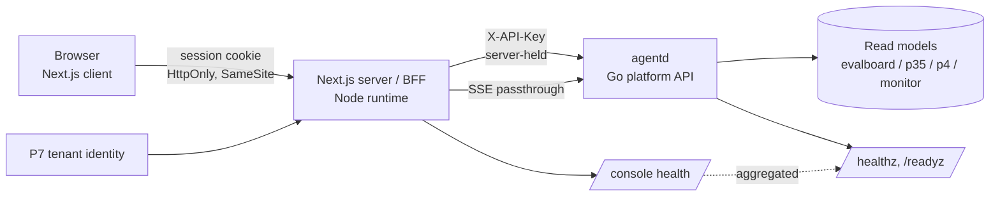

# PRD — P9: Web Console (the customer-facing dashboard)

| Field | Value |
|---|---|
| Phase / Milestone | P9 / M12 |
| Target window | ~Weeks 24–44 (two waves: 9a alongside P4.5/P5, then 9b alongside P6/P7b) |
| Lead role(s) | Frontend Dev + Product Designer (co-leads) |
| Supporting role(s) | Backend, System Designer, DevOps, QA Engineer, AI Engineer, Sales Operations |
| Status | Draft |
| OpenSpec change | `p9-web-console` |

> **Surface discipline.** P9 is **delivery surface #3** from [`../../README.md`](../../README.md) —
> the **customer** Web dashboard, scoped to **one tenant at a time**. It is **not** P8, the internal
> operator console, which has its own admin identity, its own RBAC, and crosses tenant boundaries.
> Nothing in P9 may read or write across tenants, and no P9 route is reachable by an admin principal
> acting as an admin. If a capability needs to see two tenants at once, it belongs in P8.

> **Read-model discipline.** P9 adds **no new pipeline and no new statistics**. Composite scores,
> confidence intervals, tie determinations, gate pass/fail, Pareto dominance, coverage percentages,
> and pattern labels are **computed server-side** and already shipped as read models
> ([`internal/evalboard/view.go`](../../internal/evalboard/view.go),
> [`internal/api/p35.go`](../../internal/api/p35.go),
> [`internal/api/p4.go`](../../internal/api/p4.go),
> [`internal/api/monitor.go`](../../internal/api/monitor.go)). The console **renders** them. A number
> the browser computes is a second source of truth for a statistical claim, and statistical honesty
> is a P4 invariant that must not fork.

## 1. Summary

P9 turns the platform's four **demo pages** into a **product**. Today the web surface is five
hand-written HTML files with inline `<style>` and inline `<script>`, four of them embedded into the
Go binary with `go:embed` and served from unlinked, undiscoverable routes (`/p2`, `/p25/monitor`,
`/p35/graph`, `/p4/board`), each requiring the user to hand-type an identifier into a query string.
They were the right call for proving P2–P4 — they have no build step, no dependency tree, and they
demonstrably work — but they cannot become the SaaS dashboard the plan sells: they have **no
navigation**, **no session**, **three forked design languages**, and **accessibility on one page of
five**. Most seriously, they have a **security hole that is structural, not incidental**: the page
routes are public while every `/api/*` call they make requires an `X-API-Key` header
([`internal/auth/middleware.go`](../../internal/auth/middleware.go)), so under
`auth_mode=required` all four pages **load and then fail every request with 401** — and the only way
to make them work today would be to put a platform API key in a browser.

P9 delivers a **Next.js (App Router, TypeScript) console fronted by its own BFF (backend-for-frontend)
Node process**. The BFF holds the platform credential server-side and exchanges a browser **session**
for authorized upstream calls, so **the browser never receives an API key** — the reason this
architecture was chosen over a cheaper static export (§8, D1). On top of that boundary the console
gets what the demo pages never had: **one app shell with real navigation**, **one design system**
reconciling the three forked palettes, **the accessibility level `p4board.html` already proves is
achievable applied to every page**, **plan-tier gating** wired to P7 entitlements, and a
**no-feature-loss guarantee** — every behavior the current pages have (SSE with polling fallback,
record-driven poll termination, row virtualization above 60 rows, keyboard row navigation, the
keyboard-reachable Pareto tooltip, back-edge routing in the graph, and every distinct empty-state
sentence) is enumerated and carried forward. Milestone **M12 — customer console live** means a Team+
tenant can sign in and drive discovery → configure → run → compare → diagnose from a browser, with
no API key in it and nothing on the screen that the server did not compute.

Two things sit on top of that floor, because a floor is not a product. The first is a **craft layer**
(G17, FR27–FR31): the console has to be the surface a customer *chooses* to open, and the properties
that make it so — one subject per view present in the first paint, structure that does not reflow when
data lands, depth and motion as hierarchy, a console that anticipates the next move — are specified
and gated rather than left to taste. The rule that keeps that safe is **delight on the read path,
honesty on the evidence path**: no visual emphasis may make a provisional, tied, disqualified,
uncalibrated, unverified or gated value look more certain than the server said it was. The second is a
**public home page** (G18, FR32–FR35) — the surface a prospect meets before there is a session at
all. It renders with no session, no tenant data and no upstream call, and every capability it claims
resolves through a checked-in **capability manifest** whose unshipped entries fail the build, so the
page that sells the product cannot promise something the product does not do.

## 2. Problem & context

The platform can already discover a call graph, apply a variant as a reviewable diff, run it
sandboxed and traced, evaluate it multi-seed with confidence intervals, and rank it on a leaderboard.
Every one of those capabilities ships a **read model designed to be rendered** — and then renders it
in a page a customer cannot find, cannot authenticate to, and cannot navigate away from. Six problems
block the console from being a product, and each maps to a design commitment:

- **🔴 A browser cannot authenticate, so the UI is either public or broken.** `IsPublicPath`
  exempts `/health`, `/metrics`, `/`, and `/static/`; the four page routes are not under `/api/` so
  they are served to anyone, while every fetch those pages make **is** under `/api/` and demands
  `X-API-Key`. There is no session, no cookie, no login, and no token-exchange anywhere in the repo.
  The two available shortcuts are both unacceptable: turn auth off (the read models expose a tenant's
  prompts, diffs, costs, and provider spend) or ship an API key to the browser (a long-lived platform
  credential in `localStorage`, exfiltrable by any XSS, with no per-user revocation). The **only**
  correct answer is a server-side credential and a browser session — which requires a server the
  browser talks to. That is the BFF, and it is the single most consequential decision in this phase.
- **The pages are unlinked, undiscoverable, and demand hand-typed identifiers.** There is no index,
  no navigation, and no link between `/p2`, `/p25/monitor`, `/p35/graph` and `/p4/board`. Each entry
  point is a bare query parameter the user must already know — `?run=`/`?cfg=`/`?rev=` on P2,
  `?run_id=` on the monitor, `?workflow_id=` on the graph, `?workflow=` on the board. `p4board.html`
  makes this worse by **defaulting to the hardcoded string `'wf-demo'`**, so an operator who opens it
  without a parameter is shown a *confidently rendered board for a workflow that is not theirs*. This
  is a direct violation of 🔴 `interaction-simplicity-first`: identifiers the system already knows
  must not be re-typed by the user, and a default that silently substitutes the wrong subject is
  worse than an empty state.
- **The design language has already forked three ways, and it will fork again.** `p2.html`,
  `p25monitor.html` and `p35graph.html` share one palette; `p4board.html` invented a second
  (`--muted:#8fa3bd` vs `#8b9cb3`, `--line:#243247` vs `#2a3545`, 8px vs 10px card radius, `999px`
  pill chips vs `4px` square ones, **px sizing vs rem**, a five-family font stack vs three, plus an
  entire second status vocabulary in `--good`/`--warning`/`--serious`/`--critical` and a
  `--series-1..4` chart palette); `index.html` predates both. Three forks across four files is not a
  taste problem — it is the absence of a token system, and 🔴 `ui-redesign-feature-and-visual-
  consistency` names improvisation as the cause. Every new page compounds it.
- **Accessibility exists on exactly one page of five.** `p4board.html` is genuinely well built: it
  has `:focus-visible` rings, `role="img"` with descriptive `aria-label` on the CI bars and every
  Pareto mark, keyboard row navigation with Enter/Space toggle and wrap-around arrows, `scope="col"`
  headers, a `role="status"` tooltip that is focus-reachable rather than hover-only, and a `
`
  table fallback for the scatter plot. The other four pages have **none** of it — no focus styling, no
  ARIA, no keyboard path. The floor is not "add a11y later"; the floor already exists in this repo and
  four pages sit below it.
- **The UI silently degrades on data it does not model.** `p2.html` derives CSS classes by string
  interpolation (`state-${status}`), so a status the stylesheet does not know renders **unstyled and
  uncolored** while still looking like a rendered state. `p25monitor.html` interpolates `node_id`
  straight into HTML with no escaping helper on the page at all. And the Go read models already return
  fields **nothing renders**: `gate_set`, `progress.seed_floor`, `Row.variant_id`,
  `ComponentView.raw_ci_low`/`raw_ci_high`/`unit`, `judge.percent_agreement`/`floor`,
  `DimensionView.uncovered[]`, `spend.budget`, `coverage.low_confidence`, and
  `ViewNode.symbol`/`policy`/`tools`. Unread fields are not free: they are either information the
  customer needs and is not getting, or contract surface no one is maintaining.
- **There is a Chinese-only dead page in the tree, and a live product need behind it.**
  `internal/api/static/index.html` is an approval queue — `lang="zh-CN"`, Chinese UI strings
  throughout — with **no Go handler serving it** and **three endpoints that do not exist**
  (`/api/proposals/pending`, `.../approve`, `.../reject`). It violates 🔴 `code-and-ui-language` and is
  pre-pivot legacy. But its *shape* — a queue of proposals, each with a rationale and a diff, each
  approved or rejected by a human — is **exactly** the human-in-the-loop surface **P5.5** needs. It is
  therefore **forward-ported, not deleted**: P9 specifies the review surface, P5.5 owns the API, and
  the surface does not ship before the API exists.

**Upstream state assumed.** **P2** (the Variant Spec submit/resolve path, the transform + diff read
model, the run record with per-node I/O). **P2.5** (the live run monitor snapshot and its SSE stream).
**P3.5** (the classified workflow graph read model, including regions, labels, confidences and
diagnostics). **P4** (the eval board — leaderboard, Pareto frontier, coverage, spend). **P4.5** and
**P5.5** (attribution/diagnosis views and the proposal-review surface, wave 9b). **P7** (tenant
identity, plans-as-config, and the entitlement gate the console reads to decide what a tenant sees).
P9 adds the **session + credential boundary**, the **app shell**, the **design system**, and the
**rendering layer** — and nothing else.

## 3. Goals & non-goals

### Goals

- **G1. The browser never holds a platform credential.** The console SHALL authenticate the user with
  a **session** issued by the BFF; the **platform API key SHALL be held server-side only** and SHALL
  never appear in the client bundle, in a cookie readable by script, in `localStorage`, in a URL, or
  in any log or telemetry field.
- **G2. Console routes are not public.** Every console route that renders tenant data SHALL require an
  authenticated session, and SHALL fail **closed** — an unauthenticated request SHALL be redirected to
  sign-in and SHALL NOT render a shell that then 401s on every fetch. The current "public page, gated
  API" split SHALL NOT survive P9.
- **G3. The BFF is a boundary, not a brain.** The BFF SHALL forward requests to the platform API and
  return the platform's read models **unmodified**. It SHALL NOT compute, re-rank, re-aggregate, merge
  or reinterpret any read model, and SHALL NOT hold business rules about what a value means.
- **G4. Failure modes stay distinguishable end to end.** The three failure classes the current pages
  already distinguish — **503 subsystem-not-mounted**, **404 not-found**, and **transport failure** —
  SHALL remain distinguishable after passing through the BFF, and SHALL each render distinct copy. A
  404 SHALL NOT be mapped to a business state, and a transport failure SHALL NOT be rendered as an
  empty result.
- **G5. No feature is lost in the port.** Every user-visible behavior enumerated in the P9
  feature inventory SHALL be present in the Next.js console. Where a behavior is deliberately dropped,
  it SHALL be named in the inventory with the reason — a behavior SHALL NOT disappear by omission.
- **G6. The console is navigable and never asks for an identifier the system knows.** The console
  SHALL present a single shell with navigation across every surface, and SHALL let the user **select** a
  workflow, run, variant or transform from platform data rather than typing its identifier. No route
  SHALL substitute a hardcoded default subject when none is supplied.
- **G7. Deep links survive.** Every entry point the current pages support SHALL resolve to a stable,
  shareable canonical console route, and a link that identifies a specific run, transform, workflow or
  board SHALL open exactly that subject.
- **G8. One design system, no page-local palettes.** All visual values SHALL come from a single token
  set derived from the existing dark palette; a page SHALL NOT define its own colors, radii, font
  stacks or sizing units. The three current forks SHALL be reconciled with a stated winner per token.
- **G9. Every state carries a distinct color and a distinct word, and unknown values degrade
  visibly.** A status SHALL never be conveyed by color alone, two different conditions SHALL NOT
  collapse into one rendering, and a status value the console does not model SHALL render with a
  defined fallback **plus the raw value** — never silently unstyled.
- **G10. The `p4board` accessibility level is the floor for every page.** Every interactive element
  SHALL be keyboard-reachable with a visible focus indicator; every graphical data representation SHALL
  carry a text alternative; every data table SHALL have scoped headers; and every chart SHALL have an
  accessible tabular fallback.
- **G11. UI strings are English and locale-formatting is pinned.** All UI strings SHALL be English,
  and all date/time/number formatting SHALL be pinned to `en-US` through **one** swap-point function —
  never `navigator.language`. The Chinese-only legacy page SHALL NOT be carried forward as-is.
- **G12. The console never derives a statistic.** Scores, confidence intervals, tie determinations,
  ranks, gate outcomes, Pareto dominance, coverage percentages and pattern confidences SHALL be
  rendered from server-computed values. The console SHALL NOT compute, recompute, round-then-compare,
  or re-sort by any of them in a way that could disagree with the server.
- **G13. Entitlement gating is legible, not silent.** A capability a tenant's plan or automation level
  does not include SHALL be **shown as gated with the unlocking plan named**, not hidden and not
  rendered as an error. The console SHALL read the same P7 entitlement facts the platform enforces —
  the screen and the gate SHALL NOT disagree.
- **G14. Readiness tells the truth once there are two processes.** The platform's readiness signal
  SHALL account for the BFF: a healthy Go service with an unreachable BFF SHALL NOT report the console
  as ready. Health SHALL be exposed on a readable endpoint, and the console's own UI SHALL NOT be used
  as a health judgement.
- **G15. The proposal-review surface is specified, and does not ship before its API.** P9 SHALL
  specify the human-in-the-loop proposal review surface (queue → rationale → diff → approve/reject) as
  the English-language successor to the orphaned legacy page, and it SHALL NOT be shipped until the
  **P5.5** proposal API exists. A surface with no backing endpoint SHALL NOT be merged.
- **G16. Acceptance requires a rendered browser, not a successful build.** A P9 change SHALL be
  accepted only on evidence from a **real browser rendering** the page against a real API response.
  `next build` succeeding, type-checking passing, and unit tests passing SHALL NOT constitute
  acceptance for any user-visible behavior.
- **G17. The console SHALL be the surface a customer chooses to open — and the craft SHALL NOT
  overstate the evidence.** A specification made only of lower bounds produces exactly what it asks
  for: a compliant screen nobody opens. So the properties that make the console *preferred* — one
  clear subject per view, the subject present in the first paint, depth and motion that carry
  hierarchy rather than decoration, and a console that **anticipates the next move** (resume where
  you left off, cross-surface continuity, a keyboard command path, live values that arrive without a
  reload) — are specified with the same seriousness as the gates. The rule that keeps that safe is
  **delight on the read path, honesty on the evidence path**: no elevation, gradient, accent,
  animation or emphasis may make a **provisional, tied, disqualified, low-confidence, uncalibrated,
  unverified or gated** value look more certain than the server said it was. On this product that is a
  correctness property, not a taste one — P4's statistical honesty is the thing being rendered.
- **G18. There SHALL be a public home page that sells the product without a session and without a
  claim the platform cannot meet.** The console's public entry SHALL render with **no session, no
  tenant data, and no upstream platform call**, so an anonymous visitor never touches the credential
  boundary. Its capability claims SHALL be **derived from a checked-in capability manifest that names
  each capability's owning phase and shipped state**, so the page cannot promise a capability that has
  not shipped; and it SHALL name plans **by name only**, never a price value. It SHALL meet the same
  accessibility floor, the same token discipline and the same `en-US` string rules as every other
  page.

### Non-goals (explicitly deferred or owned elsewhere)

- **Not the operator console.** Cross-tenant views, admin RBAC, impersonation, tenant suspension,
  billing operations, and the fleet kill switch are **P8** and are unreachable from P9 by construction.
- **Not a replacement for the CLI or the Git App.** The CLI remains the primary developer entry point
  and the only surface that runs discovery/codemod/eval in the customer's own build environment with
  the customer's own provider keys; the Git App remains the delivery surface for optimization PRs. The
  console **observes and governs**; it does not become the place work is executed.
- **Not server-side rendering of platform data.** Data views are fetched through the BFF at request
  time, not pre-rendered in the Next.js server from platform state — the read models are already
  computed and cached upstream, and a second rendering path would be a second cache to invalidate.
- **Not a new statistics or aggregation layer.** See G3/G12. Any number the console needs that the
  server does not yet return is a **read-model change request** to the owning phase, not a client-side
  computation.
- **Not a redesign of the read models.** P9 may request that an unread field be surfaced or dropped
  (see the inventory), but it does not restructure P2/P3.5/P4/P2.5 view types.
- **Not i18n.** English-only per 🔴 `code-and-ui-language`; the pinned-locale swap point is the seam a
  future i18n phase would use, and is the whole of P9's i18n work.
- **Not authentication itself.** P9 consumes the **P7** tenant identity model. It specifies the
  *session boundary* and *credential custody*; it does not define the tenant identity provider.
- **Deleting the legacy pages is deferred to the cutover, not the port.** The `go:embed` pages keep
  working until the console reaches parity per the inventory; removal is a separate, explicit step.

## 4. Users & personas

| Persona | Who they are | What the console is for them |
|---|---|---|
| **Platform engineer / tech lead** (primary) | Owns the LLM workflow whose repo is under management. Lives in the CLI and in PRs. | The place to *see* what the CLI produced: the discovered graph, what a variant changed, whether it actually won, and why a proposal is or is not trustworthy. Comes to the console to **decide**, not to execute. |
| **AI / ML engineer** (primary) | Tunes prompts, models, context strategies; reads the eval board for a living. | Leaderboard with CIs and tie semantics, component score breakdowns, judge-calibration flags, coverage and residual obligations, Pareto trade-offs. Needs the statistics presented **exactly** as computed — a rounded or re-sorted number is a wrong answer. |
| **Engineering manager / budget owner** | Approves spend and automation level; not in the code daily. | Spend by kind against budget, cost-vs-quality trade-off, automation-level governance, and which plan unlocks what. Reads trend and governance, not diffs. |
| **Reviewer of a proposal** (wave 9b) | Whoever is on the hook for merging an optimization. | The queue → rationale → verified delta → diff → approve/reject path. The successor to the orphaned legacy page, in English, against the P5.5 API. |
| **Free-tier / evaluating user** | Has the CLI, no console entitlement. | Sees the console exists, sees which plan unlocks it, and is never shown a broken or empty version of a gated view (G13). |

Non-personas: **platform operators** (that is P8), and **end users of the customer's own LLM product**
(they never touch this surface).

## 5. User stories / jobs-to-be-done

**Platform engineer**
- As a platform engineer, I want to open the console and **find** my workflow without knowing its id,
  so that I do not have to paste identifiers out of CLI output into a query string.
- As a platform engineer, I want to move from a workflow's graph to a run, to the diff that produced
  it, to the board that scored it, **without editing the URL**, so that investigation is a path rather
  than four bookmarks.
- As a platform engineer, I want a link I paste in a PR to open **exactly** the run or transform I was
  looking at, so that review conversations point at evidence.
- As a platform engineer, I want to sign in **once** and never handle an API key, so that revoking my
  access does not mean rotating a platform credential.

**AI / ML engineer**
- As an AI engineer, I want the leaderboard to show score **± CI**, the tie rule, gate outcomes and
  the component breakdown as the server computed them, so that I never argue with a number the UI
  invented.
- As an AI engineer, I want a judge that is uncalibrated or below its agreement floor to be **visibly
  flagged wherever its metric appears**, so that I do not treat an unverified opinion as evidence.
- As an AI engineer, I want coverage, residual obligations and the "this eval set is weak" signal
  surfaced, so that a high score on a weak set reads as low confidence rather than success.
- As an AI engineer, I want a run I am watching to stream, and to **keep working if streaming is
  unavailable**, so that a proxy that breaks SSE does not cost me the live view.

**Engineering manager / budget owner**
- As a budget owner, I want spend by kind against budget and the reason measurement stopped, so that
  "we stopped rather than overspending" is visible rather than looking like a failure.
- As a budget owner, I want automation-level governance in the console with the plan that unlocks each
  level named, so that I can see what I am buying before I buy it.

**Reviewer (9b)**
- As a reviewer, I want each proposal's rationale, **verified** delta and full diff on one screen with
  approve/reject, so that I never approve a change whose evidence I have not seen.

**Free-tier user**
- As an evaluating user, I want a gated capability to tell me the plan that unlocks it, so that I can
  tell "not included" apart from "broken".

## 6. Functional requirements

Numbered FRs; each maps 1:1 to an OpenSpec requirement in `openspec/changes/p9-web-console/specs/`.

### Credential custody & session (capability `console-bff`)

- **FR1.** The console SHALL authenticate the browser with a **session** issued by the BFF. The
  platform API key SHALL be held **server-side only** and SHALL never be present in the client bundle,
  a script-readable cookie, `localStorage`, a URL, a log line, or a telemetry attribute.
- **FR2.** Every console route rendering tenant data SHALL require a valid session and SHALL **fail
  closed** — an unauthenticated request is redirected to sign-in, never served a shell that 401s.
- **FR3.** Sessions SHALL have a bounded lifetime and SHALL be revocable; a request on an expired or
  revoked session SHALL be denied at the next request and SHALL NOT be silently retried with the
  server-side key.
- **FR4.** The browser SHALL reach platform data **only** through the BFF origin. The console SHALL NOT
  issue a direct browser-to-platform-API request for tenant data.
- **FR5.** The BFF SHALL pass platform read models through **unmodified**, and SHALL NOT compute,
  re-rank, re-aggregate, merge, or reinterpret them (G3).
- **FR6.** The BFF SHALL preserve the upstream failure taxonomy: **503 not-mounted**, **404
  not-found**, and **transport failure** SHALL remain three distinguishable outcomes at the browser,
  each carrying the upstream error body where one exists.
- **FR7.** The BFF SHALL proxy the run-monitor **SSE** stream with flush semantics preserved, SHALL
  close the client stream when the upstream closes, and SHALL NOT buffer events into batches.
- **FR8.** Every BFF upstream call SHALL carry an explicit timeout. A hung upstream SHALL surface as a
  transport failure with actionable copy, never as an unbounded loading state.

### Shell, navigation & routing (capability `web-console`)

- **FR9.** The console SHALL present **one app shell** with navigation covering every surface
  (graph, configure/diff, live run, eval board, and — in 9b — diagnosis and proposal review).
- **FR10.** The console SHALL let the user **select** a workflow, run, variant, board or transform
  from platform-provided data. It SHALL NOT require a hand-typed identifier for a subject the platform
  can enumerate, and SHALL NOT substitute a hardcoded default subject when none is given (the
  `'wf-demo'` behavior in `p4board.html` is removed, not ported).
- **FR11.** Every current entry point SHALL map to a stable canonical route:
  `?run=` / `?cfg=`+`?rev=` (P2), `?run_id=` (monitor), `?workflow_id=` (graph) and `?workflow=`
  (board). A canonical route SHALL be shareable and SHALL open exactly its subject.
- **FR12.** The console SHALL preserve every behavior enumerated in the feature inventory, including
  **SSE-first with polling fallback**, **record-driven poll termination** (a run's poll stops on the
  run record's status, never on a node-derived condition), **row virtualization above the row
  threshold**, **keyboard row navigation with wrap-around**, **expandable per-row score breakdowns**,
  the **focus-reachable Pareto tooltip**, the **accessible table fallback for every chart**, and the
  graph's **back-edge routing, region rectangles and control-edge styling**.
- **FR13.** A run view SHALL stop polling when the **run record's** status is terminal, and SHALL NOT
  infer termination from the node list.
- **FR14.** The console SHALL render statistics as received (G12) and SHALL NOT recompute, re-round
  before comparison, or client-sort by a server-ranked field.
- **FR15.** A capability not included by the tenant's plan or automation level SHALL render as
  **gated, naming the unlocking plan**; it SHALL NOT be hidden without explanation and SHALL NOT
  render as an error state.
- **FR16.** The proposal-review surface (queue → rationale → verified delta → diff → approve/reject,
  English) SHALL be specified in P9 and SHALL NOT ship before the **P5.5** proposal API exists.
- **FR17.** Every read-model field the platform returns SHALL be either **rendered** or **listed as
  deliberately unrendered with a reason** in the inventory. A field SHALL NOT be left silently unread.

### Design system, states & accessibility (capability `console-design-system`)

- **FR18.** All visual values (color, radius, spacing, type scale, font stack, sizing unit) SHALL come
  from a **single token set**; no route or component SHALL define a page-local palette. The three
  current forks SHALL be reconciled with a recorded winner per token.
- **FR19.** Every status SHALL be conveyed by **a distinct color and a distinct word**; color alone
  SHALL NOT carry meaning. Two conditions with different user remedies SHALL NOT collapse into one
  rendering.
- **FR20.** A status value the console does not model SHALL render with a **defined fallback style and
  the raw value shown**; it SHALL NOT render unstyled (the `state-${status}` interpolation hazard).
- **FR21.** **Loading**, **empty**, and **error** SHALL be three distinct renderings on every view, and
  the distinct copy the current pages use for each error class SHALL be preserved.
- **FR22.** Every interactive element SHALL be keyboard-reachable with a visible focus indicator; every
  graphical data representation SHALL carry a text alternative; every data table SHALL use scoped
  column headers; every chart SHALL have a tabular fallback.
- **FR23.** All UI strings SHALL be English, and all `Intl`-based date/time/number formatting SHALL be
  pinned to `en-US` through a **single** swap-point function.
- **FR24.** All values interpolated into the DOM SHALL be escaped by default (the raw `node_id`
  interpolation in `p25monitor.html` SHALL NOT be reproduced).

### The craft layer (capability `console-design-system`)

These are the requirements that turn the floor into a surface a customer *prefers*. Each is written so
it can go red; a rule about beauty that cannot fail a check is a preference, not a requirement.

- **FR27.** Every view SHALL have **exactly one subject**, carried by exactly one display-level
  heading, and that subject SHALL be present in the **first paint** — before its data resolves. A
  view SHALL NOT open as an undifferentiated spinner, and SHALL NOT reflow its structure when data
  arrives (skeletons occupy the shape the content will take).
- **FR28.** Depth, motion and emphasis SHALL be **hierarchy signals drawn from the token set** and
  SHALL NOT be decoration. Every duration SHALL come from the motion budget, no transition SHALL sit
  on the action path, and `prefers-reduced-motion` SHALL lose **no information** — every state a
  transition would have communicated SHALL also be communicated statically.
- **FR29. 🔴 The confidence treatment SHALL be reserved for confident values.** A value the server
  marked **provisional, tied, disqualified, low-confidence, uncalibrated, unverified, withheld,
  candidate or gated** SHALL NOT be rendered with the emphasis reserved for a settled result —
  no accent color, no elevation above its peers, no entrance animation, no display-weight type. This
  is the P9 analogue of the hazard-palette reservation: emphasis is legible because it is *earned*,
  and a UI that makes a tie look like a win has invented a ranking the server refused to make.
- **FR30.** The console SHALL **anticipate the next move**: it SHALL offer the subjects this session
  has already visited before asking for an identifier, SHALL provide a keyboard command path to every
  subject and surface, and SHALL carry the current subject across surfaces so moving from graph to
  run to diff to board never re-asks who the subject is.
- **FR31.** Numbers SHALL be rendered for comparison — tabular figures, digit-aligned numeric
  columns, unit and scale stated once, one precision per view — and a figure SHALL always be rendered
  next to the qualifier the server attached to it (interval, seed count, coverage, calibration),
  never alone.

#### Visual hierarchy, theme and payload (R16–R20 — see [`trend-ledger.md`](../../web/design-system/trend-ledger.md))

FR27–FR31 above specify that the craft layer is *expressed as tokens* and that emphasis is *reserved*.
They do not say which element on a view should be largest, and the shipped console answers that
wrongly: measured values render at the smallest type size on the page while the section frames that
introduce them render larger. The four requirements below close that gap. They are derived from the
2026 trend review, whose adopt/adapt/reject verdicts and reasoning are recorded in the ledger —
including 🔴 the two trends (**AI-agent task execution**, **progressive pre-filled forms**) rejected
because they would directly overturn this platform's audit-then-effect discipline.

- **FR36. 🔴 The measured value SHALL outrank its frame.** In every **summary block** — a block whose
  purpose is to present a small fixed set of headline quantities — the quantity SHALL be the visually
  dominant element; its label, unit and provenance SHALL be subordinate to it, and no section heading,
  card border or chrome SHALL carry more visual weight than the values that block exists to present.
  A quantity SHALL state its **unit and scale once**, carry tabular figures, and — 🔴 without
  exception — SHALL remain governed by FR29: emphasis applied to a qualified value is a defect, and it
  is a *larger* defect at display scale than at body scale, because size reads as certainty.

  *Scope, stated because the obvious reading is wrong.* This does **not** apply to a **table**. A table
  is a comparison surface: its power is that many values are legible in one visual plane at one size,
  and setting its cells at display scale would destroy the comparison the table exists to enable.
  Tables remain governed by FR31 — tabular figures, digit-aligned columns, unit stated once in the
  header. The distinction is between *the two numbers a reader came for* and *the forty numbers they
  came to compare*, and a rule that could not tell them apart would be unimplementable and therefore
  quietly ignored.
- **FR37. Theme SHALL be chosen, not assumed.** The console SHALL offer an explicit theme control
  (follow system / dark / light), persist the choice, and resolve it **server-side** so the first
  paint is already correct and no theme flash or post-hydration reflow occurs. Every token pair SHALL
  meet WCAG 2.1 AA in **both** resolved themes, and no information SHALL be carried by a hue that
  exists in only one of them.
- **FR38. The shipped client payload SHALL have a stated ceiling**, enforced at build time. Exceeding
  it SHALL fail the build and name the budget and the overage. A page SHALL request **no third-party
  origin** (already FR35) and SHALL NOT ship a rendering runtime — 3D, WebGL, animation library — for
  decoration.
- **FR39. Acceleration SHALL NOT become the only path, and the console SHALL NOT act on the user's
  behalf.** Every capability reachable from the command path SHALL also be reachable by navigation
  (FR9), and no surface SHALL pre-fill, infer, or auto-submit an input that carries a user's intent.

### The public surface (capability `console-marketing-site`)

- **FR32.** The console SHALL serve a **public home page** that requires no session, reads no tenant
  data, and makes **no upstream platform call**. It SHALL NOT be reachable into any tenant-data route
  without authentication, and it SHALL NOT cause the BFF to use the server-held credential.
- **FR33.** Every capability claim on the public surface SHALL be **derived from a checked-in
  capability manifest** that records each claim's owning phase and its shipped state. A claim whose
  backing capability has not shipped SHALL fail the build rather than reaching the page — what is
  sold SHALL match what the screen does.
- **FR34.** The public surface SHALL name plans **by name** (Free / Team / Business / Enterprise) and
  SHALL NOT contain a price value, a percentage, or any other business number in git. It SHALL state
  the boundary of what the product does as plainly as it states the benefit.
- **FR35.** The public surface SHALL meet the same floor as every other page: single token set,
  English strings with pinned `en-US` formatting, keyboard reachability with visible focus, WCAG 2.1
  AA contrast, text alternatives on graphical content, and **no third-party origin** — no external
  font, script, tracker, or image host, so the page satisfies the console's own
  `default-src 'self'` policy.

### Operability

- **FR25.** The platform readiness signal SHALL account for the BFF: a healthy platform service with an
  unreachable BFF SHALL NOT report the console as ready, and the degraded component SHALL be named on a
  readable endpoint.
- **FR26.** The BFF SHALL emit structured logs and traces correlated with the platform's `trace_id`,
  and SHALL NOT log request bodies containing prompts, diffs, or credentials.

## 7. Non-functional requirements

| # | Requirement | Target |
|---|---|---|
| **NFR1** | **Credential blast radius** | Zero platform API keys in any client artifact. A grep of the built client bundle for the key material SHALL return nothing; this is a build-time gate, not a review habit. |
| **NFR2** | **Session compromise window** | Session TTL bounded and revocation effective at the **next** request — no grace period. |
| **NFR3** | **First contentful paint** | Console shell interactive well within a normal SaaS budget on a cold cache over a typical broadband connection; the shell SHALL render before data resolves (skeleton, not blank). |
| **NFR4** | **Live-run latency** | A node state change SHALL reach the screen within one SSE tick of the platform emitting it; the polling fallback SHALL not exceed the interval the current monitor uses. |
| **NFR5** | **Large-board rendering** | A leaderboard of thousands of variants SHALL remain interactive; virtualization SHALL engage above the row threshold and scrolling SHALL not drop frames on a mid-range laptop. |
| **NFR6** | **Reproducibility** | The same canonical route with the same upstream data SHALL render identically; nothing in the view SHALL depend on wall-clock, locale, or client capability except explicitly-designed fallbacks. |
| **NFR7** | **Accessibility** | WCAG 2.1 AA for contrast, focus visibility, keyboard operability and text alternatives, on **every** page — verified by automated audit **and** a keyboard-only pass. |
| **NFR8** | **Availability & degradation** | BFF unavailability SHALL be reported as such (FR6/FR25), not rendered as empty data. A platform subsystem that is not mounted SHALL degrade that view only, not the shell. |
| **NFR9** | **Deploy footprint** | The added Node runtime SHALL ship as one declared, supervised, health-checked component with a pinned runtime version and a lockfile-reproducible dependency tree. |
| **NFR10** | **Supply chain** | Dependencies SHALL be lockfile-pinned and scanned; a dependency SHALL NOT be added for a capability the design system already covers. |
| **NFR11** | **Privacy in telemetry** | No prompt text, diff content, or credential SHALL appear in BFF logs, traces, or client-side analytics. |
| **NFR12** | **Tenant isolation** | Every BFF request SHALL be scoped to the session's tenant server-side; a tenant identifier from the client SHALL NOT widen scope. |
| **NFR13** | **Public-surface cost** | The public home page SHALL render without a session, without a platform call and without a third-party origin, so an anonymous visitor costs the platform nothing and can be served while the platform API is down. |
| **NFR14** | **Claim integrity** | Zero unshipped capability claims on the public surface, and zero price values anywhere in the repository — both build-time gates over the rendered page and the shipped bundle, not review habits. |
| **NFR15** | **Craft conformance** | Zero decorative motion, zero off-budget durations, zero confidence-treatment applications to a qualified value — machine-checked, because "it looked fine" is how a tie ends up styled as a win. |
| **NFR16** | **Perceived responsiveness** | Every view's subject and structure SHALL be on screen before its data resolves, and the arrival of data SHALL NOT change the page's structure — measured as no layout shift between the skeleton and the populated state. |
| **NFR17** | **Viewport-first — the shell never page-scrolls** | On desktop, the console shell (header + rail + main) SHALL occupy exactly the viewport height and SHALL NOT produce a page-level vertical scrollbar. A view's **primary content and primary actions SHALL be visible without scrolling**; content that exceeds the region (tables, lists, the studio matrix, a long output) SHALL scroll inside its OWN bounded panel, so exactly one region owns the scroll and the header, rail and page actions never move. Measured at a standard desktop viewport: `documentElement.scrollHeight ≤ innerHeight` for `/app/*`. Rationale: the studio measured **~2600px of page overflow** (4× a 800px laptop) — a document-flow layout where reaching the primary surface meant scrolling past everything above it. A dashboard is not a document. |

## 8. System design summary

### 8.1 Topology

The credential lives in exactly one place — the BFF process environment — and crosses exactly one
boundary, BFF → platform. The browser holds only an `HttpOnly`, `SameSite` session cookie it cannot
read. This is the entire justification for the Node process (D1 below).

### 8.2 The decisions, with what was rejected

| # | Decision | Rejected alternative | Why (八级法则 arbitration) |
|---|---|---|---|
| **D1** | **Next.js App Router + TypeScript, running as a Node BFF** | **Static export + `go:embed`** — keeps `agentd` a single binary with no Node runtime, no new deploy unit, and no new process to supervise. Genuinely cheaper on **L4 运维**. | The static export cannot hold a credential, so the browser-auth gap (**L1 安全**) would have to be closed inside the Go service anyway, or not at all. **L1 outranks L4 and the劣化 of a higher level cannot be bought with the convenience of a lower one.** The 运维 cost is accepted, priced, and paid down explicitly: one supervised component (NFR9), aggregated readiness (FR25/G14), pinned runtime, lockfile-reproducible deps. |
| **D2** | **One token set derived from the existing dark palette** (`#0f1419` surface, `#1a2332` card, `#e7ecf3` text, `#3d8bfd` accent), with a recorded winner per forked token | Adopt a third-party design system wholesale, or let each route keep its palette | 🔴 no improvised styling. The customer already sees this product; re-skinning it is a change nobody asked for and it would obscure whether a port lost a feature. The forks are reconciled, not replaced. |
| **D3** | **Read models stay in Go; the browser derives nothing** | Fetch raw results and compute scores/CI/ranks client-side for interactivity | **L5 不可演进**: a second implementation of the tie rule is a second source of truth for a statistical claim, and P4's honesty guarantees would fork the moment they disagreed. Interactivity that needs a different cut is a read-model request to the owning phase. |
| **D4** | **SSE proxied through the BFF, polling fallback preserved** | SSE only (simpler), or polling only (no streaming infrastructure) | **L2 稳定**: the current monitor already survives a proxy that breaks SSE by falling back to polling, and that resilience is a shipped behavior. Dropping either path is feature loss (G5). |
| **D5** | **TypeScript types generated from the Go view structs, with a drift gate in CI** | Hand-written types kept in sync by review | **L5/L6**: hand-written types rot silently and the failure mode is a blank cell, not a compile error. A generated artifact is checked in and a regeneration diff fails the build. |
| **D6** | **One declared, supervised, health-checked console component; readiness aggregates it** | Deploy the console independently and let readiness keep reporting only the Go service | 🔴 `health-signal-surface`: a readiness endpoint that reports "ready" while the surface users reach is dead is a lying health signal. The moment a second process exists, readiness must cover it. |
| **D7** | **Keep the hand-rolled SVG graph renderer** | Adopt a graph library for the P3.5 view | 🔴 no feature loss. The current renderer implements deliberate behaviors — back edges routed **under** the row so a Reflection loop is visible, region rectangles computed from member bounding boxes, data-vs-control edges distinguished by dash **and** arrow marker, node-scoped labels. A library would have to re-earn each of those, and the layout is already deterministic. Revisit only when an interaction (pan/zoom/select) that the hand-rolled renderer cannot serve is actually specified. |
| **D8** | **The craft layer is expressed as tokens and primitives inside the single token set**, with the confidence treatment reserved for confident values (FR27–FR31) | Let "make it beautiful" be a per-page styling pass, or adopt a fashionable component kit for visual lift | 🔴 `ui-redesign-feature-and-visual-consistency` forbids improvised styling, and improvisation is exactly what a beauty brief invites. Expressing craft as tokens keeps it **auditable** — and the reservation rule (FR29) makes it a **correctness** property: on a product whose entire value is statistical honesty, a visual system that can make a tie look like a win is a defect, not a style. **L1/L2 over L8**: the extra work of specifying the craft is the cheapest item on the scale. |
| **D9** | **The public home page ships inside the console application as a public, statically-rendered route with a machine-checked capability manifest** | A separate marketing site (different repo, different stack, marketing CMS), or a hand-written landing page with hand-written claims | Two surfaces means two design systems and two truths about what the product does; the second one drifts, and the drift is *sold*. Keeping it in the console makes the token set, the a11y floor and the string rules apply for free, and makes 🔴 "only promise delivered capability" a **build gate** (FR33) instead of a review. It costs one public route in an application that already exists — **L8**, the cheapest level — to buy claim integrity, which is a customer-trust property. |

### 8.3 What P9 does not build

No new endpoints on the platform API, no new tables, no new queue, no new statistics. The console's
data contract is the set of read models P2/P2.5/P3.5/P4 already return. Where FR17 finds a field that
should be surfaced and cannot be, the change is filed against the owning phase — P9 does not grow a
compensating client-side computation.

## 9. Design by role lens

**Frontend Dev (co-lead) — *match what exists, lose nothing, verify in a browser.***
The port's first artifact is not a component — it is the **feature inventory**, a line-per-behavior
enumeration of all five current pages, written before any code, because a reference design is a
demonstration of visual style and never a complete functional spec (🔴 `ui-redesign-feature-and-visual-
consistency`). Everything downstream checks against it: SSE-then-polling, record-driven termination,
virtualization above the row threshold, keyboard row navigation with wrap-around, expandable
breakdowns, the focus-reachable tooltip, the `
` fallback table, back-edge routing, and every
distinct empty-state sentence. Styling follows the three-level anchor: same page → same class of page
→ token set; **no value is invented**, and the three forked palettes are reconciled with a written
winner per token rather than averaged into a fourth. Two live hazards get fixed rather than ported:
class names built by interpolation (`state-${status}`) that render unknown statuses invisibly (FR20),
and unescaped interpolation of server strings into HTML (FR24). Accessibility is not a later pass —
`p4board.html` already proves the level, and the other four pages are brought up to it, not the
reverse. And the acceptance rule is the one this repo's discipline is most emphatic about:
**a passing build is not a rendered page**. Every user-visible change is verified in a real browser at
a fixed viewport, against a real API response, with the error path walked — not just the happy path.

**Product Designer (co-lead) — *reduce what the user must know; make the unhappy path legible.***
The single largest UX defect today is not visual, it is that the product **asks the user for
identifiers it already has**, and in one case invents one (`'wf-demo'`) rather than admitting it has
none — which is worse than an empty state, because it renders confidently about the wrong subject.
🔴 `interaction-simplicity-first` says the inputs to remove are exactly these: the console enumerates
workflows, runs and variants and lets the user pick (FR10). The second defect is discriminability:
statuses must differ in **word and color**, and two conditions with different remedies must never
collapse into one chip — a state that is always true carries zero information. The third is that
**failure copy is product copy**: "this subsystem is not mounted", "no such run", and "cannot reach the
server" are three different things the user does three different things about, and the current pages
already get this right — the rule exists to keep the port from flattening them (FR21, FR6). Gating is
designed as information, not absence: a Team+ capability tells a Free tenant which plan unlocks it
(FR15), because a hidden feature reads as a missing feature. And the scope rule holds throughout —
the legacy approval page is **forward-ported, not deleted**, because removing capability is a one-way
door that belongs to the user, not to the port.

**System Designer (support) — *state the boundary, then keep it thin.***
P9's architectural content is one boundary and one invariant. The boundary: the browser talks only to
the BFF; the BFF talks to the platform with a credential the browser never sees; nothing else crosses
(FR1, FR4). The invariant: **the BFF is a pass-through** (FR5). A BFF that starts merging two upstream
calls, or deciding what a status means, becomes a second place business rules live — and the platform
already learned this lesson in the other direction, where the read models are deliberately computed
server-side precisely so the browser cannot fork them. The decision record (§8.2) states each choice
with the alternative that lost and the level at which it lost, so a future reviewer can tell a
considered trade-off from an accident. The one-way doors are named: the runtime choice (D1) and the
generated type contract (D5) are cheap now and expensive later, which is why they are decided in the
PRD rather than discovered in the implementation.

**Backend Dev (support) — *the session exchange is the whole security surface.***
The credential exchange is small and therefore must be exactly right: a session is issued only against
P7 tenant identity, bound server-side to a tenant, bounded in lifetime, and revocable with effect at
the **next** request (FR2, FR3, NFR2). Scope comes from the session, never from a client-supplied
tenant identifier (NFR12) — the standing lesson that a request must not be trusted to describe its own
authority. The error taxonomy is forwarded, not normalized: collapsing 503-not-mounted into 404, or a
transport failure into an empty body, destroys the distinction the UI needs to tell the user what to do
(FR6) — and a 404 is never mapped to a business state. Every upstream call carries an explicit timeout
so a hung dependency surfaces as a transport failure instead of an unbounded spinner (FR8). Logs and
traces correlate with the platform's `trace_id` and carry no prompt text, diff content, or credential
(FR26, NFR11).

**AI Engineer (support) — *the console must not soften a statistic.***
Everything P4 did to keep comparisons honest — multi-seed runs, confidence intervals, a **tie** when
CIs overlap, disqualifying gates that are not tradeable against weighted preferences, judge agreement
reported alongside every judged metric — is only honest if the surface renders it that way. So: score
is shown **with** its interval, a tie is shown as a tie and not as a rank, a disqualified variant is
listed separately with the failed gate named rather than ranked last, an uncalibrated or below-floor
judge is flagged **wherever its metric appears**, and coverage/residual/weak-reference signals are
surfaced so a high score on a weak eval set reads as low confidence (FR14, G12). The console does not
round before comparing and does not re-sort by a server-ranked field — a UI that quietly reorders a
leaderboard has invented a second ranking. In wave 9b the same rule governs diagnosis and proposals:
**diagnosis proposes, verification decides**, so a proposal is displayed with its verified delta, and
an unverified proposal is never rendered in a way that looks like evidence.

**DevOps Engineer (support) — *a second process must not create a lying health signal.***
Introducing Node is a real operational cost and the mitigations are the deliverable, not a promise.
The console ships as **one declared, supervised, health-checked component** with a pinned runtime and a
lockfile-reproducible dependency tree (NFR9, NFR10). Readiness **aggregates**: a healthy Go service in
front of a dead console must not report ready, and the degraded component is named on a readable
endpoint rather than inferred from a screenshot — 🔴 `health-signal-surface` is explicit that a UI
dashboard is not a health judgement (FR25, G14). Blast radius is bounded by least privilege: the BFF
holds one credential, scoped to what the console reads, and holds no operator authority — the P8
surface is unreachable from here by construction. Secrets come from the environment/secret store,
never from the repo, and never reach a log, a trace attribute, or the client bundle — with NFR1 as a
**build-time gate** on the shipped bundle, because the reliable lesson from this codebase's own
history is that a rule which is only written down gets violated, while a rule that turns a light red
does not.

**QA Engineer (support) — *the build passing is not the test.***
The acceptance gate is behavioral and browser-based. Every user-visible change is exercised in a real
browser at a fixed, reproducible viewport, against real API responses, with the network traffic
inspected so the assertion is that **the screen agrees with the response** — not merely that something
rendered. The four states of every view (loading / empty / error / populated) are each tested, and the
**error path is walked, not just the happy path**, with all three failure classes distinguished
(503-not-mounted, 404-not-found, transport failure). The regression suite is derived directly from the
feature inventory, so "no feature loss" is a checklist a test can fail rather than a claim in a PR
description; the behaviors most likely to be silently dropped in a port — SSE fallback, poll
termination source, virtualization threshold, keyboard wrap-around, the chart's table fallback — get
explicit cases. Accessibility is tested twice: an automated audit for contrast/roles/labels and a
**keyboard-only** pass no automated tool can substitute for. And the security assertions are tests, not
reviews: no credential in the bundle, an unauthenticated route redirects rather than rendering, and a
revoked session is denied at the next request.

**Sales Operations (support) — *what is sold must match what the screen does.***
The console is a **Team+** surface, so entitlement is a product fact that has to be legible on the
screen and consistent with what is sold. Every console capability is mapped to the plan **name** and
automation level that unlocks it — plans are referred to by name (Free / Team / Business / Enterprise),
and prices live in configuration, never in git or in this document. A gated capability shows the
unlocking plan rather than vanishing (FR15), because a hidden feature generates a support ticket and a
named one generates an upgrade conversation. The Free tier's console experience is designed
deliberately rather than falling out of a 403. Demo and trial paths use real read models against
sample data — never a mocked screen that promises behavior the product does not have, since a demo that
overstates is a support and churn cost that lands after the sale, and the same discipline that says a
UI verb must describe real system behavior applies to what the funnel shows.

The **public home page** is where that discipline is most easily lost and most expensive to lose, so
it is built with a machine gate rather than a review habit. Every claim on the page resolves through a
**capability manifest** naming the owning phase and its shipped state (FR33); a claim whose capability
has not shipped fails the build, so the page physically cannot promise a roadmap item as a feature.
Plans appear **by name only** and no price value exists in the repository (FR34) — the same rule P8
already enforces on its bundle, for the same reason: a number in git is a number that ships to a
customer after it stopped being true. And the page states the **boundary** beside the benefit — what
the platform does not do, what still needs a human, what is measured rather than asserted — because
the questions a prospect arrives with are the next round's requirements input, and an honest boundary
produces a qualified lead where an overstated one produces a refund.

**Product Designer (co-lead), second lens — *make it worth opening, without letting it lie.***
The floor — four states, contrast, keyboard, escaping — says what the console must not do. It does not
produce a surface anyone chooses to open, and a console nobody chooses is a console whose users stay
in the CLI, which is the same outcome as not shipping it. So the craft properties are specified with
the same seriousness as the gates (FR27–FR31): one subject per view, present in the **first paint**;
structure that does not reflow when data lands; depth and motion as hierarchy rather than decoration;
and a console that **anticipates the next move** instead of asking for an identifier it could have
remembered. The constraint that makes this safe is the mirror of P8's *friction on the write path*:
here it is **honesty on the evidence path** (FR29). This product exists to stop people believing a
number that has not earned belief — so the visual system is not permitted to launder a qualified value
into a confident one. A tie rendered with the winner's emphasis, a provisional interval animated in
like a settled result, a gated capability styled identically to an available one: each is a
*rendering* that contradicts the *data*, which is precisely the defect class the phase exists to
prevent.

## 10. Dependencies

**Requires**
- **P2** — Variant Spec resolve/submit, transform + diff read model (including `requires_human_review`
  and `build-rejected`), run record with per-node I/O.
- **P2.5** — run monitor snapshot + SSE stream; the telemetry the BFF correlates its traces with.
- **P3.5** — classified graph read model (nodes, edges, regions, labels, confidence, diagnostics).
- **P4** — eval board read model (leaderboard, Pareto, coverage, spend, profiles).
- **P7** — tenant identity, plans-as-config, and the entitlement facts the console reads for FR15.
- **P4.5 / P5.5** — wave 9b only: diagnosis views, and the proposal API behind the review surface
  (FR16 blocks on it).

**Unblocks**
- The **Team+ commercial surface**: the console is what a Team+ subscription visibly buys, so P7's
  self-serve tier has something to show.
- **Governance in the browser**: budget and automation-level controls (P6) get a home a non-CLI
  persona can reach.
- **Deletion of the legacy `go:embed` pages**, once parity against the inventory is demonstrated —
  an explicit cutover step, never a side effect of the port.

## 11. Risks & mitigations

| Risk | Owner | Mitigation |
|---|---|---|
| The port silently drops a behavior nobody notices until a customer does | Frontend + QA | The feature inventory is written **first** and becomes the regression checklist; behaviors most at risk (SSE fallback, poll-termination source, virtualization threshold, keyboard wrap-around, chart table fallback) get named test cases (G5, FR12). |
| The Node runtime becomes an unowned second deploy unit that rots | DevOps | One declared, supervised, health-checked component; pinned runtime; lockfile-reproducible deps; **readiness aggregates it** so a dead console cannot report healthy (NFR9, FR25). |
| The BFF quietly grows business logic and becomes a second brain | System Designer + Backend | FR5 is a spec requirement with scenarios, not a convention; any merging/reinterpreting of read models is a review block, and a needed number is filed against the owning phase instead. |
| A credential leaks into the client bundle | DevOps + QA | NFR1 is a **build-time gate** over the shipped bundle, plus a test asserting no key material in client artifacts — machine-enforced, because a written rule alone has a demonstrated failure rate here. |
| The design system forks a fourth time under delivery pressure | Frontend | Single token set with a recorded winner per forked token; a lint/review gate on color/radius/font literals outside the token file (FR18). |
| Statistics drift between server and screen | AI Engineer | FR14/G12 forbid client-side computation, rounding-before-comparison and client re-sorting of server-ranked fields; the leaderboard test asserts rendered values equal response values byte-for-byte. |
| Accessibility regresses to the current 1-of-5 level | QA + Frontend | NFR7 is a per-page gate: automated audit **plus** a keyboard-only pass; a page below the `p4board` level does not ship. |
| The proposal-review surface ships before its API (repeating the orphaned-page mistake) | Product + Backend | FR16 explicitly blocks the surface on the P5.5 API; a surface with no backing endpoint does not merge. |
| Cutover leaves two UIs live and diverging | Product + Frontend | Removal of the `go:embed` pages is an explicit inventory-gated step with an owner, listed in `tasks.md` — not deferred indefinitely. |
| SSE breaks behind a customer proxy | Backend + DevOps | Polling fallback preserved end to end (D4, FR7) and tested with SSE forcibly disabled. |

## 12. Rollout & test strategy

**Two waves.**
**Wave 9a** — the boundary and the port: session + BFF credential custody, app shell and navigation,
the token set, the generated type contract, and parity ports of the four live surfaces (configure/diff,
live run, classified graph, eval board) against the inventory. Ends when the console is a strict
superset of the current pages, with a session and no key in the browser.
**Wave 9b** — the product layer: entitlement gating wired to P7, diagnosis views (P4.5), the
proposal-review surface once P5.5's API exists, and governance controls.

**Cutover.** The `go:embed` pages remain served and unchanged for all of 9a. Parity is demonstrated
against the inventory, item by item, before a single legacy page is removed; removal is a discrete,
owned step (`tasks.md`), and the pages are removed **together with** their Go handlers so no route is
left serving a stale asset. Nothing about the existing pages changes in the specification pass that
produces this PRD.

**How correctness is proven.**
1. **Contract** — the generated TypeScript types are regenerated in CI and a diff fails the build
   (D5), so a Go read-model change cannot silently reach the browser as `undefined`.
2. **Behavioral parity** — the feature-inventory checklist is executed as a test suite; each named
   behavior is a case that can fail.
3. **Browser-rendered acceptance** — every user-visible behavior verified in a real browser at a
   fixed viewport against real API responses, with network traffic inspected so the assertion is
   *screen agrees with response*. A green build is explicitly not acceptance (G16).
4. **All four view states** — loading, empty, error, populated — tested per view, with the three
   error classes distinguished.
5. **Accessibility** — automated audit plus a keyboard-only pass, per page (NFR7).
6. **Security** — automated assertions that no credential appears in client artifacts, that an
   unauthenticated route redirects instead of rendering, that a revoked session is denied at the next
   request, and that a client-supplied tenant identifier cannot widen scope.
7. **Degradation** — the console is exercised with the platform's subsystems unmounted (503), with a
   missing subject (404), with the platform unreachable (transport), and with SSE forcibly disabled.

## 13. Success metrics & acceptance criteria (M12 exit checklist)

- [ ] **A1.** A tenant signs in and reaches every surface from one shell **without typing an
      identifier or editing a URL** (G6, FR9, FR10).
- [ ] **A2.** No platform API key exists in any client artifact — asserted by a build-time gate over
      the shipped bundle, not by review (G1, NFR1).
- [ ] **A3.** An unauthenticated request to a data route **redirects to sign-in**; it does not render a
      shell that then 401s (G2, FR2).
- [ ] **A4.** A revoked session is denied at the **next** request, with no grace period and no silent
      retry using the server-held key (FR3, NFR2).
- [ ] **A5.** Every item in the feature inventory is either **present** or **listed as deliberately
      dropped with a reason**; the checklist runs as a test suite (G5, FR12).
- [ ] **A6.** The live run view streams over SSE and **continues working with SSE disabled**, and its
      polling stops on the **run record's** status (FR7, FR13).
- [ ] **A7.** All four current entry points resolve to canonical routes; a shared link opens exactly
      its subject (G7, FR11).
- [ ] **A8.** No route substitutes a hardcoded default subject; a missing subject renders a **selection
      or empty state**, never someone else's data (FR10).
- [ ] **A9.** Every visual value resolves to the token set; a repo scan finds no color/radius/font
      literal outside it (G8, FR18).
- [ ] **A10.** An unmodelled status renders with the fallback style **and the raw value visible** —
      demonstrated by feeding the console a status the design system does not know (G9, FR20).
- [ ] **A11.** 503-not-mounted, 404-not-found, and transport failure render **three distinct
      messages** on every view; a 404 is never shown as a business state (G4, FR6, FR21).
- [ ] **A12.** Every page passes the automated accessibility audit **and** a keyboard-only pass; no
      page sits below the level `p4board.html` already demonstrates (G10, NFR7, FR22).
- [ ] **A13.** No Chinese UI string ships, and all `Intl` formatting resolves through the single
      `en-US` swap point (G11, FR23).
- [ ] **A14.** Leaderboard values on screen equal the response values exactly; the console performs no
      score/CI/rank/dominance computation and no client re-sort of a server-ranked field (G12, FR14).
- [ ] **A15.** A gated capability shows the **unlocking plan name**; it is neither hidden nor rendered
      as an error (G13, FR15).
- [ ] **A16.** Readiness reports **not ready** when the console component is unreachable, and names the
      degraded component on a readable endpoint (G14, FR25).
- [ ] **A17.** The proposal-review surface is specified and **not shipped** until the P5.5 API exists
      (G15, FR16).
- [ ] **A18.** Every read-model field is rendered or listed as deliberately unrendered with a reason —
      no field is silently unread (FR17).
- [ ] **A19.** Acceptance evidence for every user-visible behavior is a **real browser rendering**
      against a real API response, not a successful build (G16).
- [ ] **A20.** Cutover is complete or explicitly scheduled with an owner: no legacy page is left served
      alongside its console replacement without a dated removal task.
- [ ] **A21.** Every view carries exactly one display-level heading naming its subject, and that
      subject renders **before** its data resolves; no view opens as an undifferentiated spinner
      (G17, FR27).
- [ ] **A22.** 🔴 No qualified value — `provisional`, `tie`, `disqualified`, `low-confidence`,
      uncalibrated judge, `withheld`, `candidate`, unverified, or gated — is rendered with the
      confidence treatment. Demonstrated by feeding the console a board where the top row is tied and
      asserting it does not carry the settled-result emphasis (G17, FR29).
- [ ] **A23.** Every duration in the console resolves to the motion budget, no transition sits on the
      action path, and `prefers-reduced-motion` renders every state the motion would have carried
      (FR28).
- [ ] **A24.** The console offers the session's already-visited subjects and a keyboard command path
      to every surface, and carries the current subject across surfaces without re-asking (FR30).
- [ ] **A25.** The public home page renders with **no session, no tenant data and no upstream
      platform call** — demonstrated by serving it with the platform API stopped (G18, FR32, NFR13).
- [ ] **A26.** Every capability claim on the public surface resolves to a shipped entry in the
      capability manifest, and no price value exists in the repository or the shipped bundle — both
      build-time gates (G18, FR33, FR34, NFR14).
- [ ] **A27.** 🔴 On every view that presents a quantity, the quantity is the visually dominant
      element and no section frame outranks it. Demonstrated by rendering each data view and
      asserting the computed type scale of the value exceeds that of its label, its section heading
      and its chrome (FR36).
- [ ] **A28.** The theme control offers follow-system / dark / light, the choice persists, and the
      **first paint** is already in the chosen theme — no flash, no post-hydration reflow. Every
      token pair meets WCAG 2.1 AA in both resolved themes (FR37).
- [ ] **A29.** The shipped client payload is under its stated ceiling, the build fails above it and
      names the overage, and no rendering runtime ships for decoration (FR38).
- [ ] **A30.** Every capability reachable from the command path is also reachable by navigation, and
      no input carrying user intent is pre-filled, inferred, or auto-submitted (FR39).

## 14. Open questions

1. **Tenant identity provider.** P9 consumes P7 identity but P7 has not yet named the mechanism
   (hosted auth vs. OIDC against the customer's IdP vs. both). The session exchange is designed against
   an abstract "authenticated tenant principal"; the concrete binding is a P7 decision that P9 must not
   pre-empt.
2. **Deploy packaging.** One container running both processes under a supervisor, versus two
   containers in one compose/pod unit. D6 fixes the *requirements* (declared, supervised,
   health-checked, readiness-aggregated); the packaging is a DevOps call at implementation time and
   should be recorded as an ADR when made.
3. **Type generation toolchain.** D5 fixes that types are **generated with a drift gate**; which
   generator (a Go-struct-to-TS tool vs. emitting an OpenAPI/JSON-Schema document from the view types
   and generating from that) is open. The JSON-Schema route composes with the existing
   [`schemas/`](../../schemas/) discipline and is the current preference.
4. **Unread field disposition (FR17).** Each of `gate_set`, `progress.seed_floor`, `Row.variant_id`,
   `ComponentView.raw_ci_low`/`raw_ci_high`/`unit`, `judge.percent_agreement`/`floor`,
   `DimensionView.uncovered[]`, `spend.budget`, `coverage.low_confidence`, and
   `ViewNode.symbol`/`policy`/`tools` needs a surface-or-drop decision with the owning phase.
   `spend.budget` and `DimensionView.uncovered[]` look like clear customer value; the rest need a call.
5. **Graph interaction scope.** D7 keeps the hand-rolled renderer on no-feature-loss grounds. If pan,
   zoom, node selection, or subgraph focus become requirements, the decision should be reopened
   explicitly — with the current behaviors (back-edge routing, region rectangles, edge-kind styling) as
   non-negotiable inputs, not as things to re-derive.
6. **Real-time scope beyond the run monitor.** Only the live run streams today. Whether the board and
   the graph should update live, or stay explicitly refreshed, is a product question with a real cost
   (fan-out) and a real hazard (a leaderboard that reorders under the reader's cursor).
7. **🔴 Subject enumeration has no read model, and FR10 needs one.** FR10 requires the user to
   **select** a workflow, run, variant, board or transform from platform-provided data — and the
   platform exposes **no enumeration endpoint for any of them**. Every customer route is keyed by an
   identifier the caller must already hold (`/api/p2/runs/{run_id}`,
   `/api/p35/workflows/{workflow_id}/graph`, `/api/p4/workflows/{workflow_id}/board`,
   `/api/p45/variants/{variant_id}/scorecard`, `/api/p55/workflows/{workflow_id}/surface`). P9's
   standing constraint forbids adding a platform endpoint, and 🔴 `careful-api-creation` makes a new
   endpoint a one-way door that belongs to the owning phase, so P9 **files this as a read-model
   request** rather than growing one. Until it lands, the console's selection surface is built from
   what it legitimately has — **subjects the session has already visited** (a console-local fact, not
   a platform statistic), **subjects reachable from a read model already on screen** (board rows carry
   variant and config hash; the P5.5 surface carries proposals; a run carries its config hash and
   revision), and **direct identifier entry as an accelerator**. What it must never do, and does not,
   is substitute a default subject (FR10). The gap is recorded in
   [`surface-or-drop.md`](../../openspec/changes/p9-web-console/surface-or-drop.md) with its owning
   phase; **the decision to add an enumeration read model is not P9's to take.**
8. **The proposal-review surface's decision verbs.** FR16's queue → rationale → verified delta → diff
   → **approve/reject** was written against the orphaned legacy page's shape. The P5.5 API that has
   since landed exposes **open-PR** rather than approve/reject —
   `POST /api/p55/workflows/{id}/proposals/{id}/open-pr`, gated on a passing verdict and Assisted
   automation — because P5.5 decided that a human merges a reviewable PR and the platform never
   merges for them. P9 renders the verb the platform actually implements; whether an in-console
   approve/reject should also exist is a P5.5 product question, not a console styling choice.
