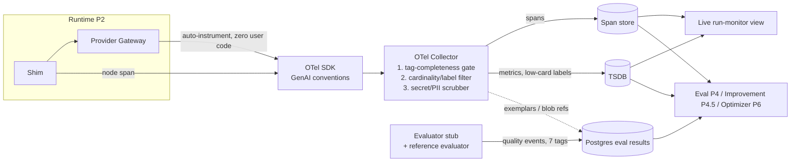

# Design — P2.5: Metrics & Observability substrate

Cross-reference: product rationale in
[`../../../docs/prd/P2.5-metrics-observability.md`](../../../docs/prd/P2.5-metrics-observability.md).

## Context

P2.5 turns P0's frozen contracts — the seven-tag `metric-event.schema.json`, the `config_hash`/
lineage scheme, and the three-stores-by-shape storage decision — into **running infrastructure**,
landing right after the first Runtime because "if it isn't observable, it isn't done." Two
realities shape every decision. First, the source plan's stated dominant failure mode: *emitting
under-tagged metrics you can't later slice.* P0 froze the schema; P2.5 is where under-tagging would
actually happen, so tagging is enforced at emission, not documented. Second, this substrate is
**shared** — the eval harness (P4), improvement engine (P4.5), and autonomous loop (P6) all consume
it — so it is designed once, and the evaluator seam that P4 plugs into is stubbed here against a
frozen contract. This is operational metrics only; quality/agent/safety metrics and the statistical
layer are P4/P5.

## Decision 1 — Auto-instrument at the single gateway seam; zero user code

**Decision.** OpenTelemetry attaches at the P2 provider gateway and shim. Every `Gateway.Complete`
call emits operational metrics; every node execution emits a span. A workflow author adds nothing.

**Why.** P2 deliberately funnelled all model calls through one gateway; that seam is the payoff
here — one instrumentation point captures every call's latency/cost/tokens/reliability with zero
application effort (DevOps observability domain; "automate the second time"). If collection required
per-node annotation, a workflow author could ship an un-instrumented node, which violates the
defining NFR. Instrumenting at the seam makes un-instrumented execution *impossible*, not merely
discouraged.

**Alternative rejected.** Per-call-site annotation / a user-facing metrics API — reintroduces the
toil the shim exists to remove and guarantees coverage gaps. SDK-level monkey-patching outside the
gateway — the gateway already normalizes provider shapes, so it is the correct, single place.

## Decision 2 — A collector chokepoint enforces the three cross-cutting disciplines

**Decision.** An OTel Collector sits between emission and the stores, with a processor pipeline:
**tag-completeness gate → cardinality/label filter → secret/PII scrubber → fan-out to three stores.**

**Why.** Three invariants must hold on *every* event — full seven tags, no high-cardinality TSDB
labels, no secrets/PII. Enforcing them at one reviewable, testable chokepoint is far safer than
trusting each of many emitters. The gate is where an under-tagged event is rejected (Decision 3),
where `case_id`/`run_id` are stripped from TSDB labels (Decision 4), and where prompt text/secrets
are scrubbed to content-hash references (Decision 6).

**Trade-off.** One more hop. Accepted: the hop is async/off the request path (Decision 7) and buys
a single enforcement point for the three properties the whole platform's slicing depends on.

## Decision 3 — Tag completeness enforced at emission, layered with the DB

`RunContext` carries the seven tags, so the emitter populates them from context rather than trusting
each call site to remember. The tag-completeness gate **rejects** any event missing any tag before
it reaches a store; the relational store additionally declares all seven columns `NOT NULL` (P0
storage-and-lineage). This is the "model invariants into the schema / the DB enforces what app code
forgets" reality applied to telemetry: a missing tag is refused twice, at the boundary and at the
row. Target: **0** untagged events reach any store (NFR2). This is the single highest-leverage
engineering decision in the phase, per the ownership matrix.

## Decision 4 — Cardinality budget: which tags may be TSDB series labels (the deep-dive)

**Decision.** Only `variant_id`, `node_id`, `seed`, and `metric_name` are TSDB series labels.
`case_id`, `run_id`, `invocation_id`, and content-hash references are **never** labels; they live as
span attributes, Postgres columns, and TSDB exemplars.

**Why (numbers).** Active series ≈ variant(20) × node(20) × metric_name(~15) × seed(5) ≈
**3×10⁴/run** — comfortable for a TSDB. If `case_id`(200) or `run_id`/`invocation_id`(10⁶) became
labels, series would explode to ~**10⁸** and the TSDB would collapse. This single rule is *the*
reason metrics live in a TSDB rather than Postgres (P0 §8.2), and it is the "metric cardinality"
deep-dive the ownership matrix names as one of the two hardest parts of the whole project. It is
enforced at the collector (Decision 2), not left to emitter discipline.

**Trade-off.** You cannot `GROUP BY case_id` in the TSDB. Accepted: per-case slicing is served from
Postgres/spans (where `case_id` is a column/attribute), and metric aggregation — the TSDB's job —
never needs case as a label. Exemplars link a metric bucket back to a representative span/run.

## Decision 5 — Three stores by shape, keyed by config_hash

Confirms the P0 storage decision as running infra. Each query shape hits the store built for it:

| Query shape | Store | Why |
|---|---|---|
| Metric trend / aggregation | TSDB (Prometheus/ClickHouse) | huge counts of tiny numeric points; low-card labels; compressed |
| Per-run trace drill-down | Span store (Tempo/Jaeger) | trace-native; run→node→tool-call hierarchy |
| Per-variant/node/case comparison | Postgres | low volume; rich relational joins; `NOT NULL` tags + FKs |

Every record carries `config_hash`, so any operational number is attributable to an exact,
replayable configuration and rolls up across seeds under one `config_hash` (P0 NFR2).

## Decision 6 — Secrets, prompts, and PII never enter telemetry

The scrubber strips provider secrets, API keys, prompt text, completion text, and PII before any
store; telemetry carries only **content-hashed blob references** (the bytes live in the object store
from P0/P2). This is DevOps directive 5 ("secrets never touch the logs") applied to spans and metric
labels, and it makes telemetry safe to retain and query broadly. Provider keys stay in the secrets
manager; the collector holds only write-only store credentials (least privilege).

## Decision 7 — Emission is async, non-blocking, and degrade-safe

**Decision.** Telemetry is emitted off the provider-call request path; a telemetry-backend outage
degrades telemetry but never fails or delays a paid run.

**Why.** A run must not fail because Tempo is down (DevOps: blast radius, reversible, degrade
gracefully). Async emission caps overhead at < 5 ms p50/call (NFR5).

**Trade-off.** A crash can lose the last in-flight events (a small, bounded gap) rather than
blocking the run to guarantee delivery. Accepted: for operational metrics, a rare gap is far
cheaper than coupling a paid run's success to a telemetry backend's availability.

## Decision 8 — Idempotent emission under P2's retry model

P2 retries a node invocation under `{run_id, node_id, attempt_group}`. Metric emission and cost
accounting key on that same identity, so a retried invocation is **measured once**: no double-counted
cost, no duplicate metric event or span for the same logical invocation (FR18/NFR8). This mirrors
P2's own idempotency (a retry must not double-charge the provider *or* double-count the telemetry).

## Decision 9 — Evaluator-plugin interface as a stub now, framework in P4

**Decision.** Define the `Evaluator` interface and ship one trivial built-in reference evaluator;
defer real evaluators and custom user-scoring registration to P4.

```
type Evaluator interface {
  Name() string
  Evaluate(ctx RunContext, trace Trace) -> []QualityMetricEvent  // each carries the seven tags
}
Register(evaluator Evaluator)   // built-in + user-defined; mirrors the Skill Registry pattern
```

**Why.** The substrate must be "designed once" so P4 slots quality metrics in without re-plumbing
collection, tagging, or storage. Stubbing the seam — with `RunContext` carrying the seven tags so an
evaluator *cannot* emit an under-tagged event, and one reference evaluator proving events flow to the
eval-results store — freezes the contract P4 builds against while keeping P2.5 scoped to the
substrate. The interface is versioned (stable major) so P4 binds safely.

**Alternative rejected.** Building the full evaluator framework (exact-match/schema/LLM-judge,
statistical layer, custom registration) in P2.5 — that *is* much of the eval harness and belongs in
P4; pulling it forward would bloat the substrate phase and blur ownership.

**Open (OQ5).** Where user-defined evaluators *execute* (inline vs. post-run job vs. P3 sandbox,
since user scoring code is untrusted like skills) is confirmed with P3/P4; the stub fixes only the
interface.

## Architecture



## Data model sketch

```
-- Postgres (expand-only additions)
eval_result(
  variant_id, run_id, node_id, case_id, seed, timestamp, config_hash,   -- all NOT NULL (P0)
  evaluator_name, metric_name, value, unit,
  input_blob_hash, output_blob_hash,                                    -- refs, never inlined
  FK(config_hash) -> variant_spec, FK(node_id) -> node, FK(case_id) -> case
)

-- TSDB series (labels ONLY): {variant_id, node_id, seed, metric_name}
-- exemplars link a bucket -> representative {run_id, span_id}; case_id/run_id are NOT labels

-- Span store: run span -> node spans -> tool-call child spans
--   attributes: seven tags + node_kind + invocation_id (high-card lives here, not as TSDB labels)
--   NEVER: prompt/completion text, secrets, PII (scrubbed -> content-hash refs)
```

## Key interfaces

```
// Auto-instrumentation — no user surface
Gateway.Complete(ModelEntry, Request, Seed) -> Response
  └── emits node span + operational metric events, fully tagged, keyed by config_hash

// Emission boundary — the tag/cardinality/scrub gate (collector processor)
Emit(MetricEvent{ tags: SevenTagSet, payload:{metric_name,value,unit} }) -> ok | reject

// Evaluator seam (P4 implements)
Evaluator.Evaluate(ctx RunContext, trace Trace) -> []QualityMetricEvent
Register(evaluator Evaluator)
```

## Risks

- **Under-tagging at emission** — mitigated by the boundary gate + P0 `NOT NULL` columns (Decision
  3); negative test refuses a missing-`config_hash` event.
- **Cardinality explosion** — mitigated by the collector's label filter (Decision 4); test asserts a
  200-case run does not multiply series and `case_id` is not a TSDB label.
- **Secret/PII leakage into spans/labels** — mitigated by the scrubber + content-hash refs (Decision
  6); scrub test on a secret-shaped prompt.
- **Telemetry outage fails a run** — mitigated by async/degrade-safe emission (Decision 7);
  fault-injection test kills the collector mid-run.
- **Retry double-counts cost** — mitigated by idempotent emission keyed on `{run_id, node_id,
  attempt_group}` (Decision 8).
- **Evaluator interface too narrow, forcing a P4 re-plumb** — mitigated by stubbing against P4's
  concrete needs and versioning the interface (Decision 9).
- **Span volume/cost unbounded** — mitigated by sampling + retention bounds sized from PRD §8.3
  (mechanism now, numbers tuned against real volume; P0 OQ6).
