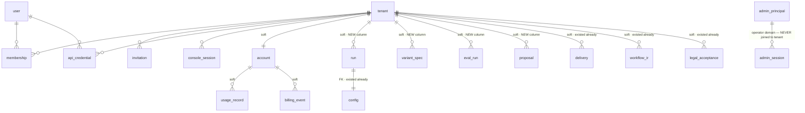
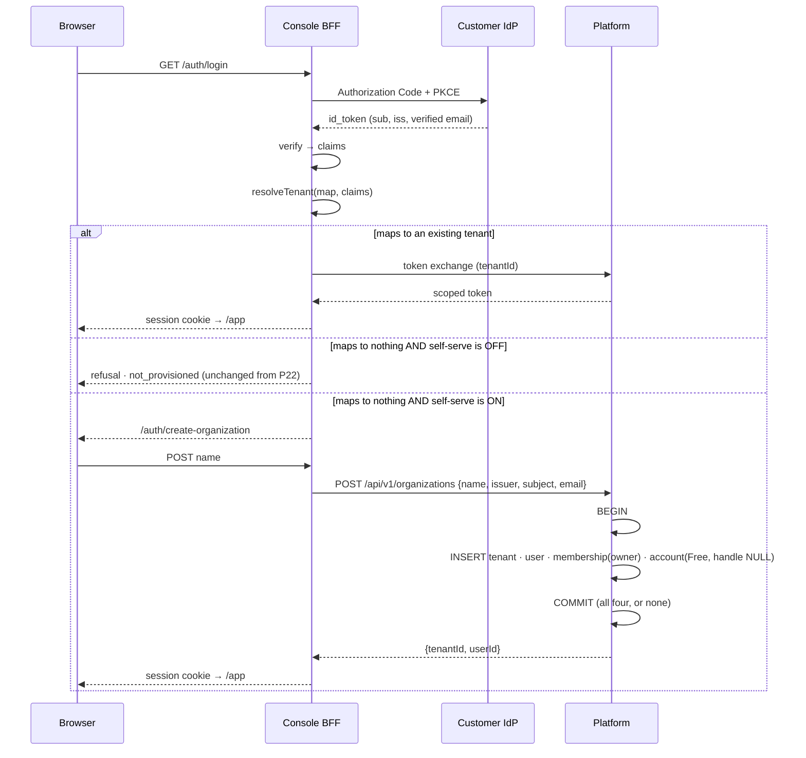
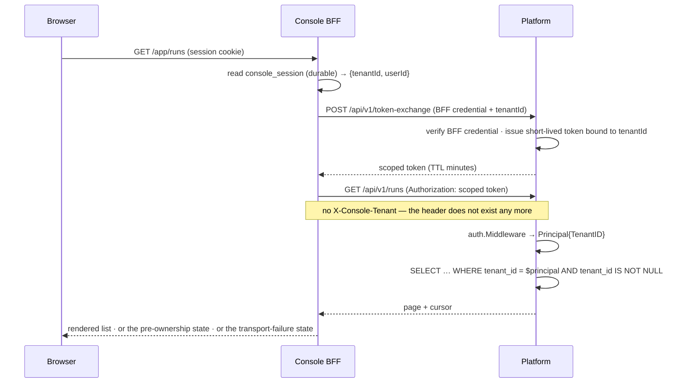
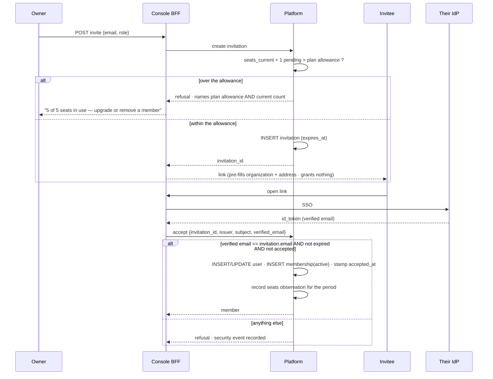
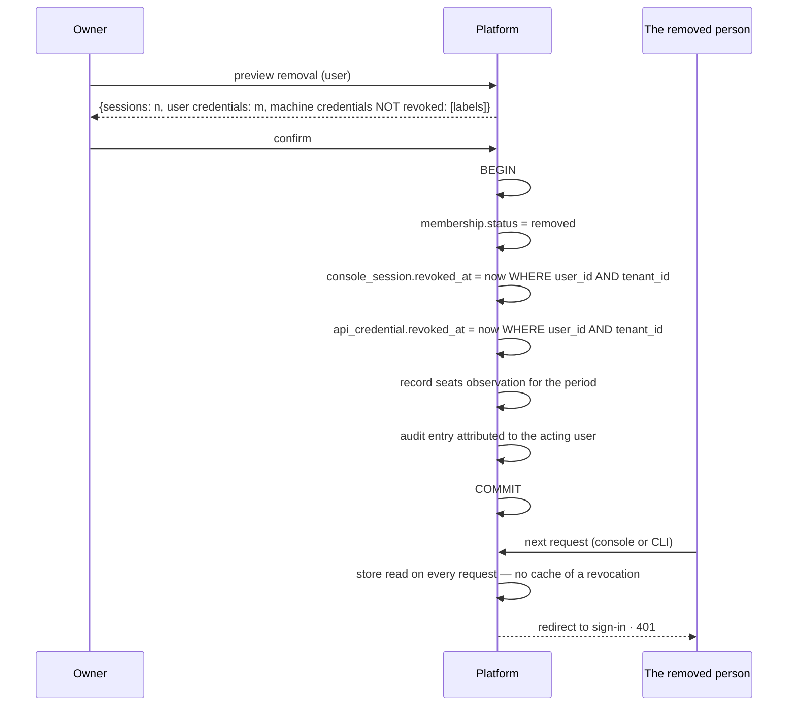
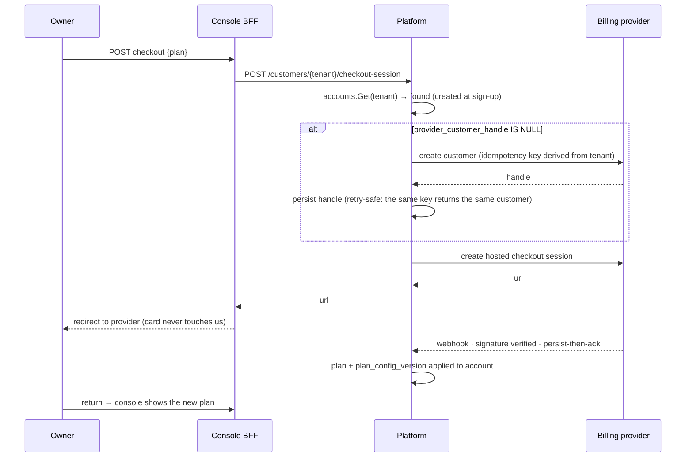
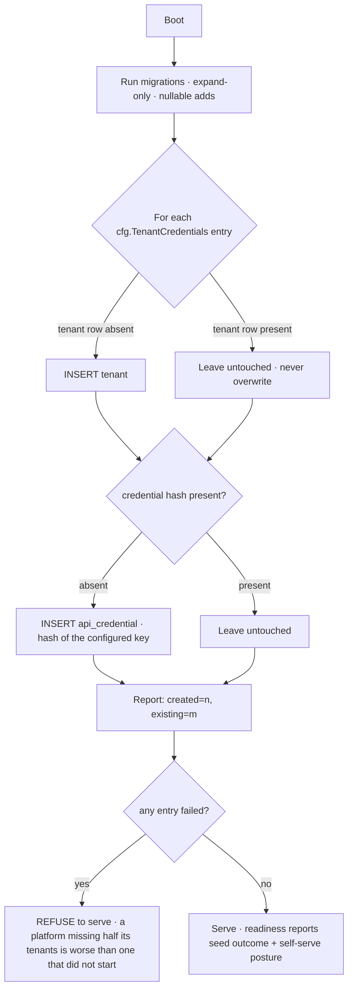
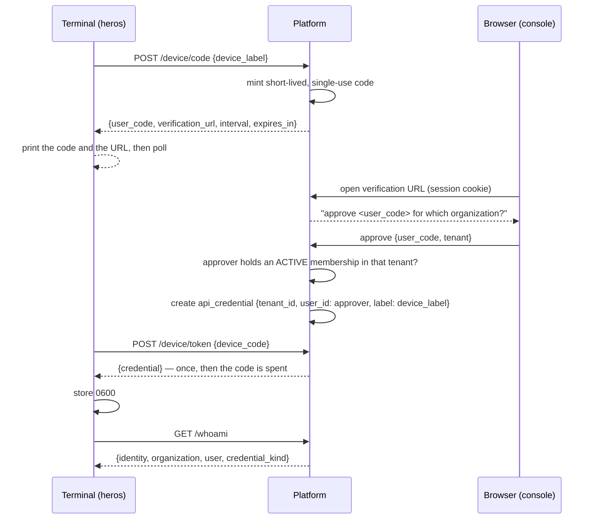

# Design — P27: Account System

| | |
|---|---|
| **Status** | Draft — nothing here is built |
| **Created** | 2026-08-04 |
| **Updated** | 2026-08-04 |
| **Related** | [PRD P27](../../../docs/prd/P27-account-system.md) · [proposal](proposal.md) · [tasks](tasks.md) · [ADR-008](../../../docs/adr/ADR-008-console-tenant-identity-seam.md) · [ADR-004](../../../docs/adr/ADR-004-runtime-config-binding.md) · [P22 PRD](../../../docs/prd/P22-sso-identity.md) · [P7 PRD](../../../docs/prd/P7-billing-metering.md) · [P21 PRD](../../../docs/prd/P21-stripe-payments.md) |

---

## §0 TL;DR — the decision in one paragraph

**Make the tenant a row.** Everything else follows. Once a tenant is a row it can be created at runtime, so
sign-up is possible; once sign-up is possible it needs an owner, so a person must be a row too; once a person
is a row the session can name them, so offboarding can revoke them and seats can be counted; and once the
platform holds the tenant durably it can put the tenant *inside the credential*, which is what finally lets a
run be listed back to the customer who produced it. Five tables and one nullable column on `account`. The
existing configuration list stays working, demoted from *the truth* to *a seed applied once at boot*.

The single non-obvious call: **`X-Console-Tenant` is deleted, not fixed.** Making the platform trust it would
cost one line and would let any holder of the console's one credential name any tenant. That is a request
describing its own authority, and the cheapness of the fix is not a reason to take it.

---

## §1 Original requirement

Damon, 2026-08-04, verbatim:

> "heros agent. i just realize the tenant does not persist. how do users pay for membership if their account
> does not persist???"

In plain terms, three questions stacked:

1. **Where does a customer live?** — Right now, in a config file. So a customer only exists if somebody edited
   a file and restarted a process.
2. **How does a person come back tomorrow and find their work?** — They cannot. A run has no owner and there is
   no list endpoint, so yesterday's work is reachable only if you kept the id.
3. **How do they pay?** — They cannot. The checkout path opens with `accounts.Get(customerID)` and nothing in
   the product ever calls `accounts.Create`.

The underlying request is not "add a signup form". It is: **the product assumes a customer exists, and nothing
makes one.**

---

## §2 ER diagram / data model

### §2.1 Legend

| Mark | Meaning |
|---|---|
| 🆕 | New in P27 |
| 🔧 | Existing table, extended in P27 |
| ⬜ | Existing, unchanged — drawn only to show where the new tables attach |
| **PK** | Primary key |
| **FK** | Real foreign key, enforced by the database |
| *(soft)* | Indirect reference — same value, deliberately **no** foreign key. See §4 |

### §2.2 Highlight diagram — only what P27 adds or touches

```mermaid
erDiagram
    tenant ||--o{ membership : "has"
    user   ||--o{ membership : "holds"
    tenant ||--o{ invitation : "issues"
    tenant ||--o{ api_credential : "owns"
    user   ||--o{ api_credential : "may own (nullable)"
    tenant ||--o{ console_session : "scopes"
    user   ||--o{ console_session : "may name (nullable)"
    tenant ||--|| account : "is billed as (soft)"

    tenant {
        text tenant_id PK
        text name
        text status
        timestamptz created_at
    }
    user {
        text user_id PK
        text issuer
        text subject
        text email
        timestamptz created_at
    }
    membership {
        text user_id PK_FK
        text tenant_id PK_FK
        text role
        text status
        text invited_by
        timestamptz joined_at
    }
    invitation {
        text invitation_id PK
        text tenant_id FK
        text email
        text role
        text invited_by
        timestamptz expires_at
        timestamptz accepted_at
    }
    api_credential {
        text credential_id PK
        text tenant_id FK
        text user_id FK_nullable
        text label
        text hash
        timestamptz revoked_at
    }
    console_session {
        text token_hash PK
        text session_id
        text tenant_id FK
        text user_id FK_nullable
        bigint expires_at
        bigint revoked_at
    }
    account {
        text customer_id PK
        text provider_customer_handle "now NULLABLE"
        text active_plan_id
        text plan_config_version
    }
```

### §2.3 Full ER — the new tables in place against the baseline



Two things this picture is meant to make obvious.

**The three `tenant_id` columns on the right already existed** — `delivery`, `workflow_ir`, `legal_acceptance`
have carried one for phases. They were foreign keys into nothing, because the table they pointed at did not
exist. P27 does not add tenant-awareness to the system; it adds the row those columns were always naming.

**The operator domain is drawn deliberately disconnected.** `admin_principal` has no tenant column and no
foreign key into any customer table, and that is a P8 FR1 invariant, not an omission. An operator is not a
user; a user never becomes an operator by acquiring a role. If a future diagram ever connects those two boxes,
that is the review failure, not a modelling improvement.

---

## §3 New and extended elements

### §3.1 `tenant` 🆕 — the row the config file has been standing in for

| Field | Type | Purpose | Why it is like this |
|---|---|---|---|
| `tenant_id` | TEXT PK | The identifier every other table already names | Reuses the **existing** string ids from `cfg.TenantCredentials`, so the seed can create rows whose ids are already in customers' credentials and running deployments keep authenticating |
| `name` | TEXT NOT NULL | What the customer calls their organization | The config file had no place for a human name, so the operator console shows raw ids today. A support question starts with a name, not an id |
| `status` | TEXT NOT NULL | `active` / `suspended` | The **same vocabulary as `account.Status`** on purpose. Two lifecycle enums for one lifecycle is a place for the two answers to disagree, and the one that matters (may this tenant run?) gets read from whichever the caller knows about |
| `created_at` | TIMESTAMPTZ NOT NULL | When the organization came into existence | The only way to answer "is this a new customer or an old one" without inferring it from their first run |

**What user problem this solves.** A person signs up at 02:00 and calls the API at 02:01. Today that is
impossible — somebody has to edit `config.json` and restart. With a row, it is an insert.

### §3.2 `user` 🆕 — the person P22 made provable

| Field | Type | Purpose | Why it is like this |
|---|---|---|---|
| `user_id` | TEXT PK | Internal, stable identity used by every foreign key | An internal id survives the person changing their email, their name, or their identity provider. A key made of the federated pair would have to be rewritten across every referencing row when a customer migrates IdP |
| `issuer` | TEXT NOT NULL | The IdP that vouched for them | Half of the federated identity. Registered issuers are already the trust anchor in `federation.ts` — this stores what that resolved to |
| `subject` | TEXT NOT NULL | The IdP's own id for the person | The other half. **`UNIQUE(issuer, subject)`** |
| `email` | TEXT | Display and invitation matching | **Deliberately not the identity.** An address gets reassigned inside a company; a subject does not. Keying on email means the new hire who inherits `sales@` inherits the previous holder's account |
| `created_at` | TIMESTAMPTZ NOT NULL | First sight of this person | Feeds the "a new identity appeared" security event P22 already emits for JIT |

**What user problem this solves.** Three that are all the same problem: "who revoked this?", "who is in my
organization?", and "am I over my seat limit?". None of them is answerable without a row per person.

### §3.3 `membership` 🆕 — a person's relationship to an organization

| Field | Type | Purpose | Why it is like this |
|---|---|---|---|
| `user_id` + `tenant_id` | TEXT, TEXT — composite PK | The relationship itself | A **join table, not a column on `user`**, because a contractor works for two customers and a `tenant_id` column on `user` cannot express that. It is also what makes a seat a property of the organization rather than of the person |
| `role` | TEXT NOT NULL | `owner` / `admin` / `member` | Three values, closed by `CHECK`. An invented role would be read by every switch statement as "something else" |
| `status` | TEXT NOT NULL | `active` / `removed` | Removal is a **state change**, not a delete: the audit chain has to keep pointing at somebody, and a hard delete orphans it |
| `invited_by` | TEXT | Which user issued the invitation | "How did this person get here" is the first question after an unexpected member appears |
| `joined_at` | TIMESTAMPTZ | When the membership became active | Seat accounting needs the boundary, not just the current set |

**What user problem this solves.** An owner needs to add people, see who is there, and remove them — and needs
removal to *mean something*, which requires the membership to be the thing access is derived from.

### §3.4 `invitation` 🆕 — a pending membership that is not a membership

| Field | Type | Purpose | Why it is like this |
|---|---|---|---|
| `invitation_id` | TEXT PK | The link's opaque token | Random and single-purpose, so a leaked link reveals nothing about the organization's size or other invitations |
| `tenant_id` | TEXT FK | Which organization | — |
| `email` | TEXT NOT NULL | Who was invited | The **matching rule**, checked against the *verified* address from SSO. The link pre-fills it; it does not prove it |
| `role` | TEXT NOT NULL | The role they will hold | Decided by the inviter, at invitation time, so acceptance has no decision in it |
| `expires_at` | TIMESTAMPTZ NOT NULL | When it stops working | An invitation that never expires is a permanent standing offer sitting in somebody's inbox |
| `accepted_at` | TIMESTAMPTZ | Single-use marker | Set once; a second acceptance is refused rather than creating a second membership |

**What user problem this solves.** "Send my colleague a link" — without the link becoming a credential anyone
who receives a forwarded email can spend.

### §3.5 `api_credential` 🆕 — the keys the config map holds today

| Field | Type | Purpose | Why it is like this |
|---|---|---|---|
| `credential_id` | TEXT PK | Stable handle for revocation and audit | A UUID, not a sequence: a sequence lets an observer estimate how many credentials the platform has issued, which is size information nobody needs to give away |
| `tenant_id` | TEXT FK NOT NULL | The scope the credential carries | **This is the whole isolation fix.** The tenant lives inside the credential, so `auth` derives scope from a verified value and no header is involved |
| `user_id` | TEXT FK **NULL** | The person, when there is one | NULL means **machine credential** — a CI key, a service. Not "unknown". The distinction is what lets member removal revoke a person's keys without breaking a build |
| `label` | TEXT NOT NULL | What the human called it | A revocation screen listing eight opaque ids is a screen where the wrong key gets revoked |
| `hash` | TEXT NOT NULL | The stored form of the secret | The plaintext is returned **once**, at creation, and is never readable again from any surface, log or export |
| `revoked_at` | TIMESTAMPTZ | Revocation, honoured at the next request | Soft, so the audit chain keeps resolving the credential that took past actions |

**What user problem this solves.** "This person left; end their access" becomes one operation instead of
"rotate the shared key and redistribute it to everyone who stayed".

### §3.6 `console_session` 🆕 — the map a restart empties

| Field | Type | Purpose | Why it is like this |
|---|---|---|---|
| `token_hash` | TEXT PK | Lookup key for the opaque bearer the browser holds | Hashed, so a database read does not yield a usable session token |
| `session_id` | TEXT NOT NULL | The id that appears in logs | **Separate from the token**, exactly as the in-memory store already separates them, so a log line naming a session cannot be replayed as that session |
| `tenant_id` | TEXT FK NOT NULL | Scope | Unchanged in meaning from today |
| `user_id` | TEXT FK **NULL** | The person | Present for an interactive sign-in; absent for a machine principal. **Never a placeholder** |
| `expires_at`, `revoked_at` | BIGINT | TTL and revocation | int64 milliseconds, matching the repository's cross-dialect timestamp convention on hot columns |

**What user problem this solves.** "I was signed out in the middle of the afternoon" — caused by a deploy, and
about to be caused far more often by the second replica P19's manifest already declares.

### §3.7 `account` 🔧 — one nullable column and one new invariant

| Change | Why |
|---|---|
| `provider_customer_handle` becomes **NULLABLE** | A Free customer has no billing-provider customer yet. Today `NewHandle` refuses an empty string — correctly, for a *billable* account — which makes a free account inexpressible and forces the first sign-up to fail or to mint a provider customer for someone who may never pay |
| New `CHECK`: a NULL handle is legal **only while the plan charges nothing** | This is what keeps the original guarantee. The point of rejecting the empty handle was "a customer who cannot be billed must not look billable". That guarantee survives, stated as the condition it actually was |
| The card-data `CHECK` is **unchanged** | Any non-null handle still cannot be a Luhn-valid 12–19 digit run. PCI scope stays out |

### §3.8 `run`, `variant_spec`, `eval_run` 🔧 — `tenant_id` NULL

| Change | Why |
|---|---|
| Add `tenant_id TEXT NULL`, partially indexed on each table's own ordering column | Nullable-first because these are **deployed tables**: nullable-first, backfill by condition, no unconditional `UPDATE`. The index is **partial** (`WHERE tenant_id IS NOT NULL`) because every query filters `tenant_id = $1` and never `IS NULL` — and because it therefore indexes zero rows at creation, which is what makes the build instant. `CREATE INDEX CONCURRENTLY` is unavailable: the runner executes each file as one batch inside its own transaction |
| 🔴 `proposal` is **excluded** | Migration 0025 already gave it `tenant_id NOT NULL` with `idx_proposal_scope` beside it. Proposals have been tenant-scoped since P5.5 and have **no pre-ownership state**. An earlier draft added the column anyway — a no-op that read as work — and the schema fence in `p27_account_system_pgproof_test.go` caught it, which is the argument for writing the fence before the migration |
| NULL means **pre-ownership**, never *unowned* | The owner of a pre-P27 run is not recoverable — it was never written. Inferring it from a neighbouring table would produce a *confident wrong* answer, which is worse than an absent one. Every listing surface renders the pre-ownership state distinctly |

---

## §4 Relationships — where a real foreign key is used, and where it deliberately is not

**Real foreign keys, enforced by the database:** `membership → tenant`, `membership → user`,
`invitation → tenant`, `api_credential → tenant`, `api_credential → user`, `console_session → tenant`,
`console_session → user`. These are all *within the identity domain*, written by one service, and an orphan in
any of them is a bug with no legitimate reading. The database is the cheapest place to make it impossible.

**Indirect references, deliberately without a foreign key:**

| From → To | Why no FK |
|---|---|
| `account.customer_id` → `tenant.tenant_id` | Same value, but `account` is the **billing** domain and `tenant` is the **identity** domain. Coupling them with a constraint means an identity migration cannot run without a billing outage, and it makes the billing tables undroppable from a deployment that does not bill. The invariant is asserted by a reconciliation read, not by the schema — which is also how P7 already relates `usage_record` to `account` |
| `run.tenant_id` → `tenant.tenant_id` | `run` is on the **data plane**. A foreign key would put an identity-table lookup in the run write path, and control-plane state must not enter the hot path. It also makes the NULL (pre-ownership) legal without a special case |
| `delivery`, `workflow_ir`, `legal_acceptance`, `platform_workflow_graph` `.tenant_id` | Same reasoning, and they predate P27. **P27 deliberately does not retrofit constraints onto them** — that would be scope creep into four subsystems for a property none of them currently violates |

> The rule this follows: a foreign key inside one bounded context is free correctness; a foreign key **across**
> two bounded contexts is a deployment coupling that shows up as an outage during an unrelated migration.

---

## §5 Business flows

### §5.1 Sign-up — a verified identity that belongs to no organization

**1) What the user does**

They land on the marketing page, click *Sign in*, and complete their company IdP's flow. They come back and —
if this deployment permits self-serve — they are asked one question: *what is your organization called?* They
type it and they are in, on the Free plan, with no payment method and no operator involved.

If this deployment does **not** permit self-serve, they see exactly what P22 shows today: their sign-in was
verified and their identity is not provisioned here. That path does not change at all.

**2) The system's view**



**3) Design key points**

**What original requirement this answers.** *"the tenant does not persist"* — this is the flow that creates
one, and the reason there was no such flow is that there was nowhere to write it.

**Why it is designed this way**

- **All four rows in one transaction.**
  *Problem:* what does the system look like if the tenant is created and the account insert fails?
  *Design:* one transaction — tenant, user, owner membership and Free account commit together or none of them
  do.
  *Why that fits:* every partial state here is unrecoverable **through the product**. A tenant with no owner
  has nobody who can invite an owner. An account with no tenant is a customer nobody can sign in as. Neither
  has a UI that could fix it, so both would become operator tickets.
  *Alternatives:* create the tenant first and let a background job reconcile the account — that is a cleanup
  job, and a cleanup job that runs rarely is a cleanup job nobody notices has stopped. Create the account
  lazily at first paid action — that is today's behaviour and it is the bug.
  *Effect:* there is no half-created organization state, and therefore no runbook entry for one.
- **Self-serve is a declared posture, off by default.**
  *Problem:* should an air-gapped install grow a public registration form when it upgrades?
  *Design:* the deployment declares whether unmapped verified identities may create a tenant; unset means no.
  *Why that fits:* the three deployment shapes this product ships in want three different answers, and the
  repository's standing rule is that a capability silently on in one shape and off in another is exactly what
  the deployment ledger exists to prevent.
  *Alternatives:* infer it from whether an IdP is configured — an inference, and inferred security posture is
  the class of decision that is wrong quietly.
  *Effect:* upgrading an air-gapped deployment does not publish a signup form on a customer's network, and the
  effective value is readable on the readiness surface rather than deduced.
- **The organization name is asked for, not derived.**
  *Problem:* where does the organization's name come from?
  *Design:* one question to the user.
  *Why that fits:* the alternative is deriving it from the email domain, which produces "Gmail" for every
  independent developer and the wrong legal entity for half of everyone else.
  *Alternatives:* derive-and-let-them-edit — an editable wrong name is a name most people never edit.
  *Effect:* the operator console shows organization names a support conversation can actually use.

**Key business decision points**

- *Who owns the new organization?* The person who created it, as `owner`. There is no unowned organization.
- *May a person create a second organization?* Yes — memberships are many-to-many. Their seat is counted
  separately in each.
- *What if their company already has an organization here?* They land in it only if the deployment's mapping
  strategy says so (P22's `domain` / `per-issuer` rules, unchanged). Otherwise they create a new one and an
  admin merges them by invitation. **This is Open Question 2 in the PRD** and it is not silently decided here.
- *Who is responsible if a sign-up fails halfway?* Nobody, because the transaction means it cannot.

**Key technical decision points**

- Internal `user_id` as the primary key, with `UNIQUE(issuer, subject)` beside it — not the pair as the key,
  because an IdP migration would otherwise rewrite every referencing row.
- The organization-creation endpoint takes the verified claims from the **BFF's server side**, never from the
  browser's post body. The name is the only client-supplied field, and it is a display string.
- `account` created with `provider_customer_handle = NULL`, legal under the new `CHECK` because the Free plan
  charges nothing.

---

### §5.2 Signing in and finding yesterday's work

**1) What the user does**

They sign in and land on `/app/runs`. They see their runs, newest first, with the ones they started this
morning at the top. If they have never run anything they are told so, and told what to do first. If everything
they ran happened before this release, they are told **that** instead — because "you have no runs" would be a
lie their history contradicts.

**2) The system's view**



**3) Design key points**

**What original requirement this answers.** *"users persist their runs"* — persistence was never the missing
part. The run rows were always durable. What was missing was **an owner**, and therefore any way to ask for
them back.

**Why it is designed this way**

- **The tenant is inside the credential; the header is deleted.**
  *Problem:* the platform has to know which tenant is asking, and today it does not — one console credential
  serves everyone and the tenant header is never read.
  *Design:* the BFF exchanges its session for a short-lived token bound to that session's tenant, and forwards
  the token. `auth.Middleware` resolves scope exactly as it always has.
  *Why that fits:* it keeps the property ADR-008 built the console around — the browser holds no credential —
  while making the server-side value the platform actually verifies.
  *Alternatives:* **trust `X-Console-Tenant` when the BFF's credential is presented.** One line, no new
  endpoint, no token cache. It also means anyone holding that one credential can name any tenant, which is a
  request describing its own authority. The priority law puts security at level 1 and implementation cost at
  level 8, and level 8 may not push back — so this is *rejected*, not held in reserve. **A second alternative:**
  give each tenant their own console credential and have the BFF pick one. That works and it means the BFF
  holds every tenant's long-lived key in memory, which enlarges the blast radius of a console compromise from
  "one short-lived token" to "everything".
  *Effect:* a bug in a console route cannot read another tenant's runs, because the console holds no credential
  that names another tenant.
- **The header is removed and fenced, not left inert.**
  *Problem:* the header will still be sitting there, ignored.
  *Design:* delete it from the forwarder and add a build fence that fails if it returns.
  *Why that fits:* an ignored header that names authority is a loaded gun with the safety on. The next person
  to see it reads it as the isolation mechanism and makes it load-bearing.
  *Alternatives:* leave it for tracing — it can be re-added later as a *log* field with a name that does not
  read as authority.
  *Effect:* the mechanism has one implementation, not one implementation and one decoy.
- **Three empty states, not one.**
  *Problem:* three different things produce zero rows.
  *Design:* *no runs yet*, *runs that predate ownership*, and *the platform did not answer* are three states,
  three messages, three next actions.
  *Alternatives:* one empty table for all three — which tells a returning customer their history is gone when
  it is not, and tells them there is nothing wrong when the platform is down.
  *Effect:* the release does not read as data loss to anyone who used the product before it.

**Key business decision points**

- *Whose runs does an organization member see?* The **organization's**, not their own. Work belongs to the
  company that is billed for it, and a per-person view would make a departing employee's work disappear.
- *What happens to a run whose owner is not recorded?* It stays reachable by id and is not listed. It is not
  deleted, not reassigned, and not guessed at.
- *Who may see another organization's run?* Nobody, and the API does not confirm that the run exists.

**Key technical decision points**

- The scoped token is short-lived and cached in the BFF for its lifetime — a *positive* cache. It is never
  used to cache a **revocation**.
- The list is cursor-paged with an index on `(tenant_id, created_at DESC)`. No list endpoint in this phase
  returns an unbounded set.
- A cross-tenant read returns `404`, in the same shape and timing class as a non-existent id, so the endpoint
  is not an existence oracle.

---

### §5.3 Inviting a colleague, and what the link is not

**1) What the user does**

An owner opens *Members*, types a colleague's work address, picks a role, and sends. The colleague gets a link.
Opening it shows the organization's name and their address, already filled in, and one button: *Sign in to
join*. They complete their company IdP flow. If the address their IdP vouches for is the invited one, they are
a member. If it is not, they are told the invitation is not for this account — and nothing is created.

**2) The system's view**



**3) Design key points**

**What original requirement this answers.** Membership — the thing being paid for — has to have members, and
adding one has to be something an owner can do without us.

**Why it is designed this way**

- **The link pre-fills; the assertion admits.**
  *Problem:* a link in an inbox gets forwarded, quoted in a ticket, and pasted into a chat.
  *Design:* the link carries no authority. Membership is created only when a completed SSO sign-in yields a
  **verified** address matching the invitation.
  *Why that fits:* P22 already establishes that the platform trusts a verified assertion and nothing else. An
  invitation token that grants membership would be a second, weaker credential path around it.
  *Alternatives:* a signed, single-use token that grants membership on click — convenient, and it means whoever
  reads the email is the member.
  *Effect:* forwarding the invitation to the wrong person creates nothing.
- **The seat check happens at invite time and again at acceptance.**
  *Problem:* five invitations sent against one free seat.
  *Design:* pending invitations count toward the allowance when inviting, and the allowance is re-checked at
  acceptance.
  *Why that fits:* the first check is the good error message; the second is the one that is actually true,
  because the plan may have changed in between.
  *Alternatives:* check only at acceptance — then the owner sends five invitations and four colleagues get an
  error that is the owner's fault.
  *Effect:* the person who can fix the problem is the person who sees it.
- **The refusal names both numbers.**
  *Problem:* "seat limit reached" invites a support ticket asking what the limit is.
  *Design:* the message contains the plan's allowance and the current count.
  *Alternatives:* a generic denial with a link to the plan page — one more click to learn a number we already
  have.
  *Effect:* the owner can decide between upgrading and removing somebody without leaving the screen.

**Key business decision points**

- *Who may invite?* `owner` and `admin`. A `member` may not, because invitations spend seats and seats are
  money.
- *Who decides the role?* The inviter, at invitation time. Acceptance contains no decision, so a colleague
  cannot promote themselves by accepting.
- *Does an invitation expire?* Yes. A standing offer in an inbox is a way in that nobody is tracking.
- *If the invited person already belongs to another organization?* They join this one as well. That is the
  contractor case, and it is why membership is a join table.

**Key technical decision points**

- `accepted_at` makes acceptance single-use at the database, not in application logic.
- Matching is on the **verified** address from the assertion, never on an address supplied in the request.
- Email is a convenience, not a dependency: the invitation is retrievable in the console by the inviter, so a
  bounced message is not a broken flow.

---

### §5.4 Removing a member — and being honest about what removal does not cover

**1) What the user does**

An owner opens *Members*, chooses somebody, and clicks *Remove*. Before confirming, they are shown two things:
that this person's console sessions and personal API keys will stop working at their next request, and — by
name — **any machine credentials belonging to the organization that removal will not touch**, because a CI key
created by that person keeps working and the owner needs to decide about it deliberately.

**2) The system's view**



**3) Design key points**

**What original requirement this answers.** If membership is what is being sold, ending a membership has to be
a real operation with a real effect — and one the owner can attest to.

**Why it is designed this way**

- **Revocation is read, never cached.**
  *Problem:* verification moves from a map lookup to a store read, and the obvious optimisation is a cache.
  *Design:* the positive result may be cached briefly; the revocation may not.
  *Why that fits:* this exact shape has already cost this project once — a warm discovery cache made a
  fail-closed path look closed while it was not. **Caching a "yes" is a performance decision; caching a "no
  longer" is a security decision.**
  *Alternatives:* cache both with a short TTL and call the window acceptable — which turns "access ends at
  their next request" into "access ends within a minute", and the sales sentence has to change with it.
  *Effect:* the sentence an owner is asked to attest to is the sentence the system implements.
- **Removal is a status, not a delete.**
  *Problem:* what happens to the audit entries and runs attributed to somebody who leaves?
  *Design:* the membership becomes `removed`; the user row stays.
  *Alternatives:* delete the user — which orphans every audit attribution, meaning the record of what they did
  loses the name of who did it, at exactly the moment somebody is asking.
  *Effect:* the audit chain still resolves, and re-inviting the same person is a new membership rather than a
  resurrection.
- **The preview names what removal does not do.**
  *Problem:* an owner reads "remove" as "this person can no longer reach anything of ours".
  *Design:* the confirmation lists the organization-scoped machine credentials removal leaves running.
  *Alternatives:* revoke machine credentials created by that person too — which breaks the customer's build
  pipeline as a side effect of an HR action, without warning.
  *Effect:* nobody signs an offboarding checklist that is wrong, and nobody's CI breaks at 18:00 on a Friday.

**Key business decision points**

- *Who may remove?* `owner` and `admin`. An `admin` may not remove an `owner`.
- *May the last owner be removed or demoted?* No, ever. An organization with no owner cannot be repaired
  through the product.
- *Does removing somebody free a seat immediately?* For `seats_current`, yes. For the invoice, no — the period
  is billed on the **peak** held, so removing people on the last day does not retroactively unbuy the month.
- *Who is accountable for the machine credentials left behind?* The organization, explicitly, having been shown
  them by name.

**Key technical decision points**

- One transaction across membership, sessions and credentials, so there is no window where a removed member is
  removed from the list and still holds a working key.
- The seats observation is written on the same commit, which is what makes the period's peak reconstructable
  from events rather than sampled.
- The audit entry names the **acting** user, which is only possible because §3.2 exists.

---

### §5.5 The first upgrade — where the money path used to end in a 404

**1) What the user does**

An owner on the Free plan clicks *Upgrade*. They pick a plan, they are taken to the provider's hosted payment
form, they pay, and they come back to a console that already shows the new plan. They never learn that a
"billing-provider customer" is a thing that had to be created.

**2) The system's view**



**3) Design key points**

**What original requirement this answers.** *"how do users pay for membership if their account does not
persist"* — literally this flow. Today its first line fails.

**Why it is designed this way**

- **The account exists before the money does.**
  *Problem:* `StartCheckout` opens with `accounts.Get`, and nothing ever created one.
  *Design:* sign-up creates a Free account with a NULL handle; the first upgrade mints the handle.
  *Why that fits:* it separates *being a customer* from *being a paying customer*, which is the distinction the
  Free tier is made of.
  *Alternatives:* create the provider customer at sign-up — which registers a customer object at a payment
  provider for every person who ever tried the free tier, including the ones who never come back. That is a
  data-minimisation problem and a provider-side clutter problem, and it is not reversible by us.
  *Effect:* a free user's data does not leave for the payment provider until they choose to pay.
- **The nullable handle keeps its original guarantee by stating the condition.**
  *Problem:* `NewHandle` refuses an empty string, and the reason is good — a customer who cannot be billed must
  not look billable.
  *Design:* the handle may be NULL **only while the plan charges nothing**, enforced by a database `CHECK`.
  *Alternatives:* a sentinel string like `"none"` — which the card-data check would happily accept and which
  every consumer would have to learn about; or keep the handle mandatory and create a throwaway provider
  customer, which is the previous bullet.
  *Effect:* the state "paid plan, no billing customer" is not a bug to detect. It is a row the database refuses
  to hold.
- **Handle creation is idempotent.**
  *Problem:* a user clicks *Upgrade*, the network stalls, they click again.
  *Design:* the provider customer is created under a key derived from the tenant, so the retry returns the same
  customer.
  *Alternatives:* a "creating…" flag on the account — a lock with a failure mode of its own, replacing a
  provider-supported guarantee with one we maintain.
  *Effect:* an impatient double-click does not produce two customers and two subscriptions.

**Key business decision points**

- *Who may upgrade?* `owner` only. Plan changes are financial commitments.
- *What does the customer id mean?* It is the tenant id. One organization, one billing relationship.
- *What if they downgrade below their current seat count?* Refused, naming both numbers, with removing members
  as the stated remedy — the same refusal shape as the invitation limit, deliberately.

**Key technical decision points**

- No card data anywhere near the platform; the provider's hosted form, unchanged from P21.
- The `CHECK` binding handle-nullability to plan cost is in the **database**, because it is an invariant two
  services (billing and identity) can both violate.
- The webhook path, its signature verification and its persist-then-ack ordering are P21's and are consumed
  unchanged.

---

### §5.6 Upgrading a deployment that already has customers

**1) What the operator does**

They deploy the new version. Nothing else. Every tenant that existed in `config.json` still exists, every API
key that worked still works, and the readiness surface tells them how many tenants the seed created and how
many were already present.

**2) The system's view**



**3) Design key points**

**What original requirement this answers.** None directly — this is the flow that makes the other five safe to
ship to people who are already using the product.

**Why it is designed this way**

- **The seed is create-if-absent and nothing else.**
  *Problem:* a configuration file and a database now both describe tenants. Which wins?
  *Design:* the database wins, always. Configuration creates what is missing and never updates or deletes.
  *Why that fits:* the alternative reading — configuration is authoritative and reconciles the database — means
  a tenant created at runtime is deleted by the next restart, which is the exact property being fixed.
  *Alternatives:* full reconciliation (config is truth) — deletes runtime tenants. Last-writer-wins — makes the
  outcome depend on deployment timing.
  *Effect:* a customer who signs up at 02:00 is still there after the 03:00 rolling restart.
- **A partial seed refuses to serve.**
  *Problem:* what if three of ten configured tenants fail to seed?
  *Design:* fail the boot.
  *Why that fits:* a platform that starts and then rejects seven customers looks broken to seven customers; a
  platform that will not start says exactly what is wrong, once, to the person doing the deploy. That is the
  same posture `identity.ts` already takes for a dev provider in production.
  *Alternatives:* warn and continue — and this repository has been bitten by warn-and-continue shipping the
  wrong artefact more than once.
  *Effect:* nobody debugs "some customers can't log in" when the answer was printed at boot.
- **Migrations are nullable-first and re-appliable.**
  *Problem:* `run` is a deployed table with customer rows in it.
  *Design:* add `tenant_id` nullable with no default rewrite; backfill by condition where a source exists;
  never in one unconditional `UPDATE`.
  *Alternatives:* NOT NULL with a default — which rewrites the table and takes a lock proportional to its size.
  *Effect:* the upgrade has no downtime step, and rolling back is deploying the previous image, which ignores
  a column it does not know about.

**Key business decision points**

- *Does an existing customer notice this release?* Only by gaining `/app/runs` and a members page. Nothing they
  had changes.
- *Who owns the runs that already exist?* Nobody, stated as such. They are not assigned to the config tenant
  that happens to be the only one on a single-customer install, because a rule that is right for one deployment
  shape and wrong for another is worse than an honest NULL.

**Key technical decision points**

- The seed hashes the configured key and stores the hash; the configured plaintext keeps working because
  verification hashes what it receives.
- The migration and the Go model land in the same commit, and the embedded migration set is **applied to a
  live Postgres** by the acceptance suite — the failure this project has already paid for was a migration that
  was, in CI terms, a text file until it ran at boot on somebody's deployment.
- Rollback is re-apply: every new column is nullable, every new table is unreferenced by the prior image.

---

### §5.7 Signing in from the command line

Added after the phase was drafted, on damon's instruction: *"the cli login should use this same account system
as well."*

**1) What the user does**

They run `heros login`. The terminal shows a short code and a URL. They open it — they are already signed in to
the console, or they sign in with their company IdP — confirm the code matches what their terminal shows, pick
which organization, and approve. The terminal says who they are and which organization they are acting as. They
were never sent a secret by a colleague.

For CI, nothing changes: `heros login --token <machine credential>` behaves exactly as it does today.

**2) The system's view**



**3) Design key points**

**What original requirement this answers.** Not one of §1's three — this one arrived later, and it is what makes
§5.4's offboarding claim true. While a CLI credential names no person, *"removing a member ends their access"*
is a sentence that is false in a terminal.

**Why it is designed this way**

- **Device authorization, not a pasted token.**
  *Problem:* a developer's first act is to be handed a secret by a colleague — the same
  somebody-edits-a-file-and-tells-you problem the console has, one layer up.
  *Design:* the CLI asks for a code; the person approves it in a browser that already knows who they are.
  *Why that fits:* the browser is where P22's SSO already works. Reusing it means the CLI needs no identity
  code at all — it never touches a password, an assertion or an ID token.
  *Alternatives:* run the OIDC flow **in the CLI** with a local callback listener — that puts an identity
  implementation in a binary that ships to every developer machine, and a second place for a verifier to drift.
  Or keep `--token` only — which is today, and today is the bug.
  *Effect:* `heros login`, enter, approve, working — with no secret in anybody's chat history.
- **The issued credential is user-scoped, and the machine path stays separate.**
  *Problem:* one credential shape cannot both be revoked when a person leaves and keep a build running.
  *Design:* a device authorization issues a credential carrying `user_id`; `--token` remains the way a machine
  credential is used.
  *Why that fits:* `api_credential.user_id NULL` already encodes exactly this distinction (§3.5), so the flow
  reuses a difference the schema is already making rather than inventing a second one.
  *Alternatives:* revoke everything the departing person ever created — breaks the customer's pipeline as a
  side effect of an HR action, without warning.
  *Effect:* removal ends a person's access in the terminal and on the web, and the CI key it leaves running is
  named on the removal screen rather than discovered at 18:00 on a Friday.
- **`whoami` grows additively.**
  *Problem:* two callers already parse this response — the CLI's `Validate` and the console's platform-token
  seam.
  *Design:* `identity` keeps its name, meaning and value; organization, user and credential kind are added
  beside it.
  *Alternatives:* replace `identity` with a structured `principal` object — a wire break for a cosmetic gain,
  and the console's sign-in path is one of the two callers.
  *Effect:* the CLI can say *"you are dana@acme.com, acting as Acme"* without any existing consumer changing.

**Key business decision points**

- *Who may approve a device?* Somebody holding an **active membership** in the organization they select. Not
  merely somebody signed in.
- *Which organization does the CLI act as?* The one chosen at approval time. A person in two organizations logs
  in twice and gets two credentials, which is correct — the two are billed separately.
- *Who owns a CLI credential?* The person. It is listed as theirs, and it dies with their membership.
- *What is CI's credential?* The organization's, with no person attached, and visibly so.

**Key technical decision points**

- The device code is single-use and expiring, and denial, expiry and an unknown code are **one** message to the
  CLI. Distinguishing them helps only somebody guessing codes.
- The CLI polls with a bounded interval and a bounded total wait; it does not hold an open connection.
- The credential plaintext crosses the wire exactly once, in the poll response, and is stored 0600 by the same
  `SaveCredential` path that exists today. No new secret mechanism.

---

## §6 Key invariants

| # | Invariant | Where it is enforced |
|---|---|---|
| I1 | A request's tenant comes from a verified credential. No header, body, path or query value changes it | `auth.Middleware`; the fence that fails on `X-Console-Tenant` |
| I2 | A tenant row is never overwritten or deleted by configuration | Seed is create-if-absent; asserted by a boot-against-populated-config test |
| I3 | A credential's plaintext is readable exactly once, at creation | Storage is a hash; `scan-secrets` covers the new surfaces |
| I4 | A revoked credential or session is refused at the **next** request | Store read every request; revocation is never cached |
| I5 | A tenant always has at least one `owner` | Refusal on any operation that would reach zero |
| I6 | Membership is created only from a verified identity matching the invitation | Acceptance compares the assertion's verified address, never a request field |
| I7 | An account may lack a provider handle only while its plan charges nothing | Database `CHECK` |
| I8 | A non-null provider handle can never be card-shaped | Existing `CHECK`, unchanged |
| I9 | `seats_current` is derived from membership; it is never read from the usage store | Unit test that fails if the usage store is consulted |
| I10 | An invoice's seat quantity is the period **peak**, not the closing count | Observation written on every membership change; peak projection is the reconciliation point |
| I11 | A run's owning tenant is written once and never changed | No transfer interface exists; asserted by absence test |
| I11a | A credential issued by device authorization carries the approving person, and is revoked with their membership | `api_credential.user_id`; the removal transaction in §5.4 |
| I11b | `whoami`'s `identity` field never changes name, meaning or value | Assertion against both existing callers |
| I12 | A NULL owner means *pre-ownership* and is rendered as its own state | Listing surfaces distinguish it from empty |
| I13 | An operator principal never holds a membership and never resolves to a tenant | `admin_principal` has no tenant column; no join exists |
| I14 | Sign-up commits all four rows or none | One transaction |
| I15 | Nothing above the ADR-008 seam changes | Pinned regression suite over cookie, TTL, revocation, middleware, `scope.ts` |

---

## §7 Difference from the baseline

**Added**

- Tables: `tenant`, `user`, `membership`, `invitation`, `api_credential`, `console_session`.
- Columns: `tenant_id` on `run`, `variant_spec`, `eval_run`, `proposal` (nullable).
- Endpoints: `POST /api/v1/organizations`, `GET /api/v1/runs`, `POST /api/v1/token-exchange`, member and
  invitation surfaces, credential create/revoke/list.
- Console surfaces: `/app/runs`, `/app/settings/members`, invitation acceptance, organization creation.
- Fences: header reintroduction, unowned run, seats-read-from-usage-store, unhashed credential.

**Modified**

- `auth.Registry` — reads the durable store instead of a map built from configuration.
- `auth.Principal` — gains an optional `UserID`. Existing consumers compile unchanged.
- Console `Session` — gains an optional `userId`; the store moves from a process map to Postgres. **Semantics
  unchanged.**
- `account.provider_customer_handle` — becomes nullable, under a new `CHECK`.
- `entitlement` — seats resolve from membership rather than from a usage record nobody writes.
- `billing.StartCheckout` — mints and persists the provider handle when absent, idempotently.

**Removed**

- `X-Console-Tenant` from the console's upstream forwarder. It was never read; removing it is the point.

**Deliberately not touched**

- Scoring, `config_hash`, confidence intervals, tie determination, the eval harness, every optimization axis.
- The plan catalogue, prices, and every billing dimension.
- `admin_principal` / `admin_session` / `admin_role_grant` and the whole operator identity domain.
- The three pre-existing `tenant_id` columns on `delivery`, `workflow_ir`, `legal_acceptance` — no constraints
  are retrofitted onto them.

---

## §8 Upgrade and compatibility

**Migration order.** Schema (all new tables, all nullable columns) → seed → credential store authoritative →
session store durable → owner written → owner read (`GET /api/v1/runs`) → scoped token + header deleted →
users/memberships/invitations/seats → self-serve.

Each step is independently deployable. Steps 1–2 are behaviourally inert: the tables exist, the seed runs, and
`auth.Registry` still answers from the map — which is what lets the migration be proven against real customer
data before anything depends on it.

**Rollback is re-apply.** Every new column is nullable and every new table is unreferenced by the prior image,
so deploying the previous version with the new schema in place works. There is no down-migration against
customer data, and there is no step that requires one.

**Compatibility promises.**

- Every API key that authenticates before the upgrade authenticates after it.
- Every session semantic — TTL, revocation, cookie flags, fail-closed routing — is byte-for-byte unchanged.
- A deployment that never enables self-serve behaves exactly as it does today for an unmapped identity.
- A run created before the upgrade is still readable by id, forever.

**The one thing that changes for an existing customer without them asking:** their console gains a runs list
that does not include their history. That is why the pre-ownership state has its own copy — it is the
difference between a feature and an apparent data loss.

---

## §9 Design boundaries — what this deliberately does not do

- **No password store, no credential recovery, no becoming an identity provider.** Unchanged from P22.
- **No SCIM and no push-based deactivation.** The IdP-side deactivation window remains the published session
  TTL. P27 does not close it and does not imply it has.
- **No repricing, no new plan, no new billing dimension.** Seats become measurable. What one costs is P7/P21's.
- **No permission system.** Three roles. A fourth role is a phase, not a pull request.
- **No cross-tenant sharing, public run links, or run transfer.**
- **No hard erasure.** Closure suspends and stops accrual; erasure runs through `gdpr_request`.
- **No backfill of ownership onto historical runs.** The information was never written; a guessed owner is a
  confidently wrong one, and NULL is the honest answer.
- **No retention enforcement.** `LimitRetention` remains, like `seats` does today, enforced against nothing.
  P27 does not fix it — but it makes it a question customers will ask, and that is recorded as PRD Open
  Question 4 rather than quietly inherited.
- **No changes above the ADR-008 seam.**

### §9.1 Coverage boundary — what the PROOFS do not establish (task 11.8)

§9 above says what was not built. This says what was not *asserted*, which is a different list and a more
dangerous one: an unbuilt thing is visibly absent, while an untested thing looks exactly like a tested one.

- **The IdP-side deactivation window is not exercised.** Our own revocation is immediate and proved on the
  next request (`TestRevocationIsEffectiveOnTheVeryNextRequest`, which warms 25 lookups first so a cache
  would have to be cold to pass). What no test measures is the OTHER direction: a person disabled in the
  customer's directory keeps a live console session until it expires. That window is the published session
  TTL, it is unchanged from P22, and P27 neither closes it nor tests it. A customer offboarding somebody
  must remove the membership, not only disable the account upstream — and that sentence is the mitigation.
- **Revocation is proved per PROCESS, not across replicas.** There is no positive-result cache by
  construction (`internal/auth/durable.go`), which is what makes the claim replica-independent — but the
  assertion runs in one process against one registry. Two pods have never been observed disagreeing,
  because two pods have never been run in a test.
- **Retention is enforced against nothing and is not tested.** `LimitRetention` sits exactly where
  `seats` sat before this phase: a published allowance with no writer behind it. P27 fixed the seat half
  and deliberately did not touch this one, so it stays a permanent zero that passes every check. PRD Open
  Question 4. The seat fence in `internal/api/p27_fence_fixtures_test.go` is the shape a retention fence
  would take when somebody builds it.
- **The commercial walk (task 11.7) has not been run.** `heros-agent.space` serves a **pre-P27 build** —
  `/signup` and `/join/<id>` answer 404 and `/api/health` reports no `session_store` — so the capability
  the walk exercises is not deployed there. Everything the walk would cover is proved against live
  Postgres one layer down; what remains unproved is the composition on a real host with real Stripe
  test-mode collection. It is a deploy away, and the deploy is a release decision.
- **Sign-up's identity boundary is the CONSOLE's, not the platform's.** The platform route accepts
  `{issuer, subject, email}` from the request body and checks only that the caller is authenticated; the
  BFF is what fills them from a verified session. That is recorded rather than fixed, with the reason, in
  `TestSignUpTakesTheIdentityFromTheRequestBody` — the platform cannot represent a person who belongs to
  no organization, so it has no token to read the identity from.
- **The four ADDITION fences are source scans.** They read text, so they catch the shapes they were
  written against and not a semantically equivalent one spelled differently. That is why each is drilled
  against a checked-in broken fixture rather than trusted: the drill proves the scan still works, and
  makes no claim that the rule is complete.
- **Browser verification covers the four new surfaces, not the whole console.** A rendered page was read
  for each; no test asserts that an unrelated page still renders.

---

## §10 Risks and exceptions

| Risk | Why it is plausible | What holds it |
|---|---|---|
| The seed drops or overwrites a live tenant | It is the most tempting place to write "reconcile" | Create-if-absent only; boot-against-populated-config test; the outcome is reported, not logged |
| The token exchange fails open | A failure in a new dependency on the sign-in path | The BFF makes no upstream call without a scoped token; the platform has no path that serves an unresolved tenant |
| The credential cache keeps a revoked key alive | The cache is the obvious answer to the new store read | Only *accepts* are cached, ≤60s; the revocation test runs against a **warm** cache and asserts refusal on the next request |
| Adding `tenant_id` locks a large `run` table | Deployed table, real customer rows | Nullable add, conditional resumable backfill, concurrent index build on Postgres |
| Self-serve turns on by accident in an air-gapped install | Defaults drift across deployment shapes | Off unless declared; effective value on the readiness surface; asserted off at air-gapped package build |
| The two seat numbers disagree in front of a customer | They *should* differ — that is the design | Separately named at schema, API and UI; an unlabelled seat figure fails review |
| The `user` model attracts a permission system | It always does | Three roles, fixed, stated as a non-goal in three documents |

**Known exception, stated rather than hidden.** `seats_current` counts *console-capable memberships*. A
CLI-only contributor who holds a user-scoped token and never signs in is arguably a seat and arguably not. The
sales workflow's own guidance points one way (developers calling through a key are typically not billed per
seat) and the plan fixtures point the other. **This must be decided before any seat number is quoted** — PRD
Open Question 3. Until it is, no surface and no conversation may state what is included.

---

## §11 Relationship to the other documents

| Document | What it owns |
|---|---|
| [PRD P27](../../../docs/prd/P27-account-system.md) | Why the phase exists, the role lenses, the acceptance checklist |
| [proposal.md](proposal.md) | The change statement and its impact surface |
| [tasks.md](tasks.md) | The ordered, independently verifiable implementation checklist |
| The five delta specs under `specs/` | The normative `SHALL` requirements and their scenarios |
| [ADR-008](../../../docs/adr/ADR-008-console-tenant-identity-seam.md) | The seam and everything above it. P27 strengthens Rule 2 and holds Rule 3 |
| [P22 PRD](../../../docs/prd/P22-sso-identity.md) | The verified identity P27 turns into a user, and the offboarding-window claim P27 does not change |
| [P7 PRD](../../../docs/prd/P7-billing-metering.md) | `account`, plans, entitlement, metering — consumed, not redesigned |
| [P21 PRD](../../../docs/prd/P21-stripe-payments.md) | Collection, webhooks, the provider interface — made reachable, not modified |
| `docs/sales/P27-account-copy.md` | What may be said about organizations, members and seats, and the boundary each sentence carries |

---

## §12 When this document must be updated

- A sixth table is proposed, or any of the five is dropped.
- The seat definition in §10's known exception is decided.
- The self-serve posture stops being off by default, on any deployment shape.
- Anything above the ADR-008 seam is proposed for change.
- A retention enforcer is scheduled, because it changes what "your runs" means.
- The account/tenant soft reference in §4 becomes a real foreign key, or a fourth deployment shape appears that
  needs a different answer.
- SCIM is scheduled, because it changes who owns membership.

---

## Ratification record — the one-way doors, decided before any table is created

**Ratified 2026-08-04.** Each door below states the alternative that was rejected and the priority level that
decided it, because a decision recorded without its loser is a decision nobody can re-examine.

### D1 — tenant / user / membership are three tables, not one `principal` with a discriminator

- **Chosen:** three tables. `tenant` is an organization we bill, `user` is a person, `membership` is the
  relationship between them.
- **Rejected — one `principal` table with a `kind` column:** it merges two lifecycles into one object. A
  tenant is suspended, billed and seeded; a person is invited, removed and revoked. Merged, every query
  carries a `WHERE kind = …` that is correct until somebody forgets it, and the operator/customer separation
  P8 FR1 makes a *type* becomes a *column value* — a runtime check where there is currently a compile error.
- **Rejected — `membership` as a JSON array on `tenant`:** membership is read **by user** on every sign-in
  ("which organizations is this person in?"), and a document cannot be indexed that way without becoming a
  table with extra steps.
- **Decided at level 5 (evolvability) and level 1 (security).** The discriminator column is cheaper to write
  (level 8) and that is not a permitted argument.

### D2 — scope travels inside the credential; `X-Console-Tenant` is deleted and fenced

- **Chosen:** the console BFF exchanges its session for a short-lived platform token bound to that session's
  tenant. `auth` resolves scope from the verified credential exactly as it does today. The header is removed
  from the forwarder and a build fence fails if it returns.
- **Rejected — make the platform trust `X-Console-Tenant` when the BFF's credential is presented:** one line
  of code. It also means any holder of that one credential can name any tenant, which is a request describing
  its own authority — the thing [ADR-008](../../../docs/adr/ADR-008-console-tenant-identity-seam.md) Rule 2
  exists to forbid.
- **Rejected — give each tenant its own long-lived console credential and have the BFF select one:** works,
  and puts every tenant's long-lived key in the console process's memory. It enlarges the blast radius of a
  console compromise from *one short-lived token* to *everything*.
- **Decided at level 1 (security).** Level 8 (implementation cost) may not push back, so the header fix is
  **rejected, not held in reserve**. Re-proposing it on cost grounds is out of order.

### D3 — `provider_customer_handle` may be absent under a plan-cost `CHECK`

- **Chosen:** an EMPTY handle means *no billing-provider customer yet*, legal only while the account's plan
  charges nothing. The column keeps its `NOT NULL`; 0013's `CHECK (provider_customer_handle <> '')` is what
  0038 drops, replaced by `CHECK (provider_customer_handle <> '' OR plan_charges = FALSE)`. The card-data
  `CHECK` is untouched and still refuses every 12–19 digit run.
- **Rejected — keep the handle mandatory and create a provider customer at sign-up:** registers a customer
  object at a payment provider for every person who ever tries the free tier and never returns. That is a
  data-minimisation problem we cannot undo from our side.
- **Decided at level 1 (customer data leaving the platform) and level 5 (the invariant becomes expressible in
  the schema rather than enforced by convention).**

#### 🔴 Amended by task 10.1 — this door was first opened the wrong way

**Originally chosen: NULL**, with `''` rejected in these words — *"the card-data check accepts it happily,
and every consumer has to learn the sentinel. A value that means 'absent' is what NULL is for."* Both
sentences are about readers **inside this codebase**. The alternative nobody weighed is the reader
**outside** it: the previously deployed image.

`deploy/scripts/prove-rollback-is-reapply.sh` deploys the prior image against this schema and reads back
what the new one wrote. It found that the prior `scanAccount` reads this column into a Go `string`, so a
NULL is `converting NULL to string is unsupported` — and since `List()` scans every row, **one** free
account fails it for **all** callers: the operator console's tenant, delivery and cross-tenant views,
`adminlaunch`, and the billing webhook, for every customer. The prior image still BOOTS (`pgmigrate`
ignores ledger rows it does not recognise), so the rollback looks like it worked and breaks later.

The window was not narrow, either. `ensureSeededAccounts` writes handle-less free accounts **at boot**, so
the unreadable rows arrive with the upgrade itself — before any customer has signed up for anything.

Why `''` is now right rather than merely expedient:

- **The sentinel objection dissolved when D3 itself added `plan_charges`.** No consumer reads the handle to
  learn whether an account is billable; it reads the boolean. There is one reader of the handle's emptiness
  — `ValidateHandle` — and the database holds the same rule.
- **The card-data objection was never about `''`.** `''` passes that check because there is nothing there to
  be a card number, which is correct, not lenient.
- **The level-1 reasoning is untouched.** No provider customer is minted for a free user. That is what D3
  was decided on and it did not move.

The general rule this leaves behind: *an additive schema change is one the PRIOR reader can still **scan**,
which is stricter than "every DDL statement is an ADD".* Relaxing a `NOT NULL` satisfies the second and
violates the first, because the prior side's Go type has no representation for the absence.

### D4 — configuration is a seed; the database is the truth

- **Chosen:** at boot, `cfg.TenantCredentials` creates what is absent and never updates or deletes.
- **Rejected — configuration reconciles the database (config is authoritative):** the failure is concrete, not
  theoretical. *A customer signs up at 02:00; the 03:00 rolling restart reconciles against a config file that
  does not mention them; the tenant, its members and its credentials are deleted.* That is the exact property
  this phase exists to create, destroyed by the mechanism meant to preserve it.
- **Rejected — last-writer-wins:** makes the outcome depend on deployment timing, which is the class of bug
  that reproduces only in production.
- **Decided at level 2 (stability / data loss).**

### D5 — `seats_current` (state) and `seats_billed` (period peak) are two names

- **Chosen:** two quantities, separately named at the schema, the API and the UI.
- **Rejected — one `seats` number:** it is what ships today, and it is why `LimitSeats` is enforced against a
  permanent zero. A *state* modelled as a metered *flow* is a number nobody writes, and nobody noticed for the
  same reason a zero passes every allowance check.
- **Decided at level 5 (evolvability):** the two answers diverge by design — the current count gates an
  invitation, the period peak prices an invoice — and one field cannot hold two answers.
- **🔴 Blocking, and not decided by shipping:** whether a member who holds a personal API credential but never
  opens the console occupies a seat. Our own commercial guidance says developers calling through a key are
  typically not billed per seat; the plan fixtures price 1 / 5 / 25 / 500 seats as though they are. **Until
  Product and Sales ratify it, no surface, price sheet or conversation may state what a seat includes.** The
  enforcement mechanism ships regardless, because it enforces whichever definition is ratified — the
  definition is a configuration of the gate, not a rewrite of it.

### D6 — pre-P27 rows carry NULL and are never guessed at

- **Chosen:** a row created before ownership was recorded has a NULL owner, which every listing surface renders
  as its own state.
- **Rejected — backfill from a neighbouring table** (the `delivery` or `run_link` row that mentions the same
  workflow): produces a *confident wrong* owner on any deployment where the join is not one-to-one, and a wrong
  owner is unfalsifiable after the fact. An absent answer can be corrected; a fabricated one is indistinguishable
  from a real one.
- **Rejected — assign every pre-P27 row to the single configured tenant on a single-customer install:** correct
  for one deployment shape and silently wrong for the others, which is worse than being uniformly honest.
- **Decided at level 1 (a run is billed usage; attributing it to the wrong customer is a money error).**

### Summary

| Door | Decision | Level that decided it |
|---|---|---|
| **D1** | Three tables | 5 evolvability + 1 security |
| **D2** | Header deleted; scope inside the credential | 1 security |
| **D3** | Nullable handle under a plan-cost `CHECK` | 1 security + 5 evolvability |
| **D4** | Config seeds; the database is the truth | 2 stability |
| **D5** | Two seat quantities, two names | 5 evolvability (definition **blocked**) |
| **D6** | NULL owner, never guessed | 1 security (money attribution) |

---

## Noun boundary — six words that are not each other

The phase introduces the most confusable vocabulary in the product. Each row states what the word means, where
it may appear, and what it is **not**. Substituting one for another is a review failure, not a style
preference.

| Word | Means | Interface layer | Entity layer | Code layer | 🚫 Not |
|---|---|---|---|---|---|
| **organization** | What a customer calls themselves | **organization** — the only word a customer ever reads | `tenant` | `tenant_id` | 🚫 never "tenant" in customer-visible text; our multi-tenancy is our problem, not their identity |
| **tenant** | The internal record of an organization | *(never shown)* | `tenant` | `tenancy.Tenant` | 🚫 not "customer" — a tenant is not a billing relationship |
| **account** | The **billing** relationship | "billing" / "plan" | `account` | `account.Account` | 🚫 not a login. A user does not "have an account"; an organization does |
| **user** | A person | "member" in an organization context, "you" otherwise | `user` | `tenancy.User` | 🚫 not "account", not "seat", not "principal" |
| **principal** | An authenticated caller — a person **or** a machine | *(never shown)* | — | `auth.Principal` | 🚫 not a user: a machine credential is a principal with no user |
| **member** | A user's active relationship to an organization | **member** | `membership` | `tenancy.Membership` | 🚫 not a seat — a removed member is still a membership row |
| **seat** | A paid-for membership slot | **seat** | *(derived)* | `seats_current` / `seats_billed` | 🚫 never an unqualified count (D5); 🚫 not a user — one person in two organizations occupies two seats |

Two consequences worth stating because they are the ones that get violated:

- **The console says "organization"; the schema says `tenant`.** A page that renders the word "tenant" to a
  customer has leaked our architecture into their vocabulary. The operator console may say "tenant", because
  its reader is us.
- **"Account" is billing, not login.** *"Create an account"* is the single most tempting wrong sentence in this
  phase, because it is what every other product says. Here it names the billing record, and using it for
  sign-up would make the one screen that talks about money ambiguous.

---

## Control plane / data plane — where this phase's state may and may not be read

Membership, seats, invitations and account state are **control-plane** state. The run write path is **data
plane**. The constraint that follows:

- The run write path reads a **resolved principal** and nothing else. It does not join `membership`, does not
  count seats, does not read `account`, and does not consult the plan. The owning tenant it stores comes from
  the principal already resolved by `auth.Middleware`, which is one field read, not a lookup.
- Entitlement and seat checks happen at **control-plane** moments — inviting, activating, changing a plan,
  starting a run — never inside a run's inner loop.
- The credential verification cache (≤60s, accepts only) exists precisely so the data plane's one control-plane
  dependency — *is this credential still good?* — is bounded and does not become a per-request join.
- `run.tenant_id` is deliberately **not** a foreign key (§4). A foreign key would put an identity-table lookup
  in the data plane's write path, which is the coupling this section forbids, and it would make the NULL
  (pre-ownership) require a special case.

The failure this prevents is the one the design-pattern library already names: a control-plane outage that
becomes a data-plane outage because somebody put a policy read on the hot path. If the tenancy store is
unavailable, existing credentials that are already cached continue to serve for at most their cache window,
new authentications fail closed, and **no run in progress is affected**.

---

## A correction to the PRD, made rather than left standing

PRD **NFR6** requires "dual-dialect parity … every new table and column SHALL exist in the SQLite baseline and
the Postgres migration chain". **That axis does not exist in this repository.** The platform schema is
Postgres-only (`db/migrations/postgres/`, embedded by `db/migrations/embed.go`); the SQLite schema in
`internal/db/db.go` belongs to a different subsystem and holds none of these tables.

The parity axis that *does* exist here is **`MemStore` vs `PGStore`** — every store ships both, they satisfy
one interface, and the durable half is proven against real Postgres under the `pgproof` tag. NFR6 is therefore
implemented as: *every new store has both implementations, the same behavioural tests run against both, and the
durable half is proven against a live Postgres.* Writing a SQLite baseline nobody reads would have been a fence
that cannot fail — which is the thing this repository's own rules refuse.
